# AZ-104 — Complete Azure Administrator Exam Guide

> **Certification:** Microsoft Certified: Azure Administrator Associate  
> **Exam:** AZ-104: Microsoft Azure Administrator  
> **Blueprint used:** Skills measured as of **April 17, 2026**  
> **Guide verified:** September 9, 2026  
> **Source policy:** Official Microsoft Learn documentation only

This is both an exam guide and an administrator's operating model. Read it in domain order once, perform the labs, then use the decision tables, troubleshooting matrix, and timed reviews for recall.

> [!IMPORTANT]
> Azure changes continuously. This guide follows the current official study guide reviewed on the verification date above. Recheck the [official AZ-104 study guide](https://learn.microsoft.com/en-us/credentials/certifications/resources/study-guides/az-104) before scheduling the exam. Microsoft says most questions cover generally available features, although commonly used Preview features can appear.

## How to use this guide

- **MUST KNOW** means a frequent decision boundary or operational fact.
- **SHOULD KNOW** supports configuration and troubleshooting.
- **REFERENCE** is useful on the job but is better looked up than memorized.
- In every scenario, identify **scope**, **identity**, **data/control plane**, **network path**, **availability requirement**, and **evidence** before choosing a feature.
- Portal paths are orientation aids, not UI trivia. The portal changes; the resource model does not.

## Current AZ-104 exam blueprint

| Domain | Weight | Current objective groups | Guide sections |
|---|---:|---|---|
| Manage Azure identities and governance | 20–25% | Entra users/groups; access to Azure resources; subscriptions and governance | [Domain 1](#domain-1--manage-azure-identities-and-governance-2025) |
| Implement and manage storage | 15–20% | Storage access; storage accounts; Azure Files and Blob Storage | [Domain 2](#domain-2--implement-and-manage-storage-1520) |
| Deploy and manage Azure compute resources | 20–25% | ARM/Bicep; VMs; containers; App Service | [Domain 3](#domain-3--deploy-and-manage-azure-compute-resources-2025) |
| Implement and manage virtual networking | 15–20% | VNets; secure access; name resolution and load balancing | [Domain 4](#domain-4--implement-and-manage-virtual-networking-1520) |
| Monitor and maintain Azure resources | 10–15% | Monitoring; backup and recovery | [Domain 5](#domain-5--monitor-and-maintain-azure-resources-1015) |

The weights are ranges, so do not convert them into an assumed fixed question count.

### Blueprint and change-log audit

The [certification page](https://learn.microsoft.com/en-us/credentials/certifications/azure-administrator/) and [study guide](https://learn.microsoft.com/en-us/credentials/certifications/resources/study-guides/az-104) identify the active blueprint as “Skills measured as of April 17, 2026.” The five weights did not change from the preceding blueprint. Microsoft classifies changes in these objective groups as **minor**:

- Configure Azure Files and Azure Blob Storage.
- Create and configure virtual machines.
- Provision and manage containers in the Azure portal.
- Configure and manage virtual networks.
- Monitor Azure resources.

The study-guide article metadata observed during review preceded the effective skills date; the certification page showed the April 17, 2026 update. The explicit “Skills measured as of” label is the exam-scope authority.

The current [AZ-104T00 course](https://learn.microsoft.com/en-us/training/courses/az-104t00) and five official learning paths—[identity/governance](https://learn.microsoft.com/en-us/training/paths/az-104-manage-identities-governance/), [storage](https://learn.microsoft.com/en-us/training/paths/az-104-manage-storage/), [compute](https://learn.microsoft.com/en-us/training/paths/az-104-manage-compute-resources/), [networking](https://learn.microsoft.com/en-us/training/paths/az-104-manage-virtual-networks/), and [monitoring/backup](https://learn.microsoft.com/en-us/training/paths/az-104-monitor-backup-resources/)—were used for discovery. Product documentation resolves details.

---

# The Azure administrator mental model

## Start with the resource hierarchy

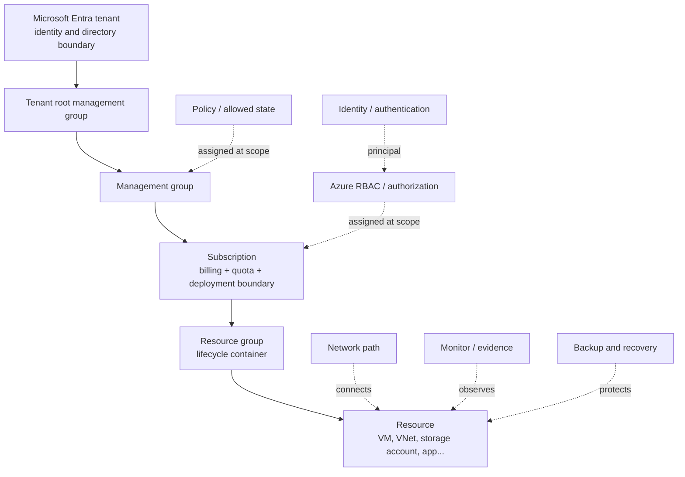

An Azure administrator repeatedly asks:

1. **Where is the object?** Tenant, management group, subscription, resource group, or resource.
2. **Who is acting?** User, group, service principal, or managed identity.
3. **What control decides?** Entra role, Azure RBAC, Policy, lock, network rule, or data-service authorization.
4. **What path does the request take?** DNS → route → security rule → endpoint → service.
5. **What evidence proves the result?** Activity Log, metric, resource log, effective rule, health probe, backup job, or recovery point.

## Scope controls are related, not interchangeable

| Control | Where it can apply | Inheritance/behavior | Question it answers |
|---|---|---|---|
| Microsoft Entra role | Tenant/directory scopes and directory objects | Directory authorization; does not ordinarily grant Azure resource access | Who can administer users, groups, and other directory objects? |
| Azure RBAC assignment | Management group → subscription → resource group → resource | Lower scopes inherit assignments from parent scopes | Who can perform which resource actions at which scope? |
| Azure Policy assignment | Management group → subscription → resource group → resource | Evaluates resources in assignment scope, subject to exclusions/exemptions | Which resource states are allowed, required, audited, or remediated? |
| Resource lock | Subscription, resource group, or resource | Child resources inherit the restrictive effect | Can control-plane updates or deletion proceed? |
| Tag | Subscription, resource group, or supported resource | **No automatic inheritance**; Policy can add/inherit tags | How is a resource classified for ownership, reporting, or cost? |
| Budget | Supported billing scope, subscription, or resource group | Tracks actual/forecast cost at configured scope | When should cost notifications or automation trigger? |
| Management group | Above subscriptions | Policy and RBAC assigned here can flow to child subscriptions | How should subscriptions be governed together? |

**Lifecycle rule:** A resource group should contain resources that share a lifecycle. Deleting the resource group deletes its contained resources. Resources can depend on objects in other resource groups, so inspect dependencies before deletion or movement. Tags placed on a resource group do not automatically appear on its resources.

**Control-plane rule:** Azure Resource Manager operations create/configure resources. A service's data plane reads or changes its data. An Owner or Contributor can manage a storage account but does not thereby receive a Blob Data role. A resource lock controls Resource Manager operations, not all data-plane operations.

**Official Microsoft sources:** [Azure Resource Manager overview](https://learn.microsoft.com/en-us/azure/azure-resource-manager/management/overview), [Azure RBAC scope](https://learn.microsoft.com/en-us/azure/role-based-access-control/scope-overview), [Azure Policy overview](https://learn.microsoft.com/en-us/azure/governance/policy/overview), [resource locks](https://learn.microsoft.com/en-us/azure/azure-resource-manager/management/lock-resources), [tag resources](https://learn.microsoft.com/en-us/azure/azure-resource-manager/management/tag-resources)

---

# Domain 1 — Manage Azure identities and governance (20–25%)

## Exact objective map

### Manage Microsoft Entra users and groups

- Create users and groups.
- Manage user and group properties.
- Manage licenses in Microsoft Entra ID.
- Manage external users.
- Configure self-service password reset (SSPR).

### Manage access to Azure resources

- Manage built-in Azure roles.
- Assign roles at different scopes.
- Interpret access assignments.

### Manage Azure subscriptions and governance

- Implement and manage Azure Policy.
- Configure resource locks.
- Apply and manage tags on resources.
- Manage resource groups.
- Manage subscriptions.
- Manage costs by using alerts, budgets, and Azure Advisor recommendations.
- Configure management groups.

## 1.1 Microsoft Entra administration

### Tenant, directory, identity, authentication, authorization

- A **Microsoft Entra tenant** is the identity and directory boundary associated with an organization.
- A **user** is a directory identity for a person. A **group** lets administrators assign access or licenses to a collection rather than one user at a time.
- **Authentication** proves an identity. **Authorization** determines what that authenticated identity may do.
- A subscription trusts one Entra tenant for authentication. The subscription/resource hierarchy is not the directory hierarchy.

Current workforce user classifications include internal member, internal guest, external member, and external guest. In routine AZ-104 scenarios, **member** means a normal tenant member; **guest** commonly represents an invited B2B collaborator. Do not infer authorization from the user type: grant the required role at the required scope.

### Create and manage users

**Portal workflow:** Microsoft Entra ID → Users → New user. Choose **Create new user** for a tenant-managed account or **Invite external user** for B2B collaboration. Configure identity, properties, groups, roles, and licenses only as required.

Administrative roles matter. Microsoft documents User Administrator as sufficient for many user lifecycle tasks, Guest Inviter for inviting guests, and Privileged Role Administrator for assigning Entra roles. Apply least privilege.

Typical verification:

- Confirm the account appears in **Users** with the expected user type and sign-in identity.
- Confirm group memberships and license assignment state.
- For a guest, confirm invitation/redemption state and the correct external identity.
- Confirm Azure resource access separately through Azure RBAC.

### Create and manage groups

| Decision | Choice |
|---|---|
| Control access to resources | Security group |
| Collaboration mailbox/calendar/SharePoint membership | Microsoft 365 group |
| Administrator explicitly maintains members | Assigned membership |
| Membership derives from user/device properties | Dynamic membership; verify licensing requirements |

Group-based licensing assigns or removes product licenses according to group membership. A licensing failure can be per-user—for example, conflicting plans or invalid usage location—so verify the user's license processing state rather than assuming group membership guarantees success.

### Manage licenses

The practical sequence is:

1. Ensure the tenant owns available licenses for the product.
2. Set required user properties, especially usage location when required.
3. Assign directly or through a group.
4. Verify service-plan and assignment status.
5. When removing group membership, understand that licenses inherited only from that group are removed; another assignment path can keep them.

### External users

External collaboration lets another organization's or social identity authenticate while your tenant controls access to your resources. Invite the external user, grant only necessary application/Azure resource access, and review it over time. Removing an Azure RBAC role does not delete the guest account; deleting the guest does not substitute for auditing every downstream authorization path.

### Configure SSPR

Self-service password reset lets enabled users reset or unlock their passwords after proving identity with configured authentication methods.

**Portal workflow:** Microsoft Entra ID → Password reset → Properties. Set SSPR to **None**, **Selected**, or **All**. In the portal, Selected targets one group; nested membership is supported. Then configure authentication methods, registration, notifications, and any required on-premises integration.

**MUST KNOW:**

- Scope answers **who may use SSPR**; authentication-method policy answers **how identity is verified**.
- Administrative accounts have special protection and must use two authentication methods under the documented administrator reset policy.
- Microsoft's legacy MFA and SSPR method policies reached their documented deprecation milestone on September 30, 2025. Use the Microsoft Entra **Authentication methods** policy for current deployments.
- Test with a normal target user and validate registration before declaring the deployment complete.

> [!WARNING]
> Do not select an authentication method merely because the user has it registered elsewhere. It must be enabled for the relevant population in the current policy and be valid for SSPR.

**Exam trap — identity object versus access:** Creating, inviting, licensing, or grouping a user does not by itself grant Azure resource access. The user must receive an applicable Azure role assignment directly or through group membership.

**Official Microsoft sources:** [create or delete users](https://learn.microsoft.com/en-us/entra/fundamentals/how-to-create-delete-users), [manage groups](https://learn.microsoft.com/en-us/entra/fundamentals/how-to-manage-groups), [Microsoft Entra user model](https://learn.microsoft.com/en-us/entra/identity/users/directory-overview-user-model), [enable SSPR](https://learn.microsoft.com/en-us/entra/identity/authentication/tutorial-enable-sspr), [plan SSPR](https://learn.microsoft.com/en-us/entra/identity/authentication/concept-sspr-deploy)

## 1.2 Azure RBAC: who can do what at which scope

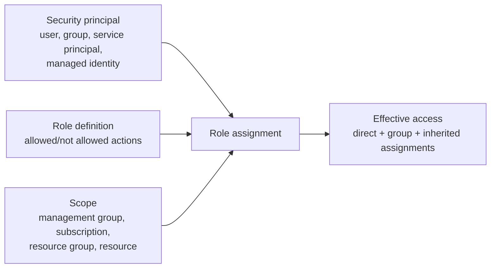

An Azure role assignment is the intersection of:

- **Who:** security principal.
- **Can do what:** role definition.
- **Where:** scope.

### Built-in roles you must distinguish

| Role | Use it when | It does not mean |
|---|---|---|
| Owner | Principal must manage resources **and** assign Azure roles | Tenant-wide directory administration |
| Contributor | Principal must create/manage resources but must not assign Azure roles | Data-plane access to every service |
| Reader | Principal needs control-plane read access | Read access to all protected service data |
| User Access Administrator | Principal must manage user access to Azure resources | General resource management |
| Role Based Access Control Administrator | Principal needs role-assignment administration under its defined permissions | Owner of all resources |

Use data-specific roles for data operations: for example, Storage Blob Data Reader or Storage Blob Data Contributor. The word **Data** is a valuable signal that the role includes the service's data actions.

### Scope and inheritance

An assignment at a parent scope applies at its child scopes:

```text
Management group
└── Subscription                 ← Reader here
    ├── Resource group A         ← inherited Reader
    │   └── VM 1                 ← inherited Reader
    └── Resource group B         ← inherited Reader + direct Contributor here
        └── Storage account 1    ← both applicable assignments
```

Assign at the **smallest scope that meets the requirement**. A subscription-level Contributor role is wrong when the user only administers one resource group, even though it technically permits the task.

### Interpret access assignments

When access is unexpected, enumerate all paths:

1. Direct assignment to the user.
2. Assignment to any group containing the user.
3. Assignment inherited from resource group, subscription, or management group.
4. Eligible/activated assignments if privileged identity features are in use.
5. A deny assignment or conditional constraint, if surfaced by the access evaluation.
6. Whether the attempted operation is control plane or data plane.

Use **Access control (IAM) → Check access** at the target scope and inspect role assignments and their scope. Role changes can require time for propagation and a refreshed token/session.

### Microsoft Entra roles versus Azure roles

| Requirement | Microsoft Entra role | Azure RBAC role |
|---|---:|---:|
| Create a user | Yes | No |
| Reset a user's password | Yes | No |
| Manage group membership | Yes | No |
| Create a VM in a resource group | No | Yes |
| Read a storage account's configuration | No | Yes |
| Assign an Azure role at a resource group | No | Yes |

Global Administrator does not automatically have access to Azure resources. Microsoft documents an elevation mechanism that grants the Global Administrator User Access Administrator at root scope so access can be recovered; elevation is powerful and should be removed when the task is finished.

### Configure and verify

**Portal:** target scope → Access control (IAM) → Add role assignment → choose job-function role → select member → review and assign.

**Azure CLI:**

```bash
# Resolve the exact scope/resource ID first.
scope=$(az group show --name rg-app-prod --query id --output tsv)

az role assignment create \
  --assignee-object-id <principal-object-id> \
  --assignee-principal-type Group \
  --role Reader \
  --scope "$scope"

az role assignment list \
  --assignee <principal-object-id> \
  --scope "$scope" \
  --include-inherited \
  --output table
```

**PowerShell:**

```powershell
$scope = (Get-AzResourceGroup -Name 'rg-app-prod').ResourceId
New-AzRoleAssignment -ObjectId '<principal-object-id>' -RoleDefinitionName 'Reader' -Scope $scope
Get-AzRoleAssignment -ObjectId '<principal-object-id>' -Scope $scope
```

> [!TIP]
> Prefer an immutable object ID in automation. A display name can be duplicated; a sign-in name can change.

**Exam trap — Owner versus Contributor:** Both manage resources, but only Owner includes role assignment capability. If the requirement is solely to manage access without broad resource control, examine User Access Administrator or Role Based Access Control Administrator.

**Official Microsoft sources:** [Azure RBAC overview](https://learn.microsoft.com/en-us/azure/role-based-access-control/overview), [scope overview](https://learn.microsoft.com/en-us/azure/role-based-access-control/scope-overview), [role assignments](https://learn.microsoft.com/en-us/azure/role-based-access-control/role-assignments), [built-in roles](https://learn.microsoft.com/en-us/azure/role-based-access-control/built-in-roles), [Azure roles and Entra roles](https://learn.microsoft.com/en-us/azure/role-based-access-control/rbac-and-directory-admin-roles), [Azure CLI role assignment](https://learn.microsoft.com/en-us/cli/azure/role/assignment), [Az PowerShell RBAC](https://learn.microsoft.com/en-us/azure/role-based-access-control/role-assignments-powershell)

## 1.3 Governance: Policy, locks, tags, groups, and subscriptions

### Policy: define and evaluate allowed resource state

| Policy concept | Meaning |
|---|---|
| Definition | Rule and effect that describe a desired/forbidden resource state |
| Initiative | Collection of policy definitions managed and assigned as a unit |
| Assignment | Applies a definition or initiative at a scope |
| Exclusion (`notScopes`) | Removes child scopes from an assignment's evaluation scope |
| Exemption | Records why an otherwise in-scope resource hierarchy is exempt |
| Compliance | Evaluation result against applicable assignments |
| Remediation | Task used to bring supported existing resources into compliance, commonly with `modify` or `deployIfNotExists` |

Important effects:

- `audit`: allows the operation and records noncompliance.
- `deny`: blocks a noncompliant create/update request and returns a forbidden response; existing resources are evaluated as noncompliant rather than magically deleted.
- `append`: adds fields during create/update under supported conditions.
- `modify`: adds, updates, or removes supported properties/tags and can remediate existing resources.
- `auditIfNotExists`: audits when a related resource/property is absent.
- `deployIfNotExists`: triggers a deployment when a related resource/configuration is absent; assignment needs a managed identity and suitable role permissions for remediation.
- `disabled`: turns off evaluation of the definition in that assignment.

Policy evaluation is not a replacement for authorization. RBAC may authorize a user to create a public IP, while Policy denies public IP creation at that scope. Both controls must allow the operation.

**Portal workflow:** Policy → Definitions/Initiatives to inspect the rule → Assignments → Assign policy/initiative → choose scope and exclusions → configure parameters/remediation/managed identity → review compliance.

**CLI recognition:**

```bash
az policy assignment create \
  --name require-location \
  --display-name 'Require approved location' \
  --policy <policy-definition-id> \
  --scope <scope-resource-id> \
  --params '{"listOfAllowedLocations":{"value":["eastus","westus2"]}}'

az policy state list --resource <resource-id> --output table
```

Verify the current command reference and definition parameter names before production use; policy definitions do not share one universal parameter schema.

### Policy versus RBAC versus lock

| Signal | Choose | Reason |
|---|---|---|
| “Only the operations team may change VNets” | Azure RBAC | Authorizes principals and actions |
| “VNets may be created only in approved regions” | Azure Policy | Governs resource configuration |
| “Audit resources without required diagnostic settings” | Azure Policy | Evaluates desired state; an initiative can group controls |
| “Prevent accidental deletion of this production VNet” | `CanNotDelete` lock | Blocks delete at control plane |
| “Prevent control-plane change and deletion” | `ReadOnly` lock | Allows reads but blocks control-plane writes |

### Resource locks

- `CanNotDelete`: authorized users can modify the resource but cannot delete it until the lock is removed.
- `ReadOnly`: authorized users can read but cannot update or delete it. Operations implemented as POST/write can fail unexpectedly under a read-only lock.
- A lock at a parent scope applies to child resources. The most restrictive applicable lock wins.
- Locks do not replace RBAC. A user needs `Microsoft.Authorization/locks/*` or equivalent permissions to create/delete locks.
- Locks apply to the **control plane**, not every data-plane action. A lock on a storage account does not prevent deletion of blob data through the blob data plane.
- Management groups do not support resource locks.

**Portal:** subscription/resource group/resource → Locks → Add. Give it a descriptive name and choose the least restrictive lock that meets the requirement.

```bash
az lock create \
  --name protect-prod \
  --lock-type CanNotDelete \
  --resource-group rg-prod

az lock list --resource-group rg-prod --output table
```

### Tags

Tags are key/value metadata for organization, reporting, cost, ownership, and automation. Apply tags to subscriptions, resource groups, and supported resources—not management groups.

**MUST KNOW:**

- Tags do **not** automatically inherit from resource group or subscription.
- Use Azure Policy when the requirement says “inherit,” “require,” “append,” or “remediate” a tag.
- Do not place secrets or sensitive data in tags.
- Tag names are case-insensitive for operations; tag values are case-sensitive.
- Some resource types do not support tags. Confirm support before using a tag-dependent design.

```bash
az tag update \
  --resource-id <resource-id> \
  --operation Merge \
  --tags Environment=Production CostCenter=CC100
```

### Resource groups and moves

Moving supported resources between resource groups or subscriptions changes their Resource Manager IDs. The source and destination subscriptions must be in the same Microsoft Entra tenant for a subscription move. During a move, source and destination resource groups are locked for write/delete operations, while the resources remain operational. Child resources can move automatically with a listed top-level resource, but dependencies and provider-specific limitations must be checked.

A resource-group/subscription move does **not** move the physical resource to another Azure region. For supported cross-region moves, use the service-specific procedure or Azure Resource Mover and follow its prepare, initiate, and commit flow.

Before a move:

1. Read the [move-operation support list](https://learn.microsoft.com/en-us/azure/azure-resource-manager/management/move-support-resources).
2. Validate dependencies and quota in the destination.
3. Remove blocking read-only locks when the operation requires it.
4. Find scripts, RBAC assignments, Policy assignments, diagnostics, or integrations that embed old resource IDs.
5. Validate and then move; update dependent references afterward.

### Management groups and subscriptions

Management groups provide a governance hierarchy above subscriptions. Assigning Policy or RBAC to a management group lets it apply to descendant subscriptions. The tenant root management group sits at the top. Design a shallow hierarchy around governance needs, not an org chart that changes every month.

A subscription is a resource-management and billing boundary with its own quotas. Moving a subscription to a different management group changes the policies and inherited access that apply—evaluate the effective result before moving it.

### Cost management, budgets, alerts, and Advisor

- **Cost analysis** explores incurred and forecast cost by scope, service, resource, tags, and other dimensions.
- A **budget** compares actual or forecast cost/usage with thresholds and sends notifications or can invoke a configured action group at supported scopes.
- A budget does **not by itself stop resources or cap spending**. Any response action is separate automation and must be designed safely.
- **Cost alerts** present budget, credit, department-spending, and other supported alert types according to the agreement/account.
- **Azure Advisor** provides personalized recommendations, including ways to optimize cost and improve reliability, security, performance, or operational excellence where applicable.

Scenario pattern: “Notify the owner at 80% and the operations action group at forecast 100%” → create a budget with the corresponding actual/forecast thresholds and recipients/action group. “Automatically turn off every production VM at threshold” is not an inherent budget behavior and requires carefully authorized automation.

**Official Microsoft sources:** [Azure Policy](https://learn.microsoft.com/en-us/azure/governance/policy/), [Policy definition structure](https://learn.microsoft.com/en-us/azure/governance/policy/concepts/definition-structure-basics), [deny effect](https://learn.microsoft.com/en-us/azure/governance/policy/concepts/effect-deny), [compliance states](https://learn.microsoft.com/en-us/azure/governance/policy/concepts/compliance-states), [resource locks](https://learn.microsoft.com/en-us/azure/azure-resource-manager/management/lock-resources), [tags](https://learn.microsoft.com/en-us/azure/azure-resource-manager/management/tag-resources), [tag policies](https://learn.microsoft.com/en-us/azure/azure-resource-manager/management/tag-policies), [move resources](https://learn.microsoft.com/en-us/azure/azure-resource-manager/management/move-resource-group-and-subscription), [management groups](https://learn.microsoft.com/en-us/azure/governance/management-groups/overview), [create budgets](https://learn.microsoft.com/en-us/azure/cost-management-billing/costs/tutorial-acm-create-budgets), [cost alerts](https://learn.microsoft.com/en-us/azure/cost-management-billing/costs/cost-mgt-alerts-monitor-usage-spending), [Azure Advisor](https://learn.microsoft.com/en-us/azure/advisor/advisor-overview)

## 1.4 Domain 1 operational playbook

| Task | Configure | Verify | If it fails |
|---|---|---|---|
| Give team read access to one RG | Assign Reader to a security group at RG scope | IAM → Check access; include inherited | Check correct tenant/object ID, group membership, propagation/token, deny assignment |
| Enforce a required tag | Assign `modify`/appropriate built-in policy with managed identity | Policy compliance and remediation task | Check assignment scope, exclusions, effect, permissions, evaluation timing |
| Prevent deletion but allow changes | `CanNotDelete` lock | List locks at resource and parents | Check inherited lock and user's lock permissions |
| Invite a partner | Invite external user; grant least access separately | Invitation state, group/RBAC assignment | Verify redemption identity and cross-tenant settings if applicable |
| Enable password reset for pilot | SSPR Selected → pilot group; enable methods | Test registration and reset as pilot user | Check license, scope, method policy, registration, on-prem writeback if used |
| Alert on cost | Budget with actual/forecast thresholds | Budget alert history and recipient/action group | Check scope, threshold, recipients, action group and data delay |

## 1.5 Domain 1 mini quiz

### Question 1

A developer must create and manage resources in `rg-api-dev` but must not assign roles. What is the least-privilege choice?

A. Owner at subscription scope  
B. Contributor at `rg-api-dev` scope  
C. Global Administrator  
D. User Access Administrator at resource scope

<details>
<summary>Answer</summary>

**Correct answer:** B.

**Why:** Contributor can manage resources but not assign Azure roles, and RG scope confines access to the required resource group.

**Why alternatives are wrong:** Owner and subscription scope are excessive; Global Administrator is a directory role; User Access Administrator manages access rather than application resources.

**Exam objective:** Manage built-in Azure roles; assign roles at different scopes.  
**Official Microsoft source:** [Azure built-in roles](https://learn.microsoft.com/en-us/azure/role-based-access-control/built-in-roles)

</details>

### Question 2

All resources in selected subscriptions must contain a `CostCenter` tag, including existing resources. Which feature is the design center?

A. Reader role  
B. Resource group tags only  
C. Azure Policy with an appropriate effect and remediation  
D. `CanNotDelete` lock

<details>
<summary>Answer</summary>

**Correct answer:** C.

**Why:** Policy evaluates configuration and a supported `modify` policy plus remediation can correct existing resources. Tags do not automatically inherit.

**Why alternatives are wrong:** RBAC authorizes actors; an RG tag does not propagate; a lock prevents operations rather than enforcing metadata.

**Exam objective:** Implement and manage Azure Policy; apply and manage tags.  
**Official Microsoft source:** [Assign policy definitions for tag compliance](https://learn.microsoft.com/en-us/azure/azure-resource-manager/management/tag-policies)

</details>

### Question 3

Operations must update a production storage account but must be unable to delete it accidentally. What should be applied?

A. `ReadOnly` lock  
B. `CanNotDelete` lock  
C. Reader role  
D. Deny all Policy assignment

<details>
<summary>Answer</summary>

**Correct answer:** B.

**Why:** `CanNotDelete` blocks deletion while still permitting authorized modification.

**Why alternatives are wrong:** `ReadOnly` also blocks updates; Reader removes write authorization rather than protecting against all authorized deleters; a broad deny policy does not express the narrow requirement.

**Exam objective:** Configure resource locks.  
**Official Microsoft source:** [Lock Azure resources](https://learn.microsoft.com/en-us/azure/azure-resource-manager/management/lock-resources)

</details>

### Question 4

A user is Contributor on a storage account but receives authorization failure while reading private blobs in the portal. What should be checked first?

A. Whether the user has a Storage Blob Data role  
B. Whether the user is Global Administrator  
C. Whether the account has a delete lock  
D. Whether the resource group has a tag

<details>
<summary>Answer</summary>

**Correct answer:** A.

**Why:** Contributor grants management-plane resource control but does not inherently grant blob data actions.

**Why alternatives are wrong:** Directory administration, a delete lock, and a tag do not grant blob data authorization.

**Exam objective:** Interpret access assignments.  
**Official Microsoft source:** [Authorize access to data in Azure Storage](https://learn.microsoft.com/en-us/azure/storage/common/authorize-data-access)

</details>

### Question 5

The finance team must be notified when forecast monthly cost reaches a threshold. No resources should automatically stop. What should you configure?

A. A budget with a forecast threshold and recipients  
B. An NSG rule  
C. A read-only lock  
D. A reservation

<details>
<summary>Answer</summary>

**Correct answer:** A.

**Why:** Budgets support actual/forecast thresholds and notifications. They do not inherently stop resources.

**Exam objective:** Manage costs by using alerts and budgets.  
**Official Microsoft source:** [Create and manage budgets](https://learn.microsoft.com/en-us/azure/cost-management-billing/costs/tutorial-acm-create-budgets)

</details>

### Question 6

An administrator moves a VM between resource groups in the same region. What should automation owners expect?

A. The VM must move physically to a new region  
B. The resource ID can change and dependent references may need updates  
C. The VM automatically changes tenant  
D. All locks are ignored

<details>
<summary>Answer</summary>

**Correct answer:** B.

**Why:** A resource group move is a Resource Manager hierarchy change; resource IDs change. It is not a physical regional move.

**Why alternatives are wrong:** Region and tenant do not automatically change, and locks can block moves.

**Exam objective:** Manage resource groups and subscriptions.  
**Official Microsoft source:** [Move resources to a new resource group or subscription](https://learn.microsoft.com/en-us/azure/azure-resource-manager/management/move-resource-group-and-subscription)

</details>

---

# Domain 2 — Implement and manage storage (15–20%)

## Exact objective map

### Configure access to storage

- Configure Azure Storage firewalls and virtual networks.
- Create and use shared access signature (SAS) tokens.
- Configure stored access policies.
- Manage access keys.
- Configure identity-based access for Azure Files.

### Configure and manage storage accounts

- Create and configure storage accounts.
- Configure Azure Storage redundancy.
- Configure object replication.
- Configure storage account encryption.
- Manage data by using Azure Storage Explorer and AzCopy.

### Configure Azure Files and Azure Blob Storage

- Create and configure an Azure file share.
- Create and configure a container in Blob Storage.
- Configure storage tiers.
- Configure soft delete for blobs and containers.
- Configure snapshots and soft delete for Azure Files.
- Configure Blob Storage lifecycle management.
- Configure Blob Storage versioning.

## 2.1 Storage mental model

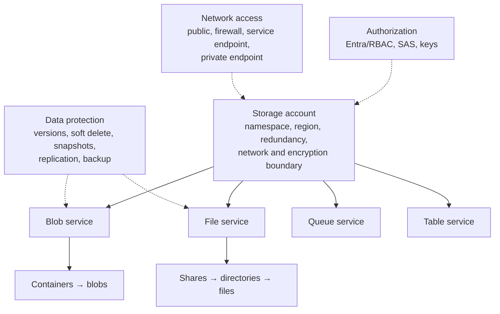

Troubleshoot storage in layers:

1. **Correct endpoint and service?** Blob, File, Queue, or Table.
2. **Network allowed?** Public network setting, firewall, VNet rule, private endpoint, DNS.
3. **Authenticated how?** Entra token, SAS, or account key.
4. **Authorized for which action and scope?** Data role/SAS permissions and resource scope.
5. **Does the object exist in an accessible state/tier?** Container/share, path, version, Archive status.

## 2.2 Create and configure storage accounts

### Account type, performance, namespace, and endpoints

For most general scenarios, Microsoft recommends a **Standard general-purpose v2 (StorageV2)** account. It supports Blob, Files, Queue, and Table with broad features. Premium account types target particular workloads: premium block blobs, premium file shares, or premium page blobs. The account kind cannot simply be treated as a per-object setting; choose it from the service and performance requirement before deployment.

The account name becomes part of globally addressable service endpoints and must meet the current naming rules. Typical endpoint shapes are:

```text
https://<account>.blob.core.windows.net
https://<account>.file.core.windows.net
https://<account>.queue.core.windows.net
https://<account>.table.core.windows.net
```

**Portal workflow:** Storage accounts → Create → choose subscription/resource group, unique name, region, performance, redundancy, networking, data protection, encryption, tags → review and create. Then validate each selected service under **Data storage** and the endpoint/network configuration under **Security + networking**.

```bash
az storage account create \
  --name <globally-unique-name> \
  --resource-group rg-data-prod \
  --location eastus \
  --sku Standard_ZRS \
  --kind StorageV2 \
  --https-only true \
  --min-tls-version TLS1_2

az storage account show \
  --name <account-name> \
  --resource-group rg-data-prod \
  --query '{kind:kind,sku:sku.name,publicNetworkAccess:publicNetworkAccess}'
```

### Redundancy: choose the failure boundary

| Option | Primary-region copies | Secondary region | Read secondary before failover | Choose when |
|---|---|---|---|---|
| LRS | Multiple synchronous copies in one physical datacenter | No | No | Lowest-cost durability for data that can tolerate datacenter-level exposure or has other protection |
| ZRS | Synchronous copies across three or more availability zones in the primary region | No | No | Must tolerate a zone failure without regional replication |
| GRS | LRS in primary; asynchronous replication to LRS in paired/secondary region | Yes | No | Regional durability is required; application need not read secondary normally |
| RA-GRS | Same replication pattern as GRS | Yes | Yes | Application must read the secondary endpoint before failover |
| GZRS | ZRS in primary; asynchronous replication to LRS in secondary | Yes | No | Zone availability in primary plus regional durability |
| RA-GZRS | Same replication pattern as GZRS | Yes | Yes | Zone availability plus readable secondary |

**MUST KNOW:**

- Geo-replication is asynchronous, so a regional disaster can cause loss of writes not yet replicated. It is not zero-RPO synchronous cross-region storage.
- `RA-` means **read access** to the secondary endpoint before an account failover; it does not make application failover automatic.
- Redundancy is generally chosen at the storage-account level, not independently for every blob.
- Current documentation says Azure Files does not support read-access geo-redundant modes as a readable secondary share.
- Archive tier support and redundancy combinations are constrained. The current documentation lists Archive with LRS, GRS, and RA-GRS, not ZRS/GZRS/RA-GZRS. Verify current support when a scenario combines them.

### Encryption

Azure Storage encrypts data at rest by default with Microsoft-managed keys. Choose customer-managed keys (CMK) in Azure Key Vault or Managed HSM when the organization must control key lifecycle and access. That choice creates operational dependencies: key permissions, key availability, identity, rotation, and protection against deletion.

Encryption layers to recognize:

- **Service-side encryption:** default encryption at rest.
- **Customer-managed key:** organization controls the key used by Storage encryption.
- **Infrastructure encryption:** an additional encryption layer for supported configurations.
- **Encryption in transit:** require secure transfer and an appropriate minimum TLS version; this is separate from at-rest key selection.

When diagnosing a CMK failure, check the account's assigned identity, Key Vault/Managed HSM authorization, key enabled/expiry state, network reachability where relevant, and accidental key deletion. Do not solve an at-rest key problem by changing an NSG on an unrelated client.

**Official Microsoft sources:** [storage account overview](https://learn.microsoft.com/en-us/azure/storage/common/storage-account-overview), [storage redundancy](https://learn.microsoft.com/en-us/azure/storage/common/storage-redundancy), [Storage encryption](https://learn.microsoft.com/en-us/azure/storage/common/storage-service-encryption), [customer-managed keys](https://learn.microsoft.com/en-us/azure/storage/common/customer-managed-keys-overview), [Azure CLI storage account](https://learn.microsoft.com/en-us/cli/azure/storage/account)

## 2.3 Storage authorization and delegation

### Identity/RBAC versus SAS versus access key

| Method | Identity/scope model | Expiration/revocation | Use when | Primary risk/trap |
|---|---|---|---|---|
| Microsoft Entra + Azure RBAC | Named principal receives a data role at a scope | Remove/alter role or identity; token lifetime also applies | Preferred for users, apps, and managed identities when supported | A management role such as Contributor is not necessarily a data role |
| User delegation SAS | SAS is secured with Entra credentials and constrained to permissions/resource/time | Expires; revocation follows user-delegation-key/authorization mechanisms | Delegate limited Blob/Data Lake access without signing with account key | Treat token as a secret; possession grants its encoded access |
| Service SAS | Signed with account key; targets one storage service/resource scope | Expiry; if bound to stored access policy, change/delete policy; otherwise key regeneration is coarse revocation | A client needs limited delegated access to one service | Ad hoc service SAS is hard to revoke individually |
| Account SAS | Signed with account key; can span one or more storage services and service-level operations | Expiry or regenerate signing key | A narrowly controlled requirement spans supported services/operations | Broad blast radius; no stored access policy |
| Account access key | Shared secret effectively authorizes account access according to protocol/tool | Regenerate key and update clients | Legacy/emergency compatibility where Entra/SAS is unsuitable | Very broad; rotation affects all clients using that key |

**Recommended reasoning:** use identity-based authorization when possible; use the narrowest SAS when delegation is necessary; protect account keys as high-impact secrets.

### SAS anatomy and security

A SAS encodes a resource/service scope, allowed operations, start/expiry time, protocol/IP constraints when configured, and a signature. The service validates it; the token holder does not need the signing key.

- Generate with least permissions and shortest useful lifetime.
- Prefer HTTPS-only.
- Do not log, email, or commit the token. The query string is a credential.
- Azure Storage does not provide a universal list of every issued SAS token. Maintain issuance governance in the application/process.
- Clock skew can affect a SAS whose start time is exactly “now”; follow the current Microsoft guidance used by the generating tool/API.

### Stored access policies

A stored access policy is defined on a blob container, file share, queue, or table and can supply constraints for a **service SAS**. Updating or deleting the policy can affect service SAS tokens linked to it, making group revocation/changes practical.

It does not apply to account SAS or user delegation SAS. If the requirement says “change expiry or revoke multiple service SAS grants without regenerating the account key,” think **stored access policy**.

### Manage access keys safely

Storage accounts expose two keys so clients can be rotated without a coordinated outage:

1. Determine which clients use key1 and key2.
2. Move all clients from key1 to key2.
3. Regenerate key1.
4. Move clients to the regenerated key1 if desired.
5. Regenerate key2 after confirming no clients use the old value.

Regenerating a key invalidates SAS tokens signed with that key. This can be useful for emergency revocation but is disruptive. Prefer Key Vault and identity-based access over embedding keys.

### Identity-based access for Azure Files

Azure Files supports identity-based authentication for **SMB** through documented directory sources including on-premises Active Directory Domain Services, Microsoft Entra Domain Services, and Microsoft Entra Kerberos for hybrid identities. Configuration has two authorization layers:

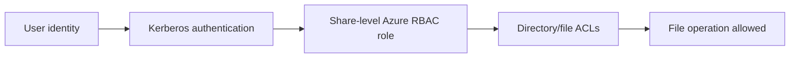

1. Enable and configure one supported identity source on the storage account.
2. Assign an Azure Files data role at the share/account scope as appropriate.
3. Configure directory/file ACLs.
4. Mount from a joined/eligible client and test as the user.

Passing only one authorization layer is insufficient. A user can have a share-level role but be denied by an NTFS ACL, or have an ACL but lack share-level authorization.

**Official Microsoft sources:** [authorize Storage data](https://learn.microsoft.com/en-us/azure/storage/common/authorize-data-access), [SAS overview](https://learn.microsoft.com/en-us/azure/storage/common/storage-sas-overview), [stored access policy](https://learn.microsoft.com/en-us/rest/api/storageservices/define-stored-access-policy), [manage account access keys](https://learn.microsoft.com/en-us/azure/storage/common/storage-account-keys-manage), [Azure Files identity-based authentication](https://learn.microsoft.com/en-us/azure/storage/files/storage-files-active-directory-overview), [enable an identity source for Azure Files](https://learn.microsoft.com/en-us/azure/storage/files/storage-files-identity-auth-domain-services-enable)

## 2.4 Storage network security

Authentication and network authorization are independent gates. A valid key/SAS/token still fails if the request cannot reach an allowed endpoint.

| Design | Endpoint address | What is restricted | DNS consequence | Best fit |
|---|---|---|---|---|
| Public endpoint, all networks | Public | Authorization only | Public service DNS | Public reachability is acceptable and auth is sufficient |
| Public endpoint + firewall/IP rule | Public | Allowed public source IP/ranges or trusted exceptions | Public service DNS | Known public egress addresses must reach service |
| Service endpoint + storage VNet rule | Public service endpoint | Storage firewall trusts selected subnet identity; traffic uses optimized Azure route | Service name still resolves to public IP | Azure subnet should securely access service public endpoint |
| Private endpoint | Private IP in consumer VNet | Private Link connection to a particular service subresource | Service FQDN must resolve to private endpoint IP from clients | PaaS access must use a private VNet/on-premises path |

### Storage firewall workflow

**Portal:** storage account → Networking → Public network access. Select allowed networks, configure VNet/subnet and/or public IP rules, and review resource-instance or trusted-service exceptions only if the workload requires them.

For a VNet rule, the subnet normally has the corresponding Microsoft.Storage service endpoint. The firewall still requires a data authorization method. Do not assume a service endpoint grants permissions.

For a private endpoint:

1. Choose the correct storage **subresource** (`blob`, `file`, and so on).
2. Place the private endpoint NIC in an address-capable subnet.
3. Approve the connection if the workflow requires approval.
4. Integrate the appropriate private DNS zone and link it to client VNets.
5. Validate the account FQDN resolves to the private IP from the client.
6. Disable/restrict public network access if the requirement demands private-only access; creating a private endpoint alone does not inherently disable the public endpoint.

> [!NOTE]
> One private endpoint for the blob subresource does not supply a file-service private endpoint. Create endpoints/DNS for every service subresource the application uses.

**Official Microsoft sources:** [Storage network security](https://learn.microsoft.com/en-us/azure/storage/common/storage-network-security), [Storage private endpoints](https://learn.microsoft.com/en-us/azure/storage/common/storage-private-endpoints), [service endpoint overview](https://learn.microsoft.com/en-us/azure/virtual-network/virtual-network-service-endpoints-overview), [private endpoint overview](https://learn.microsoft.com/en-us/azure/private-link/private-endpoint-overview)

## 2.5 Blob Storage

### Containers, blobs, and access

A blob container groups blobs inside a storage account. Create a container, keep anonymous access disabled unless the documented requirement explicitly needs it and the account permits it, then grant data-plane access at the narrowest suitable scope.

```bash
# Identity-based data operation; requires an applicable Blob Data role.
az storage container create \
  --account-name <account-name> \
  --name appdata \
  --auth-mode login

az storage blob upload \
  --account-name <account-name> \
  --container-name appdata \
  --name releases/app.zip \
  --file ./app.zip \
  --auth-mode login
```

### Access tiers

| Tier | Online? | Documented minimum retention consideration | Choose for | Operational consequence |
|---|---:|---:|---|---|
| Hot | Yes | None in the tier comparison | Frequent reads/writes | Higher storage cost, lower access cost relative to cooler tiers |
| Cool | Yes | 30 days | Infrequent access but immediate retrieval | Early deletion charge can apply |
| Cold | Yes | 90 days | Rare access but immediate retrieval | Lower storage/higher access; longer minimum duration |
| Archive | No | 180 days | Long-term data that can tolerate rehydration delay | Blob must be rehydrated to an online tier before normal read; rehydration can take hours |

These tiers apply to supported block-blob configurations. Lifecycle management can transition eligible blobs among supported tiers and delete them based on age/conditions. It cannot be treated as an instant rehydration engine for archived data.

### Versioning, soft delete, container soft delete

| Protection | Protects against | Restore model | Does not replace |
|---|---|---|---|
| Blob versioning | Overwrite/update by automatically retaining earlier versions | Promote/copy a previous version | Retention governance or storage-account deletion protection |
| Blob soft delete | Deletion/overwrite of blobs, versions, and snapshots according to configured retention | Undelete/select recoverable object | Container soft delete and backup |
| Container soft delete | Deleted containers and contents during retention | Restore container | Blob versioning for each mutation |
| Resource lock on account | Control-plane deletion/change according to lock type | Remove lock, then operate | Blob data-plane protection |

Blob versioning is not supported for accounts with hierarchical namespace enabled according to the current versioning documentation. Do not assume every Blob feature combination is universal.

### Lifecycle management

A lifecycle policy contains rules with filters and actions. Typical logic:

```text
IF base blobs match prefix/tags/type
AND age condition is met
THEN move to Cool/Cold/Archive or delete
```

Plan interactions with versions and snapshots explicitly. A rule for base blobs does not automatically express the intended retention for previous versions/snapshots. Test policy filters on non-production data and remember policy execution is asynchronous, not an immediate transaction.

### Object replication

Object replication asynchronously copies supported block blobs between a source and destination account. Current prerequisites include blob versioning on source and destination and change feed on the source. Create a replication policy, pair source/destination containers, and verify replication status.

Use it to keep object copies in another account/region and enable distribution or recovery patterns. Do not describe asynchronous object replication as a synchronous write or as an automatic application failover mechanism. Review the current limitations for account type, tier, encryption, and feature combinations before design.

**Official Microsoft sources:** [Blob access tiers](https://learn.microsoft.com/en-us/azure/storage/blobs/access-tiers-overview), [blob soft delete](https://learn.microsoft.com/en-us/azure/storage/blobs/soft-delete-blob-overview), [container soft delete](https://learn.microsoft.com/en-us/azure/storage/blobs/soft-delete-container-overview), [blob versioning](https://learn.microsoft.com/en-us/azure/storage/blobs/versioning-overview), [lifecycle management](https://learn.microsoft.com/en-us/azure/storage/blobs/lifecycle-management-overview), [object replication](https://learn.microsoft.com/en-us/azure/storage/blobs/object-replication-overview)

## 2.6 Azure Files

Azure Files provides managed file shares accessible through documented SMB and NFS protocols. Choose it when applications/users require file-system semantics or shared file protocols. Choose Blob Storage for object access through REST/client libraries and object lifecycle/tiering behavior.

### Create and configure a share

**Portal:** storage account → Data storage → File shares → File share. Choose a supported tier/performance model and quota, then configure identity/networking/data protection as required.

```bash
az storage share-rm create \
  --resource-group rg-data-prod \
  --storage-account <account-name> \
  --name sharedcontent \
  --quota 100
```

Confirm exact protocol, redundancy, and tier compatibility in the [Azure Files planning guide](https://learn.microsoft.com/en-us/azure/storage/files/storage-files-planning) before deployment.

### Share snapshots, soft delete, and backup

- A **share snapshot** is a point-in-time, read-only copy of share content. It supports restoring individual files/directories or the share content while sharing the account's redundancy characteristics.
- **Soft delete for file shares** retains a deleted share for a configured period so it can be recovered.
- **Azure Backup for Azure Files** adds policy, recovery-point management, monitoring, and restore workflows for supported configurations.

Deletion of one file is not the same event as deletion of the whole share. Design snapshots/backup for file-content recovery and soft delete for deleted-share protection.

**Official Microsoft sources:** [Azure Files introduction](https://learn.microsoft.com/en-us/azure/storage/files/storage-files-introduction), [create an SMB file share](https://learn.microsoft.com/en-us/azure/storage/files/storage-how-to-create-file-share), [share snapshots](https://learn.microsoft.com/en-us/azure/storage/files/storage-snapshots-files), [Azure Files data protection](https://learn.microsoft.com/en-us/azure/storage/files/files-data-protection-overview)

## 2.7 Storage Explorer and AzCopy

| Tool | Choose it when | Authentication | Important check |
|---|---|---|---|
| Azure Storage Explorer | Administrator needs a cross-platform GUI to browse/manage accounts, containers, shares, queues, tables, and data | Entra sign-in, SAS, account key, or supported attachment method | Management-tree visibility and data access can require different permissions |
| AzCopy v10 | Need scriptable, high-performance copy/sync between local and Azure Storage or between supported Azure endpoints | Entra or SAS for supported operations | Source/destination authorization, SAS scope/expiry, and direction |

Representative AzCopy patterns:

```bash
azcopy login
azcopy copy './data/*' 'https://<account>.blob.core.windows.net/appdata' --recursive
azcopy copy 'https://<source>/<path>?<sas>' 'https://<destination>/<path>?<sas>' --recursive
```

Do not paste a SAS from production into shell history or documentation. Use the current [AzCopy v10 command reference](https://learn.microsoft.com/en-us/azure/storage/common/storage-ref-azcopy) for exact flags and service support.

**Official Microsoft sources:** [Storage Explorer](https://learn.microsoft.com/en-us/azure/storage/storage-explorer/vs-azure-tools-storage-manage-with-storage-explorer), [AzCopy v10](https://learn.microsoft.com/en-us/azure/storage/common/storage-use-azcopy-v10)

## 2.8 Domain 2 operational playbook

| Symptom/requirement | Think in this order | Likely action |
|---|---|---|
| 403 reading blob | Endpoint/network → auth method → Blob Data role/SAS scope/expiry → object path | Fix the failing gate; Contributor alone is not blob read access |
| Need to revoke issued delegated links together | SAS type → stored policy association | Use service SAS tied to a stored access policy; update/delete policy |
| Need private IP to Storage | Correct subresource PE → approval → private DNS → public access policy | Create private endpoint and DNS integration; restrict public endpoint if required |
| User can mount share but cannot open folder | Share data role → identity source → ACL | Correct the missing share-level role or file/directory ACL |
| Recover overwritten blob | Versioning/soft-delete state and retention | Restore/promote prior version or undelete within retention |
| Survive zone failure | Current service/account compatibility | Choose ZRS or GZRS family, not LRS/GRS primary LRS |
| Read from secondary before outage | Geo redundancy choice and app endpoint | Choose supported `RA-` redundancy and use secondary endpoint |

## 2.9 Domain 2 mini quiz

### Question 1

An application in a VNet must access Blob Storage through a private IP. The storage public endpoint must not be the application path. What should you configure?

A. Storage account access key only  
B. Service endpoint only  
C. Private endpoint for `blob` plus private DNS integration  
D. A public load balancer

<details>
<summary>Answer</summary>

**Correct answer:** C.

**Why:** A private endpoint maps the Blob subresource to a private IP through Private Link; DNS must direct the service FQDN there.

**Why alternatives are wrong:** A key is authorization, not network topology; a service endpoint still addresses the public service endpoint; Load Balancer does not privatize Storage.

**Exam objective:** Configure Storage firewalls and virtual networks.  
**Official Microsoft source:** [Use private endpoints for Azure Storage](https://learn.microsoft.com/en-us/azure/storage/common/storage-private-endpoints)

</details>

### Question 2

Clients need time-limited access to one blob container. Administrators must later revoke the whole issued set without regenerating the account key. Which design fits?

A. Give every client the account key  
B. Service SAS associated with a stored access policy  
C. Account SAS with no expiry  
D. Contributor at subscription scope

<details>
<summary>Answer</summary>

**Correct answer:** B.

**Why:** A stored access policy can govern service SAS constraints and provides a policy-level revocation/change mechanism.

**Why alternatives are wrong:** Keys/account SAS are broader; an Azure management role is not a delegated blob token.

**Exam objective:** Create/use SAS; configure stored access policies.  
**Official Microsoft source:** [Grant limited access with SAS](https://learn.microsoft.com/en-us/azure/storage/common/storage-sas-overview)

</details>

### Question 3

A workload must remain available through a primary-region zone failure and also retain asynchronous data in a secondary region. Normal reads from the secondary are not required. Which family best matches?

A. LRS  
B. ZRS  
C. GRS  
D. GZRS

<details>
<summary>Answer</summary>

**Correct answer:** D.

**Why:** GZRS uses zone-redundant storage in the primary and asynchronously replicates to a secondary region.

**Why alternatives are wrong:** LRS lacks zone/regional protection; ZRS lacks secondary region; GRS primary is locally redundant rather than zone redundant.

**Exam objective:** Configure Azure Storage redundancy.  
**Official Microsoft source:** [Azure Storage redundancy](https://learn.microsoft.com/en-us/azure/storage/common/storage-redundancy)

</details>

### Question 4

A file-share user has the correct Azure Files share-level data role but is denied access to one directory. What is the next authorization layer to inspect?

A. Blob lifecycle policy  
B. File/directory ACL  
C. Blob container public access  
D. VM availability set

<details>
<summary>Answer</summary>

**Correct answer:** B.

**Why:** Identity-based SMB access evaluates share-level authorization and then directory/file ACLs.

**Exam objective:** Configure identity-based access for Azure Files.  
**Official Microsoft source:** [Azure Files identity-based authentication](https://learn.microsoft.com/en-us/azure/storage/files/storage-files-active-directory-overview)

</details>

### Question 5

Data is normally untouched for years, and retrieval may take hours. Which blob tier is designed for this pattern?

A. Hot  
B. Cool  
C. Cold  
D. Archive

<details>
<summary>Answer</summary>

**Correct answer:** D.

**Why:** Archive is offline and optimized for long-term, rarely accessed data where rehydration latency is acceptable.

**Why alternatives are wrong:** Hot, Cool, and Cold are online tiers intended for different access frequencies.

**Exam objective:** Configure storage tiers.  
**Official Microsoft source:** [Access tiers for blob data](https://learn.microsoft.com/en-us/azure/storage/blobs/access-tiers-overview)

</details>

---

# Domain 3 — Deploy and manage Azure compute resources (20–25%)

## Exact objective map

### Automate deployment of resources by using ARM templates or Bicep files

- Interpret an Azure Resource Manager template or a Bicep file.
- Modify an existing Azure Resource Manager template.
- Modify an existing Bicep file.
- Deploy resources by using an Azure Resource Manager template or a Bicep file.
- Export a deployment as an Azure Resource Manager template or convert an Azure Resource Manager template to Bicep.

### Create and configure virtual machines

- Create a virtual machine.
- Configure Azure Disk Encryption and encryption at host.
- Move a virtual machine to another resource group, subscription, or region.
- Manage virtual machine sizes.
- Manage virtual machine disks.
- Deploy virtual machines to availability zones and availability sets.
- Deploy and configure an Azure Virtual Machine Scale Set.

### Provision and manage containers in the Azure portal

- Create and manage an Azure Container Registry.
- Provision a container by using Azure Container Instances.
- Provision a container by using Azure Container Apps.
- Manage sizing and scaling for containers, including Azure Container Instances and Azure Container Apps.

### Create and configure Azure App Service

- Provision an App Service plan.
- Configure scaling for an App Service plan.
- Create an App Service.
- Configure certificates and Transport Layer Security (TLS) for an App Service.
- Map an existing custom DNS name to an App Service.
- Configure backup for an App Service.
- Configure networking settings for an App Service.
- Configure deployment slots for an App Service.

## 3.1 Compute selection model

| Requirement | Start with | Administrative responsibility |
|---|---|---|
| Full OS/control, arbitrary software, legacy workload | Azure VM | Guest OS, patching configuration, disks, networking, availability, scaling |
| Homogeneous/managed pool of VMs with autoscale | VM Scale Sets | Image/model, upgrade/orchestration, health, load balancing, autoscale |
| Store/build/distribute OCI container images | Azure Container Registry | Registry access, image lifecycle, networking, tier |
| Run a simple container or finite job without an orchestrator | Azure Container Instances | Container group image/resources/network/restart policy |
| Run revisioned HTTP/event container apps with managed scaling | Azure Container Apps | Environment, ingress, revisions, secrets, replicas/scale rules |
| Host web/API app on managed web runtime | Azure App Service | Plan capacity, app configuration, deploy, network, TLS, slots, backup |

The exam often gives a working technical option that is not the best administrative match. Choose the service that satisfies the control, scaling, availability, and operations requirement with the correct responsibility boundary.

## 3.2 ARM templates and Bicep

Azure Resource Manager is the deployment/control plane. ARM JSON templates and Bicep declarations describe the desired resource state and let Resource Manager order and deploy dependencies.

### Recognize the structure

ARM JSON:

```json
{
  "$schema": "https://schema.management.azure.com/schemas/2019-04-01/deploymentTemplate.json#",
  "contentVersion": "1.0.0.0",
  "parameters": {
    "location": { "type": "string", "defaultValue": "[resourceGroup().location]" }
  },
  "variables": {
    "storageName": "[format('st{0}', uniqueString(resourceGroup().id))]"
  },
  "resources": [
    {
      "type": "Microsoft.Storage/storageAccounts",
      "apiVersion": "2023-05-01",
      "name": "[variables('storageName')]",
      "location": "[parameters('location')]",
      "kind": "StorageV2",
      "sku": { "name": "Standard_LRS" },
      "properties": { "supportsHttpsTrafficOnly": true }
    }
  ],
  "outputs": {
    "storageId": { "type": "string", "value": "[resourceId('Microsoft.Storage/storageAccounts', variables('storageName'))]" }
  }
}
```

Equivalent Bicep shape:

```bicep
param location string = resourceGroup().location

var storageName = 'st${uniqueString(resourceGroup().id)}'

resource storage 'Microsoft.Storage/storageAccounts@2023-05-01' = {
  name: storageName
  location: location
  kind: 'StorageV2'
  sku: {
    name: 'Standard_LRS'
  }
  properties: {
    supportsHttpsTrafficOnly: true
  }
}

output storageId string = storage.id
```

| Element | Meaning | Exam task |
|---|---|---|
| Parameter | Deployment-time input | Change allowed values/default or supply environment value |
| Variable | Reusable calculated value internal to template | Trace naming/resource ID expressions |
| Resource | Type, API version, name, location, SKU, properties | Identify or modify deployed configuration |
| Dependency | Resource ordering from symbolic reference or explicit dependency | Ensure referenced resource exists first |
| Output | Value returned after deployment | Expose an ID, name, endpoint, or property |
| Deployment scope | Tenant, management group, subscription, or resource group | Use the appropriate deployment command and functions |

Bicep provides the same Resource Manager capabilities with concise syntax, type checking, and symbolic references. A reference such as `storage.id` creates an implicit dependency; `dependsOn` is for dependencies Resource Manager cannot infer.

### Modify safely

1. Identify deployment scope and existing parameter sources.
2. Confirm resource type and current API-version schema in Microsoft Learn.
3. Change only the required parameter/property.
4. Run a validation/what-if operation.
5. Deploy to a test scope, inspect outputs and resource state, then promote.

```bash
az deployment group what-if \
  --resource-group rg-app-dev \
  --template-file main.bicep \
  --parameters environment=dev

az deployment group create \
  --name app-dev-20260908 \
  --resource-group rg-app-dev \
  --template-file main.bicep \
  --parameters environment=dev
```

```powershell
New-AzResourceGroupDeployment `
  -Name 'app-dev-20260908' `
  -ResourceGroupName 'rg-app-dev' `
  -TemplateFile '.\main.bicep' `
  -environment 'dev'
```

### Export and decompile

- Export a resource group/template through **Export template** or `az group export --name <resource-group>` as a starting representation of deployed resources.
- Decompile ARM JSON with `az bicep decompile --file template.json`.
- Export/decompile is **best effort**, not guaranteed production-quality source. Review warnings, secrets, hard-coded values, unsupported resources, dependencies, names, and API versions. Refactor and validate before reuse.

**Exam trap — declarative does not mean harmless:** A syntactically valid template can replace/change resources. Use what-if and understand deployment mode and resource-specific behavior.

**Official Microsoft sources:** [ARM templates overview](https://learn.microsoft.com/en-us/azure/azure-resource-manager/templates/overview), [template syntax](https://learn.microsoft.com/en-us/azure/azure-resource-manager/templates/syntax), [Bicep and JSON comparison](https://learn.microsoft.com/en-us/azure/azure-resource-manager/bicep/compare-template-syntax), [Bicep deployments](https://learn.microsoft.com/en-us/azure/azure-resource-manager/bicep/deploy-cli), [deployment what-if](https://learn.microsoft.com/en-us/azure/azure-resource-manager/templates/deploy-what-if), [export template](https://learn.microsoft.com/en-us/azure/azure-resource-manager/templates/export-template-portal), [decompile ARM JSON](https://learn.microsoft.com/en-us/azure/azure-resource-manager/bicep/decompile)

## 3.3 Virtual machines

### VM dependency graph

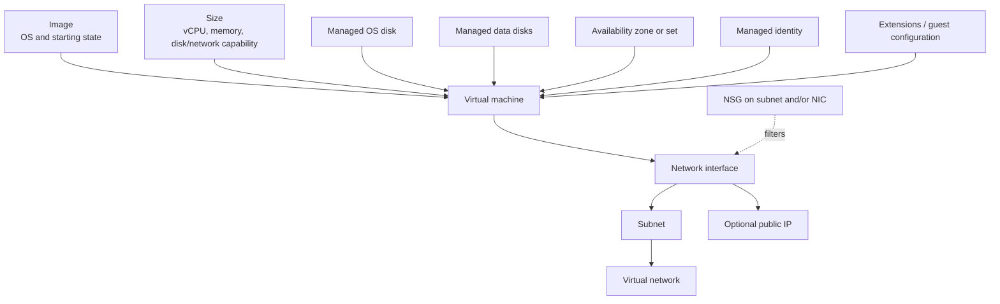

Creating “a VM” is a coordinated deployment of compute, disk, network, identity, security, and availability choices.

### Create and validate a VM

**Portal workflow:** Virtual machines → Create → select image, size, authentication, disks, VNet/subnet/NIC/public exposure, management/monitoring, availability option, tags → validate and create.

```bash
az vm create \
  --resource-group rg-compute-dev \
  --name vm-api-01 \
  --image Ubuntu2204 \
  --size Standard_D2s_v5 \
  --vnet-name vnet-dev \
  --subnet snet-workload \
  --public-ip-address '' \
  --admin-username azureadmin \
  --generate-ssh-keys

az vm get-instance-view \
  --resource-group rg-compute-dev \
  --name vm-api-01 \
  --query instanceView.statuses \
  --output table
```

For production, avoid selecting a size/image/region only from an example. Check current regional availability, quota, generation and disk compatibility, accelerator requirements, and price externally through the approved organizational process.

### Images and sizes

An image supplies the OS and initial disk content. The VM size controls vCPU, memory, temporary storage availability, and disk/network capabilities. Resizing can restart the VM; when the desired size is unavailable on the current cluster, deallocation may be required so the VM can be placed elsewhere. Deallocation can lose temporary-disk data and a dynamic public IP can change.

Troubleshoot a failed resize:

1. Check regional/zone SKU availability and subscription quota.
2. Check constraints from availability set/zone, disks, accelerators, and architecture.
3. Determine whether deallocation is acceptable.
4. Protect temporary data and understand public-IP allocation before deallocating.
5. Resize and verify instance state/guest capacity.

### VM disks

| Disk | Purpose | Persistence/implication |
|---|---|---|
| OS disk | Boot volume and operating system | Managed persistent disk; protect and size for OS needs |
| Data disk | Application/data volume | Managed persistent disk; attach, initialize/mount in guest, and back up as required |
| Temporary/local disk | Host-local temporary/swap/page data for supported sizes | **Not persistent**; data can be lost during maintenance, redeploy, resize, or stop/deallocate events |

Current managed-disk performance families include Ultra Disk, Premium SSD v2, Premium SSD, Standard SSD, and Standard HDD, with workload- and region-specific support. Choose by latency/IOPS/throughput/durability/cost and confirm VM-size compatibility. A managed-disk snapshot is a read-only point-in-time copy useful as a source for another disk; it is not the same as an application-consistent, policy-managed backup by itself.

Typical disk workflow:

1. Create/attach a managed data disk in Azure.
2. Initialize, partition, format, and mount it in the guest OS.
3. Confirm caching/performance settings suit the workload.
4. Enable backup/monitoring.
5. To detach, first stop I/O/unmount safely in the guest, then detach through Azure.

### Disk encryption and encryption at host

- Managed disks use server-side encryption at rest by default.
- **Encryption at host** encrypts data at the VM host, including supported temporary disks and disk-cache data, and ensures disk-bound data is encrypted as it flows from the host. It must be enabled in a supported subscription/region/VM configuration.
- **Azure Disk Encryption (ADE)** uses BitLocker on Windows or DM-Crypt on Linux and integrates with Key Vault. Microsoft now documents ADE retirement on **September 15, 2028** and recommends encryption at host for new VMs.

The active exam objective names both ADE and encryption at host, so recognize configuration/troubleshooting differences. Do not assume enabling one is the same as changing a Storage service CMK. For an existing VM, follow the current OS-specific procedure and understand downtime/deallocation constraints.

### Availability sets, zones, and scale sets

| Mechanism | Failure boundary | What you deploy | Choose when |
|---|---|---|---|
| Availability set | Fault domains and update domains within a datacenter/region placement model | Two or more related VMs in one set | Region/VM design cannot use zones and must reduce host/rack/update correlation |
| Availability zones | Physically separate datacenters within a region | VMs/resources placed across supported zones | Workload must tolerate a datacenter/zone failure |
| VM Scale Set | Managed group of VMs across supported availability design | Instances from a model or flexible profile | Need fleet management, availability, and scale |

An availability set provides lower resiliency than spreading across availability zones. A **fault domain** shares potential hardware/power/network failure; an **update domain** groups VMs that may be rebooted together during planned platform maintenance. Placing a single VM in an availability set does not make the application redundant.

### Move a VM

- **Resource group/subscription:** use the Resource Manager move process only when the VM and dependent resource types support it. Resource IDs change; the subscriptions must use the same Entra tenant.
- **Region:** use Azure Resource Mover or the current service-specific move procedure. Resolve dependencies, prepare, initiate, validate, and commit. It is not a normal RG move.
- Check VM extensions, availability resources, network dependencies, disks, identities, Key Vault, backup/ASR, diagnostics, DNS, and quota. The authoritative support matrix wins over assumptions.

**Official Microsoft sources:** [VM overview](https://learn.microsoft.com/en-us/azure/virtual-machines/overview), [VM sizes](https://learn.microsoft.com/en-us/azure/virtual-machines/sizes/overview), [manage VM sizes](https://learn.microsoft.com/en-us/azure/virtual-machines/windows/resize-vm), [managed disks](https://learn.microsoft.com/en-us/azure/virtual-machines/managed-disks-overview), [encryption at host](https://learn.microsoft.com/en-us/azure/virtual-machines/disks-enable-host-based-encryption-portal), [ADE for Windows](https://learn.microsoft.com/en-us/azure/virtual-machines/windows/disk-encryption-windows), [availability sets](https://learn.microsoft.com/en-us/azure/virtual-machines/availability-set-overview), [availability zones](https://learn.microsoft.com/en-us/azure/reliability/availability-zones-overview), [move VMs between regions](https://learn.microsoft.com/en-us/azure/resource-mover/tutorial-move-region-virtual-machines), [Azure CLI VM](https://learn.microsoft.com/en-us/cli/azure/vm)

## 3.4 Virtual Machine Scale Sets

A scale set creates and manages a group of load-balanced VMs. It supports consistent deployment from an image/model, health integration, scaling by metric or schedule, and distribution across supported availability constructs.

### Orchestration modes

- **Flexible orchestration** is Microsoft's recommended mode for new workloads. It provides VM-like control and supports a broader mix of instance patterns.
- **Uniform orchestration** uses a scale-set VM model and identical managed instances for traditional homogeneous scale-set behavior.
- Orchestration mode is selected at creation and cannot be changed afterward.

### Scaling model

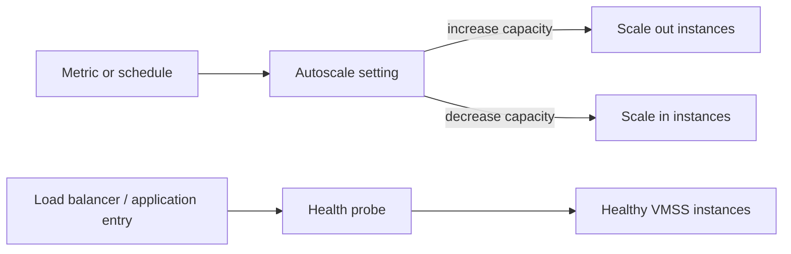

Define minimum, maximum, and default capacity; scale-out and scale-in rules; cooldown; and instance health. Avoid oscillation by using sensible thresholds/windows and testing scale-in policy. Autoscale creates/removes capacity; it does not repair an application whose health probe is invalid.

Operational checks:

- Image/version and model changes.
- Upgrade policy and instance model compliance.
- Health extension/probe results.
- Backend-pool membership.
- Autoscale run history, metric data, min/max capacity, and quota.
- Stateful data must not be stored only on disposable instances.

**Official Microsoft sources:** [VM Scale Sets overview](https://learn.microsoft.com/en-us/azure/virtual-machine-scale-sets/overview), [orchestration modes](https://learn.microsoft.com/en-us/azure/virtual-machine-scale-sets/virtual-machine-scale-sets-orchestration-modes), [autoscale a scale set](https://learn.microsoft.com/en-us/azure/virtual-machine-scale-sets/virtual-machine-scale-sets-autoscale-overview)

## 3.5 Containers: ACR, ACI, and Container Apps

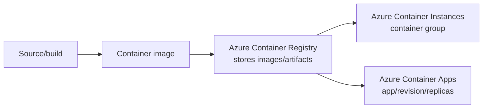

### Azure Container Registry

ACR is a managed private registry. Repositories contain images/artifacts; tags identify versions, while digests identify immutable content. ACR **stores and distributes** images; it does not run them.

Configure:

- Registry name, region, and Basic/Standard/Premium SKU based on documented capabilities.
- Entra/RBAC or a workload identity/service principal for push/pull.
- Network access/private endpoints where supported and required.
- Retention/import/build/security capabilities only when needed.

Avoid enabling the registry admin account as the default automation pattern. Prefer an identity with only the required push or pull permissions.

```bash
az acr create --resource-group rg-containers --name <unique-registry> --sku Standard
az acr login --name <unique-registry>
az acr repository list --name <unique-registry> --output table
```

### Azure Container Instances

ACI runs containers in a **container group** without managing VMs or an orchestrator. Containers in a group share lifecycle, local network, and allocated resources under the documented model. It fits simple services, burst tasks, build agents, and finite jobs.

Restart policies:

- `Always`: restart when the container exits; default behavior in documented creation flows.
- `OnFailure`: restart only after a failure.
- `Never`: run once; useful for tasks/jobs.

Size ACI using requested CPU and memory within current regional limits. A container group IP can change after restart/redeployment; do not design stable naming around an assumed persistent dynamic address.

```bash
az container create \
  --resource-group rg-containers \
  --name aci-report-job \
  --image <registry>.azurecr.io/report:v1 \
  --cpu 1 --memory 1.5 \
  --restart-policy Never

az container logs --resource-group rg-containers --name aci-report-job
```

### Azure Container Apps

Container Apps is a managed application platform for containerized apps and jobs. Key objects:

- **Environment:** security/network/logging boundary for related container apps and jobs.
- **Container app:** configuration and application identity.
- **Revision:** immutable snapshot of a versioned app configuration.
- **Replica:** running instance of a revision.
- **Ingress:** optional HTTP/TCP entry behavior under supported configuration.
- **Scale rule:** KEDA-based HTTP/event/custom trigger or CPU/memory rule.

Most event/HTTP-driven configurations can scale to zero; CPU and memory rules alone cannot drive scale-to-zero under the current scaling guidance. Configure minimum/maximum replicas and test whether the event source, authentication, and target revision receive metrics.

Revision modes:

- **Single:** only one active revision receives traffic after deployment.
- **Multiple:** multiple active revisions can receive weighted traffic for testing/gradual rollout.

### Decision table

| Signal | Choose | Why not the other two? |
|---|---|---|
| “Private image repository” | ACR | ACI/Container Apps run containers; they are not registries |
| “Run this image once and exit” | ACI with `Never` | Container Apps can run jobs, but ACI is the direct simple container-group choice when no app platform features are required |
| “HTTP app, revisions, traffic split, scale on requests” | Container Apps | ACI lacks the managed revision/traffic/autoscaling application model; ACR only stores images |
| “Push and pull images using least privilege” | ACR + scoped identity/RBAC | Registry admin credentials are broader shared credentials |

**Official Microsoft sources:** [ACR introduction](https://learn.microsoft.com/en-us/azure/container-registry/container-registry-intro), [registry concepts](https://learn.microsoft.com/en-us/azure/container-registry/container-registry-concepts), [ACI overview](https://learn.microsoft.com/en-us/azure/container-instances/container-instances-overview), [ACI restart policy](https://learn.microsoft.com/en-us/azure/container-instances/container-instances-restart-policy), [Container Apps overview](https://learn.microsoft.com/en-us/azure/container-apps/overview), [Container Apps scaling](https://learn.microsoft.com/en-us/azure/container-apps/scale-app), [revisions](https://learn.microsoft.com/en-us/azure/container-apps/revisions)

## 3.6 Azure App Service

### Plan versus app

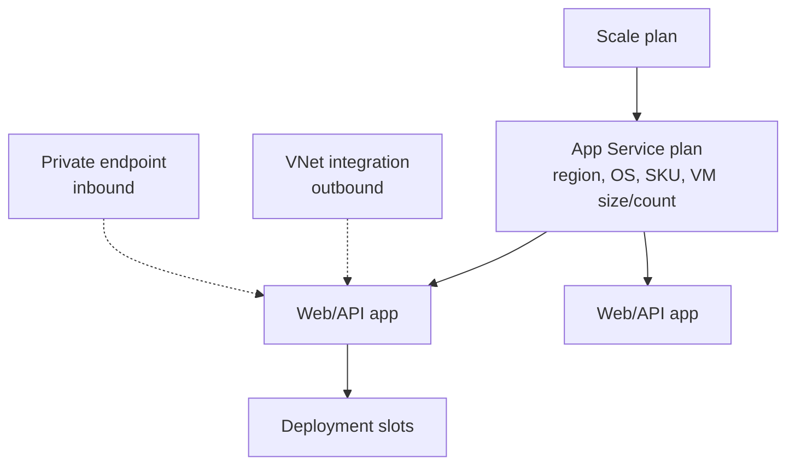

The **plan** supplies compute resources. The **app** is the hosted application and its configuration. Apps in the same plan share the plan's VM instances and scale together with plan capacity. A noisy app can affect peers in the same plan.

### Provision and scale

**Portal workflow:** App Service plans → Create → region/OS/pricing tier. Then App Services → Create → publish/runtime, app name, plan, deploy, configuration, monitoring.

Scaling distinctions:

- **Scale up/down:** change plan SKU/worker capabilities; controls feature availability and instance size.
- **Scale out/in:** change instance count.
- **Azure Monitor autoscale:** plan-wide, metric- or schedule-based rules for supported tiers.
- **Automatic scaling:** supported App Service capability that makes per-app scaling decisions based on HTTP traffic in applicable Premium tiers; distinguish it from Azure Monitor autoscale and verify current tier/slot limits.

Always check plan maximum instance count and subscription quota. A scale rule cannot exceed the plan/tier/platform boundary.

### Custom domains and TLS

1. Obtain the app's domain verification information.
2. Create the documented DNS record at the DNS provider—commonly CNAME for a subdomain or A record plus verification record where required.
3. Add/validate the custom domain in App Service.
4. Add/import/create a supported certificate.
5. Create a TLS binding for the hostname and enforce the required TLS/HTTPS configuration.

DNS ownership validation, hostname mapping, certificate, and TLS binding are separate steps. The default `azurewebsites.net` hostname is already covered by the platform certificate; your custom hostname needs its own valid certificate/binding.

### App Service networking

| Requirement | Feature | Direction/model |
|---|---|---|
| App must call private resources in a VNet/peered network/on-premises route | VNet integration | **Outbound** from app; uses a dedicated integration subnet under documented requirements |
| Client must reach app on a private IP | Private endpoint | **Inbound** private access; integrate DNS |
| Restrict public inbound callers by IP/VNet/service tag | Access restrictions | Filters inbound public endpoint |
| Control application name resolution | App/VNet DNS configuration | DNS must resolve private dependencies correctly |

VNet integration does not give the app a private inbound address. A private endpoint does not provide outbound integration. They solve opposite directions and can coexist. Do not place the private endpoint in the VNet-integration subnet when documentation requires separation.

### Backups

App Service backup protects supported app content/configuration and can include a linked database under documented configuration. Current documentation distinguishes automatic and custom backups; supported tiers and behaviors differ. A custom backup uses an Azure Storage destination with SAS in the documented workflow—it does not currently use a managed identity for that storage connection.

Configure schedule and retention, run an on-demand backup, inspect job status, and perform a restore test. Restore can target another app/slot; restoring to the target can stop it. A safe production validation pattern is restore to a slot and validate before traffic change.

### Deployment slots

A deployment slot is a live app with its own hostname. Deploy to staging, validate/warm it, then swap with production to reduce deployment interruption and enable rollback.

**Slot setting** means a configuration value stays with the slot. Mark environment-specific settings and connection strings as deployment-slot settings. During a swap, non-sticky application settings/connection strings move; several resource-level items—such as custom domains, TLS bindings, managed identities, scaling settings, and some networking configuration—do not swap under the current documented behavior.

Safe flow:

1. Create `staging` slot on a tier that supports slots.
2. Copy configuration from production deliberately.
3. Mark secrets/endpoints that must stay with each environment as slot settings.
4. Deploy and validate the staging hostname, logs, dependencies, and warm-up.
5. Preview/perform swap to production.
6. Monitor; swap back if required.

> [!WARNING]
> If a production database connection is accidentally non-sticky, a swap can move the wrong configuration. Inspect slot-setting flags before every production swap.

**Official Microsoft sources:** [App Service plans](https://learn.microsoft.com/en-us/azure/app-service/overview-hosting-plans), [scale an app](https://learn.microsoft.com/en-us/azure/app-service/manage-scale-up), [Azure Monitor autoscale](https://learn.microsoft.com/en-us/azure/azure-monitor/autoscale/autoscale-get-started), [custom DNS](https://learn.microsoft.com/en-us/azure/app-service/app-service-web-tutorial-custom-domain), [TLS overview](https://learn.microsoft.com/en-us/azure/app-service/overview-tls), [VNet integration](https://learn.microsoft.com/en-us/azure/app-service/overview-vnet-integration), [private endpoints for App Service](https://learn.microsoft.com/en-us/azure/app-service/overview-private-endpoint), [App Service backup](https://learn.microsoft.com/en-us/azure/app-service/manage-backup), [deployment slots](https://learn.microsoft.com/en-us/azure/app-service/deploy-staging-slots)

## 3.7 Domain 3 operational playbook

| Symptom | Inspect | Likely correction |
|---|---|---|
| Template deployment fails before resources exist | Scope, syntax/type validation, parameter values, provider registration, RBAC, Policy | Use deployment operations/error details; correct exact failing resource/property |
| VM cannot resize | SKU availability in region/zone/cluster, quota, compatibility | Choose supported size or deallocate after accounting for temp data/dynamic IP |
| VM data disappeared after deallocation | Disk path/type | Persist application data on managed data disk, not temporary disk |
| VMSS does not scale | Autoscale enabled, metric data, threshold/window/cooldown, min/max, quota | Correct rule/signal/capacity boundary and verify run history |
| Container cannot pull from ACR | Image/tag, registry endpoint/network, identity credentials/RBAC | Assign least-privilege pull permission and fix network/name |
| Container job keeps restarting | ACI restart policy and exit code | Use `Never`/`OnFailure` for finite job as required and fix process failure |
| App cannot reach private database | App VNet integration, routes/NSG/DNS, destination firewall/private endpoint | Fix outbound integration/path; do not add an inbound App Service PE as a substitute |
| App is not privately reachable | App private endpoint, approval, private DNS, client route | Correct inbound Private Link/DNS and restrict public access if required |
| Slot uses production dependency during test | Sticky setting flags and config sources | Mark environment-specific setting as deployment slot setting |

## 3.8 Domain 3 mini quiz

### Question 1

A Bicep resource refers to `storage.id`. What is the likely deployment consequence?

A. The storage resource is deleted  
B. Resource Manager can infer a dependency on `storage`  
C. The deployment changes to tenant scope  
D. An account key is exported

<details>
<summary>Answer</summary>

**Correct answer:** B.

**Why:** A symbolic resource reference lets Bicep/Resource Manager infer ordering.

**Exam objective:** Interpret a Bicep file.  
**Official Microsoft source:** [Resource dependencies in Bicep](https://learn.microsoft.com/en-us/azure/azure-resource-manager/bicep/resource-dependencies)

</details>

### Question 2

Two manually managed VMs must reduce correlated hardware and platform-maintenance exposure, but the selected region/design cannot use availability zones. What should you configure?

A. Place them in the same availability set  
B. Put both behind the same NIC  
C. Store data on temporary disks  
D. Apply a tag

<details>
<summary>Answer</summary>

**Correct answer:** A.

**Why:** Availability sets distribute VMs across fault and update domains in the documented non-zonal placement model.

**Why alternatives are wrong:** NICs, temporary disks, and tags provide no compute placement redundancy.

**Exam objective:** Deploy VMs to availability sets.  
**Official Microsoft source:** [Availability sets overview](https://learn.microsoft.com/en-us/azure/virtual-machines/availability-set-overview)

</details>

### Question 3

A nightly container must generate a report and exit successfully without restarting. Which direct ACI setting fits?

A. Restart policy `Always`  
B. Restart policy `Never`  
C. ACR admin user  
D. Multiple Container Apps revisions

<details>
<summary>Answer</summary>

**Correct answer:** B.

**Why:** `Never` runs a finite ACI task without restarting it after exit.

**Exam objective:** Provision and manage Azure Container Instances.  
**Official Microsoft source:** [ACI restart policies](https://learn.microsoft.com/en-us/azure/container-instances/container-instances-restart-policy)

</details>

### Question 4

A containerized HTTP service requires revisions, traffic splitting, and event-driven scaling. Which service is the best match?

A. Azure Container Registry  
B. Azure Container Instances  
C. Azure Container Apps  
D. Managed disk

<details>
<summary>Answer</summary>

**Correct answer:** C.

**Why:** Container Apps supplies the revision, ingress/traffic, and KEDA-based managed scaling application model.

**Exam objective:** Provision/manage Container Apps and scaling.  
**Official Microsoft source:** [Azure Container Apps overview](https://learn.microsoft.com/en-us/azure/container-apps/overview)

</details>

### Question 5

An App Service app must initiate connections to a private API in a VNet. It does not need a private inbound address. What should you configure?

A. App Service VNet integration  
B. App Service private endpoint only  
C. Public load balancer  
D. Deployment slot

<details>
<summary>Answer</summary>

**Correct answer:** A.

**Why:** VNet integration supplies outbound access from the app into the virtual network path.

**Why alternatives are wrong:** A private endpoint is for inbound access to the app; the other choices do not create the outbound VNet path.

**Exam objective:** Configure networking settings for App Service.  
**Official Microsoft source:** [App Service VNet integration](https://learn.microsoft.com/en-us/azure/app-service/overview-vnet-integration)

</details>

### Question 6

Production and staging slots use different database connection strings. The values must stay with their environments during swap. What should you do?

A. Store both in an NSG  
B. Mark the connection strings as deployment slot settings  
C. Scale out the plan  
D. Change the custom domain before every swap

<details>
<summary>Answer</summary>

**Correct answer:** B.

**Why:** A deployment slot setting is sticky and remains with its slot across the swap.

**Exam objective:** Configure deployment slots.  
**Official Microsoft source:** [Set up staging environments](https://learn.microsoft.com/en-us/azure/app-service/deploy-staging-slots)

</details>

---

# Domain 4 — Implement and manage virtual networking (15–20%)

## Exact objective map

### Configure and manage virtual networks

- Create and configure virtual networks and subnets.
- Create and configure virtual network peering.
- Configure public IP addresses.
- Configure user-defined network routes.
- Troubleshoot network connectivity.

### Configure secure access to virtual networks

- Create and configure network security groups (NSGs) and application security groups (ASGs).
- Evaluate effective security rules in NSGs.
- Implement Azure Bastion.
- Configure service endpoints for Azure platform as a service (PaaS).
- Configure private endpoints for Azure PaaS.

### Configure name resolution and load balancing

- Configure Azure DNS.
- Configure an internal or public load balancer.
- Troubleshoot load balancing.

## 4.1 Networking foundations for Azure

| Term | Administrator meaning |
|---|---|
| IP address | Numeric source/destination identity on the network |
| CIDR prefix | Address range; `/24` fixes 24 network bits and leaves 8 host bits |
| Subnet | Portion of VNet address space used as a policy/routing/resource boundary |
| Route | Prefix match plus next-hop decision |
| Gateway | Resource that connects networks/paths, such as VPN/ExpressRoute |
| DNS | Converts a name to the address that the client will attempt |
| NSG | Stateful L3/L4 allow/deny filtering at subnet/NIC |
| Load balancer | Distributes traffic to healthy backend instances |

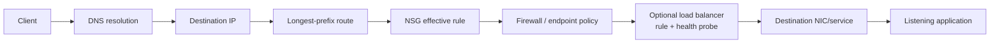

Never begin with “the network is broken.” Determine which hop fails.

## 4.2 VNets, subnets, addressing, and public IPs

### VNet model

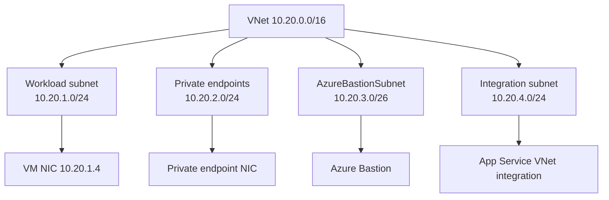

A VNet is a regional private network. Its address spaces contain non-overlapping subnets. Azure creates system routes that allow routing within a VNet by default; NSGs and service/firewall controls still decide whether traffic is accepted.

### CIDR and subnet sizing

IPv4 addresses in a prefix = `2^(32 − prefix length)`.

| Prefix | Total addresses | Azure-usable addresses after five reservations |
|---:|---:|---:|
| /24 | 256 | 251 |
| /26 | 64 | 59 |
| /27 | 32 | 27 |
| /28 | 16 | 11 |
| /29 | 8 | 3 |

Azure reserves the first four and last IP address in each subnet. Current VNet documentation identifies `/29` as the smallest IPv4 subnet. A subnet that technically fits today can still fail later when scale, upgrades, or private endpoints require more addresses. Size for peak instances and platform headroom.

Practical plan for `10.20.0.0/16`:

```text
10.20.0.0/24   shared services
10.20.1.0/24   application VMs
10.20.2.0/24   private endpoints
10.20.3.0/26   AzureBastionSubnet
10.20.4.0/24   delegated/integration workload
```

Do not overlap ranges that must be peered or routed through VPN/ExpressRoute. Overlap prevents unambiguous route decisions and VNet peering requires non-overlapping address spaces.

### Create and configure

```bash
az network vnet create \
  --resource-group rg-network-prod \
  --name vnet-prod \
  --address-prefixes 10.20.0.0/16 \
  --subnet-name snet-app \
  --subnet-prefixes 10.20.1.0/24

az network vnet subnet create \
  --resource-group rg-network-prod \
  --vnet-name vnet-prod \
  --name snet-private-endpoints \
  --address-prefixes 10.20.2.0/24
```

### Public IP addresses

A public IP resource supplies internet-addressable frontend identity to supported resources such as Load Balancer, NAT Gateway, Application Gateway, Bastion, or a VM NIC design. Choose IPv4/IPv6, region/zone behavior, allocation, and Standard SKU according to the consuming service.

Basic public IP SKU reached retirement on September 30, 2025. Use the current Standard SKU design and do not depend on obsolete Basic behavior. Standard public IPs are secure by default in the sense that an NSG must explicitly allow inbound traffic for a VM path; a public address alone is not an allow rule.

**Official Microsoft sources:** [manage VNets](https://learn.microsoft.com/en-us/azure/virtual-network/manage-virtual-network), [IP planning](https://learn.microsoft.com/en-us/azure/networking/design-guide/ip-planning), [public IP addresses](https://learn.microsoft.com/en-us/azure/virtual-network/ip-services/public-ip-addresses)

## 4.3 VNet peering

Peering connects two VNets over the Microsoft backbone using private IPs. Regional peering connects VNets in one region; global VNet peering connects supported VNets across regions.

### Facts that decide questions

- Address spaces must not overlap.
- Configure peering in both directions for the complete relationship.
- Peering is **not transitive**. If A peers with B and B peers with C, A does not automatically reach C through B.
- Peering status and options can differ by direction.
- Network access is still subject to NSGs, routes, firewalls, and the guest/service listener.
- **Gateway transit:** a hub can allow gateway transit and a spoke can use the remote gateway. A spoke using the remote gateway cannot also use its own gateway in that peering design.
- **Forwarded traffic:** enable the relevant peering option when an NVA/hub forwards traffic rather than traffic originating directly in the peer.

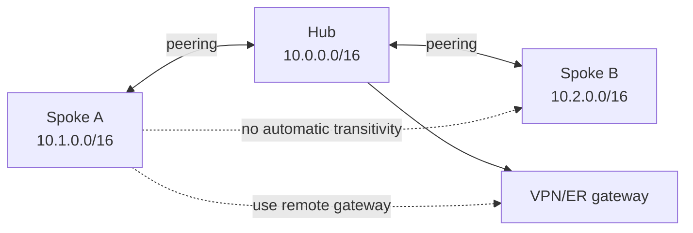

### Troubleshoot peering

1. Check both peering resources show Connected and address spaces remain non-overlapping.
2. Check **Allow virtual network access**, forwarded traffic, and gateway-transit/use-remote-gateway options in both directions.
3. Inspect effective routes on the NIC; a UDR can override the expected system peering route.
4. Inspect effective NSG rules at both ends.
5. Check guest firewall/service port and DNS.

**Official Microsoft source:** [VNet peering overview](https://learn.microsoft.com/en-us/azure/virtual-network/virtual-network-peering-overview)

## 4.4 Routing and user-defined routes

Azure supplies system routes for VNet, peering, and other platform paths. A route table contains user-defined routes (UDRs) and is associated with one or more subnets.

### Route selection

1. Azure chooses the route with the **longest matching prefix**.
2. For otherwise equal prefixes, UDR is preferred over BGP and BGP over system route, subject to documented exceptions such as service-endpoint routes.
3. The selected route's next-hop type determines forwarding.

Common next hops include Virtual appliance, Virtual network gateway, Virtual network, Internet, and None. A `0.0.0.0/0` UDR is a default route and is less specific than a route for a target subnet/service. `None` drops matching traffic.

Example forced path:

```text
Workload subnet route table
0.0.0.0/0          → Virtual appliance 10.20.0.4
10.30.0.0/16       → Virtual network gateway
10.20.0.0/16       → system Virtual network route (more specific)
```

When using an NVA, validate that it can forward traffic and that return traffic is symmetric enough for the stateful device. A correct forward route with an absent return route still fails.

```bash
az network route-table create \
  --resource-group rg-network-prod \
  --name rt-app

az network route-table route create \
  --resource-group rg-network-prod \
  --route-table-name rt-app \
  --name default-to-firewall \
  --address-prefix 0.0.0.0/0 \
  --next-hop-type VirtualAppliance \
  --next-hop-ip-address 10.20.0.4

az network vnet subnet update \
  --resource-group rg-network-prod \
  --vnet-name vnet-prod \
  --name snet-app \
  --route-table rt-app
```

**Official Microsoft source:** [Virtual network routing](https://learn.microsoft.com/en-us/azure/virtual-network/virtual-networks-udr-overview)

## 4.5 NSGs and ASGs

### NSG rule model

An NSG contains inbound and outbound L3/L4 rules. Each rule matches:

```text
priority + direction + protocol + source address/port + destination address/port → allow/deny
```

Lower priority numbers are evaluated first. Custom rule priorities are in the documented 100–4096 range. Processing stops on the first matching rule.

Default rules include:

| Priority | Inbound | Outbound |
|---:|---|---|
| 65000 | AllowVNetInBound | AllowVNetOutBound |
| 65001 | AllowAzureLoadBalancerInBound | AllowInternetOutBound |
| 65500 | DenyAllInBound | DenyAllOutBound |

You cannot delete default rules, but a higher-priority custom rule can override them.

### Stateful behavior

NSGs are stateful. If an outbound request is allowed, return traffic for that flow is allowed without a separate inbound rule, and vice versa. Do not confuse return traffic with a new connection. Changing a rule affects new flows; existing established flows might continue until they end.

### Subnet and NIC association

An NSG can be associated with a subnet, a NIC, or both. If both apply, traffic must be allowed by all applicable evaluations. For inbound VM traffic, reason through subnet and then NIC filtering; for outbound, NIC and then subnet. Effective security rules combine defaults, custom rules, and associations for a NIC.

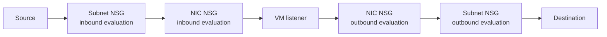

### Application security groups

An ASG groups NIC IP configurations by application role and can be referenced as a source/destination in NSG rules. It makes rules express intent:

```text
Allow TCP 443 from ASG-Web to ASG-API
Allow TCP 1433 from ASG-API to ASG-Data
```

An ASG does not contain allow/deny rules and does not filter by itself. The **NSG rule** references the ASG; eligible NICs are members.

### Packet reasoning example

Requirement: Internet clients access TCP 443 on two web VMs; management must use Bastion; no direct Internet SSH/RDP.

1. Public load-balancer frontend receives 443.
2. Load-balancing rule maps to backend port 443.
3. Health probe must be accepted and application must return healthy response.
4. Subnet/NIC NSGs allow intended 443 source/path and Azure Load Balancer probe service tag as documented.
5. No high-priority rule allows Internet management ports.
6. Bastion connects to VM private IP over the management protocol.

> [!CAUTION]
> Rules that use `Any` source and management ports create exposure. A public IP does not require opening RDP/SSH to the Internet when Bastion or another private management path is available.

**Official Microsoft sources:** [NSG overview](https://learn.microsoft.com/en-us/azure/virtual-network/network-security-groups-overview), [effective security rules](https://learn.microsoft.com/en-us/azure/virtual-network/manage-network-security-group), [ASG overview](https://learn.microsoft.com/en-us/azure/virtual-network/application-security-groups)

## 4.6 Azure Bastion

Azure Bastion is a managed service that provides RDP/SSH connectivity to VM private IP addresses through the Azure portal or supported native client features. The VM does not need a public IP. Portal sessions use TLS to the Bastion service, while Bastion connects inside the VNet to the VM.

Current dedicated deployments use a subnet named exactly `AzureBastionSubnet`; current design guidance requires `/26` or larger for Basic/Standard/Premium deployments. Basic and Standard use a public IP on Bastion. Premium supports a documented private-only deployment option. Developer is a shared deployment model with different constraints.

Implementation checklist:

1. Create correctly named/sized subnet and compatible public IP/SKU where required.
2. Deploy Bastion in/for the target VNet.
3. Ensure peering and SKU support for reaching peered VNets if required.
4. Ensure NSGs/routes allow the documented Bastion flows.
5. Grant users the necessary Azure permissions and VM guest credentials/keys.
6. Connect to the VM's private IP; keep VM public IP absent if private administration is required.

**Exam trap:** Bastion solves secure VM administration. It is not a site-to-site VPN for application traffic and does not grant guest OS credentials.

**Official Microsoft sources:** [Bastion overview](https://learn.microsoft.com/en-us/azure/bastion/bastion-overview), [Bastion architecture](https://learn.microsoft.com/en-us/azure/bastion/design-architecture)

## 4.7 Service endpoints versus private endpoints

### The decision

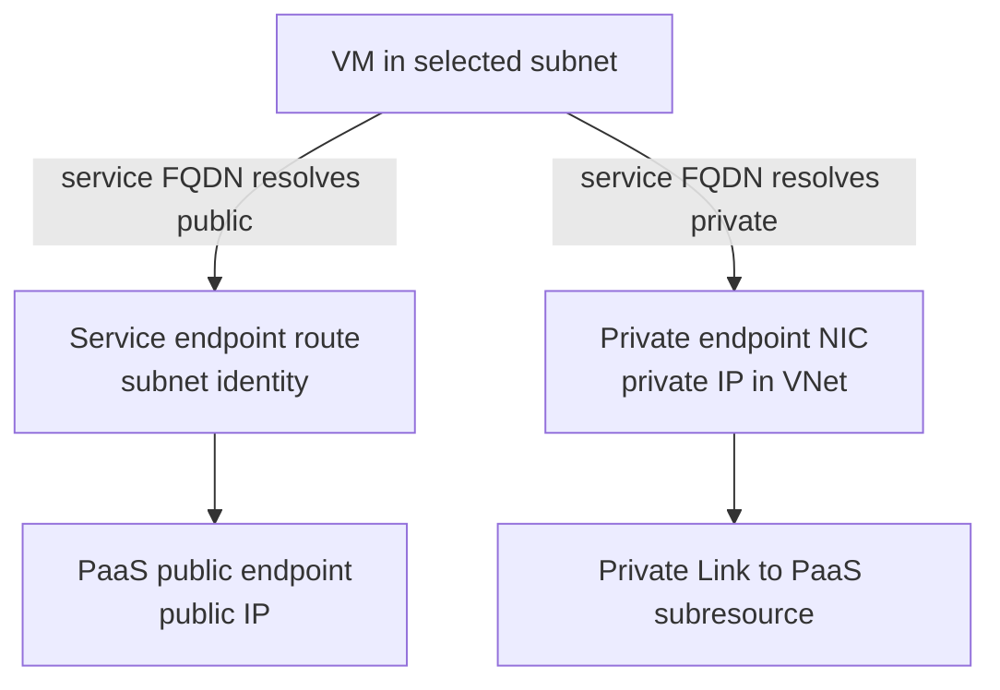

| Property | Public endpoint + firewall | Service endpoint | Private endpoint |
|---|---|---|---|
| Service endpoint address | Public | Public | Private IP in your VNet |
| Trust/restriction signal | Source public IP/exception | Selected VNet subnet identity via service endpoint | Approved Private Link connection to subresource |
| DNS | Public service DNS | Still resolves public service IP | Must resolve service FQDN to private endpoint IP for clients |
| On-premises direct private use | Public egress/firewall model | Not a direct on-premises subnet identity solution | Reachable through connected VNet path plus DNS |
| PaaS public endpoint | Used | Used, but restricted/optimized from subnet | Separate; creating PE does not inherently turn public access off |
| Resource in VNet | No | No | Private endpoint NIC resides in VNet; service itself remains managed PaaS |

### Service endpoint workflow

1. Enable the target service endpoint (for example Microsoft.Storage) on the workload subnet.
2. Add that VNet/subnet rule to the PaaS resource firewall.
3. Keep correct service data authorization.
4. Verify effective route and service firewall access.

### Private endpoint workflow

1. Create PE for exact service and subresource.
2. Complete provider approval if required.
3. Configure the recommended `privatelink` private DNS zone and record through private DNS zone group/integration.
4. Link the zone to every client VNet that should resolve it; supply conditional forwarding/resolution for on-premises clients where required.
5. Run `nslookup`/`Resolve-DnsName` from the actual client and confirm private IP.
6. Test port/authorization.
7. Restrict public access separately if the security requirement calls for it.

The most common PE failure is DNS: the client resolves the normal service name to a public address and bypasses the intended private endpoint path.

**Official Microsoft sources:** [VNet service endpoints](https://learn.microsoft.com/en-us/azure/virtual-network/virtual-network-service-endpoints-overview), [private endpoint overview](https://learn.microsoft.com/en-us/azure/private-link/private-endpoint-overview), [private endpoint DNS](https://learn.microsoft.com/en-us/azure/private-link/private-endpoint-dns)

## 4.8 Azure DNS

### Public and private zones

- An **Azure public DNS zone** hosts authoritative public records for a delegated domain. Registering/buying the domain is separate; delegate it by configuring the registrar/parent with Azure DNS name servers.
- An **Azure Private DNS zone** resolves records only from linked VNets and connected networks with an appropriate resolution path. Link a VNet for resolution; enable autoregistration on a supported registration link when VM records should be registered automatically.
- A VNet can have multiple resolution links but only one private-zone registration link under the documented model.

Record types you should recognize: A/AAAA address records, CNAME aliases, MX mail exchange, TXT text/verification, NS delegation, and SOA zone authority. Alias record support exists for selected Azure resources; verify the target types.

### Private endpoint DNS reasoning

Application code should normally keep using the service's standard FQDN. Azure public DNS introduces the documented `privatelink` CNAME path, and your linked private DNS zone resolves that private-link name to the private endpoint IP. Hard-coding the private IP bypasses supported name behavior and complicates changes.

Troubleshoot:

```text
Does name exist? → Which DNS server did client ask? → Public or private answer?
→ Correct private zone name? → VNet link present? → A record points to PE IP?
→ On-prem conditional forwarder/resolver configured?
```

**Official Microsoft sources:** [Azure DNS overview](https://learn.microsoft.com/en-us/azure/dns/dns-overview), [Private DNS overview](https://learn.microsoft.com/en-us/azure/dns/private-dns-overview), [DNS records and record sets](https://learn.microsoft.com/en-us/azure/dns/dns-zones-records)

## 4.9 Azure Load Balancer

Azure Load Balancer operates at Layer 4 for TCP/UDP flows.

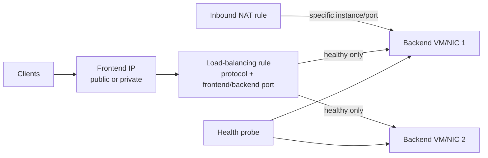

| Component | Purpose |
|---|---|
| Frontend IP configuration | Address clients target; public IP for public LB or subnet private IP for internal LB |
| Backend pool | NIC/IP configurations or scale-set instances eligible to receive traffic |
| Health probe | Checks whether a backend should receive new flows |
| Load-balancing rule | Maps frontend protocol/port to backend protocol/port and pool/probe |
| Inbound NAT rule | Maps a frontend port to a particular backend instance/port for direct administration/special access |
| Outbound rule | Defines outbound SNAT behavior for supported Standard LB designs |

Basic Load Balancer retired on September 30, 2025. Use Standard Load Balancer and its secure-by-default NSG model.

### Public versus internal

- **Public Load Balancer:** public frontend IP, for internet-origin traffic.
- **Internal Load Balancer:** private frontend IP in a VNet subnet, for private clients/tier-to-tier traffic.

### Health-probe troubleshooting

When all backends show unhealthy:

1. Confirm the backend NICs/instances are in the expected pool.
2. Confirm probe protocol, port, interval, and HTTP(S) path where used.
3. Confirm the application listens on that port/address and returns the documented success response.
4. Confirm NSG permits the probe source/service tag and no guest firewall blocks it.
5. Confirm routes do not break probe/return path.
6. Confirm load-balancing rule references the correct pool/probe/ports.

A load-balancing rule does not make a stopped/unhealthy service healthy. Fix the probe or application/path.

### Load Balancer versus Application Gateway

| Need | Load Balancer | Application Gateway |
|---|---|---|
| TCP/UDP Layer 4 distribution | Best fit | HTTP(S)-focused Layer 7 service |
| Route by HTTP host/path | No | Yes |
| TLS termination and HTTP policy | Not its Layer 4 role | Yes |
| Web Application Firewall | No | WAF tier |
| Private frontend | Internal LB | Private frontend supported |

Application Gateway v1 reached retirement on April 28, 2026. Where a scenario references Application Gateway, reason with current v2/WAF_v2 capabilities.

**Official Microsoft sources:** [Load Balancer overview](https://learn.microsoft.com/en-us/azure/load-balancer/load-balancer-overview), [health probes](https://learn.microsoft.com/en-us/azure/load-balancer/load-balancer-custom-probe-overview), [Application Gateway overview](https://learn.microsoft.com/en-us/azure/application-gateway/overview), [Application Gateway FAQ](https://learn.microsoft.com/en-us/azure/application-gateway/application-gateway-faq)

## 4.10 Network Watcher and packet-flow troubleshooting

| Symptom/question | Tool | What it establishes |
|---|---|---|
| “Would this packet be allowed or denied, and by which NSG rule?” | IP flow verify | Matching allow/deny rule for a VM/NIC direction and five-tuple |
| “Which next hop will Azure use for this destination?” | Next hop | Effective route's next-hop type/IP and route table |
| “Can endpoints continuously connect, with what latency/loss?” | Connection Monitor | Ongoing reachability and performance tests across supported endpoint types |
| “Which rule makes this NSG behavior effective?” | NSG diagnostics/effective security rules | Rule evaluation and association context |
| “What packets actually reach/leave this VM?” | Packet capture | Captured packets for protocol-level inspection |
| “What is the network relationship/topology?” | Network Watcher topology | Resource connectivity view |

Network Watcher is primarily for IaaS network diagnosis. It does not replace App Service/Application Insights application telemetry.

NSG flow logs are on a retirement path: creation of new NSG flow logs was disabled after June 30, 2025 and retirement is September 30, 2027 in current documentation. Use virtual network flow logs for new flow-logging designs and verify current regional support.

### Repeatable method

1. **Name:** resolve FQDN from the failing client.
2. **Address:** verify source and destination IPs are the intended ones.
3. **Route:** use effective routes/Next hop in both directions.
4. **Filter:** use effective NSG rules and IP flow verify for exact tuple.
5. **Endpoint/firewall:** confirm service public/private endpoint, approval, PaaS firewall, and auth.
6. **Load balance:** confirm frontend/rule/backend/probe.
7. **Guest/application:** confirm OS firewall, listener, certificate, and application health.
8. **Observe:** Connection Monitor for continuous evidence; packet capture when packet detail is necessary.

**Official Microsoft sources:** [Network Watcher overview](https://learn.microsoft.com/en-us/azure/network-watcher/network-watcher-overview), [IP flow verify](https://learn.microsoft.com/en-us/azure/network-watcher/ip-flow-verify-overview), [Next hop](https://learn.microsoft.com/en-us/azure/network-watcher/next-hop-overview), [Connection Monitor](https://learn.microsoft.com/en-us/azure/network-watcher/connection-monitor-overview), [packet capture](https://learn.microsoft.com/en-us/azure/network-watcher/packet-capture-overview), [VNet flow logs](https://learn.microsoft.com/en-us/azure/network-watcher/vnet-flow-logs-overview)

## 4.11 Domain 4 operational playbook

| Symptom | First evidence | Common root areas |
|---|---|---|
| VM-to-VM fails in peered VNets | Peer status, effective routes, IP flow verify | One-way peering option, overlap/change, UDR/NVA, NSG, guest firewall |
| Private endpoint resolves public IP | `nslookup` from failing client | Wrong/missing private zone, VNet link, record, DNS forwarder/cache |
| Private endpoint resolves private IP but gets 403 | Connection approval/port then service auth | Data role/SAS/key or service policy—not necessarily network |
| Load balancer backend unhealthy | Probe status and direct local test | Wrong probe port/path, app not listening, NSG/guest firewall, pool membership |
| Internet path unexpectedly bypasses firewall | Effective route/Next hop | Missing subnet association, more-specific route, propagation/configuration |
| Bastion cannot connect | Bastion health, target private IP, NSG/routes, guest port/credentials | Subnet/config, blocked flow, OS service, invalid guest credentials |
| New NSG rule seems ineffective | Effective security rules and exact five-tuple | Lower-numbered conflicting rule, NSG on other scope, existing flow |

## 4.12 Domain 4 mini quiz

### Question 1

VNet A peers with VNet B, and B peers with C. A cannot reach C. No explicit A–C peering or routing appliance exists. What explains the result?

A. Peering is not automatically transitive  
B. Every VNet requires a public IP  
C. NSGs cannot filter peered traffic  
D. Azure DNS deletes routes

<details>
<summary>Answer</summary>

**Correct answer:** A.

**Why:** Peering connects the two configured VNets; it does not automatically make B a transit router between A and C.

**Exam objective:** Create and configure VNet peering.  
**Official Microsoft source:** [VNet peering overview](https://learn.microsoft.com/en-us/azure/virtual-network/virtual-network-peering-overview)

</details>

### Question 2

An NSG has Deny TCP 443 at priority 200 and Allow TCP 443 from `203.0.113.0/24` at priority 100. A matching client connects. Which rule wins?

A. Deny, because deny always wins  
B. Allow, because lower priority number is evaluated first  
C. Both; Azure randomly selects  
D. Neither; only default rules work

<details>
<summary>Answer</summary>

**Correct answer:** B.

**Why:** The first matching rule wins, and 100 is processed before 200.

**Exam objective:** Create/configure NSGs; evaluate effective security rules.  
**Official Microsoft source:** [Network security groups](https://learn.microsoft.com/en-us/azure/virtual-network/network-security-groups-overview)

</details>

### Question 3

A Storage account must be addressed through a private VNet IP by both Azure VMs and on-premises clients connected to the VNet. Which feature is central?

A. Service endpoint  
B. Private endpoint and correct private DNS resolution  
C. ASG  
D. Public DNS zone only

<details>
<summary>Answer</summary>

**Correct answer:** B.

**Why:** Private Endpoint maps the PaaS subresource to a private IP reachable over the connected network, with DNS directing clients there.

**Why alternatives are wrong:** Service endpoints target service access from selected Azure subnets through the public service endpoint; ASG is an NSG grouping construct; public DNS alone does not create private addressing.

**Exam objective:** Configure private endpoints for Azure PaaS.  
**Official Microsoft source:** [Private endpoint overview](https://learn.microsoft.com/en-us/azure/private-link/private-endpoint-overview)

</details>

### Question 4

You need to know which Azure route a VM NIC uses toward `10.50.1.8`. Which Network Watcher tool should you use first?

A. Packet capture  
B. Next hop  
C. Azure Advisor  
D. Cost analysis

<details>
<summary>Answer</summary>

**Correct answer:** B.

**Why:** Next hop evaluates the routing result for a source VM/NIC and destination IP.

**Exam objective:** Troubleshoot network connectivity.  
**Official Microsoft source:** [Next hop overview](https://learn.microsoft.com/en-us/azure/network-watcher/next-hop-overview)

</details>

### Question 5

Private clients must access a two-VM database proxy through one VNet address on TCP 1433. HTTP routing and WAF are unnecessary. What should you deploy?

A. Public Application Gateway  
B. Internal Standard Load Balancer  
C. Public DNS zone only  
D. Azure Bastion

<details>
<summary>Answer</summary>

**Correct answer:** B.

**Why:** An internal Load Balancer provides a private frontend and Layer 4 distribution to healthy backends.

**Exam objective:** Configure an internal load balancer.  
**Official Microsoft source:** [Load Balancer components](https://learn.microsoft.com/en-us/azure/load-balancer/components)

</details>

---

# Domain 5 — Monitor and maintain Azure resources (10–15%)

## Exact objective map

### Monitor resources in Azure

- Interpret metrics in Azure Monitor.
- Configure log settings in Azure Monitor.
- Query and analyze logs in Azure Monitor.
- Set up alert rules, action groups, and alert processing rules in Azure Monitor.
- Configure and interpret monitoring of virtual machines, storage accounts, and networks by using Azure Monitor Insights.
- Use Azure Network Watcher and Connection Monitor.

### Implement backup and recovery

- Create a Recovery Services vault.
- Create an Azure Backup vault.
- Create and configure a backup policy.
- Perform backup and restore operations by using Azure Backup.
- Configure Azure Site Recovery for Azure resources.
- Perform a failover to a secondary region by using Azure Site Recovery.
- Configure and interpret reports and alerts for backups.

## 5.1 Azure Monitor mental model

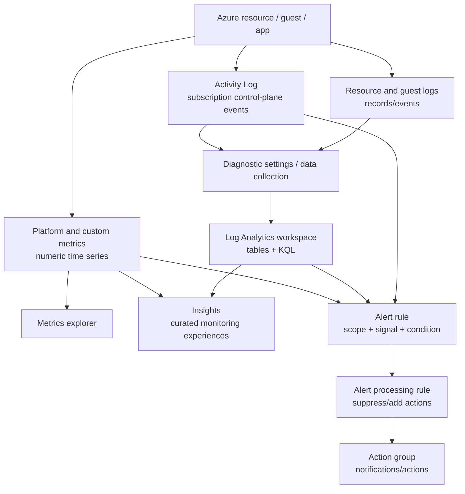

Separate three questions:

1. **Was telemetry emitted/collected?** A resource can expose platform metrics automatically while resource logs require configuration.
2. **Where was it routed/stored?** Diagnostic settings/data collection rules choose destinations; data does not appear in a workspace merely because the workspace exists.
3. **How is it used?** Explorer, KQL, Insights, alert rules, workbooks, reports.

## 5.2 Metrics, logs, and Activity Log

| Data | Shape/speed | Collection | Best for | Common trap |
|---|---|---|---|---|
| Azure Monitor metrics | Numeric time series, dimensions, near-real-time monitoring | Platform metrics generally collected automatically | Fast thresholds, charts, capacity/performance trends | A metric lacks the rich event context of logs |
| Resource logs | Structured service-specific events | Normally require diagnostic setting/data collection route | Detailed operations, audit, troubleshooting, KQL | Enabling a resource does not automatically send every log to a workspace |
| Activity Log | Subscription control-plane events | Collected automatically and retained in Azure for the documented period (currently 90 days) | Who changed/deleted/configured a resource; service health/policy/admin events | Mostly not data-plane reads and application requests |
| Guest/app logs | OS/application records | Agent/data collection/application configuration as applicable | Guest process, OS, and app diagnosis | Azure resource health alone cannot prove the app is healthy |

### Interpret metrics

Metrics are aggregated by time grain and aggregation such as Average, Minimum, Maximum, Total, or Count. A dimension splits a metric by a property such as API name, response type, disk, or instance where the metric exposes it.

Before alerting, answer:

- Which resource and metric namespace?
- Which aggregation and window represent the requirement?
- Which dimension/filter avoids hiding a hot instance behind a fleet average?
- Is a static threshold valid, or does the supported scenario need dynamic behavior?
- Is the metric available at the required granularity and retention?

Example: average CPU below 50% across four VMs can conceal one saturated VM. Split by instance or scope individual resources when the requirement is per-instance.

### Activity Log

Use Activity Log to investigate Resource Manager changes: create/update/delete, role/policy events, service health, resource health, autoscale, and recommendations according to its categories. Route it with a diagnostic setting for longer retention, central queries, Event Hub streaming, or Storage archiving.

**Official Microsoft sources:** [Azure Monitor overview](https://learn.microsoft.com/en-us/azure/azure-monitor/fundamentals/overview), [metrics](https://learn.microsoft.com/en-us/azure/azure-monitor/metrics/data-platform-metrics), [logs](https://learn.microsoft.com/en-us/azure/azure-monitor/logs/data-platform-logs), [Activity Log](https://learn.microsoft.com/en-us/azure/azure-monitor/platform/activity-log)

## 5.3 Diagnostic settings and Log Analytics

### Diagnostic settings

A diagnostic setting routes supported platform logs and metrics from a resource or subscription to one or more destinations:

- Log Analytics workspace for KQL/alerts/Insights.
- Storage account for archive.
- Event Hub for streaming to external/SIEM pipelines.
- Supported partner solution.

**Portal workflow:** resource → Diagnostic settings → Add diagnostic setting → select log categories/category groups and metrics → choose destinations → save. Confirm the destination already exists and that regional/firewall constraints are satisfied where documented.

> [!IMPORTANT]
> “The resource has logs” does not mean “the logs are in this workspace.” The diagnostic/data-collection path must explicitly route them, and ingestion takes time.

### Log Analytics and KQL

A Log Analytics workspace stores Azure Monitor Logs in tables. Kusto Query Language (KQL) is read-only for querying this telemetry. Always set an intentional time range and confirm the table/column schema in the workspace.

Core operators:

```kusto
// Control-plane operations in the last hour.
AzureActivity
| where TimeGenerated > ago(1h)
| summarize Events=count() by OperationNameValue, ActivityStatusValue
| order by Events desc
```

```kusto
// Machines that have recently sent heartbeat records.
Heartbeat
| where TimeGenerated > ago(10m)
| summarize LastSeen=max(TimeGenerated) by Computer
| order by LastSeen asc
```

```kusto
// Inspect recent records after verifying this table is used by the resource.
AzureDiagnostics
| where TimeGenerated > ago(1h)
| take 50
```

Current resource-specific mode can send data to dedicated tables instead of `AzureDiagnostics`. Use the workspace **Tables** and resource documentation rather than assuming one universal table. KQL identifiers are case-sensitive.

Query method:

```text
table → time filter → property filters → project useful columns
→ summarize/aggregate → sort/render only if useful
```

If a query returns no rows, verify workspace, time range, diagnostic setting/data collection rule, selected category, ingestion status, table name, and filters before concluding “no events occurred.”

**Official Microsoft sources:** [diagnostic settings](https://learn.microsoft.com/en-us/azure/azure-monitor/platform/diagnostic-settings), [Log Analytics workspace](https://learn.microsoft.com/en-us/azure/azure-monitor/logs/log-analytics-workspace-overview), [get started with queries](https://learn.microsoft.com/en-us/azure/azure-monitor/logs/get-started-queries), [KQL quick reference](https://learn.microsoft.com/en-us/kusto/query/kql-quick-reference)

## 5.4 Alerts, action groups, and processing rules

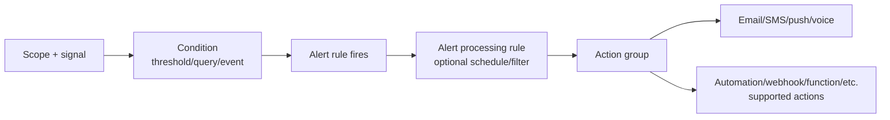

### Alert rule

An alert rule defines target scope, signal/condition, evaluation behavior, severity, and actions. Major types to recognize:

- **Metric alert:** evaluates numeric time-series conditions; low-latency operational thresholds.
- **Log search alert:** runs a KQL query and evaluates returned results/measurements.
- **Activity Log alert:** reacts to selected control-plane/service-health/resource-health events.

### Action group

An action group is a reusable collection of notification and automation receivers. It can serve many alert rules. Test the action group using supported test functionality and verify receiver status, regional/global behavior, and service limits in current documentation.

### Alert processing rule

An alert processing rule changes **actions** after alerts fire—for example, suppress notifications during a maintenance window or add an action group for matching alerts. It does not prevent the alert condition from being evaluated and does not repair the resource.

Troubleshoot “alert did not notify”:

1. Did the signal contain data in the evaluated window?
2. Did the condition actually become true for the required periods?
3. Did the alert instance fire?
4. Did an alert processing rule suppress actions?
5. Is the action group enabled and is the receiver valid?
6. Did the receiver/provider accept delivery?

**Exam trap:** An action group alone watches nothing. An alert rule detects; an action group responds; a processing rule changes action handling.

**Official Microsoft sources:** [Azure Monitor alerts](https://learn.microsoft.com/en-us/azure/azure-monitor/alerts/alerts-overview), [action groups](https://learn.microsoft.com/en-us/azure/azure-monitor/alerts/action-groups), [alert processing rules](https://learn.microsoft.com/en-us/azure/azure-monitor/alerts/alerts-processing-rules)

## 5.5 Azure Monitor Insights and network monitoring

Insights are curated monitoring experiences built from metrics/logs/dependencies and workbooks. They reduce query/dashboard assembly but do not create missing telemetry automatically.

| Insight | Use it for | Validate prerequisites |
|---|---|---|
| VM Insights | VM/VMSS performance, processes, dependencies/map where enabled, health trends | Azure Monitor Agent/data collection and dependency capability as required |
| Storage Insights | Unified storage-account availability, transactions, capacity, and performance views | Correct accounts/subscriptions/workbook permissions and metrics/log configuration |
| Network Insights | Network topology, dependency and health/metric views across supported network resources | Supported resources, permissions, Network Watcher/telemetry as applicable |

Network Watcher and Connection Monitor were covered in [Domain 4](#410-network-watcher-and-packet-flow-troubleshooting). For the monitoring objective, remember that Connection Monitor supplies ongoing tests, metrics, topology, and logs for endpoint reachability/performance. It is more suitable for “alert when this connection degrades over time” than a one-time manual packet test.

**Official Microsoft sources:** [Azure Monitor Insights overview](https://learn.microsoft.com/en-us/azure/azure-monitor/visualize/insights-overview), [VM Insights overview](https://learn.microsoft.com/en-us/azure/azure-monitor/vm/vminsights-overview), [Storage Insights](https://learn.microsoft.com/en-us/azure/storage/common/storage-insights-overview), [Network Insights](https://learn.microsoft.com/en-us/azure/network-watcher/network-insights-overview), [Connection Monitor](https://learn.microsoft.com/en-us/azure/network-watcher/connection-monitor-overview)

## 5.6 Azure Backup

### Backup object model

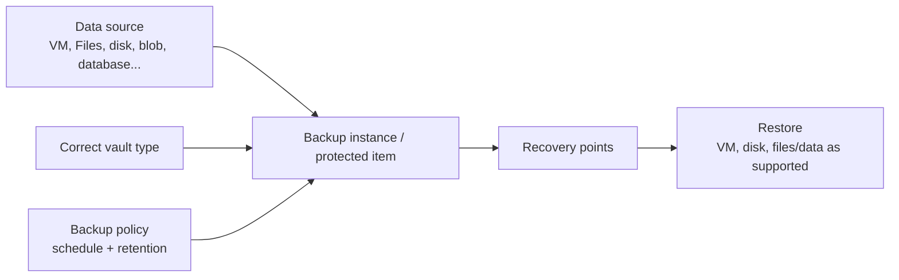

### Recovery Services vault versus Backup vault

The vault type is selected by the data source; they are not interchangeable names.

| Vault | Typical current protected workloads/examples | Also relevant |
|---|---|---|
| Recovery Services vault | Azure VMs, Azure Files, SQL/SAP HANA in Azure VM, MARS/MABS/DPM-supported workloads | Stores Azure Site Recovery configuration/state for supported DR scenarios |
| Backup vault | Newer Azure Backup data sources such as Azure Disks, Azure Blobs, and supported database workloads | Uses the newer Backup Center/data-protection model |

The exact workload/region/tier matrix changes. The [Azure Backup support matrix](https://learn.microsoft.com/en-us/azure/backup/backup-support-matrix) is authoritative. In an exam scenario, identify the data source first, then choose the documented vault.

### Create a vault and policy

**Recovery Services vault workflow:** Create in subscription/resource group/region → review storage redundancy/immutability/soft-delete/security settings → Backup → choose workload/source → select/create policy → enable backup.

**Backup vault workflow:** Create Backup vault → configure redundancy/security → create policy under Backup center/Resiliency → configure backup for supported data source and associate the instance.

A backup policy defines schedule/frequency and retention. It creates recovery points through jobs. Choose policy from required RPO and retention/business rules, subject to workload support. A vault should be protected with RBAC, soft delete/immutability and multi-user authorization capabilities where the documented security requirement calls for them.

### Backup and restore operations

For an Azure VM:

1. Place/create an appropriate Recovery Services vault and policy.
2. Enable protection and run **Backup now** when an immediate point is required.
3. Confirm the job completed and a recovery point exists.
4. Select a recovery point and restore using a supported option—such as create VM, restore disks, replace disks, or file recovery—based on the requirement/current compatibility.
5. Validate the restored data/service; a successful job is not the same as an application recovery test.

For files/data sources, use the matching supported item/recovery-point restore flow. Restore permissions, destination conflicts, network access, encryption keys, and application consistency can affect success.

### Backup troubleshooting

- Confirm the item is registered/associated with the intended vault and policy.
- Inspect the backup job's error code and recommended action.
- Verify VM agent/extension or workload agent state where applicable.
- Verify network/connectivity/private endpoint requirements.
- Verify snapshot/storage/Key Vault permissions and locks/policy interactions.
- Check unsupported disk/data-source configuration in the current support matrix.
- Retry only after correcting the documented cause; do not hide recurring failures.

**Official Microsoft sources:** [Recovery Services vault overview](https://learn.microsoft.com/en-us/azure/backup/backup-azure-recovery-services-vault-overview), [create Backup vault](https://learn.microsoft.com/en-us/azure/backup/create-manage-backup-vault), [Backup support matrix](https://learn.microsoft.com/en-us/azure/backup/backup-support-matrix), [back up an Azure VM](https://learn.microsoft.com/en-us/azure/backup/backup-azure-vms-first-look-arm), [restore Azure VM data](https://learn.microsoft.com/en-us/azure/backup/backup-azure-arm-restore-vms), [Backup security](https://learn.microsoft.com/en-us/azure/backup/security-overview)

## 5.7 Azure Site Recovery

Azure Site Recovery (ASR) orchestrates replication and recovery of supported machines/workloads to a secondary location. For Azure-to-Azure DR, it continuously replicates VM disk changes to the target region and uses recovery points during failover.

### Model

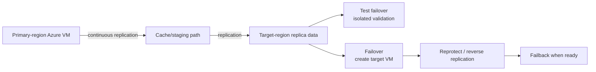

Configure:

1. Create/select Recovery Services vault in the appropriate recovery design.
2. Choose source and target region/subscription/resource group.
3. Map target VNet/subnet and select target settings (availability, disks, encryption) supported by the replication configuration.
4. Enable replication and wait for protected/healthy state.
5. Define recovery plans for ordered multi-machine recovery and automation/manual actions when needed.
6. Run test failover into an isolated/test network; validate applications and clean up test failover.
7. During an incident, choose recovery point/failover, validate and commit according to the current workflow.
8. Reprotect and later fail back when the primary is ready.

### Test, planned, and unplanned failover

- **Test failover:** validates recovery without disrupting replication/production. Use an isolated network to avoid IP/DNS/service conflicts.
- **Planned failover:** coordinated event when source is available; aims to synchronize latest changes before shutdown/failover under the supported scenario.
- **Unplanned failover:** disaster response when source cannot be relied on; select an available recovery point and accept its data-loss implications.

A **recovery plan** orders protection groups/machines and can include manual actions and automation. It is for application-level orchestration, not just storage-copy policy.

### Backup versus Site Recovery

| Requirement | Azure Backup | Azure Site Recovery |
|---|---|---|
| Restore deleted/corrupted data from an earlier point | Yes | Not its primary purpose |
| Long-term recovery-point retention | Yes, by policy/support | Not a backup-retention substitute |
| Start replicated workload in secondary region after outage | No orchestration equivalent | Yes |
| Test regional failover without affecting production | No | Test failover |
| Protection model | Periodic/continuous workload-specific recovery points | Continuous replication plus failover/orchestration |
| Design metric | Recovery point retention and backup RPO/RTO | Replication RPO and application failover RTO |

**RPO** is the acceptable amount of data loss measured in time; **RTO** is the acceptable time to restore service. Backup and ASR can both contribute to resilience but answer different failure/recovery requirements.

**Official Microsoft sources:** [Site Recovery overview](https://learn.microsoft.com/en-us/azure/site-recovery/site-recovery-overview), [Azure-to-Azure architecture](https://learn.microsoft.com/en-us/azure/site-recovery/azure-to-azure-architecture), [test failover](https://learn.microsoft.com/en-us/azure/site-recovery/site-recovery-test-failover-to-azure), [recovery plans](https://learn.microsoft.com/en-us/azure/site-recovery/recovery-plan-overview)

## 5.8 Backup reports and alerts

Current Azure Backup monitoring uses Azure Monitor integration, vault/job views, Azure Business Continuity Center/Resiliency experiences, Backup reports, and alerts according to workload.

- **Job/instance monitoring:** current protection, backup/restore jobs, health and errors.
- **Built-in Azure Monitor alerts:** security and job-failure scenarios supported by Backup.
- **Metric alert rules:** supported Backup health metrics; verify features labeled Preview before using them as a GA design dependency.
- **Backup reports:** use Azure Monitor Logs/Log Analytics data and workbooks for trends, usage, jobs, policy adherence, and optimization.

To configure reporting:

1. Send supported vault diagnostics to a Log Analytics workspace using the current resource-specific diagnostic configuration.
2. Allow ingestion.
3. Open Backup reports/Workbook at the intended scope and time range.
4. Configure action group and applicable built-in/metric alert rules.
5. Trigger/test a safe notification path and validate receiver delivery.

**Official Microsoft sources:** [Backup monitoring and alerts](https://learn.microsoft.com/en-us/azure/backup/monitoring-and-alerts-overview), [Backup reports](https://learn.microsoft.com/en-us/azure/backup/configure-reports), [Azure Business Continuity Center monitoring](https://learn.microsoft.com/en-us/azure/backup/backup-center-monitor-operate)

## 5.9 Domain 5 operational playbook

| Requirement/symptom | Evidence path | Correct design/action |
|---|---|---|
| Notify within minutes when CPU is high | Resource metric → aggregation/window → metric alert → action group | Metric alert, validate scope/dimension and receiver |
| Search detailed storage operations | Diagnostic setting → workspace/table → KQL | Route correct log category, then query correct table/time |
| Find who deleted a resource | Activity Log | Filter administrative events; route for retention beyond current built-in period |
| Silence actions during maintenance but keep alerts | Alert processing rule schedule | Suppress actions; alert evaluation/history continues |
| VM missing from VM Insights | Agent/DCR/workspace and permissions | Correct onboarding/collection path |
| Restore yesterday's deleted files | Correct vault/recovery point | Azure Backup restore, not ASR failover |
| Recover app VMs in another region | ASR replication/health/target network/recovery plan | Test failover, then use appropriate failover during event |
| Backup report empty | Vault diagnostics → Log Analytics ingestion → report scope/time | Configure routing and wait for ingestion; correct filters |

## 5.10 Domain 5 mini quiz

### Question 1

You must determine who deleted a VNet yesterday. Which data source should you inspect first?

A. VM guest syslog only  
B. Subscription Activity Log  
C. Blob versioning  
D. NSG default rules

<details>
<summary>Answer</summary>

**Correct answer:** B.

**Why:** VNet deletion is a Resource Manager control-plane operation recorded in Activity Log.

**Exam objective:** Configure/query log settings in Azure Monitor.  
**Official Microsoft source:** [Azure Activity Log](https://learn.microsoft.com/en-us/azure/azure-monitor/platform/activity-log)

</details>

### Question 2

A metric alert fires during an approved maintenance window, but notifications and automation must be suppressed while the alert remains visible. What should you configure?

A. Delete the metric  
B. Alert processing rule with a schedule  
C. Remove diagnostic settings permanently  
D. Stop the Log Analytics workspace

<details>
<summary>Answer</summary>

**Correct answer:** B.

**Why:** An alert processing rule can suppress actions for matching alerts on a schedule without stopping alert evaluation.

**Exam objective:** Configure alert processing rules.  
**Official Microsoft source:** [Alert processing rules](https://learn.microsoft.com/en-us/azure/azure-monitor/alerts/alerts-processing-rules)

</details>

### Question 3

An operations team must restore a VM's files from a recovery point created seven days ago. Which service is the direct fit?

A. Azure Site Recovery test failover  
B. Azure Backup  
C. Load Balancer  
D. Azure Policy

<details>
<summary>Answer</summary>

**Correct answer:** B.

**Why:** Backup recovery points provide point-in-time data/VM restore workflows. ASR is replicated workload failover, not long-term file-version retention.

**Exam objective:** Perform backup and restore operations.  
**Official Microsoft source:** [Restore files from Azure VM backup](https://learn.microsoft.com/en-us/azure/backup/backup-azure-restore-files-from-vm)

</details>

### Question 4

A business application on three Azure VMs requires an isolated rehearsal of regional recovery without disrupting production replication. What should you perform?

A. Delete the source resource group  
B. ASR test failover using a recovery plan and isolated test network  
C. Regenerate storage keys  
D. Disable health probes

<details>
<summary>Answer</summary>

**Correct answer:** B.

**Why:** Test failover validates the recovery process without affecting the production workload; a recovery plan coordinates multi-VM application recovery.

**Exam objective:** Configure ASR and perform failover.  
**Official Microsoft source:** [Test failover to Azure](https://learn.microsoft.com/en-us/azure/site-recovery/site-recovery-test-failover-to-azure)

</details>

---

# Administrator interface and automation reference

## Portal versus CLI versus PowerShell versus Bicep

| Interface | Best use in AZ-104 administration | Mental model |
|---|---|---|
| Azure portal | Discover properties, follow a one-off guided workflow, inspect effective state, jobs, health, or errors | Visual client for Azure control/data-plane operations |
| Azure CLI | Repeatable shell automation and concise queries across platforms | `az <service> <resource> <verb>` plus resource IDs/scopes |
| Azure PowerShell | Object-based PowerShell administration and automation | `Verb-AzNoun` cmdlets return objects for a pipeline |
| ARM/Bicep | Declaratively deploy consistent resource state | Template + parameters deployed at a defined scope |

Use the portal to understand the object graph, then automate repeated changes. Prefer declarative IaC for environment creation and reviewed configuration. Use imperative CLI/PowerShell for inspection, operational actions, and gaps that are not part of the desired deployment state.

## Azure CLI for AZ-104

These are recognition and lab patterns. Replace placeholders; resolve IDs before destructive or wide-scope operations; use the linked command reference to confirm current parameters.

### Context and inventory

```bash
az login
az account list --output table
az account set --subscription <subscription-id>
az account show --output table

az group create --name rg-az104-lab --location eastus
az resource list --resource-group rg-az104-lab --output table
```

### Identity and RBAC

```bash
az ad user create \
  --display-name 'AZ104 Lab User' \
  --user-principal-name '<user>@<verified-domain>' \
  --password '<secure-temporary-password>' \
  --force-change-password-next-sign-in true

az ad group create --display-name 'AZ104 Storage Readers' --mail-nickname az104storagereaders
az ad group member add --group '<group-object-id>' --member-id '<user-object-id>'

scope=$(az group show --name rg-az104-lab --query id --output tsv)
az role assignment create \
  --assignee-object-id '<group-object-id>' \
  --assignee-principal-type Group \
  --role Reader \
  --scope "$scope"

az role assignment list --scope "$scope" --include-inherited --output table
```

### Governance

```bash
az policy definition list --query "[].{name:name,type:policyType}" --output table
az policy assignment list --scope '<scope-resource-id>' --output table
az policy state list --resource '<resource-id>' --output table

az lock create --name protect-lab --lock-type CanNotDelete --resource-group rg-az104-lab
az lock list --resource-group rg-az104-lab --output table

az tag update \
  --resource-id '<resource-id>' \
  --operation Merge \
  --tags Environment=Lab Owner=AZ104
```

### Storage

```bash
az storage account create \
  --resource-group rg-az104-lab \
  --name '<globally-unique-account>' \
  --location eastus \
  --sku Standard_ZRS \
  --kind StorageV2 \
  --https-only true \
  --min-tls-version TLS1_2

az storage account show --resource-group rg-az104-lab --name '<account>' --output jsonc

az storage container create --account-name '<account>' --name documents --auth-mode login
az storage blob list --account-name '<account>' --container-name documents --auth-mode login --output table
az storage share-rm create --resource-group rg-az104-lab --storage-account '<account>' --name files --quota 100
```

For SAS generation, firewall, lifecycle, versioning, and protection commands, use the exact current service procedure. Security-sensitive flags and schemas vary; do not construct production SAS strings from memory.

### Compute and deployments

```bash
az deployment group what-if \
  --resource-group rg-az104-lab \
  --template-file main.bicep \
  --parameters environment=lab

az deployment group create \
  --name az104-lab-deploy \
  --resource-group rg-az104-lab \
  --template-file main.bicep \
  --parameters environment=lab

az vm list --resource-group rg-az104-lab --show-details --output table
az vm get-instance-view --resource-group rg-az104-lab --name vm-lab --output jsonc
az vm resize --resource-group rg-az104-lab --name vm-lab --size '<supported-size>'

az vmss list-instances --resource-group rg-az104-lab --name vmss-lab --output table

az acr repository list --name '<registry-name>' --output table
az container show --resource-group rg-az104-lab --name aci-lab --output jsonc
az container logs --resource-group rg-az104-lab --name aci-lab

az webapp show --resource-group rg-az104-lab --name '<app-name>' --output jsonc
az webapp deployment slot list --resource-group rg-az104-lab --name '<app-name>' --output table
```

### Networking

```bash
az network vnet show --resource-group rg-az104-lab --name vnet-lab --output jsonc
az network vnet subnet list --resource-group rg-az104-lab --vnet-name vnet-lab --output table
az network vnet peering list --resource-group rg-az104-lab --vnet-name vnet-lab --output table

az network nsg rule list --resource-group rg-az104-lab --nsg-name nsg-app --output table
az network nic list-effective-nsg --resource-group rg-az104-lab --name nic-vm-lab --output jsonc
az network nic show-effective-route-table --resource-group rg-az104-lab --name nic-vm-lab --output table

az network watcher test-ip-flow \
  --resource-group rg-az104-lab \
  --vm vm-lab \
  --direction Inbound \
  --protocol TCP \
  --local 10.20.1.4:443 \
  --remote 203.0.113.10:50000

az network lb show --resource-group rg-az104-lab --name lb-lab --output jsonc
```

### Monitoring

```bash
az monitor metrics list \
  --resource '<resource-id>' \
  --metric '<metric-name>' \
  --interval PT5M

az monitor activity-log list \
  --resource-group rg-az104-lab \
  --offset 1d \
  --output table

az monitor action-group list --resource-group rg-az104-lab --output table
az monitor metrics alert list --resource-group rg-az104-lab --output table
```

**Official Microsoft sources:** [Azure CLI overview](https://learn.microsoft.com/en-us/cli/azure/), [resource groups](https://learn.microsoft.com/en-us/cli/azure/group), [role assignments](https://learn.microsoft.com/en-us/cli/azure/role/assignment), [storage accounts](https://learn.microsoft.com/en-us/cli/azure/storage/account), [VM](https://learn.microsoft.com/en-us/cli/azure/vm), [VNet](https://learn.microsoft.com/en-us/cli/azure/network/vnet), [Azure Monitor](https://learn.microsoft.com/en-us/cli/azure/monitor)

## Azure PowerShell for AZ-104

PowerShell returns objects; filter/select properties instead of scraping formatted text.

```powershell
# Context and resource group
Connect-AzAccount
Get-AzSubscription | Format-Table Name, Id, State
Set-AzContext -SubscriptionId '<subscription-id>'
New-AzResourceGroup -Name 'rg-az104-lab' -Location 'eastus'

# RBAC
$scope = (Get-AzResourceGroup -Name 'rg-az104-lab').ResourceId
New-AzRoleAssignment -ObjectId '<object-id>' -RoleDefinitionName 'Reader' -Scope $scope
Get-AzRoleAssignment -Scope $scope | Select-Object DisplayName, RoleDefinitionName, Scope

# Locks and tags
New-AzResourceLock -LockName 'protect-lab' -LockLevel CanNotDelete -ResourceGroupName 'rg-az104-lab'
Get-AzResourceLock -ResourceGroupName 'rg-az104-lab'
Update-AzTag -ResourceId '<resource-id>' -Tag @{ Environment = 'Lab'; Owner = 'AZ104' } -Operation Merge

# Resources, VMs, networking
Get-AzResource -ResourceGroupName 'rg-az104-lab'
Get-AzVM -ResourceGroupName 'rg-az104-lab' -Status
Get-AzVirtualNetwork -ResourceGroupName 'rg-az104-lab'
Get-AzNetworkSecurityGroup -ResourceGroupName 'rg-az104-lab'

# Deployment
Test-AzResourceGroupDeployment -ResourceGroupName 'rg-az104-lab' -TemplateFile '.\main.bicep'
New-AzResourceGroupDeployment -Name 'az104-lab-deploy' -ResourceGroupName 'rg-az104-lab' -TemplateFile '.\main.bicep'

# Monitoring
Get-AzActivityLog -ResourceGroupName 'rg-az104-lab' -StartTime (Get-Date).AddDays(-1)
```

Do not memorize a long cmdlet list. Recognize `Get/New/Set/Update/Remove-Az...`, inspect with `Get-Help <cmdlet> -Full`, and confirm the current Az module documentation.

**Official Microsoft sources:** [Azure PowerShell documentation](https://learn.microsoft.com/en-us/powershell/azure/), [Az.Resources](https://learn.microsoft.com/en-us/powershell/module/az.resources/), [Az.Compute](https://learn.microsoft.com/en-us/powershell/module/az.compute/), [Az.Network](https://learn.microsoft.com/en-us/powershell/module/az.network/), [Az.Monitor](https://learn.microsoft.com/en-us/powershell/module/az.monitor/)

## ARM/Bicep recognition sheet

```bicep
targetScope = 'resourceGroup'            // deployment scope

@allowed(['dev', 'prod'])
param environment string                 // caller-supplied value
param location string = resourceGroup().location

var appName = 'app-${environment}-${uniqueString(resourceGroup().id)}'

resource plan 'Microsoft.Web/serverfarms@2024-04-01' = {
  name: 'plan-${environment}'             // resource name
  location: location
  sku: {
    name: environment == 'prod' ? 'P1v3' : 'B1'
  }
  properties: {}
}

resource app 'Microsoft.Web/sites@2024-04-01' = {
  name: appName
  location: location
  properties: {
    serverFarmId: plan.id                 // symbolic reference → dependency
    httpsOnly: true
  }
}

output appResourceId string = app.id      // deployment output
```

Read from outside in: deployment scope → parameters → variables → resource type/API version → name/location/SKU/properties → references/dependencies → outputs. Verify current API schema before modifying a real template.

---

# If You See X, Think Y

| Requirement signal | Think about | Verify before choosing |
|---|---|---|
| Administer users/groups/password reset | Microsoft Entra role / SSPR | Tenant, target group, license, authentication-method policy |
| Grant permission to Azure resource | Azure RBAC | Principal, job-function role, smallest scope, inherited assignments |
| Enforce/audit resource configuration | Azure Policy | Definition/effect, assignment scope, exclusions, remediation identity |
| Prevent accidental deletion but allow changes | `CanNotDelete` lock | Inherited locks and control-plane scope |
| Prevent control-plane updates and deletion | `ReadOnly` lock | POST/write side effects; data plane is separate |
| Make tags appear on child resources | Azure Policy for tags | Resource supports tags; no native automatic inheritance |
| Notify at forecast cost threshold | Budget | Scope, actual vs forecast, recipient/action group; budget does not cap cost |
| Give a user Blob data access | Storage Blob **Data** role | Network gate plus data-plane scope |
| Delegate short-lived data access | SAS | User delegation vs service/account SAS, scope, permissions, expiry |
| Revoke a set of service SAS tokens together | Stored access policy | SAS tokens are associated with that policy |
| Rotate a shared account secret | Two storage access keys | Move clients to other key before regeneration; signed SAS impact |
| Survive primary-zone failure | ZRS/GZRS family | Workload/account/tier/region support |
| Read geo-secondary before failover | RA-GRS or RA-GZRS | Service supports readable secondary; application uses secondary endpoint |
| Recover overwritten blob | Versioning/soft delete | Feature enabled before event and recovery point within retention |
| Tier old blobs automatically | Lifecycle management | Base blob/version/snapshot filters/actions and supported tiers |
| Copy blobs between accounts asynchronously | Object replication | Versioning both sides, source change feed, supported configuration |
| Shared SMB files with user identity | Azure Files identity-based auth | Directory source, share-level data role, file/directory ACL |
| Repeatable declarative deployment | Bicep/ARM | Scope, parameter values, what-if, API versions |
| Full OS control | VM | Image, size, disks, NIC, availability, guest management |
| Survive datacenter/zone failure | Availability zones | Regional/resource support and multi-instance app architecture |
| Separate rack/maintenance domains without zones | Availability set | At least two VMs; fault/update domains |
| Autoscaling group of VMs | VM Scale Set | Orchestration mode, image/model, health, LB, autoscale |
| Store container images | ACR | Push/pull identity/RBAC and network access |
| Run simple/finite container | ACI | CPU/memory, restart policy, IP lifecycle |
| Revisions, traffic split, event/HTTP scale | Container Apps | Environment, ingress, revision mode, scale trigger/min/max |
| Managed web/API runtime | App Service | Plan SKU/capacity, app settings, network, TLS, monitoring |
| Scale several apps sharing compute | App Service plan scale | Apps share plan workers; check tier limits/quota |
| App makes outbound calls into VNet | App Service VNet integration | Integration subnet, DNS, routes, destination controls |
| Clients reach App Service by private IP | App Service private endpoint | Inbound DNS, approval, public endpoint restriction |
| Validate release then switch traffic | Deployment slot/swap | Sticky settings, unswapped configuration, supported tier |
| Connect two non-overlapping VNets | VNet peering | Both directions, no transitivity, route/NSG, gateway settings |
| Force subnet traffic through firewall | UDR to virtual appliance | Longest prefix, table association, forwarding/return path |
| Group workloads in NSG rules | ASG | ASG is referenced by NSG rule; compatible NIC/VNet constraints |
| Determine why packet is allowed/denied | IP flow verify/effective NSG rules | Exact direction/protocol/source/destination/ports |
| Determine selected Azure route | Network Watcher Next hop/effective routes | Source NIC, destination IP, UDR/BGP/system route |
| RDP/SSH without VM public IP | Azure Bastion | Correct subnet/SKU/NSG/route and guest credentials |
| Restrict subnet to PaaS public endpoint | Service endpoint + PaaS firewall | Service support, subnet endpoint and firewall rule, data auth |
| Give PaaS resource a VNet private address | Private endpoint | Correct subresource, approval, private DNS, public access separately |
| Public authoritative domain records | Azure public DNS zone | Domain delegation to Azure name servers |
| Private VNet-only name resolution | Azure Private DNS zone | VNet links/registration and connected-network resolver path |
| Distribute TCP/UDP on public IP | Public Standard Load Balancer | Backend pool, rule, probe, NSG |
| Distribute TCP/UDP on private IP | Internal Standard Load Balancer | Private frontend subnet/address and client routing |
| Route by HTTP host/path or require WAF | Application Gateway v2/WAF_v2 | This is Layer 7; avoid retired v1 |
| Fast numeric threshold alert | Azure Monitor metric alert | Aggregation, dimension, window, action group |
| Search rich event details | Azure Monitor Logs/KQL | Diagnostic setting/DCR, workspace, table, time range |
| Find who changed an Azure resource | Activity Log | Control-plane event and retention/routing |
| Route resource logs to workspace | Diagnostic setting | Correct category and destination |
| Suppress actions during maintenance | Alert processing rule | Alerts still fire; schedule and target scope |
| Restore old data/resource state | Azure Backup | Correct vault/workload, policy and recovery point |
| Fail workload over to second region | Azure Site Recovery | Replication health, target network, recovery plan, test failover |

---

# AZ-104 Decision Guide

| Requirement | Azure feature/service | Why | Common wrong choice |
|---|---|---|---|
| Directory administrator creates users | Microsoft Entra role | Directory-object authorization | Azure Contributor, which manages resources |
| Team manages one resource group | Azure RBAC at RG scope | Least-scope authorization inherited by its resources | Subscription-wide role |
| Restrict deployments to approved regions | Azure Policy | Evaluates/denies resource configuration | RBAC, which answers who may deploy |
| Allow updates but block deletion | `CanNotDelete` lock | Narrow control-plane deletion protection | `ReadOnly`, which blocks updates too |
| Categorize spend by department | Resource tags + Cost Management | Metadata supports grouping/reporting | Management-group tags, which are not supported |
| Notify before budget overrun | Cost Management budget | Actual/forecast thresholds and notification | Assuming budget stops resources |
| Preferred identity-based blob access | Entra authentication + Blob Data RBAC role | Named identity, scoped authorization, no shared key | Contributor without a data role |
| Delegated blob access signed through Entra | User delegation SAS | Avoids signing with account key and limits scope/time | Account key distribution |
| Zone-local storage resilience | ZRS | Synchronous copies across zones | GRS, whose primary is LRS |
| Zone plus regional storage resilience | GZRS | Primary ZRS plus async secondary region | ZRS alone |
| Object REST semantics and lifecycle tiers | Blob Storage | Containers/blobs, tiering/versioning/lifecycle | Azure Files merely because data is “a file” |
| Shared SMB/NFS file system | Azure Files | Managed file shares and file protocols | Blob containers as mounted shares without compatible design |
| Interactive storage administration | Storage Explorer | GUI for accounts/services/data | AzCopy for browsing and property management |
| High-volume scripted storage transfer | AzCopy | Purpose-built copy/sync | Manual portal upload |
| Reviewable infrastructure deployment | Bicep | Concise declarative Resource Manager source | One-off portal construction only |
| Persistent VM application data | Managed data disk | Survives host/deallocation operations | Temporary disk |
| Regional datacenter isolation | Availability zones | Physically separate datacenters in region | Availability set |
| Homogeneous elastic compute fleet | VMSS | Managed instance model, availability and autoscale | Individually managed VMs |
| Private container artifact repository | ACR | Image storage/distribution | ACI/Container Apps |
| One-shot container process | ACI with appropriate restart policy | Simple serverless container group | VMSS unless OS/fleet control is needed |
| Managed microservice with revisions | Container Apps | Revisions, ingress, traffic and KEDA scaling | ACI for a revisioned application platform |
| Increase App Service worker size | Scale up plan | Changes SKU/worker capabilities | Scale out, which changes instance count |
| Blue/green App Service validation | Deployment slot | Live staging endpoint and swap | Editing production directly |
| Spoke uses hub's VPN gateway | Peering gateway transit/use remote gateways | Shares documented hub gateway path | Assuming peering transit automatically |
| Express NSG rules by app tier | ASGs referenced in NSG rules | Logical NIC grouping | ASG alone, which has no rules |
| Private VM administration | Bastion | Managed RDP/SSH to VM private IP | Public IP + Internet-open management port |
| PaaS public endpoint restricted to subnet | Service endpoint + service firewall | Subnet identity on optimized route | Private endpoint if private IP is not required |
| PaaS private IP and connected on-prem access | Private endpoint + DNS | Private Link NIC/address in VNet | Service endpoint |
| Internal TCP service across healthy VMs | Internal Load Balancer | Layer 4 private frontend | Application Gateway unless HTTP L7 behavior is needed |
| Web path-based routing and WAF | Application Gateway WAF_v2 | Layer 7 HTTP routing/security | Azure Load Balancer |
| Identify NSG rule for a packet | IP flow verify | Tests exact five-tuple/direction | Packet capture as the first answer |
| Continuous endpoint reachability | Connection Monitor | Ongoing test/metrics/logs | One-time Next hop only |
| Detailed cross-resource query | Log Analytics + KQL | Structured logs in tables | Metrics Explorer only |
| Reusable notification receivers | Action group | Separates actions from alert condition | Duplicate receiver configuration ad hoc |
| Keep alert but mute maintenance actions | Alert processing rule | Post-fire action handling | Disable every alert rule |
| Point-in-time restore | Azure Backup | Recovery points and restore | Site Recovery failover |
| Regional application continuity | Azure Site Recovery | Replication and orchestrated failover | Backup alone |

## Exam traps: the distinctions that remove distractors

### Entra role vs Azure role

- User Administrator creates/manages directory users.
- Contributor creates/manages Azure resources at assigned scope.
- Global Administrator is not automatically Owner of every subscription.

### RBAC vs Policy vs lock

- RBAC: **who may take an action?**
- Policy: **what resource state is allowed/required?**
- Lock: **may a control-plane change/delete proceed despite authorization?**

### Storage identity vs SAS vs key

- Identity/RBAC is attributable and preferred when supported.
- SAS delegates a bounded set of data operations for a bounded time.
- An account key is a broad shared secret; rotate with the two-key pattern.
- Network allowance is still required for all three.

### Service endpoint vs private endpoint

- Service endpoint secures access from a selected subnet to a **public** PaaS endpoint.
- Private endpoint maps one PaaS subresource to a **private IP** in a VNet.
- Private Endpoint success commonly depends on private DNS; public access must be restricted separately.

### NSG vs ASG

- NSG contains stateful allow/deny rules.
- ASG names/groups workload NIC configurations for use inside NSG rules.

### Availability set vs zone vs VMSS

- Availability set spreads VMs across fault/update domains in its placement model.
- Zone is a physically separate datacenter boundary within a region.
- VMSS manages/scales a VM fleet and can use supported zonal/non-zonal availability.

### ACI vs Container Apps

- ACI is a simple container group/process runtime.
- Container Apps is a revisioned application/jobs platform with ingress and managed scaling.
- ACR stores images; it is neither runtime.

### App Service plan vs app

- Plan = region/OS/SKU/worker capacity and shared compute.
- App = application configuration/content/runtime hosted on that plan.
- Scaling the plan affects capacity available to its apps.

### Metrics vs logs

- Metrics: numeric time series, fast chart/threshold.
- Logs: structured event records, KQL and richer investigation.
- Activity Log: subscription control-plane events.

### Backup vs Site Recovery

- Backup recovers data/resource state from recovery points.
- Site Recovery replicates and orchestrates workload failover.

---

# AZ-104 Troubleshooting Matrix

| Symptom | Likely area | Check | Microsoft tool/evidence | Likely resolution path |
|---|---|---|---|---|
| User cannot manage RG resources | Azure RBAC | Principal/object ID, direct/group/inherited assignment, role actions, scope, token | IAM → Check access; `az role assignment list` | Assign correct built-in role at smallest scope; refresh session after propagation |
| User can manage storage account but not blobs | Data-plane RBAC | Storage Blob Data role and network gate | IAM data role; Storage diagnostics | Assign suitable Blob Data role; keep management role separate |
| Guest cannot access resource | External identity/RBAC | Invitation redemption identity, tenant, group membership, RBAC scope | Entra user properties; IAM Check access | Redeem with intended identity and grant least resource access |
| User cannot use SSPR | Entra authentication | SSPR target scope, license, method policy, registration | Entra password reset/authentication methods and audit | Include user/group; enable/register supported methods; validate writeback if used |
| Deployment denied despite Contributor | Policy | Deny assignment/compliance result, definition parameters, scope | Deployment error; Policy compliance | Make deployment compliant or obtain approved Policy exemption/change |
| Cannot delete resource | Lock/Policy/RBAC | Inherited lock, authorization, dependent child | Locks; Activity Log; Policy | Remove lock with authorization or correct dependency/policy through approved change |
| Expected tag absent on resources | Tags/Policy | Tags on parents and tag-policy assignment/remediation | Policy compliance | Assign supported inherit/modify policy and remediate |
| Budget notification missing | Cost Management | Correct scope, threshold type, recipients/action group, evaluation/data delay | Cost Management alerts/budget history | Correct budget condition or action group; test receiver |
| Blob returns 403 | Storage network/auth | Endpoint/DNS, public/firewall/PE, token type, data role, SAS expiry/scope, path | Storage networking; IAM; client error; logs | Fix the exact network or authorization gate |
| SAS clients all need revocation | SAS governance | SAS type, signing key, stored policy association | Container/share access policy | Modify/delete linked stored policy, or rotate signing key if no policy and accept impact |
| Storage private path fails | Private Endpoint | Subresource, approval, NIC, private zone/record/link, client route | Connection state; `nslookup`; Connection Monitor | Correct PE/DNS; create separate endpoint for each used service subresource |
| Blob cannot be read immediately | Access tier | Archive status and rehydration state | Blob properties/operation status | Rehydrate to supported online tier and wait for completion |
| Deleted blob/container unavailable | Data protection | Was feature enabled before deletion? retention expired? object vs container protection? | Blob versions/deleted objects | Undelete/promote within retention; otherwise restore from independent protection if available |
| Azure Files user denied folder | Files identity/ACL | Identity source, share role, directory/file ACL, network | File share IAM and ACL tools | Correct both share-level RBAC and ACL path |
| ARM/Bicep deployment failed | Resource Manager | Deployment scope, error code, params, API schema, Policy, RBAC, quota | Deployment operations; what-if; Activity Log | Correct failing declaration/permission/quota; redeploy idempotently |
| VM provisioning failed | Compute dependency | Image/size availability, quota, disk/NIC/subnet, Policy, extension | VM deployment operations/instance view | Fix exact dependency/quota/policy/extension error |
| VM cannot resize | Size/placement | SKU in region/zone/cluster, quota, disk/feature compatibility | Size list; quota; Activity Log | Choose compatible SKU or deallocate after protecting temp state/dynamic IP |
| VM boots but data missing | Disk model | Whether data lived on temporary disk; data disk mount | VM/disk configuration; guest OS | Restore from backup if possible; persist future data on managed disk |
| VMSS does not add instances | Autoscale | Metric data, rule window/cooldown, min/max, capacity/quota, errors | Autoscale run history; metrics; Activity Log | Correct rule/signal/capacity/quota and instance health |
| Container cannot pull ACR image | Registry auth/network | Registry/image/tag/digest, pull role/credential, firewall/private DNS | ACR logs/diagnostics; container events | Assign least pull role and fix image/network reference |
| ACI task restarts forever | Container lifecycle | Restart policy and process exit code | Container state/events/logs | Use `Never`/`OnFailure` as required; repair failing process |
| Container App stays at zero | Scaling | Min replicas, trigger activity/auth/metadata, revision active, ingress | Container Apps metrics/logs/revision view | Correct scale trigger/auth or minimum; route traffic to active revision |
| App Service custom domain invalid | DNS/TLS | Required A/CNAME/TXT, ownership validation, certificate validity/binding | DNS lookup; App Service custom domains/TLS | Correct DNS, validate hostname, import/renew and bind certificate |
| App Service cannot reach VNet service | Outbound networking | VNet integration subnet, DNS, route, NSG, destination PE/firewall | App Service network troubleshooter; DNS/connection tests | Fix integration/outbound path; do not use app PE as outbound substitute |
| App Service not reachable privately | Inbound Private Link | PE approval, DNS record/link, client route, public access configuration | `nslookup`; PE state; Connection Monitor | Fix inbound PE/DNS/routing and public access setting |
| Slot swap exposes wrong database | Slot configuration | Sticky setting status, config source, swap preview | Deployment slot configuration/activity | Mark environment-specific setting sticky; correct and swap back if necessary |
| Peered VNet cannot connect | Peering/routing/security | Both peer states/options, non-overlap, effective routes, NSGs, guest listener | Peer view; Next hop; IP flow verify | Correct directional peering/options/UDR/NSG/listener |
| Packet denied unexpectedly | NSG | Exact five-tuple/direction; subnet and NIC NSGs; priority; default rules | Effective security rules; IP flow verify | Change narrow higher-priority rule at correct association |
| Traffic bypasses NVA | UDR | Route table association, longest prefix, effective route, route propagation | Effective routes; Next hop | Add/correct more-specific UDR and forwarding/return route |
| Bastion cannot open session | Bastion path/guest | Bastion deployment/subnet/SKU, NSGs/routes, target private IP, guest service/credentials | Bastion diagnostics; Connection troubleshoot | Correct platform path or guest RDP/SSH/authentication |
| Private endpoint works by IP but not name | DNS | Client resolver, private zone name/record, VNet link, on-prem forwarding/cache | `nslookup`/`Resolve-DnsName` | Link/fix private zone and conditional resolution; avoid hard-coded IP |
| Load balancer backend unhealthy | Probe/app/security | Pool membership, probe port/path, listener, NSG service tag, guest firewall | LB health/probe status; IP flow/Connection troubleshoot | Fix probe/application/NSG and rule association |
| Load balancer reachable but wrong app traffic behavior | L4/L7 choice | Need host/path/TLS/WAF? LB rule ports? | Flow logs/app logs | Use Application Gateway for L7 need; otherwise correct LB rule/backend |
| Metric chart seems to hide one bad VM | Metrics aggregation | Dimension split and aggregation | Metrics Explorer | Split by instance/dimension or use per-resource alert |
| No logs in workspace | Collection/routing | Resource log category, diagnostic setting/DCR, destination workspace, time range/table, ingestion | Diagnostic settings; workspace tables | Route correct logs, correct query/table/time, allow ingestion |
| Alert condition met but no notification | Alert pipeline | Fired alert instance, processing rule, action group/receiver | Alert history and action-group test | Correct condition/actions or scheduled suppression/receiver |
| VM absent from Insights | Monitoring onboarding | Agent, DCR/workspace association, permissions, supported OS | VM Insights onboarding/agent health | Complete onboarding and verify data collection |
| Backup job failed | Backup | Correct vault/policy/instance, agent/extension, storage/network/key/lock/support | Backup job error/recommended action | Apply documented fix for exact code; rerun and verify recovery point |
| Restore completes but app fails | Recovery validation | Restored network/DNS/identity/key/config/data consistency | Restore job plus app/network logs | Reconnect dependencies and validate at application layer |
| ASR replication unhealthy | DR replication | Mobility/extension status, cache/target resources, network, quota, key/permissions | Site Recovery health/jobs/errors | Fix documented replication error and wait for healthy state |
| Failover VM cannot serve traffic | DR orchestration/network | Recovery point, target VNet/subnet, NSG, IP/DNS/LB, boot/app order | Recovery plan/job; target network/monitoring | Correct mappings/sequence/DNS/backend and validate through test failover |
| Backup report is empty | Reporting pipeline | Vault diagnostics, workspace/table, report scope/time and ingestion | Diagnostic setting; Log Analytics; Backup reports | Configure routing and correct scope/time after ingestion |

---

# AZ-104 Hands-On Checklist

Use a disposable lab subscription/resource group, organization-approved region, and a cost budget. Record evidence for each item, then remove lab resources through the approved cleanup process after checking locks.

## Identity and governance labs

- [ ] Create an internal user and update its properties. *(Create users; manage properties.)*
- [ ] Create a security group, add/remove the lab user, and inspect membership. *(Create groups; manage properties.)*
- [ ] Inspect direct and group-based license assignment status; document prerequisites rather than buying a license solely for the lab. *(Manage licenses.)*
- [ ] Invite an external test identity and inspect redemption/user type. *(Manage external users.)*
- [ ] Enable SSPR for a pilot group, register a supported method, and perform a test reset. *(Configure SSPR.)*
- [ ] Assign Reader to a group at resource-group scope and verify inherited access on a resource. *(Built-in roles; scope; interpret access.)*
- [ ] Compare Owner, Contributor, Reader, User Access Administrator, and a Storage Data role in the role-definition view. *(Manage built-in roles.)*
- [ ] Assign a built-in audit Policy, deploy one compliant and one noncompliant resource, and inspect compliance. *(Implement/manage Policy.)*
- [ ] Apply `CanNotDelete` to a test resource group; prove update works and deletion is blocked. *(Resource locks.)*
- [ ] Add a tag to a resource group and prove it does not automatically appear on a child; use a test tag Policy if authorized. *(Tags.)*
- [ ] Create/move a disposable resource between resource groups after validating support; observe resource ID. *(Resource groups/subscriptions.)*
- [ ] Inspect management-group hierarchy and inherited Policy/RBAC without changing production. *(Management groups.)*
- [ ] Create a small monthly lab budget with an actual and forecast notification. *(Costs/alerts/budgets.)*
- [ ] Review applicable Azure Advisor cost/reliability recommendations and record why one does or does not apply. *(Advisor.)*

## Storage labs

- [ ] Create a Standard GPv2 storage account with secure transfer and a deliberate redundancy choice. *(Create/configure account; redundancy.)*
- [ ] Create a blob container and a file share; compare endpoints and data models. *(Blob container; Azure file share.)*
- [ ] Assign a Blob Data role to the lab identity and prove management Contributor alone is insufficient for blob read. *(Storage access.)*
- [ ] Generate a narrow, expiring SAS in a safe lab and test only its intended operation. *(SAS.)*
- [ ] Create a stored access policy, issue linked service SAS, then change/revoke through the policy. *(Stored access policies.)*
- [ ] Practice two-key rotation logic with a non-production client; record impact on key-signed SAS. *(Access keys.)*
- [ ] Restrict storage to a selected subnet using service endpoint/firewall and validate authorization remains required. *(Storage firewall/VNets.)*
- [ ] Create a blob private endpoint, link private DNS, and prove the account FQDN resolves privately from the VNet. *(Private access integration.)*
- [ ] Configure Blob versioning, blob/container soft delete, overwrite/delete test data, and restore it. *(Versioning; soft delete.)*
- [ ] Create a lifecycle rule on a test prefix and inspect its filter/actions. *(Lifecycle management; tiers.)*
- [ ] Configure source/destination prerequisites and inspect object-replication policy, even if cost constraints prevent running it. *(Object replication.)*
- [ ] Inspect Microsoft-managed versus customer-managed encryption settings and document required identity/key permissions. *(Encryption.)*
- [ ] Take an Azure Files share snapshot, change a file, and restore the earlier file. *(File snapshots.)*
- [ ] Enable file-share soft delete, delete/restore a disposable share. *(Azure Files soft delete.)*
- [ ] Configure/inspect Azure Files identity-based authentication layers in an eligible lab or write the exact design if no directory lab exists. *(Identity-based Azure Files.)*
- [ ] Browse data with Storage Explorer and transfer a directory using AzCopy with identity/SAS. *(Storage Explorer; AzCopy.)*

## Compute labs

- [ ] Read an ARM JSON template and label parameters, variables, resources, dependencies, outputs, and scope. *(Interpret ARM.)*
- [ ] Modify one verified ARM property, validate/what-if, and deploy. *(Modify/deploy ARM.)*
- [ ] Read and modify equivalent Bicep; use a symbolic resource reference and output. *(Interpret/modify/deploy Bicep.)*
- [ ] Export a disposable RG template and decompile JSON to Bicep; list the cleanup/refactoring needed. *(Export/convert.)*
- [ ] Deploy a VM without a public IP; identify image, size, OS disk, NIC, subnet, NSG, and availability choice. *(Create VM.)*
- [ ] Attach/initialize a managed data disk and compare it with the temporary disk. *(Manage VM disks.)*
- [ ] Inspect encryption at host support/configuration and ADE status/retirement guidance. *(VM encryption.)*
- [ ] Resize a VM after checking size availability/quota; note reboot/deallocation implications. *(Manage VM sizes.)*
- [ ] Validate the documented steps for RG/subscription movement and for Azure Resource Mover regional movement. *(Move VM.)*
- [ ] Deploy two test VMs using an availability set or zones and diagram the failure boundary. *(Availability sets/zones.)*
- [ ] Create/inspect a Flexible VMSS, its health/load-balancer relationship, and an autoscale rule. *(VMSS.)*
- [ ] Create ACR and push/import a small test image using least-privilege access. *(ACR.)*
- [ ] Run a finite ACI job with `Never`, inspect state/logs, then compare `OnFailure`. *(ACI sizing/scaling/lifecycle.)*
- [ ] Deploy a Container App, create a revision, configure ingress and a safe scale range, inspect replicas. *(Container Apps.)*
- [ ] Create an App Service plan and app; prove which settings/capacity belong to each. *(Plan/app.)*
- [ ] Scale the plan manually and inspect supported autoscale options. *(App Service scaling.)*
- [ ] Map a lab custom domain and bind a valid certificate if an approved domain is available; otherwise document the DNS/TLS workflow. *(DNS/TLS.)*
- [ ] Configure App Service outbound VNet integration, then distinguish it from an inbound private endpoint. *(Networking.)*
- [ ] Create a custom backup, run it, inspect the job, and restore to a test slot/app where supported. *(App Service backup.)*
- [ ] Create a staging slot, mark an environment value sticky, deploy, validate, swap, and verify which value stayed. *(Deployment slots.)*

## Networking labs

- [ ] Design a non-overlapping VNet address plan and calculate usable `/24`, `/26`, `/29` subnet addresses. *(VNet/subnets.)*
- [ ] Create two VNets/subnets and peer both directions; inspect effective routes. *(Peering.)*
- [ ] Inspect a Standard public IP's allocation/SKU/zone settings and consuming resource. *(Public IP.)*
- [ ] Create a route table with a safe lab route, associate it to a subnet, and use Next hop. *(UDRs.)*
- [ ] Create NSG rules with deliberate priority; associate subnet/NIC and inspect effective security rules. *(NSGs.)*
- [ ] Create ASG-Web and ASG-API, assign NICs, and reference them in an NSG rule. *(ASGs.)*
- [ ] Use IP flow verify for a known allowed and denied tuple. *(Effective security rules/troubleshooting.)*
- [ ] Deploy/inspect Bastion with the correct subnet and connect to a private-IP VM. *(Bastion.)*
- [ ] Compare a PaaS service endpoint rule with a private endpoint using DNS/routing evidence. *(Service/private endpoints.)*
- [ ] Create a private DNS zone, link a VNet, create a record, and resolve it from a VM. *(Azure DNS.)*
- [ ] Build a Standard public or internal Load Balancer with two backends, a probe, and a rule; cause/recover one unhealthy backend. *(Load balancing/troubleshooting.)*
- [ ] Configure Connection Monitor between two lab endpoints and inspect reachability/latency evidence. *(Network Watcher/Connection Monitor.)*

## Monitoring, backup, and recovery labs

- [ ] Chart a VM or storage metric with two aggregations and a dimension; explain the difference. *(Interpret metrics.)*
- [ ] Route one resource-log category and the Activity Log to a Log Analytics workspace. *(Log settings.)*
- [ ] Run KQL with time filter, `where`, `project`, and `summarize` against real lab data. *(Query/analyze logs.)*
- [ ] Create a metric alert and reusable action group; safely test receiver delivery. *(Alert rule/action group.)*
- [ ] Create a scheduled alert processing rule that suppresses actions, and confirm alert history remains. *(Processing rules.)*
- [ ] Onboard/inspect VM, Storage, and Network Insights; identify each data prerequisite. *(Insights.)*
- [ ] Create the vault type appropriate for an Azure VM; compare its data sources with Backup vault. *(Recovery Services/Backup vaults.)*
- [ ] Configure a VM backup policy, run Backup now, inspect the recovery point, and restore disks/files to a safe target. *(Policy/backup/restore.)*
- [ ] Configure/inspect ASR for a test Azure VM, target network mappings, and replication health. *(ASR.)*
- [ ] Run an isolated ASR test failover and cleanup, or fully document the workflow if a second-region lab is not affordable. *(Failover.)*
- [ ] Configure Backup diagnostics/reports/alerts and trace one job from vault to Log Analytics/report/action group. *(Reports/alerts.)*

---

# Scenario Reasoning Method

For any AZ-104 scenario, write a six-line scratch analysis:

```text
1. Required outcome:
2. Scope/failure boundary:
3. Principal and required action:
4. Network path and endpoint:
5. Availability/recovery target:
6. Evidence that proves success:
```

Then apply:

**Requirement → important signal → eliminate wrong service classes → choose the narrowest sufficient configuration → verify prerequisites and side effects.**

Example:

- **Requirement:** An app in a VNet must read a private blob endpoint without secrets.
- **Signals:** private IP; app identity; read only.
- **Eliminate:** service endpoint (public service IP), account key/SAS (shared/delegated secret), Contributor (management plane).
- **Best choice:** Blob private endpoint + private DNS + app managed identity with Storage Blob Data Reader.
- **Verify:** PE approved; FQDN resolves private; route/NSG path; role at container/account scope; token refresh; blob read succeeds.

---

# Original Mixed AZ-104 Practice Scenarios

These questions are original and documentation-derived; they are not live exam questions or dumps.

## Mixed Question 1 — private, secretless blob access

An App Service API must read blobs. Security requires no account keys or SAS tokens and no public network path to the storage account. The API must still call an on-premises API through an existing connected VNet. Which configuration is best?

A. Storage account key in an app setting and an IP firewall rule  
B. App managed identity with Storage Blob Data Reader, App Service VNet integration, a Blob private endpoint, and private DNS  
C. Contributor on the storage account and an App Service private endpoint only  
D. User delegation SAS and a service endpoint

<details>
<summary>Answer</summary>

**Correct answer:** B.

**Why:** Managed identity plus Blob Data Reader supplies secretless data authorization. VNet integration is the app's outbound path. A private endpoint supplies the blob private IP, and private DNS directs the standard FQDN to it. The connected VNet can also carry the on-premises outbound path subject to routing/security.

**Why alternatives are wrong:** A uses a broad secret and public path. C uses a management role and an inbound App Service endpoint, neither of which provides blob data authorization/outbound connectivity. D still uses a delegated token and a service endpoint's public service endpoint, contrary to the requirements.

**Exam objectives:** Interpret access; configure Storage networking; configure App Service networking; configure private endpoints.  
**Official Microsoft sources:** [authorize Storage data](https://learn.microsoft.com/en-us/azure/storage/common/authorize-data-access), [App Service VNet integration](https://learn.microsoft.com/en-us/azure/app-service/overview-vnet-integration), [Storage private endpoints](https://learn.microsoft.com/en-us/azure/storage/common/storage-private-endpoints)

</details>

## Mixed Question 2 — governance without excessive permission

The platform team must ensure new resources in a management group use approved regions and contain `CostCenter`. Application teams must continue deploying within their own subscriptions. Existing resources should be reported and remediated where the definitions support it. What should the platform team assign?

A. Owner to every application team at management-group scope  
B. A Policy initiative at management-group scope with appropriate deny/audit/modify effects and a remediation identity  
C. A `ReadOnly` lock on the management group  
D. Tags on the management group

<details>
<summary>Answer</summary>

**Correct answer:** B.

**Why:** An initiative groups configuration rules. Management-group assignment reaches descendant subscriptions; appropriate effects enforce/audit/modify, and the managed identity authorizes remediation for existing resources under supported definitions.

**Why alternatives are wrong:** Owner controls authorization and is excessive; management groups do not support resource locks; tags cannot be placed on management groups and do not auto-inherit.

**Exam objectives:** Configure management groups; implement Policy; manage tags.  
**Official Microsoft sources:** [management groups](https://learn.microsoft.com/en-us/azure/governance/management-groups/overview), [Azure Policy overview](https://learn.microsoft.com/en-us/azure/governance/policy/overview), [tag policies](https://learn.microsoft.com/en-us/azure/azure-resource-manager/management/tag-policies)

</details>

## Mixed Question 3 — recover an overwritten object

A script replaced `contracts/current.pdf` with incorrect content two hours ago. The storage account has blob versioning enabled and the previous version still exists. Regional failover is not required. What is the most direct recovery?

A. Initiate ASR failover  
B. Promote/copy the previous blob version as the current content  
C. Change from GRS to ZRS  
D. Create a new access key

<details>
<summary>Answer</summary>

**Correct answer:** B.

**Why:** Versioning preserves previous blob states, which can be restored by making/copying the intended version current according to the documented workflow.

**Why alternatives are wrong:** ASR is VM/workload DR; redundancy does not select an old logical version; a key changes authentication, not data state.

**Exam objectives:** Configure Blob versioning; manage recovery decisions.  
**Official Microsoft source:** [Blob versioning](https://learn.microsoft.com/en-us/azure/storage/blobs/versioning-overview)

</details>

## Mixed Question 4 — slot and database isolation

A team deploys an App Service release into `staging`. Staging must call a staging database. After swap, production must call the production database and the old production version in staging must call the staging database. What is the critical configuration?

A. Mark each database connection string as a deployment-slot setting with the correct value per slot  
B. Add both databases to one load-balancer backend pool  
C. Use an availability set  
D. Disable TLS during the swap

<details>
<summary>Answer</summary>

**Correct answer:** A.

**Why:** Sticky deployment-slot settings stay with their slot, so production and staging keep environment-specific dependency values while app content/revisions swap.

**Why alternatives are wrong:** Load balancing and availability sets do not control App Service configuration; disabling TLS is unrelated and unsafe.

**Exam objectives:** Configure App Service deployment slots.  
**Official Microsoft source:** [App Service deployment slots](https://learn.microsoft.com/en-us/azure/app-service/deploy-staging-slots)

</details>

## Mixed Question 5 — zonal web tier and fleet scaling

A stateless web tier must run several VMs, distribute instances across availability zones, and add instances when CPU rises. Operators want one managed fleet model. What should they use?

A. One large VM in an availability set  
B. A zone-capable VM Scale Set with health/load-balancing integration and autoscale  
C. Azure Container Registry  
D. Azure Files snapshots

<details>
<summary>Answer</summary>

**Correct answer:** B.

**Why:** VMSS is the managed fleet/scaling construct and supports the documented zonal availability model, health integration, and autoscale.

**Why alternatives are wrong:** One VM is not redundant and an availability set is not an autoscaling fleet; ACR stores images; file snapshots protect share data.

**Exam objectives:** Deploy VMSS; availability zones; manage scaling.  
**Official Microsoft source:** [VM Scale Sets overview](https://learn.microsoft.com/en-us/azure/virtual-machine-scale-sets/overview)

</details>

## Mixed Question 6 — load balancer probe blocked

A new Standard public Load Balancer sends HTTPS traffic to two VMs. Direct testing inside the VNet proves both apps answer on TCP 443, but the load balancer reports both backends unhealthy. An NSG permits client traffic from the Internet but contains no probe-specific allowance. What is the best next action?

A. Add an appropriately scoped rule allowing the documented Azure Load Balancer probe source/service tag to the probe port  
B. Replace the LB with a stored access policy  
C. Assign Global Administrator to the VM  
D. Change the private DNS zone registration link

<details>
<summary>Answer</summary>

**Correct answer:** A.

**Why:** Standard Load Balancer depends on successful health probes, and the NSG must permit the documented probe source to the backend probe port. Confirm the exact effective rule with IP flow/NSG diagnostics.

**Why alternatives are wrong:** The other options concern Storage authorization, directory authorization, or DNS registration, not probe traffic.

**Exam objectives:** Configure/troubleshoot Load Balancer; evaluate NSG effective rules.  
**Official Microsoft sources:** [Load Balancer health probes](https://learn.microsoft.com/en-us/azure/load-balancer/load-balancer-custom-probe-overview), [NSG default rules](https://learn.microsoft.com/en-us/azure/virtual-network/network-security-groups-overview)

</details>

## Mixed Question 7 — alert pipeline diagnosis

A CPU metric alert appears in Fired state, but the on-call team received no message. Metrics Explorer shows the threshold was crossed. What should you examine next?

A. The blob Archive rehydration priority  
B. Alert processing rules, the attached action group, and receiver delivery/test status  
C. The VNet address prefix size  
D. The VM's OS disk tier only

<details>
<summary>Answer</summary>

**Correct answer:** B.

**Why:** The condition already fired. The next stages are action processing/suppression and action-group receiver delivery.

**Why alternatives are wrong:** They cannot explain a fired alert's missing notification.

**Exam objectives:** Configure alert rules, action groups, and processing rules.  
**Official Microsoft sources:** [alerts overview](https://learn.microsoft.com/en-us/azure/azure-monitor/alerts/alerts-overview), [alert processing rules](https://learn.microsoft.com/en-us/azure/azure-monitor/alerts/alerts-processing-rules)

</details>

## Mixed Question 8 — backup plus regional continuity

A regulated application requires 30-day point-in-time restore of Azure VM data and a rehearsed ability to start the multi-VM application in a second region. Which design addresses both requirements?

A. Azure Backup policy only  
B. Azure Site Recovery only  
C. Azure Backup for retention/restore plus Azure Site Recovery and a recovery plan for regional failover  
D. GRS on an unrelated storage account

<details>
<summary>Answer</summary>

**Correct answer:** C.

**Why:** Backup provides retained recovery points; ASR replicates and orchestrates regional application failover. One does not replace the other.

**Why alternatives are wrong:** Each single service omits one stated outcome; unrelated storage redundancy is not VM backup or failover orchestration.

**Exam objectives:** Backup policy/restore; configure ASR/failover.  
**Official Microsoft sources:** [Azure Backup overview](https://learn.microsoft.com/en-us/azure/backup/backup-overview), [Site Recovery overview](https://learn.microsoft.com/en-us/azure/site-recovery/site-recovery-overview)

</details>

## Mixed Question 9 — guest gets only container reads

An invited partner must list and read blobs in one container for a project. The partner must not change the storage account or access other containers. Which approach best applies least privilege?

A. Owner on the subscription  
B. Contributor on the storage account  
C. A suitable Blob Data read role assigned to the guest at container scope, plus the required network path  
D. Give the partner an account access key

<details>
<summary>Answer</summary>

**Correct answer:** C.

**Why:** The data role authorizes only read/list data actions and container scope confines the assignment. Storage networking remains an independent requirement.

**Why alternatives are wrong:** Owner/Contributor are broader management-plane permissions; an account key is a broad shared secret.

**Exam objectives:** Manage external users; assign roles at scope; configure Storage access.  
**Official Microsoft sources:** [Azure RBAC scope](https://learn.microsoft.com/en-us/azure/role-based-access-control/scope-overview), [Storage authorization](https://learn.microsoft.com/en-us/azure/storage/common/authorize-data-access)

</details>

## Mixed Question 10 — deployment rejected before VM creation

A Bicep deployment at resource-group scope fails with a Policy deny error because the VM SKU is not in the approved list. The deployer is Owner at the resource group. What is the correct interpretation?

A. Owner automatically bypasses Azure Policy  
B. The template must use an allowed SKU or an authorized Policy change/exemption must be approved  
C. Regenerating a storage key will fix it  
D. An ASG must be attached to the template

<details>
<summary>Answer</summary>

**Correct answer:** B.

**Why:** RBAC authorization and Policy compliance are distinct gates. Owner can be authorized to deploy while a Policy deny effect blocks a noncompliant resource state.

**Why alternatives are wrong:** Owner does not inherently bypass Policy; Storage keys and ASGs are unrelated to SKU compliance.

**Exam objectives:** Deploy Bicep; implement Policy; interpret access.  
**Official Microsoft sources:** [Policy deny effect](https://learn.microsoft.com/en-us/azure/governance/policy/concepts/effect-deny), [Bicep deployments](https://learn.microsoft.com/en-us/azure/azure-resource-manager/bicep/deploy-cli)

</details>

---

# AZ-104 — Final 60-Minute Review

Use roughly 12 minutes for identity/governance, 10 for storage, 12 for compute, 12 for networking, 7 for monitoring/recovery, and 7 for mixed traps.

## Minute 0–12: identity and governance

- Hierarchy: tenant → tenant root management group → management group → subscription → resource group → resource.
- Subscription is billing/quota/resource boundary associated with one tenant; RG is lifecycle container.
- Entra role administers directory objects; Azure role administers Resource Manager/data actions at a scope.
- RBAC assignment = principal + role definition + scope. Parent assignments inherit downward. Choose smallest scope.
- Owner = resources + role assignments; Contributor = resources, not role assignments; Reader = management read; User Access Administrator/RBAC Administrator = access administration.
- Management role does not automatically grant data-plane access. Look for service **Data** roles.
- Effective access can be direct, group-derived, or inherited; inspect IAM Check access.
- SSPR: None/Selected/All, methods/registration/license, administrators require two methods in documented policy.
- Policy definition + assignment + scope + effect; initiative groups definitions; compliance reports state; remediation corrects supported existing resources.
- `deny` blocks noncompliant create/update; `audit` records; `modify` can change supported fields; `deployIfNotExists` can deploy missing related configuration with managed identity/permissions.
- RBAC = who; Policy = allowed state; lock = block control-plane update/delete.
- `CanNotDelete` permits update; `ReadOnly` blocks control-plane write/delete. Locks inherit and do not protect all data-plane deletion.
- Tags do not inherit automatically and are not supported on management groups; use Policy for inheritance/compliance.
- Budget alerts on actual/forecast but does not cap/stall resources. Advisor gives recommendations.
- RG/subscription move changes resource ID; same-tenant subscriptions, support/dependencies/locks. It does not change region.

## Minute 12–22: storage

- Storage account is region/redundancy/network/encryption namespace; GPv2 is general default choice.
- Control plane manages account; data plane reads blobs/files. Both authorization and network gates must pass.
- Preferred identity/RBAC; user delegation SAS is Entra-signed; service SAS can use stored access policy; account SAS spans supported services; key is broad shared secret.
- Stored access policy controls only service SAS. SAS is bearer credential; scope/permissions/expiry/protocol matter.
- Rotate keys by moving clients to the other key before regeneration; key regeneration breaks SAS signed by it.
- Firewall rules use public endpoint; service endpoint trusts selected subnet but DNS remains public; private endpoint is private IP/subresource and needs private DNS.
- LRS: one datacenter. ZRS: zones. GRS: primary LRS + async secondary LRS. GZRS: primary ZRS + async secondary LRS. `RA-` enables secondary reads.
- Geo replication is asynchronous. Archive/redundancy/Azure Files combinations have limits—verify current matrix.
- Encryption at rest is default. CMK adds Key Vault/Managed HSM identity/key lifecycle dependency. Secure transfer/TLS is separate.
- Hot/Cool/Cold are online; Archive offline and must rehydrate. Minimum retention considerations: Cool 30, Cold 90, Archive 180 days.
- Versioning preserves previous blob versions; blob soft delete protects deleted/overwritten objects; container soft delete protects deleted container. Account deletion needs separate protection.
- Lifecycle filters and applies tier/delete actions asynchronously; plan base blobs, versions, snapshots independently.
- Object replication is async block-blob replication; versioning both sides and source change feed are key prerequisites.
- Azure Files = managed SMB/NFS; identity SMB requires directory source + share-level RBAC + file/directory ACL.
- Share snapshot is point-in-time; soft delete protects deleted share; Backup adds policy/recovery points.
- Storage Explorer = GUI; AzCopy = fast scripted transfer.

## Minute 22–34: compute

- Bicep/ARM: scope, params, variables, resource type/API version, properties, dependencies, outputs. Symbolic reference infers dependency.
- Run validation/what-if, deploy at correct scope. Export/decompile is a best-effort starting point.
- VM graph: image + size + OS/data/temp disks + NIC/subnet/NSG + optional public IP + identity/availability.
- Temporary disk is not persistent. Managed data/OS disks are persistent. Snapshot is read-only point-in-time disk copy, not automatically app-consistent policy backup.
- Resize may restart/deallocate; check SKU placement/quota/compatibility; deallocation risks temp data and dynamic IP.
- Encryption at host covers host/cache/temp/disk-flow scenarios; ADE has a documented Sep 15, 2028 retirement—recognize both for current objective.
- Availability set = fault/update domains; zones = physically separate datacenters; VMSS = managed fleet and scaling. Multiple application instances are still necessary.
- Flexible is recommended VMSS orchestration for new workloads; mode cannot be changed after creation. Know health/LB/autoscale pipeline.
- RG/sub move is Resource Manager move; regional move uses Resource Mover/service process and dependency validation.
- ACR stores images; ACI runs simple container groups; Container Apps runs revisioned apps/jobs with ingress and KEDA scaling.
- ACI restart `Never` for one-shot; `OnFailure` for retry on failure; `Always` for persistent behavior.
- Container Apps environment → app → immutable revision → replicas. Multiple mode can split traffic. Scale rule/min/max must match trigger.
- App Service plan = compute/SKU/scale; app = hosted application. Apps in one plan share workers.
- Scale up changes SKU/size; scale out changes instances; distinguish plan autoscale from supported per-app automatic scaling.
- VNet integration = app outbound. Private endpoint = app inbound. Access restrictions filter public inbound.
- Custom domain DNS validation, certificate, and TLS binding are distinct.
- Deployment slot: deploy/test/warm/swap. Sticky settings remain with slot; custom domain/TLS/managed identity/scale do not simply swap.
- App Service custom backup uses Storage/SAS under current docs; restore/test to safe target where possible.

## Minute 34–46: networking

- Five subnet addresses reserved. `/24` → 251 usable; `/26` → 59; `/29` → 3. Plan growth; no overlap for routed/peered networks.
- Peering uses private backbone and is not transitive. Configure both directions; inspect allow traffic/forwarding/gateway-transit options.
- Route chooses longest prefix; equal prefix generally UDR > BGP > system, subject to documented exceptions. Route table associates to subnet.
- NSG stateful first-match rules; lower number first; custom 100–4096; subnet and NIC NSGs must both allow.
- Default inbound: AllowVNet 65000, AllowAzureLoadBalancer 65001, DenyAll 65500. Outbound analogous AllowVNet/Internet then DenyAll.
- ASG groups NIC configurations for NSG references; it does not filter alone.
- Bastion provides RDP/SSH to private IP. Dedicated deployment uses `AzureBastionSubnet`, current `/26` minimum guidance; still need guest credentials and network path.
- Service endpoint = selected Azure subnet to public PaaS endpoint + service firewall. Private endpoint = NIC/private IP + Private Link to one subresource + DNS.
- Creating PE does not automatically disable public endpoint. Blob PE is not File PE.
- Public DNS is authoritative internet zone; Private DNS is linked to VNets; private endpoint name must resolve privately.
- Load Balancer is L4 TCP/UDP. Public vs internal frontend; backend pool; health probe; rule; NAT rule. Standard requires NSG allowance.
- Application Gateway is L7 HTTP(S), host/path, TLS termination, WAF; v1 retired.
- Troubleshoot: DNS → IP → route/Next hop → NSG/IP flow → endpoint/firewall → LB/probe → guest listener.

## Minute 46–53: monitoring and recovery

- Metrics = numeric time series/dimensions/aggregation; logs = records/KQL; Activity Log = subscription control-plane.
- Diagnostic setting routes selected logs/metrics to Log Analytics, Storage, Event Hub, or partner. Workspace existence does not route logs.
- KQL: table → time `where` → filters → `project` → `summarize`. Check correct workspace/table/time.
- Alert rule detects; action group responds; alert processing rule suppresses/adds actions after fire.
- Insights are curated monitoring and require underlying telemetry/onboarding.
- Network Watcher: IP flow verify for NSG rule; Next hop for route; Connection Monitor for continuous reachability/performance; packet capture for packets.
- Recovery Services vault and Backup vault protect different data-source sets—choose from support matrix.
- Backup policy = schedule + retention → recovery points → restore. Run and validate restore.
- ASR = continuous replication + test/planned/unplanned failover + reprotect/failback. Recovery plan orders app recovery.
- Backup restores older state/data; ASR starts replicated workloads in target. Use both when both retention and regional continuity are required.
- Backup diagnostics/Log Analytics power reports; alerts/action groups notify. Trace the entire pipeline.

## Minute 53–60: solve three paths

```text
Access failure:
tenant/principal → role type → scope/inheritance → control/data action → Policy/lock → token

Network failure:
DNS → destination IP → effective route → NSG → service firewall/PE → LB probe → listener

Recovery failure:
correct vault/service → policy/replication healthy → recovery point → target network/identity/key → app validation
```

---

# AZ-104 — Final 20-Minute Review

1. **Scope:** tenant identities; management groups govern subscriptions; subscriptions contain RGs; RGs contain lifecycle-related resources.
2. **Authorization:** principal + role + scope. Entra roles manage directory; Azure roles manage resources/data. Parent assignments inherit.
3. **Governance:** RBAC who; Policy allowed state; lock blocks control-plane changes; tags classify and do not auto-inherit.
4. **Cost:** budget warns on actual/forecast and can invoke actions; it does not automatically stop spend.
5. **Storage gate:** correct endpoint + network + authentication + data authorization + object state.
6. **Storage access:** identity/RBAC preferred; SAS bounded bearer; stored policy only for service SAS; key broad and rotated in pairs.
7. **Redundancy:** LRS datacenter; ZRS zones; GRS LRS+region; GZRS zones+region; RA means readable secondary. Geo is async.
8. **Blob recovery:** versioning for prior writes; soft delete for deletes; container soft delete for container; lifecycle for aged transitions/deletes.
9. **Azure Files identity:** directory authentication → share data role → ACL.
10. **IaC:** read scope/params/resources/API/properties/dependencies/outputs; what-if; export/decompile needs cleanup.
11. **VM:** image/size/disks/NIC/subnet/NSG/availability. Temp disk loses data. Resize may require deallocate.
12. **Availability:** set=fault/update domains; zone=separate datacenter; VMSS=fleet/scale.
13. **Containers:** ACR stores; ACI simple process; Container Apps environment/revision/replica/scale.
14. **App Service:** plan compute; app workload. Outbound VNet integration, inbound PE, slot sticky settings.
15. **Network:** no overlap; peering not transitive; longest prefix route; lower-number first-match NSG; both subnet/NIC must allow.
16. **PaaS network:** service endpoint uses public service IP/subnet rule; private endpoint uses private IP/Private Link/DNS.
17. **Load balance:** Standard LB L4 frontend/pool/probe/rule; App Gateway L7 HTTP/WAF.
18. **Monitor:** metrics fast numeric; logs rich KQL; Activity Log control plane; diagnostic setting routes.
19. **Alert:** rule detects, action group acts, processing rule changes actions.
20. **Recovery:** Backup recovery points/restore; ASR replication/failover. Select correct vault by workload.

---

# AZ-104 — Final 5-Minute Cram Sheet

| Do not confuse | Correct split |
|---|---|
| Entra role / Azure role | Directory administration / Azure resource or data administration |
| RBAC / Policy / lock | Who may act / what state is allowed / whether control-plane change-delete proceeds |
| Owner / Contributor | Resources + roles / resources but not role assignment |
| Management role / data role | Configure service / read-write protected service data |
| SAS / key / identity | Bounded bearer delegation / broad shared secret / named token + RBAC |
| LRS / ZRS / GRS / GZRS | Datacenter / zones / datacenter+region / zones+region; `RA` adds secondary read |
| Blob version / soft delete | Recover overwritten prior version / recover deletion within retention |
| Availability set / zone / VMSS | Fault+update domains / separate datacenter / managed scalable fleet |
| ACR / ACI / Container Apps | Store image / run simple container / revisioned scalable app platform |
| App Service plan / app | Compute capacity / hosted workload |
| VNet integration / private endpoint | App Service outbound / inbound private access |
| Peering / transit | Direct VNet connection / not automatic through hub |
| NSG / ASG | Rules / NIC grouping used in rules |
| Service endpoint / private endpoint | Public PaaS endpoint trusted from subnet / private IP through Private Link |
| Public / internal Load Balancer | Public frontend / private frontend; both L4 |
| Metrics / logs / Activity Log | Numeric series / queryable events / subscription control-plane events |
| Alert rule / action group / processing rule | Detect / notify-act / suppress-add actions |
| Recovery Services vault / Backup vault | Different supported data-source families; check matrix |
| Backup / Site Recovery | Restore point-in-time state / replicate and fail over workload |

**Last packet check:** DNS → route → NSG → endpoint/firewall → load-balancer probe/rule → listener.  
**Last access check:** correct tenant → principal → role → scope/inheritance → control or data plane → Policy/lock.  
**Last exam check:** choose the narrowest feature that satisfies every stated requirement; do not add unrequested capability.

---

# AZ-104 Coverage Matrix

Every line below mirrors an objective in the official “Skills measured as of April 17, 2026” outline. “Practice” points to a quiz, mixed scenario, or hands-on exercise that tests the objective.

## Domain 1 coverage

| Official objective | Guide section | Practice | Status |
|---|---|---|---|
| Create users and groups | [1.1 Microsoft Entra administration](#11-microsoft-entra-administration) | Identity labs | **COVERED** |
| Manage user and group properties | [1.1 Microsoft Entra administration](#11-microsoft-entra-administration) | Identity labs | **COVERED** |
| Manage licenses in Microsoft Entra ID | [Manage licenses](#manage-licenses) | Identity labs | **COVERED** |
| Manage external users | [External users](#external-users) | Mixed Q9; identity labs | **COVERED** |
| Configure self-service password reset (SSPR) | [Configure SSPR](#configure-sspr) | Domain 1 operational playbook; identity labs | **COVERED** |
| Manage built-in Azure roles | [1.2 Azure RBAC](#12-azure-rbac-who-can-do-what-at-which-scope) | Domain 1 Q1/Q4; RBAC lab | **COVERED** |
| Assign roles at different scopes | [Scope and inheritance](#scope-and-inheritance) | Domain 1 Q1; Mixed Q9; RBAC lab | **COVERED** |
| Interpret access assignments | [Interpret access assignments](#interpret-access-assignments) | Domain 1 Q4; Mixed Q1/Q10 | **COVERED** |
| Implement and manage Azure Policy | [Policy](#policy-define-and-evaluate-allowed-resource-state) | Domain 1 Q2; Mixed Q2/Q10; Policy lab | **COVERED** |
| Configure resource locks | [Resource locks](#resource-locks) | Domain 1 Q3; lock lab | **COVERED** |
| Apply and manage tags on resources | [Tags](#tags) | Domain 1 Q2; Mixed Q2; tag lab | **COVERED** |
| Manage resource groups | [Resource groups and moves](#resource-groups-and-moves) | Domain 1 Q6; move lab | **COVERED** |
| Manage subscriptions | [Management groups and subscriptions](#management-groups-and-subscriptions) | Domain 1 Q6; scope labs | **COVERED** |
| Manage costs by using alerts, budgets, and Azure Advisor recommendations | [Cost management](#cost-management-budgets-alerts-and-advisor) | Domain 1 Q5; cost labs | **COVERED** |
| Configure management groups | [Management groups and subscriptions](#management-groups-and-subscriptions) | Mixed Q2; management-group lab | **COVERED** |

## Domain 2 coverage

| Official objective | Guide section | Practice | Status |
|---|---|---|---|
| Configure Azure Storage firewalls and virtual networks | [2.4 Storage network security](#24-storage-network-security) | Domain 2 Q1; Mixed Q1; storage network labs | **COVERED** |
| Create and use shared access signature (SAS) tokens | [SAS anatomy and security](#sas-anatomy-and-security) | Domain 2 Q2; SAS lab | **COVERED** |
| Configure stored access policies | [Stored access policies](#stored-access-policies) | Domain 2 Q2; stored-policy lab | **COVERED** |
| Manage access keys | [Manage access keys safely](#manage-access-keys-safely) | Key-rotation lab | **COVERED** |
| Configure identity-based access for Azure Files | [Identity-based access for Azure Files](#identity-based-access-for-azure-files) | Domain 2 Q4; Files identity lab | **COVERED** |
| Create and configure storage accounts | [2.2 Create and configure storage accounts](#22-create-and-configure-storage-accounts) | Account lab | **COVERED** |
| Configure Azure Storage redundancy | [Redundancy](#redundancy-choose-the-failure-boundary) | Domain 2 Q3; redundancy lab | **COVERED** |
| Configure object replication | [Object replication](#object-replication) | Object-replication lab | **COVERED** |
| Configure storage account encryption | [Encryption](#encryption) | Encryption lab | **COVERED** |
| Manage data by using Azure Storage Explorer and AzCopy | [2.7 Storage Explorer and AzCopy](#27-storage-explorer-and-azcopy) | Tools lab | **COVERED** |
| Create and configure an Azure file share | [2.6 Azure Files](#26-azure-files) | File-share lab | **COVERED** |
| Create and configure a container in Blob Storage | [Containers, blobs, and access](#containers-blobs-and-access) | Container lab | **COVERED** |
| Configure storage tiers | [Access tiers](#access-tiers) | Domain 2 Q5; lifecycle/tier lab | **COVERED** |
| Configure soft delete for blobs and containers | [Versioning and soft delete](#versioning-soft-delete-container-soft-delete) | Recovery lab; Mixed Q3 | **COVERED** |
| Configure snapshots and soft delete for Azure Files | [Share snapshots, soft delete, and backup](#share-snapshots-soft-delete-and-backup) | Files snapshot/soft-delete labs | **COVERED** |
| Configure Blob Storage lifecycle management | [Lifecycle management](#lifecycle-management) | Lifecycle lab | **COVERED** |
| Configure Blob Storage versioning | [Versioning and soft delete](#versioning-soft-delete-container-soft-delete) | Mixed Q3; recovery lab | **COVERED** |

## Domain 3 coverage

| Official objective | Guide section | Practice | Status |
|---|---|---|---|
| Interpret an Azure Resource Manager template or a Bicep file | [3.2 ARM templates and Bicep](#32-arm-templates-and-bicep) | Domain 3 Q1; IaC labs | **COVERED** |
| Modify an existing Azure Resource Manager template | [Modify safely](#modify-safely) | ARM modification lab | **COVERED** |
| Modify an existing Bicep file | [Modify safely](#modify-safely) | Bicep modification lab | **COVERED** |
| Deploy resources by using an Azure Resource Manager template or a Bicep file | [Modify safely](#modify-safely) | Mixed Q10; deployment labs | **COVERED** |
| Export a deployment as an Azure Resource Manager template or convert an Azure Resource Manager template to Bicep | [Export and decompile](#export-and-decompile) | Export/decompile lab | **COVERED** |
| Create a virtual machine | [Create and validate a VM](#create-and-validate-a-vm) | VM lab | **COVERED** |
| Configure Azure Disk Encryption and encryption at host | [Disk encryption and encryption at host](#disk-encryption-and-encryption-at-host) | Encryption lab | **COVERED** |
| Move a virtual machine to another resource group, subscription, or region | [Move a VM](#move-a-vm) | Move lab | **COVERED** |
| Manage virtual machine sizes | [Images and sizes](#images-and-sizes) | Resize lab | **COVERED** |
| Manage virtual machine disks | [VM disks](#vm-disks) | Disk lab | **COVERED** |
| Deploy virtual machines to availability zones and availability sets | [Availability sets, zones, and scale sets](#availability-sets-zones-and-scale-sets) | Domain 3 Q2; availability lab | **COVERED** |
| Deploy and configure an Azure Virtual Machine Scale Set | [3.4 VM Scale Sets](#34-virtual-machine-scale-sets) | Mixed Q5; VMSS lab | **COVERED** |
| Create and manage an Azure Container Registry | [Azure Container Registry](#azure-container-registry) | ACR lab | **COVERED** |
| Provision a container by using Azure Container Instances | [Azure Container Instances](#azure-container-instances) | Domain 3 Q3; ACI lab | **COVERED** |
| Provision a container by using Azure Container Apps | [Azure Container Apps](#azure-container-apps) | Domain 3 Q4; Container Apps lab | **COVERED** |
| Manage sizing and scaling for containers, including Azure Container Instances and Azure Container Apps | [Containers](#35-containers-acr-aci-and-container-apps) | Domain 3 Q3/Q4; container labs | **COVERED** |
| Provision an App Service plan | [Plan versus app](#plan-versus-app) | Plan/app lab | **COVERED** |
| Configure scaling for an App Service plan | [Provision and scale](#provision-and-scale) | Scaling lab | **COVERED** |
| Create an App Service | [3.6 Azure App Service](#36-azure-app-service) | Plan/app lab | **COVERED** |
| Configure certificates and Transport Layer Security (TLS) for an App Service | [Custom domains and TLS](#custom-domains-and-tls) | DNS/TLS lab | **COVERED** |
| Map an existing custom DNS name to an App Service | [Custom domains and TLS](#custom-domains-and-tls) | DNS/TLS lab | **COVERED** |
| Configure backup for an App Service | [Backups](#backups) | App backup lab | **COVERED** |
| Configure networking settings for an App Service | [App Service networking](#app-service-networking) | Domain 3 Q5; Mixed Q1; networking lab | **COVERED** |
| Configure deployment slots for an App Service | [Deployment slots](#deployment-slots) | Domain 3 Q6; Mixed Q4; slot lab | **COVERED** |

## Domain 4 coverage

| Official objective | Guide section | Practice | Status |
|---|---|---|---|
| Create and configure virtual networks and subnets | [4.2 VNets, subnets, addressing, and public IPs](#42-vnets-subnets-addressing-and-public-ips) | VNet/address lab | **COVERED** |
| Create and configure virtual network peering | [4.3 VNet peering](#43-vnet-peering) | Domain 4 Q1; peering lab | **COVERED** |
| Configure public IP addresses | [Public IP addresses](#public-ip-addresses) | Public-IP lab | **COVERED** |
| Configure user-defined network routes | [4.4 Routing and UDRs](#44-routing-and-user-defined-routes) | UDR lab | **COVERED** |
| Troubleshoot network connectivity | [4.10 Network Watcher](#410-network-watcher-and-packet-flow-troubleshooting) | Domain 4 Q4; troubleshooting labs | **COVERED** |
| Create and configure network security groups (NSGs) and application security groups (ASGs) | [4.5 NSGs and ASGs](#45-nsgs-and-asgs) | Domain 4 Q2; NSG/ASG labs | **COVERED** |
| Evaluate effective security rules in NSGs | [Subnet and NIC association](#subnet-and-nic-association) | Domain 4 Q2; IP flow lab | **COVERED** |
| Implement Azure Bastion | [4.6 Azure Bastion](#46-azure-bastion) | Bastion lab | **COVERED** |
| Configure service endpoints for Azure PaaS | [4.7 Service endpoints versus private endpoints](#47-service-endpoints-versus-private-endpoints) | Endpoint comparison lab | **COVERED** |
| Configure private endpoints for Azure PaaS | [Private endpoint workflow](#private-endpoint-workflow) | Domain 4 Q3; Mixed Q1; PE lab | **COVERED** |
| Configure Azure DNS | [4.8 Azure DNS](#48-azure-dns) | Private DNS lab | **COVERED** |
| Configure an internal or public load balancer | [4.9 Azure Load Balancer](#49-azure-load-balancer) | Domain 4 Q5; LB lab | **COVERED** |
| Troubleshoot load balancing | [Health-probe troubleshooting](#health-probe-troubleshooting) | Mixed Q6; LB failure lab | **COVERED** |

## Domain 5 coverage

| Official objective | Guide section | Practice | Status |
|---|---|---|---|
| Interpret metrics in Azure Monitor | [5.2 Metrics, logs, and Activity Log](#52-metrics-logs-and-activity-log) | Metrics lab | **COVERED** |
| Configure log settings in Azure Monitor | [5.3 Diagnostic settings and Log Analytics](#53-diagnostic-settings-and-log-analytics) | Domain 5 Q1; diagnostic lab | **COVERED** |
| Query and analyze logs in Azure Monitor | [Log Analytics and KQL](#log-analytics-and-kql) | KQL lab | **COVERED** |
| Set up alert rules, action groups, and alert processing rules in Azure Monitor | [5.4 Alerts](#54-alerts-action-groups-and-processing-rules) | Domain 5 Q2; Mixed Q7; alert labs | **COVERED** |
| Configure and interpret monitoring of virtual machines, storage accounts, and networks by using Azure Monitor Insights | [5.5 Insights](#55-azure-monitor-insights-and-network-monitoring) | Insights lab | **COVERED** |
| Use Azure Network Watcher and Connection Monitor | [4.10 Network Watcher](#410-network-watcher-and-packet-flow-troubleshooting) | Domain 4 Q4; Connection Monitor lab | **COVERED** |
| Create a Recovery Services vault | [Recovery Services vault versus Backup vault](#recovery-services-vault-versus-backup-vault) | Vault lab | **COVERED** |
| Create an Azure Backup vault | [Recovery Services vault versus Backup vault](#recovery-services-vault-versus-backup-vault) | Vault comparison lab | **COVERED** |
| Create and configure a backup policy | [Create a vault and policy](#create-a-vault-and-policy) | Backup policy lab | **COVERED** |
| Perform backup and restore operations by using Azure Backup | [Backup and restore operations](#backup-and-restore-operations) | Domain 5 Q3; Mixed Q8; restore lab | **COVERED** |
| Configure Azure Site Recovery for Azure resources | [5.7 Azure Site Recovery](#57-azure-site-recovery) | Domain 5 Q4; ASR lab | **COVERED** |
| Perform a failover to a secondary region by using Azure Site Recovery | [Test, planned, and unplanned failover](#test-planned-and-unplanned-failover) | Domain 5 Q4; test-failover lab | **COVERED** |
| Configure and interpret reports and alerts for backups | [5.8 Backup reports and alerts](#58-backup-reports-and-alerts) | Reporting lab | **COVERED** |

## Documentation coverage audit

| Domain | Official objective count | Major official source families reviewed | Result |
|---|---:|---|---|
| Identity and governance | 15 | Entra users/groups/SSPR; Azure RBAC; ARM hierarchy/moves/tags/locks; Policy; Cost Management; Advisor | **COVERED** |
| Storage | 17 | Account/redundancy/encryption; authorization/SAS/network; Blob protection/tiering/replication; Azure Files; tools | **COVERED** |
| Compute | 24 | ARM/Bicep; VM/disks/encryption/moves/availability/VMSS; ACR/ACI/Container Apps; App Service | **COVERED** |
| Networking | 13 | VNet/IP/peering/routing; NSG/ASG/Bastion/endpoints; DNS/LB; Network Watcher | **COVERED** |
| Monitor and maintain | 13 | Azure Monitor metrics/logs/alerts/Insights; Backup vaults/policy/restore/reports; ASR | **COVERED** |
| **Total** | **82** | Current official study guide plus objective-specific Microsoft Learn product documentation | **ALL COVERED** |

No objective remains **PARTIALLY COVERED** or **MISSING** in this audit. Where capability matrices can change (regions, SKUs, workload support, tiers, feature combinations), the guide explicitly directs the learner to the linked current Microsoft support matrix instead of asserting universal support.

---

# Official Microsoft Source Index

This index identifies the primary source set. Objective sections contain more specific links next to the material they support.

## Exam authority

- [Microsoft Certified: Azure Administrator Associate](https://learn.microsoft.com/en-us/credentials/certifications/azure-administrator/)
- [Official AZ-104 study guide](https://learn.microsoft.com/en-us/credentials/certifications/resources/study-guides/az-104)
- [Course AZ-104T00-A: Microsoft Azure Administrator](https://learn.microsoft.com/en-us/training/courses/az-104t00)
- [Azure administrator prerequisites path](https://learn.microsoft.com/en-us/training/paths/az-104-administrator-prerequisites/)
- [Identity/governance learning path](https://learn.microsoft.com/en-us/training/paths/az-104-manage-identities-governance/)
- [Storage learning path](https://learn.microsoft.com/en-us/training/paths/az-104-manage-storage/)
- [Compute learning path](https://learn.microsoft.com/en-us/training/paths/az-104-manage-compute-resources/)
- [Virtual networks learning path](https://learn.microsoft.com/en-us/training/paths/az-104-manage-virtual-networks/)
- [Monitor/backup learning path](https://learn.microsoft.com/en-us/training/paths/az-104-monitor-backup-resources/)

## Product documentation hubs

- [Microsoft Entra documentation](https://learn.microsoft.com/en-us/entra/)
- [Azure RBAC documentation](https://learn.microsoft.com/en-us/azure/role-based-access-control/)
- [Azure Policy documentation](https://learn.microsoft.com/en-us/azure/governance/policy/)
- [Azure Resource Manager documentation](https://learn.microsoft.com/en-us/azure/azure-resource-manager/)
- [Cost Management documentation](https://learn.microsoft.com/en-us/azure/cost-management-billing/)
- [Azure Storage documentation](https://learn.microsoft.com/en-us/azure/storage/)
- [Azure virtual machines documentation](https://learn.microsoft.com/en-us/azure/virtual-machines/)
- [Bicep documentation](https://learn.microsoft.com/en-us/azure/azure-resource-manager/bicep/)
- [Azure containers documentation](https://learn.microsoft.com/en-us/azure/container-apps/)
- [App Service documentation](https://learn.microsoft.com/en-us/azure/app-service/)
- [Azure Virtual Network documentation](https://learn.microsoft.com/en-us/azure/virtual-network/)
- [Azure Load Balancer documentation](https://learn.microsoft.com/en-us/azure/load-balancer/)
- [Network Watcher documentation](https://learn.microsoft.com/en-us/azure/network-watcher/)
- [Azure Monitor documentation](https://learn.microsoft.com/en-us/azure/azure-monitor/)
- [Azure Backup documentation](https://learn.microsoft.com/en-us/azure/backup/)
- [Azure Site Recovery documentation](https://learn.microsoft.com/en-us/azure/site-recovery/)
- [Azure CLI reference](https://learn.microsoft.com/en-us/cli/azure/)
- [Azure PowerShell reference](https://learn.microsoft.com/en-us/powershell/azure/)

---

# Final Validation

- [x] Current certification page and Study Guide reviewed.
- [x] Skills-measured date, domain weights, and current change log verified.
- [x] AZ-104T00 course and the five current domain learning paths used for discovery.
- [x] Only official Microsoft Learn sources used; no dumps, recalled questions, third-party explanations, or search snippets used as evidence.
- [x] Resource hierarchy, scopes, inheritance, control plane, and data plane taught early.
- [x] Entra users, groups, properties, licenses, external users, SSPR, directory roles, Azure RBAC, built-in roles, scopes, and effective access covered.
- [x] Policy, initiatives, effects, compliance, remediation, locks, tags, resource groups, subscriptions, moves, management groups, cost analysis, budgets, alerts, and Advisor covered.
- [x] Storage accounts, redundancy, encryption, identity/RBAC, SAS types, stored policies, keys, firewall, service/private endpoints, Storage Explorer, and AzCopy covered.
- [x] Blob containers, tiers, lifecycle, versions, blob/container soft delete, and object replication covered.
- [x] Azure Files shares, protocols, identity layers, snapshots, soft delete, and protection covered.
- [x] ARM/Bicep interpretation, modification, deployment, export/decompile, parameters, variables, resources, dependencies, IDs, outputs, and scope covered.
- [x] VMs, dependency graph, images, sizes, disks, snapshots, ADE/encryption at host, movement, sets, zones, and VMSS covered.
- [x] ACR, ACI, Container Apps, image/registry/runtime distinction, sizing, revisions, replicas, restart, and scaling covered.
- [x] App Service plan/app, scaling, DNS, TLS/certificates, backup, networking directions, and deployment slots covered.
- [x] VNet/subnet/CIDR/reserved addresses, public IP, peering/transitivity/gateway transit, system/UDR routing, and route precedence covered.
- [x] NSG/ASG, priorities/default/effective/stateful rules, Bastion, service endpoints, private endpoints/Private Link/DNS, and packet path covered.
- [x] Azure public/private DNS, internal/public Standard Load Balancer, probes/rules/NAT, and Application Gateway distinction covered.
- [x] Network Watcher, Connection Monitor, IP flow verify, Next hop, diagnostics, packet capture, and current flow-log retirement note covered.
- [x] Azure Monitor metrics/logs/Activity Log, diagnostic settings, Log Analytics/KQL, alerts/action groups/processing rules, and Insights covered.
- [x] Recovery Services vault, Backup vault, policy, instance, point, backup/restore, reports/alerts, Site Recovery, test/failover/recovery plan, and Backup-versus-DR covered.
- [x] Portal workflows, Azure CLI, Azure PowerShell, and Bicep recognition included without duplicating every task four ways.
- [x] Exam traps, service comparisons, “If You See X, Think Y,” decision guide, troubleshooting matrix, and objective-mapped labs included.
- [x] 26 domain quiz questions plus 10 cross-domain questions are original, scenario-based, explained, objective-mapped, and source-linked.
- [x] Final 60-minute, 20-minute, and 5-minute reviews included.
- [x] All 82 current objective lines map to a guide section and practice; coverage audit reports all **COVERED**.

> **Administrator's closing loop:** Who needs access? → Entra/RBAC. What state is permitted? → Policy/lock/tag/scope. Where is data and how is it protected? → Storage identity/network/redundancy/recovery. Where does compute run? → VM/VMSS/container/App Service. How does traffic flow? → DNS/route/NSG/endpoint/load balancer. How do I prove health? → metrics/logs/Insights/alerts. How do I recover? → Backup/Site Recovery. Then test the result.
