# AZ-305 — Complete Exam and Azure Architecture Decision Guide

> Designing Microsoft Azure Infrastructure Solutions  
> Documentation review baseline: 2026-09-09  
> Skills measured as of: 2026-04-17  
> Source policy: official Microsoft Learn documentation only  
> Audience: experienced .NET/Azure developer moving into solution architecture

This is both an exam guide and a reusable decision handbook. It teaches the boundaries and trade-offs documented by Microsoft; it does not reproduce live exam content. Azure capabilities, regional availability, tiers, limits, pricing, preview status, and exam objectives change. Recheck the linked Microsoft Learn pages before making a production decision or sitting the exam.

## Table of contents

1. [Exam truth and complete blueprint](#1-exam-truth-and-complete-blueprint)
2. [Think like an Azure solution architect](#2-think-like-an-azure-solution-architect)
3. [Well-Architected trade-off model](#3-well-architected-trade-off-model)
4. [Domain 1 — Identity, governance, and monitoring](#domain-1--design-identity-governance-and-monitoring-solutions-2530)
5. [Domain 2 — Data storage](#domain-2--design-data-storage-solutions-2025)
6. [Domain 3 — Business continuity](#domain-3--design-business-continuity-solutions-1520)
7. [Domain 4 — Infrastructure](#domain-4--design-infrastructure-solutions-3035)
8. [Azure Architecture Service Decision Matrix](#azure-architecture-service-decision-matrix)
9. [AZ-305 — If You See X, Think Y](#az-305--if-you-see-x-think-y)
10. [Architecture patterns](#architecture-patterns-that-improve-design-reasoning)
11. [Cross-domain case studies](#cross-domain-case-studies)
12. [Design a production Azure system from zero](#design-a-production-azure-system-from-zero)
13. [Azure Solution Architect Review Checklist](#azure-solution-architect-review-checklist)
14. [Hands-on architect labs](#hands-on-architect-labs)
15. [Final reviews](#az-305--final-60-minute-architecture-review)
16. [Coverage matrix](#az-305-coverage-matrix)
17. [Official Source Manifest](#official-source-manifest)

---

# 1. Exam truth and complete blueprint

## Current exam facts

| Item | Current official position |
|---|---|
| Certification | Microsoft Certified: Azure Solutions Architect Expert |
| Required exam | AZ-305: Designing Microsoft Azure Infrastructure Solutions |
| Certification prerequisite | Microsoft Certified: Azure Administrator Associate |
| Passing score | 700 or greater |
| Retirement date | None listed at the review baseline |
| English exam update | April 17, 2026 |
| Course | AZ-305T00-A, four days |
| Preview guidance | Most questions cover GA features; commonly used Preview features may appear |

The exam page describes the architect as the person who translates business requirements into designs aligned with the Azure Well-Architected Framework and Cloud Adoption Framework. That sentence is the best one-line exam strategy: every service answer must be traceable to a requirement.

The current change log compares the versions before and as of April 17, 2026. It marks only the audience profile as a **minor** change; it does not list changed skill areas or objectives. Do not infer that an older question bank is current merely because the domain names look unchanged.

**Official Microsoft sources:**

- https://learn.microsoft.com/en-us/credentials/certifications/azure-solutions-architect/
- https://learn.microsoft.com/en-us/credentials/certifications/exams/az-305/
- https://learn.microsoft.com/en-us/credentials/certifications/resources/study-guides/az-305
- https://learn.microsoft.com/en-us/training/courses/az-305t00

## Exact current blueprint

### Design identity, governance, and monitoring solutions (25–30%)

#### Design solutions for logging and monitoring

- Recommend a logging solution
- Recommend a solution for routing logs
- Recommend a monitoring solution

#### Design authentication and authorization solutions

- Recommend an authentication solution
- Recommend an identity management solution
- Recommend a solution for authorizing access to Azure resources
- Recommend a solution for authorizing access to on-premises resources
- Recommend a solution to manage secrets, certificates, and keys

#### Design governance

- Recommend a structure for management groups, subscriptions, and resource groups, and a strategy for resource tagging
- Recommend a solution for managing compliance
- Recommend a solution for identity governance

### Design data storage solutions (20–25%)

#### Design data storage solutions for relational data

- Recommend a solution for storing relational data
- Recommend a database service tier and compute tier
- Recommend a solution for database scalability
- Recommend a solution for data protection

#### Design data storage solutions for semi-structured and unstructured data

- Recommend a solution for storing semi-structured data
- Recommend a solution for storing unstructured data
- Recommend a data storage solution to balance features, performance, and costs
- Recommend a data solution for protection and durability

#### Design data integration

- Recommend a solution for data integration
- Recommend a solution for data analysis

### Design business continuity solutions (15–20%)

#### Design solutions for backup and disaster recovery

- Recommend a recovery solution for Azure and hybrid workloads that meets recovery objectives
- Recommend a backup and recovery solution for compute
- Recommend a backup and recovery solution for databases
- Recommend a backup and recovery solution for unstructured data

#### Design for high availability

- Recommend a high availability solution for compute
- Recommend a high availability solution for relational data
- Recommend a high availability solution for semi-structured and unstructured data

### Design infrastructure solutions (30–35%)

#### Design compute solutions

- Specify components of a compute solution based on workload requirements
- Recommend a virtual machine-based solution
- Recommend a container-based solution
- Recommend a serverless-based solution
- Recommend a compute solution for batch processing

#### Design an application architecture

- Recommend a messaging architecture
- Recommend an event-driven architecture
- Recommend a solution for API integration
- Recommend a caching solution for applications
- Recommend an application configuration management solution
- Recommend an automated deployment solution for applications

#### Design migrations

- Evaluate a migration solution that leverages the Microsoft Cloud Adoption Framework for Azure
- Evaluate on-premises servers, data, and applications for migration
- Recommend a solution for migrating workloads to infrastructure as a service (IaaS) and platform as a service (PaaS)
- Recommend a solution for migrating databases
- Recommend a solution for migrating unstructured data

#### Design network solutions

- Recommend a connectivity solution that connects Azure resources to the internet
- Recommend a connectivity solution that connects Azure resources to on-premises networks
- Recommend a solution to optimize network performance
- Recommend a solution to optimize network security
- Recommend a load-balancing and routing solution

## Weight controls study time, not coverage

If you have 100 study units, begin with roughly 33 infrastructure, 27 identity/governance/monitoring, 23 data, and 17 continuity. Then change the allocation based on practice evidence. A 15–20% domain can still decide pass or fail, and continuity concepts also recur inside compute, data, and network scenarios.

The current self-paced course contains four primary learning paths:

- Identity, governance, and monitor: governance; authentication/authorization; logging/monitoring.
- Data storage: nonrelational; relational; data integration.
- Business continuity: HA/DR strategies; backup and disaster recovery.
- Infrastructure: compute; application architecture; networks; migrations.

The course is the map. Product documentation, the Architecture Center, Well-Architected guidance, reliability guides, and the Cloud Adoption Framework establish the decision boundaries.

---

# 2. Think like an Azure solution architect

## The architect mental model

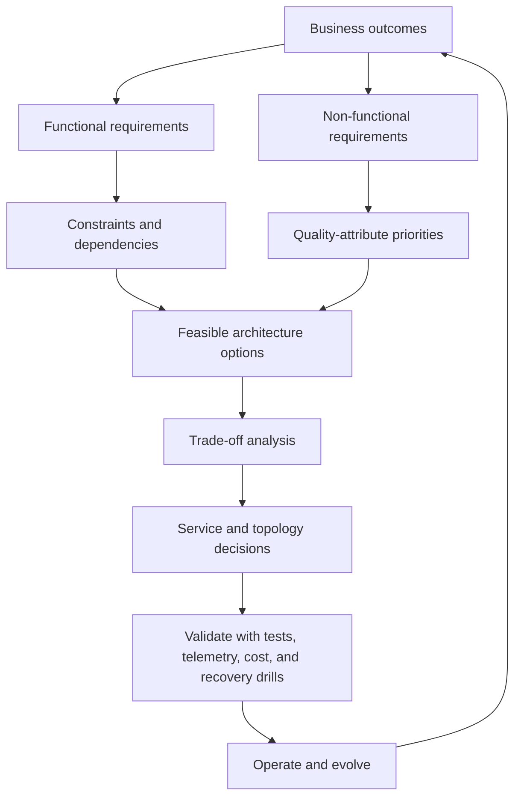

Stop asking, “Which Azure service do I remember?” Ask, “Which requirement eliminates the alternatives?”

## The eight-pass method for any design question

1. **Extract the verbs.** Must authenticate, route, retain, replay, fail over, scale, migrate, isolate, or audit.
2. **Mark hard constraints.** Protocol, OS access, source/target engine, region, private IP, RPO, RTO, compliance, budget, team skill, and allowed code change.
3. **Name the failure scope.** Process, instance, rack/datacenter, zone, region, operator error, or dependency.
4. **Prioritize qualities.** Reliability, security, cost, operational excellence, performance. “All” is not a priority order.
5. **Generate candidates.** Include only services capable of the job.
6. **Eliminate explicitly.** State the one property that makes each plausible distractor inferior.
7. **Compose the architecture.** Entry, compute, identity, data, integration, observability, recovery, deployment.
8. **Validate the decision.** Load test, failover drill, restore test, policy check, cost model, and operational ownership.

## Requirement worksheet

| Question | What it reveals | Example consequence |
|---|---|---|
| What business flow must continue? | Criticality boundary | Protect checkout more strongly than report generation |
| How much data loss is acceptable? | RPO | Select synchronous HA or asynchronous DR appropriately |
| How long can the flow be unavailable? | RTO | Pre-provision warm capacity if restore time is too slow |
| What protocol/API is fixed? | Compatibility | SMB/NFS may select Files or NetApp Files; Kubernetes API may select AKS |
| What control is mandatory? | Management boundary | Required OS access eliminates PaaS databases |
| What may change in code? | Migration strategy | No code change favors rehost; modest change can enable replatform |
| Is traffic HTTP-aware? | Routing layer | L7 requirements eliminate an L4-only choice |
| Who operates it? | Operational feasibility | Kubernetes without a capable platform team is an architecture risk |
| Where may data and logs reside? | Sovereignty/compliance | May force separate regions, subscriptions, or workspaces |
| What is the demand shape? | Scale and cost model | Spiky event work may fit serverless; steady load may favor provisioned capacity |

## Functional versus non-functional requirements

- “Store customer orders” is functional. “No acknowledged order may be lost” is a reliability constraint that changes the data and messaging design.
- “Expose an API” is functional. “Partners need quotas, subscription onboarding, transformations, and analytics” points toward API management capabilities.
- “Run containers” is functional. “The team needs direct Kubernetes API access and custom controllers” is the constraint that can justify AKS.
- “Connect a branch” is functional. “Traffic must avoid the public internet with predictable high bandwidth” changes the hybrid connectivity candidate.

## Architecture answers are conditional

Avoid absolute statements such as “Front Door is always the global answer” or “Functions is always cheapest.” Use this form:

> Given **requirements R** and **constraints C**, recommend **candidate A** because of **documented property P**. Do not select **B** because it lacks **P** or introduces **trade-off T**. If **requirement X** changes, reconsider **B**.

## What must be understood versus looked up

**Understand:** service boundaries, scope, traffic layer, identity plane, data model, consistency, replication direction, delivery semantics, orchestration responsibility, and failure scope.

**Look up for each real deployment:** exact SLA, regional/zone availability, limits, SKU features, price, supported source/target pairs, quotas, preview status, and compatibility details. The exam can state those facts in the scenario; production design must verify them live.

---

# 3. Well-Architected trade-off model

Microsoft defines five pillars. They are not five independent checklists; a decision that improves one can create costs or risks in another.

| Pillar | Architect’s question | Typical design evidence | Frequent trade-off |
|---|---|---|---|
| Reliability | Can critical flows remain available and recover within targets? | Failure-mode analysis, redundancy, restore/failover tests, health model | More replicas and regions increase cost and consistency complexity |
| Security | How are confidentiality, integrity, and availability protected? | Identity-first access, least privilege, segmentation, encryption, auditability | Extra controls add latency and operational work |
| Cost Optimization | Does spend track business value and actual demand? | Cost model, rightsizing, lifecycle/tiering, reservations where appropriate | Minimum cost can reduce headroom or recovery readiness |
| Operational Excellence | Can teams deploy, observe, diagnose, and recover safely? | IaC, CI/CD, telemetry, runbooks, tested rollback | Automation/platform engineering requires investment |
| Performance Efficiency | Does capacity adapt and meet latency/throughput goals? | Load tests, scaling model, partition strategy, caching | Performance capacity and caches increase cost and staleness risk |

### A trade-off ledger

For each consequential decision, record:

| Decision | Benefit | Cost/risk introduced | Mitigation | Validation |
|---|---|---|---|---|
| Two active regions | Regional resilience and proximity | Higher spend; distributed data and deployment complexity | Deployment stamps, automated routing, idempotent operations | Regional evacuation exercise |
| Private endpoints | Private-IP access and exfiltration control options | DNS and network topology complexity | Central private DNS design and tests from every network | Resolve/connect tests from spokes and on-premises |
| Cache-aside | Lower origin latency/load | Stale data, invalidation, stampede risk | TTL, invalidation, request coalescing | Hit ratio and stale-read tests |
| Asynchronous command processing | Load leveling and temporal decoupling | Eventual completion and duplicate handling | Idempotency, DLQ, correlation, observability | Redelivery and poison-message tests |

### Reliability vocabulary

- **SLI:** a measured aspect of service behavior.
- **SLO:** a target for the application or workload.
- **SLA:** a contractual commitment with possible financial consequences.
- **RTO:** maximum acceptable time the application can be unavailable after an incident.
- **RPO:** maximum acceptable duration of data loss during an incident.

An Azure service SLA is an input to a workload SLO, not a substitute for it. An application also fails because of code, configuration, dependencies, capacity, and operations. Microsoft publishes explicit RTO/RPO guarantees only for some products; do not invent them for others.

**Official Microsoft sources:**

- https://learn.microsoft.com/en-us/azure/well-architected/
- https://learn.microsoft.com/en-us/azure/well-architected/pillars
- https://learn.microsoft.com/en-us/azure/well-architected/reliability/metrics
- https://learn.microsoft.com/en-us/azure/cloud-adoption-framework/ready/

---

# DOMAIN 1 — Design identity, governance, and monitoring solutions (25–30%)

## 1.1 Design solutions for logging and monitoring

### Start from decisions, not dashboards

Ask these in order:

1. Which user and system flows matter?
2. What signals prove health: metrics, logs, traces, changes, or synthetic checks?
3. Where are signals created, and are they collected automatically?
4. Where must they be retained, queried, archived, or streamed?
5. Who must access which records?
6. What condition creates an alert, and what action follows it?
7. What volume, retention, and query behavior drive cost?

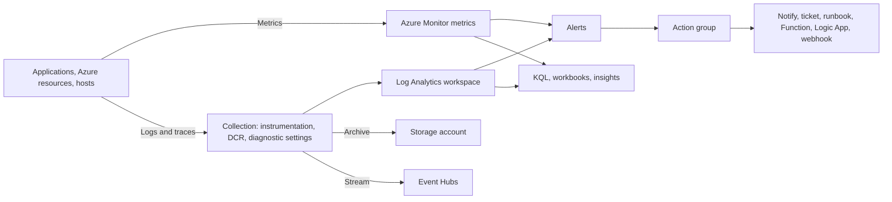

### Signal-to-tool decision matrix

| Requirement | Candidate | Why | Common wrong choice |
|---|---|---|---|
| Fast numeric time-series alert | Azure Monitor metrics + metric alert | Metrics are collected as time series and evaluated efficiently | Querying verbose logs for every basic threshold |
| Correlate resource/application records | Log Analytics workspace | Central tables queried with KQL | Treating a storage archive as an interactive analytics system |
| Application request/dependency/trace APM | Application Insights | Azure Monitor’s APM capability, with OpenTelemetry-based collection for most server scenarios | Resource health alone; it does not instrument application code paths |
| Route resource logs for analysis | Diagnostic setting → Log Analytics | Resource logs are not collected by default | Assuming platform metrics automatically include resource logs |
| Long-term low-query archive | Diagnostic setting/data export → Storage | Durable archive and immutability options | Keeping every verbose record in high-cost interactive retention |
| Integrate logs with external/SIEM pipeline | Diagnostic setting/data export → Event Hubs | Streaming destination | Workbooks, which visualize but do not act as a stream broker |
| Cross-resource operational view | Workbooks / built-in Insights | Interactive visualizations over Monitor data | Alerts alone; they notify but are not a dashboard |
| Network diagnosis | Network Watcher plus Azure Monitor | Network-specific diagnostics and platform telemetry | Application Insights alone |

### Important collection facts

- Platform metrics and the Activity Log are collected automatically. Diagnostic settings route them elsewhere when needed.
- Resource logs are **not collected by default**. Create diagnostic settings for each resource that must emit them.
- A diagnostic setting selects categories and one or more supported destinations such as Log Analytics, Storage, or Event Hubs.
- Application Insights is for application performance monitoring, not a replacement for platform resource logs.
- Alerts bind a target/signal and condition to an action group. Metric, log search, Activity Log, smart detection, and Prometheus alert types solve different signal problems.

### Log Analytics workspace topology

Default toward the fewest workspaces that satisfy requirements. Consolidation improves cross-resource queries and can simplify operations. Split only for a real boundary:

- data residency or regulatory isolation;
- ownership/tenant boundary;
- separate billing requirements;
- materially different access rules that resource-context or table-level RBAC cannot meet;
- resilience requirements;
- different retention for the same table where per-table configuration cannot separate the records.

Workspace access can use resource-context permissions, workspace-context permissions, and granular/table controls. Do not create a workspace per application merely from habit; do not centralize data that legally or operationally must be isolated.

### Retention and cost

Model ingestion volume first. Use table plans, per-table interactive/long-term retention, sampling where semantically safe, transformations to discard unneeded records, and summarized data. Long-term retention remains queryable through retrieval/search mechanisms but is not the same as keeping all data continuously interactive.

### Requirement signals

- “Audit archive, rarely queried” → Storage destination or low-cost long-term retention; verify immutability requirement.
- “Near-real-time third-party processing” → Event Hubs destination.
- “KQL correlation and alerting” → Log Analytics.
- “Request failure and dependency latency” → Application Insights.
- “Who changed a resource?” → Activity Log.
- “Automatically deploy missing diagnostic settings” → Azure Policy with deploy/modify behavior, not a dashboard.

### What would change the decision?

You selected one central workspace. A sovereignty rule requiring operational data to remain in separate regions, an independent tenant, or a strict ownership boundary can justify multiple workspaces. You selected interactive retention. A long compliance duration with rare queries can push data toward long-term retention or an immutable Storage archive.

**Official Microsoft sources:**

- https://learn.microsoft.com/en-us/azure/azure-monitor/fundamentals/overview
- https://learn.microsoft.com/en-us/azure/azure-monitor/platform/diagnostic-settings
- https://learn.microsoft.com/en-us/azure/azure-monitor/logs/log-analytics-workspace-overview
- https://learn.microsoft.com/en-us/azure/azure-monitor/logs/workspace-design
- https://learn.microsoft.com/en-us/azure/azure-monitor/app/app-insights-overview
- https://learn.microsoft.com/en-us/azure/azure-monitor/alerts/alerts-overview
- https://learn.microsoft.com/en-us/azure/azure-monitor/logs/logs-data-export

## 1.2 Design authentication and authorization solutions

### Separate five concerns

| Concern | Design question | Azure mechanism |
|---|---|---|
| Identity source | Where is the user/workload identity mastered? | Microsoft Entra ID, hybrid identity, external identity |
| Authentication | How does it prove identity? | Protocol and credential/federation method; Conditional Access for contextual controls |
| Authorization | What may it do, and where? | Azure RBAC, Microsoft Entra roles, application roles/claims, data-plane roles |
| Privilege governance | How is elevated access time-bound and reviewed? | PIM, access reviews, entitlement management |
| Credential material | Where are secrets, keys, and certificates managed? | Key Vault or Managed HSM when the key requirement justifies it |

Authentication answers “who are you?” Authorization answers “what may you do?” A managed identity removes application credential management; it does not grant permission automatically.

### Human, application, and managed identities

| Identity | Use when | Lifecycle and trade-off |
|---|---|---|
| User | A person signs in | Govern joiner/mover/leaver, MFA/Conditional Access, privilege, and review |
| Group | Many principals share access | Prefer role assignment to groups over individual sprawl; govern membership |
| App registration/service principal | An application needs an Entra identity, especially outside Azure | Application object defines the app; service principal is its tenant-local identity; credentials/certificates need lifecycle management unless federation is used |
| System-assigned managed identity | Identity should live and die with exactly one Azure resource | Tight lifecycle and simple ownership; cannot be shared |
| User-assigned managed identity | Identity must be shared, preauthorized, or survive compute replacement | Independent lifecycle and reusable across supported resources; ownership must be governed |

Current Microsoft guidance recommends user-assigned managed identities for most Microsoft-service scenarios, but service support and the required lifecycle decide. A system-assigned identity is still a strong choice when identity ownership must map one-to-one to a resource.

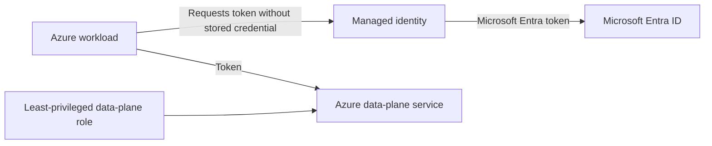

### Hybrid authentication choices

| Method | Credential validation | Choose when | Architectural cost |
|---|---|---|---|
| Password hash synchronization (PHS) | Microsoft Entra ID validates a synchronized derived hash | Prefer simplest, resilient cloud authentication and reduced on-premises sign-in dependency | Password hash synchronization must meet policy; understand the documented hash process, not “plain password in cloud” |
| Pass-through Authentication (PTA) | Entra sign-in is validated through on-premises agents against AD DS | Password validation must remain on-premises and current on-premises account state must be enforced immediately | Agent and domain-controller availability/network dependency; deploy redundant agents |
| Federation | Entra hands authentication to a trusted federation system such as AD FS | A documented advanced authentication requirement cannot be met by managed cloud authentication | Highest infrastructure, certificate, patching, and availability burden |

PHS is generally simpler and avoids dependence on a highly available federation service. Some Entra capabilities require PHS even if another sign-in method is primary. Verify current supported topologies before selection.

### External identities

- For workforce collaboration with partner/supplier users, use Microsoft Entra B2B collaboration patterns so external users access resources through governed identities rather than shared accounts.
- For customer-facing identity, evaluate current Microsoft Entra External ID capabilities and current migration guidance. Product naming and feature availability have evolved; verify the current tenant model instead of relying on an old “Azure AD B2C” label.
- Entitlement management can package group/app/site access with approval, expiration, and recurring review for internal and external users.

### Azure RBAC decision model

```text
WHO (principal)
  × WHAT (role definition: Actions/DataActions)
  × WHERE (scope)
= role assignment
```

The four Azure scopes, broadest to narrowest, are management group → subscription → resource group → resource. Permissions assigned higher are inherited lower. Choose the smallest practical scope. Custom roles are appropriate when no built-in role matches the required actions; they increase maintenance and testing responsibility.

| Mechanism | Governs | Scope examples | Exam trap |
|---|---|---|---|
| Azure RBAC role | Azure Resource Manager and, for data roles, supported resource data operations | Management group, subscription, resource group, resource | Contributor can manage resources but cannot generally grant role assignments |
| Microsoft Entra role | Directory resources | Tenant, administrative unit, individual object in supported cases | Global Administrator is not automatically Owner of all subscriptions |
| Application authorization | Business/API behavior | App role, claim, policy, domain object | Azure RBAC does not automatically model application business permissions |
| Azure Policy | Whether resources comply with desired rules | Management group through resource | Policy is governance, not a grant of user permission |

For on-premises authorization, preserve the resource’s authorization model unless modernization requirements change it: AD DS groups/Kerberos for traditional domain resources, application federation/claims for modern apps, and private connectivity only as network reachability. A VPN authenticates/links networks; it does not replace resource authorization.

### Secrets, certificates, and keys

| Requirement | Candidate | Reason |
|---|---|---|
| Application secret, password, connection material | Key Vault secret | Central controlled secret lifecycle and audit |
| Cryptographic operation with centrally managed key | Key Vault key | Software-protected or HSM-protected key options depending tier |
| TLS/client certificate lifecycle | Key Vault certificate | Certificate object and policy/integration capabilities |
| Single-tenant HSM and stringent high-value-key requirement | Managed HSM | Dedicated HSM-protected key-management boundary |
| Ordinary non-secret configuration/feature flag | App Configuration | Key-value configuration and feature management; reference Key Vault for secrets |

Prefer managed identity to fetch Key Vault content. Keep authentication, network reachability, and Key Vault authorization as three separate decisions. Enable deletion protection controls appropriate to the recovery/compliance requirement and validate restore procedures.

### Requirement signals and wrong-answer traps

- “No credential in code; app hosted on Azure” → managed identity. **Trap:** storing a client secret in an app setting.
- “Same workload identity across replaced instances” → investigate user-assigned identity. **Trap:** assuming a deleted system identity survives.
- “Manage users/domains” → Microsoft Entra role. **Trap:** Azure resource Contributor.
- “Manage a storage account” → Azure control-plane role. “Read blobs” → storage data-plane role. **Trap:** assuming a management role always grants data access.
- “Just-in-time admin activation with approval/MFA” → PIM. **Trap:** permanent Owner.
- “Periodic certification that access is still needed” → access reviews.
- “Bundle requestable access with approval and expiry” → entitlement management.
- “Stop noncompliant resource creation” → Policy `deny`, not RBAC.

### What would change the decision?

You selected system-assigned identity. Shared identity, preauthorization before compute creation, or lifecycle independence pushes toward user-assigned identity. You selected PHS. A hard requirement for on-premises password validation can push to PTA; a capability that truly requires federation can push to federation, with its operational burden included in the decision.

**Official Microsoft sources:**

- https://learn.microsoft.com/en-us/azure/role-based-access-control/overview
- https://learn.microsoft.com/en-us/azure/role-based-access-control/scope-overview
- https://learn.microsoft.com/en-us/azure/role-based-access-control/rbac-and-directory-admin-roles
- https://learn.microsoft.com/en-us/entra/identity/managed-identities-azure-resources/overview
- https://learn.microsoft.com/en-us/entra/identity/hybrid/connect/choose-ad-authn
- https://learn.microsoft.com/en-us/entra/id-governance/identity-governance-overview
- https://learn.microsoft.com/en-us/entra/id-governance/privileged-identity-management/pim-configure
- https://learn.microsoft.com/en-us/entra/id-governance/entitlement-management-overview
- https://learn.microsoft.com/en-us/azure/key-vault/general/overview
- https://learn.microsoft.com/en-us/azure/key-vault/keys/about-keys

## 1.3 Design governance

### Resource organization: each boundary has a purpose

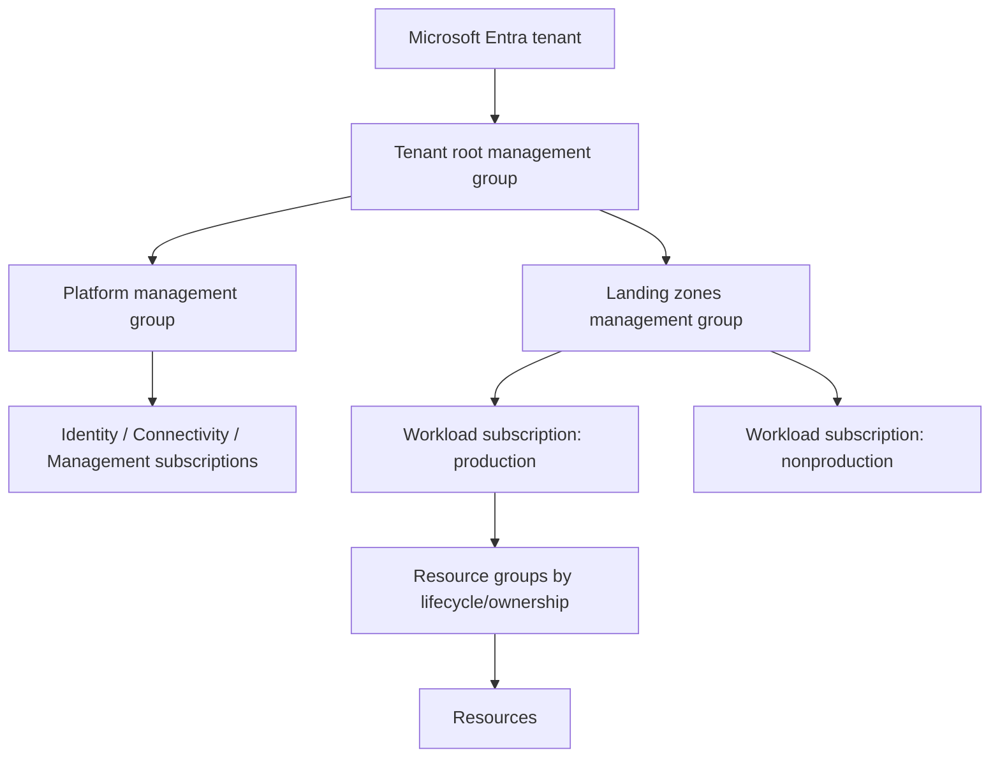

| Boundary | Use it for | Do not confuse it with |
|---|---|---|
| Tenant | Directory/trust boundary | A billing container |
| Management group | Organize subscriptions for inherited policy and platform governance | A place to deploy ordinary workload resources |
| Subscription | Strong unit for policy, RBAC, billing, quotas, and workload/environment isolation | Merely a folder |
| Resource group | Lifecycle, deployment, and access grouping for resources | A network boundary or nested hierarchy |
| Tag | Metadata for ownership, cost, environment, data classification, automation | A security boundary; tags do not inherit automatically unless implemented |

The Cloud Adoption Framework describes a **platform landing zone** as the centralized governance/security/shared foundation and **application landing zones** as workload environments operating inside its guardrails. Centralize only capabilities with real governance, operational, or economic benefit.

### Structure decision rules

- Keep management-group hierarchy reasonably flat. Organize by governance archetype and policy need, not a copy of the reporting org chart.
- Use separate subscriptions when environment/workload isolation, quota, billing, policy, or blast-radius requirements justify it. CAF guidance says ideally each application environment has its own subscription, while allowing shared subscriptions when an application cannot be isolated.
- Group resources with the same lifecycle and ownership. A resource can exist in only one resource group but resource dependencies can cross groups.
- Build a mandatory tag dictionary: owner, cost center, workload, environment, criticality, data classification, and expiry where useful. Define source of truth, enforcement, allowed values, and remediation—not just names.

### Policy, RBAC, locks, and cost controls

| Tool | Primary purpose | Example | Limitation/trap |
|---|---|---|---|
| Azure Policy | Evaluate/enforce resource-state compliance | Allowed regions, required tag, diagnostic deployment | Does not grant a user access |
| Initiative | Group related policy definitions | Regulatory/security baseline | Still requires assignment, parameters, exemptions, and remediation strategy |
| Azure RBAC | Grant actions to principals at scope | Reader at subscription, data role at storage account | Does not assert resource configuration compliance |
| Resource lock | Protect control-plane resource changes/deletion | `CanNotDelete` on critical vault | Does not protect data-plane content; can disrupt legitimate operations |
| Tags | Classification and allocation metadata | `CostCenter=42` | Not an authorization control and not automatic inheritance |
| Budgets/Cost Management | Visibility and alerts for spend | Notify before forecast exceeds budget | A budget alert does not itself redesign or necessarily stop resources |

Policy effects are deliberate design choices:

- `audit` observes without blocking.
- `deny` prevents noncompliant create/update operations.
- `modify` changes supported properties/tags and can remediate existing resources with the required managed identity.
- `deployIfNotExists` can deploy required related configuration and needs remediation for existing resources.
- Exemptions should be scoped, owned, justified, time-bound, and reviewed.

Resource locks apply to control-plane operations, not data-plane operations. A lock on a storage account does not prevent an authorized data-plane caller from deleting blobs. Use storage protection features, authorization, backup/versioning/immutability as appropriate for data.

### Identity governance

| Requirement | Candidate |
|---|---|
| Time-bound privileged role activation | Privileged Identity Management |
| Recurring certification/removal of stale access | Access reviews |
| Request/approval/expiry package for groups and apps | Entitlement management |
| Automated joiner/mover/leaver tasks | Lifecycle workflows/provisioning where supported |
| Risk-based sign-in/access decision | Identity Protection signals + Conditional Access |

License requirements apply to governance capabilities; verify current licensing rather than inferring inclusion.

### Governance design scenario

**Requirements:** A regulated enterprise has shared networking/security teams, 30 workloads, isolated production/nonproduction, regional policy, chargeback, and temporary admin elevation.

**Recommendation:** Use an Azure landing-zone-aligned hierarchy. Place shared identity/connectivity/management services in platform subscriptions. Issue workload landing-zone subscriptions with production separated from nonproduction where the isolation and blast-radius requirements justify it. Assign policy initiatives at the management group that owns each archetype, enforce standardized tags, use group-based RBAC at the smallest practical subscription/resource-group scope, and use PIM for privileged assignments.

**Why not one subscription?** It weakens quota, policy, billing, and blast-radius separation. **Why not a management group per team?** Team reporting structure is not the primary governance need and deep hierarchy increases inheritance complexity. **Trade-off:** more subscriptions and centralized controls require subscription vending, IaC, and platform ownership.

### What would change the decision?

A small single-workload organization with identical policy and ownership might use fewer subscriptions. A sovereignty requirement can add separate management-group archetypes and regional landing zones. A merger or multi-tenant requirement can create a tenant-level boundary that management groups cannot cross.

**Official Microsoft sources:**

- https://learn.microsoft.com/en-us/azure/cloud-adoption-framework/ready/
- https://learn.microsoft.com/en-us/azure/cloud-adoption-framework/ready/landing-zone/design-area/resource-org-management-groups
- https://learn.microsoft.com/en-us/azure/cloud-adoption-framework/ready/landing-zone/design-area/management-application-environments
- https://learn.microsoft.com/en-us/azure/governance/policy/overview
- https://learn.microsoft.com/en-us/azure/governance/policy/concepts/effects
- https://learn.microsoft.com/en-us/azure/azure-resource-manager/management/lock-resources
- https://learn.microsoft.com/en-us/entra/id-governance/identity-governance-overview

## Domain 1 architecture scenario

**Business need:** A global API team needs centralized operations, regional log residency, partner access, no application secrets, and quarterly privilege review.

**Decision:** Use B2B/governed external identities for partner workforce access, managed identities for Azure workloads, least-privileged Azure/data-plane roles, Key Vault for unavoidable secret/certificate material, and PIM/access reviews for privileged access. Use a Log Analytics workspace per required residency boundary, resource-context/table access where appropriate, diagnostic settings for resource logs, Application Insights for application traces, Storage for required archive, and alerts linked to owned action groups.

**Rejected alternatives:** one global workspace violates residency; client secrets add rotation/exposure burden; permanent Owner violates least privilege; an Activity Log alone cannot diagnose application dependencies.

**Trade-off:** residency-aligned workspaces complicate global queries. Solve that with cross-workspace query/reporting patterns and explicit central operational ownership rather than ignoring the boundary.

## Domain 1 mini-exam

### Question 1

An operations team must query resource logs from many subscriptions with KQL and alert on correlated failures. Security records must remain in one permitted region. What should the architect recommend?

A. A storage account for every resource  
B. A regional Log Analytics workspace with diagnostic settings  
C. Application Insights without resource diagnostic settings  
D. Activity Log export only

<details>
<summary>Answer</summary>

**Correct answer:** B.

**Requirement signal:** Cross-resource KQL plus a residency boundary.

**Why:** Log Analytics stores/query logs, and diagnostic settings collect resource logs that are not collected by default.

**Why the alternatives are wrong:** Storage is an archive, not the requested interactive KQL platform; Application Insights does not automatically collect every resource log; Activity Log contains control-plane events, not all resource logs.

**Trade-off:** Regional separation complicates centralized analysis.

**Official objective:** Recommend a logging solution; recommend a solution for routing logs.

**Official Microsoft source:** https://learn.microsoft.com/en-us/azure/azure-monitor/platform/diagnostic-settings

</details>

### Question 2

An App Service application must read one Storage account without any credential stored in code or configuration. Which design is best?

A. Store an account key in App Configuration  
B. Enable a managed identity and grant the smallest storage data-plane role at the account scope  
C. Grant Contributor to all developers  
D. Put a SAS token in source control

<details>
<summary>Answer</summary>

**Correct answer:** B.

**Requirement signal:** Azure-hosted workload, no managed credential, one target resource.

**Why:** Managed identity obtains Entra tokens without application-managed credentials; Azure RBAC grants only the necessary data access.

**Why the alternatives are wrong:** App Configuration is not a secret store; Contributor is broad control-plane access and does not model the requested least-privileged data access; source-controlled SAS is a credential exposure.

**Trade-off:** The target service must support Entra authentication and the deployment must manage role assignments.

**Official objective:** Recommend an authentication solution; recommend authorization to Azure resources.

**Official Microsoft source:** https://learn.microsoft.com/en-us/entra/identity/managed-identities-azure-resources/overview

</details>

### Question 3

A company needs administrators to activate an Azure subscription role for two hours, provide justification, complete MFA, and obtain approval. What should be recommended?

A. A permanent Owner assignment  
B. Privileged Identity Management  
C. A resource lock  
D. Azure Policy

<details>
<summary>Answer</summary>

**Correct answer:** B.

**Requirement signal:** Time-bound, approval-based privileged activation with MFA.

**Why:** PIM provides eligible/time-bound activation, approval, MFA, justification, notification, audit, and review controls.

**Why the alternatives are wrong:** Permanent Owner is excessive; locks protect control-plane changes but do not govern identity activation; Policy governs resource state.

**Trade-off:** PIM requires process design and applicable licensing.

**Official objective:** Recommend a solution for identity governance.

**Official Microsoft source:** https://learn.microsoft.com/en-us/entra/id-governance/privileged-identity-management/pim-configure

</details>

### Question 4

An organization must prevent deployment outside approved regions and report existing noncompliant resources. Which mechanism fits?

A. NSG  
B. Azure RBAC  
C. Azure Policy  
D. Resource lock

<details>
<summary>Answer</summary>

**Correct answer:** C.

**Requirement signal:** Enforce and assess resource configuration compliance.

**Why:** Policy definitions evaluate resource properties and effects such as deny/audit enforce or report compliance.

**Why the alternatives are wrong:** NSGs filter network traffic; RBAC grants principal actions; locks protect control-plane changes/deletion.

**Trade-off:** Policy rollout needs testing, exemption governance, and remediation for existing resources.

**Official objective:** Recommend a solution for managing compliance.

**Official Microsoft source:** https://learn.microsoft.com/en-us/azure/governance/policy/overview

</details>

### Question 5

A legacy company requires cloud sign-in passwords to be validated directly against on-premises AD DS and wants to avoid federation infrastructure. Which authentication method is the candidate?

A. Password hash synchronization only  
B. Pass-through Authentication with redundant agents  
C. Managed identity  
D. Azure RBAC

<details>
<summary>Answer</summary>

**Correct answer:** B.

**Requirement signal:** Direct on-premises password validation without federation.

**Why:** PTA uses agents to validate against on-premises AD DS.

**Why the alternatives are wrong:** PHS validates in the cloud; managed identity is a workload identity; RBAC is authorization.

**Trade-off:** Cloud sign-in now depends on agent/DC/network availability, so redundant agents are required.

**Official objective:** Recommend an authentication solution; recommend authorization/access to on-premises resources.

**Official Microsoft source:** https://learn.microsoft.com/en-us/entra/identity/hybrid/connect/choose-ad-authn

</details>

### Question 6

A compliance officer says a `CanNotDelete` lock on a storage account is sufficient protection against deletion of blobs. What should the architect say?

A. Correct; locks protect control and data planes  
B. Incorrect; locks apply to control-plane operations, so data-plane protection must be designed separately  
C. Correct only with Reader RBAC  
D. Incorrect because locks apply only to networking

<details>
<summary>Answer</summary>

**Correct answer:** B.

**Requirement signal:** Protection of data content rather than the Azure resource object.

**Why:** Resource locks apply to control-plane operations, not data-plane blob operations.

**Why the alternatives are wrong:** The lock boundary is misstated in A, C, and D.

**Trade-off:** Add appropriate data authorization, versioning/soft delete, backup, immutability, and recovery controls according to the requirement.

**Official objective:** Recommend a solution for managing compliance.

**Official Microsoft source:** https://learn.microsoft.com/en-us/azure/azure-resource-manager/management/lock-resources

</details>

---

# DOMAIN 2 — Design data storage solutions (20–25%)

## 2.1 Design data storage solutions for relational data

### Decide from workload shape

Capture these before naming a database:

- engine and feature compatibility;
- relational/transactional semantics;
- instance-scoped dependencies and cross-database behavior;
- OS/file-system/agent access;
- size, I/O latency, throughput, and growth;
- steady versus intermittent demand;
- write versus read scale;
- regional and zonal availability;
- RPO/RTO, retention, and recovery granularity;
- private connectivity, identity, encryption, and auditing;
- migration downtime and allowed application changes;
- operational ownership and licensing constraints.

### Azure SQL Database vs Managed Instance vs SQL Server on Azure VM

| Dimension | Azure SQL Database | Azure SQL Managed Instance | SQL Server on Azure VM |
|---|---|---|---|
| Service model | PaaS database service | PaaS managed instance | IaaS VM with SQL Server |
| Best signal | Modern/cloud applications and database-scoped needs | High SQL Server compatibility plus instance-scoped features with PaaS management | OS access, full engine/instance control, unsupported PaaS dependency, or like-for-like host requirement |
| Administration | Microsoft handles OS/database engine platform, built-in HA, patching and backups | Same PaaS direction with instance-like surface | Team owns guest OS, SQL configuration, patching, backup design, and database HA |
| Deployment shape | Single database or elastic pool | Managed instance; instance pools where requirements fit | One or more SQL VMs |
| Scaling pattern | Scale compute; elastic pool for variable databases; read scale/geo replicas; Hyperscale where its architecture fits | Scale instance/resources; read/HA/geo options depend on configuration | Scale VM/disks; design SQL-native scale/HA yourself |
| Compatibility | Most common database-level SQL Server capabilities | Almost all instance- and database-level capabilities | Full supported SQL Server capabilities and OS access |
| Networking | Logical server with public controls/private endpoint options | Native virtual network deployment model | Full VNet/NSG/routing control |
| Operations/cost trade-off | Lowest platform administration; less host/instance control | PaaS benefit with larger compatibility surface | Maximum control and maximum operational responsibility |

The pivotal question is not “PaaS or IaaS?” in isolation. It is: **which feature or control requirement prevents the more managed option?**

#### Strong decision signals

- New independently managed databases, serverless compute, or a SaaS fleet with variable per-database demand → investigate SQL Database single databases or elastic pools.
- Existing application depends on instance-level behavior and needs minimal database change without OS access → investigate Managed Instance.
- Must install an OS agent, access the file system, choose an exact supported SQL/OS combination, or retain full sysadmin/engine control → SQL Server on Azure VM.
- Open-source PostgreSQL compatibility with managed service and no OS requirement → Azure Database for PostgreSQL Flexible Server.

#### Common wrong-answer traps

- “Maximum compatibility” alone does not automatically mean SQL VM; Managed Instance is designed for high compatibility. Find the exact unsupported feature or OS-control requirement.
- “Lift and shift” does not guarantee IaaS is best. Minimal-change replatform to Managed Instance can remove operational work if compatibility assessment allows it.
- PaaS built-in backup/HA does not eliminate application recovery planning, restore tests, regional routing, or protection from logical corruption.
- A read replica improves read scale and can aid recovery designs; it is not automatically a backup. Replication can propagate bad writes/deletes.

### SQL Database service and compute tiers

| Requirement shape | Candidate | Architectural reason | Check before selection |
|---|---|---|---|
| Balanced general workload, cost-sensitive | General Purpose | Budget-oriented balanced compute/storage | I/O latency and availability requirements |
| High transaction rate, low-latency I/O | Business Critical | Local high-performance storage architecture and multiple replicas | Cost and capacity/region support |
| Very large/growing database, rapid storage growth/backup/restore, read scale | Hyperscale | Separates compute and storage; storage and read compute scale characteristics | Feature limits, migration/reverse-migration constraints, replica cost |
| Intermittent/unpredictable eligible workload | Serverless compute | Autoscaling and per-use characteristics; autopause where configuration supports it | Cold/resume latency, minimum/maximum compute, feature availability |
| Predictable continuous load | Provisioned compute | Continuously available fixed capacity and predictable behavior | Rightsizing and reservation/benefit options |
| Many databases with noncoincident peaks | Elastic pool | Share provisioned resources across databases | Noisy-neighbor/per-database limits and aggregate sizing |

Do not memorize sizes. Understand that purchasing model, service tier, compute tier, hardware generation, storage, zone redundancy, and replicas can all change availability, performance, and cost.

### Database scalability patterns

1. **Scale up/down:** change compute or tier. Simple, but bounded and may have transition effects.
2. **Read scale:** route read-only workloads to replicas where supported. Application must tolerate replication lag where asynchronous.
3. **Elastic pool:** smooth resource use across many independent databases with variable peaks.
4. **Shard/partition:** distribute tenants/data across databases. Raises routing, transactions, rebalancing, and operational complexity.
5. **Cache:** remove repeated reads from the primary store. Introduces staleness/invalidation.
6. **Queue writes/work:** protect the database from bursts. Introduces asynchronous completion and idempotency needs.

### Data protection for relational systems

Use layers; each solves a different failure:

| Failure/requirement | Design response |
|---|---|
| Infrastructure/node failure | Built-in service HA or SQL-native HA on VMs |
| Availability-zone failure | Zone-redundant configuration where the chosen service/tier/region supports it |
| Regional outage | Geo-replication/failover group/read replica or application-level multi-region design, as documented for the service |
| Accidental update/delete | Point-in-time restore, backups, temporal/audit/application recovery where required |
| Long retention/legal hold | Long-term retention and protected backup strategy |
| Confidentiality at rest | Service encryption/TDE; use customer-managed keys only when control/compliance justifies lifecycle burden |
| Confidentiality in transit | TLS and certificate/endpoint validation |
| Least-privileged access | Entra authentication where supported plus correct database/data-plane authorization |

For PostgreSQL Flexible Server, distinguish synchronous HA from asynchronous read replicas. Zone-redundant HA places a standby in another availability zone and supports automatic failover; it can add write/commit latency. Read replicas serve read scale and are asynchronous. A user error replicated to a standby is recovered with point-in-time restore, not by pretending HA is a backup.

### What would change the decision?

You selected SQL Database. Discovery of required instance-scoped features can move the design to Managed Instance; required OS/file-system control can move it to SQL VM. You selected Business Critical for latency; rapid database growth and multiple independent read replicas may make Hyperscale a better candidate. You selected provisioned compute; long idle periods and tolerated resume behavior may justify serverless.

**Official Microsoft sources:**

- https://learn.microsoft.com/en-us/azure/azure-sql/azure-sql-iaas-vs-paas-what-is-overview
- https://learn.microsoft.com/en-us/azure/azure-sql/database/sql-database-paas-overview
- https://learn.microsoft.com/en-us/azure/azure-sql/database/service-tier-general-purpose
- https://learn.microsoft.com/en-us/azure/azure-sql/database/service-tier-business-critical
- https://learn.microsoft.com/en-us/azure/azure-sql/database/service-tier-hyperscale
- https://learn.microsoft.com/en-us/azure/azure-sql/database/serverless-tier-overview
- https://learn.microsoft.com/en-us/azure/azure-sql/database/elastic-pool-overview
- https://learn.microsoft.com/en-us/azure/postgresql/flexible-server/overview
- https://learn.microsoft.com/en-us/azure/postgresql/flexible-server/concepts-high-availability
- https://learn.microsoft.com/en-us/azure/postgresql/flexible-server/concepts-read-replicas
- https://learn.microsoft.com/en-us/azure/postgresql/backup-restore/concepts-backup-restore

## 2.2 Design storage for semi-structured and unstructured data

### Choose the data model and access path first

| Requirement | Primary candidate | Why | Candidate to challenge |
|---|---|---|---|
| Globally distributed operational JSON with indexed queries, tunable consistency, partition scale | Azure Cosmos DB | Document/multimodel APIs, partitioned throughput, global distribution, explicit consistency choices | Blob Storage: object access is not a document database query model |
| Simple key/attribute NoSQL within Azure Storage | Table Storage | Schemaless key/attribute store and Storage operational model | Cosmos DB if global distribution, latency/throughput guarantees, richer features justify it |
| Massive object/binary/text storage over REST | Blob Storage | Object store for unstructured data | Azure Files if a shared file-system protocol is fixed |
| Shared file system via SMB/NFS | Azure Files | Managed shares mountable by supported clients | Blob is not a drop-in file share |
| Enterprise low-latency/high-performance NAS and advanced file requirements | Azure NetApp Files | Managed enterprise file protocols/performance | Standard Files when its protocol/performance/features already suffice |
| Analytics lake with directory semantics and fine-grained hierarchy | Data Lake Storage capabilities on Blob | Hierarchical namespace and analytics ecosystem integration | Ordinary blob namespace if analytics hierarchy/ACL operations are unnecessary |
| VM-attached block storage | Managed disks | Persistent block volumes for VMs | Files/Blob, which expose different protocols and attachment semantics |

### Cosmos DB: architect view

#### Partitioning

A container divides items into logical partitions based on a partition-key value. Azure maps logical partitions to managed physical partitions. The partition key is an architectural contract because it drives distribution, efficient routing, transaction scope, hot-partition risk, and future scale.

A strong partition key:

- has high cardinality;
- spreads storage and RU consumption evenly;
- appears in frequent equality filters and point-read paths;
- does not change (partition-key values are immutable);
- aligns transactional work that must share a logical partition;
- avoids monotonically concentrated “hot” values.

Cross-partition queries are valid, not automatically wrong. They cost more fan-out than targeted requests. Model the dominant access patterns, not a theoretical perfectly uniform key that every query must fan across.

> **Current preview caution:** Global secondary indexes appear in current Cosmos DB documentation as Preview. Do not make them the unqualified production answer; verify status and limits.

#### Consistency choices

From strongest to weakest: **Strong → Bounded staleness → Session → Consistent prefix → Eventual**.

| Need | Candidate level | Trade-off to inspect |
|---|---|---|
| Linearizable latest committed read | Strong | Higher coordination/latency and lower availability/throughput trade-offs, especially across regions |
| Bounded lag by time/versions | Bounded staleness | Stronger guarantee costs more read throughput than session/eventual family |
| Read-your-writes for a client session | Session | Clients must preserve session context; other sessions may lag |
| Preserve write order without freshness bound | Consistent prefix | Reads can lag |
| Maximum availability/performance with tolerated convergence | Eventual | Application must tolerate stale/out-of-order visibility within eventual semantics |

Do not choose strong simply because the data is “important.” State the anomaly the application cannot tolerate, then choose the weakest consistency that prevents it.

#### Distribution and capacity

- Single-write-region simplifies write conflict reasoning; multiple write regions improve local write availability/latency but introduce conflict and consistency design.
- Provisioned throughput reserves RU/s; autoscale handles variable demand within configured bounds; serverless fits eligible intermittent workloads. Verify current availability and limits.
- A partition key that concentrates traffic cannot be repaired merely by buying more total throughput.
- Multi-region replication is not protection against logical deletion; add point-in-time restore/backup/data-protection controls supported by the chosen mode.

### Blob, Files, Data Lake, and disk decision points

#### Blob types and access tiers

- **Block blobs:** normal object/file content and Data Lake; access tiers apply here.
- **Append blobs:** append-oriented logging scenarios.
- **Page blobs:** random read/write pages and VHD foundations.

Current Blob access tiers include Hot, Cool, Cold, Archive, and Smart tier. Hot has higher storage and lower access cost; cooler online tiers reduce storage cost but increase access/early-deletion considerations. Archive is offline and must be rehydrated before reading. Design from access frequency, retrieval latency, retention duration, operation cost, and redundancy compatibility—not “old data equals archive.”

#### Data Lake Storage

Data Lake Storage adds big-data analytics capabilities to Blob Storage, notably a hierarchical namespace and file/directory semantics. Select it when analytics engines, directory operations, and ACL hierarchy matter. Enabling a capability because “we might do analytics” adds design constraints; identify actual consumers and lifecycle.

#### Azure Files

Use for managed SMB/NFS file-share semantics, lift-and-shift applications using file APIs, replacement/supplement for file servers, and shared tools/content. Verify protocol, identity/authentication, client location, premium/standard performance, redundancy, and backup support. Azure File Sync adds an on-premises cache and multi-site synchronization/cloud-tiering scenario; it is not identical to simply mounting a share.

#### Managed disks

Disk selection follows VM IOPS/throughput/latency, capacity, bursting, shared-disk, snapshot/backup, and zone requirements. A managed disk is bound to VM block-storage semantics; it is not an application object store or general shared NAS.

### Azure Storage redundancy: failure scope drives choice

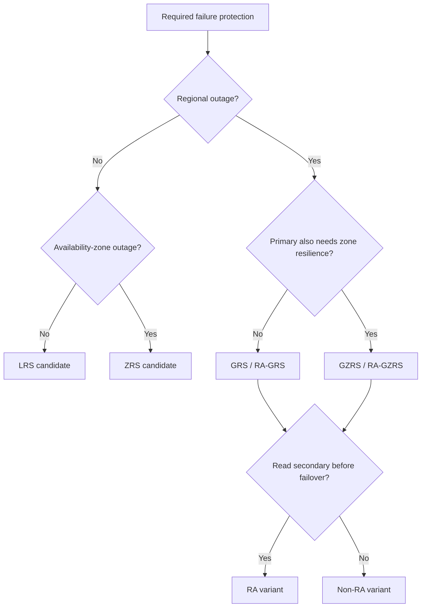

| Option | Primary region | Secondary region | Read secondary before failover | Protects against |
|---|---|---|---|---|
| LRS | Copies in one physical datacenter | None | No | Drive/server/rack failures; lowest redundancy cost |
| ZRS | Synchronous copies across three or more zones | None | No | Zone/datacenter outage in primary region |
| GRS | LRS primary, asynchronous geo-copy | LRS | No | Regional data durability; failover required for access/write recovery |
| RA-GRS | Same as GRS | LRS | Yes | GRS plus read access to secondary endpoint |
| GZRS | ZRS primary, asynchronous geo-copy | LRS | No | Zone resilience in primary plus regional durability |
| RA-GZRS | Same as GZRS | LRS | Yes | GZRS plus read access to secondary endpoint |

Critical distinctions:

- Geo-replication to the secondary is asynchronous, so regional failover can lose the latest writes. Use the service’s last-sync information and business RPO; do not invent zero RPO.
- The `RA-` prefix means the application may read from the secondary endpoint before failover. It does not make the secondary writable.
- GRS versus GZRS differs primarily in the primary region: LRS versus ZRS. The secondary uses LRS in these documented models.
- Redundancy protects hardware/location failure, not corruption, accidental overwrite, or authorized deletion. “All replicas reflect the same current state.” Add soft delete, versioning, backup, immutability, and least privilege according to threats.
- Redundancy support varies by service/account/region. Azure Files does not support the RA variants in the current redundancy table. Archive-tier compatibility also differs; verify before choosing.

### Data-protection toolbox for unstructured data

| Threat | Capability to consider | Key distinction |
|---|---|---|
| Accidental delete | Soft delete | Retains deleted item for configured period; test recovery |
| Bad overwrite | Blob versioning/snapshots | Maintains prior object versions; cost/lifecycle applies |
| Mass malicious or policy-prohibited modification | Immutability/WORM, legal hold, protected backup | Choose time-based retention/legal semantics deliberately |
| Storage-account loss or operational isolation | Vaulted/operational backup where supported, separate account/region | Check what is copied and which control plane can delete it |
| Zone failure | ZRS/GZRS primary | Availability within region |
| Region failure | GRS family or application replication | Asynchronous RPO and failover orchestration matter |

### What would change the decision?

You selected Blob Storage. A requirement that legacy servers mount a shared SMB path pushes toward Azure Files; demanding enterprise NAS capabilities may push to Azure NetApp Files. You selected ZRS. A regional-disaster recovery objective pushes toward a geo option or explicit cross-region replication. You selected Cosmos DB session consistency. A legally critical invariant requiring globally linearizable reads can push toward strong, after accepting its trade-offs.

**Official Microsoft sources:**

- https://learn.microsoft.com/en-us/azure/storage/common/storage-introduction
- https://learn.microsoft.com/en-us/azure/storage/common/storage-account-overview
- https://learn.microsoft.com/en-us/azure/storage/common/storage-redundancy
- https://learn.microsoft.com/en-us/azure/storage/blobs/access-tiers-overview
- https://learn.microsoft.com/en-us/azure/storage/blobs/data-lake-storage-introduction
- https://learn.microsoft.com/en-us/azure/storage/files/storage-files-introduction
- https://learn.microsoft.com/en-us/azure/cosmos-db/partitioning
- https://learn.microsoft.com/en-us/azure/cosmos-db/consistency-levels
- https://learn.microsoft.com/en-us/azure/cosmos-db/global-distribution

## 2.3 Design data integration

### Integration is a pipeline of decisions

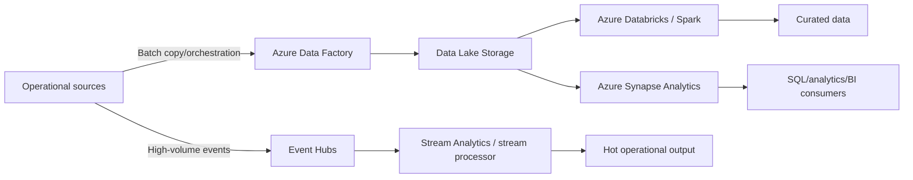

Not every solution needs every box. First classify the work:

| Requirement | Candidate | Why | Wrong-choice signal |
|---|---|---|---|
| Scheduled/batch data movement and workflow orchestration across sources | Azure Data Factory | Pipelines, activities, linked services, integration runtimes, control flow and connectors | Event Grid only not an ETL engine |
| On-premises/private-network data movement | Data Factory with self-hosted integration runtime | Runtime provides network reach to supported sources | Assuming the managed runtime can enter an isolated network without connectivity |
| Durable raw/curated analytics storage | Data Lake Storage | Massive multi-format storage with analytics hierarchy | Using a message broker as the long-term lake |
| Collaborative Spark engineering/ML with notebook ecosystem | Azure Databricks | Managed analytics platform built around Spark | Choosing it merely for simple copy/orchestration |
| Integrated SQL analytics, Spark, and pipelines in a workspace | Azure Synapse Analytics | Unified analytics capabilities | Treating operational SQL Database as a large analytical warehouse by default |
| Declarative real-time stream queries/windowing | Azure Stream Analytics | Managed stream processing over event inputs | Service Bus queue for telemetry analytics/replay |
| End-to-end SaaS analytics platform requirements | Microsoft Fabric | Unified SaaS data movement/engineering/warehouse/real-time/BI | Selecting solely because it is newer; confirm tenant, capacity, governance, and objective fit |

### ADF design vocabulary

- **Linked service:** connection information for a store/compute.
- **Dataset:** named view of data shape/location used by activities.
- **Activity:** a movement, transformation, or control step.
- **Pipeline:** logical workflow of activities and dependencies.
- **Trigger:** schedule, tumbling window, or event mechanism that starts work.
- **Integration runtime:** compute/network bridge for movement, dispatch, and SSIS scenarios.

ADF can orchestrate external compute; it is not automatically the transformation engine for every workload. Keep credentials in managed mechanisms such as managed identity/Key Vault integration, build retry/idempotency for activities, and monitor pipeline outcomes.

### Hot, warm, and cold paths

- **Hot path:** acts on events immediately; optimize latency and bounded state/windowing.
- **Warm path:** processes recent accumulated data for near-real-time insight.
- **Cold path:** batch processes full durable history for correctness, enrichment, and reprocessing.

An event-stream architecture commonly writes immutable events to durable storage while a stream processor creates hot outputs. This preserves replay/recomputation rather than making the hot store the only record.

### Data integration scenario

**Requirements:** Ingest plant telemetry continuously, detect five-minute anomalies, keep seven years of raw data, join it nightly to ERP data on-premises, and serve analysts.

**Recommendation:** Event Hubs for the high-volume event stream; Stream Analytics or another documented stream processor for windowed hot detection; Data Lake Storage for durable raw/curated zones; Data Factory with self-hosted integration runtime for scheduled ERP movement/orchestration; Synapse/Databricks/Fabric selection based on SQL, Spark, governance, team, and SaaS platform requirements.

**Why not Service Bus?** The requirement is a replayable high-throughput telemetry stream, not an enterprise command queue. **Why not Event Grid?** It routes discrete events rather than serving as the high-volume analytics log. **Trade-off:** multiple paths must reconcile schemas, late data, checkpoints, and observability.

### What would change the decision?

A low-code unified SaaS mandate can favor Fabric. Existing deep Spark engineering and ML practices can favor Databricks. Primarily SQL warehouse/query needs can favor Synapse/Fabric warehouse capabilities. Simple scheduled copies may require Data Factory without either Spark platform.

**Official Microsoft sources:**

- https://learn.microsoft.com/en-us/training/paths/design-data-storage-solutions/
- https://learn.microsoft.com/en-us/azure/data-factory/introduction
- https://learn.microsoft.com/en-us/azure/architecture/data-guide/technology-choices/pipeline-orchestration-data-movement
- https://learn.microsoft.com/en-us/azure/architecture/data-guide/scenarios/data-lake
- https://learn.microsoft.com/en-us/azure/stream-analytics/stream-analytics-introduction
- https://learn.microsoft.com/en-us/azure/synapse-analytics/overview-what-is
- https://learn.microsoft.com/en-us/azure/databricks/introduction/

## Domain 2 architecture scenario

**Business need:** A multitenant SaaS product has 5,000 small tenant databases with staggered peaks, shared media, analytics, and a regional recovery requirement.

**Decision:** Evaluate SQL Database elastic pools for databases whose peaks can share capacity; isolate unusually large/noisy tenants if needed. Store media in Blob Storage with a tier/lifecycle policy. Use a geo-redundancy option matched to the media RPO and read-during-outage requirement. Move operational data through governed pipelines into a lake/analytical system rather than running heavy analytics on every tenant OLTP database. Design database geo-recovery separately from storage-account failover.

**Rejected alternatives:** one SQL VM fleet increases operational burden without an OS requirement; one giant cross-tenant database might violate isolation or scale needs; Archive is wrong for frequently served media; GRS alone does not give pre-failover secondary reads.

**Trade-off:** elastic sharing improves utilization but needs per-tenant limits and noisy-neighbor monitoring; geo-replication adds cost and has service-specific RPO/failover behavior.

## Domain 2 mini-exam

### Question 7

A legacy SQL Server application requires instance-scoped features but no operating-system access. The team wants Microsoft-managed patching, backups, and HA with minimal database changes. What is the leading candidate?

A. Azure SQL Database  
B. Azure SQL Managed Instance  
C. SQL Server on Azure VM  
D. Azure Cosmos DB

<details>
<summary>Answer</summary>

**Correct answer:** B.

**Requirement signal:** Instance-level compatibility plus PaaS management and no OS access.

**Why:** Managed Instance is designed for high SQL Server instance/database compatibility with managed PaaS operations.

**Why the alternatives are wrong:** SQL Database has a more database-scoped model; SQL VM adds unnecessary OS/engine administration; Cosmos DB is nonrelational.

**Trade-off:** Validate exact feature compatibility, networking, sizing, and migration path.

**Official objective:** Recommend a solution for storing relational data.

**Official Microsoft source:** https://learn.microsoft.com/en-us/azure/azure-sql/azure-sql-iaas-vs-paas-what-is-overview

</details>

### Question 8

Hundreds of independent SQL databases have unpredictable, noncoincident peaks. The architect wants shared capacity and lower idle waste. Which design should be investigated first?

A. One VM per database  
B. Azure SQL Database elastic pool  
C. Cosmos DB serverless  
D. Blob Archive

<details>
<summary>Answer</summary>

**Correct answer:** B.

**Requirement signal:** Many independent databases with variable peaks that can share resources.

**Why:** Elastic pools provide shared resource allocation for a database fleet.

**Why the alternatives are wrong:** Per-database VMs maximize operational/capacity waste; Cosmos changes the data/transaction model; Archive is object storage.

**Trade-off:** Size aggregate and per-database limits and isolate outliers.

**Official objective:** Recommend a database service tier and compute tier; recommend scalability.

**Official Microsoft source:** https://learn.microsoft.com/en-us/azure/azure-sql/database/elastic-pool-overview

</details>

### Question 9

An application stores objects in one region and must keep read/write availability through a single availability-zone outage. It has no regional-disaster requirement. What redundancy is the direct candidate?

A. LRS  
B. ZRS  
C. GRS  
D. RA-GRS

<details>
<summary>Answer</summary>

**Correct answer:** B.

**Requirement signal:** Synchronous primary-region zone resilience with continued access.

**Why:** ZRS copies across availability zones in the primary region.

**Why the alternatives are wrong:** LRS is within one datacenter; GRS/RA-GRS use LRS in primary and add asynchronous regional replication, which was not requested.

**Trade-off:** ZRS costs more than LRS and does not by itself protect from a regional outage.

**Official objective:** Recommend a data solution for protection and durability.

**Official Microsoft source:** https://learn.microsoft.com/en-us/azure/storage/common/storage-redundancy

</details>

### Question 10

During a primary-region outage, a catalog application must read the asynchronously replicated object copy before account failover. It also requires zone resilience in the primary. Which redundancy family fits?

A. LRS  
B. ZRS  
C. GZRS  
D. RA-GZRS

<details>
<summary>Answer</summary>

**Correct answer:** D.

**Requirement signal:** Zone-resilient primary + geo-copy + direct secondary read.

**Why:** RA-GZRS combines ZRS in primary, asynchronous geo-replication, and a readable secondary endpoint.

**Why the alternatives are wrong:** LRS/ZRS lack geo-copy; GZRS lacks pre-failover read access.

**Trade-off:** Secondary data can lag because geo-replication is asynchronous; application routing must tolerate stale reads.

**Official objective:** Recommend data protection and durability.

**Official Microsoft source:** https://learn.microsoft.com/en-us/azure/storage/common/storage-redundancy

</details>

### Question 11

A Cosmos DB application normally reads an account’s own recent writes and accepts that other sessions may see older values. Which consistency level is the natural starting point?

A. Strong  
B. Bounded staleness  
C. Session  
D. Eventual

<details>
<summary>Answer</summary>

**Correct answer:** C.

**Requirement signal:** Read-your-writes within a client session.

**Why:** Session consistency provides session-scoped read-your-writes and related guarantees.

**Why the alternatives are wrong:** Strong is more coordination than stated; bounded staleness expresses a lag bound not requested; eventual lacks the session guarantee.

**Trade-off:** Preserve session context and understand visibility between sessions.

**Official objective:** Recommend a semi-structured data solution balancing features/performance/cost.

**Official Microsoft source:** https://learn.microsoft.com/en-us/azure/cosmos-db/consistency-levels

</details>

### Question 12

An application requires an existing shared SMB path from multiple servers with minimal code change. Which service is the primary candidate?

A. Blob Storage  
B. Azure Files  
C. Managed disk attached to one VM  
D. Event Hubs

<details>
<summary>Answer</summary>

**Correct answer:** B.

**Requirement signal:** Managed shared filesystem and SMB protocol.

**Why:** Azure Files exposes managed SMB/NFS file shares for supported scenarios.

**Why the alternatives are wrong:** Blob uses object semantics; an ordinary attached disk is block storage and not the requested managed share; Event Hubs is streaming ingestion.

**Trade-off:** Validate identity, network path, protocol version, tier/performance, and backup.

**Official objective:** Recommend a solution for storing unstructured data.

**Official Microsoft source:** https://learn.microsoft.com/en-us/azure/storage/files/storage-files-introduction

</details>

---

# DOMAIN 3 — Design business continuity solutions (15–20%)

## 3.1 Reliability begins with business targets

Three concepts solve different problems:

| Concept | Goal | Typical mechanism | Does not automatically provide |
|---|---|---|---|
| High availability (HA) | Keep serving through expected component/local failures | Redundant instances, load balancing, zones, service replicas | Recovery from regional catastrophe or operator data deletion |
| Disaster recovery (DR) | Restore service after a major site/region failure | Cross-region replication, standby deployment, failover/failback plan | Historical recovery from logical corruption |
| Backup | Recover data/state from a retained point | Recovery points, snapshots, vaults, point-in-time restore | A running application or instant traffic failover |

Design all three where the workload requires them. “Geo-replicated” is not synonymous with “backed up”: replication can copy a destructive write. “Backed up” is not synonymous with “highly available”: a restore consumes time.

### Translate impact into targets

For every critical flow, establish:

- maximum acceptable outage (**RTO**);
- maximum acceptable data-loss window (**RPO**);
- availability SLO and measured SLIs;
- degraded-mode behavior;
- recovery order and dependencies;
- recovery ownership and decision authority;
- testing frequency and evidence;
- budget for steady-state redundancy and recovery capacity.

Do not start with a service’s claimed SLA. Start with business impact, then evaluate whether the composed architecture, application, operations, and Azure service commitments can meet the workload target.

## 3.2 Failure-scope model

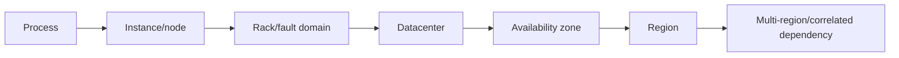

| Failure | Typical design response | Validation |
|---|---|---|
| Process crash | Platform restart, health probes, multiple processes | Kill process; verify traffic and state behavior |
| VM/node loss | Multiple instances/VMSS, load balancer, managed service replicas | Remove instance; observe replacement and capacity |
| Rack/hardware domain | Availability set/fault-domain placement where zones are not the chosen model | Simulated node/fault-domain loss |
| Datacenter/zone | Zone-redundant service or zonal instances in multiple zones | Zone failure exercise where supported |
| Region | Independent regional deployment, replicated data, global routing, runbook | Regional evacuation/failover test |
| Bad deployment/configuration | Safe rollout, health gates, rollback, IaC | Inject failed release and recover |
| Data corruption/operator deletion | Point-in-time recovery, immutable/protected backups | Restore representative application state |
| Identity/DNS/control dependency | Break-glass and dependency-resilient design | Test loss of primary identity/network/DNS path |

Choose a redundancy mechanism only after naming the failure it is expected to survive.

## 3.3 Availability zones and regions

- An **availability zone** is a physically separate group of datacenters in a region with independent power, cooling, and networking.
- A **zonal resource** is pinned to one selected zone. It is isolated from failures in other zones but is not itself zone-resilient. Deploy independent instances across zones and manage failover/load distribution.
- A **zone-redundant resource** spans multiple zones and Microsoft manages distribution/replication/failover according to the service.
- A **regional/nonzonal resource** does not expose a selectable zone model; consult its reliability guide.
- A zone-resilient architecture must examine every dependency. Three zonal web instances do not help if the only data tier is pinned to one zone.

Zone support varies by region, service, feature, and SKU. Some services require explicit configuration; some are zone-redundant by default. Never infer support from another service.

### Single region, multi-zone, or multi-region

| Topology | Best fit | Benefits | Costs/risks |
|---|---|---|---|
| Single instance/site | Disposable, reconstructable, low-criticality workloads | Lowest cost/complexity | Single failure can stop service |
| Multiple instances in one region | Instance/rack failure target | Local latency and simpler data | Region/datacenter boundary may remain |
| Multi-zone | Zone failure target without full regional DR | Strong in-region availability | Zone-capable SKU, cross-zone latency/traffic, still one region |
| Multi-region active/passive | Regional DR with controlled standby | Simpler write ownership/conflicts; cost can be lower than active/active | Failover time, standby drift/capacity, asynchronous RPO |
| Multi-region active/active | Regional resilience and user proximity | Uses capacity in all regions; fast routing potential | Highest distributed-data, conflict, deployment, and operating complexity |

### Active/passive versus active/active

**Active/passive:** one region owns traffic/writes; secondary capacity can be cold, warm, or hot. Capacity savings can increase RTO. Regularly deploy, patch, validate, and test the secondary—an untested standby is an assumption.

**Active/active:** both regions serve traffic. It can improve utilization and failover behavior but requires global routing, regional independence, sufficient surviving capacity, data consistency/conflict handling, idempotency, and operational tooling. Avoid turning shared global components into hidden single points of failure.

### Deployment stamps

Replicate a bounded, independently deployable regional unit: entry, compute, data/cache/integration dependencies where possible, monitoring, and configuration. Global routing selects healthy stamps. Stamps reduce blast radius and make capacity/tenant placement explicit; they add version and data-movement complexity.

## 3.4 Design backup and recovery

### The backup questionnaire

1. What exact state must be protected: VM, disks, database, file share, blobs, configuration, keys?
2. What are RPO and RTO for each?
3. What retention schedule and compliance/immutability apply?
4. Is application-consistent recovery required, or is crash consistency sufficient?
5. Where may recovery points reside?
6. What granularity is required: item, file, database, VM, whole workload?
7. Who can delete/restore them, and how is privileged access protected?
8. How are restores isolated, scanned, validated, and returned to service?
9. What dependencies and sequence form a recoverable application?

### Azure Backup architectural choices

Azure Backup centralizes supported workload protection through vault constructs and workload-specific policies. Select the vault and policy from the protected datasource and required capabilities, not merely by name. Current services include Recovery Services vault and Backup vault scenarios; support differs.

Security controls to investigate include soft delete/enhanced soft delete, immutability, multi-user authorization/Resource Guard where supported, private connectivity, encryption/key ownership, alerts, and least-privileged roles. Protection from ransomware or malicious administration is an authorization and isolation design, not only a retention number.

### Compute backup and recovery

| Need | Candidate | Caution |
|---|---|---|
| Recover Azure VM/disks/files/application state | Azure VM Backup with appropriate policy | Confirm application consistency, snapshot/vault behavior, restore granularity and duration |
| Rapidly recover VM workload in another region | Azure Site Recovery | Replication/DR is not long-term historical backup |
| Recreate stateless compute | IaC + image/artifact + data backup | IaC cannot recover mutable application data |
| Protect VM configuration alongside disks | Backup plus exported/IaC configuration | Avoid relying on undocumented capture of every external dependency |

### Database backup and recovery

Prefer database-native managed capabilities for PaaS engines: automated backups, point-in-time restore, long-term retention, geo-restore/geo-replication/failover mechanisms as required. For databases on VMs, choose workload-aware backup and SQL-native HA/DR deliberately. The application must use the restored endpoint and reconcile data; a successful restore API call is not full workload recovery.

### Unstructured data backup and recovery

Combine the service’s redundancy with threat-specific protection: soft delete, versions/snapshots, operational/vaulted backup where supported, immutability, lifecycle/retention, account recovery and geo-failover design. Test that permissions, metadata, directory semantics, and dependent applications recover—not just bytes.

## 3.5 Disaster recovery with Azure Site Recovery

Azure Site Recovery (ASR) orchestrates replication, failover, and failback for supported VM/physical-server scenarios. It can protect Azure VMs between regions and supported on-premises VMware/Hyper-V/physical workloads to Azure.

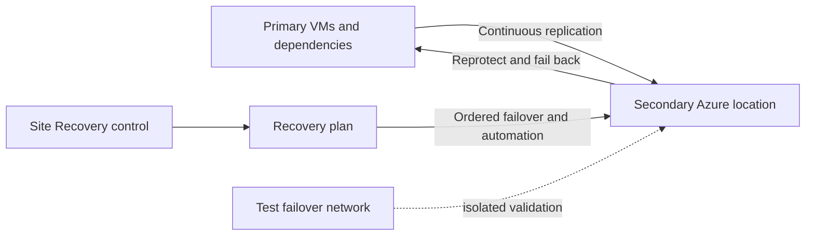

A recovery plan groups machines and defines startup sequence, manual actions, and automation. It models the application dependency order—not just a list of VMs. Test failover must be isolated from production and should validate network, identity, DNS, certificates, database consistency, capacity, monitoring, and client routing.

### Failover vocabulary

- **Test failover:** proves the plan without disrupting ongoing replication/production.
- **Planned failover:** used for expected outage and coordinates shutdown/synchronization where supported.
- **Unplanned failover:** used after failure; data loss depends on available recovery points and replication.
- **Commit:** accepts the chosen recovery point after failover.
- **Reprotect:** establishes replication in the reverse/new direction.
- **Failback:** returns operation to the recovered primary after validation.

ASR does not automatically make a multi-tier application correct. You own dependency mapping, traffic/DNS, network security, target capacity, non-VM PaaS data, secrets, and business validation.

## 3.6 HA design by workload family

### Compute

- VM Scale Sets manage a fleet of similar VMs and support autoscale/orchestration models; pair with health and load distribution.
- Availability Zones protect against a zone failure when instances and dependencies span zones.
- Availability Sets distribute supported VMs across fault/update domains within a datacenter-oriented model and are not a regional DR mechanism.
- App Service, Functions, Container Apps, and AKS are regional application platforms. Multiple instances can address instance failure; multi-region requires multiple regional deployments and external routing.

### Relational data

- Managed PaaS uses built-in local HA; explicit zone redundancy, read replicas, active geo-replication, or failover groups depend on service/tier.
- SQL Server on VMs needs a SQL-aware availability design such as availability groups/failover cluster options matched to storage and listener/network requirements.
- Synchronous replication favors low RPO but can increase write latency and is normally used within an appropriate distance. Asynchronous replication permits distance/availability but creates nonzero data-loss exposure.

### Semi-structured/unstructured data

- Cosmos DB distribution combines regions, write-region model, partition design, and consistency. Region count alone does not settle write availability or conflicts.
- Azure Storage LRS/ZRS/GRS families encode datacenter, zone, region, and secondary-read trade-offs.
- Blob object replication is a different capability from account geo-redundancy and backup; verify direction, supported tiers/features, and deletion behavior.

## 3.7 Reliability patterns

| Pattern | Purpose | Essential caution |
|---|---|---|
| Retry with backoff/jitter | Survive transient faults | Retry only transient/idempotent-safe operations; cap attempts |
| Circuit Breaker | Stop repeatedly calling an unhealthy dependency | Define open/half-open behavior and degraded fallback |
| Timeout | Bound waiting and release resources | Align with downstream behavior; too short causes retry storms |
| Queue-Based Load Leveling | Buffer bursts from constrained consumers | Queue depth adds latency; scale consumers and handle poison messages |
| Health Endpoint Monitoring | Test meaningful application dependencies | A process-alive check can declare a broken app healthy |
| Compensating Transaction | Undo/offset steps in eventual workflows | Compensation is domain logic, not a generic database rollback |
| Bulkhead | Isolate failure/capacity by dependency or tenant | Isolation consumes resources and requires partition ownership |
| Deployment stamp | Independent repeatable scale/failure unit | Manage data placement, routing, and version consistency |

## 3.8 Business-continuity scenario

**Requirements:** An order API may lose no acknowledged in-region transaction during a zone failure, must resume in a second region within 30 minutes after regional disaster, may lose up to five minutes of the newest regional data, and must recover an accidentally deleted order for 30 days.

**Design reasoning:**

1. Multi-zone synchronous HA in each active region addresses zone failure and the zero-loss-in-zone requirement.
2. Cross-region asynchronous replication/standby plus a global router addresses regional DR and the allowed nonzero regional RPO.
3. A tested failover runbook and warm capacity must demonstrate the 30-minute RTO.
4. Point-in-time/historical backup addresses accidental deletion; HA and cross-region replication alone do not.
5. Use idempotent order acceptance and a stable business id so ambiguous client retries cannot duplicate orders.

**Trade-off:** Synchronous in-region commits can add latency; maintaining a warm regional stack costs money; point-in-time recovery may require restore to a new database and selective reconciliation.

## What would change the decision?

If regional RPO becomes zero, an asynchronously replicated design is insufficient; re-evaluate data technology, write ownership, distance, and business process. If RTO becomes hours and cost dominates, a cold restore may replace hot/warm standby. If regulation forbids a second region, use maximum in-region zone resilience plus backup while explicitly accepting the regional-outage limitation.

**Official Microsoft sources:**

- https://learn.microsoft.com/en-us/azure/well-architected/reliability/metrics
- https://learn.microsoft.com/en-us/azure/reliability/availability-zones-overview
- https://learn.microsoft.com/en-us/azure/well-architected/design-guides/regions-availability-zones
- https://learn.microsoft.com/en-us/azure/backup/backup-overview
- https://learn.microsoft.com/en-us/azure/backup/security-overview
- https://learn.microsoft.com/en-us/azure/site-recovery/site-recovery-overview
- https://learn.microsoft.com/en-us/azure/site-recovery/recovery-plan-overview
- https://learn.microsoft.com/en-us/training/paths/design-business-continuity-solutions/

## Domain 3 mini-exam

### Question 13

A VM application must run through the failure of one availability zone. Which statement is correct?

A. Place one VM in a selected zone  
B. Deploy independent instances across zones with load distribution and ensure dependencies are also zone resilient  
C. Use an availability set in one zone and call it regional DR  
D. Take a daily backup only

<details>
<summary>Answer</summary>

**Correct answer:** B.

**Requirement signal:** Survive a zone failure while continuing service.

**Why:** A zonal resource alone is not zone-resilient; instances and dependencies must span zones or use zone-redundant services.

**Why the alternatives are wrong:** One zone is the failure scope; availability sets are not regional DR; backup requires restore and does not keep service live.

**Trade-off:** Cross-zone architecture adds cost and can add traffic/latency considerations.

**Official objective:** Recommend a high availability solution for compute.

**Official Microsoft source:** https://learn.microsoft.com/en-us/azure/reliability/availability-zones-overview

</details>

### Question 14

A replicated database immediately copies an accidental delete to its standby. Which mechanism addresses recovery of the deleted record?

A. Add another load balancer  
B. Point-in-time restore or an appropriate retained backup  
C. Increase VM instance count  
D. Use DNS failover

<details>
<summary>Answer</summary>

**Correct answer:** B.

**Requirement signal:** Logical corruption replicated to HA/DR copies.

**Why:** Historical recovery returns to a point before the deletion.

**Why the alternatives are wrong:** Routing and instance redundancy do not create historical data.

**Trade-off:** Restore may create a new database and require selective reconciliation and cutover.

**Official objective:** Recommend a backup and recovery solution for databases.

**Official Microsoft source:** https://learn.microsoft.com/en-us/azure/postgresql/flexible-server/concepts-high-availability

</details>

### Question 15

An organization wants to orchestrate failover of a three-tier VM application, start tiers in dependency order, add automation, and run nondisruptive drills. What should it use?

A. Azure Site Recovery recovery plan  
B. Azure Policy initiative  
C. Application Insights workbook  
D. A storage lifecycle rule

<details>
<summary>Answer</summary>

**Correct answer:** A.

**Requirement signal:** Ordered multi-VM failover, automation, and test failover.

**Why:** ASR recovery plans sequence groups and can include instructions/automation, with test failover support.

**Why the alternatives are wrong:** Policy enforces resource state; workbooks visualize; lifecycle rules tier/delete storage.

**Trade-off:** The team still owns application dependencies, target network/capacity, DNS, validation, and non-VM data recovery.

**Official objective:** Recommend a recovery solution for Azure and hybrid workloads.

**Official Microsoft source:** https://learn.microsoft.com/en-us/azure/site-recovery/recovery-plan-overview

</details>

### Question 16

A company says RPO is 10 minutes. What does that mean?

A. The application must restart in 10 minutes  
B. At most 10 minutes of data loss is acceptable after an incident  
C. Monitoring must alert within 10 minutes  
D. The monthly downtime budget is 10 minutes

<details>
<summary>Answer</summary>

**Correct answer:** B.

**Requirement signal:** Recovery point, not recovery time.

**Why:** RPO is the maximum acceptable duration of data loss; RTO is the maximum acceptable unavailability.

**Why the alternatives are wrong:** A is RTO; C is detection time; D is an availability budget.

**Trade-off:** Lower RPO generally needs more frequent or synchronous protection and may increase cost/latency.

**Official objective:** Recommend a recovery solution that meets recovery objectives.

**Official Microsoft source:** https://learn.microsoft.com/en-us/azure/well-architected/reliability/metrics

</details>

### Question 17

A storage account uses GRS. The application must read the secondary copy while the primary is unavailable but before account failover. What change is required?

A. Change to LRS  
B. Enable the read-access geo variant, if supported  
C. Add a resource lock  
D. Move blobs to Archive

<details>
<summary>Answer</summary>

**Correct answer:** B.

**Requirement signal:** Direct pre-failover read access to the geo-secondary endpoint.

**Why:** RA-GRS/RA-GZRS expose secondary reads; GRS/GZRS do not expose the secondary until failover.

**Why the alternatives are wrong:** LRS removes geo-copy; locks do not alter availability; Archive makes reads require rehydration.

**Trade-off:** Secondary reads may be stale because geo-replication is asynchronous.

**Official objective:** Recommend HA for semi-structured/unstructured data.

**Official Microsoft source:** https://learn.microsoft.com/en-us/azure/storage/common/storage-redundancy

</details>

---

# DOMAIN 4 — Design infrastructure solutions (30–35%)

## 4.1 Design compute solutions

### Compute decision tree

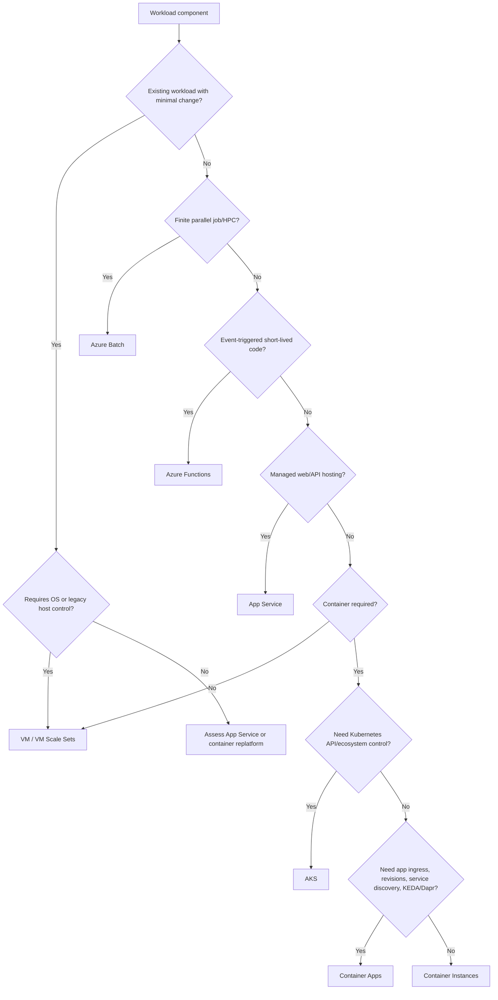

This produces candidates, not a verdict. Then check networking, state, HA, regional topology, identity, observability, team skill, limits, and cost.

### Major compute comparison

| Service | Best requirement signals | Control / operations | Scaling model | State/network notes | Common wrong choice |
|---|---|---|---|---|---|
| Virtual Machines | OS/agent/legacy runtime, full host control, custom appliance | Highest guest responsibility | Manual/autoscale through VMSS | Full VNet control; externalize state where possible | Choosing VMs merely because the app runs on Windows/Linux |
| VM Scale Sets | Fleet of similar VMs, autoscale, resilient instance set | Own image, guest, health, patch strategy | Instance autoscale and orchestration | Pair with load balancing, zones, health | Treating VMSS as an application PaaS |
| App Service | Managed web apps, APIs, mobile back ends, supported stacks/containers | Low; platform-managed web host | Scale up/out; plan instances; autoscale features by tier | Regional; VNet integration/private endpoint features have distinct directions | Using it for arbitrary orchestration or non-web host control |
| Azure Container Apps | Serverless containers, microservices, revisions, traffic split, event-driven scale/jobs | Low; no direct Kubernetes API | HTTP/KEDA rules, scale to zero where configured | Environment/ingress/service discovery; state external | Selecting AKS when native Kubernetes control is not required |
| AKS | Direct Kubernetes API, operators/CRDs, Kubernetes portability/control, complex orchestration | High relative to other managed platforms; AKS manages control-plane aspects but team owns cluster/workload operations | Pod and node/cluster scaling | VNet/CNI/ingress/storage choices; multi-cluster for multiregion | “Containers imply Kubernetes” |
| Container Instances | Isolated container group/task/building block without orchestrator | Low platform, but app-level scaling/LB/certificates not provided | No built-in application orchestration/autoscale | Useful for burst/task or as component behind other service | Treating ACI as a full microservice platform |
| Azure Functions | Trigger/binding-oriented event code and serverless APIs | Low application host operations | Event-driven; plan-specific behavior | State belongs in durable/external services; networking/cold start vary by plan | Long continuously busy service chosen only for “serverless” label |
| Azure Batch | Large parallel/batch/HPC job with pools/tasks/scheduling | Manage application package/job/pool policy; Azure handles scheduling infrastructure | Pool autoscale and task parallelism | Data staging and result durability required | Building a custom VM scheduler without a unique requirement |
| Logic Apps | Workflow/integration orchestration and connectors | Designer/workflow operation rather than code host | Managed workflow execution | Integration accounts/connectors/network model by plan | Treating it as general compute for CPU-heavy code |

All general application platforms in Microsoft’s compute decision guide are regional. Multi-region means multiple deployments plus a global routing/failover solution; an autoscaled regional app is not regional DR.

### VM architecture

Use a VM when the requirement survives these questions:

- Does the application require administrator/root, a kernel/driver/agent, unsupported runtime, or exact OS?
- Is a licensed appliance or legacy installer the workload?
- Can the team own patching, vulnerability response, image lifecycle, guest monitoring, backup, and recovery?
- Can state move to a managed data service, or must VM disks be recovered consistently?

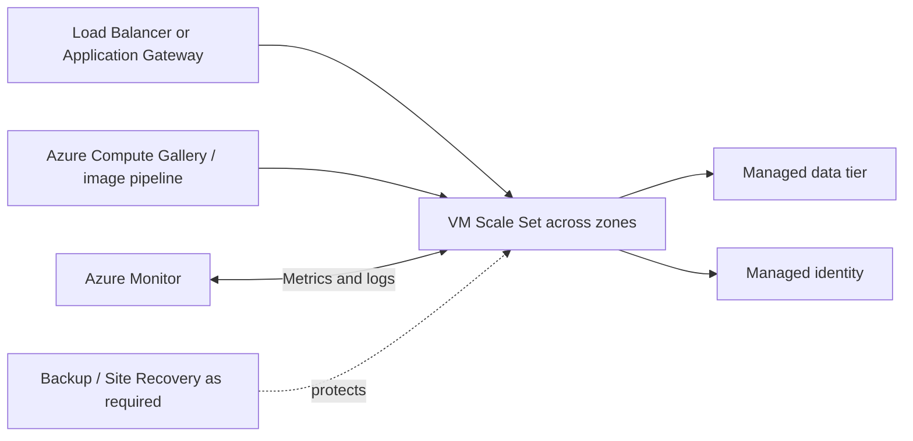

Key decisions:

- **Placement:** zones for zone-failure resilience; availability sets where the service/region/design uses fault/update domains and zones are not the solution.
- **Fleet:** VMSS for consistent instances and scaling; individual VMs for exceptional pets only when justified.
- **Image:** immutable, versioned image pipeline/Compute Gallery versus configuration at boot. Reduce drift.
- **Storage:** choose managed disk by measured latency/IOPS/throughput and recovery needs.
- **Access:** Bastion or controlled private administrative paths; avoid public IPs on every VM.
- **Outbound:** explicit NAT/firewall/routing design; do not depend on accidental/default outbound behavior.
- **Maintenance:** Azure Update Manager/patch orchestration appropriate to OS and availability topology.
- **Protection:** backup for historical recovery; ASR for supported DR; neither replaces multi-instance HA.
- **Dedicated Hosts:** investigate only when hardware isolation, compliance, placement, or licensing requires dedicated physical server capacity.

### App Service architecture

An App Service plan defines the regional compute pool—OS, region, VM size/count, and pricing tier. Apps in the plan share plan resources. This can improve utilization or create noisy-neighbor coupling; use separate plans for independent scale, isolation, ownership, or blast radius.

Deployment slots are live apps with their own hostnames. A staged slot can warm and validate before a swap; the old production deployment moves to the other slot and can be swapped back. Some configuration is slot-sticky or never swapped. Managed identities and VNet integration are notable lifecycle concerns; validate the exact current swap behavior.

Use VNet integration for app **outbound** access to a virtual network. Use a private endpoint for private **inbound** access. These are not synonyms.

### Container architecture

Always identify five layers:

```text
source → image build → registry → runtime/orchestrator → data/network/observability
```

- Azure Container Registry stores and distributes images; use identity/RBAC, image provenance, vulnerability processes, replication only when required, and immutable versioning practices.
- Container image is deployment content, not a data persistence strategy.
- Put mutable state in appropriate volumes/data services and design backup/consistency there.
- Scale on a meaningful signal (HTTP concurrency, queue depth, event rate), and cap downstream pressure.

#### ACI vs Container Apps vs AKS

| Requirement | ACI | Container Apps | AKS |
|---|---:|---:|---:|
| Run one/few container groups on demand | Strong | Strong | Usually excessive |
| Built-in revisions/traffic splitting/service discovery | No | Yes | Build/configure with Kubernetes components |
| Event-driven scale to zero | Not built-in app platform behavior | Yes, rule dependent | Possible with installed/configured ecosystem |
| Direct Kubernetes API, CRDs, operators | No | No | Yes |
| Team wants minimum orchestration operations | Good for simple task | Strong for app/microservice platform | Weakest unless Kubernetes need dominates |
| Custom Kubernetes networking/control plane surface | No | Abstracted | Strong |

AKS comes in current experience models including Standard and Automatic. Even where Azure automates node/security/upgrade tasks, direct Kubernetes capability and workload/cluster governance remain a design responsibility. Use Container Apps when Kubernetes-style microservices are needed without direct Kubernetes API/cluster management. Use AKS when the Kubernetes contract itself is required.

### Serverless design

Functions decisions include trigger, concurrency, hosting plan, language/runtime, deployment unit, state, networking, identity, and retry/idempotency.

Current hosting options documented by Microsoft include Flex Consumption, Elastic Premium, Dedicated App Service plan, Azure Container Apps, and the legacy Consumption plan. Plan choice changes scale, networking, cold start, container support, maximum execution behaviors, and billing.

| Need | Candidate direction |
|---|---|
| Pay-for-use, event scale, improved cold start/networking options | Evaluate Flex Consumption |
| Always-ready instances, predictable warm execution, premium networking/features | Elastic Premium |
| Existing spare App Service capacity or continuously running functions | Dedicated plan |
| Containerized Functions alongside Container Apps environment | Container Apps hosting |
| Stateful coordination, fan-out/fan-in, human/external-event workflow | Durable Functions pattern, after verifying semantics |

> **Current retirement callout:** Microsoft states that the option to host function apps on Linux in the legacy Consumption plan is retiring on September 30, 2028; Windows Consumption apps are not currently affected by that notice. Microsoft directs new serverless function apps to Flex Consumption. Validate runtime support separately from hosting-plan support.

Cold start is a latency trade-off, not a universal disqualifier. If a flow cannot tolerate it, use always-ready/prewarmed/minimum instances or another hosting model, and validate with performance tests.

### Batch processing

Azure Batch models **pools → jobs → tasks**. It provisions/manages compute pools and schedules tasks. Choose it for large parallel, scheduled, rendering, simulation, engineering, or HPC workloads when the job/task model fits.

Design:

- input staging and output/checkpoint storage;
- pool image, VM size, GPU/accelerator, and container needs;
- dedicated versus Spot/low-priority capacity based on interruption tolerance;
- autoscale formula or fixed/warm pool based on queue and startup time;
- task retry/idempotency and partial-job recovery;
- subnet/private connectivity and outbound dependencies;
- identity, secrets, packages, logs, and job retention;
- quotas and regional capacity verified live.

Functions is appropriate for event handlers and orchestration glue; it is not automatically a substitute for a large pool-based parallel job. Container Apps jobs can fit scheduled/event/on-demand container tasks. The deciding constraints are job size, orchestration, runtime, parallelism, startup tolerance, and control.

### Compute “what would change the decision?”

- App Service → Container Apps when the container/microservice revision and event-scale model is decisive.
- Container Apps → AKS when direct Kubernetes API, CRDs/operators, custom cluster/network policy, or portability contract becomes mandatory.
- Functions → Container Apps/App Service when runtime/execution/network/deployment constraints no longer fit the plan.
- PaaS → VM when an actual OS/agent/unsupported-runtime dependency is discovered.
- Dedicated provisioned host → consumption/serverless when demand becomes sparse and latency allows scale from zero.

**Official Microsoft sources:**

- https://learn.microsoft.com/en-us/azure/architecture/guide/technology-choices/compute-decision-tree
- https://learn.microsoft.com/en-us/azure/virtual-machines/overview
- https://learn.microsoft.com/en-us/azure/virtual-machine-scale-sets/overview
- https://learn.microsoft.com/en-us/azure/app-service/overview
- https://learn.microsoft.com/en-us/azure/app-service/overview-hosting-plans
- https://learn.microsoft.com/en-us/azure/app-service/deploy-staging-slots
- https://learn.microsoft.com/en-us/azure/aks/compare-container-options-with-aks
- https://learn.microsoft.com/en-us/azure/container-apps/overview
- https://learn.microsoft.com/en-us/azure/container-instances/container-instances-overview
- https://learn.microsoft.com/en-us/azure/azure-functions/functions-scale
- https://learn.microsoft.com/en-us/azure/batch/batch-service-workflow-features

## 4.2 Design an application architecture

### Messaging begins with intent

| Intent | Description | Natural Azure candidate |
|---|---|---|
| Command/message | Producer expects a consumer to perform work; payload carries required data and a contract | Service Bus or Storage Queue based on feature need |
| Discrete event notification | Something happened; publisher does not dictate handling | Event Grid |
| Event stream/telemetry log | High-volume ordered sequence for independent readers, replay, analytics | Event Hubs |

Do not collapse all three into “messages.” Delivery contract determines the architecture.

### Service Bus architecture

- A **queue** load-balances commands among competing consumers.
- A **topic** plus **subscriptions** gives each subscriber its own logical stream, with filters for broad routing.
- **PeekLock** supports at-least-once processing: complete only after side effects succeed; abandoned/expired locks can cause redelivery.
- **ReceiveAndDelete** is at-most-once and can lose a message if processing fails after receipt.
- **Sessions** provide ordered/FIFO processing per session key and can retain session state.
- **Duplicate detection** addresses duplicate sends inside its configured window; it does not remove the need for idempotent consumers after redelivery.
- **DLQ** isolates expired/poison/undeliverable messages for diagnosis. It needs an owner, alert, remediation, and replay policy.
- Transactions, scheduled delivery, deferral, filters, and forwarding are reasons to choose Service Bus when required and supported by tier.

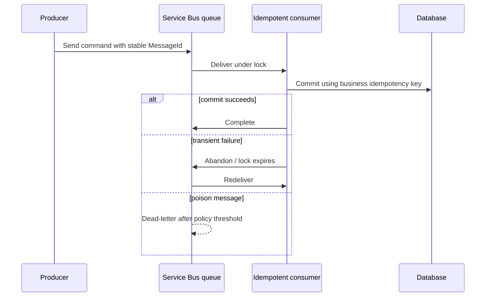

Exactly-once business outcomes are an end-to-end application property, not a slogan from broker duplicate detection. Use stable identifiers, idempotent writes, transactional outbox/inbox patterns where appropriate, and reconciliation.

### Service Bus Queue vs Storage Queue

| Requirement | Storage Queue | Service Bus Queue |
|---|---|---|
| Simple durable Azure queue with Storage account model | Strong candidate | Capable but may be unnecessary |
| Very large queue backlog | Strong candidate; verify current limits | Verify entity/tier constraints |
| FIFO/per-key ordering | No ordering guarantee | Sessions provide FIFO per session |
| Transactions across messaging operations | No | Supported |
| Duplicate detection | Application | Broker feature available |
| Dead-letter subqueue | No built-in DLQ | Built-in DLQ |
| Topics/subscriptions | No | Yes |
| Receive semantics | At-least-once; visibility timeout | PeekLock at-least-once; ReceiveAndDelete at-most-once |
| Protocol/enterprise integration | Storage REST/SDK model | AMQP and enterprise messaging features |

Choose Storage Queue when its simple semantics and scale/cost model satisfy the contract. Choose Service Bus when a listed enterprise feature is a requirement. Do not choose Service Bus solely because it is “more advanced”; complexity and tier cost are trade-offs.

### Event Grid vs Event Hubs vs Service Bus

| Requirement | Event Grid | Event Hubs | Service Bus |
|---|---|---|---|
| Primary purpose | Route discrete events/state changes | Ingest and retain high-volume event streams | Reliable enterprise commands/messages |
| Consumer model | Push and current namespace pull/MQTT capabilities as documented | Consumers pull using independent consumer groups/cursors | Competing queue consumers or topic subscriptions |
| Ordering | No general ordering guarantee | Ordered within a partition | FIFO within a session |
| Replay | Not a retained stream replay platform | Yes, within retention/captured history | No cursor-based replay stream; messages removed/settled |
| Throughput signal | Serverless event routing | Millions of events/sec class | Reliable asynchronous business messaging |
| Transactions / duplicate detection | No / no | No / no | Yes / yes |
| Dead-lettering | Supported for delivery failures when configured | No broker DLQ | Built-in entity DLQ |
| Typical use | Blob created, resource changed, integration notification | Telemetry, logs, clickstream, CDC stream | Order command, workflow handoff, financial business message |

Architectures can compose them: Service Bus processes orders, Event Hubs ingests telemetry, and Event Grid reacts to state changes. The distinction remains even when services integrate.

### Event Hubs design

- Partitions are parallel ordered logs; a partition key keeps related events together.
- Consumer groups give independent applications their own view/cursor.
- Checkpointing records consumer progress; storage/checkpoint behavior is part of recovery.
- Capture writes the stream to storage for long-term batch processing.
- More partitions enable parallelism but introduce cost/fixed-topology considerations. Key choice must avoid hot partitions.
- Consumers must handle reprocessing/idempotency and balance partitions.

### Event Grid design

Use filters, retry, dead-letter destination, and handlers that are idempotent. An event says what happened; it should not require one named consumer to perform a business command. Validate delivery mode, endpoint authentication, namespace/basic resource model, and current feature/preview status.

### API integration with API Management

Azure API Management (APIM) provides a managed API gateway, management plane, and developer experience. The gateway can authenticate/authorize, validate, transform, rate-limit/limit quota, cache, route, observe, and mediate back ends through policies.

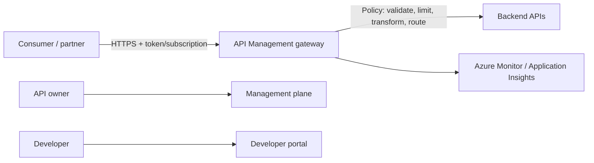

Design decisions:

- public, internal, or hybrid gateway exposure and tier/network support;
- OAuth/OIDC/JWT validation versus subscription keys—keys identify a subscription, not necessarily a human;
- products/subscriptions for consumer packaging;
- versions for breaking contract evolution; revisions for nonbreaking implementation changes;
- policies at global/product/API/operation scope and inheritance;
- rate limits for short-window protection versus quota for longer-period allocation;
- self-hosted gateway when gateway execution must be near hybrid/multicloud back ends, while management remains in Azure;
- multi-region gateway where tier and requirements support it;
- backend authentication with managed identity/certificates rather than embedded secrets.

APIM policies are runtime gateway rules; they are not Azure Policy definitions. APIM is not automatically a web-site WAF or a generic global application accelerator. Compose Front Door/Application Gateway/WAF when those requirements exist.

### Caching

Current Microsoft guidance points new designs to **Azure Managed Redis** and recommends migrating existing Azure Cache for Redis instances. At the review baseline, Azure Cache for Redis Enterprise and Enterprise Flash retire March 31, 2027, while Basic, Standard, and Premium retire September 30, 2028. Validate current feature/region/SKU availability and migration guidance before selecting or moving a cache.

#### Cache-aside

1. Read cache.
2. On miss, read authoritative store.
3. Put result in cache with an appropriate expiration.
4. On update, change the authoritative store and invalidate/update cache according to the consistency design.

| Decision | Questions |
|---|---|
| Cache key | Is it tenant/user/version scoped? Can keys collide or leak data? |
| TTL | How stale may the value be? What is origin cost and update frequency? |
| Invalidation | Who knows the source changed? Delete, update, version, or event-invalidate? |
| Failure | Can the app fall back to the origin? Will all cache misses overload it? |
| Stampede | Can one request populate while peers wait? Is TTL jitter needed? |
| Eviction | What happens under memory pressure? Is cached data disposable? |
| Consistency | Is stale data allowed? Never cache security-sensitive results without an explicit safe design |
| Topology | Local per-instance or shared distributed? Regional/geo requirements? |

Azure Managed Redis provides a low-latency in-memory store and supports cache-aside plus noncache Redis patterns. “Redis is fast” is not enough: select tier, clustering, persistence, zone/geo behavior, network and identity from the workload requirements.

### App Configuration vs Key Vault

| Data | App Configuration | Key Vault |
|---|---|---|
| Non-secret settings | Primary choice | Not intended as general configuration store |
| Feature flags | Native purpose | No |
| Labels/snapshots/central dynamic refresh | Primary choice | No |
| Secret/password | Store a Key Vault reference, not the secret itself | Primary choice |
| Certificate/cryptographic key | No | Primary choice |

Use both: App Configuration centralizes settings and feature flags; Key Vault controls secrets/keys/certificates; managed identity authorizes the workload. Define bootstrap behavior, local caching, refresh, outage fallback, and separation by application/environment.

### Automated deployment architecture

The design includes more than selecting GitHub Actions or Azure Pipelines:

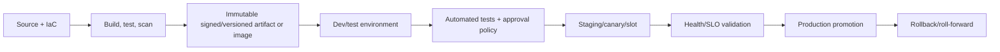

- Use workload identity federation/OIDC for CI systems where supported instead of long-lived deployment secrets.
- Deploy infrastructure with declarative IaC and application artifacts through repeatable pipelines.
- Build once, promote the same immutable artifact.
- Separate environments and permissions; production deployment identity has only required scope.
- App Service slots support warm/validate/swap/rollback for supported apps and tiers.
- Container revisions/canary traffic support progressive validation where the platform provides it.
- Database schema changes need backward-compatible expand/migrate/contract sequencing.
- Monitor deployment health and automate rollback/stop only on meaningful signals.

GitHub Actions is natural when source/workflows and team practices are in GitHub. Azure Pipelines is natural when Azure DevOps repos/boards/approvals/environments and enterprise integration are established. The correct answer comes from repository, compliance, identity, runner/network, approval, artifact, and deployment-target constraints—not brand preference.

### Application architecture scenario

**Requirements:** A web API accepts purchase commands, must respond quickly during spikes, requires ordered processing per customer, publishes shipping notifications, collects high-volume click telemetry, and centralizes flags without storing secrets in configuration.

**Design:** API Management protects and packages the API; the API writes commands to Service Bus using a customer session id; idempotent workers process the queue and dead-letter poison messages; state changes publish discrete events through Event Grid; Event Hubs ingests clickstream; Azure Managed Redis caches safe catalog reads; App Configuration stores settings/flags with Key Vault references; managed identities access services.

**Why not one broker?** Each workload has a different contract: ordered business commands, state-change notification, and replayable stream. **Trade-off:** composition adds operations and correlation; common trace IDs, schema governance, and centralized observability are mandatory.

### What would change the decision?

- Service Bus → Storage Queue if advanced semantics disappear and simple scale/cost dominates.
- Service Bus → Event Hubs if consumers need independent cursor-based replay over a high-volume stream rather than command settlement.
- Event Grid → Service Bus if the producer expects durable command execution with sessions/transactions.
- APIM-only → APIM plus Front Door/WAF if global edge acceleration and web protection are required.
- Managed Redis → no cache if hit ratio is low or data cannot tolerate staleness/sensitive duplication.

**Official Microsoft sources:**

- https://learn.microsoft.com/en-us/azure/service-bus-messaging/compare-messaging-services
- https://learn.microsoft.com/en-us/azure/architecture/guide/technology-choices/messaging
- https://learn.microsoft.com/en-us/azure/service-bus-messaging/service-bus-azure-and-service-bus-queues-compared-contrasted
- https://learn.microsoft.com/en-us/azure/service-bus-messaging/service-bus-message-loss-and-duplicates
- https://learn.microsoft.com/en-us/azure/event-hubs/event-hubs-about
- https://learn.microsoft.com/en-us/azure/event-grid/overview
- https://learn.microsoft.com/en-us/azure/api-management/api-management-key-concepts
- https://learn.microsoft.com/en-us/azure/api-management/api-management-howto-policies
- https://learn.microsoft.com/en-us/azure/redis/overview
- https://learn.microsoft.com/en-us/azure/azure-cache-for-redis/retirement-faq
- https://learn.microsoft.com/en-us/azure/architecture/patterns/cache-aside
- https://learn.microsoft.com/en-us/azure/azure-app-configuration/overview
- https://learn.microsoft.com/en-us/azure/developer/github/
- https://learn.microsoft.com/en-us/azure/app-service/deploy-staging-slots

---

## 4.3 Design network solutions

### Network architecture mental model

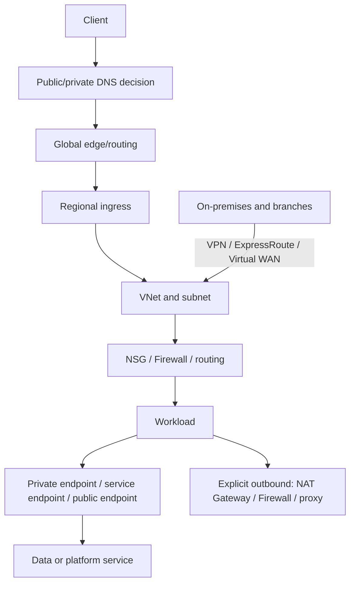

Not every architecture needs every layer. For each arrow specify direction, protocol, trust boundary, DNS name, source/destination address, inspection point, and failure behavior.

### Start with traffic flows

Inventory at least:

- internet inbound to public application;
- application-to-application east/west traffic;
- application outbound to internet/SaaS;
- application to Azure PaaS;
- administration;
- on-premises/branch to Azure and Azure to on-premises;
- multi-region replication and user routing;
- DNS resolution for public and private names;
- telemetry and software-update paths.

A private subnet does not mean “no egress.” A private endpoint does not automatically disable a service’s public endpoint. Peering provides connectivity, not transitive routing or packet inspection by itself.

## Internet connectivity and outbound design

### Inbound

Choose the entry service from traffic layer and scope:

- global HTTP(S) reverse proxy, acceleration/CDN, WAF → Azure Front Door candidate;
- regional HTTP(S)/L7 inside or at a VNet edge, WAF/private frontend needs → Application Gateway candidate;
- regional TCP/UDP pass-through → Azure Load Balancer candidate;
- DNS-based global endpoint selection/direct client connection → Traffic Manager candidate;
- API mediation/products/policies → API Management, often composed with an edge service.

### Outbound

Production outbound needs a deliberate source IP and control path. Candidates include NAT Gateway for scalable SNAT and stable public egress, Azure Firewall for centralized inspection/policy, and platform-specific VNet integration. User-defined routes steer flows. Validate service-specific outbound behavior and avoid depending on default outbound access.

If inbound and outbound share a public IP accidentally, scaling or security changes can break allowlists. Record who owns external allowlists and how failover regions preserve egress identity.

## VNet and topology decisions

### Hub-spoke

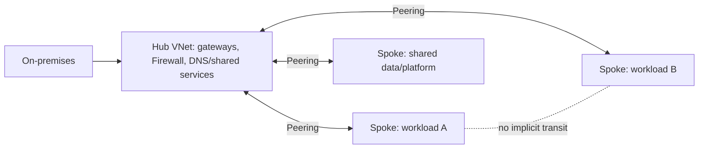

Use hub-spoke to centralize shared connectivity, DNS, inspection, and gateways while isolating workload spokes. Design route propagation and forwarded traffic explicitly. VNet peering is nontransitive: A↔Hub and B↔Hub do not automatically make A↔B communicate. A network virtual appliance/Azure Firewall or gateway/Virtual WAN routing design can provide intended transit.

### Virtual WAN

Virtual WAN provides managed hubs and an integrated operational model for branch, point-to-site, site-to-site VPN, ExpressRoute, VNet transit, routing, and secured hub patterns. It is a strong candidate at large branch/global scale or when managed any-to-any connectivity reduces custom route/peering operations. Traditional hub-spoke can be preferable for smaller topology or bespoke appliance/control requirements. Compare feature, routing, region, security, and cost needs.

### VNet peering vs VPN vs ExpressRoute

| Requirement | VNet peering | VPN Gateway | ExpressRoute |
|---|---|---|---|
| Primary connection | Azure VNet to VNet over Microsoft backbone | Encrypted tunnel for site-to-site, point-to-site, or VNet-to-VNet | Private provider-facilitated circuit from on-premises to Microsoft cloud |
| Internet traversal | No public internet path for peered traffic | IPsec/IKE tunnel normally across public internet | Does not traverse public internet |
| Encryption | Backbone isolation; add app/IPsec encryption when required | Encrypted tunnel | Private connectivity is not the same statement as end-to-end encryption; add encryption if required |
| Best signal | Low-latency Azure network connection | Rapid/cost-conscious hybrid, backup path, remote users | Predictable private enterprise connectivity, higher bandwidth/reliability needs |
| Transitivity | Not transitive | Gateway transit can be designed | Connectivity/routing scope depends on peering/circuit and Global Reach/Virtual WAN design |
| Cost/lead time | Peering data charges and topology operations | Gateway/tunnel with internet dependency | Circuit, provider, gateway, and longer provisioning |

Use VPN and ExpressRoute together when ExpressRoute is primary and VPN is an independent backup path, after designing routing precedence and testing failure. Do not say ExpressRoute is “encrypted” merely because it is private.

### Point-to-site, site-to-site, ExpressRoute

- **Point-to-site:** individual users/devices connect to Azure; remote administration/user access.
- **Site-to-site:** a network appliance connects a site/branch to an Azure VPN gateway.
- **ExpressRoute:** private circuit connects on-premises networks to Microsoft cloud through a provider/peering model.

## PaaS connectivity: public firewall, service endpoint, private endpoint

| Dimension | Public endpoint + firewall | VNet service endpoint | Private endpoint / Private Link |
|---|---|---|---|
| Service address | Public | Public DNS/address remains | Private IP NIC in customer VNet maps to target subresource |
| Network path | Public service endpoint; Azure traffic can remain on backbone depending path | Optimized Azure backbone path from enabled subnet | Microsoft backbone to private-link resource |
| Source identity/control | Public IP/service firewall | VNet/subnet identity in service firewall | Private endpoint connection and private IP/DNS plus target authorization |
| From on-premises | Public endpoint through allowed egress | Service endpoints do not extend to on-premises | Reach private endpoint over VPN/ExpressRoute with correct DNS/routing |
| Exfiltration posture | Broadest public exposure unless restricted | Service remains public-addressed; less exfiltration control | Can use private destination and disable public access; validate policies |
| DNS effort | Normal public DNS | Public DNS unchanged | Private DNS zone/conditional forwarding/split-horizon design required |
| Cost/complexity | Lowest | Simple and generally no endpoint resource cost | Endpoint/DNS/approval and per-subresource complexity |

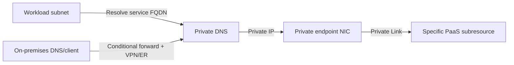

Important private endpoint facts:

- The private endpoint receives a private IP from its VNet and targets a particular service subresource.
- The private-link resource can be in another region; the endpoint belongs to the VNet region.
- Private endpoint creation alone does **not necessarily disable public network access**. Configure the service public-access setting/firewall.
- Different Storage subresources such as blob, file, queue, table, and dfs can need distinct endpoints and DNS zones.
- DNS must return the private address to private clients. Incorrect public/private resolution is the most common architectural failure.
- Network reachability is not authorization. The caller still needs a valid identity/credential and permission.

> **Preview callout:** Current Microsoft documentation describes “standard service endpoint” as Preview. Do not confuse that preview capability with the established VNet service endpoint model or recommend it as GA without validation.

### What would change the decision?

You selected a service endpoint for a simple Azure-subnet restriction. A requirement for on-premises private-IP reachability, disabling public exposure, or stronger exfiltration control pushes to private endpoint. You selected a private endpoint. If the application must access many supported services with minimal DNS/endpoint administration and public-addressed service access is acceptable, a service endpoint may be sufficient.

## DNS architecture

Design public zones, private zones, VNet links, conditional forwarding, on-premises resolvers, failover TTL, and endpoint records together. Azure DNS Private Resolver can provide managed inbound/outbound DNS forwarding between Azure and on-premises; verify ruleset/region design. A network diagram without DNS behavior is incomplete.

For Private Link, clients should continue using the service FQDN; private DNS changes resolution to the endpoint private IP. Avoid hard-coded IPs. Test from each spoke, on-premises network, and failover region.

## Network security responsibilities

| Control | Layer/scope | Primary job | Not a substitute for |
|---|---|---|---|
| NSG | L3/L4 at subnet/NIC | Distributed allow/deny filtering using 5-tuple, service/application security groups | Stateful centralized firewall/application FQDN policy |
| Azure Firewall | Central managed network security | Stateful network/application/NAT policy, threat intelligence, centralized logs; SKU features differ | WAF’s HTTP vulnerability rules or identity authorization |
| WAF | L7 HTTP(S) at Front Door/Application Gateway | Protect web apps from common exploits such as SQL injection and XSS | L3/L4 DDoS plan, general outbound firewall |
| DDoS Protection | L3/L4 volumetric/protocol mitigation for supported public IP/VNet resources | Adaptive network-layer mitigation, analytics and response features by tier | L7 application attack protection |
| Private Endpoint | Private PaaS destination in VNet | Remove need for public destination path and support isolation | Authentication/authorization or a firewall for every flow |
| Bastion | Managed browser/SSH/RDP access path | Administer VMs without public IP/agent/special client in supported modes | JIT role governance, NSGs, endpoint hardening |
| Defender for Cloud | Security posture and workload protection recommendations/alerts | Posture, regulatory views, threat protection plans | Enforcement by itself; pair recommendations with controls |

Defense in depth for an internet application can be: DDoS L3/L4 protection → edge/regional WAF L7 → network segmentation/Firewall/NSG → workload identity/authorization → private data endpoint → encryption/logging. Each layer has a different failure/threat model.

## Load balancing and routing — decisive comparison

| Service | Scope | Traffic decision | Proxy or DNS | TLS / HTTP routing | WAF | Private/internal fit | Best signal | Common wrong choice |
|---|---|---|---|---|---|---|---|---|
| Azure Front Door | Global | L7 HTTP(S), edge routing/acceleration | Reverse proxy on Microsoft global edge | TLS termination, path/host routing, caching/CDN capabilities | Standard/Premium WAF integration | Private origins via Premium Private Link support; client edge is public | Global web app, fast failover, acceleration, WAF | Traffic Manager when request-level proxy/WAF/caching is required |
| Traffic Manager | Global | DNS endpoint selection; any reachable protocol | DNS, client connects directly | No TLS termination or per-request L7 processing | No | Endpoints can be public and certain nested/external patterns; it does not become an internal proxy | Simple global DNS routing, direct connections, non-HTTP protocols | Expecting it to inspect URL paths or terminate TLS |
| Application Gateway | Regional | L7 web traffic based on host/path; current versions also have documented TCP/TLS proxy features | Terminating regional proxy | TLS termination/end-to-end options, host/path routing | WAF_v2 option | Public or private frontend in/for VNet workloads | Regional web ingress, private frontend/backend, WAF | Using it as the global edge by itself, creating a regional SPOF |
| Azure Load Balancer | Regional and cross-region options | L4 TCP/UDP flow distribution | Pass-through network load balancer | No HTTP-aware routing/TLS termination | No | Public or internal frontend | High-performance L4, internal VM/VMSS traffic | Choosing it for URL routing or WAF |
| API Management | Regional/multiregion options by tier | API gateway policies/backends | L7 gateway | API auth, transforms, rate/quota, versioning | Not a general WAF | Internal/external modes by tier | API product/governance/mediation | Buying it solely as a generic load balancer |

### Layer and scope elimination rules

1. Need URL/header/cookie/body-aware behavior? Eliminate an L4-only solution.
2. Need global request proxy, acceleration, CDN, or edge WAF? Front Door is the leading candidate.
3. Need DNS choice with direct client-to-endpoint connection, including non-HTTP? Traffic Manager is a candidate.
4. Need regional web ingress and private VNet back ends/front end? Application Gateway is a candidate.
5. Need regional TCP/UDP or internal VM distribution? Load Balancer is a candidate.
6. Need API subscription/policy/developer lifecycle? APIM is a separate API architecture decision and can sit behind/in front of other layers as documented.

### Composition examples

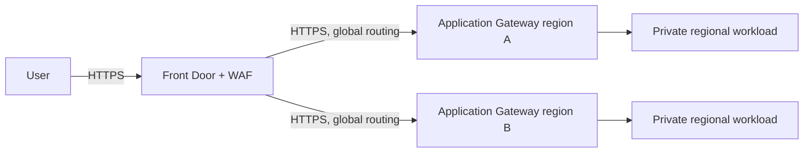

Use Front Door for the global edge and Application Gateway only when regional VNet L7 policy/ingress is also required. Do not add both reflexively.

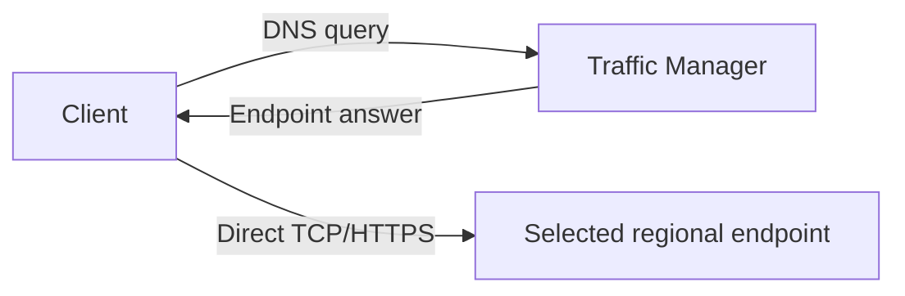

Traffic Manager’s DNS model means existing connections do not pass through it and DNS caching affects failover. This can be exactly right for non-HTTP/global direct connectivity and wrong for request inspection.

## Network performance

- Put compute near users and data; measure round-trip latency and data gravity.
- Use Front Door’s edge/acceleration/CDN capabilities for global web delivery when requirements fit.
- Use peering/backbone paths for Azure networks and ExpressRoute for private hybrid performance requirements.
- Scale gateways/firewalls/load balancers to documented throughput and connection limits; a nominal circuit speed is not end-to-end application throughput.
- Avoid forced-tunneling hairpins and regional single points that route global traffic through one region.
- For high-throughput ExpressRoute to VNet paths, investigate current gateway SKU/FastPath support; verify feature compatibility.
- Use Network Watcher, Connection Monitor, flow logs/current virtual network flow logging guidance, metrics, packet capture, and application telemetry to validate.

**Official Microsoft sources:**

- https://learn.microsoft.com/en-us/azure/networking/fundamentals/networking-overview
- https://learn.microsoft.com/en-us/azure/architecture/reference-architectures/hybrid-networking/hub-spoke
- https://learn.microsoft.com/en-us/azure/virtual-wan/virtual-wan-about
- https://learn.microsoft.com/en-us/azure/vpn-gateway/vpn-gateway-about-vpngateways
- https://learn.microsoft.com/en-us/azure/expressroute/expressroute-introduction
- https://learn.microsoft.com/en-us/azure/virtual-network/virtual-network-peering-overview
- https://learn.microsoft.com/en-us/azure/virtual-network/vnet-integration-for-azure-services
- https://learn.microsoft.com/en-us/azure/private-link/private-endpoint-overview
- https://learn.microsoft.com/en-us/azure/private-link/private-endpoint-dns
- https://learn.microsoft.com/en-us/azure/architecture/guide/technology-choices/load-balancing-overview
- https://learn.microsoft.com/en-us/azure/frontdoor/front-door-overview
- https://learn.microsoft.com/en-us/azure/traffic-manager/traffic-manager-overview
- https://learn.microsoft.com/en-us/azure/application-gateway/overview
- https://learn.microsoft.com/en-us/azure/load-balancer/load-balancer-overview
- https://learn.microsoft.com/en-us/azure/firewall/overview
- https://learn.microsoft.com/en-us/azure/web-application-firewall/overview
- https://learn.microsoft.com/en-us/azure/ddos-protection/ddos-protection-overview
- https://learn.microsoft.com/en-us/azure/bastion/bastion-overview

## 4.4 Design migrations

### Migration is a portfolio decision, not a copy command

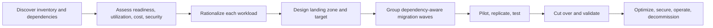

### Current Cloud Adoption Framework migration strategies

Current Microsoft guidance lists eight strategies, sometimes called the Rs:

| Strategy | Meaning | Requirement signal | Trade-off |
|---|---|---|---|
| Retire | Decommission | Low value, redundant, migration cost exceeds benefit | Preserve records/dependencies before removal |
| Retain | Keep in current environment | Stable/compliant; no near-term driver; technical/regulatory dependency | Continued on-premises cost and revisit date |
| Rehost | Move largely as-is | Speed, minimal disruption/change, stable compatible workload | Carries technical debt and operational model |
| Replatform | Move to a managed/container platform with minimal code change | Reduce OS/licensing/HA operations without full redesign | Compatibility changes and platform constraints |
| Refactor | Change code to reduce debt/optimize for cloud | Adopt SDKs/patterns/observability, improve maintainability | Testing and development investment |
| Rearchitect | Change major architecture | Independent scaling, decomposition, new resilience/innovation needs | Distributed-system complexity and largest change risk |
| Rebuild | Build a new cloud-native solution with the same business scope | Legacy is too inflexible/outdated | Long delivery and feature-parity/data-transition risk |
| Replace | Use SaaS/another product | Commodity capability and reduced custom operations | Fit, integration, data portability, vendor dependency |

Do not force every workload into a “6 Rs” memory from older material. Use the current documented set and select per workload component; a solution can rehost one tier and replatform its database.

### Azure Migrate

Azure Migrate is the central migration/modernization hub. Its current journey is described as **Decide → Plan → Execute**.

| Capability | Architect uses it to answer |
|---|---|
| Discovery/inventory | What servers, SQL, web apps, and configurations exist? |
| Dependency analysis | Which processes/servers communicate and must move together? |
| Assessment | Is the source ready for candidate Azure targets? What blockers exist? |
| Right-sizing | What target size follows measured utilization rather than allocated capacity? |
| Cost/business case | What does the target estate plausibly cost and save? |
| Migrate and Modernize | How are supported VMware, Hyper-V, physical/other-cloud servers replicated and cut over? |
| Application and code assessment | What .NET/Java source changes support replatform/modernization? |

An assessment is a point-in-time model based on discovered configuration/performance plus assumptions. Capture a representative business cycle, validate peaks and seasonality, and rerun after the estate changes. Dependency analysis prevents moving a server without its DNS, identity, database, batch, file, or downstream integration.

Current guidance recommends agentless dependency analysis for supported environments. The classic agent-based view is scheduled for deprecation by the end of 2026 and cannot onboard new servers in the current experience; verify before planning.

### IaaS and PaaS migration choices

| Source/constraint | Target candidate | Tool/approach |
|---|---|---|
| VMware/Hyper-V/physical server, minimal change | Azure VM | Azure Migrate discovery/assessment and Migrate and Modernize |
| VMware estate with strong VMware operational dependency | Azure VMware Solution candidate | Assessment/business case; specialized migration tooling; confirm economics |
| ASP.NET web app with supported configuration | App Service candidate | Azure Migrate web app assessment/migration or supported deployment path |
| Containerizable component without Kubernetes dependency | Container Apps/App Service container candidate | Build image/pipeline and functional/nonfunctional validation |
| Kubernetes contract required | AKS candidate | Rearchitect/replatform plan; manifests/data/network/operations migration |
| SQL Server | SQL Database/Managed Instance/SQL VM candidate | Azure Migrate/DMA-style assessment plus DMS/native supported migration |

Cutover plan includes change freeze or continuous replication, final sync, validation, DNS/traffic switch, rollback criteria, stakeholder communication, security/monitoring readiness, and source decommissioning after evidence.

### Database migration

Choose in this order:

1. Source engine/version/edition and exact features.
2. Target service and compatibility gap.
3. Data size/change rate and network path.
4. Downtime tolerance: offline one-time versus online continuous synchronization.
5. Schema, logins/users/jobs/agent features, encryption and keys.
6. Validation: row/count/checksum/business transactions/performance.
7. Cutover, rollback, and post-cutover synchronization.

Azure Database Migration Service is a managed service for supported source-target scenarios and online/minimal-downtime options. Its matrix currently varies: for example, the portal overview lists offline SQL Database migration, online/offline Managed Instance, and online/offline SQL VM scenarios. Do not infer support; check the live supported-scenarios table.

Assessment is separate from transfer. A compatibility report may require remediation before DMS moves data. Login, job, linked server, certificate/key, and application connection changes can be separate workstreams.

### Unstructured data migration

| Requirement | Candidate | Why/check |
|---|---|---|
| Managed large file/object migration, often >1 TB or millions of items; one-time/continuous supported sources | Azure Storage Mover | Managed resilient service and centralized job view; validate source/target/protocol |
| Offline transfer because bandwidth is limited or unavailable | Azure Data Box | Ship appliance and upload to Azure; plan chain of custody, encryption, import time, delta changes |
| Fast one-off/scripted small-to-medium transfer, or service-to-service copy | AzCopy | CLI supports copy/sync to/from/between Storage |
| Windows file server with local cache, cloud tiering, multi-site sync | Azure File Sync | Keeps Windows Server cache with Azure file share |
| Large seed offline plus continuing deltas | Data Box seed + Storage Mover/delta design | Separates bulk baseline from changed data |
| Full server and attached disks | Azure Migrate | Workload/server migration rather than file/object copy |

Current Storage guidance describes AzCopy as typically fitting rapid one-off/incremental jobs under roughly 1 TB and not millions of objects, while Storage Mover handles larger managed scenarios. Treat this as selection guidance, not an immutable hard limit; verify current documentation and test throughput.

Migration execution normally uses initial bulk copy, incremental synchronizations, freeze/cutover, validation, and rollback window. Large numbers of small files can dominate duration. Preserve ACLs, metadata, timestamps, tier, namespace semantics, checksums, and application consistency as required.

### Migration wrong-answer traps

- Rehost is not modernization; it is valid when time/change constraints dominate, followed by an optimization backlog.
- Assessment does not migrate. It finds readiness, sizing, cost, and blockers.
- Database transfer does not prove application compatibility or performance.
- Data Box solves bandwidth by shipping hardware but does not copy changes made after seeding; plan delta sync.
- AzCopy copies data; it does not discover application dependencies.
- A migration is not complete until monitoring, backup, security, operations, rollback, and source retirement are handled.

### Migration “what would change the decision?”

You selected rehost for speed. A requirement to eliminate OS management with modest change can move to replatform; independent scaling and rapid feature evolution can justify rearchitecture. You selected online DMS due to low downtime; a permitted long outage and simpler cutover can favor offline. You selected AzCopy; a no-bandwidth site pushes to Data Box, while a managed million-file continuous migration pushes to Storage Mover.

**Official Microsoft sources:**

- https://learn.microsoft.com/en-us/azure/cloud-adoption-framework/digital-estate/5-rs-of-rationalization
- https://learn.microsoft.com/en-us/azure/migrate/migrate-services-overview
- https://learn.microsoft.com/en-us/azure/migrate/concepts-overview
- https://learn.microsoft.com/en-us/azure/migrate/concepts-dependency-visualization
- https://learn.microsoft.com/en-us/azure/migrate/appcat/overview
- https://learn.microsoft.com/en-us/azure/dms/dms-overview
- https://learn.microsoft.com/en-us/azure/dms/resource-scenario-status
- https://learn.microsoft.com/en-us/azure/storage/common/storage-migration-overview
- https://learn.microsoft.com/en-us/azure/storage/common/storage-use-azcopy-v10
- https://learn.microsoft.com/en-us/azure/databox/data-box-overview

## Domain 4 integrated scenario

**Requirements:** Modernize a public .NET commerce application. It needs global HTTP entry with WAF, regional private back ends, low platform operations, bursty order processing, private SQL access, partner APIs, and regional DR. The team knows containers but does not operate Kubernetes.

**Recommendation:** Front Door Premium/WAF as global L7 edge and regional routing; Container Apps for containerized web/worker components because direct Kubernetes control is not required; API Management for partner API products/policies; Service Bus for order commands; managed identity; SQL PaaS target selected by compatibility; private endpoints plus private DNS; App Configuration/Key Vault; Application Insights/Log Analytics; duplicate regional stamps and data replication/failover matched to RPO/RTO.

**Eliminations:** Traffic Manager lacks the requested HTTP reverse proxy/WAF; AKS adds unjustified cluster operations; ACI lacks the application orchestration features; public SQL firewall does not meet the private endpoint requirement; a single regional Container Apps environment does not provide regional DR.

**Trade-off:** Front Door, APIM, Container Apps, Service Bus, private DNS, and multi-region data create cost and cross-service operations. The requirements—not a desire for a product catalog—justify each layer.

## Domain 4 mini-exam

### Question 18

A team needs container revisions, traffic splitting, service discovery, event-driven scale to zero, and no direct Kubernetes API. What is the leading candidate?

A. Azure Container Instances  
B. Azure Container Apps  
C. AKS  
D. Virtual Machines

<details>
<summary>Answer</summary>

**Correct answer:** B.

**Requirement signal:** Managed Kubernetes-style app features without Kubernetes control plane access.

**Why:** Container Apps supplies revisions, ingress, discovery, and event scale while abstracting Kubernetes APIs.

**Why the alternatives are wrong:** ACI lacks built-in app scaling/LB/revisions; AKS adds direct cluster control/operations not required; VMs add host operations.

**Trade-off:** The abstraction limits native Kubernetes extensibility.

**Official objective:** Recommend a container-based solution.

**Official Microsoft source:** https://learn.microsoft.com/en-us/azure/aks/compare-container-options-with-aks

</details>

### Question 19

A rendering workload consists of 100,000 independent tasks, requires GPU pools, and may use interruptible capacity for retryable tasks. Which compute is the strongest candidate?

A. Azure Batch  
B. Traffic Manager  
C. API Management  
D. Azure Files alone

<details>
<summary>Answer</summary>

**Correct answer:** A.

**Requirement signal:** Large parallel job with pools/tasks and specialized compute.

**Why:** Batch manages pools, jobs, task scheduling, autoscale, and supported VM types.

**Why the alternatives are wrong:** The others provide routing/API/file services, not batch scheduling.

**Trade-off:** Design data staging, pool startup, retries/checkpoints, quota, and result retention.

**Official objective:** Recommend a compute solution for batch processing.

**Official Microsoft source:** https://learn.microsoft.com/en-us/azure/batch/batch-service-workflow-features

</details>

### Question 20

A producer sends business commands that must be processed FIFO per customer and duplicates from send retries should be detected. What should be used?

A. Event Grid  
B. Event Hubs  
C. Service Bus with sessions and duplicate detection  
D. Traffic Manager

<details>
<summary>Answer</summary>

**Correct answer:** C.

**Requirement signal:** Enterprise commands, per-key ordering, duplicate send handling.

**Why:** Service Bus sessions provide FIFO per session and duplicate detection handles repeated MessageId values in its window.

**Why the alternatives are wrong:** Event Grid does not guarantee order; Event Hubs is a stream and does not provide broker duplicate detection/transactions; Traffic Manager is DNS routing.

**Trade-off:** Consumers remain idempotent because lock loss/redelivery can repeat processing.

**Official objective:** Recommend a messaging architecture.

**Official Microsoft source:** https://learn.microsoft.com/en-us/azure/service-bus-messaging/compare-messaging-services

</details>

### Question 21

Millions of telemetry events per second must be retained for several consumers that independently replay from offsets. Which service fits?

A. Service Bus queue  
B. Event Hubs  
C. Event Grid  
D. Azure Policy

<details>
<summary>Answer</summary>

**Correct answer:** B.

**Requirement signal:** High-throughput replayable event stream and independent cursors.

**Why:** Event Hubs exposes partitioned streams, consumer groups, retention/replay and capture integration.

**Why the alternatives are wrong:** A settled queue is not a replay log for independent consumers; Event Grid routes discrete events; Policy governs resources.

**Trade-off:** Partition key, count, checkpointing, retention, and consumer reprocessing must be designed.

**Official objective:** Recommend an event-driven architecture.

**Official Microsoft source:** https://learn.microsoft.com/en-us/azure/architecture/guide/technology-choices/messaging

</details>

### Question 22

External partners need API onboarding, subscriptions, JWT validation, quotas, transformations, and analytics. What is the primary service?

A. Azure API Management  
B. Azure Load Balancer  
C. Azure Bastion  
D. Azure Batch

<details>
<summary>Answer</summary>

**Correct answer:** A.

**Requirement signal:** API product and gateway lifecycle/policy requirements.

**Why:** APIM supplies gateway policies, products/subscriptions, developer portal, and API analytics/management.

**Why the alternatives are wrong:** They provide L4 traffic distribution, VM administration, and batch scheduling.

**Trade-off:** Tier/network topology, policy complexity, and gateway availability must be designed; add WAF/global edge separately if needed.

**Official objective:** Recommend a solution for API integration.

**Official Microsoft source:** https://learn.microsoft.com/en-us/azure/api-management/api-management-key-concepts

</details>

### Question 23

A global public web application needs HTTP reverse proxying, path routing, TLS termination, acceleration, and WAF. Which service is the leading entry layer?

A. Traffic Manager  
B. Azure Front Door  
C. Azure Load Balancer  
D. VNet peering

<details>
<summary>Answer</summary>

**Correct answer:** B.

**Requirement signal:** Global L7 web delivery, acceleration, and WAF.

**Why:** Front Door is a global HTTP(S) reverse proxy/CDN and supports the requested L7 capabilities and WAF.

**Why the alternatives are wrong:** Traffic Manager is DNS/direct connection; Load Balancer is L4; peering connects VNets.

**Trade-off:** Restrict origins, preserve host names as required, and design regional back-end health/capacity.

**Official objective:** Recommend a load-balancing and routing solution.

**Official Microsoft source:** https://learn.microsoft.com/en-us/azure/architecture/guide/technology-choices/load-balancing-overview

</details>

### Question 24

A regional private web application needs URL-path routing and WAF in its VNet. Which service is the leading candidate?

A. Internal Azure Load Balancer  
B. Application Gateway WAF  
C. Traffic Manager  
D. NAT Gateway

<details>
<summary>Answer</summary>

**Correct answer:** B.

**Requirement signal:** Regional private L7 routing plus WAF.

**Why:** Application Gateway operates regionally at L7, supports private frontends/backends and WAF tiers.

**Why the alternatives are wrong:** Load Balancer lacks HTTP path/WAF; Traffic Manager is global DNS; NAT Gateway is outbound SNAT.

**Trade-off:** Size/autoscale, zone redundancy, certificates, health probes, and backend TLS must be managed.

**Official objective:** Recommend network security and load balancing/routing.

**Official Microsoft source:** https://learn.microsoft.com/en-us/azure/application-gateway/overview

</details>

### Question 25

On-premises clients must reach Azure SQL through a private IP over ExpressRoute, and public SQL access must be disabled. What should be added?

A. VNet service endpoint only  
B. Private endpoint plus private DNS resolution from on-premises  
C. Public IP allowlist only  
D. Traffic Manager

<details>
<summary>Answer</summary>

**Correct answer:** B.

**Requirement signal:** PaaS private IP reachable from on-premises and no public exposure.

**Why:** Private Link maps the service to a private endpoint NIC; hybrid routing and DNS make the FQDN resolve/reach it.

**Why the alternatives are wrong:** Service endpoints do not extend to on-premises and retain public service addressing; public allowlist violates the requirement; Traffic Manager is DNS routing, not Private Link.

**Trade-off:** Private DNS zones/forwarding, endpoint approval, subresource endpoints, and public-access settings add operations.

**Official objective:** Recommend connectivity and optimize network security.

**Official Microsoft source:** https://learn.microsoft.com/en-us/azure/private-link/private-endpoint-overview

</details>

### Question 26

An enterprise requires private provider connectivity from its datacenter to Azure that does not traverse the public internet. Which service is the primary candidate?

A. Point-to-site VPN  
B. ExpressRoute  
C. VNet service endpoint  
D. Azure Front Door

<details>
<summary>Answer</summary>

**Correct answer:** B.

**Requirement signal:** Private provider-facilitated hybrid circuit avoiding public internet.

**Why:** ExpressRoute extends on-premises networks to Microsoft cloud over a private connection.

**Why the alternatives are wrong:** P2S serves individual clients over VPN; service endpoint is subnet-to-PaaS; Front Door is public global web entry.

**Trade-off:** Provider/circuit/gateway cost and lead time; add encryption if the requirement demands it and test a backup path if required.

**Official objective:** Recommend connectivity to on-premises networks.

**Official Microsoft source:** https://learn.microsoft.com/en-us/azure/expressroute/expressroute-introduction

</details>

### Question 27

A site has insufficient bandwidth for the initial 100-TB object migration. After seeding, it needs to synchronize changes before cutover. What is the best architecture candidate?

A. Data Box for the seed plus a supported online delta synchronization approach  
B. Event Grid only  
C. Traffic Manager nested profile  
D. One App Service deployment slot

<details>
<summary>Answer</summary>

**Correct answer:** A.

**Requirement signal:** Very large offline baseline and continuing source changes.

**Why:** Data Box addresses bandwidth-limited bulk transfer; delta sync closes the change window before cutover.

**Why the alternatives are wrong:** The other services do not perform bulk/delta storage migration.

**Trade-off:** Chain of custody, encryption, shipping/import duration, delta tool compatibility, checksums, and final freeze must be planned.

**Official objective:** Recommend a solution for migrating unstructured data.

**Official Microsoft source:** https://learn.microsoft.com/en-us/azure/storage/common/storage-migration-overview

</details>

### Question 28

An Azure Migrate assessment recommends small VM sizes based on one week of data, but the application closes its financial year next month. What should the architect do?

A. Accept the sizes because all assessments are guarantees  
B. Collect representative peak/seasonal data, update assumptions, and rerun/validate the assessment  
C. Ignore dependencies and move each VM alone  
D. Replace the assessment with a resource lock

<details>
<summary>Answer</summary>

**Correct answer:** B.

**Requirement signal:** Nonrepresentative performance sample and known seasonal peak.

**Why:** Assessments are point-in-time calculations based on collected data and settings; representative evidence is needed for rightsizing.

**Why the alternatives are wrong:** Assessment is not a guarantee; ignoring dependencies creates outage risk; locks do not size workloads.

**Trade-off:** Longer observation delays the project but reduces sizing and reliability risk.

**Official objective:** Evaluate on-premises servers, data, and applications for migration.

**Official Microsoft source:** https://learn.microsoft.com/en-us/azure/migrate/concepts-overview

</details>

---

# Azure Architecture Service Decision Matrix

This is the master decision guide. “Recommended” means “leading candidate under the stated constraints,” never a universal answer.

# AZ-305 Master Decision Guide

## Compute

| Requirement | Recommended candidate | Why | Alternatives | What would change the decision? |
|---|---|---|---|---|
| Full OS, agent, driver, exact legacy host | VM/VMSS | Maximum guest control | App Service, containers | Remove host dependency → managed PaaS |
| Managed web/API on supported stack | App Service | Web-optimized managed platform | Container Apps, AKS, Functions | Event-triggered short code → Functions; microservice container revisions → Container Apps |
| Serverless containers/microservices without Kubernetes API | Container Apps | Managed ingress, revisions, discovery, KEDA/Dapr integration | ACI, AKS | Native Kubernetes control/CRDs/operators → AKS |
| Kubernetes API/ecosystem is mandatory | AKS | Managed Kubernetes with direct API | Container Apps | No Kubernetes-specific requirement → Container Apps reduces operations |
| One/few isolated container groups or tasks | ACI | Simple container building block | Container Apps jobs, Batch | Scaling/revisions/app platform → Container Apps; large parallel pools → Batch |
| Triggered short-lived code and bindings | Functions | Event-driven serverless execution | Logic Apps, Container Apps | Connector/workflow-first → Logic Apps; long/custom container → Container Apps/App Service |
| Massive parallel job/pool/task workload | Azure Batch | Pool and task scheduling/HPC | Container Apps jobs, VMSS scheduler | Small scheduled container → Container Apps job; unique scheduler/host need → VMSS |

## Data

| Requirement | Recommended candidate | Why | Alternatives | What would change the decision? |
|---|---|---|---|---|
| Modern managed SQL database | Azure SQL Database | Database PaaS, built-in operations | Managed Instance, SQL VM | Instance feature → MI; OS access → SQL VM |
| High SQL Server instance compatibility, no OS | SQL Managed Instance | Instance-like PaaS | SQL Database, SQL VM | Database-only modern app → SQL DB; host/agent → SQL VM |
| Exact SQL/OS control | SQL Server on Azure VM | Full guest/engine administration | MI | Remove OS dependency and pass assessment → MI/SQL DB |
| Managed PostgreSQL engine | PostgreSQL Flexible Server | PaaS PostgreSQL with HA/read/backup choices | PostgreSQL VM | Extension/OS requirement unsupported by PaaS → VM |
| Global partitioned JSON operations | Cosmos DB | Distributed NoSQL, consistency and global models | Table Storage, SQL JSON | Simple key/attribute and cost focus → Table; relational transactions/joins → SQL |
| Object/binary content | Blob Storage | Massive object store/tiering | Files, Data Lake | Mounted protocol → Files; hierarchical analytics → ADLS capabilities |
| Shared SMB/NFS | Azure Files | Managed file shares | NetApp Files, Blob | Demanding enterprise NAS feature/performance → NetApp Files |
| VM block device | Managed disks | VM-attached block storage | Elastic SAN, Files | Shared SAN across compute → evaluate Elastic SAN; shared filesystem → Files/NetApp |
| Distributed low-latency cache | Azure Managed Redis | Managed in-memory Redis | Local cache | Single instance and no sharing → local; stale/sensitive data unacceptable → no cache |

## Messaging, events, API, and configuration

| Requirement | Recommended candidate | Why | Alternatives | What would change the decision? |
|---|---|---|---|---|
| Durable business command, DLQ, sessions/transactions | Service Bus | Enterprise broker semantics | Storage Queue | Simple queue without advanced semantics → Storage Queue |
| Simple durable queue at Storage scale/model | Storage Queue | Simple at-least-once queue | Service Bus | FIFO/session/topic/transaction/DLQ → Service Bus |
| Discrete state-change routing | Event Grid | Reactive event distribution | Service Bus, Event Hubs | Required business work contract → Service Bus; replayable telemetry → Event Hubs |
| High-volume replayable stream | Event Hubs | Partitioned log, consumer groups, replay/capture | Event Grid | Discrete notification only → Event Grid; command settlement → Service Bus |
| API products, auth policy, rate/quota, transforms | API Management | API gateway lifecycle and policy | Front Door, Application Gateway | Only web routing/WAF → edge/L7 load balancer; no governance/mediation → direct gateway may suffice |
| Settings and feature flags | App Configuration | Central configuration, labels/flags/refresh | Key Vault | Secret/key/certificate → Key Vault |
| Secret, key, certificate | Key Vault | Protected object lifecycle and authorization | Managed HSM | Single-tenant high-value HSM-only keys → Managed HSM |

## Network

| Requirement | Recommended candidate | Why | Alternatives | What would change the decision? |
|---|---|---|---|---|
| Global HTTP proxy, acceleration, WAF | Front Door | Global L7 edge/CDN | Traffic Manager | DNS/direct client or non-HTTP → Traffic Manager |
| Global DNS endpoint selection | Traffic Manager | DNS routing for reachable endpoints | Front Door | Per-request L7/TLS/WAF/caching → Front Door |
| Regional VNet HTTP path routing/WAF | Application Gateway | Regional L7/private/public frontend | Load Balancer | TCP/UDP only → Load Balancer |
| Regional/internal TCP/UDP | Load Balancer | L4 pass-through | Application Gateway | HTTP-aware routing/WAF → Application Gateway |
| Stable scalable public outbound | NAT Gateway | Explicit SNAT | Firewall | Central inspection/FQDN/application rules → Firewall |
| Central stateful network/app policy | Azure Firewall | Managed inspection/policy/NAT | NSG/NVA | Simple local 5-tuple filtering → NSG |
| Subnet/NIC L3/L4 segmentation | NSG | Distributed traffic rules | Firewall | Central cross-network/application policy → Firewall |
| Private PaaS IP from Azure/on-premises | Private Endpoint | Private Link NIC and address | Service endpoint | Azure subnet only, public service address acceptable → service endpoint |
| Fast encrypted hybrid start/backup | VPN Gateway | IPsec tunnel | ExpressRoute | Private provider circuit, bandwidth/predictability → ExpressRoute |
| Private enterprise hybrid circuit | ExpressRoute | Avoids public internet | VPN | Cost/lead time dominates → VPN; still consider VPN backup |
| Many branches/global managed transit | Virtual WAN | Managed hubs/routing/connectivity | Customer-managed hub-spoke | Small/bespoke topology → hub-spoke |

## Identity, governance, and monitoring

| Requirement | Recommended candidate | Why | Alternatives | What would change the decision? |
|---|---|---|---|---|
| Azure workload without stored credentials | Managed identity | Entra token without app-managed secret | Service principal secret/cert | Workload outside supported Azure host → workload federation/service principal |
| Azure resource permission | Azure RBAC | Principal × role × scope | Entra role | Directory object administration → Entra role |
| Resource-state compliance | Azure Policy/initiative | Evaluate/enforce/remediate | RBAC | Need to grant a person actions → RBAC |
| JIT privileged role | PIM | Eligible/time-bound/approved activation | Permanent role | No privilege and ordinary standing access → normal RBAC/group assignment |
| Recertify access | Access reviews | Periodic decision/removal | PIM | Requestable access package with expiry → entitlement management |
| Interactive KQL logs | Log Analytics | Central log tables and analysis | Storage archive | Rare long-term archive → Storage/long-term retention |
| Application performance/traces | Application Insights | APM and OpenTelemetry-based server collection | Resource logs | Infrastructure-only metrics/logs → Monitor resource signals |
| Route resource logs | Diagnostic settings | Sends resource logs/metrics/Activity Log to destinations | Data export | Export new workspace table records after ingestion → Log Analytics data export |

## HA/DR and migration

| Requirement | Recommended candidate | Why | Alternatives | What would change the decision? |
|---|---|---|---|---|
| Zone-resilient Storage primary | ZRS/GZRS family | Synchronous cross-zone copies | LRS | Lowest cost/reconstructable data → LRS |
| Regional durability + primary zone resilience | GZRS | ZRS primary plus async secondary | GRS | No primary zone requirement → GRS; read secondary → RA-GZRS |
| VM regional replication/failover orchestration | Site Recovery | Replication, test failover, failback, plans | Backup restore | Long RTO/cold recovery acceptable → backup/redeploy |
| Historical recovery from deletion | Backup/PITR/version | Recovery point before corruption | HA replica | Need service continuity during node failure → HA as separate layer |
| Inventory/readiness/rightsize/dependencies | Azure Migrate | Central discovery/assessment | Manual spreadsheet | Source not supported or code-deep need → supplement with app/code/specialist assessment |
| Supported low-downtime database movement | DMS/native online migration | Continuous sync/minimal downtime | Offline transfer | Long downtime permitted or pair unsupported → offline/native/partner path |
| Offline huge data | Data Box | Physical transfer | AzCopy/Storage Mover | Network adequate and continuous → online tool |
| Managed large online file/object migration | Storage Mover | Managed scalable jobs | AzCopy | Small scripted one-off → AzCopy |

---

# AZ-305 — If You See X, Think Y

Use this only to generate a candidate. Always read “Check before selecting.”

| Requirement signal | Candidate | Why | Check before selecting |
|---|---|---|---|
| Directory users/groups/domains | Microsoft Entra role | Directory administration plane | Administrative unit/object scope and least privilege |
| Azure resource action at scope | Azure RBAC | ARM/data role assignment | DataAction vs Action; smallest scope |
| Prevent disallowed region/SKU | Azure Policy `deny` | Resource compliance enforcement | Exemptions and rollout impact |
| Deploy diagnostic setting everywhere | Policy `deployIfNotExists` | Related configuration remediation | Managed identity permissions and remediation task |
| JIT administrator | PIM | Eligible role activation | Licensing, approval, emergency access |
| Partner workforce collaboration | Entra B2B pattern | External organization identity | Cross-tenant settings and lifecycle |
| No workload secret | Managed identity | Token without stored credential | Service support and target role |
| Central settings/feature flags | App Configuration | Dynamic configuration service | Bootstrap/cache/outage behavior |
| Secret/certificate/key | Key Vault | Protected material lifecycle | RBAC/network/deletion protection |
| KQL across resource logs | Log Analytics | Queryable log tables | Residency, access, retention, cost |
| APM/request dependency trace | Application Insights | Application observability | Sampling, instrumentation, correlation |
| Stream logs to external SIEM | Event Hubs destination | Streaming integration | Throughput, security, downstream ownership |
| SQL DB modern PaaS | Azure SQL Database | Lowest database platform operations | Compatibility/tier/region |
| SQL instance features, PaaS | Managed Instance | Instance-like compatibility | Exact blockers and network |
| OS access for SQL | SQL VM | Full control | HA/backup/patching ownership |
| Noncoincident tenant database peaks | Elastic pool | Shared capacity | Per-DB and pool limits |
| Large/rapid-growth SQL with read replicas | Hyperscale candidate | Separated compute/storage architecture | Limitations and replica cost |
| Intermittent SQL workload | Serverless compute candidate | Automatic compute scaling/use billing | Resume latency and supported tier |
| Global JSON + tunable consistency | Cosmos DB | Distributed NoSQL | Partition key, RU, conflicts |
| Read your own writes per client | Session consistency | Session guarantee | Session token flow |
| Shared SMB/NFS | Azure Files | Managed file protocol | Performance/identity/backup |
| Object/archive/lifecycle | Blob Storage | Object tiers/lifecycle | Retrieval latency and early deletion |
| Analytics hierarchy | Data Lake Storage | Hierarchical namespace | Actual analytics need and compatibility |
| Zone failure, one region | ZRS | Synchronous zone copies | Service/region support |
| Region failure plus primary zones | GZRS | Zone primary + geo copy | Async RPO; failover |
| Read geo-secondary before failover | RA-GRS/RA-GZRS | Secondary endpoint | Stale reads and application routing |
| Scheduled copy/orchestration | Data Factory | Pipeline/control flow | Integration runtime/network |
| Spark notebooks/engineering | Databricks candidate | Managed Spark ecosystem | Skills, governance, cost |
| SQL + Spark + pipelines workspace | Synapse candidate | Integrated analytics | Workload fit and Fabric alternative |
| Windowed stream analytics | Stream Analytics | Managed stream query | Event ordering/late data/state |
| Instance/zone live service | HA | Redundancy/failover | Every dependency and health |
| Regional recovery | DR | Secondary region/runbook | RPO, RTO, capacity, routing |
| Deleted/corrupt data | Backup/PITR/version | Historical recovery | Restore granularity and test |
| VM failover order/runbooks | ASR recovery plan | Orchestrates multi-VM recovery | Non-VM dependencies |
| Managed web/API | App Service | Web PaaS | Plan sharing, scale, network |
| Serverless event function | Functions | Triggered scaling | Plan/cold start/duration/network |
| Container revisions + scale to zero | Container Apps | Managed serverless app platform | Direct Kubernetes need |
| Kubernetes API/CRD/operator | AKS | Kubernetes contract | Team operations and platform design |
| One container task | ACI | Simple group building block | Scaling/LB/revision needs |
| Parallel pool/job/tasks | Batch | Batch scheduler | Data staging/quota/retry |
| Ordered commands per entity | Service Bus sessions | FIFO within session | Partition/session key and idempotency |
| Simple durable queue | Storage Queue | Simple at-least-once queue | Need DLQ/topics/transactions? |
| State-change fan-out | Event Grid | Discrete event routing | Ordering/command/replay need |
| Telemetry replay by consumers | Event Hubs | Partitioned retained stream | Partition and checkpoint design |
| API products/policies/quotas | APIM | API lifecycle gateway | WAF/global edge separately |
| Distributed cache | Azure Managed Redis | Shared in-memory performance | Staleness, failure, clustering |
| Global web WAF/acceleration | Front Door | Global L7 edge | Origin security and private-link tier |
| Global DNS/direct connection | Traffic Manager | DNS routing | TTL and no L7 proxy |
| Regional web WAF/private frontend | Application Gateway | Regional L7 | Global route if multiregion |
| TCP/UDP regional/internal | Load Balancer | L4 distribution | No HTTP features |
| Individual remote user to VNet | Point-to-site VPN | Client VPN | Auth/protocol and scale |
| Branch to VNet over encrypted internet | Site-to-site VPN | IPsec/IKE | Bandwidth/reliability |
| Private hybrid circuit | ExpressRoute | Provider connection | Encryption and backup path |
| Private IP to PaaS | Private Endpoint | Private Link | DNS and public access disablement |
| Azure subnet restriction, public PaaS address okay | Service endpoint | Backbone/subnet identity | On-premises reach and exfiltration |
| L3/L4 volumetric attack | DDoS Protection | Network-layer mitigation | WAF for L7 |
| SQL injection/XSS | WAF | HTTP exploit rules | DDoS/network firewall still separate |
| Current estate and dependencies | Azure Migrate | Discover/assess | Representative data window |
| Minimal-change move | Rehost | Fast relocation | Optimization backlog |
| Minimal code, managed platform | Replatform | Removes platform operations | Compatibility test |
| No bandwidth for bulk data | Data Box | Offline appliance | Delta synchronization |

---

# Architecture patterns that improve design reasoning

Use a pattern only when its forces exist. Every pattern introduces failure modes and operating work.

| Pattern | Use when | Azure composition example | Trade-off / trap |
|---|---|---|---|
| Retry | Fault is transient | SDK retry to Storage/SQL with backoff/jitter | Retrying nontransient or nonidempotent work amplifies failure |
| Circuit Breaker | A dependency is persistently unhealthy | App policy opens and uses degraded response/cache | State/tuning/half-open tests add complexity |
| Cache-Aside | Repeated reads tolerate controlled staleness | App + Managed Redis + SQL | Invalidation and stampede |
| Queue-Based Load Leveling | Producer bursts exceed consumer capacity | API → Service Bus → autoscaled workers | Queue delay; DLQ/idempotency needed |
| Competing Consumers | Work can be processed in parallel | Worker fleet drains queue | Ordering must be partitioned/session-scoped |
| Publisher/Subscriber | Multiple consumers need independent delivery | Service Bus topic subscriptions or event service by intent | Do not confuse commands, events, streams |
| Transactional Outbox | DB change and message publication must not diverge | Commit entity + outbox, relay to broker | Eventual publication, cleanup, dedupe |
| Saga / Compensating Transaction | Distributed workflow spans services | Durable workflow/messages + domain compensation | Compensation cannot always reverse real-world effects |
| CQRS | Read/write models have different scale/shape | Commands to write model; projections/cache/read DB | Eventual consistency and duplicate model operations |
| Event Sourcing | Immutable event history is the source of truth | Event store + projections | Schema evolution, rebuild, privacy/deletion complexity |
| Sharding | One store/partition cannot meet scale/isolation | Tenant routed among SQL databases/Cosmos partitions | Rebalancing and cross-shard query/transaction complexity |
| Bulkhead | Tenants/dependencies need blast-radius isolation | Separate pools/plans/stamps/queues | Lower utilization and more management |
| Deployment Stamp | Repeatable regional/tenant scale unit | Front Door → independent regional stamps | Routing/data placement/version orchestration |
| Strangler Fig | Incremental legacy replacement | Gateway routes selected functions to new services | Dual-system consistency and long transition risk |
| Gateway Aggregation | Client needs one response from services | APIM/backend-for-frontend aggregates | Gateway becomes latency/failure hotspot |
| Gateway Offloading | Common cross-cutting request work | Front Door/APIM handles TLS/auth/limits | Do not move domain authorization into generic edge policy blindly |
| Valet Key | Client needs scoped direct object access | Short-lived least-privileged SAS to Blob | Token leakage, expiry, revocation, scope |
| Health Endpoint Monitoring | Router/operations needs semantic health | Probe verifies critical dependency flow | Deep probes can overload dependencies; shallow probes lie |
| Throttling | Demand must be bounded before saturation | APIM rate limit + app concurrency limit | Cache does not replace peak protection |
| Static Content Hosting/CDN | Large public immutable assets | Blob/static hosting + Front Door | Cache invalidation and private content rules |

## Reliability pattern sequence

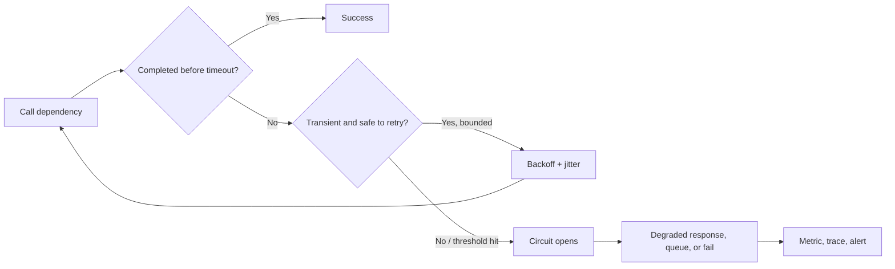

Retries, timeouts, circuit breakers, and bulkheads must be tuned together. Independent unbounded retry layers create multiplicative retry storms.

**Official Microsoft sources:**

- https://learn.microsoft.com/en-us/azure/architecture/patterns/
- https://learn.microsoft.com/en-us/azure/architecture/patterns/cache-aside
- https://learn.microsoft.com/en-us/azure/architecture/patterns/queue-based-load-leveling
- https://learn.microsoft.com/en-us/azure/architecture/patterns/circuit-breaker
- https://learn.microsoft.com/en-us/azure/architecture/patterns/compensating-transaction
- https://learn.microsoft.com/en-us/azure/architecture/patterns/deployment-stamp
- https://learn.microsoft.com/en-us/azure/architecture/patterns/throttling

---

# Architecture Decision Record

Use this short format for a durable decision:

```markdown
# ADR-NNN: Decision title

## Context
Business flow, current state, stakeholders, and why a decision is needed.

## Requirements and constraints
Functional requirements; SLO/RPO/RTO; security/compliance; data; scale; budget; skills; migration limits.

## Options considered
For each option: fit, documented boundary, cost drivers, risks, and operational ownership.

## Decision
Selected option, scope, and date.

## Rationale
Which requirements eliminate the alternatives.

## Trade-offs and consequences
Benefits gained, qualities reduced, new operations, and technical debt.

## Risks and mitigations
Risk, owner, mitigation, trigger, contingency.

## Validation and review
Tests/metrics that prove the decision and the date/condition that reopens it.
```

### Example: Container Apps instead of AKS

**Context:** Eight stateless APIs/workers packaged as containers; queue-driven scale; no Kubernetes operators or CRDs; small platform team.

**Requirements:** Revisions, traffic split, service discovery, scale to zero, private dependencies, managed identity, zone/regional strategy.

**Options:** App Service containers, Container Apps, AKS.

**Decision:** Container Apps per regional deployment stamp.

**Rationale:** It supplies the requested application features while avoiding direct cluster operations. AKS’s unique Kubernetes capabilities are not requirements.

**Trade-offs:** Native Kubernetes API/control and some networking extensions are unavailable. The team accepts platform constraints for lower operational burden.

**Risk:** A future vendor requires an operator. **Mitigation:** Keep images portable and reopen the ADR if a CRD/operator becomes mandatory.

**Validation:** Load/scale test, revision rollback, private DNS, queue drain, regional failover, and cost per demand profile.

---

# Cross-domain case studies

## Case study 1 — Global retailer modernization

### Company context and current environment

Northwind Outfitters sells in 18 countries. Its ASP.NET commerce application runs on eight IIS VMs and one SQL Server cluster in a private datacenter. Order submission is synchronous: the web request calls inventory, payment, email, and warehouse systems before returning. Static product media shares the web-server disk. Operators inspect local log files. Two annual sales cause tenfold traffic spikes.

### Requirements and constraints

- Public web traffic needs global acceleration, HTTP path routing, TLS, and WAF.
- A single availability-zone failure must not stop checkout.
- Regional disaster RTO is 30 minutes; the business accepts a documented nonzero RPO of five minutes for analytics but requires tighter order recovery determined by database capabilities.
- PaaS data endpoints must use private IP connectivity from workloads and on-premises.
- The API must respond quickly during bursts; downstream warehouse processing may finish asynchronously.
- Order processing must preserve order per customer and tolerate retries without duplicate fulfillment.
- Product media is read-heavy and can use edge caching.
- The team knows .NET and containers but has no Kubernetes operations team.
- Migration must occur in stages, with no big-bang rewrite.

### Decision derivation

1. **Migration strategy:** Discover servers and dependencies with Azure Migrate. Replatform the IIS front end in stages while retaining/rehosting unready dependencies. Use the Strangler Fig pattern at the routing/API boundary.
2. **Global entry:** Front Door with WAF fits global HTTP proxy, acceleration, TLS, path/host routing, caching, and health-based regional routing. Traffic Manager is inferior because request traffic does not traverse a DNS router and it cannot provide the requested WAF/L7 behavior.
3. **Regional compute:** Container Apps is the leading candidate for APIs/workers: container deployment, revisions, traffic split, and queue/event scaling without direct Kubernetes API. AKS is unjustified until a native Kubernetes requirement appears.
4. **Order integration:** Put an accepted order command on Service Bus. Use sessions only for the entity whose order must be preserved, stable message/business IDs, PeekLock settlement, idempotent writes, and a monitored DLQ.
5. **Data:** Assess SQL compatibility. Prefer SQL Database for database-scoped modern needs; use Managed Instance if instance dependencies remain. Select tier, zone redundancy, geo-recovery, and backup from measured performance and recovery targets.
6. **Media:** Blob Storage with suitable access tier, redundancy, lifecycle, and Front Door caching. Do not mount VM disks as global media storage.
7. **Private connectivity:** Private endpoints for SQL/Storage where required, public access disabled, regional private DNS linked to spokes, and on-premises conditional forwarding over VPN/ExpressRoute.
8. **Identity:** User-assigned managed identities for stable, preauthorized workload identities; least-privileged data-plane roles; Key Vault for certificates/secrets that cannot be eliminated.
9. **Observability:** Application Insights traces across API/message workers, diagnostic settings to Log Analytics, business metrics such as accepted-to-fulfilled latency, and owned action groups.
10. **Continuity:** Duplicate regional application stamps, sufficient surviving capacity, global health routing, database-specific failover, and tested regional evacuation. Backup/PITR remains separate from replication.

```mermaid
flowchart LR
    User -->|HTTPS| FD[Front Door + WAF]
    FD -->|HTTPS| APIA[Container Apps API - region A]
    FD -->|HTTPS failover/active traffic| APIB[Container Apps API - region B]
    FD -->|Cached HTTPS| Blob[Blob product media]
    APIA -->|Managed identity + private endpoint| SQLA[SQL primary]
    APIB -->|Managed identity + private endpoint| SQLB[SQL geo target]
    APIA -->|Order command| SB[Service Bus]
    Worker[Container Apps worker] -->|PeekLock consume| SB
    Worker -->|Idempotent fulfillment| SQLA
    APIA --> AppI[Application Insights]
    Worker --> AppI
    SQLA -. service-specific replication .-> SQLB
```

### Trade-offs and validation

The solution has more managed components than the VM monolith, so correlation IDs, schema ownership, cost allocation, and runbooks become essential. Validate with sales-peak load tests, Service Bus redelivery and DLQ tests, private DNS checks from every network, slot/revision rollback, zone-failure drills, database recovery, and regional evacuation.

### What would change the decision?

- A hard operator/CRD/service-mesh requirement would reopen Container Apps versus AKS.
- A database feature requiring OS access would push the data target to SQL Server on VM.
- Direct non-HTTP global client connectivity would introduce Traffic Manager or another protocol-specific solution.

## Case study 2 — Regulated manufacturer hybrid platform

### Company context and current environment

Contoso Manufacturing operates 70 plants. Each plant has AD DS, Windows file servers, SQL Server, and production equipment that cannot tolerate internet-dependent authentication. Headquarters has an existing WAN provider. Security wants central policy and monitoring; plant data has country-specific residency requirements.

### Requirements and constraints

- Azure and on-premises identities must be unified, but plant authentication must continue through a cloud outage.
- Administrators need time-bound privilege; vendors need expiring project access.
- Each country’s logs and production data must remain in an approved geography.
- Plants require predictable private connectivity; a lower-cost backup path is required.
- Legacy SMB applications initially move without code changes; analytics will be modernized later.
- Shared network/security services must be centrally governed, while plants retain workload ownership.
- A plant datacenter failure must allow selected VM workloads to recover in Azure.

### Decision derivation

1. **Identity:** Synchronize identities with a current supported hybrid design. If cloud authentication is acceptable, PHS minimizes on-premises sign-in dependencies; retain AD DS locally for plant resources. Do not infer PTA solely from “hybrid.” If direct on-premises validation is mandatory, deploy redundant PTA agents and accept the dependency.
2. **Governance:** Use an Azure landing-zone hierarchy: platform management groups/subscriptions for connectivity, identity, management/security; application landing-zone subscriptions per country/environment where policy, residency, quota, cost, and blast radius require them.
3. **Privilege:** PIM for administrative roles, access reviews, and entitlement-management access packages for vendors with approval/expiry.
4. **Connectivity:** ExpressRoute as primary private provider connectivity, with site-to-site VPN as separately routed/tested backup. Evaluate Virtual WAN because branch scale and managed transit are material.
5. **Network security:** Central Azure Firewall/DNS in secured hubs where inspection and shared routing are requirements; NSGs remain workload/subnet controls. Avoid assuming peering is transitive.
6. **Files:** Azure Files for SMB-compatible lift-and-shift, with Azure File Sync where local cache/cloud tiering and multisite synchronization are required. Select redundancy and backup per workload and country constraints.
7. **Monitoring:** Separate Log Analytics workspaces only where residency/ownership requires it; route required logs with Policy-deployed diagnostic settings and use central cross-workspace reporting without copying prohibited records.
8. **DR:** Site Recovery for supported VM workloads, recovery plans for dependency order, isolated test failovers, and application-specific database/file protection. Backups provide historical recovery.

### Rejected alternatives

- One global subscription/workspace violates residency and blast-radius requirements.
- Permanent Owner for plant admins violates the privilege model.
- VNet peering alone cannot connect on-premises sites.
- ExpressRoute privacy is not proof of payload encryption; add application/IP encryption if required.
- ASR replication alone does not protect from ransomware or a deleted file retained in no recovery point.

### What would change the decision?

A small number of sites and a cost-first target can favor VPN-only connectivity. A protocol/performance requirement beyond Azure Files can lead to Azure NetApp Files. A law forbidding cross-region copies constrains geo-redundancy and forces explicit acceptance of regional recovery limits.

## Case study 3 — Multitenant financial SaaS

### Company context and current environment

Fabrikam Ledger runs a .NET SaaS platform in one Azure region. One App Service plan hosts all tenants; one SQL database stores all data; application settings contain storage keys. Large tenants create noisy-neighbor incidents. Auditors require customer-data isolation evidence and immutable security logs. Product teams deploy manually at night.

### Requirements and constraints

- Tenant workloads require different performance and residency classes.
- No credentials may remain in deployment settings.
- Privileged changes require approval, JIT activation, and audit.
- Security logs require interactive investigation for 90 days and tamper-protected long retention.
- The system must survive a zone failure and recover from a regional outage.
- Releases need progressive exposure and rollback.
- Cost per tenant must be observable.

### Decision derivation

1. **Tenancy and subscriptions:** Create workload landing-zone subscriptions/environment boundaries from governance and residency needs, not a subscription per tenant automatically. Use deployment stamps to isolate groups/classes of tenants.
2. **Compute:** Separate plans/environments by independent scale and blast radius. App Service remains appropriate if the application is a supported web/API and containers/microservice orchestration is not required. Use deployment slots/canaries and immutable pipeline artifacts.
3. **Data:** Evaluate database-per-tenant with elastic pools for noncoincident load, while placing high-demand tenants in dedicated capacity. A shared multitenant database can remain for classes where row-level/application isolation and scale meet requirements. Record the tenancy decision in an ADR.
4. **Identity:** Replace storage keys with managed identity and data-plane roles. Store unavoidable secrets/keys/certificates in Key Vault; App Configuration holds ordinary settings and flags.
5. **Logging:** Use Log Analytics for interactive KQL and table retention, and export required security tables to immutable Storage for tamper-protected long retention. Apply access rules so support staff see only authorized telemetry.
6. **Governance:** Policy initiatives deploy diagnostics, restrict region/SKU/public access, and enforce tags. PIM governs privileged roles.
7. **Reliability:** Zone-redundant app/data configurations where supported; multi-region stamps and global routing for regional recovery; independent backup/PITR for operator/corruption recovery.
8. **Cost:** Tag/stamp/tenant telemetry, database and compute allocation, ingestion budgets, lifecycle rules, and per-tenant unit economics.

### Trade-offs

Database-per-tenant improves isolation and per-tenant recovery but creates fleet operations. Elastic pools improve utilization but need noisy-neighbor controls. Immutable log copies cost storage and require strict lifecycle/legal policies. Progressive deployments reduce release risk but require backward-compatible database changes.

## Cross-domain practice questions

### Question 29

A global web API must use WAF, privately reach a regional PaaS database, queue order commands in customer order, and run without application credentials. Which composition best fits?

A. Traffic Manager → one VM → public SQL; credentials in source  
B. Front Door/WAF → regional managed compute → Service Bus sessions → private endpoint data access using managed identity  
C. Load Balancer → Event Grid → Archive Blob  
D. VNet peering → Azure Policy → local disk

<details>
<summary>Answer</summary>

**Correct answer:** B.

**Requirement signal:** Global L7 security, private PaaS, ordered commands, secretless workload identity.

**Why:** Each component maps directly: Front Door/WAF, Private Link, Service Bus sessions, and managed identity/RBAC.

**Why the alternatives are wrong:** A lacks WAF/private/secretless design; C uses L4/event notification/archive for incompatible roles; D is not a request/data processing architecture.

**Trade-off:** The composition adds DNS, broker, identity, and multiregion operational responsibilities.

**Official objective:** Cross-domain: authentication, compute, messaging, networking, and data.

**Official Microsoft source:** https://learn.microsoft.com/en-us/azure/architecture/guide/technology-choices/load-balancing-overview

</details>

### Question 30

A regional outage destroys the primary application database. Its geo-replica is missing the newest three minutes, while the business RPO is five minutes and RTO is 30 minutes. Which conclusion is architecturally correct?

A. The design necessarily fails both targets  
B. The recovery point may meet RPO, but the team must still prove application recovery and traffic cutover within RTO  
C. RPO and RTO mean the same thing  
D. A resource lock guarantees both targets

<details>
<summary>Answer</summary>

**Correct answer:** B.

**Requirement signal:** Three-minute data gap versus five-minute RPO; separate 30-minute restoration target.

**Why:** Data loss and recovery duration are different measures; end-to-end recovery must be tested.

**Why the alternatives are wrong:** Three minutes is within the stated RPO; the metrics differ; locks do not create HA/DR.

**Trade-off:** A lower RPO or RTO would require more replication/capacity/automation and likely cost.

**Official objective:** Recommend a recovery solution that meets recovery objectives.

**Official Microsoft source:** https://learn.microsoft.com/en-us/azure/well-architected/reliability/metrics

</details>

### Question 31

An on-premises SMB estate contains millions of files and changes continuously. The organization wants a managed online migration and centralized job control. Which tool is the first candidate?

A. Azure Storage Mover  
B. Traffic Manager  
C. Application Insights  
D. PIM

<details>
<summary>Answer</summary>

**Correct answer:** A.

**Requirement signal:** Large managed, continuous file migration with many objects.

**Why:** Current Microsoft Storage migration guidance maps managed large file/object jobs and supported continuous scenarios to Storage Mover.

**Why the alternatives are wrong:** They provide DNS routing, APM, and privilege governance.

**Trade-off:** Validate source/target/protocol/metadata support and plan final cutover consistency.

**Official objective:** Recommend a solution for migrating unstructured data.

**Official Microsoft source:** https://learn.microsoft.com/en-us/azure/storage/common/storage-migration-overview

</details>

### Question 32

Security logs need KQL analysis for current incidents and tamper-protected retention for seven years. Which architecture is strongest?

A. Keep all records only in an App Service local file  
B. Log Analytics for interactive use plus continuous export/routing of required records to immutable Storage  
C. Event Grid with no destination  
D. A read-only resource lock on the workspace only

<details>
<summary>Answer</summary>

**Correct answer:** B.

**Requirement signal:** Two consumption modes: interactive analytics and tamper-protected archive.

**Why:** Log Analytics supports KQL/alerts; Storage immutability can provide the required archive posture, with routing/data export as documented.

**Why the alternatives are wrong:** Local files are fragile and siloed; an event router without durable destination retains nothing; a resource lock is control-plane-only and does not create the archive.

**Trade-off:** Duplicate retention adds ingestion/export/storage cost and requires access/lifecycle governance.

**Official objective:** Recommend logging, log routing, monitoring, and compliance solutions.

**Official Microsoft source:** https://learn.microsoft.com/en-us/azure/azure-monitor/logs/logs-data-export

</details>

---

# Design A Production Azure System From Zero

This walkthrough deliberately starts with requirements and derives the services.

## 1. Business context

Adventure Health operates a patient-appointment platform for clinics in Southeast Asia. It currently runs a single ASP.NET Core application and SQL Server in a private datacenter. The company will expand to Europe, expose partner APIs, process reminders asynchronously, analyze click and operational events, and retain audit records. The engineering team has strong .NET/CI/CD skills, moderate networking skills, and no production Kubernetes expertise.

## 2. Requirements and constraints

### Business and functional

- Patients search clinics, reserve appointments, and receive reminders.
- Clinics manage calendars through APIs.
- Partners receive approved API products with quotas.
- Operational events feed near-real-time and batch analytics.

### Quality attributes

- Public HTTP(S) entry, WAF, global acceleration, and regional routing.
- Booking is critical; browse can degrade to cached data.
- A zone failure must not stop booking.
- Regional recovery: target RTO 30 minutes; database RPO must be selected and contractually documented after testing.
- Patient data and logs must stay within their permitted geography.
- PaaS data has no public network exposure.
- Workloads store no long-lived credentials.
- Reminder spikes must not overload booking.
- Releases must support canary/rollback and auditable approval.
- Cost must be allocated by environment, geography, and workload.

### Constraints

- SQL schema and transactions remain during phase one.
- Some on-premises clinic integration remains for 12 months.
- No native Kubernetes requirement.
- A staged migration is mandatory.

## 3. Decompose critical flows

| Flow | Criticality | Consistency | Failure behavior |
|---|---|---|---|
| Search clinics | Important, degradable | Some staleness acceptable | Serve safe cached results if origin is briefly unavailable |
| Reserve appointment | Critical | Prevent double booking; idempotent request | Reject safely or queue only if business accepts delayed confirmation |
| Send reminder | Asynchronous | At-least-once transport; exactly-once business effect through idempotency | Retry; poison message to DLQ; booking remains available |
| Partner API | Important | Same domain rules as internal API | Rate-limit one partner without harming all |
| Telemetry analytics | Noncritical to booking | Eventual | Buffer and replay; do not block transaction path |

## 4. Governance and subscriptions

Use one platform landing-zone foundation per Entra tenant unless organizational requirements dictate otherwise. Create:

- Platform management group with connectivity, management/security, and any required identity subscriptions.
- Workload landing-zone management groups by geography/archetype.
- Separate production and nonproduction workload subscriptions when isolation, policy, quota, and blast radius justify it.
- Resource groups by component lifecycle/ownership, not by arbitrary type.

Policies enforce allowed regions, required tags, diagnostic settings, private access posture, approved SKUs where required, and security baselines. Exemptions have owner, reason, scope, expiry, and review.

**Why:** Residency and environment isolation are hard boundaries. **Trade-off:** subscription vending and platform automation become mandatory.

## 5. Identity and authorization

- Microsoft Entra ID authenticates workforce/partners according to current tenant/external identity design.
- Managed identities authenticate API, worker, deployment, and monitoring integrations where supported.
- Assign data-plane roles at the smallest practical resource scope. Separate deployment control-plane roles from application data roles.
- PIM provides JIT privileged administration; access reviews/entitlement management govern partner and project access.
- Key Vault holds signing/encryption keys, certificates, and unavoidable secrets. App Configuration holds ordinary settings/flags and Key Vault references.

**Why not app secrets?** They create distribution, rotation, and exposure risk. **What changes it?** A target without Entra/managed identity support might require a certificate/secret in Key Vault with explicit rotation until modernized.

## 6. Network and DNS

- Hub/Virtual WAN choice depends on branch count and routing operations. A regional hub contains shared Firewall, DNS Private Resolver, VPN/ExpressRoute gateways as required.
- Workload spokes isolate application stamps. Peering/transit routes are explicit.
- Front Door Premium with WAF is the global public entry candidate. Restrict origins so callers cannot bypass the edge.
- Regional APIs use private ingress compatible with the selected compute; add Application Gateway only if regional VNet L7/WAF requirements justify it.
- SQL, Storage, Key Vault, App Configuration, and supported services use private endpoints where the no-public-exposure requirement applies.
- Private DNS zones and on-premises conditional forwarding resolve the normal service FQDN to regional private endpoints.
- ExpressRoute or site-to-site VPN connects remaining clinic integrations; choose from bandwidth, privacy, reliability, cost, and lead time. A tested VPN can back up ExpressRoute.
- NAT Gateway or Firewall owns stable/controlled outbound; no accidental default egress.

**Why not Traffic Manager?** The public flow requires L7 proxy/WAF/acceleration. **Why not service endpoints?** On-premises private-IP access and public-disablement are hard constraints.

## 7. Compute

Use Container Apps for the regional API and reminder worker:

- existing container skills;
- revisions and progressive traffic;
- managed ingress/service discovery;
- HTTP/queue event scaling;
- no Kubernetes API requirement.

Set nonzero minimum capacity for critical latency-sensitive API revisions as measured; reminder workers can scale from queue demand. Put both in multiple regional stamps for regional recovery. Do not confuse a regional environment’s autoscale with multi-region availability.

**Why not AKS?** No operator, CRD, direct API, or custom cluster requirement offsets its operational burden. **Why not Functions?** Functions remains a candidate for small triggers; container consistency/runtime and Container Apps job/service behavior are chosen here. Reopen after measuring execution patterns.

## 8. API layer

APIM exposes clinic/partner API products, validates tokens, applies quotas/rates, versions contracts, transforms only when justified, and records gateway telemetry. It uses managed identity/certificates for backend access where supported.

Front Door is the global web delivery/security layer; APIM is the API lifecycle/policy layer. They are composed because their jobs differ.

## 9. Relational data

Run a compatibility assessment. Select:

- SQL Database if the schema is database-scoped and cloud application needs fit;
- Managed Instance only if assessed instance-level dependencies require it;
- SQL VM only if OS/engine features block both PaaS options.

For the selected PaaS database, configure zone redundancy where supported and justified, backups/PITR/long-term retention, private endpoint, Entra identity, auditing, and regional geo-recovery matched to measured RPO/RTO. Use optimistic/concurrency or transactional enforcement to prevent double booking, plus an idempotency key for retried booking requests.

**Trade-off:** Strong transactional protection can increase contention; partition/tenant scale must be measured. Cross-region recovery can be asynchronous and must not be described as zero RPO unless the selected service explicitly supports and the tested design proves it.

## 10. Cache

Azure Managed Redis is a candidate for clinic-search reference data that tolerates bounded staleness. Use cache-aside, tenant/geography-scoped keys, TTL plus invalidation, fallback, and stampede protection. Never make the cache the booking source of truth or blindly cache authorization/patient-private responses.

**What changes it?** A poor hit rate, strict immediate consistency, or unacceptable sensitive-data duplication removes the cache.

## 11. Messaging and events

- Service Bus queue/topic carries reminder commands and appropriate downstream business work. Stable IDs, PeekLock, idempotent consumers, retry, sessions only if per-entity order is required, and DLQ ownership.
- Event Grid routes discrete resource/domain notifications when publisher/consumer decoupling fits.
- Event Hubs ingests high-volume application/product telemetry with partition design, consumer groups, checkpoints, retention/capture.

Use a transactional outbox (or equivalent documented consistency design) if booking database commit and message publication must not diverge. Do not claim a distributed transaction that the selected services do not support.

## 12. Analytics

Event Hubs feeds a hot stream processor. Capture/raw data lands in Data Lake Storage within the geography. Data Factory orchestrates approved batch integration, using a self-hosted integration runtime if private on-premises data requires it. Choose Synapse, Databricks, or Fabric after confirming SQL/Spark/SaaS platform, governance, team, and cost requirements.

Analytics failures must not block booking; use independent capacity, queues/streams, and circuit breakers/bulkheads.

## 13. Observability

Define booking SLIs: success rate, p95/p99 latency, conflict rate, dependency health, message age/depth, processing delay, and recovery readiness.

- Azure Monitor metrics for fast resource thresholds.
- Application Insights/OpenTelemetry for API-to-SQL/message trace correlation.
- Diagnostic settings for resource logs into geography-approved Log Analytics workspaces.
- Event Hubs or Storage routing/export for integrations and immutable audit retention.
- Workbooks by persona, actionable alerts to action groups, and runbooks with owner/escalation.
- Sampling/retention/table plan designed from business and compliance value.

“CPU high” is not the main availability measure; synthetic booking transactions and queue age better express user flow health.

## 14. Availability, backup, and DR

| Failure | Protection |
|---|---|
| Process/replica | Multiple compute replicas, health probes, autoscale |
| Zone | Zone-aware/zone-redundant regional services across the entire critical flow |
| Region | Independent application stamp, global health routing, database/data geo-recovery, sufficient surviving capacity |
| Bad release | Canary/revision health gates and rollback |
| Logical delete/corruption | PITR, version/backup, immutable recovery controls where required |
| Dependency outage | Timeouts, bounded retries, breaker, queueing/degraded mode |

Write a regional evacuation runbook: declare incident → stop/resolve ambiguous writes → select recovery point → database failover → verify secrets/DNS/network/compute → shift edge traffic → validate synthetic booking → communicate → reconcile → reprotect/fail back later. Exercise it.

## 15. CI/CD and IaC

- Repositories contain application and Bicep/Terraform/approved declarative IaC according to team standard.
- CI builds, tests, scans, and produces immutable versioned images in ACR.
- Federated pipeline identity avoids long-lived secrets.
- Environments have independent roles and approvals; production deployment is least privileged.
- Deploy region/stamp infrastructure consistently, database changes backward compatibly, and application revision through canary health gates.
- Roll forward/back uses the same tested pipeline; configuration changes are versioned/snapshotted.

## 16. Migration plan

1. Discover IIS/SQL/files/integrations and dependencies with Azure Migrate and application/code assessment.
2. Build landing zone, identity, connectivity, policy, monitoring, backup, and cost controls before workload cutover.
3. Replatform media to Blob and front through the edge.
4. Assess/migrate SQL using an online/offline method selected from downtime and supported pair.
5. Extract reminder processing behind Service Bus while the monolith still runs.
6. Containerize/replatform API slices through the gateway/Strangler route.
7. Run shadow/canary traffic and reconcile results.
8. Cut over geography by geography with rollback criteria.
9. Operate in parallel for the agreed validation window, then decommission source and remove temporary connectivity.

## 17. Cost drivers

- Front Door/WAF traffic and rules;
- APIM tier/units/regions;
- minimum Container Apps replicas and execution;
- SQL tier, replicas, backup retention, and licensing benefits;
- Redis capacity/cluster/replication;
- Service Bus/Event Hubs capacity and retention;
- private endpoints, Firewall/NAT, cross-zone/region and internet egress;
- Log Analytics ingestion/retention/export;
- duplicate regional capacity and platform-team labor.

Optimize after measuring: scale minima, rightsize SQL, lifecycle logs/objects, use commitment/reservation benefits only for stable demand, and keep enough recovery headroom. Never remove resilience without changing the accepted risk/SLO.

## 18. Complete architecture

```mermaid
flowchart TB
    Patient[Patients and clinic users] -->|HTTPS| FD[Azure Front Door Premium + WAF]
    Partner[Partners] -->|HTTPS + OAuth/subscription| FD
    FD -->|API route| APIMA[API Management - geography A]
    FD -->|Healthy regional route| APIMB[API Management - geography B]

    subgraph A[Regional deployment stamp A]
        APIMA -->|HTTPS| APIA[Container Apps API]
        APIA -->|Managed identity + private endpoint| SQLA[Azure SQL candidate - zone resilient]
        APIA -->|Cache-aside| RedA[Azure Managed Redis]
        APIA -->|Reminder command| SBA[Service Bus]
        WA[Container Apps workers] -->|PeekLock consume| SBA
        WA -->|Idempotent state update| SQLA
        APIA -->|Telemetry| AIA[Application Insights]
        WA -->|Telemetry| AIA
        APIA -->|High-volume events| EHA[Event Hubs]
        EHA -->|Capture| DLA[Data Lake Storage]
    end

    subgraph B[Regional deployment stamp B]
        APIMB -->|HTTPS| APIB[Container Apps API]
        APIB -->|Managed identity + private endpoint| SQLB[SQL geo target]
        APIB --> RedB[Azure Managed Redis]
        APIB --> SBB[Service Bus]
        WB[Container Apps workers] --> SBB
    end

    SQLA -. documented geo-recovery path .-> SQLB
    Config[App Configuration] -->|Non-secret settings and flags| APIA
    KV[Key Vault] -->|Keys/certificates via managed identity| APIA
    AIA --> LAW[Geography-approved Log Analytics]
    DLA --> ADF[Data Factory / analytics]
    OnPrem[Remaining on-premises systems] -->|ExpressRoute or VPN| Hub[Regional hub: Firewall + DNS]
    Hub --> A
    Deploy[GitHub Actions or Azure Pipelines + IaC] -->|Federated identity, immutable image/revision| A
    Deploy --> B
```

## 19. Final decision test

For every box, answer:

- Which requirement requires it?
- Which simpler candidate was eliminated, and by what property?
- Which pillar improves and which gets worse?
- Who operates, pays for, secures, and recovers it?
- What would make it unnecessary or insufficient?
- Which test proves the assumption?

If a box has no good answer, remove it.

---

# Azure Solution Architect Review Checklist

## Requirements and risk

- [ ] Critical user/system flows are named and prioritized.
- [ ] Functional and non-functional requirements are separated.
- [ ] Hard constraints are distinguished from preferences.
- [ ] Availability SLO, RPO, RTO, data residency, and compliance are measurable.
- [ ] Threat model and failure-mode analysis include operator and dependency failures.
- [ ] Assumptions have owners and validation dates.
- [ ] Every major decision says what would change it.

## Identity and access

- [ ] Identity source and tenant/trust boundaries are explicit.
- [ ] Human, workload, partner, and customer identity lifecycles are distinct.
- [ ] Managed identity/federation eliminates stored credentials where supported.
- [ ] Azure control-plane and service data-plane permissions are both designed.
- [ ] RBAC roles use groups and the smallest practical scope.
- [ ] Entra roles and Azure roles are not confused.
- [ ] Privileged access uses JIT/approval/review where required.
- [ ] Break-glass access is protected, monitored, and tested.
- [ ] Key Vault/Managed HSM choice follows object and compliance needs.

## Governance

- [ ] Tenant, management-group, subscription, resource-group, and tag purposes are documented.
- [ ] Subscription structure isolates environment, policy, quota, cost, and blast radius where needed.
- [ ] Policy initiatives have rollout, remediation, exemption, and version strategy.
- [ ] Resource locks are used only with their control-plane limitation understood.
- [ ] Tag dictionary has source, owner, enforcement, and cost use.
- [ ] Landing-zone platform/workload responsibilities are agreed.

## Network

- [ ] Every inbound, outbound, east/west, hybrid, admin, and replication flow is listed.
- [ ] Address space has growth and overlap analysis.
- [ ] DNS resolution is drawn for public, private, on-premises, and failover cases.
- [ ] Peering transit and route propagation are not assumed.
- [ ] Outbound source IP/SNAT capacity and inspection are explicit.
- [ ] Private endpoint subresources, DNS, and public-access settings are validated.
- [ ] NSG, Firewall, WAF, DDoS, Bastion, and identity responsibilities are distinct.
- [ ] Global versus regional and L4 versus L7 routing decisions are justified.
- [ ] Hybrid primary/backup connectivity and route precedence are tested.

## Compute and application

- [ ] Each component is evaluated independently for compute placement.
- [ ] VM selection is backed by a real OS/legacy/control need.
- [ ] AKS selection is backed by a real Kubernetes requirement and operating model.
- [ ] Scale signals, minima, maxima, startup time, and downstream limits are tested.
- [ ] Mutable state is externalized/protected deliberately.
- [ ] API gateway, web edge, load balancer, and workflow responsibilities are separated.
- [ ] Commands, discrete events, and streams use the correct delivery model.
- [ ] Consumers are idempotent; DLQs and replay have owners.
- [ ] Cache staleness, TTL, invalidation, eviction, failure, and stampede are designed.
- [ ] App Configuration contains no secret values; Key Vault references are authorized.

## Data

- [ ] Data model and dominant access patterns lead the service choice.
- [ ] Compatibility blockers are verified rather than assumed.
- [ ] Tier/compute choice follows measured I/O, latency, size, and demand shape.
- [ ] Partition/shard key handles distribution and targeted queries.
- [ ] Consistency level prevents named anomalies without unnecessary coordination.
- [ ] HA, geo-replication, backup, PITR, versioning, and immutability solve distinct threats.
- [ ] Encryption/key lifecycle and identity/data authorization are explicit.
- [ ] Retention/tiering includes retrieval and early-deletion costs.
- [ ] Restore is tested at required business granularity.

## Reliability and recovery

- [ ] Failure scope is named for every redundancy decision.
- [ ] Every dependency in a critical flow is zone/region resilient to the target.
- [ ] Surviving regions/zones have sufficient capacity.
- [ ] Data replication mode matches RPO and conflict requirements.
- [ ] Traffic failover, DNS, certificates, secrets, and identity survive recovery.
- [ ] Recovery plans sequence dependencies and include rollback/failback.
- [ ] Zone, regional, restore, and bad-release tests are scheduled and evidenced.
- [ ] Degraded behavior and customer communication are designed.

## Monitoring and operations

- [ ] SLIs represent user flows, not only resource utilization.
- [ ] Metrics, logs, traces, Activity Log, and resource health uses are distinct.
- [ ] Diagnostic settings are deployed and checked at scale.
- [ ] Workspace topology follows residency/access/retention/cost requirements.
- [ ] Alerts are actionable, deduplicated, routed to owned action groups, and tied to runbooks.
- [ ] Correlation IDs cross APIs, queues, workers, and dependencies.
- [ ] Audit retention and immutability are implemented where required.
- [ ] Operational limits, quotas, certificates, keys, and dependency expirations are monitored.

## Deployment, migration, cost

- [ ] IaC and immutable artifacts can recreate every environment.
- [ ] Pipeline identity is federated/short-lived and least privileged.
- [ ] Progressive rollout and automatic/manual rollback criteria use health evidence.
- [ ] Database changes are backward compatible across deployment phases.
- [ ] Migration inventory includes dependencies, owners, data, and retirement candidates.
- [ ] Assessment data captures representative peaks and seasonality.
- [ ] Migration waves, cutover, validation, rollback, and decommission are planned.
- [ ] Cost model includes data transfer, logs, backup, standby, licenses, and people.
- [ ] Unit economics and budgets are monitored without treating budget alerts as hard stops.
- [ ] Any cost optimization that reduces reliability/security is explicitly accepted.

---

# Hands-On Architect Labs

The output of each lab is a design, ADR, test evidence, and operational handoff—not merely a configured resource.

- [ ] **Governance hierarchy:** Design management groups and production/nonproduction subscriptions for three workloads; assign policy at the lowest common valid scope. Map: governance structure/compliance.
- [ ] **RBAC model:** Create principal × role × scope matrix, including control-plane and Storage data-plane roles. Map: authorize Azure resources.
- [ ] **Identity governance:** Model PIM activation, access review, and vendor entitlement package. Map: identity governance.
- [ ] **Monitoring architecture:** Route a resource log to Log Analytics, Storage, and Event Hubs; explain purpose and cost of each. Map: logging/routing/monitoring.
- [ ] **Workspace design:** Compare one versus multiple workspaces under residency, access, and retention constraints. Map: logging/monitoring.
- [ ] **Relational ADR:** Assess one app against SQL Database, Managed Instance, SQL VM, and PostgreSQL Flexible Server; identify the exact eliminating constraint. Map: relational storage.
- [ ] **SQL tier test:** Load test General Purpose, Business Critical, serverless, and/or Hyperscale candidates appropriate to the scenario; record evidence. Map: tier/compute/scalability.
- [ ] **Cosmos partition lab:** Generate skewed and balanced keys; compare point, in-partition, and fan-out request patterns. Map: semi-structured storage.
- [ ] **Storage redundancy drill:** Explain outage behavior for LRS/ZRS/GRS/RA-GRS/GZRS/RA-GZRS and test secondary reads where supported. Map: protection/durability/HA.
- [ ] **Data pipeline design:** Combine batch orchestration, lake zones, and hot stream path; identify integration runtime. Map: data integration/analysis.
- [ ] **Zone-resilient workload:** Deploy or diagram every dependency across zones and run a failure exercise. Map: HA compute/data.
- [ ] **Regional DR game day:** Execute traffic/data failover in an isolated environment and measure RPO/RTO. Map: recovery objectives.
- [ ] **Backup restore:** Recover one VM/file/blob/database item and complete business validation. Map: backup/recovery.
- [ ] **Compute bake-off:** Deploy the same small API to App Service, Container Apps, and Functions; compare scale, network, operations, and cost. Map: compute components.
- [ ] **AKS justification review:** Write an ADR that either proves a Kubernetes-specific need or rejects AKS. Map: container solution.
- [ ] **Batch design:** Model pool/job/task, autoscale, checkpoints, Spot interruption, and output retention. Map: batch compute.
- [ ] **Broker semantics:** Force Service Bus lock expiry/redelivery, session order, and DLQ; implement idempotency. Map: messaging.
- [ ] **Event distinction:** Route a Blob-created event, ingest telemetry stream, and queue a command using different services. Map: event-driven/messaging.
- [ ] **API gateway:** Apply JWT validation, rate limit, version/revision, and backend managed identity in APIM. Map: API integration.
- [ ] **Cache failure:** Implement cache-aside, expire a hot key under load, and test origin fallback/stampede controls. Map: caching.
- [ ] **Configuration separation:** App Configuration labels/flags + Key Vault reference + managed identity. Map: configuration management.
- [ ] **Safe deployment:** Build once, deploy to slot/revision, run health gate, shift traffic, and roll back. Map: automated deployment.
- [ ] **Private PaaS DNS:** Resolve/connect to separate Blob/DFS/SQL private endpoints from spoke and on-premises, with public access disabled. Map: network security/connectivity.
- [ ] **Hybrid comparison:** Produce VPN versus ExpressRoute topology, cost drivers, encryption statement, and backup routing test. Map: on-premises connectivity/performance.
- [ ] **Load-balancer lab:** Solve four cases with Front Door, Traffic Manager, Application Gateway, and Load Balancer; packet/request trace the path. Map: routing/load balancing.
- [ ] **Azure Migrate assessment:** Discover or model a sample estate, include dependency groups, peak data, rightsizing, and strategy. Map: migration evaluation.
- [ ] **Database migration rehearsal:** Compatibility assessment, online/offline selection, validation, cutover, and rollback. Map: database migration.
- [ ] **Unstructured migration:** Compare AzCopy, Storage Mover, File Sync, and Data Box for size/change/bandwidth/protocol. Map: unstructured migration.

---

# AZ-305 Coverage Matrix

This matrix is a completeness audit against the exact skills measured as of April 17, 2026. A row is marked **COVERED** only when the guide contains decision guidance, an applied scenario, and at least one mapped practice question. Some questions intentionally cover several objectives because the exam tests integrated designs.

## Identity, governance, and monitoring

| Official Objective | Guide Section | Scenario | Practice Questions | Status |
|---|---|---|---:|---|
| Recommend a logging solution | Domain 1 → Logging architecture | Centralized workspace with regional security-data boundary | 1, 32 | **COVERED** |
| Recommend a solution for routing logs | Domain 1 → Diagnostic settings and routing | Interactive KQL plus seven-year immutable archive | 1, 32 | **COVERED** |
| Recommend a monitoring solution | Domain 1 → Monitoring design | Correlated multicomponent failure and SLO alerting | 1, 29 | **COVERED** |
| Recommend an authentication solution | Domain 1 → Authentication | Hybrid password validation against AD DS | 5, 29 | **COVERED** |
| Recommend an identity management solution | Domain 1 → Identity lifecycle | Workforce, guest, application, and workload identity lifecycle | 2, 5 | **COVERED** |
| Recommend a solution for authorizing access to Azure resources | Domain 1 → Azure RBAC | App Service data access through managed identity at narrow scope | 2, 29 | **COVERED** |
| Recommend a solution for authorizing access to on-premises resources | Domain 1 → Hybrid identity and authorization | Cloud identities reaching AD DS-integrated legacy resources | 5, 29 | **COVERED** |
| Recommend a solution to manage secrets, certificates, and keys | Domain 1 → Key Vault and Managed HSM | Passwordless workload plus centrally governed keys and certificates | 2, 29 | **COVERED** |
| Recommend a structure for management groups, subscriptions, and resource groups, and a strategy for resource tagging | Domain 1 → Governance hierarchy | Enterprise landing-zone hierarchy for business units and environments | 4, 29 | **COVERED** |
| Recommend a solution for managing compliance | Domain 1 → Policy, initiatives, and locks | Allowed-region enforcement and evidence of existing noncompliance | 4, 6 | **COVERED** |
| Recommend a solution for identity governance | Domain 1 → PIM, access reviews, entitlement management | Two-hour approved administrator activation and vendor lifecycle | 3, 29 | **COVERED** |

## Data storage and integration

| Official Objective | Guide Section | Scenario | Practice Questions | Status |
|---|---|---|---:|---|
| Recommend a solution for storing relational data | Domain 2 → Relational service selection | SQL Server instance compatibility with PaaS operations | 7, 29 | **COVERED** |
| Recommend a database service tier and compute tier | Domain 2 → SQL tiers and compute | Shared capacity for many databases with noncoincident peaks | 8, 30 | **COVERED** |
| Recommend a solution for database scalability | Domain 2 → Scale patterns | Read scale, sharding/partitioning, Hyperscale, pools, and replicas | 8, 29 | **COVERED** |
| Recommend a solution for data protection | Domain 2 → Relational protection | PITR/LTR, encryption, access controls, and deletion recovery | 7, 14, 30 | **COVERED** |
| Recommend a solution for storing semi-structured data | Domain 2 → Cosmos DB and nonrelational choices | Globally distributed JSON catalog with session consistency | 11, 29 | **COVERED** |
| Recommend a solution for storing unstructured data | Domain 2 → Blob, ADLS, and Files | Shared SMB workload versus object/lake storage | 9, 12, 31 | **COVERED** |
| Recommend a data storage solution to balance features, performance, and costs | Domain 2 → Storage decision matrix and lifecycle | Hot/cool/cold/archive access and feature/latency trade-offs | 8, 9, 12 | **COVERED** |
| Recommend a data solution for protection and durability | Domain 2 → Redundancy and durability | Zone-resilient object data plus readable regional copy | 9, 10, 17 | **COVERED** |
| Recommend a solution for data integration | Domain 2 → Batch and streaming integration | Orchestrated ingestion into lake zones with private runtime | 21, 31 | **COVERED** |
| Recommend a solution for data analysis | Domain 2 → Analytical workload choices | Lake, warehouse, lakehouse, operational query, and stream analysis | 11, 21 | **COVERED** |

## Business continuity

| Official Objective | Guide Section | Scenario | Practice Questions | Status |
|---|---|---|---:|---|
| Recommend a recovery solution for Azure and hybrid workloads that meets recovery objectives | Domain 3 → RPO/RTO and regional recovery | Regional failover within five-minute RPO and 30-minute RTO | 15, 16, 30 | **COVERED** |
| Recommend a backup and recovery solution for compute | Domain 3 → Compute backup and Site Recovery | Three-tier VM recovery with ordered recovery plan | 13, 15 | **COVERED** |
| Recommend a backup and recovery solution for databases | Domain 3 → Database recovery | Recover an accidental delete that replication copied | 14, 30 | **COVERED** |
| Recommend a backup and recovery solution for unstructured data | Domain 3 → Storage data protection | Versions, soft delete, immutability, backup, and geo copies by threat | 14, 17, 32 | **COVERED** |
| Recommend a high availability solution for compute | Domain 3 → Compute HA | Application remains available through a zone failure | 13, 29 | **COVERED** |
| Recommend a high availability solution for relational data | Domain 3 → Relational HA | Zone redundancy and regional database replica/failover | 14, 30 | **COVERED** |
| Recommend a high availability solution for semi-structured and unstructured data | Domain 3 → Storage/Cosmos availability | Zone and region redundancy with explicit read/write behavior | 9, 10, 17 | **COVERED** |

## Infrastructure

| Official Objective | Guide Section | Scenario | Practice Questions | Status |
|---|---|---|---:|---|
| Specify components of a compute solution based on workload requirements | Domain 4 → Compute decision framework | Web, worker, scheduler, batch, and state components selected independently | 18, 19, 29 | **COVERED** |
| Recommend a virtual machine-based solution | Domain 4 → Virtual machines and scale sets | Legacy/custom-OS workload with explicit patching and HA | 13, 15, 28 | **COVERED** |
| Recommend a container-based solution | Domain 4 → ACI, Container Apps, AKS | Revision traffic splitting and event scaling without Kubernetes API | 18, 29 | **COVERED** |
| Recommend a serverless-based solution | Domain 4 → Functions and serverless containers | Event-driven, bursty execution with hosting-plan constraints | 18, 21 | **COVERED** |
| Recommend a compute solution for batch processing | Domain 4 → Azure Batch | One hundred thousand GPU tasks with retryable Spot work | 19 | **COVERED** |
| Recommend a messaging architecture | Domain 4 → Queue and broker decisions | Per-customer ordered commands with duplicate detection and DLQ | 20, 29 | **COVERED** |
| Recommend an event-driven architecture | Domain 4 → Events versus streams | Discrete resource events versus replayable telemetry | 20, 21 | **COVERED** |
| Recommend a solution for API integration | Domain 4 → API Management | Partner onboarding, JWT policy, quota, transform, and analytics | 22, 29 | **COVERED** |
| Recommend a caching solution for applications | Domain 4 → Cache-aside and Azure Managed Redis | Globally served catalog cache with authoritative origin fallback | 23, 29 | **COVERED** |
| Recommend an application configuration management solution | Domain 4 → App Configuration and Key Vault | Labels, feature flags, secret references, and managed identity | 2, 29 | **COVERED** |
| Recommend an automated deployment solution for applications | Domain 4 → IaC and progressive delivery | Immutable artifact, revision/slot health gate, traffic shift, rollback | 18, 29 | **COVERED** |
| Evaluate a migration solution that leverages the Microsoft Cloud Adoption Framework for Azure | Domain 4 → Eight migration strategies | Workload disposition before tool selection | 27, 28, 31 | **COVERED** |
| Evaluate on-premises servers, data, and applications for migration | Domain 4 → Discovery, dependency, and assessment | Seasonal estate assessed with representative peak data | 28, 31 | **COVERED** |
| Recommend a solution for migrating workloads to infrastructure as a service (IaaS) and platform as a service (PaaS) | Domain 4 → Workload migration | Rehost VM versus replatform application with landing-zone readiness | 27, 28 | **COVERED** |
| Recommend a solution for migrating databases | Domain 4 → Database migration | Compatibility, online/offline cutover, validation, and rollback | 7, 30 | **COVERED** |
| Recommend a solution for migrating unstructured data | Domain 4 → Storage migration | Offline seed, managed online copy, synchronization, and delta cutover | 27, 31 | **COVERED** |
| Recommend a connectivity solution that connects Azure resources to the internet | Domain 4 → Internet ingress/egress | Global HTTP edge with WAF and regional origin health | 23, 29 | **COVERED** |
| Recommend a connectivity solution that connects Azure resources to on-premises networks | Domain 4 → Hybrid connectivity | Private provider circuit and private PaaS reachability | 25, 26 | **COVERED** |
| Recommend a solution to optimize network performance | Domain 4 → Network performance | Edge acceleration, proximity, route choice, bandwidth, and caching | 23, 26, 29 | **COVERED** |
| Recommend a solution to optimize network security | Domain 4 → Network security | Private endpoints, DNS, public-access removal, WAF, Firewall, DDoS | 23, 24, 25, 29 | **COVERED** |
| Recommend a load-balancing and routing solution | Domain 4 → Front Door, Application Gateway, Load Balancer, Traffic Manager | Global Layer 7 versus regional Layer 7/Layer 4 versus DNS routing | 23, 24, 29 | **COVERED** |

**Coverage result: 49 of 49 measured objectives represented — COVERED.** Coverage means the topic is present and mapped; it does not replace verifying current limits, regional availability, and feature state during implementation.

---

# Documentation Coverage Audit and Final Validation

## Blueprint audit

| Audit item | Result | Evidence in this guide |
|---|---|---|
| Current domains discovered from official study guide | **PASS** | Exact current blueprint |
| Skills measured date verified | **PASS** | April 17, 2026 |
| Current weights verified | **PASS** | 25–30%, 20–25%, 15–20%, 30–35% |
| Change log reviewed | **PASS** | Audience-profile minor change noted; no objective changes inferred |
| GA/Preview exam guidance captured | **PASS** | Exam truth and Preview callouts |
| Every current objective mapped | **PASS** | 49 **COVERED**, 0 **PARTIALLY COVERED**, 0 **MISSING** |
| Course and learning paths used as a scope map | **PASS** | Exam truth and source manifest |

## Source and integrity audit

- [x] Current certification, exam, study-guide, and AZ-305T00 pages reviewed.
- [x] Relevant current Microsoft Learn learning paths explored.
- [x] Product claims anchored to official Microsoft Learn documentation.
- [x] Azure Well-Architected Framework integrated as a trade-off model.
- [x] Cloud Adoption Framework integrated for landing zones and migration.
- [x] Only `learn.microsoft.com` external sources used.
- [x] No community sites, third-party training sites, question banks, or exam dumps used.
- [x] All 32 practice questions are original scenarios with official source anchors.
- [x] Preview/current-state and retirement details are explicitly labeled rather than treated as timeless facts.
- [x] No price amounts, universal SLA values, or workload RPO/RTO promises invented.

## Content audit

- [x] Identity source, authentication, workload identity, hybrid identity, and identity lifecycle covered.
- [x] Microsoft Entra roles versus Azure RBAC, least privilege, custom-role criteria, and scope covered.
- [x] Management groups, subscriptions, resource groups, tags, Policy/initiatives, locks, and landing zones covered.
- [x] Metrics, logs, traces, Activity Log, workspaces, diagnostic settings, dashboards/workbooks, alerts, retention, and routing covered.
- [x] SQL Database, Managed Instance, SQL VM, PostgreSQL, service/compute tiers, scale, security, HA, DR, and migration trade-offs covered.
- [x] Cosmos DB partitioning, consistency, global distribution, throughput, availability, and cost drivers covered.
- [x] Blob, ADLS Gen2, Files, managed disks, access tiers, redundancy, durability, and protection covered.
- [x] Batch movement, orchestration, streaming ingestion, operational analytics, lake, warehouse, and lakehouse decisions covered.
- [x] HA versus DR versus backup, RPO/RTO, failure scope, zones, regions, active/passive, active/active, failover/failback, and tests covered.
- [x] VM, VMSS, App Service, ACI, Container Apps, AKS, Functions, and Batch selection covered.
- [x] Container image/runtime/orchestration/network/state/observability and AKS justification covered.
- [x] Service Bus, Storage Queues, Event Grid, Event Hubs, delivery semantics, ordering, DLQ, replay, and idempotency covered.
- [x] API Management, caching, App Configuration, Key Vault, IaC, progressive delivery, and rollback covered.
- [x] Internet/hybrid connectivity, VPN, ExpressRoute, Virtual WAN, peering, private endpoints, service endpoints, DNS, Firewall, NSG, WAF, DDoS, Bastion, and NAT covered.
- [x] Front Door, Traffic Manager, Application Gateway, and Load Balancer compared by scope, layer, routing, proxy/DNS behavior, TLS, and WAF.
- [x] CAF migration strategies, Azure Migrate, IaaS/PaaS migration, database migration, and online/offline unstructured-data migration covered.
- [x] Architecture patterns are tied to failure, scale, consistency, deployment, and migration decisions rather than presented as a catalog.
- [x] Reliability, security, cost, operations, and performance trade-offs recur throughout all domains.

## Learning-artifact audit

- [x] Architect mental model and meaningful Mermaid diagrams included.
- [x] Requirement signals, elimination logic, wrong-answer traps, and “What Would Change the Decision?” included.
- [x] Azure Architecture Service Decision Matrix and AZ-305 Master Decision Guide included.
- [x] “If You See X, Think Y” matrix covers all domains.
- [x] Four weighted domain mini-exams included.
- [x] Cross-domain case studies and questions included.
- [x] Architecture Decision Record template and example included.
- [x] Azure Solution Architect Review Checklist included.
- [x] Hands-On Architect Labs mapped to current objectives.
- [x] End-to-end production architecture derived from business requirements and shown in Mermaid.
- [x] Final 60-minute, 20-minute, and 5-minute reviews included.
- [x] Official Source Manifest included.
- [x] All 49 official objectives appear in the coverage matrix with status **COVERED**.

## Maintenance rule

Re-run this audit when Microsoft changes the study-guide date or objective wording. Recheck feature status, retirement notices, regional support, quotas, limits, compatibility, and pricing before applying a design. The guide intentionally teaches stable decision boundaries; implementation-specific values belong in a current architecture decision record backed by the product documentation available at that time.

---

# AZ-305 — Final 60-Minute Architecture Review

Use this review when you have one focused hour. For every prompt, identify the hard requirement, remove candidates that violate it, and then choose the least complex service that satisfies the whole requirement set. Do not choose from a memorized list before identifying scope, protocol, failure boundary, data semantics, and operational constraints.

## Minute 0–5 — Rebuild the decision method

1. Classify the requirement: identity, governance, monitoring, data, continuity, compute, integration, networking, or migration.
2. Circle hard constraints: protocol, compatibility, latency, RPO/RTO, residency, scale shape, private access, ordering, delivery semantics, and operating model.
3. Separate control plane from data plane and high availability from disaster recovery.
4. Eliminate any option that cannot meet a hard constraint.
5. Compare the remaining choices on reliability, security, cost, performance, and operational effort.
6. Validate dependencies and state the trade-off. A correct component in an incomplete end-to-end path is still an incorrect architecture.

## Minute 5–13 — Identity, governance, and secrets

| Need | Primary design | Key distinction |
|---|---|---|
| Workforce sign-in and conditional access | Microsoft Entra ID | Authentication and directory governance, not Azure resource permissions by itself |
| Azure resource authorization | Azure RBAC at the narrowest practical scope | Role definition says *what*; assignment binds principal + role + scope |
| Just-in-time privileged access | Microsoft Entra PIM | Time-bound activation, approval, MFA, justification, and audit |
| Recurring access validation | Access reviews | Detects stale group, app, role, and guest access |
| External-user access lifecycle | Entitlement management | Packages resources with request, approval, expiration, and review |
| Workload-to-Azure authentication | Managed identity | Removes application-managed secrets; authorization still requires RBAC/data permission |
| Secret, key, and certificate storage | Azure Key Vault or Managed HSM when required | Keep secret material out of code and ordinary configuration stores |
| Enforce resource configuration | Azure Policy | Evaluates or remediates compliance; it is not a user permission system |
| Prevent accidental change/deletion | Resource locks | Locks affect the control plane; they do not replace backup or data-plane controls |
| Organize policy and access | Management groups → subscriptions → resource groups → resources | Inheritance is powerful; keep blast radius and delegated ownership explicit |

Remember: Microsoft Entra roles govern directory objects; Azure RBAC governs Azure resources. An Owner can assign Azure RBAC but does not automatically become a database or storage data reader. A managed identity proves workload identity but gains no useful access until authorized.

## Minute 13–20 — Monitoring and governance signals

| Signal or feature | Best use |
|---|---|
| Metrics | Numeric time series, near-real-time alerting, fast health indicators |
| Resource logs | Service-specific operational detail; must usually be routed with diagnostic settings |
| Activity Log | Subscription control-plane events |
| Distributed traces/Application Insights | Request path, dependencies, exceptions, application performance |
| Log Analytics workspace | Query/correlate operational and security logs with KQL |
| Storage destination | Low-cost long retention, audit archive, immutability where required |
| Event Hubs destination | Stream telemetry to external SIEM or downstream consumers |
| Action group | Reusable notification/automation target for alerts |

Design backward from SLIs and operator decisions. Centralize only when residency, access, retention, network, and cost constraints permit it. A diagnostic setting controls routing; a data collection rule controls supported collection/transformation scenarios; neither is an alert rule.

## Minute 20–28 — Data decisions

| Requirement | Strong candidate | Eliminate when… |
|---|---|---|
| Cloud-native relational app, minimal administration | Azure SQL Database | Instance-level compatibility or OS/database-engine control is mandatory |
| Migrate multiple SQL Server databases with instance features | Azure SQL Managed Instance | The needed feature is unsupported or host/OS access is mandatory |
| Maximum SQL Server/OS control | SQL Server on Azure VMs | PaaS operational reduction is a hard requirement |
| Managed PostgreSQL | Azure Database for PostgreSQL Flexible Server | A different engine or unsupported extension/control is mandatory |
| Globally distributed JSON with tunable consistency | Azure Cosmos DB for NoSQL | Relational joins/transactions across an arbitrary relational model dominate |
| Massive object data/lake | Blob Storage / ADLS Gen2 | Native SMB/NFS share behavior is the primary requirement |
| Managed SMB/NFS shares | Azure Files | Object semantics and HTTP-native access are required |

SQL tier clues: serverless for intermittent, unpredictable use with acceptable warm-up behavior; elastic pools for multiple databases with varying peaks; Business Critical for low latency/high IOPS and local replicas; Hyperscale for very large or rapidly growing databases and independent compute/storage scaling. Validate actual limits and feature support before selection.

Cosmos DB partitioning: choose a high-cardinality key that spreads storage and request units, supports common targeted queries, and avoids hot logical partitions. Consistency is a business-semantics decision: Strong provides the simplest global ordering at the highest coordination cost; Bounded staleness limits lag; Session gives read-your-writes within a session; Consistent prefix preserves order without a lag bound; Eventual minimizes coordination.

Storage durability shorthand:

- LRS: copies in one datacenter; lowest redundancy scope.
- ZRS: synchronous copies across availability zones in one region.
- GRS: LRS primary plus asynchronous LRS secondary region.
- GZRS: ZRS primary plus asynchronous LRS secondary region.
- RA-GRS/RA-GZRS: read access to the secondary in addition to the corresponding geo-redundant design.

## Minute 28–35 — Business continuity

| Concept | Question it answers |
|---|---|
| Availability target/SLI | How much successful service should users experience? |
| Fault tolerance | What continues automatically during a component failure? |
| RTO | How long may recovery take? |
| RPO | How much committed data may be lost? |
| Backup | Can we recover from deletion, corruption, ransomware, or historical loss? |
| Replication/HA | Can service continue through an infrastructure failure? |
| DR | How is the workload restored or failed over after a large-scope event? |

Availability zones address datacenter-level faults within a region. Paired or selected secondary regions address regional faults, but region pairs do not automatically make an application resilient. Azure Backup protects recovery points; Azure Site Recovery orchestrates replication/failover for supported machines; database-native replication/failover groups address database availability. Design and test the whole dependency chain: ingress, compute, data, messaging, identity, DNS, keys, observability, capacity, and operational authority.

## Minute 35–45 — Compute, integration, configuration, and deployment

| Need | Prefer | Watch for |
|---|---|---|
| Managed web/API hosting | App Service | Runtime/support, scale, network integration, deployment-slot limits |
| Event-triggered functions | Azure Functions | Hosting-plan timeout, scaling, networking, cold-start, state design |
| Serverless container apps and jobs | Azure Container Apps | Environment/network model and supported orchestration needs |
| Full Kubernetes API/ecosystem | AKS | Cluster/platform operational burden |
| Short-lived isolated container | ACI | Not a full orchestrator |
| Custom OS/appliance/legacy host | Virtual Machines/VMSS | Patching, images, scaling, and availability remain your responsibility |
| Parallel scheduled compute | Azure Batch | Job/task idempotency, pool lifecycle, checkpointing, Spot interruption |

Messaging shorthand:

- Service Bus: commands and enterprise broker semantics—queues/topics, sessions, transactions, duplicate detection, dead-lettering.
- Event Grid: discrete event notification and reactive routing with filtering and push/delivery behavior.
- Event Hubs: high-throughput event/telemetry stream with partitions, offsets, retention, and consumer groups.
- Storage Queue: simple, inexpensive queue when advanced broker features are unnecessary.

Use API Management for API façade, policies, authentication enforcement, quotas, transformations, versions, developer onboarding, and observability. Use Azure Managed Redis for latency reduction and transient shared state; the origin remains authoritative. Use App Configuration for nonsecret settings and feature flags, Key Vault for secrets/keys/certificates, and managed identity to connect them.

Deploy immutable artifacts through IaC and staged environments. Slots, revisions, canaries, or blue-green routing reduce release risk only when health gates, database compatibility, and rollback behavior are designed. As of this guide's validation, Microsoft directs new serverless function apps to Flex Consumption; the option to host function apps on Linux in the legacy Consumption plan is retiring on September 30, 2028, while Windows Consumption apps are not currently affected by that notice.

## Minute 45–55 — Networking and routing

| Requirement | Service/design |
|---|---|
| Global HTTP(S), edge acceleration, WAF, regional origin failover | Azure Front Door |
| Regional Layer 7 HTTP(S), TLS termination, path routing, WAF | Application Gateway |
| Regional Layer 4 TCP/UDP balancing | Azure Load Balancer |
| DNS-based global endpoint selection, including non-Azure endpoints | Traffic Manager |
| Encrypted connection over public internet | VPN Gateway |
| Private dedicated provider circuit | ExpressRoute; add explicit encryption if required |
| Managed transitive branch/site connectivity | Azure Virtual WAN |
| Private IP for a PaaS resource in a VNet | Private endpoint + correct private DNS; separately disable public access |
| Reach supported PaaS public endpoint from a subnet with VNet identity | Established virtual network service endpoint |
| Central stateful network filtering | Azure Firewall |
| Web exploit protection | WAF on Front Door/Application Gateway |
| Volumetric network attack protection | Azure DDoS Protection where risk justifies it |
| Private browser-based VM administration | Azure Bastion |

NSGs filter network traffic but do not provide application-layer inspection. Private Link is not complete until name resolution returns the private endpoint address from all intended networks. ExpressRoute is private connectivity, not encryption by definition. Match the load-balancing service to global/regional scope, DNS/proxy behavior, and Layer 4/Layer 7 protocol needs.

## Minute 55–60 — Migration and final traps

Apply the current Cloud Adoption Framework strategy vocabulary: Retire, Retain, Rehost, Replatform, Refactor, Rearchitect, Rebuild, or Replace. Discover first, capture dependencies and representative utilization, assess compatibility and sizing, group waves, rehearse cutover/rollback, validate technically and with the business, then decommission only after approval.

Tool distinctions:

- Azure Migrate: discovery, assessment, dependency analysis, business case, and migration coordination for supported estate components.
- Azure Database Migration Service and database-specific tooling: database assessment/movement, with online versus offline selected from downtime and support constraints.
- AzCopy: command-line bulk copy to/from Azure Storage.
- Azure Storage Mover: managed migration of file/object datasets to Azure Storage.
- Azure File Sync: cache/synchronize Azure file shares with Windows Servers; useful for staged adoption and hybrid file access.
- Data Box: offline appliance when transfer size, time, or network constraints dominate.

Final traps: a private endpoint does not itself disable public access; a lock is not backup; replication is not historical recovery; a zone-redundant frontend does not fix a zonal database; budget alerts do not stop spending; more services are not automatically a better design; and preview features must be labeled and accepted explicitly.

---

# AZ-305 — Final 20-Minute Review

## The 20 decisions most worth remembering

1. **Entra role vs Azure RBAC:** directory administration versus Azure resource authorization.
2. **RBAC vs Policy:** who may act versus what configurations are allowed/required.
3. **Managed identity vs Key Vault:** passwordless workload identity versus protected secret/key/certificate storage.
4. **PIM vs access review:** activate privileged access just in time versus periodically prove access is still needed.
5. **Metrics vs logs vs traces:** numeric trend/alert versus detailed records versus end-to-end request path.
6. **SQL Database vs Managed Instance vs SQL VM:** database PaaS versus instance-oriented compatibility versus OS/engine control.
7. **Relational vs Cosmos DB:** relational integrity/query model versus globally distributed partitioned JSON and tunable consistency.
8. **Blob/ADLS vs Azure Files:** object/lake semantics versus SMB/NFS shares.
9. **ZRS vs GZRS:** zone resilience in one region versus zone-resilient primary plus asynchronous regional copy.
10. **HA vs backup vs DR:** continue through failure versus recover historical state versus restore service after a large outage.
11. **RTO vs RPO:** maximum recovery time versus maximum acceptable data loss measured in time.
12. **App Service vs Functions vs Container Apps:** managed web app versus event/function execution versus serverless container applications/jobs.
13. **Container Apps vs AKS:** managed application-level container platform versus full Kubernetes control/ecosystem.
14. **Service Bus vs Event Grid vs Event Hubs:** brokered command/workflow versus discrete event notification versus high-volume stream.
15. **App Configuration vs Key Vault:** nonsecret configuration/flags versus secret material.
16. **Front Door vs Application Gateway:** global edge Layer 7 versus regional VNet Layer 7.
17. **Load Balancer vs Traffic Manager:** regional Layer 4 proxy/NAT versus global DNS response.
18. **Service endpoint vs private endpoint:** secure subnet identity to a service's public endpoint versus a private IP mapped to a specific resource.
19. **VPN vs ExpressRoute:** encrypted internet tunnel versus private provider circuit.
20. **Rehost vs replatform vs refactor/rearchitect:** move as-is versus adopt managed platform with limited change versus substantial code/architecture change.

## Constraint-to-answer sprint

| If the question emphasizes… | Start with… | Then verify… |
|---|---|---|
| Instance-scoped SQL features with less administration | SQL Managed Instance | Exact feature support, networking, migration downtime |
| OS-level SQL control | SQL Server on Azure VM | HA, patching, backup, licensing, administration |
| Bursty independent databases | SQL elastic pool | Aggregate limits, noisy-neighbor risk, per-database limits |
| Intermittent single database | SQL serverless | Auto-pause support, latency, min/max compute |
| Global JSON with read-your-writes | Cosmos DB Session consistency | Partition key, regions, conflicts, RU economics |
| Zone failure | Zone-redundant design | Every dependency and surviving capacity |
| Accidental deletion/corruption | Backup, PITR, soft delete, versioning/immutability as appropriate | Restore granularity and tested retention |
| Ordered message processing | Service Bus sessions | Partitioning, throughput, idempotency, DLQ |
| Millions of telemetry events | Event Hubs | Partition count/key, retention, consumer groups |
| Blob-created notification | Event Grid | Delivery retry, deduplication/idempotent handler |
| Global web acceleration/WAF | Front Door | Origin health, TLS, cache, session/state behavior |
| Private PaaS access from VNet/on-premises | Private endpoint | DNS, routing, NSG/firewall path, public access state |
| Central hub inspection | Azure Firewall | UDR symmetry, SNAT/DNAT, forced tunneling, scale |
| Minimal-change VM migration | Rehost/Azure Migrate | Dependency grouping, sizing, landing zone, cutover |
| Offline petabyte-scale transfer | Data Box | Shipping region, supported storage target, incremental delta |

## Exam reasoning loop

**Scope → hard constraint → eliminate → compare → dependency check → trade-off.** When two answers appear plausible, the correct one normally satisfies a phrase the other violates: *global*, *regional*, *Layer 7*, *TCP/UDP*, *instance feature*, *RPO zero*, *private IP*, *ordered*, *stream*, *no cluster operations*, or *minimal application change*.

---

# AZ-305 — Final 5-Minute Cram Sheet

- **Authenticate** proves identity; **authorize** grants actions at a scope.
- **Entra roles** manage the directory; **Azure RBAC** manages Azure-resource access.
- **RBAC** controls actors/actions; **Policy** evaluates/enforces resource state; **locks** block control-plane delete/change.
- **Managed identity** removes stored workload credentials; it still needs authorization.
- **Key Vault** stores secrets/keys/certificates; **App Configuration** stores nonsecret settings/feature flags.
- **Metrics** are numeric time series; **logs** are detailed records; **traces** follow requests and dependencies.
- **SQL Database** is database PaaS; **Managed Instance** adds instance compatibility; **SQL VM** gives OS/engine control.
- **Cosmos DB** means partition-key-first design plus explicit consistency and RU economics.
- **LRS** one datacenter; **ZRS** zones; **GRS** asynchronous second region; **GZRS** zones plus second region; **RA-** allows secondary reads.
- **HA** keeps serving; **backup** restores historical data; **DR** restores/fails over a workload after major failure.
- **RTO** is recovery time; **RPO** is tolerable data-loss window.
- **Zones** isolate datacenter failures; **regions** isolate regional failures. Design all dependencies to the target.
- **App Service** web/API; **Functions** event-driven functions; **Container Apps** serverless containers; **AKS** Kubernetes control; **ACI** simple isolated container; **Batch** parallel jobs.
- **Service Bus** brokered commands/workflows; **Event Grid** discrete notifications; **Event Hubs** telemetry streams; **Storage Queue** simple queue.
- **APIM** is the API gateway/governance layer; it is not the backend compute platform.
- **Front Door** global Layer 7 edge; **Application Gateway** regional Layer 7/WAF; **Load Balancer** regional Layer 4; **Traffic Manager** global DNS.
- **Private endpoint** is a private IP for one PaaS resource; configure DNS and disable public access separately.
- **Service endpoint** identifies a subnet to supported PaaS public endpoints; it does not place the service in the VNet.
- **VPN** is encrypted over the internet; **ExpressRoute** is a private circuit but requires a separate encryption design when encryption is mandatory.
- **NSG** filters network traffic; **Firewall** provides centralized stateful filtering; **WAF** protects HTTP(S); **DDoS Protection** mitigates volumetric attacks.
- **Rehost** as-is; **replatform** modest platform change; **refactor/rearchitect** substantial application/design change; never migrate before dependency and compatibility assessment.
- **Best-answer rule:** satisfy every hard requirement with the least operational complexity, then state what you traded away.

---

# Official Source Manifest

**Research baseline:** September 9, 2026. The blueprint baseline is the official study guide with skills measured as of April 17, 2026. Microsoft can change feature state, regional availability, limits, retirement dates, and exam content; use the linked product pages as the implementation-time authority. Every external source cited in this guide is under `learn.microsoft.com`.

## Exam, frameworks, and governance sources

| Microsoft Learn Page | AZ-305 Objective | Purpose |
|---|---|---|
| https://learn.microsoft.com/en-us/credentials/certifications/resources/study-guides/az-305 | Current skills and weights | Exact measured objectives, percentages, change log, GA/Preview exam guidance |
| https://learn.microsoft.com/en-us/credentials/certifications/exams/az-305/ | Exam details | Exam role, scheduling, assessment and renewal context |
| https://learn.microsoft.com/en-us/credentials/certifications/azure-solutions-architect/ | Certification path | Expert certification and prerequisite relationship |
| https://learn.microsoft.com/en-us/training/courses/az-305t00 | Instructor-led course | Current official course scope |
| https://learn.microsoft.com/en-us/azure/well-architected/pillars | Architecture quality | Reliability, security, cost optimization, operational excellence, performance efficiency |
| https://learn.microsoft.com/en-us/azure/well-architected/reliability/metrics | Reliability measures | SLI/SLO and reliability measurement reasoning |
| https://learn.microsoft.com/en-us/azure/cloud-adoption-framework/ready/ | Landing zones | Platform/application landing-zone responsibilities |
| https://learn.microsoft.com/en-us/azure/cloud-adoption-framework/ready/landing-zone/design-area/resource-org-management-groups | Resource hierarchy | Management-group and subscription organization principles |
| https://learn.microsoft.com/en-us/azure/role-based-access-control/overview | Azure authorization | RBAC concepts and role-assignment model |
| https://learn.microsoft.com/en-us/azure/role-based-access-control/scope-overview | RBAC scopes | Management group through resource scope and inheritance |
| https://learn.microsoft.com/en-us/azure/role-based-access-control/rbac-and-directory-admin-roles | Directory vs resource roles | Microsoft Entra role/Azure RBAC boundary |
| https://learn.microsoft.com/en-us/azure/governance/policy/overview | Compliance enforcement | Azure Policy definitions, initiatives, assignment, evaluation, remediation |
| https://learn.microsoft.com/en-us/azure/governance/policy/concepts/effects | Policy effects | Audit, deny, modify, deployIfNotExists, and effect behavior |
| https://learn.microsoft.com/en-us/azure/azure-resource-manager/management/lock-resources | Change/deletion guard | Resource-lock scope and control-plane limitations |
| https://learn.microsoft.com/en-us/entra/identity/managed-identities-azure-resources/overview | Workload identity | System/user-assigned identity design and credential elimination |
| https://learn.microsoft.com/en-us/entra/identity/hybrid/connect/choose-ad-authn | Hybrid authentication | Password hash sync, pass-through authentication, and federation decision factors |
| https://learn.microsoft.com/en-us/entra/id-governance/identity-governance-overview | Identity governance | Lifecycle, access, and privileged governance capabilities |
| https://learn.microsoft.com/en-us/entra/id-governance/privileged-identity-management/pim-configure | Privileged access | Eligible assignment and activation controls |
| https://learn.microsoft.com/en-us/entra/id-governance/entitlement-management-overview | External access lifecycle | Access packages, requests, approvals, expiration, reviews |
| https://learn.microsoft.com/en-us/azure/key-vault/general/overview | Secrets and keys | Vault use, identity access, secret/key/certificate protection |

## Monitoring sources

| Microsoft Learn Page | AZ-305 Objective | Purpose |
|---|---|---|
| https://learn.microsoft.com/en-us/azure/azure-monitor/fundamentals/overview | Monitoring platform | Metrics, logs, traces, collection, analysis, response |
| https://learn.microsoft.com/en-us/azure/azure-monitor/app/app-insights-overview | Application observability | Application Insights, APM, distributed tracing and dependencies |
| https://learn.microsoft.com/en-us/azure/azure-monitor/logs/log-analytics-workspace-overview | Log workspace | KQL analysis and workspace role |
| https://learn.microsoft.com/en-us/azure/azure-monitor/logs/workspace-design | Workspace topology | Placement based on ownership, access, residency, and cost |
| https://learn.microsoft.com/en-us/azure/azure-monitor/platform/diagnostic-settings | Log routing | Destinations and diagnostic-setting behavior |
| https://learn.microsoft.com/en-us/azure/azure-monitor/alerts/alerts-overview | Alerting | Alert rules, processing, action groups, and response |

## Data sources

| Microsoft Learn Page | AZ-305 Objective | Purpose |
|---|---|---|
| https://learn.microsoft.com/en-us/azure/azure-sql/azure-sql-iaas-vs-paas-what-is-overview | SQL PaaS vs IaaS | SQL Database, Managed Instance, and SQL VM responsibility/compatibility boundary |
| https://learn.microsoft.com/en-us/azure/azure-sql/database/sql-database-paas-overview | SQL Database | PaaS database capabilities and purchasing models |
| https://learn.microsoft.com/en-us/azure/azure-sql/database/elastic-pool-overview | Elastic pools | Shared capacity for variable database utilization |
| https://learn.microsoft.com/en-us/azure/azure-sql/database/serverless-tier-overview | Serverless SQL | Autoscaling/auto-pause workload fit and limits |
| https://learn.microsoft.com/en-us/azure/azure-sql/database/service-tier-business-critical | Business Critical | Low-latency, high-IOPS, local-replica design |
| https://learn.microsoft.com/en-us/azure/azure-sql/database/service-tier-hyperscale | Hyperscale | Large database and independently scaling architecture |
| https://learn.microsoft.com/en-us/azure/postgresql/flexible-server/overview | PostgreSQL service | Flexible Server operating and compute options |
| https://learn.microsoft.com/en-us/azure/postgresql/flexible-server/concepts-high-availability | PostgreSQL HA | Same-zone and zone-redundant HA behavior |
| https://learn.microsoft.com/en-us/azure/cosmos-db/partitioning | Cosmos partitioning | Logical/physical partitions, key selection, distribution |
| https://learn.microsoft.com/en-us/azure/cosmos-db/consistency-levels | Cosmos consistency | Five consistency models and behavior trade-offs |
| https://learn.microsoft.com/en-us/azure/cosmos-db/global-distribution | Cosmos distribution | Multiregion reads/writes and replication design |
| https://learn.microsoft.com/en-us/azure/storage/common/storage-introduction | Storage services | Blob, Files, Queues, Tables, and disk positioning |
| https://learn.microsoft.com/en-us/azure/storage/common/storage-account-overview | Storage accounts | Account types, endpoints, feature and performance choices |
| https://learn.microsoft.com/en-us/azure/storage/common/storage-redundancy | Storage redundancy | LRS/ZRS/GRS/RA-GRS/GZRS/RA-GZRS failure scopes |
| https://learn.microsoft.com/en-us/azure/storage/blobs/access-tiers-overview | Blob tiers | Online/offline access, retrieval, and lifecycle cost trade-offs |
| https://learn.microsoft.com/en-us/azure/storage/blobs/data-lake-storage-introduction | Data Lake Storage | Hierarchical namespace and analytics-oriented storage |
| https://learn.microsoft.com/en-us/azure/storage/files/storage-files-introduction | Azure Files | Managed SMB/NFS file shares and hybrid access |
| https://learn.microsoft.com/en-us/azure/architecture/data-guide/technology-choices/pipeline-orchestration-data-movement | Pipeline selection | Data movement and orchestration decision factors |
| https://learn.microsoft.com/en-us/azure/data-factory/introduction | Data Factory | Managed integration, pipelines, activities, integration runtime |
| https://learn.microsoft.com/en-us/azure/stream-analytics/stream-analytics-introduction | Stream Analytics | Managed real-time stream processing |

## Continuity sources

| Microsoft Learn Page | AZ-305 Objective | Purpose |
|---|---|---|
| https://learn.microsoft.com/en-us/azure/reliability/availability-zones-overview | Availability zones | Zonal and zone-redundant resource/failure models |
| https://learn.microsoft.com/en-us/azure/well-architected/design-guides/regions-availability-zones | Regional/zone design | Workload-level region and zone decision guidance |
| https://learn.microsoft.com/en-us/azure/backup/backup-overview | Backup | Supported protection, vaults, policy, restore concepts |
| https://learn.microsoft.com/en-us/azure/backup/security-overview | Backup security | Soft delete, immutability, authorization, and resilient recovery controls |
| https://learn.microsoft.com/en-us/azure/site-recovery/site-recovery-overview | Site Recovery | Replication, failover, and supported DR scenarios |
| https://learn.microsoft.com/en-us/azure/site-recovery/recovery-plan-overview | Recovery plans | Ordered groups, automation, tests, and failover orchestration |

## Compute and application sources

| Microsoft Learn Page | AZ-305 Objective | Purpose |
|---|---|---|
| https://learn.microsoft.com/en-us/azure/architecture/guide/technology-choices/compute-decision-tree | Compute selection | Workload-driven compute decision process |
| https://learn.microsoft.com/en-us/azure/virtual-machines/overview | Virtual machines | VM control/responsibility and platform capabilities |
| https://learn.microsoft.com/en-us/azure/virtual-machine-scale-sets/overview | Scale sets | Managed groups of load-balanced scalable VMs |
| https://learn.microsoft.com/en-us/azure/app-service/overview | App Service | Managed web application/API hosting |
| https://learn.microsoft.com/en-us/azure/app-service/deploy-staging-slots | Deployment slots | Validation, swap, rollback, and slot considerations |
| https://learn.microsoft.com/en-us/azure/azure-functions/functions-scale | Functions scale | Hosting plans, scaling, timeouts, and Linux Consumption retirement notice |
| https://learn.microsoft.com/en-us/azure/container-apps/overview | Container Apps | Revisions, ingress, jobs, service discovery, event scale |
| https://learn.microsoft.com/en-us/azure/aks/compare-container-options-with-aks | Container comparison | AKS, Container Apps, and ACI choice boundaries |
| https://learn.microsoft.com/en-us/azure/batch/batch-service-workflow-features | Batch | Pool/job/task model, scheduling, autoscale, and compute options |
| https://learn.microsoft.com/en-us/azure/service-bus-messaging/compare-messaging-services | Messaging comparison | Service Bus, Event Grid, and Event Hubs roles |
| https://learn.microsoft.com/en-us/azure/service-bus-messaging/service-bus-azure-and-service-bus-queues-compared-contrasted | Queue comparison | Service Bus queues versus Storage Queues |
| https://learn.microsoft.com/en-us/azure/event-grid/overview | Event Grid | Reactive event distribution, filtering, and delivery |
| https://learn.microsoft.com/en-us/azure/event-hubs/event-hubs-about | Event Hubs | Partitioned high-throughput ingestion, retention, replay |
| https://learn.microsoft.com/en-us/azure/api-management/api-management-key-concepts | API Management | Gateway, management plane, developer experience, products and subscriptions |
| https://learn.microsoft.com/en-us/azure/api-management/api-management-howto-policies | API policies | Authentication, transformation, rate, cache, and routing policy model |
| https://learn.microsoft.com/en-us/azure/redis/overview | Azure Managed Redis | Current managed Redis positioning and migration direction |
| https://learn.microsoft.com/en-us/azure/azure-cache-for-redis/retirement-faq | Redis retirement | Retirement dates and transition from Azure Cache for Redis tiers |
| https://learn.microsoft.com/en-us/azure/azure-app-configuration/overview | Application configuration | Central configuration, labels, feature flags, and Key Vault references |
| https://learn.microsoft.com/en-us/azure/architecture/patterns/cache-aside | Cache-aside | On-demand cache population and consistency/failure trade-offs |

## Network and migration sources

| Microsoft Learn Page | AZ-305 Objective | Purpose |
|---|---|---|
| https://learn.microsoft.com/en-us/azure/architecture/guide/technology-choices/load-balancing-overview | Load-balancing choice | Global/regional and Layer 4/Layer 7 decision tree |
| https://learn.microsoft.com/en-us/azure/frontdoor/front-door-overview | Front Door | Global edge HTTP(S), acceleration, WAF, origin routing |
| https://learn.microsoft.com/en-us/azure/application-gateway/overview | Application Gateway | Regional Layer 7 routing, TLS, WAF |
| https://learn.microsoft.com/en-us/azure/load-balancer/load-balancer-overview | Load Balancer | Regional Layer 4 TCP/UDP balancing |
| https://learn.microsoft.com/en-us/azure/traffic-manager/traffic-manager-overview | Traffic Manager | DNS-based global traffic distribution |
| https://learn.microsoft.com/en-us/azure/private-link/private-endpoint-overview | Private endpoints | Private IP access to a specific service resource |
| https://learn.microsoft.com/en-us/azure/private-link/private-endpoint-dns | Private DNS | DNS-zone names and resolution behavior for private endpoints |
| https://learn.microsoft.com/en-us/azure/virtual-network/vnet-integration-for-azure-services | Azure-service VNet integration | Service endpoints, delegated subnets, Private Link, and integration patterns |
| https://learn.microsoft.com/en-us/azure/vpn-gateway/vpn-gateway-about-vpngateways | VPN Gateway | Encrypted cross-premises and VNet connectivity over the internet |
| https://learn.microsoft.com/en-us/azure/expressroute/expressroute-introduction | ExpressRoute | Private provider connection and connectivity models |
| https://learn.microsoft.com/en-us/azure/virtual-wan/virtual-wan-about | Virtual WAN | Managed branch/VNet/transitive network architecture |
| https://learn.microsoft.com/en-us/azure/firewall/overview | Azure Firewall | Managed centralized stateful network security |
| https://learn.microsoft.com/en-us/azure/web-application-firewall/overview | WAF | HTTP(S) attack protection at Application Gateway/Front Door |
| https://learn.microsoft.com/en-us/azure/ddos-protection/ddos-protection-overview | DDoS | Volumetric attack mitigation for public endpoints |
| https://learn.microsoft.com/en-us/azure/migrate/migrate-services-overview | Azure Migrate | Discovery, assessment, dependency, business case, and migration tooling |
| https://learn.microsoft.com/en-us/azure/cloud-adoption-framework/digital-estate/5-rs-of-rationalization | Migration strategies | Current eight-strategy rationalization model despite the legacy URL slug |
| https://learn.microsoft.com/en-us/azure/dms/dms-overview | Database Migration Service | Managed database migration role and workflow |
| https://learn.microsoft.com/en-us/azure/storage/common/storage-migration-overview | Storage migration | Decision path among online, hybrid, and offline storage tools |
| https://learn.microsoft.com/en-us/azure/storage/common/storage-use-azcopy-v10 | AzCopy | Command-line Storage data transfer |
| https://learn.microsoft.com/en-us/azure/databox/data-box-overview | Data Box | Offline appliance transfer when network constraints dominate |

---
