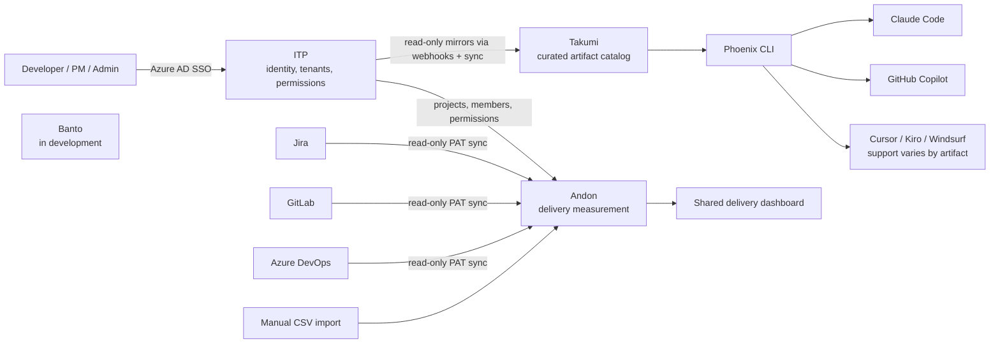
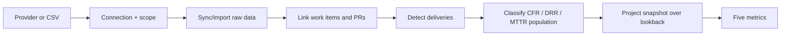
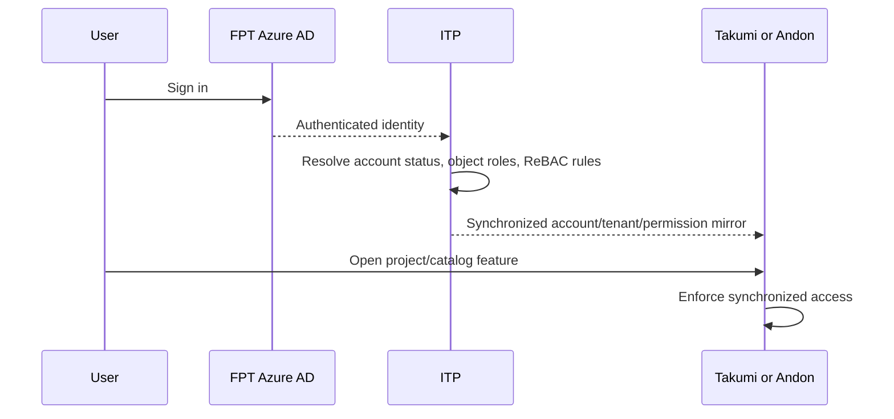
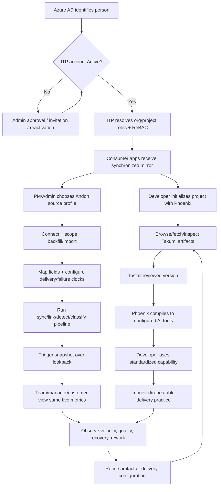

# Digital Foundry AI Platform — Complete Learning Guide

> Audience: experienced software developers who are new to FPT Digital Foundry.  
> Source boundary: this guide uses only the official documentation under `https://docs.digital-foundry.ai/docs`. It is a learning and revision aid; the official documentation remains authoritative.  
> Documentation snapshot studied: 2026-09-07. Where the official pages disagree, this guide calls out the conflict instead of guessing.

---

## 1. Big Picture

FPT Digital Foundry is a **delivery framework for AI-powered software development**. It is not another coding assistant and it is not another project tracker. Teams keep tools such as Claude Code, GitHub Copilot, Cursor, Jira, Azure DevOps, and GitLab. Digital Foundry adds the organizational layer above them:

- **Governance:** reusable AI artifacts are versioned and, for most scopes, reviewed before publication.
- **Standardization:** developers install the same skills, agents, kits, and prompts and Phoenix CLI compiles them for the configured AI tools.
- **Measurement:** Andon turns delivery-tool data into five metrics adapted for ITO delivery.

The platform exists because high AI adoption does not automatically produce consistent or measurable delivery. Without a shared system, useful prompts stay on laptops, onboarding repeats setup work, outputs differ by developer, and managers cannot connect “we use AI” to delivery outcomes.

### The platform in one diagram



The overview page names **Takumi, Banto, and Andon** as the three delivery components. The documentation separately presents **ITP** as the identity, tenant, and permission backbone used by Takumi and Andon. Banto is explicitly still in development; no usable feature, setup, API, or lifecycle is documented yet.

### What each major part does

| Part | Job | Normal user action | Output |
| --- | --- | --- | --- |
| ITP | Centralize accounts, organization/customer/project data, roles, and permission rules | Sign in; admins approve users, create tenant data, and assign roles | A shared identity and authorization model for consumer apps |
| Takumi | Curate, version, review, discover, and distribute AI artifacts | Browse the web catalog or use Phoenix CLI; contribute through the web app | Installed skills, agents, kits, and prompts in IDE-native locations |
| Phoenix CLI | Initialize projects, authenticate, fetch/search catalogs, and install artifacts | Run `phoenix ...` commands in a project | Project configuration plus compiled artifact files |
| Andon | Collect delivery data and calculate ITO-adapted metrics | Connect a provider, map fields, configure delivery rules, sync, and trigger a snapshot | Delivery Frequency, Lead Time, CFR, MTTR, and DRR dashboards |
| Banto | New component | Not documented | Not documented in the supplied official source |

### What Digital Foundry is not

- It does not replace an AI assistant.
- It does not replace Jira, Azure DevOps, or GitLab.
- It does not require a new application stack.
- Andon does not need client production credentials; it treats delivery to the client acceptance environment—staging, UAT, or equivalent handoff—as the delivery point.

**Official docs:** `/docs/overview-intro`, `/docs/itp-overview`, `/docs/mkt-intro`, `/docs/andon-system-overview`

---

## 2. Essential Terminology

| Term | Meaning | Why It Matters |
| --- | --- | --- |
| Digital Foundry | Governance, standardization, and measurement framework above existing AI and delivery tools | It coordinates the system; it is not the coding assistant or tracker |
| ITO | The delivery context for which Andon's metrics are adapted | Client-controlled production makes standard production-based DORA assumptions unsuitable |
| ITP | Identity & Tenant Platform | It is the source of truth for accounts, tenant data, roles, and permissions |
| Consumer app | An app such as Takumi or Andon that mirrors ITP data read-only | Changes are written in ITP, then synchronized outward |
| Tenant catalog | Organizations, customers, projects, and delivery metadata held in ITP | Every consumer app depends on the same catalog |
| Organization | A node in the documented `FSOFT → FSU → BU` tree | It owns projects and is traversed by permission inheritance |
| Customer | The internal or external client to which projects may be linked | It is both delivery metadata and a Takumi visibility scope |
| Project | A delivery unit under one organization, optionally linked to a customer | Roles, Andon connections, metrics, and project-scoped artifacts attach here |
| Account status | `Pending`, `Invited`, `Active`, `Revoked`, or `Rejected` | A valid SSO identity is not usable until the account is Active |
| RBAC | Permissions obtained through a role assigned on an object | Explains direct project- or organization-level access |
| ReBAC | Relationship-based access derived through the organization/object graph | Lets one org-level grant reach descendant projects when rules allow it |
| Direct assignment | A role granted on the object currently being viewed | It can be revoked on that object |
| Inherited assignment | Access derived from a related object, such as an FSU | It must be revoked at the source, not on the descendant project |
| Permission rule | Admin-editable conditions defining what a role/relation grants | Rule edits affect every matching user immediately in ITP |
| Permission explorer | Tool that expands a user's permission into its direct or inherited path | It answers “why does this user have access?” |
| API Consumer | A machine client registered to call ITP | Carries scopes, webhook URL, rate limit, and one-time credentials |
| Takumi | The curated Digital Foundry artifact marketplace/web app | It is where artifacts are discovered, reviewed, published, and versioned |
| Phoenix CLI | The standalone `phoenix` client | It authenticates, initializes projects, and installs/compiles artifacts |
| Artifact | A Skill, Agent, Kit, or Prompt rendered by the current docs | Choose the type based on capability size and orchestration needs |
| Skill | A focused `SKILL.md` instruction set for one capability | It is the most common and most composable artifact |
| Agent | An `AGENT.md` persona and multi-step workflow with dependent skills | Use it when one instruction set is insufficient |
| Kit | A `KIT.yaml` package that installs components and can scaffold a project | Use it for repeatable multi-component project setup or workflows |
| Prompt | One `PROMPT.md` compiled to an IDE-native slash command | It is the lightest artifact and currently targets Claude Code and Copilot |
| Catalog cache | Local catalog used by `fetch`, `list`, and `search` flows | Search/list can work without querying Takumi after a fetch |
| Publication scope | `public`, `bu`, `fsu`, `customer`, or `project` | Controls discoverability, installation eligibility, and review routing |
| Review SLA | Working-hour clock that starts when a reviewer claims a submission | Submission time alone does not start the SLA |
| Andon | Digital Foundry's delivery measurement engine/dashboard | It translates provider data into five shared delivery metrics |
| Connection | Read-only PAT-authenticated provider link, or a manual-import source | It is the ingress point for project delivery data |
| Source profile | Selected provider arrangement, such as Jira only or Azure DevOps end-to-end | It determines channels, setup steps, and available phase detail |
| Canonical channel | Andon's `work_item` or `pull_request` data stream | Each channel may have exactly one source |
| Scope (Andon) | Provider project/repository selection attached to a connection | A connection without the right scope may sync nothing useful |
| Sync job | A provider-specific ingestion or processing stage | Jobs must be enabled/run in the required order |
| Full re-sync | Backfill of complete history | Regular scheduled sync only picks up new activity from its starting point |
| Field mapping | Translation from provider fields/JSON paths to Andon fields | Missing mappings can silently leave metrics empty |
| Delivery point | Acceptance-environment handoff represented by a released Jira item or matching merged PR | It replaces “production deployment” in Andon's ITO model |
| Deployment rule | Repository/branch rule that turns a merged PR into a delivery | No matching rule means zero PR-derived deliveries |
| Process classification | Jira model: Agile versus Light/Very Light/Standard | It selects Release Version/Story versus Product/Task semantics |
| Snapshot | Recalculation of all five metrics for a configured lookback window | Synced data does not update dashboard metrics until calculation runs |
| Lookback days | Snapshot history window, 15–180 days; default 30 | It controls which history is recalculated and displayed |
| Delivery Frequency | Count/rate of releases to the acceptance environment | It is also the denominator context for failure/rework rates |
| Lead Time for Delivery | Median time per selected work item from its documented start to delivery | It reveals flow delay; it is not an average |
| CFR | Change Failure Rate: percentage of deliveries causing qualifying technical failure | It excludes internal-QA findings and client rework |
| MTTR | Median time to restore qualifying CFR or DRR failures | Its population is failures already classified into CFR or DRR |
| DRR | Delivery Rework Rate: percentage of deliveries rejected and requiring re-delivery | It is distinct from technical change failure |

**Official docs:** `/docs/itp-overview`, `/docs/itp-accounts`, `/docs/itp-roles-permissions`, `/docs/mkt-intro`, `/docs/mkt-skills`, `/docs/mkt-agents`, `/docs/mkt-cli-kits`, `/docs/mkt-prompts`, `/docs/andon-system-overview`, `/docs/andon-system-metrics`

---

## 3. Core Concepts

### 3.1 ITP is the control plane for identity and access

**Why:** separate user/project/role copies drift. ITP creates one authoritative account and tenant catalog, while Takumi and Andon consume synchronized read-only mirrors.

**How:** users authenticate with FPT Azure AD. Administrators manage account lifecycle, the organization tree, customers, projects, role assignments, permission rules, API consumers, and audit history in ITP. Changes are immediate in ITP and normally reach Takumi/Andon through webhooks and periodic synchronization within a few minutes.

**Practical implication:** if a project is missing in Andon or a user cannot access it, first verify the project and assignment in ITP. Editing the consumer app is not the documented write path.

**Pitfall:** an `Active` account proves identity eligibility, not project authorization. A project/org role is still required.

### 3.2 Object-scoped roles plus relationship inheritance

A role is assigned on a **project or organization**. Project scope offers `Customer`, `Manager`, `Member`, `Project Manager`, `Project Admin`, and `QA`. Organization scope offers `Org Manager (FSU/BU Leader)`, `Member`, and `Org QA Member`.

Direct assignments are managed on their object. ReBAC rules may derive descendant access from an org-level role. The Members drawer marks the source; inherited roles cannot be removed locally. The Permission explorer expands the path, and the Audit log records before/after changes.

Permission rules use a visual Builder with conditions such as role here, equivalent permission here, platform admin, or role on a linked object, combined with ANY/ALL. Complex rules may be edited as JSON. Always run **Validate (dry-run)**, inspect Current versus New, then save. There is no per-user preview; the rule affects every match.

### 3.3 Takumi separates reusable intent by artifact weight

The selection model is:

```text
One focused capability       → Skill
Persona + multi-step flow    → Agent
Several components + setup   → Kit
One reusable slash command   → Prompt
```

Takumi gives these artifacts central discovery, versioning, scoped visibility, review, and installation analytics. Phoenix CLI is the installer/compiler. A catalog artifact does not directly execute an AI model; it becomes instructions/configuration used by the developer's configured AI tool.

### 3.4 Publication is a governed lifecycle

For `public`, `bu`, `fsu`, and `customer` scopes:

```text
Draft → Submitted → In Review → Approved/Published
                             ↘ Rejected → fix → resubmit
```

Project-scoped contributions skip review; the owner controls enable/disable. A reviewer must claim an item before the SLA clock starts. Owners may delete/withdraw a draft before approval. Updates go through another review while the current published version remains live.

### 3.5 Phoenix compiles one source into tool-native locations

`phoenix init` chooses AI tools for a project. Subsequent installs compile artifacts into each configured tool's native directories. This is the standardization mechanism: the source artifact is shared, while Phoenix handles target layouts and prompt syntax.

### 3.6 Andon separates ingestion from calculation

Andon is not a live-query dashboard. The lifecycle is:



Provider connections are read-only. Configuration tells Andon what the provider data means: mappings normalize fields, deployment rules identify releases, selected work-item types determine Lead Time population, change-failure rules classify failures/rework, and MTTR status mappings define the recovery clock.

**Pitfall:** “connection succeeded” does not mean “dashboard ready.” Missing scope, disabled jobs, absent branch rules, unsaved defaults, unmapped fields, stale sync data, or an untriggered snapshot can all produce empty/stale metrics.

### 3.7 One source per canonical channel

Andon has two canonical channels: **work items** and **pull requests**. Each channel accepts exactly one source, automatic or manual.

- Jira feeds work items.
- GitLab feeds pull requests.
- Azure DevOps can feed both, or only pull requests when paired with Jira.
- Manual import may feed a channel when live sync is unavailable.

Adding another source to an occupied channel is rejected. Changing later requires removing the existing connection and re-syncing that channel from scratch.

### 3.8 Andon's ITO-adapted delivery model

The platform uses the five standard metric names but replaces production deployment with delivery to the client acceptance environment.

- Jira Agile: delivery is a Release Version marked Released.
- Jira Light/Very Light/Standard: delivery is a deliverable Product marked Released.
- Source-control signal: a PR/MR merged into a branch matched by a deployment rule.
- Manual import: a Closed Product row represents a delivery.

This lets an ITO team measure delivery without client production access.

**Official docs:** `/docs/itp-overview`, `/docs/itp-roles-permissions`, `/docs/mkt-intro`, `/docs/mkt-contributing`, `/docs/andon-system-overview`, `/docs/andon-system-onboarding`, `/docs/andon-system-metrics`

---

## 4. Architecture & Mental Model

### 4.1 Control, distribution, and measurement planes

| Plane | Components | Owns | Does not own |
| --- | --- | --- | --- |
| Control | ITP | Identities, tenant catalog, roles, permission rules, audit, machine consumers | AI execution or delivery metrics |
| Distribution | Takumi + Phoenix | Artifact catalog, review, versions, installation, compilation | The AI model itself |
| Measurement | Andon + provider connections | Read-only ingestion, linking, delivery detection, failure classification, snapshots, dashboards | Source-system writes or client production deployment |

The relationship is intentionally asymmetric: ITP is the documented write authority for shared identity/tenant/permission data; consumer apps mirror it. Takumi publishes reusable AI operating instructions; Phoenix materializes them in developer projects. Andon observes delivery-system records and calculates outcomes.

### 4.2 Identity and permission flow



ITP changes are immediate there; consumer visibility may lag by a few minutes.

### 4.3 Andon data path by source profile

| Profile | Work-item channel | PR channel | Phase breakdown | Special setup |
| --- | --- | --- | --- | --- |
| Jira only | Jira | None | No; total Lead Time only | Jira release/product semantics |
| Jira + GitLab | Jira | GitLab | Yes when Jira items link to GitLab PRs | Two connections, repository scope, deployment rule |
| Jira + Azure DevOps Repos | Jira | Azure DevOps PR-only job | Yes when linked | Azure connection must not also claim work items |
| Azure DevOps end-to-end | Azure DevOps | Azure DevOps | Yes for linked work items/PRs | Custom fields, five jobs, repo scope, deployment/config defaults |
| Manual import | Selected manual channel | Optional separate source/manual channel | Total only for the documented work-item CSV | Mapping template, exact CSV schema, manual pipeline |

**Official docs:** `/docs/itp-overview`, `/docs/itp-roles-permissions`, `/docs/andon-system-onboarding`

---

## 5. Prerequisites

### Required for normal platform access

- An existing **FPT Azure AD account**.
- An **Active ITP account**. Either self-sign-in and wait for approval, or claim an admin-created invitation using the exact invited email.
- A relevant project/org role for the resources you need. Active status alone grants no project data.

### Required for Phoenix/Takumi CLI use

- Supported platform:

  | OS | Architecture | Documented note |
  | --- | --- | --- |
  | macOS | `x86_64`, `arm64` (M1/M2/M3+) | macOS 11+ recommended |
  | Linux | `x86_64` | glibc-based distro such as Ubuntu, Debian, or RHEL |
  | Windows | `x86_64` | PowerShell 5.1+ or Windows Terminal |

- Network reachability to the Takumi/release endpoints.
- Browser reachability to the CLI's local callback during `phoenix login`.
- No Python, Node.js, or administrator rights are required for the standalone binary.

### Required for ITP administration

- `system_admin` for Users, Organizations, Customers, and Projects screens.
- Only Active users can receive object roles.
- The platform prevents revoking the last active `system_admin`, removing your own admin role, or revoking a sole project PM before a replacement is assigned.

### Required for Andon setup

- Project already exists in ITP/Andon.
- `Project Manager` or `Project Admin` on that project.
- A read-capable PAT for every live provider connection.
- Correct source-system rights to create/view tokens and read the required resources.
- For Azure DevOps end-to-end, **organization-level admin** is required to create the two custom fields before configuring Andon.

Azure DevOps PAT scopes documented for end-to-end setup:

- Work Items — Read
- Code — Read
- Build — Read
- Release — Read
- Test Management — Read

Manual import requires no PAT.

### Optional or situation-dependent

- `HTTP_PROXY`, `HTTPS_PROXY`, and `NO_PROXY` in proxied environments.
- `ODCX_CLI_CALLBACK_HOST` when CLI and browser run in different network namespaces (devcontainer, WSL2, SSH).
- SHA-256 verification for manually downloaded Phoenix binaries in locked-down environments.
- `setup/` and `hooks/` in a Skill only when project scaffolding or lifecycle hooks are genuinely needed.
- Both `.ps1` and `.sh` variants when an artifact executes scripts across Windows and Linux/macOS.

### Not documented

Self-hosting requirements, server-side platform installation, cloud regions, SLAs for platform availability, subscription/pricing, general public API credentials, and non-FPT identity providers are **not documented in the supplied official source**.

**Official docs:** `/docs/itp-accounts`, `/docs/itp-tenant-admin`, `/docs/mkt-cli-installation`, `/docs/andon-system-onboarding`, `/docs/andon-system-azure-e2e-setup`, `/docs/andon-system-manual-import`

---

## 6. Setup From Zero

This path gets a new developer from no platform account to an installed artifact and an Andon-ready project.

### Step 1 — Activate your identity

1. Open ITP and choose **Sign in with Azure AD**.
2. Authenticate with the existing FPT account; there is no ITP password.
3. If you self-registered, the account becomes `Pending`. Ask a system admin or PM to approve it in **ITP → Admin → Users**.
4. If an admin invited your email first, sign in with that exact email. The invite is claimed and becomes `Active` automatically.

Expected result: the ITP home page shows `Active`, system roles if any, and shortcuts appropriate to your access.

If you see `Pending`, `Revoked`, `Rejected`, or an unclaimed `Invited` state, an admin must approve, reactivate, or resend the invitation.

### Step 2 — Ensure the project and roles exist

An ITP `system_admin` should:

1. Confirm the organization tree (`FSOFT → FSU → BU`).
2. Create or verify the Customer.
3. Create the Project under the required Organization. The organization is required and cannot later be changed.
4. Set a unique project key within the org: 2–20 characters using `A–Z`, `0–9`, `_`, or `-`.
5. Set PM email, dates, timezone, category, contract type, status, and other delivery metadata.
6. Open the project's Members & Roles drawer and assign the developer/PM. Andon configuration requires `Project Manager` or `Project Admin`.

Expected result: after ITP-to-consumer synchronization, the project appears in Andon and relevant users can open it. Allow a few minutes.

### Step 3 — Install Phoenix CLI

macOS/Linux:

```sh
curl -fsSL https://marketplace-api.cloudhub.com.vn/api/v1/releases/latest/install.sh | sh
```

Windows PowerShell:

```powershell
powershell -ExecutionPolicy Bypass -Command "irm https://marketplace-api.cloudhub.com.vn/api/v1/releases/latest/install.ps1 | iex"
```

Manual download:

```text
https://takumi.digital-foundry.ai/download
```

Open a new terminal and verify:

```sh
phoenix --version
```

The documentation snapshot shows `phoenix 1.0.0 (stable)` as the expected result.

### Step 4 — Authenticate and initialize the project

```sh
phoenix login
phoenix init my-project
cd my-project
```

For an existing repository:

```sh
phoenix init .
```

`phoenix login` opens a browser for FPT Azure AD sign-in. Website SSO and CLI authentication are separate sessions: being signed into Takumi in a browser does not authenticate terminal installs.

Run `phoenix init` interactively to select multiple AI tools. `--yes` configures only the first available tool.

Expected result: login confirms the user, project initialization creates configuration, and later installs compile to the selected IDE paths.

> **Documentation conflict:** the CLI Installation page's example says initialization creates `.phoenix/config.yaml` and authentication writes `.phoenix/auth.yaml`. The Skills/CLI Reference pages refer to `.odcx/odcx.config.yaml` and `.odcx/` backups. The supplied source does not reconcile these paths. Inspect what your installed CLI creates; do not hard-code automation around either path without verifying the installed version.

### Step 5 — Fetch and install an artifact

```sh
phoenix skill fetch
phoenix skill search "code review"
phoenix skill info gen-code-review
phoenix skill install gen-code-review
```

Expected result: Phoenix reports the installed version and compiles it for configured AI tools, for example `.claude/skills/gen-code-review/` and `.github/skills/gen-code-review/`.

### Step 6 — Choose the Andon source profile

Before creating a connection, decide which tool owns each canonical channel:

- Jira only when you have Jira but no repository access.
- Jira + GitLab when Jira owns work items and GitLab owns source control.
- Jira + Azure DevOps when Jira owns work items and Azure Repos supplies PRs; enable only the Azure PR job for that connection.
- Azure DevOps end-to-end when work items and repos are both in Azure DevOps.
- Manual import when direct synchronization is unavailable.

This choice is expensive to change: replacing a channel source requires removing it and re-syncing that channel from scratch.

### Step 7 — Create and backfill the Andon connection

Navigate to **Projects → project → Project configurations → Integrations → + Add Connection**.

Common fields:

| Field | Meaning |
| --- | --- |
| Provider/Source Profile | Jira, GitLab, Azure DevOps, or Manual import |
| Connection Key | Unique name for the connection |
| Auth Type | PAT for live providers |
| Token/Secret | Provider PAT |
| Base URL | Provider organization/instance URL |
| Project Key | Jira project key where applicable |

After saving a live connection, use the job dropdown and run **Full re-sync** to backfill complete history. A normal scheduled sync only collects new activity from its start point.

### Step 8 — Configure meaning, not just connectivity

1. **Scope:** select the exact provider project and repositories.
2. **Sync jobs:** enable the jobs required by the profile.
3. **Mapping:** keep defaults for Jira/GitLab; load the template for Manual import; map Azure DevOps `Detected by` and `Fix mode` custom fields explicitly.
4. **Deployments:** add an environment and PR deployment rule when the profile includes source control.
5. **Lead Time:** choose the canonical work-item types.
6. **Change failure:** set windows, eligible types, detected-by values, and fix modes.
7. **MTTR:** set canonical clock-start and clock-stop statuses.
8. Click **Save defaults** where the UI says defaults are not yet saved; Azure classification can skip entirely until the CFR rule is saved.

### Step 9 — Sync, calculate, and verify

- Jira only: **Run now** on the Jira connection.
- Jira + GitLab: **Run full pipeline now**.
- Azure DevOps end-to-end: **Run full pipeline now** through all five stages.
- Manual: commit the CSV and use **Links → Run manual link** when recalculation/linking is needed.

Then open **Metrics Config**, set Lookback days (15–180; default 30), and click **Trigger project snapshot**.

Expected result: the project dashboard displays Delivery Frequency, Lead Time for Delivery, Change Failure Rate, MTTR Delivery, and Delivery Rework Rate. Anyone assigned to the project can view it; elevated setup roles are no longer required for viewing.

**Official docs:** `/docs/itp-accounts`, `/docs/itp-tenant-admin`, `/docs/itp-roles-permissions`, `/docs/mkt-cli-installation`, `/docs/mkt-getting-started`, `/docs/andon-system-onboarding`

---

## 7. First Working Example

The smallest documented developer workflow is installing and invoking the catalog's code-review skill.

### 7.1 Setup and discovery

```sh
phoenix login
phoenix init my-project
cd my-project
phoenix skill fetch
phoenix skill search "code review"
phoenix skill info gen-code-review
```

What each step does:

1. `login` creates a CLI session distinct from the Takumi website session.
2. `init` records the AI tools targeted by this project.
3. `fetch` downloads the published skill catalog into a local cache.
4. `search` queries that cache by name/description.
5. `info` lets you inspect description, category, versions, and install size before changing the project.

The official example shows search results such as:

```text
gen-code-review      v1.0.0  ★ 4.8  FPT/backend
gen-security-review  v1.2.0  ★ 4.6  FPT/security
gen-simplify         v0.9.1  ★ 4.5  FPT/quality
```

### 7.2 Install

```sh
phoenix skill install gen-code-review
```

Documented expected output:

```text
✓ Installed gen-code-review@1.0.0
✓ Registered with Claude Code & GitHub Copilot
```

### 7.3 Execute in the AI tool

Open the initialized project in Claude Code, Copilot, Cursor, or another configured tool and ask:

```text
Review the changes in src/api/auth.ts using the code review skill
```

Expected behavior: the AI assistant applies the installed `gen-code-review` framework and reports issues by severity.

### What just happened?

Takumi supplied a reviewed, versioned source artifact. Phoenix copied/compiled that artifact into each configured AI tool's native location. The AI assistant—not Digital Foundry itself—executed the instructions. The value is repeatability: another developer installing the same version receives the same review framework.

**Official docs:** `/docs/overview-getting-started`, `/docs/mkt-getting-started`, `/docs/mkt-skills`

---

## 8. Features

### 8.1 ITP accounts and SSO

**Purpose:** one FPT identity and account lifecycle across Digital Foundry.

**How it works:** Azure AD authenticates the person; ITP gives that identity a platform status. First self-sign-in creates `Pending`. An invitation starts as `Invited` and becomes `Active` when the invited email signs in. Admins can approve/reject, revoke, reactivate, or resend an invite.

**When to use it:** every user's first entry point, and the first diagnostic when any Digital Foundry app blocks access.

**Limitations/caveats:** no separate ITP password; inactive accounts cannot receive project/org assignments; account activation does not grant resource access.

**Official docs:** `/docs/itp-accounts`

### 8.2 ITP tenant administration

**Purpose:** maintain the shared organization/customer/project directory and its members.

**Important behavior:**

- Organizations form a typed hierarchy. The org type must match its level.
- Deleting an org promotes its children to roots; an org with active projects cannot be deleted.
- Deleting a customer preserves projects but removes their customer reference.
- A project's organization is required and immutable after creation.
- Projects are deactivated, not deleted; history remains.
- One person may hold several roles on the same project.
- CSV import is supported for Users, Organizations, Customers, and Projects: download a template, upload up to 1 MB, review create/update/error classification, then import. Very large files skip row preview and run in the background.

**Best use:** create the tenant structure and assign a PM/Admin before wiring up Andon.

**Official docs:** `/docs/itp-tenant-admin`

### 8.3 ITP permission rules, explorer, audit, and API consumers

**Purpose:** centralize who may do what, explain every grant, and integrate machine consumers.

**How to use:**

1. Assign direct roles from a Project or Organization's Members action.
2. For scalable inheritance, edit relation conditions in Permission rules.
3. Validate the proposed rule as a dry run and inspect the diff.
4. Save deliberately; use Permission explorer to verify direct/ReBAC paths.
5. Check Audit log for actor, action, resource, source, time, and before/after values.

API Consumers register machine clients with scopes, webhook URL, and rate limit. Client credentials appear only once. Rotating the client secret invalidates the old value immediately; the documentation says the consumer can lose ITP access within about an hour if it is not updated. Webhook rotation supports staging a new key, switching the consumer, then promoting it.

**Official docs:** `/docs/itp-roles-permissions`

### 8.4 Takumi web catalog

**Purpose:** visually discover and inspect artifacts before installing them.

Key routes and behavior:

| Route | Use |
| --- | --- |
| `/login` | FPT Azure AD sign-in; request access (reason length 10–1000) or see Pending/Revoked state |
| `/` | Search, featured artifacts, top-five trending list, categories |
| `/browse` | Free-text search; sort by installs/rating/name; filter type/category; 24 cards per page |
| `/skills/:name` | Skill, agent, or prompt detail |
| `/kits/:name` | Kit detail, manifest, and pipeline |
| `/trending` | 7-day, 30-day, or all-time installation analytics |

Detail pages provide a version selector, copyable install command, install/IDE/file statistics, source-file preview, and reviews. Agent details add capability/style/tools information; Kit details show manifest and pipeline. Install counts come from actual Phoenix installs, not page clicks.

Reviews may be submitted anonymously even without web sign-in, but installation requires authentication.

**Pitfall:** browsing while signed in does not authenticate Phoenix CLI.

**Official docs:** `/docs/mkt-browse`

### 8.5 Skills

**Purpose:** teach one focused capability through a root `SKILL.md` plus optional bundled assets.

**How it works:** the file contains YAML frontmatter followed by Markdown instructions read by the AI tool. A skill has no dependency graph and does not install other artifacts.

Compile destinations:

| Tool | Skill destination |
| --- | --- |
| Claude Code | `.claude/skills/<name>/` |
| GitHub Copilot | `.github/skills/<name>/` |
| Cursor | `.cursor/skills/<name>/` |
| Kiro | `.kiro/skills/<name>/` |
| Windsurf | `.windsurf/skills/<name>/` |

**Use when:** the task is one reusable capability—code review, security audit, documentation generation—not a persona/orchestration problem.

**Limitations:** `SKILL.md` is always required; extra setup files never overwrite existing project files; broad monolithic skills are discouraged.

**Official docs:** `/docs/mkt-skills`, `/docs/mkt-skill-authoring`, `/docs/mkt-contribute-skill`

### 8.6 Agents

**Purpose:** combine a persona, multi-step workflow, and dependent skills in `AGENT.md`.

Compile destinations:

| Tool | Agent destination |
| --- | --- |
| Claude Code | `.claude/agents/<name>.md` |
| GitHub Copilot | `.github/agents/<name>.agent.md` |
| Cursor | `.cursor/agents/<name>.md` |
| Kiro | `.kiro/agents/<name>.json` |
| Windsurf | `.windsurf/agents/<name>.md` |

Installation normally brings dependent skills. `--no-deps` skips them. Uninstalling the agent leaves dependent skills installed; remove those separately when no longer needed.

For contribution, the documented minimal archive is:

```text
my-agent-bundle/
└── agents/
    └── my-agent/
        └── AGENT.md
```

New dependency skills may travel in a sibling `skills/` tree; each new bundled skill becomes its own submission and review. Existing shared skills should normally be referenced from the catalog instead of duplicated.

**Use when:** the task needs a named operating role and ordered use of several skills, such as PR review or onboarding.

**Official docs:** `/docs/mkt-agents`, `/docs/mkt-contribute-agent`

### 8.7 Kits

**Purpose:** turn a multi-component setup or ordered agent workflow into one install.

A CLI-oriented `KIT.yaml` may contain components plus project initialization:

```yaml
kind: Kit
metadata:
  name: my-kit
  version: "1.0.0"
components:
  - type: skill # or agent
    name: gen-code-review
    required: true
initialization:
  directories: [src, tests, docs]
  files:
    - path: README.md
      template: templates/README.md.tmpl
  commands:
    - initCommand: "npm install"
```

Kit Studio builds a pipeline-oriented manifest. `after` dependencies form a DAG; agents with the same prerequisite may run in parallel. Cycles are invalid. Studio only selects already-published agents.

```yaml
apiVersion: kit.odcx.io/v1alpha1
kind: Kit
metadata:
  name: my-kit
  version: 1.0.0
  displayName: My Kit
manifest:
  categories:
    - reporting-analytics
agents:
  - ref: agents/gen-agent-ba
    required: true
    after:
      - agents/gen-agent-scrum
  - ref: agents/gen-agent-scrum
    required: true
```

**Security warning:** kit `initCommand` and `postInstallCommand` execute arbitrary, unsandboxed shell commands. `initCommand` prompts unless `--yes`; `postInstallCommand` always runs without a prompt. Review `KIT.yaml` before using `--yes`, especially in CI.

**Use when:** onboarding or project setup needs several artifacts, directories/templates, commands, or a preserved execution graph.

**Official docs:** `/docs/mkt-cli-kits`, `/docs/mkt-contribute-kit`

### 8.8 Prompts

**Purpose:** publish one lightweight slash command from a single root `PROMPT.md`.

```markdown
---
name: fix-lint
description: "Fix every lint error in the current diff."
compatibleTools: [claude, copilot]   # omit for "all IDEs"
---

Run the linter on the current diff and fix every reported issue.
Explain any fix that isn't purely mechanical. $ARGUMENTS
```

| IDE | Destination | Compilation behavior |
| --- | --- | --- |
| Claude Code | `.claude/commands/<name>.md` | Keeps `allowed-tools`; `$ARGUMENTS` remains |
| GitHub Copilot | `.github/prompts/<name>.prompt.md` | Rewrites to Copilot `mode`/`tools`; `$ARGUMENTS` becomes `${input}` |

Prompts currently target only Claude Code and GitHub Copilot. Omitting/emptying `compatibleTools` means all currently supported IDEs. In the contribution UI, an omitted value returns with both boxes selected.

**Use when:** one command-like prompt is enough and no assets/dependency graph are needed.

**Official docs:** `/docs/mkt-prompts`, `/docs/mkt-contribute-prompt`

### 8.9 Contribution and review

The current type-specific contribution pages document a three-page flow:

```text
Details & Files → Preview → Submit
```

Skills, Agents, and Prompts are uploaded as ZIP files up to **5 MB**. Required file placement:

- Skill: `SKILL.md` at archive root.
- Prompt: `PROMPT.md` at archive root.
- Agent: `agents/<agent-name>/AGENT.md` inside the bundle.
- Kit: normally built in Kit Studio; hand-written `KIT.yaml` can be imported from ZIP.

The Submit page selects scope and blocks when validation fails. Reviewers claim/unclaim, approve/reject, delegate, and comment. The SLA uses Indochina Time (UTC+7), Monday–Friday 08:30–12:00 and 13:00–17:30, excluding company holidays:

| Scope | Visible to | Review behavior |
| --- | --- | --- |
| `public` | Anyone | Assigned reviewer for scope + category |
| `bu` | The contributor's Business Unit | Assigned reviewer for scope + category |
| `fsu` | The contributor's Functional/Service Unit | Assigned reviewer for scope + category |
| `customer` | A specific customer organization | Assigned reviewer for scope + category |
| `project` | A specific project | No review; owner controls directly |

For Skill/Agent/Prompt drafts, Name and Description are read from frontmatter after upload and may be edited for catalog presentation. Their first version is `1.0.0` and later versions are auto-derived. Kit version is entered manually. A contributor may clone an owned published Skill into a pre-populated draft.

| State | Working hours since claim |
| --- | --- |
| OK | Up to 32 hours |
| Warning | Up to 40 hours |
| Risk | Beyond 40 hours |

Admins manage catalog lifecycle, users/roles, reviewer assignments, and ownership offboarding. If an owner is deactivated, reassignment is reminded at day 15 and the item becomes orphaned at day 30 if still unclaimed. Archive/restore is admin-only; project-scope owners may self-service disable/enable.

The Review/Admin page also documents Jira-driven Takumi tenant synchronization: project list sync at the top of every hour and project-role sync at 30 minutes past. Newly observed customer codes are created as `pending_review`; member sync matches by email and is additive—removed Jira members are soft-marked `removed`, not deleted. This conflicts with ITP's source-of-truth description; see §17.

**Official docs:** `/docs/mkt-contributing`, `/docs/mkt-contribute-skill`, `/docs/mkt-contribute-agent`, `/docs/mkt-contribute-kit`, `/docs/mkt-contribute-prompt`, `/docs/mkt-review-admin`

### 8.10 Andon connections and processing

Live provider connections use PAT authentication and are read-only. Important provider behavior:

- **Jira:** work items/releases/products; works alone.
- **GitLab:** PR/MR channel; normally paired with Jira.
- **Azure DevOps:** both channels end-to-end, or PR-only paired with Jira.
- **Azure Repos:** the docs say it is not a live connection and must use manual CSV import.
- **Manual:** uploaded batches; no scheduled synchronization.

Azure DevOps end-to-end pipeline stages:

```text
work_item → pull_request → commit → wi_pr_link → deployment
```

The “Run full pipeline” UI describes the processing path as:

```text
work item sync → pull request sync → link → deployment detect → failure classify
```

The five jobs must be enabled; the UI's toggle label shows the **next action**, so an enabled job may display `Disabled`. Check the green status dot and last-run time rather than misreading the button.

**Official docs:** `/docs/andon-system-onboarding`, `/docs/andon-system-azure-e2e-setup`

### 8.11 Andon's five metrics

#### Delivery Frequency

Counts releasable artifacts delivered to the acceptance environment:

- Jira Agile: Released Release Version.
- Jira Light/Very Light/Standard: Released Product designated deliverable.
- PR source: merge into a branch matched by an active deployment rule.
- Manual: `Issue Type = Product`, `Status = Closed`.

In Jira + GitLab, delivery frequency is the Jira count plus matching GitLab merges, but a release already linked to its PR is not counted twice.

#### Lead Time for Delivery

Calculated per selected work item and aggregated as a **median**.

- Jira Agile: Story reaches Ready/start date → associated Release Version Released.
- Jira standard models: task start date → associated Product Released.
- Azure end-to-end: selected work item → linked merged PR/delivery point.
- Manual: Closed Story, Created → Resolved.

Phase diagnostics are Readiness, Coding, Review, and Merge. Each phase is aggregated independently; do not sum phase medians and expect total Lead Time.

#### Change Failure Rate (CFR)

Percentage of deliveries that lead to qualifying technical failure: customer-detected blocker/regression/hotfix/rollback according to provider mapping and window. Internal QA defects, client environment problems, and scope changes do not count. A delivery with one or more qualifying defects is counted once; the numerator is failed deliveries, not defect count.

#### Mean Time to Restore Delivery (MTTR)

Median restoration time for failures already in the CFR or DRR populations, grouped by the day the failure was resolved. Same-day zero-day recovery still counts. The conceptual clock starts when the team is assigned/picks up the issue and stops when a verified fix is delivered. Provider pages map this to canonical statuses or source dates.

#### Delivery Rework Rate (DRR)

Percentage of deliveries rejected by the client and requiring re-delivery. It separates acceptance rework from technical change failure.

**Official docs:** `/docs/andon-system-metrics`, `/docs/andon-system-jira-only-setup`, `/docs/andon-system-jira-gitlab-setup`, `/docs/andon-system-azure-e2e-setup`, `/docs/andon-system-manual-import`

---

## 9. Common Developer Workflows

### 9.1 Onboard a new team member

```text
Azure AD sign-in/invite
→ ITP account becomes Active
→ assign org/project role
→ wait for consumer sync
→ install Phoenix
→ CLI login + project init
→ install team artifacts
```

Why the order matters: inactive accounts cannot be assigned; Active alone does not grant a project; Phoenix needs its own login; initialization must precede multi-IDE compilation.

### 9.2 Adopt a reviewed skill

```text
Browse detail/source/reviews
→ phoenix skill fetch/search/info
→ install a chosen version
→ invoke it in the AI tool
→ upgrade deliberately
```

Read the source/`info` first because a Skill may carry setup templates and hooks. Pin versions when stability matters.

### 9.3 Build and publish a Skill

1. Create a focused `SKILL.md` with explicit triggers, prerequisites, numbered instructions, output format, and examples.
2. Test through a local source:

   ```sh
   phoenix source add test-local --local-path /path/to/my-skill
   phoenix source sync test-local
   phoenix skill install my-skill
   ```

3. Test empty input, large files, and non-standard project layouts.
4. ZIP the artifact with `SKILL.md` at the root; include cross-platform scripts when needed.
5. In Takumi, create a Skill contribution, upload, inspect Preview/Raw, choose the narrowest correct scope, and submit.
6. Track Submitted/In Review/Approved or address rejection feedback.

### 9.4 Publish an Agent with dependencies

Choose one dependency strategy:

- New agent-specific skills: bundle under `skills/<name>/SKILL.md`; expect an independent review for each new skill.
- Shared published skills: select them in Required Skills; maintain one canonical copy.

Preview the `agents/` and `skills/` tree, then submit. Users installing the Agent receive dependencies unless they pass `--no-deps`.

### 9.5 Publish a Kit workflow

```text
Metadata (including 1–5 categories and explicit version)
→ add published agents
→ configure Runs after edges
→ inspect Execution Order DAG
→ save at least once
→ resolve validation issues
→ inspect KIT.yaml
→ submit
```

Use multiple predecessors for a join; leave `after` absent for starting nodes. Never create a dependency cycle.

### 9.6 Bring an Andon dashboard live

```text
Project + role in ITP
→ select source profile
→ create connection(s)
→ scope projects/repos
→ full re-sync/import
→ map fields
→ configure deliveries + Lead Time + failure + MTTR
→ save defaults
→ run pipeline
→ trigger snapshot
→ validate dashboard against source records
```

### 9.7 Debug a zero/stale Andon metric

Walk upstream, not just at the dashboard:

1. Is the user/project/role synchronized from ITP?
2. Is the expected channel assigned to the intended source?
3. Is the connection healthy and PAT unexpired?
4. Are scope and repositories exact?
5. Are jobs enabled and recently run/full-backfilled?
6. Are work-item links and field mappings present?
7. Does a deployment rule match the real target branch?
8. Were default rules explicitly saved where required?
9. Does the snapshot lookback include the data?
10. Was a snapshot triggered after the latest sync?

**Official docs:** `/docs/itp-accounts`, `/docs/itp-tenant-admin`, `/docs/mkt-getting-started`, `/docs/mkt-skill-authoring`, `/docs/mkt-contribute-agent`, `/docs/mkt-contribute-kit`, `/docs/andon-system-onboarding`, `/docs/andon-system-metrics`

---

## 10. Configuration

### 10.1 ITP object configuration

| Setting | Purpose | Required? | Important notes |
| --- | --- | --- | --- |
| Organization name/code/contact/type/parent | Build the `FSOFT → FSU → BU` hierarchy | Yes for org creation | Type must match level; hierarchy drives ReBAC traversal |
| Customer name/code/type/site/contact | Describe delivery client | Customer object fields | Deletion unlinks but does not delete projects |
| Project organization | Own the project | Yes | Cannot be changed later |
| Project key | Short ticket/tool identifier | Yes | 2–20 chars; `A–Z`, `0–9`, `_`, `-`; unique inside org |
| Project PM/dates/timezone/classification/contract/status | Delivery metadata | As form requires | End date cannot precede start |
| Members & Roles | Grant object access | Yes for consumer access | Active accounts only; inherited roles revoked at source |

### 10.2 Skill frontmatter

The authoring page marks all except `license` as required:

| Field | Purpose | Example |
| --- | --- | --- |
| `name` | Unique kebab-case identifier | `my-skill` |
| `description` | Catalog description plus trigger phrases | `Review changed code...` |
| `metadata.author` | Author full name | `Your Name` |
| `metadata.version` | Semantic version | `"1.0.0"` |
| `metadata.last_updated` | ISO date | `"2026-01-01"` |
| `metadata.category` | Catalog category | `code-review` |
| `metadata.tags` | Comma-separated search tags | `security, review` |
| `license` | License statement | defaults to `Internal` |

Documented categories: `code-generation`, `code-review`, `architecture`, `testing`, `security`, `devops`, `planning`, `documentation`, `other`.

Required body order: Overview → When to Use → Prerequisites → Instructions → Output Format. Examples, Related Skills, and Limitations are optional, though community standards recommend at least two concrete examples.

### 10.3 Prompt configuration

| Setting | Purpose | Behavior |
| --- | --- | --- |
| `name` | Slash-command identifier | Used in destination filename/install command |
| `description` | Catalog explanation | Auto-fills contribution form |
| `compatibleTools` | Target IDEs | `[claude, copilot]`; omitted/empty means all supported IDEs |
| `$ARGUMENTS` | User-supplied invocation text | Retained for Claude; compiled to `${input}` for Copilot |

### 10.4 Kit configuration

| Setting | Purpose | Required/constraint |
| --- | --- | --- |
| `metadata.name` | Install slug | Required |
| `metadata.version` | Kit version | Required and manually editable |
| `displayName`, description, author, license, IP | Catalog metadata | As needed |
| Categories | Discovery taxonomy | 1–5 required in Kit Studio |
| Agent `ref` | Catalog path | Must identify a published agent |
| `required: true` | Fail install if missing | Studio emits true for selected agents |
| `after` | Predecessor list | Must be acyclic; absent means starting node |
| `initialization` | Directories, files/templates, commands | Review commands as unsandboxed code |

Kit Studio's documented category chips are `Automation`, `Reporting & Analytics`, `Communication`, `Code Assistant`, `Document Processing`, `Project Management`, `Testing & QA`, and `Other`.

### 10.5 Andon connection and metric configuration

| Setting | Purpose | Required? | Example/notes |
| --- | --- | --- | --- |
| Connection Key | Unique connection identity | Yes | User-chosen |
| PAT | Read provider data | Live providers | Rotate before expiry |
| Base URL | Provider endpoint | Live providers | ADO: `https://dev.azure.com/<org>` |
| Jira instance/project key | Select Jira context | Jira | `/jiradc` or `/jiraopmx`; e.g. `CSGODCX` |
| Scope/repos | Restrict synced project/repositories | GitLab/ADO | Names must match provider exactly |
| Mapping | Normalize fields | Yes | Defaults for Jira/GitLab; template for manual; custom ADO paths |
| Environment | Logical acceptance target | PR-based sources | Example `PROD — Production` |
| Deployment rule | Match repo and branch | PR-based delivery | Exact branch recommended; regex supported |
| Lead Time types | Define eligible delivered work | Yes | PBI/Story, Bug, Client Rejection, Task, Epic as applicable |
| CFR window | Eligible post-delivery defect window | Yes | Guide examples use 5 calendar days |
| DRR window | Eligible post-delivery rework window | Yes | Guide examples use 14 calendar days |
| MTTR statuses | Define recovery clock | Yes | Canonical `in_progress` → `done` in provider setup pages |
| Lookback days | Snapshot calculation range | Yes | Integer 15–180; default 30 |

Azure DevOps custom mappings:

| Andon field | Example source path | Transform |
| --- | --- | --- |
| Detected by | `$.fields["Custom.DetectedBy"]` | `dora_customer_detector_norm` |
| Fix mode | `$.fields["Custom.FixMode"]` | `dora_fix_mode_norm` |

Azure classifications:

- `DetectedBy = Customer` is required for CFR/DRR.
- `FixMode = Hotfix` or `Rollback` routes to CFR.
- `FixMode = Rework` routes to DRR.
- `No Fix / Ignore` routes to neither.

The Jira setup guides use the canonical PBI/Story/Requirement, Bug/Defect, Client Rejection, Task, and Epic/Initiative list for Lead Time selection and show the same list as eligible work-item choices for CFR/DRR. Their example rules use Jira `Role` as DetectedBy and `Priority` as FixMode.

Jira-only and the full Jira/ADO pipelines are documented as running automatically once daily at midnight; use Run now/Run full pipeline now when the dashboard must update immediately.

**Official docs:** `/docs/itp-tenant-admin`, `/docs/mkt-skill-authoring`, `/docs/mkt-prompts`, `/docs/mkt-cli-kits`, `/docs/mkt-contribute-kit`, `/docs/andon-system-onboarding`, `/docs/andon-system-azure-e2e-setup`

---

## 11. Authentication & Authorization

### WHO ARE YOU? — Authentication

| Context | Mechanism | Credential/session behavior |
| --- | --- | --- |
| ITP/Takumi/Andon user | FPT Azure AD SSO | No ITP-specific password; shared identity across apps |
| Takumi web | Azure AD website session | Separate from CLI authentication |
| Phoenix CLI | Browser login with local callback | Tokens stored locally according to CLI; `logout` revokes/clears them |
| Andon live connection | Provider PAT | Fixed auth type; read-only provider access is recommended/documented |
| ITP machine consumer | Client credentials plus scopes/webhook secret | Credentials displayed once; rotation behavior is security-sensitive |

Remote CLI login may require `ODCX_CLI_CALLBACK_HOST` so the browser can reach the callback listener. Firewall or endpoint controls must allow loopback/reachable callback traffic.

### WHAT MAY YOU DO? — Authorization

Authentication creates/resolves an identity. Authorization evaluates account status, system roles, direct object roles, and ReBAC-derived permissions.

- `system_admin` unlocks ITP Admin screens and full platform administration.
- Organization roles are limited to org-valid choices and may inherit downward.
- Project roles control project operations. Andon connection/configuration requires Project Manager or Project Admin.
- Only Active accounts can receive an assignment.
- Takumi publication scope controls who can discover/install and which reviewer handles the contribution.
- Consumer apps mirror ITP permissions; ITP is the documented write location.

### Secrets and rotation

- Never assume a website login authenticates Phoenix.
- Scope provider PATs read-only where possible.
- Azure PATs expire; the docs cite a default of 30 days and warn that expired jobs may fail silently, leaving a frozen dashboard. Set a rotation reminder.
- ITP client credentials appear once. Copy them before closing the dialog.
- Client-secret rotation immediately invalidates the old secret; coordinate the consuming app update.
- Webhook-secret rotation should stage, switch, then promote.

**Official docs:** `/docs/itp-accounts`, `/docs/itp-roles-permissions`, `/docs/mkt-browse`, `/docs/mkt-cli-reference`, `/docs/andon-system-onboarding`, `/docs/andon-system-azure-e2e-setup`

---

## 12. CLI / Commands

### 12.1 Setup, account, environment, and recovery

| Command | Purpose | Important notes |
| --- | --- | --- |
| `phoenix init <name>` | Initialize Digital Foundry in a project | May trigger login; use `.` for current repo; interactive mode selects multiple tools |
| `phoenix login` | Authenticate through browser | Local callback listener |
| `phoenix login [--url <url>]` | Authenticate against selected Takumi URL | URL override documented, semantics beyond this are not detailed |
| `phoenix credential` | Interactive PAT credential helper | Exact prompts/storage not documented |
| `phoenix --version` | Print installed version | Docs snapshot expects 1.0.0 |
| `phoenix logout` | Revoke session and clear local tokens | Use when changing accounts or disposing a machine |
| `phoenix whoami` | Show user, role, environment, token expiry | First identity diagnostic |
| `phoenix status` | Show version, auth, Takumi reachability, install counts | First general health check |
| `phoenix self-update [--check]` | Update/check standalone binary | For a pip install, docs say `pip install --upgrade odcx` |
| `phoenix backup list` | List automatic re-init backups | Includes metadata |
| `phoenix backup revert <name>` | Restore config from partial backup name | Always asks `[y/N]` |

### 12.2 Skills

| Command | Purpose |
| --- | --- |
| `phoenix skill fetch` | Refresh local catalog |
| `phoenix skill list [--json]` | List cached catalog |
| `phoenix skill search <query>` | Search cached names/descriptions |
| `phoenix skill info <name> [--json]` | Inspect metadata, versions, size |
| `phoenix skill install <name>[@version] [--force]` | Install/pin/reinstall |
| `phoenix skill installed [--json]` | List project-installed skills |
| `phoenix skill upgrade <name>` | Upgrade one |
| `phoenix skill upgrade --all` | Upgrade all |
| `phoenix skill uninstall <name>` | Remove from every configured IDE |

Version syntax supports exact versions and semver ranges such as `@^1.2.0`.

### 12.3 Agents

| Command | Purpose |
| --- | --- |
| `phoenix agent fetch` | Refresh local agent catalog |
| `phoenix agent list [--json]` | List cached agents |
| `phoenix agent search <query>` | Search cached agents |
| `phoenix agent info <name> [--json]` | Inspect dependencies/versions |
| `phoenix agent install <name> [--force] [--no-deps]` | Install agent and normally its skills |
| `phoenix agent installed [--json]` | List project-installed agents |
| `phoenix agent upgrade <name>` / `--all` | Upgrade one/all |
| `phoenix agent uninstall <name>` | Remove agent; dependencies remain |

### 12.4 Kits

| Command | Purpose |
| --- | --- |
| `phoenix kit fetch` | Refresh kit catalog |
| `phoenix kit list` | List cached kits |
| `phoenix kit info <name>` | Inspect a kit |
| `phoenix kit install <name> [--yes]` | Preview and install catalog kit |
| `phoenix kit install --from <path\|zip> [--yes]` | Install/test a local folder or ZIP offline |
| `phoenix kit installed` | List installed kits |
| `phoenix kit uninstall <name>` | Remove kit |

Without `--yes`, catalog/local install prompts `Proceed? [Y/n]`. `--from` bypasses Takumi fetch. Review shell commands before non-interactive installation.

### 12.5 Prompts

| Command | Purpose |
| --- | --- |
| `phoenix prompt fetch` | Refresh prompt catalog |
| `phoenix prompt list [--json]` | List cached prompts |
| `phoenix prompt search <query>` | Search cached prompts |
| `phoenix prompt info <name> [--json]` | Inspect version/compatible IDEs |
| `phoenix prompt install <name> [--yes]` | Compile/install to permitted configured IDEs |
| `phoenix prompt installed [--json]` | List project-installed prompts |
| `phoenix prompt uninstall <name>` | Remove compiled prompt files |

Prompts have no documented local/git `--from` install path.

### 12.6 Sources

| Command | Purpose |
| --- | --- |
| `phoenix source add <name> --url <url> [--branch main] [--path <sub>]` | Register Git source, optionally branch/subdirectory scoped |
| `phoenix source add <name> --local-path <dir>` | Register local test source |
| `phoenix source sync --all` | Refresh every source |
| `phoenix source list` | List sources |
| `phoenix source remove <name>` | Remove source |

The Skill Authoring example also uses `phoenix source sync test-local` for one named source.

### 12.7 Output and automation

The docs say `--json` is available on most Skill/Agent/Prompt `list`, `installed`, or `info` subcommands; the exact rendered command tables show it only where included above. Do not assume JSON support for Kit commands.

### 12.8 Versions

The official Versions page lists:

| Version | Release date | Highlight |
| --- | --- | --- |
| 1.0.0 | 2026-07-15 | First GA: kits, MCP packages, per-environment sessions |
| 0.9.0 | 2026-06-20 | `phoenix mcp *` group and `mcp doctor` health checks |
| 0.8.0 | 2026-05-28 | Kit commands and local `--from` |
| 0.7.0 | 2026-05-02 | Browser login/local callback and token refresh |
| 0.6.0 | 2026-04-10 | Standalone macOS/Linux/Windows binary |

The rendered CLI Reference does not include an MCP section despite these release notes. Exact current MCP command syntax is therefore **not documented in the rendered supplied source**.

**Official docs:** `/docs/mkt-cli-installation`, `/docs/mkt-cli-reference`, `/docs/mkt-cli-versions`, `/docs/mkt-skills`, `/docs/mkt-agents`, `/docs/mkt-cli-kits`, `/docs/mkt-prompts`

---

## 13. API / SDK

The supplied official documentation does **not** provide a public Digital Foundry API reference, SDK initialization guide, endpoint catalog, request/response schema, or error model.

What is documented:

- ITP has API Consumers with scopes, webhook URL, rate limits, one-time credentials, and secret rotation.
- Takumi's trending view is powered by an analytics API, but its endpoint/auth/schema are not documented.
- Andon integrations connect to provider APIs through PATs, but Andon's own API is not documented.
- For finding Jira internal field names during mapping, the docs provide this provider request:

  ```http
  GET https://insight.fsoft.com.vn/jiradc/rest/api/2/issue/<task-ID>?fields=*all&expand=names,schema
  ```

Do not infer undocumented Digital Foundry endpoints from the web UI or from similar products.

**Official docs:** `/docs/itp-roles-permissions`, `/docs/mkt-browse`, `/docs/andon-system-onboarding`

---

## 14. Integrations

### 14.1 ITP → Takumi/Andon

| Direction | Flow | Write authority | Timing |
| --- | --- | --- | --- |
| ITP → consumer apps | Accounts, tenant catalog, permissions | ITP | Webhooks + periodic sync; usually a few minutes |
| Consumer app → ITP | Changes requiring identity/tenant/permission write | ITP API (machine consumer) | Exact API workflow not documented |

### 14.2 Takumi/Phoenix → AI tools

| Artifact | Claude | Copilot | Cursor | Kiro | Windsurf |
| --- | --- | --- | --- | --- | --- |
| Skill | `.claude/skills/<name>/` | `.github/skills/<name>/` | `.cursor/skills/<name>/` | `.kiro/skills/<name>/` | `.windsurf/skills/<name>/` |
| Agent | `.claude/agents/<name>.md` | `.github/agents/<name>.agent.md` | `.cursor/agents/<name>.md` | `.kiro/agents/<name>.json` | `.windsurf/agents/<name>.md` |
| Prompt | `.claude/commands/<name>.md` | `.github/prompts/<name>.prompt.md` | Not supported | Not supported | Not supported |

Kits follow the destinations of their contents plus scaffolding. Phoenix performs the compilation; no manual per-IDE wiring is intended.

### 14.3 Jira → Andon

- PAT-authenticated, read-only.
- Work-item channel plus Release Version/Product delivery signals.
- FSOFT base URL example: `https://insight.fsoft.com.vn/jiradc/`.
- Jira instance examples: `/jiradc`, `/jiraopmx`.
- Default mapping is normally left unchanged.
- Jira-only still calculates all five metrics, but has no source-code phase breakdown.
- Jira + GitLab/Azure adds PR-linked phase detail.

### 14.4 GitLab → Andon

- PAT-authenticated, read-only PR/MR channel.
- Default base URL in the guide: `https://git3.fsoft.com.vn`.
- Select every repository under Scope.
- Pair with Jira for work items.
- Add environment and deployment rule so matching merged MRs count as deliveries.

### 14.5 Azure DevOps → Andon

- PAT-authenticated and read-only.
- End-to-end mode owns both channels; paired mode must be PR-only when Jira owns work items.
- Project scope name must exactly match Azure DevOps; then select repositories.
- Create inherited process before adding locked-system-process custom fields.
- Map `DetectedBy` and `FixMode` and enable all five end-to-end jobs.
- ADO base URL format: `https://dev.azure.com/<your-organization>`.

### 14.6 Manual CSV → Andon

- No PAT, base URL, or live sync.
- Load the mapping template once.
- Upload one batch per sprint, Parse & Preview, then `Commit (REPLACE)`.
- Use manual link and snapshot actions; nothing runs on a timer.
- Can be mixed by channel, provided each channel still has exactly one source.

**Official docs:** `/docs/itp-overview`, `/docs/itp-roles-permissions`, `/docs/mkt-intro`, `/docs/andon-system-onboarding`, `/docs/andon-system-jira-only-setup`, `/docs/andon-system-jira-gitlab-setup`, `/docs/andon-system-azure-e2e-setup`, `/docs/andon-system-manual-import`

---

## 15. Security

### Identity and least privilege

- Use Azure AD SSO; there is no separate ITP password to distribute.
- Grant `system_admin` sparingly. It has full platform access.
- Assign object roles at the highest organization level that is still correct—high enough to avoid repetition, low enough to avoid excess inherited access.
- Use Permission explorer to prove the access path and Audit log to verify changes.
- The platform prevents three dangerous admin actions: removing your own admin role, revoking the last active system admin, and revoking a sole project PM without a replacement.

### Tokens and secrets

- Give Andon PATs read-only scopes where possible; Andon is documented as never writing back.
- Track PAT expiry and rotate in **Integrations → edit Connection → Token/Secret**.
- Treat frozen dashboards as a possible expired-token symptom because the Azure guide says sync failures may be silent.
- Copy ITP API-consumer credentials at creation; they are shown once.
- Coordinate client-secret rotation because the previous secret is revoked immediately.
- Rotate webhook secrets by staging the new value, migrating the consumer, then promoting it.
- Do not expose tokens in screenshots, contribution files, shell history, or diagnostic bundles.

### Supply-chain safety for artifacts

- Inspect the Files/Raw view or `info` before install.
- Skills may install setup templates and IDE hooks.
- Kits may execute unsandboxed shell commands. `postInstallCommand` always runs; `--yes` can suppress the `initCommand` confirmation.
- Prefer a narrow Takumi scope during development; widen only after review readiness.
- For private Git/local sources, recognize that the documented Takumi review gate does not apply.
- When an artifact runs scripts, ship both `.ps1` and `.sh`, then review both implementations.

### Network-sensitive configuration

- The CLI browser callback depends on reachable loopback/network namespace configuration.
- Corporate proxies and CAs affect installer/login/API connectivity; set `HTTP_PROXY`, `HTTPS_PROXY`, and `NO_PROXY` deliberately.
- Verify release SHA-256 checksums when manually installing in locked-down environments.

**Official docs:** `/docs/itp-tenant-admin`, `/docs/itp-roles-permissions`, `/docs/mkt-cli-installation`, `/docs/mkt-cli-kits`, `/docs/mkt-skill-authoring`, `/docs/andon-system-onboarding`, `/docs/andon-system-azure-e2e-setup`

---

## 16. Best Practices

### ITP and access

1. **Create tenant data once in the authoritative location.** Consumer copies are read-only mirrors; parallel manual copies recreate the drift ITP exists to prevent.
2. **Make accounts Active before assigning roles.** The member search only returns assignable Active accounts.
3. **Grant once at the correct org level.** ReBAC is intended to replace dozens of identical project assignments.
4. **Validate rules before save.** A permission-rule edit has platform-wide matching impact and no per-user preview.
5. **Keep at least two viable administrators/PMs.** Safety rails prevent losing the last admin or sole PM, but advance planning avoids emergency handoffs.

### Takumi and artifact design

1. **Use the smallest fitting artifact.** A focused Skill composes better than a monolith; use an Agent only for persona/workflow and a Kit only for bundled setup/orchestration.
2. **Inspect before install.** Read files, version, reviews, size, setup templates, hooks, and Kit commands.
3. **Pin when reproducibility matters.** Exact or semver Skill versions avoid surprise changes; test upgrades before rolling them across a team.
4. **Write executable instructions.** State exact inputs, numbered actions, conditionals, and output format. “Analyze the code” is insufficient.
5. **Test edge cases locally.** The authoring page names empty input, large files, and non-standard project structures.
6. **Keep shared dependencies canonical.** Publish a Skill once and reference it from several Agents; bundle only new agent-specific skills.
7. **Choose the narrowest publication scope.** Scope controls visibility and review; widening a published item requires review again.
8. **Review Kit graphs and commands.** Validate acyclicity and inspect unsandboxed setup before approving or automating.
9. **Maintain reviewer assignments.** Scope/category routing only works when coverage stays current.

### Andon

1. **Choose channel ownership before connecting.** Replacing a source later requires teardown and re-sync.
2. **Backfill immediately.** Run Full re-sync after initial live connection; scheduled incremental sync does not reconstruct old history.
3. **Make work-item/PR linking part of Definition of Done.** Azure metrics and phase detail depend on those joins.
4. **Use exact provider names and branches.** Scope and deployment-rule mismatches are silent data-loss causes.
5. **Save seeded defaults.** “Using SRS defaults” is not the same as project-pinned configuration; Azure CFR classification may skip until saved.
6. **Sync before snapshot.** Snapshot calculation cannot compensate for stale raw data.
7. **Validate with a known source record.** Confirm at least one expected delivery, work item, failure, and recovery across the pipeline before trusting trend charts.
8. **Do not add phase medians.** The phase populations are independently aggregated and do not reconstruct median total Lead Time.
9. **Rotate PATs before expiry.** A stale dashboard may otherwise appear healthy at its last value.
10. **For manual CSV, use a template and exact casing.** Valid import does not guarantee metric eligibility.

**Official docs:** `/docs/itp-roles-permissions`, `/docs/mkt-skill-authoring`, `/docs/mkt-contributing`, `/docs/mkt-cli-kits`, `/docs/mkt-review-admin`, `/docs/andon-system-onboarding`, `/docs/andon-system-metrics`, `/docs/andon-system-manual-import`

---

## 17. Limitations & Constraints

### Documented product constraints

| Area | Constraint | Consequence |
| --- | --- | --- |
| Banto | In development | No reliable setup, usage, API, or decision guidance is available |
| Identity | FPT Azure AD is the only documented human sign-in | Other identity providers are not documented |
| Account | Must be Active before assignment/use | Authentication alone is insufficient |
| Organization | Active-project org cannot be deleted; deleting another promotes children to roots | Reorganize/move projects first |
| Project | Organization cannot be changed after creation; projects are deactivated, not deleted | Design ownership correctly; history remains |
| ITP propagation | Consumer sync may take a few minutes | Immediate ITP change may not appear immediately in Takumi/Andon |
| Skill contribution | ZIP limit 5 MB; root `SKILL.md` | Nested required file fails detection |
| Agent contribution | ZIP limit 5 MB; `agents/<name>/AGENT.md` | Wrong bundle shape fails validation |
| Prompt contribution | ZIP limit 5 MB; root `PROMPT.md` | Extra IDE support cannot be assumed |
| Prompt compilation | Claude Code and GitHub Copilot only | Cursor/Kiro/Windsurf prompt output is unsupported |
| Kit | Commands are unsandboxed; cycles invalid; Studio selects published agents | Review code and publish dependencies first |
| Review | Project scope skips review; other listed scopes are reviewed | Governance differs by scope |
| Scope | Published scope cannot simply widen without fresh review | Start narrow and plan promotion |
| Review SLA | Working hours only; starts on claim | Submission age is not SLA age |
| Andon channels | Exactly one source per `work_item`/`pull_request` channel | Competing sources are rejected |
| Source change | Remove and re-sync channel from scratch | Up-front source choice matters |
| Azure Repos | Manual CSV only according to onboarding page | No live Azure Repos connection in supplied docs |
| Jira only | Total Lead Time; no code/review/merge phase breakdown | All five top-level metrics still calculate |
| Metrics | Snapshots, not real time | Must sync/import and calculate |
| Lookback | Integer 15–180, default 30 | Older activity falls outside a snapshot |
| Manual import | No scheduled sync; exact 18-column UTF-8 CSV | Every update is operationally triggered |
| ITP bulk CSV | Upload up to 1 MB | Large imports may run without row preview |
| Public API/SDK | Not documented | UI/CLI behavior must not be generalized into an API contract |

### Official documentation conflicts and gaps

These are conflicts **inside the supplied official source**. The guide cannot resolve them without inventing behavior.

| Topic | Page A says | Page B says | Safe action |
| --- | --- | --- | --- |
| Phoenix config path | CLI Installation examples create `.phoenix/config.yaml`; login writes `.phoenix/auth.yaml` | Skills/CLI Reference discuss `.odcx/odcx.config.yaml` and `.odcx/` backups | Inspect files created by the installed version before scripting |
| CLI current version | Versions page says latest is 1.0.0 | Installation's “pin older release” example uses `v1.2.0` | Treat numbers as documentation examples; verify the official download page at install time |
| Skill package minimum | Contribute Skill says only root `SKILL.md` is mandatory | Skill Authoring says minimum includes `SKILL.md` and `package.json` | For Takumi ZIP validation, follow type-specific contribution page; include `package.json` when following authoring workflow and confirm Preview |
| Contribution editor | Type-specific pages say `Details & Files → Preview → Submit` and explicitly no separate Files tab | General Contributing/Skill Authoring describes Metadata/Files/Preview/Submit | Follow the currently rendered type-specific wizard |
| Skill content versioning | Contribute Skill permits Patch/Minor/Major update choice or same-name automatic bump | Skill Authoring says content change receives next major version | Do not predict the version; review the draft's auto-derived version before submission |
| Shared tenant source | ITP Overview calls ITP the source of truth and consumers read a synchronized mirror | Takumi Review/Admin says customer/project data syncs from Jira hourly | Confirm the deployed ownership model with admins before changing integration automation |
| Lead Time phases | Metrics Reference says four phases and says Merge-to-Delivery was removed on 2026-05-30 | Azure end-to-end page still lists a fifth Merge-to-Delivery phase | Treat the Metrics Reference as the current definition, but verify the deployed dashboard/schema |
| Jira-only links | Jira-only guide says all five metrics calculate from Jira without source control | Metrics Reference troubleshooting broadly says CFR/DRR only count work items linked to PRs | Follow the provider-specific Jira-only flow, then validate with a known Jira release/bug |
| Jira MTTR clock | Metrics concept says assignment/pickup → verified fix; deployment config maps `in_progress → done` | Jira-only capture table says `CreatedDate → ResolvedDate` | Treat this as provider/version ambiguity; validate one known incident before reporting MTTR |
| MCP CLI | Versions page says 0.9.0 added `phoenix mcp *` and `mcp doctor` | Rendered CLI Reference has no MCP command table | Exact current MCP usage is not documented in the rendered source |

**Official docs:** all pages cited in the conflict rows, especially `/docs/mkt-cli-installation`, `/docs/mkt-cli-versions`, `/docs/mkt-skill-authoring`, `/docs/mkt-contribute-skill`, `/docs/itp-overview`, `/docs/mkt-review-admin`, `/docs/andon-system-metrics`, `/docs/andon-system-azure-e2e-setup`, `/docs/andon-system-jira-only-setup`

---

## 18. Common Mistakes

| Mistake | Why It Happens | Correct Understanding |
| --- | --- | --- |
| Treating Digital Foundry as the AI model | Takumi artifacts appear inside assistants | The existing AI tool executes; Digital Foundry governs/distributes/measures |
| Assuming Active means project access | Authentication and authorization are conflated | Active enables the account; object roles grant resource access |
| Revoking inherited access on a project | The user appears in project Members | Revoke the org/source assignment that produced the inherited chip |
| Editing a global permission rule without dry-run | Builder looks like a local form | Rule changes affect every matching user; validate and audit |
| Assuming Takumi web login covers CLI | Both use the same human identity | They are separate sessions; run `phoenix login` |
| Searching before `fetch` | Search looks like an online command | Skill/Agent/Prompt search reads the local cache |
| Installing an Agent with `--no-deps` casually | It seems faster | The Agent may be unusable unless required Skills are already installed |
| Uninstalling an Agent and expecting Skills removed | Dependencies arrived automatically | Dependent Skills remain and require separate uninstall |
| Treating a Prompt as universal | Skills support many IDEs | Prompts currently compile only to Claude Code and Copilot |
| Zipping the parent directory | GUI ZIP defaults add a nesting level | Required `SKILL.md`/`PROMPT.md` must be at archive root |
| Bundling a shared Skill in every Agent | Bundle flow is convenient | Publish shared Skill once and reference it |
| Using `--yes` on an unreviewed Kit | CI needs non-interactive install | Kit commands are unsandboxed; inspect `KIT.yaml` first |
| Choosing broad scope immediately | Public feels like the default | Start with project/customer; wider scope changes require review |
| Counting review SLA from submission | Status entered Submitted earlier | Clock begins when reviewer claims |
| Connecting two sources to one Andon channel | More data seems better | Exactly one source owns each canonical channel |
| Skipping Full re-sync | A normal sync succeeded | Normal schedule only captures new activity from that point |
| Not selecting repos/scope | Connection validation passed | Connectivity without scope can ingest no project data |
| Missing deployment rule | Provider contains merged PRs | Only branches matched by a rule become PR-derived deliveries |
| Rule targets `dev`, merges target `main` | Branch naming changed | Exact/regex target must match recorded PR target branch |
| Leaving ADO custom fields unmapped | Fields exist in Azure | An unmapped field behaves as missing; CFR/DRR remain empty |
| Not saving displayed defaults | UI already shows values | Defaults may be unpinned; Azure classifier may skip CFR/DRR |
| Trusting stale numbers after sync | Sync and calculation are confused | Trigger a snapshot after fresh data |
| Adding phase medians | They look like components of a sum | Independently aggregated medians do not sum to total Lead Time |
| Manual CSV uses ISO/zero-padded dates | Common engineering date formats | Docs require `M/D/YYYY`, e.g. `7/25/2026` |
| Manual CSV uses lowercase values | CSV parser accepts the row | Metric matching is case-sensitive and may silently exclude it |
| Manual Bug has blank Start date | Created/Resolved seem enough | Manual MTTR needs Start date and Resolved |

**Official docs:** `/docs/itp-accounts`, `/docs/itp-roles-permissions`, `/docs/mkt-getting-started`, `/docs/mkt-agents`, `/docs/mkt-cli-kits`, `/docs/mkt-contributing`, `/docs/andon-system-onboarding`, `/docs/andon-system-metrics`, `/docs/andon-system-manual-import`

---

## 19. Troubleshooting

| Problem | Likely Cause | How To Diagnose | Documented Solution |
| --- | --- | --- | --- |
| `phoenix` not found | PATH not reloaded or binary directory absent | `Get-Command phoenix -All` (Windows); `which -a phoenix` (macOS/Linux) | Reopen terminal; on Unix run `exec $SHELL -l`, then fix shell profile if needed |
| Installer Permission denied | Target not writable / script not executable | Inspect target ownership/mode | Use user-writable target; `chmod +x <script>`; avoid `sudo` unless system-wide desired |
| PowerShell scripts disabled | Execution policy | Read PowerShell error | Use process-scoped `-ExecutionPolicy Bypass` install command |
| Browser login hangs | Callback blocked/unreachable | Check browser/network error and loopback firewall | Clean browser; allow `localhost:<port>`; set `ODCX_CLI_CALLBACK_HOST` for remote namespace |
| TLS/certificate/API reachability error | Proxy or corporate CA | Check proxy variables and web/release reachability | Configure `HTTP_PROXY`, `HTTPS_PROXY`, `NO_PROXY`, and corporate CA trust |
| HTTP 405 from Takumi | Expired/stale session | Compare with previously working command | Run `phoenix login`, retry |
| Agent install fails mid-way | Dependency download/extract/register failure | Find the first failed dependency/stage | Retry once; check endpoint quarantine on Windows or writable/non-read-only install dir on Unix |
| 429 | Too-frequent requests | Capture command/timestamp/status | Wait and retry; reduce script polling |
| Persistent 5xx/timeout | Service/network failure | Check Takumi UI and whether multiple users are affected | Retry briefly; escalate persistent/multi-user 5xx immediately |
| ITP access blocked | Non-Active account | Check status on ITP/home screen | Admin approves/reactivates/resends invite |
| Project absent in Andon | Not created/synced from ITP | Verify ITP Project and sync delay | Create in ITP; wait a few minutes; verify consumer sync |
| User cannot see project | Missing role or inherited path | Members drawer + Permission explorer | Assign correct role to Active account; fix source relation |
| Delivery Frequency is zero | No matching release or deployment rule | Check release status, rule repo/branch, pipeline stage | Correct rule/branch; run sync/pipeline and snapshot |
| Lead Time missing/wrong | Wrong types/status mapping or no PR link | Inspect selected types, start fields, Development/PR link | Correct selection/mapping; link work items to PRs where required |
| CFR/DRR empty | Custom fields missing/unmapped, rule unsaved, no eligible items | Check ADO fields/mapping, saved rule, detected-by/fix mode/window | Create/map fields, Save defaults, correct classification values, rerun pipeline |
| MTTR empty | No classified CFR/DRR population or missing clock dates/statuses | Check failure membership, Start/Resolved, status mapping | Fill/map required fields; set `in_progress → done`; rerun |
| Dashboard stale | PAT expiry, sync not run, or snapshot not recalculated | Check connection/job last run, token expiry, snapshot window | Rotate PAT; run sync/full pipeline; trigger snapshot |
| Manual CSV parse error | Header/order/date/allowed value invalid | Parse & Preview row errors | Use exact 18-column header, UTF-8, `M/D/YYYY`, accepted values |
| Manual CSV imports but metric stays empty | Eligible fields blank/miscased | Compare row against metric trigger | Correct case/Status/Product/Detected By/Priority/Start/Resolved; replace batch and recalculate |

Before escalation, collect Phoenix version, binary location, exact command/timestamp/full output, affected endpoint, proxy variables (without credentials), and browser/network error. Do not include secrets.

**Official docs:** `/docs/mkt-cli-troubleshooting`, `/docs/itp-accounts`, `/docs/itp-roles-permissions`, `/docs/andon-system-metrics`, `/docs/andon-system-onboarding`, `/docs/andon-system-manual-import`

---

## 20. Important Comparisons

| Concept A | Concept B | Difference | Use A When | Use B When |
| --- | --- | --- | --- | --- |
| Authentication | Authorization | Identity versus allowed operations | Proving user/machine identity | Deciding resource/feature access |
| Active account | Project role | Platform lifecycle versus object grant | Enabling account use | Accessing/configuring one project |
| Direct role | Inherited/ReBAC role | Assigned here versus derived through relationship | Exception/local responsibility | Organization-wide consistent access |
| Skill | Prompt | Structured capability folder versus one slash-command file | Reusable method/assets/hooks | Lightweight command for Claude/Copilot |
| Skill | Agent | One capability versus persona/workflow with dependencies | Focused composable task | Multi-step role-driven work |
| Agent | Kit | Runtime workflow artifact versus bundle/scaffold/DAG | Persona coordinates skills | Whole project/workflow setup in one install |
| Web catalog | Phoenix CLI | Discovery/preview versus local installation/compilation | Comparing artifacts and reviews | Changing a project |
| Catalog source | Git/local source | Reviewed/scoped marketplace versus private/test distribution | Governed org discovery | Local testing/private distribution without Takumi review |
| Public/BU/FSU/customer scope | Project scope | Reviewed publication versus owner-controlled no-review | Reuse beyond one project | Local project ownership |
| Sync/import | Snapshot | Ingest raw data versus calculate metrics | Refreshing source records | Updating dashboard values |
| Normal sync | Full re-sync | Incremental new activity versus history backfill | Day-2 operation | Initial setup/recovery |
| Jira only | Jira + GitLab | Release-based work items only versus source-control phase detail | No repository access | Jira plus team-managed GitLab |
| Jira + Azure | ADO end-to-end | Jira owns work items versus ADO owns both | Mixed tools | Entire workflow in ADO |
| CFR | DRR | Technical delivery failure versus client-requested re-delivery | Hotfix/rollback/regression | Acceptance rejection/rework |
| CFR/DRR | MTTR | Failure frequency/population versus recovery duration | Measuring how often deliveries fail | Measuring how long classified failures take to restore |
| Total Lead Time | Phase breakdown | End-to-end median versus diagnostic sub-phase medians | Delivery outcome | Bottleneck investigation |

**Official docs:** `/docs/itp-overview`, `/docs/itp-roles-permissions`, `/docs/mkt-intro`, `/docs/mkt-contributing`, `/docs/andon-system-onboarding`, `/docs/andon-system-metrics`

---

## 21. Decision Guide

**Official docs:** `/docs/itp-overview`, `/docs/itp-roles-permissions`, `/docs/mkt-skills`, `/docs/mkt-agents`, `/docs/mkt-cli-kits`, `/docs/mkt-prompts`, `/docs/andon-system-onboarding`

### Choose a Takumi artifact

- If you need **one focused capability**, use a **Skill**.
- If you need **a persona plus several ordered steps/Skills**, use an **Agent**.
- If you need **several components, project scaffolding, setup commands, or a DAG**, use a **Kit**.
- If you need **one reusable slash command** and target Claude Code/Copilot, use a **Prompt**.

### Choose a distribution method

- If the artifact should be discoverable and governed, publish to **Takumi**.
- If it is early/private to one team, use **project scope** or a Git/local Phoenix source.
- If several Agents share a Skill, publish/reference one catalog Skill.
- If a new Skill exists only for one Agent, bundle it and accept separate reviews.

### Choose an Andon source profile

- If only Jira data is accessible, choose **Jira only**; all five top-level metrics, no phase breakdown.
- If Jira owns work items and GitLab owns repositories, choose **Jira + GitLab**.
- If Jira owns work items and Azure Repos supplies PRs, choose **Jira + Azure DevOps**, with ADO PR sync only.
- If all work items/repos/pipelines are in ADO, choose **Azure DevOps end-to-end**.
- If live integration is unavailable, choose **Manual import** for the required channel.

### Decide where to troubleshoot

- Account status problem → ITP Users.
- “Why this permission?” → ITP Permission explorer.
- Artifact not found → fetch/search/catalog scope.
- Artifact installed but not available → initialized tool/config/compile destination.
- Andon raw data absent → connection/scope/PAT/sync.
- Raw data present but delivery absent → deployment/release rule.
- Delivery present but failure metric absent → links/mapping/classification/saved rules.
- Correct calculated data but dashboard stale → snapshot/lookback.

---

## 22. Practical Scenarios

### Scenario A — Standardize code review for a new project

**Requirement:** every developer should apply the same code-review method.

**Decision:** use a Skill, not an Agent or Kit, because this is one capability.

**Execution:** initialize the repo's AI tools, inspect `gen-code-review`, install a pinned version if reproducibility is needed, and invoke it explicitly during review.

**Result:** Phoenix compiles the same version into every configured IDE; developers receive consistent instructions.

### Scenario B — Publish a reusable PR-review persona

**Requirement:** the review includes code quality, security, and reporting steps.

**Decision:** create an Agent referencing shared catalog Skills. Bundle only new Agent-specific Skills.

**Execution:** package `agents/<name>/AGENT.md`, select Required Skills, preview the tree, choose scope, submit. Each bundled new Skill gets its own review.

**Result:** one Agent install brings its required capabilities unless the user deliberately passes `--no-deps`.

### Scenario C — Bootstrap a complete project workflow

**Requirement:** install several Agents, create directories/templates, run setup, and preserve execution order.

**Decision:** use a Kit.

**Configuration:** define metadata/categories; add published Agents; set acyclic `after` relations; review the generated manifest and every command.

**Result:** one `phoenix kit install` reproduces component selection, scaffolding, and ordering.

### Scenario D — Client grants Jira access but no repository access

**Requirement:** show all five Andon metrics without production/repo credentials.

**Decision:** Jira-only profile.

**Configuration:** Jira PAT/base/instance/key; leave mapping defaults; sync; skip environments/deployment rules; configure Lead Time types, 5-day CFR and 14-day DRR windows, `Customer` detection, Jira priority classifications, `in_progress → done`; snapshot.

**Result:** all five top-level metrics use Jira Release Versions/Products and Bugs; Lead Time has no source-code phase detail.

### Scenario E — Jira work and GitLab code

**Requirement:** total metrics plus Readiness/Coding/Review/Merge diagnostics.

**Decision:** Jira + GitLab.

**Configuration:** two connections, GitLab repo scope, Jira defaults, environment, deployment rule matching the release branch, selected work types, failure/MTTR rules; run full pipeline and snapshot.

**Result:** Jira drives work/failure data; GitLab adds matching merge deliveries and PR-linked phase detail, with linked delivery deduplication.

### Scenario F — Azure DevOps end-to-end

**Requirement:** one provider for work items and PRs.

**Decision:** ADO end-to-end.

**Configuration:** create inherited process; add `DetectedBy`/`FixMode`; read-only PAT scopes; exact project/repo scope; enable five jobs; map custom JSON paths/transforms; environment and branch rule; Save defaults; full pipeline; snapshot.

**Result:** PRs create deliveries and linked work items feed Lead Time/CFR/DRR/MTTR.

### Scenario G — Customer-owned tracker exported to CSV

**Requirement:** metrics without a supported live connector.

**Decision:** Manual import.

**Configuration:** manual connection, mapping template, saved defaults, exact UTF-8 18-column CSV, Parse & Preview, Commit, manual link, snapshot.

**Result:** Closed Products count deliveries; Closed Stories feed Lead Time; qualifying Closed Bugs feed CFR/DRR/MTTR.

**Official docs:** `/docs/mkt-skills`, `/docs/mkt-contribute-agent`, `/docs/mkt-cli-kits`, `/docs/andon-system-jira-only-setup`, `/docs/andon-system-jira-gitlab-setup`, `/docs/andon-system-azure-e2e-setup`, `/docs/andon-system-manual-import`

---

## 23. Advanced Concepts

### 23.1 Permission-rule engineering

Prerequisites: understand direct roles, the org tree, and inherited assignments.

The Builder can combine conditions with ANY/ALL: local role, equivalent permission, platform-admin membership, or role on a linked object. The safe change process is rule selection → edit → dry-run validation → Current/New diff → save → Permission explorer verification → Audit log review.

Because there is no per-user preview, construct a test matrix covering a directly assigned user, inherited user, unrelated user, and platform admin before production change.

### 23.2 Machine-consumer lifecycle

ITP consumer registrations bind scopes, webhook URL, and rate limit to apps such as Takumi/Andon. Credentials and webhook secrets have different rotation semantics. The docs do not provide request flows or schemas, so administration can be learned, but custom client implementation cannot be derived from this source.

### 23.3 Skill authoring structure

The official template's essential shape is:

```markdown
---
name: my-skill
description: "One-sentence description. Include trigger phrases the AI should recognize."
metadata:
  author: Your Name
  version: "1.0.0"
  last_updated: "2026-01-01"
  category: code-review
  tags: "tag1, tag2, tag3"
---

# My Skill Title

## Overview
## When to Use
## Prerequisites
## Instructions
## Output Format
## Examples
```

The same page supplies a `package.json` convention using `@phoenix/my-skill`, `main: SKILL.md`, `license: Internal`, and an Azure Artifacts registry. Because the type-specific contribution page says only root `SKILL.md` is mandatory, treat `package.json` as authoring/distribution convention unless the current contribution validator requires it.

```json
{
  "name": "@phoenix/my-skill",
  "version": "1.0.0",
  "description": "One-sentence skill description",
  "main": "SKILL.md",
  "keywords": ["phoenix-skill", "ai", "tag1"],
  "author": "Your Name <your.email@fpt.com>",
  "license": "Internal",
  "publishConfig": {
    "registry": "https://pkgs.dev.azure.com/FPT-Software/_packaging/odcx-skills/npm/registry/"
  }
}
```

Optional `setup/` templates are copied without overwriting existing files and may update `.gitignore`; placeholders for Git remote org/repo/branch are auto-filled. Optional `hooks/` entries declared in frontmatter compile per IDE from `HOOK.md` files.

The documented community standards are to keep one task per Skill, make instructions work with only the declared prerequisites, include at least two concrete examples, avoid hard-coded project paths/org names, and prefer descriptive instruction names to abbreviations.

### 23.4 Kit graphs and failure semantics

- A missing required component aborts Kit install.
- An optional component warns and continues.
- `after` lists predecessors; several predecessors form a join.
- Nodes with the same predecessor can run in parallel.
- No `after` means a starting node.
- Cycles make execution impossible and must be rejected.

For versioning, Kit Studio expects the author to change the version explicitly. The contribution page suggests a patch for a reorder/swapped Agent and a minor or major bump when the workflow changes shape.

This is a dependency graph, not just visual ordering. Review it as you would a build DAG.

### 23.5 Metric formulas and event semantics

Use these conceptual formulas only where the source page defines the required eligible population:

```text
CFR = deliveries with ≥1 qualifying technical failure / eligible deliveries
DRR = deliveries with ≥1 qualifying client rework / eligible deliveries
Lead Time = median(per-work-item delivery duration)
MTTR = median(recovery duration for CFR/DRR-classified failures)
```

The documentation emphasizes “once per affected delivery,” not once per defect, for CFR/DRR. Same-day MTTR of zero remains in the median.

For Azure DevOps, squash, merge-commit, and rebase styles do not change Delivery Frequency; the PR's recorded target branch is what the deployment rule matches. MTTR's documented Lenient mode falls back to the issue Created date if the defect never passed through a clock-start status.

### 23.6 Manual CSV schema

Header—18 columns, exact order:

```csv
Issue key,Issue Type,Summary,Status,Priority,Created,Updated,Start date,Resolved,Assignee,Reporter,Detected By,Linked PRs,Product,Defect Origin,Detected When,Product Type,Phase
```

Column semantics and row requirements:

| Column | Meaning | Product | Story | Task | Bug |
| --- | --- | --- | --- | --- | --- |
| Issue key | Unique ticket ID | Required | Required | Required | Required |
| Issue Type | One of four row types | Required | Required | Required | Required |
| Summary | Sprint/release name for Product; description otherwise | Required | Required | Required | Required |
| Status | Workflow state | Required | Required | Required | Required |
| Priority | Severity/classification | Required | Required | Required | Required |
| Created | Creation date | Required | Required | Required | Required |
| Updated | Last update date | Required | Required | Required | Required |
| Start date | Actual work start; MTTR start for Bug | Required | Required | Required | Required |
| Resolved | Completion date | Required if Closed | Required if Closed | Required if Closed | Required if Closed |
| Assignee | Person doing the work | Blank | Required | Required | Required |
| Reporter | Person who raised it | Blank | Required | Required | Required |
| Detected By | Who found the defect | Blank | Blank | Blank | Required |
| Linked PRs | Merge-request link | Blank | Recommended | Blank | Recommended |
| Product | Matching Product Summary/sprint | Blank | Required | Required | Required |
| Defect Origin | Phase introducing defect | Blank | Blank | Blank | Required |
| Detected When | Test stage/environment | Blank | Blank | Blank | Required |
| Product Type | Delivered product kind | Required | Blank | Blank | Blank |
| Phase | Delivery phase | Required | Blank | Blank | Blank |

Accepted case-sensitive values:

| Column | Accepted values |
| --- | --- |
| Issue Type | `Product`, `Story`, `Task`, `Bug` |
| Status | `Closed`, `In Progress`, `To Do`, `Cancelled` |
| Priority | `Blocker`, `Critical`, `Major`, `Minor` |
| Detected By | `Customer`, `Tester`, `Team Leader`, `Developer` |
| Defect Origin | `Coding`, `Test`, `Design`, `Requirement` |
| Detected When | `Production`, `Acceptance Test`, `Integration Test`, `Unit Test`, `Code Review`, `Document Review`, `Other Test` |
| Product Type | `Source code` |
| Phase | `Coding` |

Population rules:

| Row type | Metric role | Crucial fields |
| --- | --- | --- |
| Product | Delivery Frequency and CFR/DRR denominator | Closed; Summary is sprint/release name; Product Type and Phase |
| Story | Lead Time | Closed; Created/Resolved; Product points to Product Summary; PR link recommended |
| Task | Completeness/team throughput, not one of five metrics directly | Product association |
| Bug | CFR, DRR, MTTR | Closed; Customer detection; severity; Start/Resolved; Product association |

Formatting constraints: UTF-8 comma-separated `.csv`; dates exactly `M/D/YYYY`; blank means empty—never `null`, `N/A`, or `-`.

One documented Product row:

```csv
PRJ-1001,Product,Sprint 16,Closed,Blocker,7/25/2026,8/4/2026,7/25/2026,8/4/2026,,,,,,,,Source code,Coding
```

Provider-specific manual classifications:

- CFR: Closed Customer Bug with `Priority = Blocker`.
- DRR: Closed Customer Bug with `Priority = Critical`, `Major`, or `Minor`.
- MTTR: same CFR/DRR Bugs with Start date and Resolved.
- Internal Tester Bug counts for neither CFR nor DRR.

### 23.7 Review operations and ownership

Review actions include claim/unclaim, approve/reject with required reason, delegate, and threaded comments. Notifications cover assignment, SLA warning/risk, decision, delegation, escalation, and ownership events, with per-event toggles.

Admin catalog actions include metadata edits and disable/enable/archive/restore with reasons. Offboarding is a lifecycle concern: deactivated-owner content enters reassignment handling, reminder at day 15, orphaned at day 30.

**Official docs:** `/docs/itp-roles-permissions`, `/docs/mkt-skill-authoring`, `/docs/mkt-cli-kits`, `/docs/mkt-review-admin`, `/docs/andon-system-metrics`, `/docs/andon-system-manual-import`

---

## 24. End-to-End Mental Model

When Digital Foundry is used in a real project, this is the complete documented flow:



The system closes two loops:

1. **Knowledge loop:** author → review → publish → install → invoke → update.
2. **Measurement loop:** ingest → normalize → detect/classify → snapshot → inspect → improve.

ITP makes both loops operate against the same people, organizations, projects, and permissions. Takumi makes AI practice reusable. Andon tests whether delivery outcomes move. That is the practical meaning of governance, standardization, and measurement working together.

**Official docs:** `/docs/overview-intro`, `/docs/itp-overview`, `/docs/mkt-intro`, `/docs/mkt-contributing`, `/docs/andon-system-overview`, `/docs/andon-system-onboarding`

---

# Digital Foundry Cheat Sheet

## Mental model

```text
ITP = identity + tenant + permission source of truth
Takumi = governed artifact catalog
Phoenix = project initializer + installer/compiler
Andon = read-only delivery ingestion + snapshots + dashboards
Banto = in development; no usable details documented
```

## Core relationships

- Azure AD authenticates; ITP account status and roles authorize.
- ITP writes; Takumi/Andon mirror through webhook/periodic sync.
- Takumi publishes source artifacts; Phoenix compiles them for configured IDEs.
- Andon ingests two channels (`work_item`, `pull_request`), one source per channel.
- Sync/import refreshes data; snapshot calculates the dashboard.

## Account and roles

```text
Self sign-in: Pending → admin approves → Active
Invitation: Invited → sign in with invited email → Active
Inactive account → cannot assign roles
Active account alone → no project access
```

Andon configuration requires Project Manager or Project Admin. ITP admin screens require `system_admin`.

## Artifact selection

| Need | Choose |
| --- | --- |
| One focused capability | Skill (`SKILL.md`) |
| Persona + dependent skills + workflow | Agent (`AGENT.md`) |
| Bundle/scaffold/setup/DAG | Kit (`KIT.yaml`) |
| One Claude/Copilot slash command | Prompt (`PROMPT.md`) |

## Phoenix setup

```sh
# macOS/Linux
curl -fsSL https://marketplace-api.cloudhub.com.vn/api/v1/releases/latest/install.sh | sh

# Verify, authenticate, initialize
phoenix --version
phoenix login
phoenix init my-project
cd my-project
```

Windows:

```powershell
powershell -ExecutionPolicy Bypass -Command "irm https://marketplace-api.cloudhub.com.vn/api/v1/releases/latest/install.ps1 | iex"
```

## Daily Phoenix commands

```sh
phoenix status
phoenix whoami

phoenix skill fetch
phoenix skill search "query"
phoenix skill info <name>
phoenix skill install <name>[@version] [--force]
phoenix skill installed
phoenix skill upgrade <name>     # or --all
phoenix skill uninstall <name>

phoenix agent install <name> [--force] [--no-deps]
phoenix kit install <name> [--yes]
phoenix kit install --from <path|zip> [--yes]
phoenix prompt install <name> [--yes]

phoenix source add <name> --local-path <dir>
phoenix source add <name> --url <url> [--branch main] [--path <sub>]
phoenix source sync --all
```

## Publication

```text
public/bu/fsu/customer: Draft → Submitted → In Review → Approved/Rejected
project: owner-controlled; no review
SLA starts at Claim, not Submit
```

Required ZIP placement: root `SKILL.md`, root `PROMPT.md`, or `agents/<name>/AGENT.md`; 5 MB limit. Kit Studio requires 1–5 categories, saved draft, valid acyclic graph.

## Andon source decision

| Situation | Profile |
| --- | --- |
| Jira only, no repo | Jira only |
| Jira + GitLab | Jira + GitLab |
| Jira + ADO Repos | Jira + ADO, ADO PR job only |
| Everything in ADO | ADO end-to-end |
| No live integration | Manual CSV |

## Andon setup order

```text
Project/role
→ profile + connection
→ exact scope/repos
→ Full re-sync/import
→ field mapping
→ environment + deployment rule (PR sources)
→ Lead Time types
→ CFR/DRR windows and routing
→ MTTR mapping
→ Save defaults
→ run pipeline
→ snapshot (15–180 days; default 30)
```

ADO end-to-end jobs: `work_item`, `pull_request`, `commit`, `wi_pr_link`, `deployment`.

ADO custom mappings:

```text
Detected by → $.fields["Custom.DetectedBy"] → dora_customer_detector_norm
Fix mode   → $.fields["Custom.FixMode"]    → dora_fix_mode_norm
```

## Metric triggers

| Metric | Mental trigger |
| --- | --- |
| Delivery Frequency | Released Jira Version/Product or matching merged PR; Closed Product in manual CSV |
| Lead Time | Median per eligible work item from documented start to delivery |
| CFR | Delivery with customer technical failure/hotfix/rollback |
| DRR | Delivery rejected for rework/re-delivery |
| MTTR | Median restore time for CFR/DRR failures |

Do not add phase medians. No matching branch rule means no PR-derived delivery. No fresh snapshot means stale dashboard.

## Troubleshooting shortcuts

```text
No CLI        → PATH/new terminal/Get-Command/which
Login hangs   → callback reachability/firewall/ODCX_CLI_CALLBACK_HOST
HTTP 405      → phoenix login
429           → back off
Persistent 5xx→ escalate

No project    → ITP project + role + sync delay
No raw data   → PAT + scope + jobs + Full re-sync
No deliveries → release status or deployment target branch
No CFR/DRR    → link + custom mapping + saved rule + eligible values
No MTTR       → CFR/DRR membership + Start/Resolved/status mapping
Stale metrics → sync/pipeline, then Trigger project snapshot
```

## High-risk caveats

- Kit commands are unsandboxed; `postInstallCommand` always runs.
- Prompt targets only Claude Code and Copilot.
- One source per Andon channel.
- Manual CSV values/casing/date format are strict.
- PAT expiry can freeze dashboards.
- Several official pages disagree on Phoenix config paths, Skill packaging/versioning, and one Lead Time phase; see §17 before automating.

---

# Knowledge Check

## 1. A developer can sign in to ITP but sees no projects in Andon. What should you check?

<details>
<summary>Answer</summary>

First verify the account is Active, then verify a direct or inherited project/org role in ITP. Active status authenticates the platform account but does not authorize project data. Use Permission explorer to trace access and allow a few minutes for consumer sync.

</details>

## 2. Fifty projects under one FSU need the same QA visibility. Should you assign fifty project roles?

<details>
<summary>Answer</summary>

Prefer one appropriate organization-level role if the permission rules legitimately inherit to those descendants. This is the scale problem ReBAC solves. Validate the rule and ensure no unrelated descendant receives excessive access.

</details>

## 3. A permission appears inherited on a project. Where do you revoke it?

<details>
<summary>Answer</summary>

At the source object/relationship named by the inherited path, not in the project drawer. Use Permission explorer to expand the path.

</details>

## 4. You need a reusable command that takes arguments and works in Claude Code and Copilot. Which artifact?

<details>
<summary>Answer</summary>

A Prompt. Put `$ARGUMENTS` in `PROMPT.md`; Phoenix leaves it for Claude and rewrites it to `${input}` for Copilot.

</details>

## 5. You need a persona that applies three shared review capabilities in sequence. Which artifact and dependency strategy?

<details>
<summary>Answer</summary>

An Agent referencing the three already-published Skills. Referencing preserves one maintained copy. Bundling is better for new Skills used only by this Agent.

</details>

## 6. A new repo needs four Agents, templates, directories, and `npm install`. What should you publish?

<details>
<summary>Answer</summary>

A Kit. It captures components, scaffolding, commands, and execution order. Review `KIT.yaml` carefully because commands are unsandboxed and `postInstallCommand` always executes.

</details>

## 7. Why can `phoenix skill search` miss a newly published Skill?

<details>
<summary>Answer</summary>

Search reads the local catalog cache. Run `phoenix skill fetch` first.

</details>

## 8. A user is signed into Takumi in the browser, but `phoenix skill install` asks for authentication. Is this a bug?

<details>
<summary>Answer</summary>

No. Website and CLI sessions are separate. Run `phoenix login`.

</details>

## 9. A reviewer has not claimed a submission for two days. Has the 32-hour OK SLA necessarily expired?

<details>
<summary>Answer</summary>

No. The clock starts on claim and counts only the documented UTC+7 working hours, excluding lunch, weekends, and company holidays.

</details>

## 10. Your client gives Jira access but no repository access. Can Andon calculate all five metrics?

<details>
<summary>Answer</summary>

The Jira-only guide says yes. Deliveries come from Released Release Versions or deliverable Products; Lead Time is total only, without source-control phase breakdown.

</details>

## 11. Jira owns work items and Azure DevOps owns repos. How do you prevent a channel conflict?

<details>
<summary>Answer</summary>

Let Jira own `work_item` and configure the Azure DevOps connection to sync `pull_request` only. If ADO also syncs work items, Andon rejects the second source for that channel.

</details>

## 12. Azure DevOps sync succeeds but Delivery Frequency is zero. What is the highest-value check?

<details>
<summary>Answer</summary>

Check whether an active deployment rule matches the PR's recorded target branch and repository. A merged PR with no matching rule creates no delivery.

</details>

## 13. ADO Change Failure Rate is empty even though customer Bugs exist. What must be true?

<details>
<summary>Answer</summary>

The custom fields must exist on the inherited ADO process, be populated, be mapped to the exact JSON paths with transforms, and the CFR rule must be saved. Bugs must be selected/linked and carry `DetectedBy = Customer` plus `FixMode = Hotfix` or `Rollback` within the window. Rerun the full pipeline and snapshot.

</details>

## 14. Why should you not add Readiness, Coding, Review, and Merge medians?

<details>
<summary>Answer</summary>

Each phase is aggregated independently and the total Lead Time extends to the delivery event. Medians over different populations do not form an additive decomposition.

</details>

## 15. A Manual CSV imports without errors, but CFR is empty. Give four likely data causes.

<details>
<summary>Answer</summary>

Examples: no Closed Product denominator; Bug not Closed; `Detected By` is not exactly `Customer`; Priority is not exactly `Blocker`; Product link is blank/mismatched; values use wrong casing. Correct the batch, replace it, rerun manual link, and snapshot.

</details>

## 16. A manual Bug has Customer/Critical/Closed but no Start date. Which metric can still appear, and which cannot?

<details>
<summary>Answer</summary>

It can contribute to DRR if linked to a delivery, but manual MTTR has no start clock and will have no duration for that Bug.

</details>

## 17. A GitLab connection validates, but no PRs appear. What should you inspect?

<details>
<summary>Answer</summary>

Open Scope and ensure every intended repository is selected, confirm the PR channel is not already owned by another source, run Full re-sync, and check the job/run status.

</details>

## 18. A team wants to widen a published project-scoped Skill directly to public. What is the documented implication?

<details>
<summary>Answer</summary>

The scope cannot simply widen without going through review again from scratch. Start narrow for development, then submit deliberately for wider scope.

</details>

## 19. Which source should an automation use for Phoenix's config path: `.phoenix` or `.odcx`?

<details>
<summary>Answer</summary>

The official pages conflict. Inspect the files generated by the installed CLI and avoid hard-coding either path until that runtime is verified.

</details>

## 20. The Azure setup page shows Merge-to-Delivery, but the Metrics Reference says it was removed. Which model should a report use?

<details>
<summary>Answer</summary>

Use the Metrics Reference's current four-phase definition for explanation, explicitly note the page conflict, and verify the deployed dashboard/schema before operational reporting.

</details>

---

# Final 20-Minute Review

## Minutes 0–3: Rebuild the mental model

Digital Foundry sits above existing AI and delivery tools.

- **ITP:** who you are, which tenant objects exist, what you may access.
- **Takumi:** what standardized AI artifacts exist and who may install them.
- **Phoenix:** how those artifacts reach a project/IDE.
- **Andon:** whether delivery outcomes improve.
- **Banto:** not yet documented for use.

```text
Identity/tenant/roles (ITP)
→ standardized practice (Takumi + Phoenix)
→ observed delivery outcomes (Andon)
```

## Minutes 3–6: Recall access and setup

1. Azure AD SSO creates/resolves the account.
2. Account must be Active.
3. Project/org role must exist; inherited access comes from ReBAC.
4. Consumer apps may lag ITP by a few minutes.
5. Install Phoenix, run `phoenix login`, then `phoenix init`.
6. Website login and CLI login are separate.

```sh
phoenix --version
phoenix login
phoenix init .
phoenix status
phoenix whoami
```

## Minutes 6–9: Choose and manage artifacts

| If the requirement is… | Use… |
| --- | --- |
| One focused method | Skill |
| Persona + dependent capabilities | Agent |
| Full setup/workflow/DAG | Kit |
| One Claude/Copilot slash command | Prompt |

Discovery/install loop:

```sh
phoenix skill fetch
phoenix skill search "query"
phoenix skill info <name>
phoenix skill install <name>[@version]
```

Governance loop: Draft → Submit → Claim/In Review → Approve or Reject. Project scope skips review. SLA starts on claim. Inspect source files and Kit commands before installation.

## Minutes 9–13: Bring Andon online

Choose one owner per channel:

- Jira only: work/release data, no phase breakdown.
- Jira + GitLab: Jira work + GitLab PRs.
- Jira + ADO: Jira work + ADO PR-only.
- ADO end-to-end: both channels, five jobs.
- Manual: exact CSV, no scheduled sync.

Then:

```text
connect → scope → Full re-sync/import → map → deployment rules
→ Lead Time types → failure rules → MTTR states → Save defaults
→ pipeline → snapshot
```

Lookback is 15–180 days, default 30.

## Minutes 13–16: Interpret metrics correctly

- Delivery point is client acceptance, not production.
- Delivery Frequency counts released Jira Version/Product or branch-matched PR; manual uses Closed Product.
- Lead Time is a median per eligible work item.
- CFR counts deliveries with qualifying technical failure, not bug count.
- DRR counts deliveries rejected for rework.
- MTTR measures only failures already classified into CFR/DRR.
- Do not sum phase medians.

## Minutes 16–18: Diagnose in pipeline order

```text
Identity → role → channel source → PAT → scope → jobs/backfill
→ links/mapping → deployment match → saved classification
→ sync/pipeline → lookback/snapshot → dashboard
```

Typical fixes:

- HTTP 405 → re-login Phoenix.
- No deliveries → fix release/branch rule.
- No ADO CFR/DRR → map custom fields and save rule.
- Stale values → rotate PAT/run pipeline/trigger snapshot.
- Manual missing metric → exact case/date/required fields.

## Minutes 18–20: Remember the sharp edges

- Active identity is not resource authorization.
- Inherited roles are revoked at their source.
- Prompt supports only Claude/Copilot.
- Agent uninstall leaves dependency Skills.
- Kit commands are unsandboxed.
- One source per Andon channel; changing it requires teardown/re-sync.
- Full re-sync is for initial history; scheduled sync is incremental.
- Snapshot is separate from ingestion.
- Official pages disagree on Phoenix config paths, Skill minimum/versioning, ITP-versus-Jira tenant sync, Jira MTTR timing, and the removed fifth Lead Time phase. Verify the deployed version before automating these details.

---

## Official Documentation Paths Covered

This guide synthesizes every substantive route in the supplied navigation tree:

- Overview: `/docs/overview-intro`, `/docs/overview-getting-started`
- ITP: `/docs/itp-overview`, `/docs/itp-accounts`, `/docs/itp-tenant-admin`, `/docs/itp-roles-permissions`
- Takumi fundamentals: `/docs/mkt-intro`, `/docs/mkt-getting-started`, `/docs/mkt-browse`, `/docs/mkt-skills`, `/docs/mkt-agents`, `/docs/mkt-cli-kits`, `/docs/mkt-prompts`
- Phoenix CLI: `/docs/mkt-cli-installation`, `/docs/mkt-cli-reference`, `/docs/mkt-cli-troubleshooting`, `/docs/mkt-cli-versions`
- Contribution/build: `/docs/mkt-contributing`, `/docs/mkt-contribute-skill`, `/docs/mkt-contribute-agent`, `/docs/mkt-contribute-kit`, `/docs/mkt-contribute-prompt`, `/docs/mkt-review-admin`, `/docs/mkt-skill-authoring`
- Andon: `/docs/andon-system-overview`, `/docs/andon-system-onboarding`, `/docs/andon-system-metrics`, `/docs/andon-system-integrations`, `/docs/andon-system-jira-only-setup`, `/docs/andon-system-jira-gitlab-setup`, `/docs/andon-system-azure-e2e-setup`, `/docs/andon-system-manual-import`

The documentation home page was also checked for navigation and unique overview content. No external sources were used.
