# Terraform on Azure: From Zero to Production

> A source-constrained, Azure-first guide to Terraform CLI, HCL, state, modules, import, automation, and HCP Terraform.

**Audience:** Software developers who know Azure but are new to Terraform  
**Documentation baseline:** Terraform v1.16.x; reviewed 2026-09-08  
**Examples:** AzureRM 4.x unless a section says otherwise  
**Source policy:** Every factual product claim in this guide is grounded in official HashiCorp documentation hosted at `https://developer.hashicorp.com/`. Provider-specific syntax changes independently, so read the provider documentation selected by your lock file before production use. Where the allowed source set does not establish a fact, this guide says: **“Not explicitly documented in the reviewed official HashiCorp source.”**

> **Cost warning:** Applying the examples can create billable Azure resources. Use a sandbox subscription, inspect every plan, and destroy lab resources when finished.

---

## How to use this guide

Read Chapters 1–5 in order once. Then use Chapters 6–16 as an operations handbook. The fastest useful routes are:

| Goal | Read |
|---|---|
| Run Terraform safely for the first time | Chapters 1–4 |
| Understand HCL and dependencies | Chapters 5–7 |
| Work safely with shared state | Chapter 8 |
| Design reusable code | Chapter 9 |
| Adopt or refactor existing Azure | Chapter 10 |
| Build a delivery pipeline | Chapters 11–15 |
| Review for an interview or exam | Chapters 17–19 |

### Learning path

1. Build the mental model: configuration, providers, state, real infrastructure.
2. Create and change one Azure resource group.
3. Extend it into networking and storage while learning HCL.
4. Learn state, backends, modules, import, drift, and refactoring.
5. Add version discipline, tests, automation, security, and HCP Terraform.
6. Rehearse the production walkthrough and final reviews.

### Table of contents

1. [Terraform and Infrastructure as Code](#1-terraform-and-infrastructure-as-code)
2. [The mental model that prevents mistakes](#2-the-mental-model-that-prevents-mistakes)
3. [Install and authenticate to Azure](#3-install-and-authenticate-to-azure)
4. [Your first complete Azure workflow](#4-your-first-complete-azure-workflow)
5. [HCL and configuration structure](#5-hcl-and-configuration-structure)
6. [Terraform core, providers, resources, and data sources](#6-terraform-core-providers-resources-and-data-sources)
7. [Values, expressions, dependencies, and lifecycle](#7-values-expressions-dependencies-and-lifecycle)
8. [State, backends, remote state, and locking](#8-state-backends-remote-state-and-locking)
9. [Modules and module design](#9-modules-and-module-design)
10. [Import, drift, state repair, and refactoring](#10-import-drift-state-repair-and-refactoring)
11. [Workspaces and environment strategy](#11-workspaces-and-environment-strategy)
12. [Sensitive, ephemeral, and write-only data](#12-sensitive-ephemeral-and-write-only-data)
13. [Version constraints and the dependency lock file](#13-version-constraints-and-the-dependency-lock-file)
14. [Testing, automation, and CI/CD](#14-testing-automation-and-cicd)
15. [HCP Terraform](#15-hcp-terraform)
16. [From zero to production on Azure](#16-from-zero-to-production-on-azure)
17. [Troubleshooting and scenario practice](#17-troubleshooting-and-scenario-practice)
18. [Cheat sheets and rapid reviews](#18-cheat-sheets-and-rapid-reviews)
19. [Documentation coverage matrix](#19-documentation-coverage-matrix)

---

# 1. Terraform and Infrastructure as Code

## 1.1 What Terraform is

Terraform is an infrastructure-as-code tool. You describe the intended infrastructure in human-readable configuration, then Terraform uses provider plugins to interact with remote APIs. The normal workflow is **write → plan → apply**. Terraform also records state so it can relate configuration addresses such as `azurerm_resource_group.platform` to remote Azure objects.

Terraform Core is provider-independent. HCL expressions, the dependency graph, state, the CLI workflow, modules, and meta-arguments work the same way whether a provider talks to Azure Resource Manager, another cloud, SaaS, or an on-premises API. AzureRM supplies Azure-specific resource types and schemas.

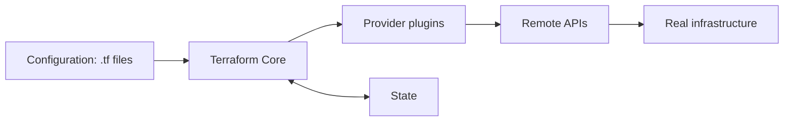

In Azure terms:

- `.tf` configuration is comparable to a reviewed architectural declaration, not a sequence of portal clicks.
- The AzureRM provider is the adapter that knows Azure resource schemas and API operations.
- State is Terraform's durable mapping and cached metadata. It is not an Azure deployment template and not merely a cache you can casually delete.
- A plan is a proposed reconciliation, not a deployment.
- Apply asks providers to perform the approved changes and then records completed results.

## 1.2 Why Infrastructure as Code

IaC turns infrastructure intent into versionable text. This enables review, reuse, repeatability, automation, and a plan before change. It also makes ownership explicit: a configuration and its state together define which Terraform addresses manage which remote objects.

IaC does **not** make changes risk-free. A valid configuration can still propose destructive actions; a stale or exposed state file can still be dangerous; credentials can still be over-privileged. Terraform's safety model depends on reviewing plans, controlling state, constraining versions, and limiting credentials.

### Declarative, not imperative

You normally declare the result:

```hcl
resource "azurerm_resource_group" "platform" {
  name     = "rg-examprep-dev"
  location = "westus2"
}
```

You do not script “call Create Resource Group, then poll, then update.” The provider translates the declared arguments into API operations, Terraform builds the ordering graph, and state records the association.

### Desired state is not Terraform state

These are easy to confuse:

| Representation | Meaning | Example |
|---|---|---|
| Configuration | What you want Terraform to manage | `location = "westus2"` in a `.tf` file |
| State | Terraform's last recorded mapping and attributes | `azurerm_resource_group.platform` → an Azure resource ID |
| Real infrastructure | What Azure currently reports | The live resource group, including out-of-band changes |

Terraform refreshes its view of remote objects during normal planning, compares the refreshed result with configuration, and proposes operations to converge. State is the bridge that makes the comparison addressable.

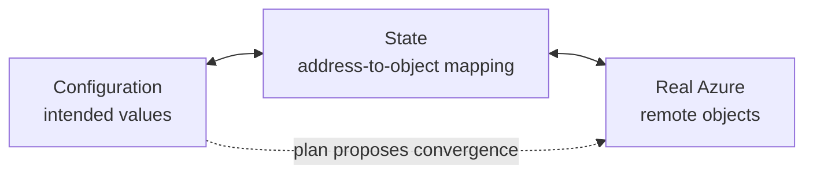

## 1.3 What Terraform is not

- It is not an Azure-only tool.
- It is not the Azure Portal converted to text.
- `terraform init` does not create Azure resources.
- `terraform plan` does not reserve resources or guarantee that a later apply will succeed.
- A data source does not adopt an object into Terraform management.
- Hiding a value with `sensitive = true` does not remove it from state.
- Renaming a resource label is not automatically understood as a rename; without a `moved` block, the address changes.
- Terraform does not automatically roll back all prior successful changes after an apply error.

## 1.4 The three questions to ask before every apply

1. **Which state is selected?** Local file, Azure Blob backend key, CLI workspace, or HCP Terraform workspace?
2. **Which identity and subscription are selected?** The provider acts with the credentials available to the run.
3. **What exact actions does the final plan show?** Read replacements and destroys, not just the summary.

> **Decision rule**  
> IF you cannot answer all three, **STOP** before apply, BECAUSE a correct configuration aimed at the wrong state or Azure scope is still dangerous.

<details>
<summary>Knowledge check: Why does Terraform need state if Azure already knows what exists?</summary>

Azure knows remote objects, but Terraform needs to map each configuration address to a particular remote object, retain metadata such as prior dependencies and provider associations, and avoid querying every object in every API on every operation. State supplies that working record.

</details>

**Official HashiCorp sources:**

- https://developer.hashicorp.com/terraform/intro
- https://developer.hashicorp.com/terraform/language/state/purpose
- https://developer.hashicorp.com/terraform/internals/graph

---

# 2. The mental model that prevents mistakes

## 2.1 Five actors in every run

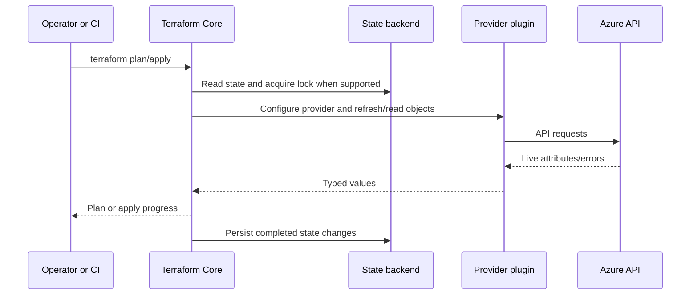

Keep the responsibilities separate:

| Actor | Owns | Does not own |
|---|---|---|
| Operator/automation | Inputs, credentials, approval, selected working directory | Resource schema |
| Terraform Core | HCL evaluation, graph, planning, state protocol, CLI workflow | Azure API details |
| Provider | Resource/data schemas and remote API behavior | Backend storage |
| Backend | Persistent state and sometimes locking | Azure resource lifecycle |
| Azure API | Real resources and authorization decisions | Terraform addresses |

## 2.2 Address, remote ID, and display name

For this block:

```hcl
resource "azurerm_resource_group" "platform" {
  name     = "rg-examprep-dev"
  location = "westus2"
}
```

- `azurerm_resource_group` is the provider-defined **resource type**.
- `platform` is Terraform's local **resource name**.
- `azurerm_resource_group.platform` is the **resource address**.
- `rg-examprep-dev` is an Azure-facing **name argument**.
- The provider returns an Azure **remote ID**, which Terraform records in state.

Changing `platform` to `core` changes the Terraform address even if the Azure `name` remains the same. A `moved` block can declare that address migration. Changing the Azure-facing `name` may update or replace the remote object depending on provider schema and API behavior; the plan is authoritative for that run.

## 2.3 Known now versus known after apply

Terraform evaluates as much as it can during planning. Some values are unknown until a provider creates or reads an object. Plan renders these as `(known after apply)`. Unknown is not an error; it is a value whose shape or content cannot yet be finalized.

This distinction explains important restrictions:

- `count` and `for_each` instance keys must be known before remote operations.
- Provider configuration inputs generally must be known before apply.
- A data source read can be deferred to apply if its arguments depend on unknown values.
- Preconditions can fail before or during apply depending on when their values become known.

## 2.4 The graph, not file order, controls order

Terraform reads all top-level `.tf` files in a module as one configuration. File names help humans; they do not sequence resources. Expressions create graph edges:

```hcl
resource "azurerm_virtual_network" "platform" {
  name                = "vnet-examprep-dev"
  address_space       = ["10.20.0.0/16"]
  location            = azurerm_resource_group.platform.location
  resource_group_name = azurerm_resource_group.platform.name
}
```

Both references to the resource group tell Terraform the VNet depends on it. Independent nodes may run in parallel.

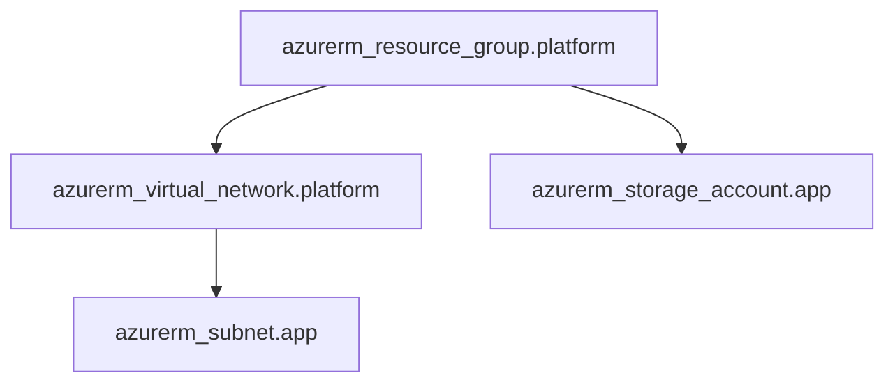

> **Decision rule**  
> IF an expression can express the relationship, **USE the expression**, BECAUSE it supplies both the value and an implicit dependency.  
> IF a dependency exists only through behavior and no expression can represent it, **CONSIDER `depends_on`**, BECAUSE it declares a hidden ordering dependency—but use it as a last resort.

## 2.5 Plan and apply are separate safety boundaries

| Plan | Apply |
|---|---|
| Reads configuration, state, and normally remote objects | Performs remote operations |
| Proposes actions | Executes actions |
| Without `-out`, is speculative | With a saved plan, executes that artifact |
| Can report unknown values | Resolves values as operations complete |
| Does not change normal managed infrastructure | Can create, update, replace, or destroy |

An unsaved interactive `terraform apply` creates a new plan immediately before asking for approval. In automation, create a saved plan with `terraform plan -out=tfplan`, review that exact plan, and then pass it to `terraform apply tfplan`. A saved plan can contain sensitive values; protect it as carefully as state.

<details>
<summary>Knowledge check: You put `network.tf` before `resource-group.tf`. Will the VNet be created first?</summary>

No. Top-level file order does not control the operation graph. References such as `resource_group_name = azurerm_resource_group.platform.name` create the dependency.

</details>

**Official HashiCorp sources:**

- https://developer.hashicorp.com/terraform/language/files
- https://developer.hashicorp.com/terraform/internals/graph
- https://developer.hashicorp.com/terraform/cli/commands/plan
- https://developer.hashicorp.com/terraform/cli/commands/apply

---

# 3. Install and authenticate to Azure

## 3.1 Install Terraform

The reviewed install page lists Terraform 1.16.1 and the language documentation labels v1.16.x as latest. Use the official install page for the current package instructions and downloads.

macOS with Homebrew:

```bash
brew tap hashicorp/tap
brew install hashicorp/tap/terraform
```

Linux: the official install page provides current repository instructions for Ubuntu/Debian, CentOS/RHEL, Fedora, Amazon Linux, and Homebrew. Follow the commands on that page so repository keys and release channels remain current, then verify the installation as shown below.

Windows: the official page provides AMD64, ARM64, and 386 ZIP downloads. Extract `terraform.exe` into a directory on `PATH`.

Verify:

```console
terraform version
terraform -help
```

Use the same supported Terraform line locally and in CI. The configuration's `required_version` makes this expectation executable.

## 3.2 Azure prerequisites and local authentication

The official Azure getting-started path uses the Azure CLI. Install it, then:

```console
az login
az account show
az account list --output table
az account set --subscription "<SUBSCRIPTION_ID_OR_NAME>"
```

For a local learning session, Azure CLI authentication is the shortest path. The tutorial also documents service-principal credentials exposed as environment variables:

PowerShell:

```powershell
$Env:ARM_CLIENT_ID       = "<APPLICATION_CLIENT_ID>"
$Env:ARM_CLIENT_SECRET   = "<CLIENT_SECRET>"
$Env:ARM_SUBSCRIPTION_ID = "<SUBSCRIPTION_ID>"
$Env:ARM_TENANT_ID       = "<TENANT_ID>"
```

Bash:

```bash
export ARM_CLIENT_ID="<APPLICATION_CLIENT_ID>"
export ARM_CLIENT_SECRET="<CLIENT_SECRET>"
export ARM_SUBSCRIPTION_ID="<SUBSCRIPTION_ID>"
export ARM_TENANT_ID="<TENANT_ID>"
```

Do not put these credentials in `.tf` files or commit them. For HCP Terraform production runs, prefer dynamic provider credentials: HCP Terraform uses OIDC to obtain fresh, temporary Azure credentials for each operation, and discards them when the run environment is torn down.

### Authentication decision guide

| Situation | Use or consider | Because |
|---|---|---|
| Developer learning locally | Azure CLI authentication | It is the documented local tutorial path |
| HCP Terraform run | Dynamic Azure provider credentials | Per-run temporary credentials reduce static-secret exposure |
| Non-HCP CI | The identity mechanism documented for that provider/runtime | Credential details are provider-specific; avoid hardcoding |
| Azure Blob backend | Microsoft Entra ID; OIDC/workload identity where available | The backend docs recommend Entra ID and OIDC for new workloads |

> IF you are choosing a production AzureRM authentication flow outside the HCP Terraform and Azure backend cases described here, **consult the selected provider's documentation**. Detailed precedence among all AzureRM provider authentication mechanisms is **Not explicitly documented in the reviewed official HashiCorp source.**

## 3.3 Create a clean working directory

```powershell
New-Item -ItemType Directory -Path learn-terraform-azure
Set-Location learn-terraform-azure
```

Terraform combines all top-level `.tf` files in this directory into the **root module**. A nested directory is a separate module; Terraform does not recursively merge it into the parent.

Recommended project files as the example grows:

```text
learn-terraform-azure/
├── terraform.tf          # required versions and providers
├── providers.tf          # provider configurations
├── variables.tf          # root inputs
├── locals.tf             # shared expressions
├── main.tf               # resources/data, initially
├── network.tf            # split out when useful
├── storage.tf            # split out when useful
├── outputs.tf            # root outputs
├── backend.tf            # remote backend later
├── terraform.tfvars      # non-secret environment values
├── .terraform.lock.hcl   # commit
└── .gitignore
```

Do not commit `.terraform/`, `*.tfstate*`, saved plans, lock-info files, or secret-bearing `.tfvars`. Do commit `.tf` files, `.terraform.lock.hcl`, `.gitignore`, and a README.

## 3.4 Minimum version/provider configuration

Create `terraform.tf`:

```hcl
terraform {
  required_version = ">= 1.10, < 2.0"

  required_providers {
    azurerm = {
      source  = "hashicorp/azurerm"
      version = "~> 4.0"
    }
  }
}
```

Create `providers.tf`:

```hcl
provider "azurerm" {
  features {}
}
```

`required_providers` tells Terraform which provider package and versions the module accepts. The `provider` block configures an instance of that provider. Terraform Core and provider versions are separate axes.

The `~> 4.0` constraint accepts AzureRM 4.x releases but not 5.0. The dependency lock file will record the particular selected version and checksums after initialization. The reviewed HashiCorp Azure example installed AzureRM 4.56.0; do not treat that observation as a permanent “latest” promise.

**Official HashiCorp sources:**

- https://developer.hashicorp.com/terraform/install
- https://developer.hashicorp.com/terraform/tutorials/azure-get-started/azure-build
- https://developer.hashicorp.com/terraform/tutorials/configuration-language/actions
- https://developer.hashicorp.com/terraform/cloud-docs/dynamic-provider-credentials
- https://developer.hashicorp.com/terraform/language/style

---

# 4. Your first complete Azure workflow

This chapter deliberately starts with one resource group. Small scope makes the workflow visible.

## 4.1 Write

Create `variables.tf`:

```hcl
variable "project" {
  type        = string
  description = "Short project identifier used in Azure resource names."
  default     = "examprep"

  validation {
    condition     = length(var.project) >= 3
    error_message = "project must contain at least three characters."
  }
}

variable "environment" {
  type        = string
  description = "Deployment environment."
  default     = "dev"

  validation {
    condition     = contains(["dev", "test", "prod"], var.environment)
    error_message = "environment must be dev, test, or prod."
  }
}

variable "location" {
  type        = string
  description = "Azure location for regional resources."
  default     = "westus2"
}
```

Create `locals.tf`:

```hcl
locals {
  name_prefix = "${var.project}-${var.environment}"

  common_tags = {
    environment = var.environment
    managed_by  = "terraform"
    project     = var.project
  }
}
```

Create `main.tf`:

```hcl
resource "azurerm_resource_group" "platform" {
  name     = "rg-${local.name_prefix}"
  location = var.location
  tags     = local.common_tags
}
```

Create `outputs.tf`:

```hcl
output "resource_group_id" {
  description = "Azure resource ID of the managed resource group."
  value       = azurerm_resource_group.platform.id
}

output "resource_group_name" {
  description = "Name of the managed resource group."
  value       = azurerm_resource_group.platform.name
}
```

## 4.2 Initialize

```console
terraform init
```

What changes:

- **Local working directory:** Terraform initializes backend metadata in `.terraform/`, downloads the provider, and creates or updates `.terraform.lock.hcl`.
- **Azure:** no managed Azure resources are created.
- **State:** the backend is initialized; there is not yet a managed resource instance.

`init` is safe to repeat. Run it for a new/cloned directory and after changing backend, module, or provider requirements. Use `terraform init -upgrade` only when you intentionally want newer acceptable providers/modules; review and commit the lock-file change.

## 4.3 Format and validate

```console
terraform fmt -recursive
terraform validate
```

`fmt` rewrites configuration into Terraform's canonical style. `validate` checks syntax and internal consistency; it does not evaluate remote state and does not prove provider-specific argument values are valid against Azure. Run both before commit and in CI. For CI formatting, use `terraform fmt -check -recursive` so the job checks rather than edits.

What changes:

- **Local:** `fmt` may modify `.tf` files; `validate` should not.
- **Azure:** nothing.
- **State:** nothing.

## 4.4 Plan

```console
terraform plan
```

Expected shape on the first run:

```text
  + create

Plan: 1 to add, 0 to change, 0 to destroy.
```

Terraform reads configuration and state, asks the provider to read relevant remote objects, then proposes actions. Read:

- the selected workspace/backend context;
- each address and action symbol;
- arguments that are changing;
- every `forces replacement` indication;
- the summary and output changes.

Plan symbols commonly seen are `+` create, `~` update in place, `-` destroy, and `-/+` or `+/-` replacement ordering. Treat the actual plan output as authoritative.

What changes:

- **Local:** provider/backend caches may be used; an unsaved plan is not persisted as an approval artifact.
- **Azure:** normal managed infrastructure is not changed, though providers may perform reads.
- **State:** Terraform normally refreshes its in-memory view; a normal speculative plan is not an apply.

## 4.5 Apply

For learning:

```console
terraform apply
```

Review the newly generated plan. Only type `yes` if it targets the right subscription and the actions are expected.

For a controlled handoff:

```console
terraform plan -out=tfplan
terraform show tfplan
terraform apply tfplan
```

What changes:

- **Local:** a saved `tfplan` exists if requested; treat it as sensitive and do not commit it.
- **Azure:** the AzureRM provider asks Azure to create the resource group.
- **State:** after successful remote operations, Terraform records the resource address, ID, and attributes. If a later operation fails, successfully completed changes remain and state is updated for them; Terraform does not automatically roll them back.

## 4.6 Inspect state and outputs

```console
terraform state list
terraform state show azurerm_resource_group.platform
terraform show
terraform output
terraform output -raw resource_group_name
```

These commands answer different questions:

| Command | Question answered |
|---|---|
| `state list` | Which addresses are tracked? |
| `state show ADDRESS` | What state attributes exist for one instance? |
| `show` | What does the latest state snapshot contain? |
| `output` | What root output contract is exposed? |
| `show -json` / `output -json` | What machine-readable values are available? |

JSON/raw modes can reveal sensitive values in plaintext. Never paste their output into public logs.

## 4.7 Change, re-plan, apply

Change `common_tags`:

```hcl
locals {
  name_prefix = "${var.project}-${var.environment}"

  common_tags = {
    environment = var.environment
    managed_by  = "terraform"
    owner       = "platform-team"
    project     = var.project
  }
}
```

Then:

```console
terraform fmt
terraform validate
terraform plan
terraform apply
```

Expect an in-place update if the selected provider schema and Azure API support it. Do not memorize that as universal: the plan tells you whether a particular argument update is in-place or replacement.

## 4.8 Add a VNet and subnet

Create `network.tf`:

```hcl
variable "vnet_address_space" {
  type        = list(string)
  description = "CIDR blocks for the virtual network."
  default     = ["10.20.0.0/16"]
}

variable "subnets" {
  type        = map(list(string))
  description = "Subnet name to CIDR-prefix list. Keys are stable resource identities."
  default = {
    app  = ["10.20.1.0/24"]
    data = ["10.20.2.0/24"]
  }
}

resource "azurerm_virtual_network" "platform" {
  name                = "vnet-${local.name_prefix}"
  address_space       = var.vnet_address_space
  location            = azurerm_resource_group.platform.location
  resource_group_name = azurerm_resource_group.platform.name
  tags                = local.common_tags
}

resource "azurerm_subnet" "this" {
  for_each = var.subnets

  name                 = "snet-${each.key}"
  resource_group_name  = azurerm_resource_group.platform.name
  virtual_network_name = azurerm_virtual_network.platform.name
  address_prefixes     = each.value
}
```

The references automatically form `resource group → VNet → subnets`. The subnet instances have stable key-based addresses:

```text
azurerm_subnet.this["app"]
azurerm_subnet.this["data"]
```

## 4.9 Add storage

Create `storage.tf`:

```hcl
resource "azurerm_storage_account" "app" {
  name                     = "st${replace(local.name_prefix, "-", "")}001"
  resource_group_name      = azurerm_resource_group.platform.name
  location                 = azurerm_resource_group.platform.location
  account_tier             = "Standard"
  account_replication_type = "LRS"
  tags                     = local.common_tags
}
```

Storage account naming and SKU constraints are provider/API concerns. The shown argument structure is grounded in the allowed HashiCorp documentation. Whether this generated name is available and valid in your Azure context is determined during provider validation/API execution; globally unique names can collide.

Add outputs:

```hcl
output "subnet_ids" {
  description = "Subnet IDs keyed by logical subnet name."
  value       = { for key, subnet in azurerm_subnet.this : key => subnet.id }
}

output "storage_account_id" {
  description = "Azure resource ID of the storage account."
  value       = azurerm_storage_account.app.id
}
```

Plan again. The resource group should remain, while Terraform proposes the VNet, two keyed subnets, and storage account.

## 4.10 Destroy the lab

Preview first:

```console
terraform plan -destroy
```

Then, only for an intentionally disposable lab:

```console
terraform destroy
```

`terraform destroy` is a convenience alias for `terraform apply -destroy`. It deprovisions all objects managed by the selected configuration/state. It is not a cleanup command for “whatever happens to be in the resource group”; it operates on the managed addresses in the selected state, with dependency ordering. Review the destroy plan.

### Phase 1 exercise

1. Deploy only the resource group.
2. Capture `terraform state list` and `terraform output`.
3. Add the owner tag and predict the plan before running it.
4. Add the VNet and subnets.
5. Remove only the `data` key from `var.subnets` and predict the address Terraform will destroy.
6. Restore it, apply, then destroy the lab.

<details>
<summary>Answer</summary>

Removing `data` removes `azurerm_subnet.this["data"]`. The `app` key retains its address, which is the key stability advantage of `for_each`.

</details>

**Official HashiCorp sources:**

- https://developer.hashicorp.com/terraform/tutorials/azure-get-started/azure-build
- https://developer.hashicorp.com/terraform/tutorials/azure-get-started/azure-change
- https://developer.hashicorp.com/terraform/tutorials/azure-get-started/azure-variables
- https://developer.hashicorp.com/terraform/tutorials/azure-get-started/azure-outputs
- https://developer.hashicorp.com/terraform/tutorials/configuration-language/actions
- https://developer.hashicorp.com/terraform/mcp-server/prompt
- https://developer.hashicorp.com/terraform/cli/commands/init
- https://developer.hashicorp.com/terraform/cli/commands/destroy
- https://developer.hashicorp.com/terraform/cli/commands/show
- https://developer.hashicorp.com/terraform/cli/commands/state/list
- https://developer.hashicorp.com/terraform/cli/commands/output

---

# 5. HCL and configuration structure

## 5.1 Blocks, arguments, and expressions

Terraform's native syntax is HCL. Most configuration is made from **blocks** and **arguments**:

```hcl
resource "azurerm_resource_group" "platform" { # block type + two labels
  name     = "rg-${local.name_prefix}"          # argument = expression
  location = var.location

  lifecycle {                                   # nested block
    prevent_destroy = true
  }
}
```

- A block has a type, zero or more labels, and a body.
- An argument assigns an expression to a name.
- An expression produces a value: a literal, reference, function call, conditional, collection transform, or composition of these.
- The meaning of a provider resource's arguments and nested blocks comes from that provider's schema.

Terraform supports `#`, `//`, and `/* ... */` comments. HashiCorp's style guide recommends `#`. `terraform fmt` applies canonical formatting, including two-space nesting.

## 5.2 Files and modules

Terraform evaluates the `.tf` and `.tf.json` files in one directory as a module. Files must use UTF-8. File boundaries do not create namespaces and do not affect dependency order.

- The directory where you run Terraform is the **root module**.
- A module called from the root is a **child module**.
- A child can call more children, but flatter composition is usually easier to understand.
- Nested directories are separate modules only when explicitly called; Terraform does not automatically descend into them.

The recommended file names (`terraform.tf`, `providers.tf`, `variables.tf`, `main.tf`, `outputs.tf`) are conventions for readers, not language requirements.

## 5.3 Primitive and structural values

The language works with values, not text substitution. Important types are:

| Kind | Examples | Notes |
|---|---|---|
| `string` | `"westus2"` | Interpolation works inside quoted strings |
| `number` | `3`, `1.5` | One numeric type; constraints can require it |
| `bool` | `true`, `false` | Use for conditions and feature switches |
| `list(T)` / tuple | `["app", "data"]` | Ordered; list elements share a type |
| `set(T)` | `toset(["app", "data"])` | Unordered unique elements; useful for `for_each` |
| `map(T)` / object | `{ app = "10.20.1.0/24" }` | Keys address values; objects can have per-attribute types |
| `null` | `null` | Absence/omission behavior depends on context |
| unknown | `(known after apply)` | Placeholder during planning, not an HCL literal |
| sensitive | redacted rendering | A value mark; it can still be stored |
| ephemeral | runtime-only | Omitted from plan/state and restricted to ephemeral contexts |

Use explicit variable type constraints to give callers fast, local feedback:

```hcl
variable "service" {
  type = object({
    sku          = string
    instance_count = optional(number, 1)
    private      = optional(bool, true)
  })
  description = "Application service settings."
}
```

## 5.4 Strings and templates

```hcl
locals {
  resource_group_name = "rg-${var.project}-${var.environment}"

  description = <<-EOT
    Managed by Terraform.
    Environment: ${var.environment}
  EOT
}
```

Quoted strings support interpolation with `${...}` and escape sequences. Heredoc syntax handles multi-line strings; the indented form `<<-EOT` trims shared leading whitespace.

Prefer direct expressions when the entire value is a reference:

```hcl
location = azurerm_resource_group.platform.location
```

not:

```hcl
location = "${azurerm_resource_group.platform.location}"
```

## 5.5 Collections, conditionals, and `for` expressions

Conditional syntax is `condition ? true_value : false_value`. The two result arms must resolve to compatible types; explicit conversions make intent clearer when automatic conversion would be surprising.

```hcl
locals {
  replication = var.environment == "prod" ? "GRS" : "LRS"

  normalized_subnets = {
    for name, prefixes in var.subnets : lower(name) => prefixes
  }

  nonempty_subnets = {
    for name, prefixes in var.subnets : name => prefixes
    if length(prefixes) > 0
  }
}
```

A `for` expression transforms one collection value into another and can filter with `if`. A list/tuple result uses `[]`; an object result uses `{ key => value }`. Duplicate object keys normally fail; grouping mode (`...`) collects values by key.

## 5.6 Splat and dynamic blocks

Splat expressions are concise for lists of resource instances:

```hcl
# A list if the resource uses count.
azurerm_network_interface.app[*].id
```

For `for_each` resources, the resource value is a map, so a `for` expression is usually clearer:

```hcl
[for nic in azurerm_network_interface.app : nic.id]
```

A `dynamic` block generates repeated **nested blocks**; it does not generate top-level resources or arbitrary arguments:

```hcl
dynamic "example_nested_block" {
  for_each = var.rules
  content {
    name = example_nested_block.value.name
  }
}
```

Use it only when the target provider resource expects repeatable nested blocks. Literal blocks are easier to read when repetition is small and fixed.

## 5.7 Useful built-in functions

Terraform includes built-in functions; configuration cannot define new ones. Some providers can expose provider-defined functions. Use `terraform console` to experiment with expressions.

| Need | Common functions | Azure-oriented example |
|---|---|---|
| Normalize text | `lower`, `upper`, `trimspace`, `replace` | `lower(replace(local.name_prefix, "-", ""))` |
| Compose text | `format`, `join` | `format("rg-%s-%s", var.project, var.environment)` |
| Inspect/merge collections | `length`, `keys`, `values`, `merge`, `lookup` | `merge(local.common_tags, var.extra_tags)` |
| Normalize types | `toset`, `tolist`, `tomap`, `tostring` | `toset(var.subnet_names)` |
| Flatten/nest | `flatten`, `setproduct` | generate region/environment combinations |
| Encode API/config data | `jsonencode`, `yamlencode` | encode an application settings object |
| Files/templates | `file`, `fileexists`, `fileset`, `templatefile` | render a cloud-init/config template |
| CIDR math | `cidrsubnet`, `cidrhost`, `cidrnetmask` | derive subnet CIDRs from a VNet CIDR |
| Defensive expressions | `can`, `try` | probe optional shapes during normalization |
| Sensitivity | `sensitive`, `nonsensitive` | mark or deliberately remove a sensitive mark |

`file` and related functions read files that already exist at the beginning of a run; functions do not participate as graph nodes. Use them for configuration artifacts, not files another resource will create during the same apply.

## 5.8 Operator and collection habits

- Use parentheses where mixed operators could make intent unclear.
- Prefer a map with meaningful stable keys over a positional list when elements become resource identities.
- Normalize flexible caller input once in `locals`, then let resources consume the normalized shape.
- Do not use `try` to suppress genuine resource errors; it is best for localized normalization.
- Use `jsonencode` instead of hand-assembling JSON strings.

### Phase 2 exercise

Change the `subnets` input to objects with `address_prefixes` and `purpose`, then produce a map of only application subnets.

```hcl
variable "subnets" {
  type = map(object({
    address_prefixes = list(string)
    purpose          = string
  }))
}
```

<details>
<summary>Answer</summary>

```hcl
locals {
  application_subnets = {
    for name, subnet in var.subnets : name => subnet
    if subnet.purpose == "application"
  }
}
```

Use `each.value.address_prefixes` in the subnet resource.

</details>

**Official HashiCorp sources:**

- https://developer.hashicorp.com/terraform/language/syntax/configuration
- https://developer.hashicorp.com/terraform/language/files
- https://developer.hashicorp.com/terraform/language/expressions
- https://developer.hashicorp.com/terraform/language/expressions/types
- https://developer.hashicorp.com/terraform/language/expressions/strings
- https://developer.hashicorp.com/terraform/language/expressions/conditionals
- https://developer.hashicorp.com/terraform/language/expressions/for
- https://developer.hashicorp.com/terraform/language/expressions/splat
- https://developer.hashicorp.com/terraform/language/expressions/dynamic-blocks
- https://developer.hashicorp.com/terraform/language/functions
- https://developer.hashicorp.com/terraform/language/style

---

# 6. Terraform Core, providers, resources, and data sources

## 6.1 The `terraform` block

The top-level `terraform` block configures Terraform itself:

```hcl
terraform {
  required_version = ">= 1.10, < 2.0"

  required_providers {
    azurerm = {
      source  = "hashicorp/azurerm"
      version = "~> 4.0"
    }
  }

  backend "azurerm" {}
}
```

It can declare:

- `required_version` for compatible Terraform CLI versions;
- `required_providers` for provider source addresses, local names, version constraints, and aliases used by a child module;
- one `backend` block for state storage, or a `cloud` block for HCP Terraform—not both;
- advanced settings such as `provider_meta` or experimental features when documented.

Terraform settings are evaluated during initialization, so most arguments require constant values rather than normal references or function calls. Backend configuration likewise cannot refer to variables, locals, data sources, or resources.

## 6.2 Provider requirement versus provider configuration

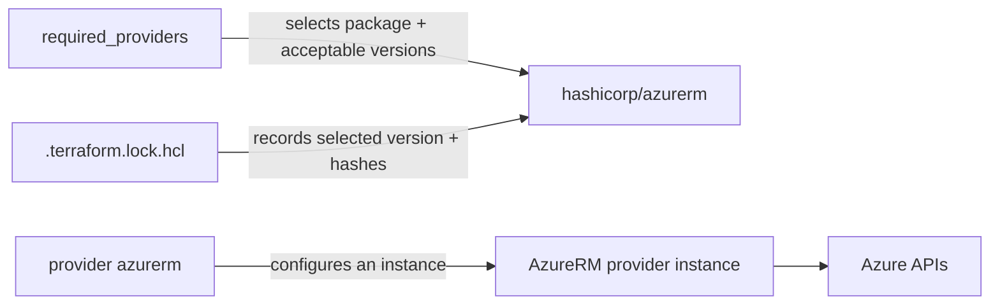

| Concept | Example | Purpose |
|---|---|---|
| Source address | `hashicorp/azurerm` | Identifies a provider package |
| Local provider name | `azurerm` | Name used by resources/configurations in the module |
| Version constraint | `~> 4.0` | Defines acceptable provider releases |
| Lock selection | exact version in `.terraform.lock.hcl` | Makes future initialization repeat the selection |
| Provider configuration | `provider "azurerm" { features {} }` | Supplies settings and credentials context |

The deprecated `version` argument inside a `provider` block should not be used; put provider constraints under `required_providers`.

## 6.3 Default and aliased providers

```hcl
provider "azurerm" {
  features {}
}

provider "azurerm" {
  alias           = "secondary"
  subscription_id = var.secondary_subscription_id
  features {}
}
```

Resources use the default configuration unless directed to an alias:

```hcl
resource "azurerm_resource_group" "dr" {
  provider = azurerm.secondary

  name     = "rg-${local.name_prefix}-dr"
  location = var.secondary_location
}
```

Provider configurations belong in the root module. Child modules declare provider requirements and normally receive configurations from callers. If a child expects an alias, it declares `configuration_aliases`; the caller maps providers explicitly:

```hcl
# Child module terraform.tf
terraform {
  required_providers {
    azurerm = {
      source                = "hashicorp/azurerm"
      configuration_aliases = [azurerm.secondary]
    }
  }
}
```

```hcl
# Root module call
module "regional_platform" {
  source = "./modules/platform"

  providers = {
    azurerm.secondary = azurerm.secondary
  }
}
```

Do not place normal provider configurations inside reusable child modules: it couples configuration lifetime to the module and interferes with module `count`, `for_each`, and `depends_on` compatibility.

## 6.4 Resources

A `resource` block tells Terraform to manage one or more lifecycle-managed objects:

```hcl
resource "azurerm_virtual_network" "platform" {
  name                = "vnet-${local.name_prefix}"
  address_space       = ["10.20.0.0/16"]
  location            = azurerm_resource_group.platform.location
  resource_group_name = azurerm_resource_group.platform.name
}
```

- Arguments are desired settings you supply.
- Attributes are values exposed by the instance; some are computed by the provider.
- The address is type plus local name, plus instance key when `count` or `for_each` is used.

Address forms:

```text
azurerm_resource_group.platform
azurerm_subnet.this["app"]
azurerm_network_interface.app[0]
module.network.azurerm_subnet.this["app"]
module.regional["east"].azurerm_resource_group.platform
```

A resource's normal actions are create, read/refresh, update, and delete. The exact update-versus-replace behavior is provider schema and remote API behavior; read the plan rather than guessing.

## 6.5 Data sources

A `data` block asks a provider to read information without Terraform managing the read object through create/update/delete:

```hcl
data "azurerm_resource_group" "shared" {
  name = var.shared_resource_group_name
}

output "shared_resource_group_location" {
  description = "Location read from the pre-existing shared resource group."
  value       = data.azurerm_resource_group.shared.location
}
```

Terraform tries to read a data source during planning. If its arguments depend on values not yet known, Terraform may defer the read until apply. Referencing a data-source attribute creates a dependency just like referencing a managed resource attribute.

### Resource versus data source

| Question | Managed resource | Data source |
|---|---|---|
| Declared with | `resource` | `data` |
| Main purpose | Create/manage lifecycle | Read existing information |
| Address prefix | `TYPE.NAME` | `data.TYPE.NAME` |
| Stored in state | Managed instance data | Read/cached result metadata |
| Removing block | Proposes destroy by default | Stops the read; does not destroy the external object |
| Imports ownership | Can be import destination | No; reading is not adoption |
| Example | Manage a new resource group | Read a shared resource group |

> IF Terraform should own future lifecycle, **USE a resource** (and import if it already exists), BECAUSE a data source only reads.  
> IF another team/system owns it and you only need attributes, **USE a data source**, BECAUSE it preserves that ownership boundary.

## 6.6 Provider versus backend

| Provider | Backend |
|---|---|
| Interacts with resource APIs | Stores Terraform state |
| Plugin installed by `init` | Built into Terraform |
| Configured with `provider` block | Configured in `terraform { backend ... }` |
| Can have aliases | One backend per configuration |
| Example: AzureRM manages VNets | Example: `azurerm` backend stores a blob |

The AzureRM provider and the `azurerm` backend share a name but have different jobs and authentication settings. A backend cannot create the storage account/container that it needs, because backend initialization happens before normal resources can be planned.

## 6.7 How to read provider documentation

For every provider resource or data source, read in this order:

1. Confirm the provider version selected in `.terraform.lock.hcl`.
2. Confirm the resource/data type and import syntax for that version.
3. Read the example to understand block shape, not to copy names/credentials blindly.
4. Separate required arguments, optional arguments, and nested blocks.
5. Note conflicts, mutual exclusions, and version requirements.
6. Identify exported attributes you can reference.
7. Look for write-only or ephemeral support if secrets are involved.
8. Run `fmt`, `validate`, and a plan; the plan is the change contract.

The general Terraform docs establish how providers and schemas work, but detailed Azure service constraints belong to the AzureRM provider documentation. Those registry pages fall outside this guide's deliberately restricted source domain, so exhaustive AzureRM argument catalogs are not reproduced.

<details>
<summary>Knowledge check: Can the Azure Blob backend use the AzureRM provider block?</summary>

No. Backend initialization happens independently and before provider-managed resources. Configure backend authentication using the backend's documented arguments or environment variables.

</details>

**Official HashiCorp sources:**

- https://developer.hashicorp.com/terraform/language/block/terraform
- https://developer.hashicorp.com/terraform/language/providers/requirements
- https://developer.hashicorp.com/terraform/language/providers/configuration
- https://developer.hashicorp.com/terraform/language/resources/syntax
- https://developer.hashicorp.com/terraform/language/data-sources
- https://developer.hashicorp.com/terraform/cli/state/resource-addressing
- https://developer.hashicorp.com/terraform/language/backend

---

# 7. Values, expressions, dependencies, and lifecycle

## 7.1 Variables, locals, and outputs

| Construct | Direction | Set by | Main use | Stored? |
|---|---|---|---|---|
| Input variable | Into a module | Root caller mechanisms or parent module | Module API | Normally participates in plan/state values; ephemeral can be omitted |
| Local value | Inside a module | Module author expression | Reuse/normalization/naming | Not an independent persisted object |
| Output value | Out of a module | Module author expression | Module contract, CLI/automation access | Root outputs are stored; child outputs can be ephemeral |

### Variables

```hcl
variable "extra_tags" {
  type        = map(string)
  description = "Additional tags merged into every taggable resource."
  default     = {}
  nullable    = false
}
```

Good variable interfaces include a type, description, reasonable default only when truly optional, validation for uniquely restrictive rules, and an explicit sensitivity/ephemerality decision.

Root variable value precedence, highest first:

1. `-var` and `-var-file` options, processed in command-line order; HCP workspace values occupy the remote-run path.
2. `*.auto.tfvars` and `*.auto.tfvars.json`, lexical order.
3. `terraform.tfvars.json`.
4. `terraform.tfvars`.
5. `TF_VAR_name` environment variables.
6. The variable `default`.

If no source supplies a required root variable, Terraform prompts interactively unless input is disabled. Child variables are arguments on the parent `module` block.

### Locals

```hcl
locals {
  tags = merge(local.common_tags, var.extra_tags)
}
```

Use locals to name a repeated or non-trivial expression and normalize data. Avoid a chain of trivial aliases that hides the original input.

### Outputs

```hcl
output "network" {
  description = "Stable network interface exposed to callers."
  value = {
    id         = azurerm_virtual_network.platform.id
    subnet_ids = { for k, v in azurerm_subnet.this : k => v.id }
  }
}
```

Outputs are module APIs. A parent reads `module.network.network.subnet_ids`. Root outputs can be shown with `terraform output` and consumed by automation with `-json` or `-raw`. Expose purposeful contracts, not every provider attribute.

## 7.2 References create implicit dependencies

```hcl
resource_group_name = azurerm_resource_group.platform.name
```

This does two jobs:

1. passes the resource group's name;
2. adds a graph edge, so the dependent operation waits as needed.

An explicit dependency adds only ordering:

```hcl
resource "example_service" "app" {
  # ...
  depends_on = [azurerm_subnet.this]
}
```

| Implicit dependency | Explicit `depends_on` |
|---|---|
| Derived from an expression reference | Written as a static list of references |
| Carries a value and ordering | Carries ordering only |
| Precise and self-documenting | Can make more values conservatively unknown |
| Preferred | Last resort for hidden behavioral dependencies |

## 7.3 `count` versus `for_each`

```hcl
resource "example_probe" "replica" {
  count = var.replica_count
  name  = "probe-${count.index}"
}
```

```hcl
resource "azurerm_subnet" "this" {
  for_each = var.subnets

  name                 = "snet-${each.key}"
  resource_group_name  = azurerm_resource_group.platform.name
  virtual_network_name = azurerm_virtual_network.platform.name
  address_prefixes     = each.value
}
```

| Concern | `count` | `for_each` |
|---|---|---|
| Input | Whole number | Map or set of strings |
| Identity | Numeric index | Map/set key |
| Reference | `thing.x[0]` | `thing.x["app"]` |
| Best fit | Nearly identical instances | Instances with meaningful distinct identity/values |
| Removing middle element | Can shift later list indexes | Other stable keys remain stable |
| Per-instance symbol | `count.index` | `each.key`, `each.value` |
| Mutually combinable on one block | No | No |

Both values must be known before Terraform performs remote operations. `for_each` rejects sensitive values as instance keys because keys are disclosed, and it cannot use impure results for identity. Terraform does not implicitly convert a list to a set for `for_each`; use `toset` only when losing ordering and duplicates is intentional.

> IF instances are almost identical and an index is meaningful, **CONSIDER `count`**.  
> IF instances have durable names or distinct values, **USE `for_each`**, BECAUSE keys form stable addresses.  
> IF a list may have insertions/removals in the middle, **PREFER a keyed map**, BECAUSE positional identity can cause unrelated address churn.

## 7.4 Lifecycle meta-arguments

Lifecycle rules change how Terraform handles resource operations:

```hcl
resource "example_service" "app" {
  # ... provider arguments ...

  lifecycle {
    create_before_destroy = true

    precondition {
      condition     = var.environment != "prod" || var.replica_count >= 2
      error_message = "Production requires at least two replicas."
    }
  }
}
```

### `create_before_destroy`

When a change requires replacement, create the new object before destroying the old one. This can fail when remote naming/uniqueness constraints prevent coexistence. Terraform propagates the behavior to dependencies when required by the graph.

### `prevent_destroy`

Rejects a plan that would destroy a configured resource. Use sparingly: it also blocks legitimate replacement. It protects only while the resource block remains in configuration; removing the block removes the rule.

### `ignore_changes`

Tell Terraform not to react to specified attribute differences during update planning. It can represent shared management, but it also hides drift for those attributes. Do not use it as a universal “make plan quiet” switch.

### `replace_triggered_by`

Replace a resource when referenced managed-resource changes occur. It accepts resource expressions, not arbitrary plain values. If replacement should follow an ordinary value, the documentation describes routing that value through a managed resource designed for this purpose.

### Preconditions and postconditions

- A **precondition** validates an assumption before Terraform proceeds with the enclosing object/output operation.
- A **postcondition** validates a result and can prevent dependent resources from proceeding when it fails.
- Variable validation checks an input; pre/postconditions check contextual assumptions/results; `check` blocks perform non-blocking continuous assertions after plan/apply.

### Current action triggers

Terraform v1.16 documentation includes provider-defined `action` blocks and lifecycle `action_trigger` rules that can invoke non-CRUD operations at configured events. This is an advanced capability and provider support is required. It does not replace the basic resource lifecycle. Keep action side effects explicit and review them in plans.

## 7.5 Lifecycle decision guide

| If | Use/consider | Because / caution |
|---|---|---|
| Replacement downtime is unacceptable and duplicates are allowed | `create_before_destroy` | Reverses replacement order; verify naming/capacity constraints |
| Accidental deletion would be catastrophic | `prevent_destroy` plus external controls | Terraform guard is helpful but disappears if block is removed |
| Another controller intentionally owns one field | Narrow `ignore_changes` | Documents shared ownership; broad ignores conceal drift |
| Replacement must follow a managed object's change | `replace_triggered_by` | Encodes that replacement relationship |
| Input has a module-wide rule | Variable validation | Fails near the API boundary |
| Resource assumption/result needs validation | pre/postcondition | Evaluated in lifecycle context |
| Health assertion should warn without blocking | `check` | Reports failure without stopping the operation |

<details>
<summary>Knowledge check: Why can `depends_on` make a plan less precise?</summary>

It declares a broad hidden dependency without showing which attribute is needed. Terraform may therefore treat more downstream values as unknown until the dependency completes. Direct expression references give the graph finer information.

</details>

**Official HashiCorp sources:**

- https://developer.hashicorp.com/terraform/language/values/variables
- https://developer.hashicorp.com/terraform/language/block/variable
- https://developer.hashicorp.com/terraform/language/values/locals
- https://developer.hashicorp.com/terraform/language/values/outputs
- https://developer.hashicorp.com/terraform/language/block/output
- https://developer.hashicorp.com/terraform/language/meta-arguments/count
- https://developer.hashicorp.com/terraform/language/meta-arguments/for_each
- https://developer.hashicorp.com/terraform/language/meta-arguments/depends_on
- https://developer.hashicorp.com/terraform/language/meta-arguments/lifecycle
- https://developer.hashicorp.com/terraform/language/validate

---

# 8. State, backends, remote state, and locking

## 8.1 State is an ownership map

The most useful simplification is:

```text
Terraform address  <->  remote object ID
```

State also stores attributes, provider association, dependency metadata needed for objects no longer present in configuration, output values, and format/version metadata. It improves performance and enables Terraform to decide what a configuration address already manages.

Terraform expects a one-to-one binding: one resource instance address maps to one remote object, and one remote object should not be bound to multiple addresses. Violating that assumption can produce surprising behavior.

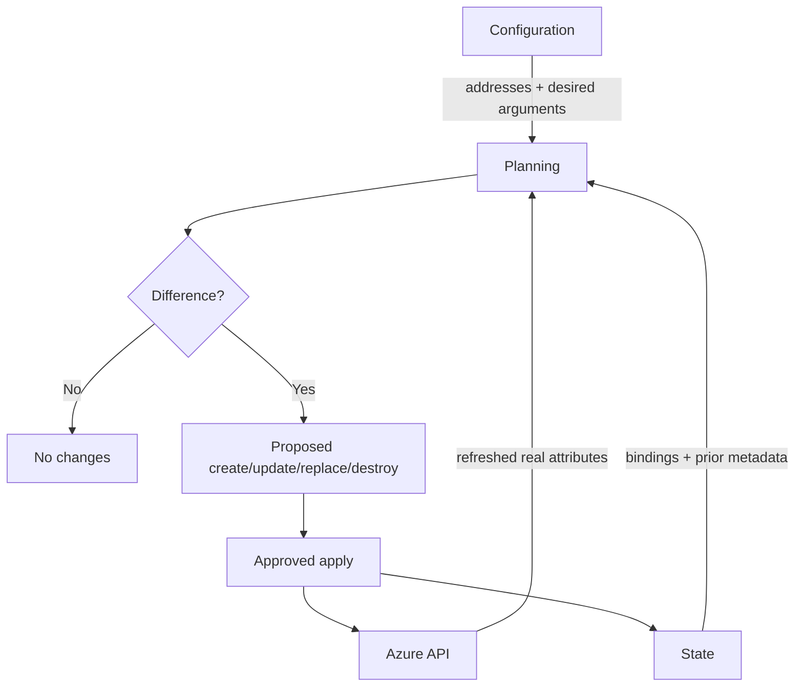

## 8.2 Local state

Without another backend, Terraform stores state locally in `terraform.tfstate` and writes a backup when replacing it. Local state is convenient for disposable individual learning, but a shared team needs durable access control, backups, and concurrency safety.

Never:

- commit state to version control;
- hand-edit the JSON;
- assume `sensitive` values are encrypted in local state;
- copy state between environments to “clone” infrastructure;
- delete state to make Terraform forget a problem.

Use `terraform show -json` for a documented machine-readable representation. Terraform's raw state JSON is an internal format subject to change.

## 8.3 Backend responsibilities

A backend determines where Terraform stores state. Some backends also support state locking. Backend configuration is initialized before normal evaluation and is not managed by the AzureRM provider.

| Local state | Remote state |
|---|---|
| File on operator disk | Stored in a remote system |
| Simple for solo lab | Suitable for shared workflows when access is controlled |
| Local process locking | Backend-dependent distributed locking |
| Backup is your responsibility | Backend may offer versioning/recovery capabilities |
| Easy to accidentally expose/lose | Centralizes state but still contains sensitive data |

HashiCorp recommends HCP Terraform or a remote backend for team use. Choose one that supports locking and protect access to the state as access to infrastructure secrets/metadata.

## 8.4 Azure Blob backend

The `azurerm` backend stores state as a blob and supports state locking and consistency checks using Azure Blob Storage capabilities. The storage account and container must exist before `terraform init` can use them.

`backend.tf`:

```hcl
terraform {
  backend "azurerm" {
    use_azuread_auth     = true
    tenant_id            = "00000000-0000-0000-0000-000000000000"
    storage_account_name = "sttfstateexample"
    container_name       = "tfstate"
    key                  = "examprep/dev/platform.tfstate"
  }
}
```

Use partial configuration to keep environment-specific settings out of reusable code:

```hcl
terraform {
  backend "azurerm" {}
}
```

Then supply a non-secret file:

```hcl
# environments/dev.azurerm.tfbackend
use_azuread_auth     = true
tenant_id            = "00000000-0000-0000-0000-000000000000"
storage_account_name = "sttfstateexample"
container_name       = "tfstate"
key                  = "examprep/dev/platform.tfstate"
```

```console
terraform init -backend-config=environments/dev.azurerm.tfbackend
```

The backend docs recommend Microsoft Entra ID. For workload environments, use OIDC/workload identity where the documented runner supports it; Azure CLI authentication is recommended by that backend page for local development. Grant the minimum state-container permissions; the documented role for direct data-plane access is Storage Blob Data Contributor scoped as narrowly as possible.

Avoid backend secrets in configuration or `-backend-config`: Terraform can retain backend configuration in `.terraform/` and saved plan files. Prefer environment variables for credentials.

### Provider versus backend authentication

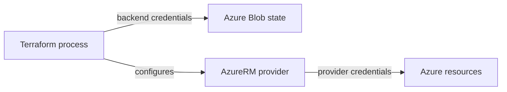

These two identities may be the same or different, but their responsibilities and least-privilege scopes differ. The backend identity needs state blob access; the provider identity needs permissions for managed Azure resources.

## 8.5 Backend initialization and migration

After adding/changing backend configuration:

```console
terraform init -migrate-state
```

Use `-migrate-state` when intentionally moving existing state and review the prompts. Use `-reconfigure` to disregard the previously initialized backend settings without migrating state. Do not treat them as interchangeable.

Before migration:

1. Identify the current backend and workspace.
2. Back up state using the backend's supported recovery path and/or `terraform state pull` with appropriately protected output.
3. Provision and authorize the destination backend.
4. Stop concurrent runs.
5. Initialize with migration, then verify `state list` and a no-op plan.

## 8.6 Locking and concurrency

If the backend supports locking, Terraform automatically locks state for operations that can write it. If lock acquisition fails, Terraform stops rather than racing another writer.

- Do not use `-lock=false` for routine work.
- Use `-lock-timeout=DURATION` when a short wait is appropriate.
- Investigate the owner/process before unlocking.
- Run `terraform force-unlock LOCK_ID` only for your own stale lock. It removes a lock; it does not modify infrastructure.

Two simultaneous applies against one state can each make decisions from stale information. Locking serializes state mutation; it does not replace pipeline concurrency controls or good state boundaries.

## 8.7 State inspection and safe manipulation

Read-only first:

```console
terraform state list
terraform state show 'azurerm_subnet.this["app"]'
terraform show
terraform output
terraform providers
```

State-changing commands are advanced:

```console
terraform state mv SOURCE DESTINATION
terraform state rm ADDRESS
terraform state replace-provider FROM_PROVIDER TO_PROVIDER
```

Prefer configuration-driven `moved`, `removed`, and `import` blocks when they can express the operation: they are reviewable and repeatable. State CLI commands create backups where supported, but a backup does not make an incorrect target safe.

Never use `terraform state push` casually. It can overwrite remote state and is a disaster-recovery tool requiring exact provenance and coordination.

## 8.8 Remote state data sharing

`terraform_remote_state` reads root outputs from another configuration's latest state snapshot. The consumer must be able to access the state backend, and access to outputs can imply access to the full state snapshot. Sensitive output markings do not create a security boundary.

| Need | Prefer | Why |
|---|---|---|
| One stack needs a stable non-secret value | Publish it through a purpose-built provider-managed store | Decouples consumers from state access |
| HCP Terraform workspace-to-workspace outputs | `tfe_outputs` where applicable | HashiCorp recommends it over raw state access |
| Temporary/simple integration with controlled access | `terraform_remote_state` | Convenient, but grant state access deliberately |

Output only stable contracts. Do not make one state expose an entire provider resource object when consumers only need a subnet ID.

## 8.9 Drift

Drift is a difference between the live remote object and the configuration/state model, often caused by portal/CLI changes or external controllers.

Normal `terraform plan` refreshes remote objects, then proposes convergence to configuration. The important three-way view is:

```text
Configuration: intended owner-controlled value
State: Terraform's refreshed mapping/snapshot
Real Azure: live API value
```

Use refresh-only mode when the intentional goal is to accept remote changes into state and outputs without changing remote infrastructure:

```console
terraform plan -refresh-only
terraform apply -refresh-only
```

Review carefully: accepting drift means changing Terraform's recorded view, not necessarily updating configuration to explain long-term intent. A normal subsequent plan may still propose convergence if configuration disagrees.

### State decision guide

> IF more than one operator or automation runner uses a configuration, **USE a remote locking backend or HCP Terraform**, BECAUSE state must be durable and writes serialized.  
> IF two components have different credentials, lifecycles, owners, or blast radii, **CONSIDER separate states**, BECAUSE a state is an operational boundary.  
> IF you merely want to silence a drifted plan, **DO NOT edit state or add broad ignores first**, BECAUSE you must decide whether configuration or the remote change is authoritative.

### Phase 3 exercise

1. Create a dedicated Azure Blob backend outside the configuration that will use it.
2. Migrate a lab state with `init -migrate-state`.
3. Verify addresses and run a no-op plan.
4. Make a harmless tag change out-of-band, plan, and explain all three representations.
5. Restore through configuration and apply.

<details>
<summary>Knowledge check: Why can the backend storage account not be created by the same configuration that immediately uses it?</summary>

Terraform initializes the backend before it can plan provider-managed resources. The backend must already be reachable for state operations.

</details>

**Official HashiCorp sources:**

- https://developer.hashicorp.com/terraform/language/state
- https://developer.hashicorp.com/terraform/language/state/purpose
- https://developer.hashicorp.com/terraform/language/backend
- https://developer.hashicorp.com/terraform/language/backend/azurerm
- https://developer.hashicorp.com/terraform/language/state/locking
- https://developer.hashicorp.com/terraform/language/state/remote
- https://developer.hashicorp.com/terraform/language/state/remote-state-data
- https://developer.hashicorp.com/terraform/cli/commands/force-unlock
- https://developer.hashicorp.com/terraform/cli/commands/plan

---

# 9. Modules and module design

## 9.1 A module is a directory of Terraform configuration

Every Terraform configuration is a module. The working directory is the root module. A `module` block calls a child module and supplies inputs; the child exposes outputs.

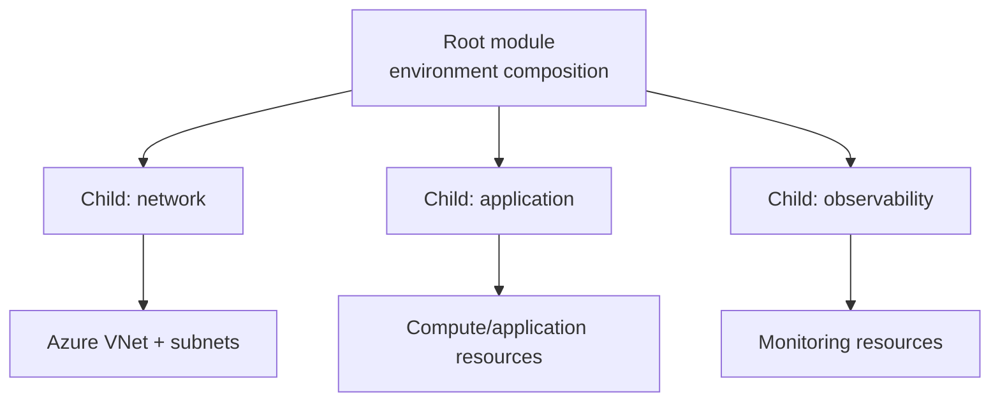

| Root module | Child module |
|---|---|
| Entry point for a Terraform run/state | Called by another module |
| Supplies provider configurations | Declares provider requirements |
| Owns backend or `cloud` settings | Does not configure the caller's backend |
| Assigns environment inputs | Defines a reusable input/output contract |
| Composes components | Encapsulates a cohesive capability |

## 9.2 When to create a module

Create a module when a cohesive group of resources has a useful contract, is repeated, or benefits from independent testing/versioning. Do not create a thin wrapper around every individual resource: a module should raise the abstraction level.

Good boundary signals:

- several resources implement one capability, such as a VNet plus subnets;
- consumers need a stable, smaller API than the provider schema;
- the pattern is reused with meaningful variation;
- ownership and release cadence are clear.

Bad boundary signals:

- the module merely renames every provider argument;
- callers need nearly every internal attribute;
- nested modules mirror the Azure resource hierarchy without adding a contract;
- one “mega-module” controls unrelated systems and therefore one enormous state blast radius.

HashiCorp recommends keeping the module tree relatively flat and composing modules from the root.

## 9.3 A network child module

Structure:

```text
modules/network/
├── README.md
├── main.tf
├── variables.tf
├── outputs.tf
└── terraform.tf
```

`modules/network/terraform.tf`:

```hcl
terraform {
  required_providers {
    azurerm = {
      source  = "hashicorp/azurerm"
      version = ">= 4.0"
    }
  }
}
```

A reusable child module normally sets a minimum compatible provider version and avoids an unnecessary upper bound so it can compose with the root. The root sets the deployment policy and the lock file selects one version.

`modules/network/variables.tf`:

```hcl
variable "name" {
  type        = string
  description = "Virtual network name."
}

variable "location" {
  type        = string
  description = "Azure location."
}

variable "resource_group_name" {
  type        = string
  description = "Resource group that contains the virtual network."
}

variable "address_space" {
  type        = list(string)
  description = "Virtual network CIDR blocks."
}

variable "subnets" {
  type        = map(list(string))
  description = "Subnet names and CIDR-prefix lists."
}

variable "tags" {
  type        = map(string)
  description = "Tags for taggable resources."
  default     = {}
}
```

`modules/network/main.tf`:

```hcl
resource "azurerm_virtual_network" "this" {
  name                = var.name
  address_space       = var.address_space
  location            = var.location
  resource_group_name = var.resource_group_name
  tags                = var.tags
}

resource "azurerm_subnet" "this" {
  for_each = var.subnets

  name                 = "snet-${each.key}"
  resource_group_name  = var.resource_group_name
  virtual_network_name = azurerm_virtual_network.this.name
  address_prefixes     = each.value
}
```

`modules/network/outputs.tf`:

```hcl
output "id" {
  description = "Azure resource ID of the virtual network."
  value       = azurerm_virtual_network.this.id
}

output "subnet_ids" {
  description = "Subnet IDs keyed by caller-provided logical name."
  value       = { for key, subnet in azurerm_subnet.this : key => subnet.id }
}
```

Root call:

```hcl
module "network" {
  source = "./modules/network"

  name                = "vnet-${local.name_prefix}"
  location            = azurerm_resource_group.platform.location
  resource_group_name = azurerm_resource_group.platform.name
  address_space       = var.vnet_address_space
  subnets             = var.subnets
  tags                = local.tags
}
```

The root-to-child arguments create dependencies on the resource group. Consumers use `module.network.id` and `module.network.subnet_ids`, not the child's internal addresses.

## 9.4 Module sources and versions

Module sources can be local paths, registries, version-control repositories, and other documented source forms. The `version` argument applies to registry modules; Terraform ignores it for local modules.

```hcl
module "network" {
  source = "./modules/network"
  # no version for a local source
}
```

For registry modules, pin an intentional version range or release according to your policy. Run `terraform init` after adding or changing a module. `terraform init -upgrade` intentionally revisits acceptable selections.

## 9.5 Module API design checklist

- Inputs describe caller intent, not every internal provider knob.
- Every variable has a type and description.
- Optional values have deliberate defaults; required values do not.
- Validation errors tell the caller how to recover.
- Outputs are minimal, stable, and described.
- Output keys preserve meaningful identity.
- Sensitive or ephemeral status propagates correctly.
- Providers are passed from the root; aliases are declared and mapped.
- README documents purpose, requirements, inputs, outputs, and examples.
- Tests cover contracts and important assertions.
- Refactors use `moved` blocks so upgrades do not destroy objects.

> IF two consumers need the same cohesive pattern, **CONSIDER a module**, BECAUSE a tested contract prevents copy/paste divergence.  
> IF the only benefit is hiding one resource block, **KEEP it in the root for now**, BECAUSE indirection has a maintenance cost.  
> IF components need different credentials, owners, or lifecycles, **SEPARATE their root configurations/state**, not merely child modules, BECAUSE modules inside one root still share one run and state.

### Phase 4 exercise

Move the VNet and subnets from the root into `modules/network`. Before applying, add `moved` blocks in the root so Terraform changes addresses instead of replacing infrastructure:

```hcl
moved {
  from = azurerm_virtual_network.platform
  to   = module.network.azurerm_virtual_network.this
}

moved {
  from = azurerm_subnet.this
  to   = module.network.azurerm_subnet.this
}
```

Run `init`, `validate`, and `plan`. The plan should describe address moves rather than remote destruction. Verify the real plan; do not assume.

<details>
<summary>Knowledge check: Does putting resources in child modules give each child its own state?</summary>

No. All children called by a root configuration participate in that root's run and state. Separate root configurations/backends are needed for separate state boundaries.

</details>

**Official HashiCorp sources:**

- https://developer.hashicorp.com/terraform/language/modules
- https://developer.hashicorp.com/terraform/language/modules/develop
- https://developer.hashicorp.com/terraform/language/modules/develop/structure
- https://developer.hashicorp.com/terraform/language/modules/develop/composition
- https://developer.hashicorp.com/terraform/language/modules/develop/providers
- https://developer.hashicorp.com/terraform/language/block/module
- https://developer.hashicorp.com/terraform/language/style

---

# 10. Import, drift, state repair, and refactoring

## 10.1 Import does not create infrastructure

Import associates an existing remote object with a Terraform resource address. You still need configuration describing the object. After import, plan identifies differences between your configuration and the remote attributes returned by the provider.

| Create through Terraform | Import existing object |
|---|---|
| Configuration has no existing binding | Remote object already exists |
| Plan proposes `+ create` | Plan/apply imports a binding |
| Provider creates remote object | Provider reads specified identity |
| State records new ID | State associates existing ID to address |
| Configuration was the starting intent | Configuration must be reconciled with reality |

## 10.2 Configuration-driven import

Suppose Azure already has a resource group. Write a destination resource:

```hcl
resource "azurerm_resource_group" "legacy" {
  name     = "rg-legacy-prod"
  location = "westus2"
}
```

Add `imports.tf`:

```hcl
import {
  to = azurerm_resource_group.legacy
  id = "/subscriptions/<SUBSCRIPTION_ID>/resourceGroups/rg-legacy-prod"
}
```

Then:

```console
terraform plan
terraform apply
```

The import block is reviewable configuration and can remain as a historical record. A provider may support an `identity` map instead of `id`; the two are mutually exclusive. Import blocks can also use `for_each` and select an aliased provider.

### Generate an initial configuration

If you have an import block but not its matching resource configuration:

```console
terraform plan -generate-config-out=generated_resources.tf
```

Terraform can generate a best-guess configuration for review. Do not apply generated code blindly: simplify it, add types/descriptions/ownership intent, check sensitive values, and plan again. HashiCorp describes generated configuration as experimental.

## 10.3 Imperative CLI import

The CLI form is:

```console
terraform import azurerm_resource_group.legacy "/subscriptions/<SUBSCRIPTION_ID>/resourceGroups/rg-legacy-prod"
```

The destination resource block must already exist. The command imports into state; it does not generate configuration. Prefer configuration-driven imports for normal team workflows because they can be code-reviewed and reproduced.

## 10.4 Bulk search and import

Terraform v1.16 documentation includes provider-supported bulk import:

1. Write `list` blocks that query for existing unmanaged resources.
2. Run the documented query/generation workflow.
3. Review generated `resource` and `import` blocks and resource identities.
4. Apply the reviewed configuration to import.

Bulk search requires provider support for the relevant resource type. It is an adoption accelerator, not an automatic design decision: you must still choose state boundaries, names, module contracts, and ownership.

## 10.5 Import runbook

1. Back up and lock down the target state.
2. Confirm the Azure subscription/tenant and remote ID.
3. Choose one unique Terraform address.
4. Write or generate the destination configuration.
5. Add the import block.
6. Run `fmt`, `validate`, and `plan`.
7. Read every proposed post-import update/replacement.
8. Adjust configuration to match intended ownership.
9. Apply the import.
10. Run a second plan; target a no-op or only explicitly approved changes.

Never bind the same Azure object to two addresses or two states.

## 10.6 Refactoring with `moved`

Without explicit migration, changing an address looks like “old address removed, new address added.” Declare the relationship:

```hcl
moved {
  from = azurerm_resource_group.rg
  to   = azurerm_resource_group.platform
}
```

Moving into a module:

```hcl
moved {
  from = azurerm_virtual_network.platform
  to   = module.network.azurerm_virtual_network.this
}
```

Changing from one instance to keyed instances:

```hcl
moved {
  from = azurerm_storage_account.app
  to   = azurerm_storage_account.app["primary"]
}
```

Terraform checks for the old address and changes the state address before planning the destination. The remote object is not destroyed by the move. Keep moved blocks in reusable modules: removing one can break upgrades for callers skipping intermediate versions.

| Situation | Prefer | Why |
|---|---|---|
| Reviewable rename/refactor | `moved` block | Declarative and repeatable |
| One-time emergency/legacy operation | `terraform state mv` | Direct state operation; coordinate and back up |
| Existing object entering management | `import` block | Creates address-to-object binding |
| Object leaving Terraform but staying live | `removed` block with `destroy = false` | Reviewable handoff |
| Object should be destroyed | Remove resource normally or `removed` with destroy behavior | Keeps destruction visible in plan |

## 10.7 Stop managing without destroying

Replace the resource block with:

```hcl
removed {
  from = azurerm_resource_group.legacy

  lifecycle {
    destroy = false
  }
}
```

Remove references to its attributes, validate, plan, and apply. Terraform removes the binding from state while leaving the Azure object in place. Ownership is now external; a future resource block at that address does not magically re-adopt it.

`terraform state rm` can achieve a one-time removal, but the `removed` block exposes intent in review.

## 10.8 Drift resolution decision tree

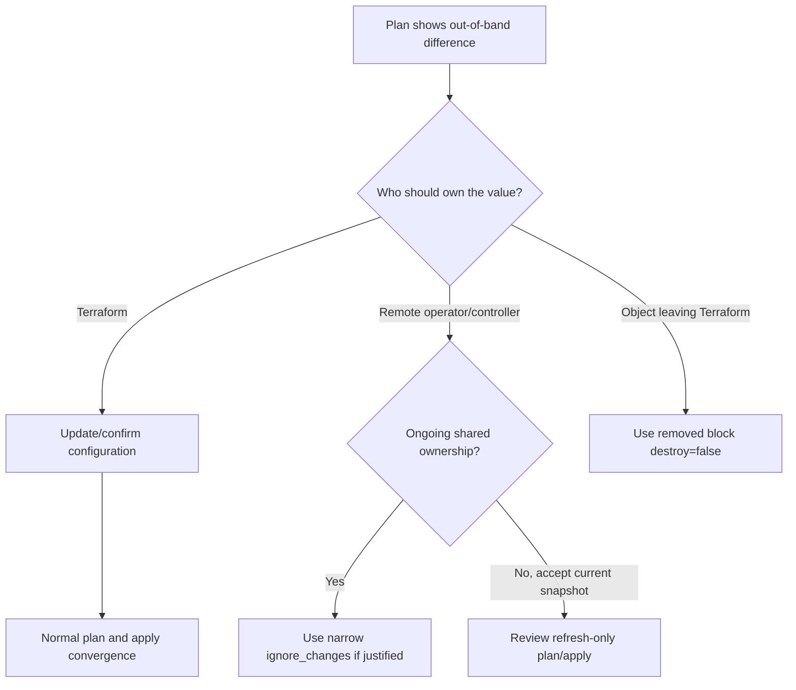

First understand whether drift is authorized. Then choose ownership. A refresh-only operation is not a substitute for updating configuration when Terraform remains authoritative.

### Phase 5 exercise

In a sandbox, create a resource group outside Terraform, import it with a configuration-driven `import` block, reconcile tags, rename its Terraform address with `moved`, and finally hand it off with `removed { lifecycle { destroy = false } }`. At each step, save the plan output and explain configuration, state, and Azure effects.

<details>
<summary>Knowledge check: Does importing an Azure resource protect it from the next apply?</summary>

No. Import creates the state binding. The next plan compares the written configuration to the remote object and may propose updates or replacement. Reconcile configuration and inspect the plan before applying.

</details>

**Official HashiCorp sources:**

- https://developer.hashicorp.com/terraform/language/import
- https://developer.hashicorp.com/terraform/language/block/import
- https://developer.hashicorp.com/terraform/language/import/generating-configuration
- https://developer.hashicorp.com/terraform/language/import/bulk
- https://developer.hashicorp.com/terraform/cli/commands/import
- https://developer.hashicorp.com/terraform/language/modules/develop/refactoring
- https://developer.hashicorp.com/terraform/language/block/moved
- https://developer.hashicorp.com/terraform/language/state/remove
- https://developer.hashicorp.com/terraform/language/block/removed

---

# 11. Workspaces and environment strategy

## 11.1 Terraform CLI workspaces

Some backends support multiple named workspaces. Each workspace associates a different state with the same configuration and backend. Every configuration starts with `default`.

```console
terraform workspace list
terraform workspace new dev
terraform workspace select dev
terraform workspace show
```

`terraform.workspace` returns the selected name and can be used in expressions. Be cautious: if the workspace selection is invisible to a reviewer, identical code can target a surprising state.

CLI workspaces are useful for parallel, structurally similar copies such as short-lived test environments that can share credentials and access controls. HashiCorp explicitly says they are not appropriate for system decomposition or deployments that need separate credentials and access controls.

## 11.2 CLI workspaces versus HCP Terraform workspaces

| CLI workspace | HCP Terraform workspace |
|---|---|
| Named state within one backend/configuration | Required organizational unit for configuration, variables, state, runs, and access |
| Selected locally with CLI workspace commands | Managed in HCP Terraform and connected through VCS/API/CLI |
| Shares backend configuration | Has its own state versions and settings |
| Weak isolation for credentials/access | Logical security boundary with team permissions |
| Good for similar temporary copies | Common unit for managed infrastructure and run orchestration |

The names are similar; the operational concepts are not interchangeable.

## 11.3 Environment patterns

### Pattern A: directories/root configurations per environment

```text
live/
├── dev/
│   ├── backend.tf
│   └── main.tf
├── test/
└── prod/
modules/
└── platform/
```

Each environment can use separate backend settings, credentials, access, and release approval. Shared behavior lives in versioned modules. Duplication in small root compositions is often clearer than hidden workspace selection.

### Pattern B: HCP workspace per environment

One module/repository can drive multiple HCP workspaces with isolated state, variables, run history, permissions, and dynamic credentials. Projects group related workspaces.

### Pattern C: CLI workspaces

Use for disposable or structurally identical instances when shared access controls are acceptable. Make the selected workspace visible in scripts and reviews.

## 11.4 Choose a state boundary

Split state when components differ materially in one or more dimensions:

- credentials and permission scope;
- ownership/team;
- change and failure cadence;
- blast radius;
- lifecycle (long-lived network versus short-lived app);
- confidentiality;
- independent approval/release needs.

Do not split solely because there are many `.tf` files. Conversely, child modules do not reduce state blast radius.

> IF dev and prod require different credentials or access controls, **USE separate root states/HCP workspaces**, BECAUSE CLI workspaces are not an authorization boundary.  
> IF environments are disposable copies with identical controls, **CONSIDER CLI workspaces**, BECAUSE they provide multiple states without changing the backend.  
> IF a platform and application release independently, **CONSIDER separate roots/states with narrow published outputs**, BECAUSE their lifecycle and blast radius differ.

## 11.5 Environment anti-patterns

- One gigantic state for an entire organization.
- One root selected by an unreviewed `terraform workspace select` in a developer shell.
- `terraform.workspace` conditionals that make environments structurally unrelated.
- Giving every environment the same broad Azure identity.
- Copying state to create a new environment.
- Coupling states through broad `terraform_remote_state` access rather than stable published contracts.

<details>
<summary>Knowledge check: Is a CLI workspace a good security boundary between production and development?</summary>

No. CLI workspaces share the configuration and backend context and are not intended for deployments requiring separate credentials or access controls. Use separate roots/backends or HCP Terraform workspaces with appropriate permissions.

</details>

**Official HashiCorp sources:**

- https://developer.hashicorp.com/terraform/language/state/workspaces
- https://developer.hashicorp.com/terraform/cli/workspaces
- https://developer.hashicorp.com/terraform/cli/commands/workspace
- https://developer.hashicorp.com/terraform/cloud-docs/workspaces
- https://developer.hashicorp.com/terraform/language/modules/develop/composition

---

# 12. Sensitive, ephemeral, and write-only data

## 12.1 Three different promises

| Mechanism | Redacts normal CLI/UI display | Omitted from plan/state | Where defined |
|---|---:|---:|---|
| `sensitive = true` | Yes | No | Variables, outputs; sensitivity propagates through expressions |
| `ephemeral = true` | Not by itself | Yes | Variables and child-module outputs |
| Provider write-only argument | Provider/schema dependent | Yes | Managed-resource argument ending by convention in `_wo` |
| `ephemeral` resource block | Runtime value behavior | Yes | Provider-defined ephemeral resource |

`sensitive` is a presentation guard, not encryption and not omission. Anyone who can read state or a saved plan may be able to retrieve the value; `terraform output -json` and `-raw` can show sensitive output values.

Ephemeral values exist at runtime but are omitted from plan/state. They are restricted to contexts that can preserve that promise: provider configuration, another ephemeral variable/output, an ephemeral resource, a write-only argument, and documented provisioner contexts.

## 12.2 Sensitive input/output

```hcl
variable "bootstrap_token" {
  type        = string
  description = "Short-lived bootstrap token."
  sensitive   = true
  ephemeral   = true
}
```

For a normal sensitive value that a resource stores in a normal argument:

```hcl
variable "database_password" {
  type        = string
  description = "Database administrator password."
  sensitive   = true
}
```

It is redacted in normal output but normally stored in state. Protect state and prefer a provider-supported write-only argument when available.

```hcl
output "connection_details" {
  description = "Sensitive connection details."
  value       = local.connection_details
  sensitive   = true
}
```

Root output values are recorded in state, even when sensitive. Only child-module outputs can be `ephemeral` because parent evaluation must consume them during the same operation.

## 12.3 Write-only arguments

Terraform 1.11+ supports write-only arguments where a provider implements them. Terraform sends the value to the provider but does not store it in plan or state. The provider typically pairs it with a version argument so a version change can trigger an update without persisting the secret.

Exact argument names and semantics are provider-defined. For AzureRM resource support, **Not explicitly documented in the reviewed official HashiCorp source.** Consult the versioned provider schema before using a write-only argument.

## 12.4 Safe secret handling rules

- Never hardcode credentials in `.tf` files.
- Never commit secret-bearing `.tfvars`, state, or plan artifacts.
- Prefer short-lived/dynamic provider credentials over stored static secrets.
- Encrypt and access-control the remote backend according to its capabilities.
- Treat state-version history and backups as sensitive too.
- Give plan and apply jobs only the permissions they require; HCP dynamic credentials can separate plan/apply identities.
- Mark values `sensitive` to reduce accidental display, and use ephemeral/write-only paths to prevent persistence where supported.
- Audit logs before sharing: debug output can contain sensitive information.
- Use `nonsensitive` only when you have proven that disclosure is intended.

### Decision guide

> IF a value may be stored but should not appear in normal UI/CLI output, **USE `sensitive`**, BECAUSE it propagates a redaction mark.  
> IF a short-lived value must not enter plan/state, **USE an ephemeral path**, BECAUSE omission is stronger than redaction.  
> IF a resource accepts a secret and its provider supplies a write-only argument, **USE the documented write-only argument**, BECAUSE Terraform can send without persisting it.  
> IF no non-persisting path exists, **PROTECT the state as secret material**, BECAUSE sensitive marking alone does not remove the value.

<details>
<summary>Knowledge check: Is `sensitive = true` sufficient to keep a password out of state?</summary>

No. It redacts normal display but Terraform still records the value. Use an ephemeral/write-only flow when supported and secure all state/plan storage.

</details>

**Official HashiCorp sources:**

- https://developer.hashicorp.com/terraform/language/manage-sensitive-data
- https://developer.hashicorp.com/terraform/language/block/variable
- https://developer.hashicorp.com/terraform/language/block/output
- https://developer.hashicorp.com/terraform/language/values/outputs
- https://developer.hashicorp.com/terraform/cli/commands/show
- https://developer.hashicorp.com/terraform/cloud-docs/dynamic-provider-credentials

---

# 13. Version constraints and the dependency lock file

## 13.1 Three things to version

```hcl
terraform {
  required_version = ">= 1.10, < 2.0"

  required_providers {
    azurerm = {
      source  = "hashicorp/azurerm"
      version = "~> 4.0"
    }
  }
}

module "network" {
  source  = "example/network/azurerm"
  version = "1.4.2"
  # ...
}
```

| Dependency | Constrained by | Locked by `.terraform.lock.hcl`? |
|---|---|---:|
| Terraform CLI | `required_version` | No |
| Provider | `required_providers` version | Yes |
| Registry module | `module` `version` | No; module selection is not recorded in the dependency lock file |
| Local module | Source tree | No; `version` is ignored |

The lock file currently tracks provider selections and checksums. Commit it for root configurations. Terraform does not remember remote module selections in the lock file, so constrain module versions in configuration.

## 13.2 Constraint operators

| Constraint | Meaning |
|---|---|
| `= 1.16.1` or `1.16.1` | Exact version |
| `!= 1.16.0` | Exclude one version |
| `>= 1.10` | Minimum |
| `< 2.0` | Upper bound |
| `>= 1.10, < 2.0` | Intersection of constraints |
| `~> 4.0` | Compatible releases in the 4.x line |
| `~> 4.56.0` | Patch releases from 4.56, below 4.57.0 |

Pre-release versions are not normally selected by a constraint unless a pre-release is explicitly named.

## 13.3 Root versus reusable module constraints

- A root module represents a deployment and can impose the organization's tested provider range.
- A reusable child module should declare the minimum versions required by its features and avoid overly restrictive upper bounds that prevent composition.
- Terraform combines all module constraints and selects one provider version satisfying them.
- A child must declare every provider it requires, even though configurations normally come from the root.

## 13.4 Lock-file workflow

On first `terraform init`, Terraform selects acceptable provider versions and writes `.terraform.lock.hcl`. Later initialization reuses those selections when they still satisfy configuration.

Routine path:

```console
terraform init
git diff -- .terraform.lock.hcl
```

Intentional upgrade path:

```console
terraform init -upgrade
terraform validate
terraform plan
git diff -- .terraform.lock.hcl
```

Review provider release changes and the complete plan. Commit the configuration and lock-file changes together. The lock file includes checksums used to verify provider packages; do not hand-edit it.

For multi-platform teams, `terraform providers lock` can pre-populate checksums for target platforms using documented options.

## 13.5 Common version failures

| Symptom | Likely cause | Recovery |
|---|---|---|
| “Unsupported Terraform Core version” | Current binary violates `required_version` | Install/select a compatible Terraform version or deliberately update constraints/code |
| “No available releases match constraints” | Module constraints conflict | Inspect `terraform providers`; widen only after compatibility review |
| Lock selection no longer satisfies config | Constraint changed without upgrade selection | Run `terraform init -upgrade`, then review diff/plan |
| Provider checksum mismatch | Package/cache/mirror does not match recorded hashes | Verify installation method and regenerate locks only through documented workflow |
| Teammates get different module versions | Module source is loosely constrained | Add/pin registry module version in configuration |

> IF the change was not intended to upgrade dependencies, **RUN ordinary `init`**, BECAUSE the lock selection promotes repeatability.  
> IF you intentionally upgrade, **USE `init -upgrade` in an isolated reviewed change**, BECAUSE provider behavior can affect plans.  
> IF publishing a reusable module, **DECLARE minimum compatible providers**, BECAUSE the root must be able to select a shared version.

**Official HashiCorp sources:**

- https://developer.hashicorp.com/terraform/language/expressions/version-constraints
- https://developer.hashicorp.com/terraform/language/providers/requirements
- https://developer.hashicorp.com/terraform/language/files/dependency-lock
- https://developer.hashicorp.com/terraform/cli/commands/init
- https://developer.hashicorp.com/terraform/cli/commands/providers
- https://developer.hashicorp.com/terraform/language/style

---

# 14. Testing, automation, and CI/CD

## 14.1 Validation layers

Use several fast-to-slow checks:

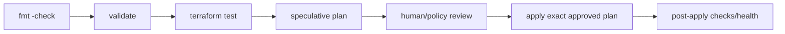

| Layer | Finds | Does it need state/API? |
|---|---|---|
| `terraform fmt -check -recursive` | Noncanonical formatting | No |
| `terraform validate` | Syntax/type/internal consistency | Initialized providers, but no state evaluation |
| Variable validation | Invalid caller input | During validation/evaluation |
| Pre/postconditions | Broken lifecycle assumptions/results | Plan/apply depending on known values |
| `check` blocks | Health assertions that warn rather than block | Can read data during plan/apply/health assessment |
| `terraform test` | Module behavior and assertions | May plan or apply; can create real infrastructure |
| Speculative plan | Proposed change against current context | Yes; read credentials/state |
| Policy/run tasks | Organizational guardrails/integrations | HCP Terraform feature context |

## 14.2 Native Terraform tests

Terraform test files normally live under `tests/` and use `.tftest.hcl`. `terraform test` executes configured plan or apply runs and assertions. Tests can create real, billable infrastructure; use plan-mode where enough and ensure cleanup for apply-mode tests.

`tests/naming.tftest.hcl`:

```hcl
run "development_names" {
  command = plan

  variables {
    project     = "examprep"
    environment = "dev"
    location    = "westus2"
  }

  assert {
    condition     = azurerm_resource_group.platform.name == "rg-examprep-dev"
    error_message = "The resource group name does not follow the contract."
  }

  assert {
    condition     = azurerm_resource_group.platform.tags["managed_by"] == "terraform"
    error_message = "All resources must identify Terraform ownership."
  }
}
```

Run:

```console
terraform test
terraform test -filter=tests/naming.tftest.hcl
```

Use mock providers and overrides where the Terraform test documentation supports your case and you want to isolate module logic. Use real apply-mode tests only for behavior that cannot be established by planning/mocking.

## 14.3 The safe automated CLI workflow

HashiCorp's automation workflow preserves the same sequence as local work:

```console
terraform init -input=false
terraform fmt -check -recursive
terraform validate
terraform test
terraform plan -input=false -out=tfplan
terraform show tfplan
terraform apply -input=false tfplan
```

Important properties:

- `-input=false` prevents a CI job from hanging for interactive input.
- The plan and apply run against the same initialized configuration and exact saved plan.
- The saved plan is a sensitive, short-lived artifact.
- A backend with remote locking makes state durable and protects against concurrent writers.
- A human or policy gate reviews the plan before apply unless an explicitly risk-accepted auto-apply policy applies.
- State is never passed between jobs as an ordinary build artifact when a remote backend can persist it safely.

Set `TF_IN_AUTOMATION` to any non-empty value to make Terraform's human output better suited to automation. This is cosmetic, not a security or noninteractive switch; still use `-input=false`.

## 14.4 Plan exit codes and artifacts

```console
terraform plan -detailed-exitcode -out=tfplan
```

With `-detailed-exitcode`:

- `0` means success with an empty diff;
- `1` means error;
- `2` means success with changes.

A pipeline must not treat exit code 2 as failure. Render human output with `terraform show tfplan`; machine consumers can use `terraform show -json tfplan`, but JSON exposes sensitive values and must be protected.

Plan files capture configuration, variables, provider decisions, and sensitive values needed for apply. Never commit them, publish them broadly, or reuse them after state/configuration context has changed.

## 14.5 CI/CD stage design

### Pull request / merge request

1. Clean checkout.
2. Select the expected Terraform version.
3. `init -backend=false` for isolated validation where appropriate, or safe read-only backend initialization for a real speculative plan.
4. `fmt -check`, `validate`, tests.
5. Create a speculative plan with read-capable credentials.
6. Publish a protected summary/link; do not dump sensitive JSON.
7. Require code owner and policy approvals for high-risk changes.

### Protected branch deployment

1. Build from the reviewed commit.
2. Initialize the correct backend.
3. Obtain short-lived credentials.
4. Produce and retain the exact plan.
5. Run policy/cost/security gates.
6. Approve.
7. Apply the saved plan once.
8. Record outcome and outputs without leaking secrets.

### Concurrency

Use both backend locking and CI concurrency controls. Locking protects one state write; pipeline serialization prevents wasteful competing plans and makes approvals understandable.

## 14.6 Plan versus apply identity

Plan usually needs enough Azure access to refresh/read the objects and evaluate data sources. Apply needs mutation rights for proposed operations. HCP Terraform dynamic credentials can create separate plan and apply identities. When designing least privilege, test whether the plan identity can read everything the provider must refresh.

## 14.7 Dangerous automation shortcuts

- `terraform apply -auto-approve` on unreviewed changes.
- Re-running `plan` in the apply job instead of applying the approved saved plan.
- Passing credentials with `-var` or backend secrets on the command line where history/logs can capture them.
- Routine `-target`; HashiCorp describes resource targeting as exceptional.
- Routine `-refresh=false`, which ignores current remote changes and can create an incomplete plan.
- `-lock=false` to get around contention.
- Persisting plan/state JSON in a public artifact store.
- Applying from arbitrary developer branches to production state.
- Letting dependency upgrades happen incidentally in the same change as infrastructure logic.

## 14.8 Operational replacement and targeting

Use:

```console
terraform plan -replace='ADDRESS'
```

to request replacement of a particular managed object while retaining a full graph plan. This supersedes habitual use of the older taint workflow.

Use `-target=ADDRESS` only for exceptional recovery or error guidance. A targeted plan can omit changes elsewhere and, in HCP Terraform, can limit policy visibility and disable cost estimation. Follow it with a full plan.

## 14.9 Automation readiness checklist

- [ ] Terraform version selected before `init`.
- [ ] Lock file committed and unchanged unless upgrade is intended.
- [ ] Backend and state key are explicit.
- [ ] Workspace/environment is printed in job summary.
- [ ] `-input=false` used.
- [ ] Formatting and validation gates pass.
- [ ] Tests have cleanup and cost bounds.
- [ ] Plan exit code 2 handled as “changes,” not “error.”
- [ ] Plan stored with restricted access and short retention.
- [ ] Apply consumes the approved plan artifact.
- [ ] Backend locking and job concurrency enabled.
- [ ] Credentials are short-lived and least-privilege.
- [ ] Logs/artifacts are checked for sensitive material.
- [ ] Full plan follows any exceptional targeted operation.

<details>
<summary>Knowledge check: Why is “plan in PR, run a fresh apply after merge” not necessarily applying the reviewed plan?</summary>

An apply without the saved plan creates a new plan against potentially changed configuration, variables, state, credentials, and remote infrastructure. Apply the exact saved plan when the workflow promises exact-plan approval, or use HCP Terraform's integrated run lifecycle.

</details>

**Official HashiCorp sources:**

- https://developer.hashicorp.com/terraform/tutorials/automation/automate-terraform
- https://developer.hashicorp.com/terraform/cli/commands/plan
- https://developer.hashicorp.com/terraform/cli/commands/apply
- https://developer.hashicorp.com/terraform/cli/config/environment-variables
- https://developer.hashicorp.com/terraform/language/tests
- https://developer.hashicorp.com/terraform/cli/commands/test
- https://developer.hashicorp.com/terraform/language/validate

---

# 15. HCP Terraform

## 15.1 What it adds

HCP Terraform is a team-oriented remote Terraform workflow. A workspace can hold configuration association, variables, state versions, run history, and access controls. With remote operations enabled, HCP Terraform runs Terraform in disposable execution environments. It can integrate with version control, manage plan/apply orchestration, expose approval workflows, and—depending on edition/settings—add policy enforcement, cost estimation, run tasks, drift detection, and continuous validation.

It does not replace Terraform configuration language or providers. The same core model remains:

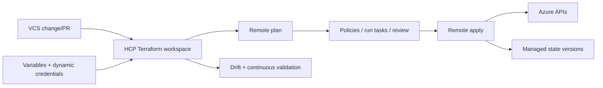

## 15.2 Workspace contents and boundaries

An HCP Terraform workspace represents a configuration, one state, variable values, settings, and run history. All workspaces belong to projects. Projects group workspaces and can serve as permission/variable-set boundaries.

| Local working directory | HCP Terraform workspace |
|---|---|
| Configuration on disk | VCS-linked or uploaded configuration versions |
| `.tfvars`, CLI flags, environment | Workspace variables and variable sets |
| Local or separately configured backend | Managed state versions |
| Local process | Remote/agent/local execution mode depending on settings |
| Shell user permissions | Organization/project/workspace roles and team access |

Restrict cross-workspace state access to explicit consumers. A workspace is a logical security boundary, but a Terraform run inside it can access variables/state available to the run; review third-party run tasks and provider/module code as trusted execution inputs.

## 15.3 Run workflows

HCP Terraform supports:

- **VCS-driven:** connect a workspace to a repository. Pull requests create speculative plans; commits to the selected branch create standard runs.
- **CLI-driven:** standard CLI commands upload configuration and start remote operations through a `cloud` block.
- **API-driven:** automation uploads configuration versions and creates/manages runs through the API.
- **UI-driven:** operators can queue supported run modes in the workspace UI.

Remote operations always maintain the plan/apply separation. Normal runs queue so a later plan waits for a current state-changing run to finish. Speculative plans cannot apply and can run without joining the normal apply queue.

### Connect configuration

```hcl
terraform {
  cloud {
    organization = "example-organization"

    workspaces {
      name = "examprep-platform-dev"
    }
  }
}
```

Authenticate the CLI with the documented `terraform login` flow, initialize, and then normal `terraform plan`/`apply` commands can start remote runs. A configuration cannot declare both `cloud` and `backend` blocks.

## 15.4 Run modes

| Mode | Effect |
|---|---|
| Standard plan/apply | Plan, checks, then approval/auto-apply according to settings |
| Speculative/plan only | Shows possible changes; cannot apply |
| Saved plan | Can be confirmed later; HCP discards it if state becomes stale |
| Destroy | Plans/applies removal of all managed objects |
| Refresh-only | Updates state to match remote objects without changing them |
| Allow empty apply | Applies a no-change run, useful for certain state upgrades |
| Replace selected resources | Requests replacement by address |

Auto-apply is a risk decision, not a maturity badge. Keep manual confirmation for production/high-impact work unless policy, tests, isolation, and organizational controls justify automation.

## 15.5 Variables and variable sets

HCP Terraform distinguishes Terraform variables (inputs matching root variables) from environment variables (available to the run process/providers). Variable sets share values across selected workspaces/projects. Scope them narrowly: a shared Azure credential set applied everywhere defeats least privilege.

Mark secret workspace variables sensitive so the UI/API does not reveal their stored value. This protects display/storage access paths, but plan/apply operations can still consume the values. Prefer dynamic provider credentials instead of long-lived Azure secrets.

## 15.6 Dynamic Azure credentials

HCP Terraform's dynamic provider credentials use an OIDC trust relationship:

1. HCP Terraform creates a workload identity token with organization, project, workspace, and run-phase identity.
2. Azure validates the token against the configured federation trust.
3. Azure returns temporary credentials.
4. HCP Terraform makes them available to the provider for that run.
5. The disposable run environment and temporary credentials are discarded afterward.

The documented Azure workspace variables include `TFC_AZURE_PROVIDER_AUTH=true`, Azure tenant/subscription identifiers, and a run or separate plan/apply client ID. Follow the dedicated Azure dynamic-credentials page for exact current names and trust configuration.

> IF HCP Terraform manages Azure, **PREFER dynamic provider credentials**, BECAUSE each operation gets short-lived credentials and avoids storing a client secret.  
> IF plan and apply have different risk, **USE distinct plan/apply identities where supported**, BECAUSE refresh/read does not require the full mutation scope.

## 15.7 Policy, run tasks, cost, and health

- **Policy enforcement:** HCP Terraform supports Sentinel and Open Policy Agent policy sets according to edition/features. Use policy as organizational guardrails, not as a substitute for clear modules and review.
- **Run tasks:** Integrate external services at pre-plan, post-plan, pre-apply, or post-apply stages. Advisory tasks warn; mandatory tasks can block/stop the run. Trust integrations because they can receive run context.
- **Cost estimation:** Estimates supported resource costs from a plan; coverage varies by resource. Targeted plans disable it because the subset would be misleading.
- **Health assessments:** Drift detection compares real infrastructure with configuration; continuous validation evaluates custom conditions after provisioning. HCP health assessments require eligible execution modes/versions and a prior successful apply.

## 15.8 Permissions model

Use organization, project, and workspace permissions to grant only the access a team needs. Workspace roles can separate read, plan, write/apply, and administration. Projects can group a business unit/service and scope access and variable sets. VCS identity and HCP Terraform identity are separate authorization systems; approval in one does not imply approval in the other.

## 15.9 HCP Terraform adoption checklist

1. Choose organization/project/workspace boundaries from ownership and blast radius.
2. Connect VCS or choose a deliberate API/CLI workflow.
3. Pin the workspace Terraform version.
4. Migrate state using the documented workflow and verify a no-op plan.
5. Replace static Azure secrets with dynamic credentials.
6. Scope variable sets and state sharing.
7. Configure team permissions and protected apply rights.
8. Enable required policy/run-task gates.
9. Enable health assessments where available.
10. Test PR speculative plans, normal runs, failure recovery, and notifications.

<details>
<summary>Knowledge check: Is an HCP speculative plan waiting for approval to apply?</summary>

No. A speculative/plan-only run can never apply. It previews changes and policy effects, commonly for pull requests.

</details>

**Official HashiCorp sources:**

- https://developer.hashicorp.com/terraform/cloud-docs/overview
- https://developer.hashicorp.com/terraform/cloud-docs/workspaces
- https://developer.hashicorp.com/terraform/cloud-docs/workspaces/run/remote-operations
- https://developer.hashicorp.com/terraform/cloud-docs/workspaces/run/modes-and-options
- https://developer.hashicorp.com/terraform/cloud-docs/variables
- https://developer.hashicorp.com/terraform/cloud-docs/dynamic-provider-credentials
- https://developer.hashicorp.com/terraform/tutorials/cloud/dynamic-credentials
- https://developer.hashicorp.com/terraform/cloud-docs/workspaces/policy-enforcement
- https://developer.hashicorp.com/terraform/cloud-docs/workspaces/settings/run-tasks
- https://developer.hashicorp.com/terraform/cloud-docs/workspaces/cost-estimation
- https://developer.hashicorp.com/terraform/cloud-docs/workspaces/health
- https://developer.hashicorp.com/terraform/cloud-docs/architectural-details/security-model

---

# 16. From zero to production on Azure

This walkthrough is an architecture and delivery sequence. It intentionally uses the resource group, networking, subnet, and storage syntax already established by the reviewed HashiCorp sources rather than inventing an exhaustive Azure application stack.

## 16.1 Target operating model

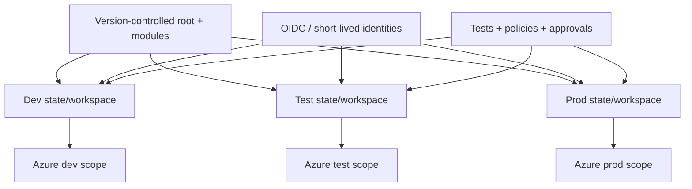

Each environment has a separate state and appropriately scoped identity. A shared, versioned network module preserves consistent shape. Root configurations express environment-specific composition and values.

## 16.2 Stage 0 — establish ownership

Before code:

- Identify the team that owns configuration, state, and incident response.
- Inventory Azure objects and determine create/import/read-only ownership.
- Choose state boundaries from credentials, lifecycle, blast radius, and confidentiality.
- Decide whether HCP Terraform or an Azure Blob backend will store state.
- Decide how plan and apply credentials will be issued.
- Define naming/tagging inputs as contracts, not scattered strings.

Deliverable: a mapping of **Azure scope → root configuration → state → identity → owner**.

## 16.3 Stage 1 — bootstrap state separately

If using Azure Blob:

1. Create the storage account/container using a separate bootstrap process/state.
2. Enable the organization's required Azure storage protections.
3. Grant the backend identity minimal container access.
4. Record non-secret backend settings per environment.
5. Initialize the root with `-migrate-state` only if state already exists.

The exact Azure storage hardening controls are **Not explicitly documented in the reviewed official HashiCorp source.** The HashiCorp backend documentation establishes Terraform's authentication, locking, and configuration behavior; apply your organization's Azure security standard separately.

If using HCP Terraform, create projects/workspaces, configure permissions, connect the workflow, and migrate state through the documented HCP process.

## 16.4 Stage 2 — build the root contract

```text
infrastructure/
├── modules/
│   └── network/
│       ├── terraform.tf
│       ├── variables.tf
│       ├── main.tf
│       ├── outputs.tf
│       └── README.md
└── live/
    ├── dev/
    │   ├── backend.tf
    │   ├── terraform.tf
    │   ├── providers.tf
    │   ├── variables.tf
    │   ├── locals.tf
    │   ├── main.tf
    │   ├── storage.tf
    │   ├── outputs.tf
    │   └── dev.tfvars
    ├── test/
    └── prod/
```

Root `main.tf`:

```hcl
resource "azurerm_resource_group" "platform" {
  name     = "rg-${local.name_prefix}"
  location = var.location
  tags     = local.tags

  lifecycle {
    precondition {
      condition     = var.environment != "prod" || contains(keys(local.tags), "owner")
      error_message = "Production requires an owner tag."
    }
  }
}

module "network" {
  source = "../../../modules/network"

  name                = "vnet-${local.name_prefix}"
  location            = azurerm_resource_group.platform.location
  resource_group_name = azurerm_resource_group.platform.name
  address_space       = var.vnet_address_space
  subnets             = var.subnets
  tags                = local.tags
}

resource "azurerm_storage_account" "app" {
  name                     = "st${replace(local.name_prefix, "-", "")}001"
  resource_group_name      = azurerm_resource_group.platform.name
  location                 = azurerm_resource_group.platform.location
  account_tier             = "Standard"
  account_replication_type = var.storage_replication_type
  tags                     = local.tags
}
```

Root `locals.tf`:

```hcl
locals {
  name_prefix = lower("${var.project}-${var.environment}")
  tags = merge(
    {
      environment = var.environment
      managed_by  = "terraform"
      project     = var.project
    },
    var.extra_tags,
  )
}
```

Keep production-only differences in typed inputs when the architecture remains the same. If environments become structurally different, separate compositions instead of growing an unreadable web of workspace conditionals.

## 16.5 Stage 3 — adopt existing Azure carefully

For each pre-existing object:

- **Manage it:** write resource configuration and an `import` block.
- **Read it:** use a data source if another owner retains lifecycle control.
- **Leave it unrelated:** do not add it merely because it shares a resource group.

Import bottom-up where dependencies and provider documentation make identities clear, but preview the entire root plan before any apply. A resource group import does not automatically import its child resources.

## 16.6 Stage 4 — prove development

Run the complete gate:

```console
terraform init -input=false
terraform fmt -check -recursive
terraform validate
terraform test
terraform plan -out=tfplan -input=false
terraform show tfplan
terraform apply -input=false tfplan
terraform plan -detailed-exitcode
```

Verify:

- expected addresses exist in state;
- a second plan is empty;
- outputs expose only stable values;
- no secret appears in configuration, state-sharing contracts, or logs;
- teardown works for disposable test fixtures;
- documented drift response works.

## 16.7 Stage 5 — promotion

Promote code, not state. For test and production:

1. Select the target root/workspace explicitly.
2. Use target-specific non-secret inputs.
3. Obtain target-specific short-lived credentials.
4. Create a fresh plan against the target's own state and Azure scope.
5. Apply the exact approved plan.

Do not assume a dev plan describes production. Remote state and live objects are part of planning.

## 16.8 Stage 6 — operational guardrails

- Protect the main branch and production apply permission.
- Serialize runs per state.
- Require destructive/replacement review.
- Separate plan/apply identities where practical.
- Enable HCP policies/run tasks/health where selected and available.
- Back up and test state recovery through the backend's supported mechanism.
- Schedule dependency upgrades as reviewed changes.
- Retain `moved` blocks needed by upgrade paths.
- Publish a runbook for stale locks, failed applies, drift, import, and provider upgrades.

## 16.9 Production readiness checklist

### Configuration

- [ ] Root and child module responsibilities are clear.
- [ ] All variables/outputs are typed, described, and minimal.
- [ ] Provider/resource names are descriptive nouns with underscores.
- [ ] Dependencies come from references; `depends_on` is justified.
- [ ] Lifecycle rules are narrow and commented.
- [ ] Imports, moves, and removals are declarative.

### State

- [ ] Remote state has locking, access control, and recovery.
- [ ] State boundaries match ownership and blast radius.
- [ ] Backend credentials/settings are not embedded in plans/source.
- [ ] Cross-state outputs expose only required contracts.

### Security

- [ ] No static secret is committed.
- [ ] Dynamic/short-lived credentials are preferred.
- [ ] Sensitive and ephemeral semantics are correctly distinguished.
- [ ] State, plans, logs, and backups are treated as sensitive.

### Delivery

- [ ] Exact Terraform/provider/module versions are controlled.
- [ ] Lock file is committed.
- [ ] PR checks include formatting, validation, tests, and speculative plan.
- [ ] Apply consumes the reviewed plan or HCP integrated run.
- [ ] Permissions and approvals are least-privilege.
- [ ] A no-op plan follows apply.

### Operations

- [ ] Drift ownership decisions have a runbook.
- [ ] Failed apply recovery is tested.
- [ ] Stale locks are investigated before force-unlock.
- [ ] Destroy is restricted for long-lived production roots.
- [ ] Module/address migrations retain `moved` history.

**Official HashiCorp sources:**

- https://developer.hashicorp.com/terraform/language/style
- https://developer.hashicorp.com/terraform/language/modules/develop
- https://developer.hashicorp.com/terraform/language/state
- https://developer.hashicorp.com/terraform/language/backend/azurerm
- https://developer.hashicorp.com/terraform/tutorials/automation/automate-terraform
- https://developer.hashicorp.com/terraform/cloud-docs/dynamic-provider-credentials
- https://developer.hashicorp.com/terraform/tutorials/azure-get-started

---

# 17. Troubleshooting and scenario practice

## 17.1 Diagnose by layer

Do not start by randomly editing configuration. Locate the failing boundary:

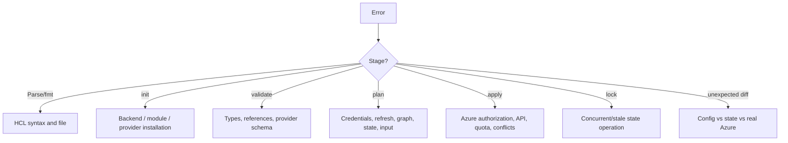

Always capture:

```console
terraform version
terraform providers
terraform workspace show
terraform state list
```

Also record the working directory, backend key/workspace, relevant configuration diff, exact command, and full error with secrets redacted.

## 17.2 Frequent failures

| Symptom | Think first | Safe next actions |
|---|---|---|
| `terraform` not found | Installation/PATH | Verify executable and `terraform version` |
| Initialization required | New/changed providers, modules, or backend | Run ordinary `terraform init`; inspect output |
| Provider cannot install | Network/mirror/lock constraint/checksum | Inspect source/constraints/lock file; avoid deleting lock reflexively |
| Unsupported argument/block | Provider schema/version mismatch | Check locked provider version and matching docs; `terraform providers` |
| Reference to undeclared object | Address/name/module-output error | Verify exact address and module contract; `validate` |
| Invalid `for_each` argument | Keys unknown/sensitive or wrong type | Build a known map/set of stable non-sensitive keys |
| Cycle detected | Circular dependency graph | Find reference/`depends_on` loop and redesign ownership/data flow |
| Backend configuration changed | Initialized metadata differs | Decide intentionally between migration and reconfiguration |
| State lock error | Active concurrent run or stale lock | Identify owner; wait/cancel safely; force-unlock only own stale lock |
| Azure authorization error | Wrong identity/scope/subscription | Verify selected context and least-privilege role; do not broaden blindly |
| Object already exists | Unmanaged object collides with create | Decide import, rename, or external ownership/data source |
| Plan wants unexpected replacement | Changed ForceNew-like attribute/address | Read exact diff; check address refactor and add `moved` if applicable |
| Many indexed replacements after list edit | Positional `count` identity shifted | Consider a keyed `for_each` migration using `moved` blocks |
| Apply failed halfway | Partial real changes and updated state | Do not assume rollback; inspect state/live Azure, fix cause, re-plan |
| No changes but Azure looks different | Wrong state/workspace or ignored/unmanaged field | Verify backend/workspace/address and `ignore_changes`; refresh plan |
| Sensitive value appears in JSON/log | Raw/JSON/debug output bypassed redaction expectation | Secure/remove artifact, rotate exposed credential, review pipeline |

## 17.3 Logging

Terraform detailed logging is disabled by default. Enable only for a focused reproduction, because logs can contain sensitive information.

PowerShell:

```powershell
$Env:TF_LOG = "DEBUG"
$Env:TF_LOG_PATH = ".\terraform-debug.log"
terraform plan
Remove-Item Env:TF_LOG
Remove-Item Env:TF_LOG_PATH
```

Bash:

```bash
export TF_LOG=DEBUG
export TF_LOG_PATH=./terraform-debug.log
terraform plan
unset TF_LOG TF_LOG_PATH
```

Levels from most to least verbose are `TRACE`, `DEBUG`, `INFO`, `WARN`, and `ERROR`. `TF_LOG_CORE` and `TF_LOG_PROVIDER` narrow logging to Terraform Core or provider plugins. `TF_LOG_PATH` writes only when logging is enabled. JSON logging is not a stable interface.

Before sharing a log:

1. Reproduce with the least-verbose sufficient level.
2. Stop logging immediately after reproduction.
3. Inspect and redact credentials, tokens, IDs, values, state, and request/response bodies.
4. Store it with restricted access and delete it according to incident policy.

## 17.4 Plan-reading drill

For every resource in a plan, narrate:

1. Address and module path.
2. Action: create, update, replace, destroy, read, import, move, or forget.
3. Triggering argument/address change.
4. Whether values are unknown until apply.
5. Dependency ordering and downstream effects.
6. Output changes.
7. Whether the action is expected and reversible.

Do not stop at `Plan: 1 to add, 0 to change, 1 to destroy`. One add plus one destroy may be a replacement caused by an accidental rename.

## 17.5 Common beginner mistakes

| Mistake | Correct model |
|---|---|
| “`init` deploys infrastructure.” | It prepares backend/modules/providers and the lock file. |
| “A `.tf` file runs top to bottom.” | Terraform builds a dependency graph across all module files. |
| “State is just a cache.” | It is the address-to-object ownership mapping and operation metadata. |
| “A data source manages what it reads.” | It reads only; import into a resource to manage. |
| “Renaming a resource is harmless.” | It changes the address; use `moved` for identity-preserving refactors. |
| “Sensitive means encrypted/not stored.” | It mainly redacts display; state can contain the value. |
| “Workspaces are folders/environments with RBAC.” | CLI workspaces are multiple states in one backend; HCP workspaces are different. |
| “`depends_on` fixes any ordering issue.” | Prefer direct references; explicit dependency is for hidden behavior. |
| “`count` and `for_each` are interchangeable.” | Their identities are positional versus keyed. |
| “`prevent_destroy` protects an object forever.” | It applies only while the configured lifecycle rule remains. |
| “Failed apply rolled back.” | Completed changes remain and state records them; fix and re-plan. |
| “A successful old plan is safe forever.” | State, configuration, credentials, and remote reality can change. |

## 17.6 Scenario questions

### Scenario 1 — portal drift

You change an Azure resource tag manually after Terraform created it. What three representations matter before the next apply?

<details>
<summary>Answer</summary>

Configuration (declared tag), state (binding and refreshed snapshot), and real Azure (manual value). A normal plan refreshes remote values and proposes convergence to configuration unless lifecycle rules change ownership. Decide whether to revert Azure, update configuration, or intentionally accept/shared-manage the field.

</details>

### Scenario 2 — accidental rename

A pull request changes `azurerm_resource_group.rg` to `.platform`, and plan shows one destroy and one create with the same Azure name. What should you do?

<details>
<summary>Answer</summary>

Stop the apply and add a `moved` block from the old address to the new. Re-plan and verify Terraform reports an address move rather than remote replacement.

</details>

### Scenario 3 — existing resource collision

Plan wants to create `rg-shared`, but Azure reports it already exists. Another team owns it. Import or data source?

<details>
<summary>Answer</summary>

Use a data source if the other team retains lifecycle ownership and you only need attributes. Import only if ownership is deliberately transferred to this state.

</details>

### Scenario 4 — production isolation

Dev and production need different Azure identities and apply permissions. Should they be CLI workspaces of one backend?

<details>
<summary>Answer</summary>

No. HashiCorp says CLI workspaces are not appropriate where separate credentials/access controls are required. Use separate root state boundaries or HCP Terraform workspaces/projects with explicit permissions.

</details>

### Scenario 5 — list insertion

Three resources use `count` over a list. Inserting an element at index 0 causes multiple address changes. What design is more stable?

<details>
<summary>Answer</summary>

Use `for_each` with durable, non-sensitive keys and declare `moved` mappings for existing instances. Do not switch blindly: plan the address migration.

</details>

### Scenario 6 — stale lock

A colleague's apply terminal disappeared and the backend remains locked. What is the sequence?

<details>
<summary>Answer</summary>

Confirm no run is active, identify the lock owner/operation, coordinate with that owner, and use `terraform force-unlock LOCK_ID` only when the lock is genuinely stale and belongs to your operation/team. Never routinely disable locking.

</details>

### Scenario 7 — failed apply

Terraform created the resource group and VNet but failed on storage. Should you delete everything manually and rerun?

<details>
<summary>Answer</summary>

No automatic rollback occurred. Inspect state and Azure, diagnose the storage failure, correct configuration/permissions, and run a fresh full plan. Manual deletion can add drift and should occur only as a deliberate recovery action.

</details>

### Scenario 8 — secret output

An output is marked sensitive, but a pipeline calls `terraform output -json` and publishes the artifact. Is the secret protected?

<details>
<summary>Answer</summary>

No. JSON/raw output can reveal sensitive values. Restrict and remove the artifact, rotate exposed credentials, and redesign the pipeline. Sensitive marking redacts normal display; it is not a storage boundary.

</details>

### Scenario 9 — wrong subscription

The configuration is valid and the plan is reasonable, but it targets the wrong Azure subscription. Which layer failed?

<details>
<summary>Answer</summary>

Provider authentication/context. State selection and identity/subscription are separate pre-apply checks. Correct the Azure context/credential configuration and generate a new plan.

</details>

### Scenario 10 — backend bootstrapping

You added an `azurerm_storage_account` resource and configured the same account as the backend. Why does first `init` fail?

<details>
<summary>Answer</summary>

Backend initialization precedes resource planning/apply. Create/manage the backend infrastructure separately, then initialize the consumer configuration.

</details>

### Scenario 11 — broad ignore

Someone proposes `ignore_changes = all` because every plan contains drift. What should review focus on?

<details>
<summary>Answer</summary>

Identify the real owner of each changing field and the source of drift. Use narrow ignores only for intentional shared management; broad ignore hides configuration divergence and weakens Terraform's reconciliation purpose.

</details>

### Scenario 12 — plan identity

A read-only plan identity fails because a data source and refresh need Azure reads. Should it receive Contributor?

<details>
<summary>Answer</summary>

Not automatically. Determine the documented reads required by the configuration/provider and grant the narrowest role/scope that permits them. Mutation permission belongs to apply where separation is supported.

</details>

## 17.7 Practice curriculum

| Level | Exercise | Evidence of completion |
|---|---|---|
| Beginner | Install, authenticate, create one Azure resource group | `version`, plan, apply, `state list`, destroy logs |
| Beginner+ | Add typed variables, locals, tags, and outputs | Validation failure example and successful output |
| Intermediate | Add VNet/subnets with `for_each` | Keyed addresses and dependency explanation |
| Intermediate+ | Add storage and lifecycle preconditions | Plan narration and failed precondition test |
| Modules | Extract network child module | Module tree, contract, tests, no-replacement move plan |
| State | Migrate local state to Azure Blob | Backup evidence, successful migration, no-op plan |
| Import | Adopt an existing resource group | Import block and post-import no-op plan |
| Drift | Change a tag outside Terraform and resolve it | Three-representation decision record |
| Team | Separate dev/prod state and identities | Boundary/permission diagram |
| Automation | Build format/validate/test/plan/apply gates | Exact saved-plan apply and protected artifacts |

**Official HashiCorp sources:**

- https://developer.hashicorp.com/terraform/cli/commands
- https://developer.hashicorp.com/terraform/cli/config/environment-variables
- https://developer.hashicorp.com/terraform/internals/debugging
- https://developer.hashicorp.com/terraform/cli/commands/plan
- https://developer.hashicorp.com/terraform/cli/commands/apply
- https://developer.hashicorp.com/terraform/language/state/locking
- https://developer.hashicorp.com/terraform/language/modules/develop/refactoring
- https://developer.hashicorp.com/terraform/language/manage-sensitive-data

---

# 18. Cheat sheets and rapid reviews

## 18.1 Terraform cheat sheet

```text
CONFIGURATION  = desired infrastructure and module contracts
STATE          = Terraform address <-> remote object mapping + metadata
REALITY        = what the provider API currently reports
PLAN           = proposed reconciliation; inspect, do not assume
APPLY          = execute an approved plan; no automatic global rollback
PROVIDER       = plugin that maps Terraform resource/data semantics to an API
BACKEND        = state storage (and, when supported, locking)
ROOT MODULE    = working directory and run/state composition
CHILD MODULE   = reusable configuration called by a parent
RESOURCE       = lifecycle-managed object
DATA SOURCE    = read-only lookup; not adoption
IMPORT         = bind an existing object to a resource address
MOVED          = migrate an address without remote destruction
REMOVED        = stop managing with explicit destroy/forget intent
DRIFT          = difference involving configuration/state/real object
```

The safety loop:

```text
select directory/state/identity
    -> init
    -> fmt + validate + test
    -> plan
    -> read every action
    -> apply the exact approved plan
    -> verify outputs/state/no-op plan
```

## 18.2 If You See X, Think Y

| If you see X | Think Y |
|---|---|
| `(known after apply)` | Value is unknown during plan, not necessarily erroneous |
| `+` | Create |
| `~` | Update in place |
| `-` | Destroy |
| replacement arrows / “forces replacement” | Destruction plus creation; inspect order and cause |
| `data.` prefix | Read-only lookup |
| `module.network.id` | Child module output contract |
| `each.key` | Stable `for_each` instance identity |
| `count.index` | Positional identity; list shifts matter |
| `depends_on` | Hidden dependency; ask why no expression can represent it |
| `prevent_destroy` | Plan guard while configuration remains, not permanent Azure protection |
| `ignore_changes` | Intentional shared ownership and hidden drift risk |
| State lock error | Another writer or stale lock—investigate before unlock |
| Object already exists | Collision; choose import, data source, or a different object |
| Destroy/create after label rename | Terraform address changed; consider `moved` |
| `sensitive` | Redacted, commonly still stored |
| `ephemeral` | Runtime-only and omitted, with restricted use |
| `.terraform.lock.hcl` diff | Dependency selection/checksum change; review and commit intentionally |
| `-target` | Exceptional recovery, then full plan |
| `-refresh=false` | Potentially incomplete view of remote reality |
| Empty local state | Verify backend/workspace before assuming nothing is managed |
| Apply error after some success | Partial infrastructure may exist and state may be updated |

## 18.3 Terraform command cheat sheet

### Create and change

| Command | Use |
|---|---|
| `terraform init` | Initialize backend, modules, providers, lock selection |
| `terraform fmt -recursive` | Rewrite configuration canonically |
| `terraform fmt -check -recursive` | CI format check without editing |
| `terraform validate` | Syntax/internal consistency check |
| `terraform plan` | Speculative proposed changes |
| `terraform plan -out=tfplan` | Save a non-speculative plan for exact apply |
| `terraform apply tfplan` | Apply the saved plan |
| `terraform apply` | Make a new plan, prompt, then apply |

### Inspect

| Command | Use |
|---|---|
| `terraform version` | CLI version and platform |
| `terraform providers` | Provider requirements by module |
| `terraform show` | Human-readable latest state |
| `terraform show tfplan` | Human-readable saved plan |
| `terraform show -json tfplan` | Machine-readable plan; sensitive |
| `terraform output` | Root outputs |
| `terraform output -raw NAME` | One primitive output without quotes; may reveal sensitive |
| `terraform state list` | Managed/read instance addresses |
| `terraform state show ADDRESS` | One tracked instance |
| `terraform graph` | Graphviz representation of operation graph |
| `terraform console` | Interactive expression evaluation |

### State and refactor

| Command | Use/caution |
|---|---|
| `terraform state pull` | Retrieve current state; output is sensitive |
| `terraform state mv FROM TO` | One-time address move; prefer `moved` where possible |
| `terraform state rm ADDRESS` | Forget binding; prefer reviewable `removed` |
| `terraform state replace-provider FROM TO` | Change provider source association in state |
| `terraform force-unlock LOCK_ID` | Remove only a verified stale lock |

### Import

| Command | Use |
|---|---|
| `terraform import ADDRESS ID` | Imperative single binding; config must exist |
| `terraform plan -generate-config-out=FILE` | Generate best-guess resource config for import review |

### Workspaces

| Command | Use |
|---|---|
| `terraform workspace list` | List CLI workspaces |
| `terraform workspace show` | Print selected CLI workspace |
| `terraform workspace new NAME` | Create and select a new empty state |
| `terraform workspace select NAME` | Select an existing state |
| `terraform workspace delete NAME` | Delete an unused workspace under command rules |

### Test and troubleshoot

| Command | Use |
|---|---|
| `terraform test` | Execute `.tftest.hcl` runs/assertions; may create infrastructure |
| `terraform plan -refresh-only` | Preview state reconciliation without remote changes |
| `terraform apply -refresh-only` | Accept reviewed remote values into state |
| `terraform plan -replace=ADDRESS` | Request replacement with a full plan |
| `terraform plan -detailed-exitcode` | 0 no diff, 1 error, 2 changes |
| `TF_LOG=DEBUG terraform plan` | Focused debug logging; protect output |

### Destroy

| Command | Use |
|---|---|
| `terraform plan -destroy` | Preview full managed teardown |
| `terraform destroy` | Apply destroy mode; destructive |

## 18.4 HCL cheat sheet

```hcl
# Input
variable "location" {
  type        = string
  description = "Azure location."
  default     = "westus2"
}

# Reusable expression
locals {
  name = lower("${var.project}-${var.environment}")
  tags = merge({ managed_by = "terraform" }, var.extra_tags)
}

# Managed object
resource "azurerm_resource_group" "platform" {
  name     = "rg-${local.name}"
  location = var.location
  tags     = local.tags
}

# Read existing object
data "azurerm_resource_group" "shared" {
  name = var.shared_resource_group_name
}

# Keyed repetition
resource "azurerm_subnet" "this" {
  for_each = var.subnets
  # each.key / each.value
}

# Transform/filter
locals {
  ids = { for key, subnet in azurerm_subnet.this : key => subnet.id }
}

# Conditional
locals {
  sku = var.environment == "prod" ? "premium" : "standard"
}

# Output contract
output "resource_group_id" {
  description = "Managed resource group ID."
  value       = azurerm_resource_group.platform.id
}

# Child module
module "network" {
  source = "./modules/network"
  # named input arguments
}

# Identity-preserving refactor
moved {
  from = azurerm_resource_group.rg
  to   = azurerm_resource_group.platform
}

# Adopt existing object
import {
  to = azurerm_resource_group.legacy
  id = "/subscriptions/.../resourceGroups/rg-legacy"
}
```

Reference namespaces:

```text
var.name                 input variable
local.name               local value
azurerm_type.name.attr   managed resource attribute
data.azurerm_type.x.attr data-source attribute
module.name.output       child module output
each.key / each.value    for_each symbols
count.index              count symbol
path.module              current module filesystem path
terraform.workspace      selected CLI workspace name
```

## 18.5 Azure Terraform cheat sheet

```text
Azure subscription/tenant     -> provider authentication and scope
AzureRM provider              -> creates/reads/updates/deletes Azure resources
azurerm backend               -> stores state in Azure Blob; separate concern
Resource group                -> azurerm_resource_group
Virtual network               -> azurerm_virtual_network
Subnet                        -> azurerm_subnet
Storage account               -> azurerm_storage_account
Existing externally owned RG  -> data "azurerm_resource_group"
Existing Terraform-owned RG   -> resource + import block
Local developer auth          -> Azure CLI path documented by tutorial
HCP production auth           -> OIDC dynamic provider credentials
Team state                    -> remote locking backend or HCP Terraform
Environment isolation         -> separate state/workspace + scoped identity
```

Pre-apply Azure questions:

```text
Which tenant?
Which subscription?
Which provider alias?
Which state/backend key/workspace?
Which identity and scope?
Which plan actions, especially replacements/destroys?
```

## 18.6 Final 60-minute review

### Minutes 0–10: core model

- Recite configuration → Core → providers → APIs → infrastructure.
- Draw configuration ↔ state ↔ real infrastructure.
- Explain address versus Azure name versus Azure resource ID.
- Explain write, plan, apply and why plan is not apply.

### Minutes 10–20: HCL and providers

- Blocks, arguments, expressions, references, types, `null`, unknown.
- `terraform` block, provider requirement, provider configuration, lock file.
- Default/aliased provider and root-to-child provider passing.
- Resource versus data source.

### Minutes 20–30: values and graph

- Variables versus locals versus outputs.
- Variable precedence and validation.
- Implicit versus explicit dependencies.
- `count` versus `for_each` identity.
- Lifecycle rules and conditions.

### Minutes 30–40: state and change safety

- State purpose, one-to-one binding, remote backends, locking.
- Provider versus backend.
- Drift and refresh-only.
- Import versus create; moved versus state mv; removed versus destroy.

### Minutes 40–50: modules and environments

- Root versus child, module contract and sources.
- Flat composition and meaningful abstraction.
- Separate state by identity/owner/lifecycle/blast radius.
- CLI versus HCP workspaces.
- Sensitive versus ephemeral versus write-only.

### Minutes 50–60: delivery

- `init → fmt → validate → test → plan -out → review → apply saved plan`.
- Lock/version/plan artifact discipline.
- HCP VCS speculative plans, run queue, dynamic credentials, policy, health.
- Failed apply recovery: inspect state/reality, fix, fresh full plan.

## 18.7 Final 20-minute review

1. **Mental model (3 min):** configuration is intent; provider speaks API; state binds address to object; plan compares; apply executes.
2. **Workflow (3 min):** select state/identity, init, format, validate, plan, review, apply exact plan, no-op verify.
3. **Language (3 min):** typed variables in, locals inside, outputs out; references create graph; maps give stable keys.
4. **State (3 min):** remote+locking for teams; protect secrets; never hand-edit; workspace/key identifies the state.
5. **Change safety (3 min):** import adopts, moved renames, removed hands off, refresh-only records reality, destroy removes.
6. **Architecture (3 min):** modules are contracts, not folders; split roots/state by operational boundary; environments get scoped identities.
7. **Security (2 min):** sensitive redacts, ephemeral/write-only omit; plans/state/logs are sensitive; prefer OIDC.

## 18.8 Final 5-minute review

```text
1. Terraform is declarative: WRITE -> PLAN -> APPLY.
2. Core builds the graph; providers call APIs; backend stores state.
3. CONFIG <-> STATE <-> REAL AZURE. Check all three on drift.
4. Address != Azure name != Azure ID.
5. References imply dependencies; depends_on is last resort.
6. for_each keys are stable identity; count indexes are positional.
7. Data reads; resource manages; import adopts.
8. moved changes address; removed can forget without destroy.
9. Sensitive redacts but is stored; ephemeral/write-only can omit.
10. Remote locking state + exact reviewed plan + short-lived identity.
11. CLI workspace != HCP workspace.
12. Failed apply does not roll back everything. Inspect, fix, re-plan.
```

**Official HashiCorp sources:**

- https://developer.hashicorp.com/terraform/intro
- https://developer.hashicorp.com/terraform/language
- https://developer.hashicorp.com/terraform/cli/commands
- https://developer.hashicorp.com/terraform/language/state
- https://developer.hashicorp.com/terraform/language/modules
- https://developer.hashicorp.com/terraform/language/manage-sensitive-data
- https://developer.hashicorp.com/terraform/cloud-docs/overview

---

# 19. Documentation coverage matrix

This matrix makes the source-to-topic audit visible. “Depth” reflects treatment in this guide, not the size of the source page.

| Required area | Primary official documentation | Guide location | Depth |
|---|---|---|---|
| Introduction / IaC | https://developer.hashicorp.com/terraform/intro | Ch. 1 | Deep |
| Mental model | https://developer.hashicorp.com/terraform/intro | Ch. 1–2 | Deep |
| Installation | https://developer.hashicorp.com/terraform/install | Ch. 3 | Practical |
| First Azure workflow | https://developer.hashicorp.com/terraform/tutorials/azure-get-started | Ch. 3–4 | Deep |
| Configuration language | https://developer.hashicorp.com/terraform/language | Ch. 5 | Deep |
| HCL syntax/files | https://developer.hashicorp.com/terraform/language/syntax/configuration | Ch. 3, 5 | Deep |
| Expressions/types | https://developer.hashicorp.com/terraform/language/expressions | Ch. 5, 7 | Deep |
| Functions | https://developer.hashicorp.com/terraform/language/functions | Ch. 5 | Practical |
| Terraform block | https://developer.hashicorp.com/terraform/language/block/terraform | Ch. 3, 6 | Deep |
| Providers/requirements | https://developer.hashicorp.com/terraform/language/providers/requirements | Ch. 3, 6, 13 | Deep |
| AzureRM provider/auth | https://developer.hashicorp.com/terraform/tutorials/azure-get-started/azure-build | Ch. 3, 6, 15 | Deep |
| Provider aliases/modules | https://developer.hashicorp.com/terraform/language/modules/develop/providers | Ch. 6, 9 | Deep |
| Resources | https://developer.hashicorp.com/terraform/language/resources/syntax | Ch. 4, 6 | Deep |
| Data sources | https://developer.hashicorp.com/terraform/language/data-sources | Ch. 6 | Deep |
| Resource addressing | https://developer.hashicorp.com/terraform/cli/state/resource-addressing | Ch. 2, 6, 10 | Deep |
| Variables | https://developer.hashicorp.com/terraform/language/values/variables | Ch. 4, 7 | Deep |
| Locals | https://developer.hashicorp.com/terraform/language/values/locals | Ch. 4, 7 | Deep |
| Outputs | https://developer.hashicorp.com/terraform/language/values/outputs | Ch. 4, 7 | Deep |
| Dependency graph | https://developer.hashicorp.com/terraform/internals/graph | Ch. 2, 7 | Deep |
| Implicit/explicit dependencies | https://developer.hashicorp.com/terraform/language/meta-arguments/depends_on | Ch. 2, 7 | Deep |
| `count` / `for_each` | https://developer.hashicorp.com/terraform/language/meta-arguments/for_each | Ch. 4, 7 | Deep |
| Lifecycle | https://developer.hashicorp.com/terraform/language/meta-arguments/lifecycle | Ch. 7 | Deep |
| State purpose/mapping | https://developer.hashicorp.com/terraform/language/state/purpose | Ch. 1–2, 8 | Critical/deep |
| Backends | https://developer.hashicorp.com/terraform/language/backend | Ch. 8 | Deep |
| Azure Blob backend | https://developer.hashicorp.com/terraform/language/backend/azurerm | Ch. 8, 16 | Deep |
| Remote state sharing | https://developer.hashicorp.com/terraform/language/state/remote-state-data | Ch. 8 | Deep |
| State locking | https://developer.hashicorp.com/terraform/language/state/locking | Ch. 8, 17 | Deep |
| Modules | https://developer.hashicorp.com/terraform/language/modules | Ch. 9 | Critical/deep |
| Module design/composition | https://developer.hashicorp.com/terraform/language/modules/develop/composition | Ch. 9, 16 | Deep |
| Import | https://developer.hashicorp.com/terraform/language/import | Ch. 10 | Deep |
| Bulk import | https://developer.hashicorp.com/terraform/language/import/bulk | Ch. 10 | Current/advanced |
| Drift / refresh-only | https://developer.hashicorp.com/terraform/cli/commands/plan | Ch. 8, 10, 15 | Deep |
| Refactoring / moved | https://developer.hashicorp.com/terraform/language/modules/develop/refactoring | Ch. 9–10 | Deep |
| Removed / state removal | https://developer.hashicorp.com/terraform/language/state/remove | Ch. 10 | Deep |
| CLI workspaces | https://developer.hashicorp.com/terraform/language/state/workspaces | Ch. 11 | Deep |
| Environment strategy | https://developer.hashicorp.com/terraform/language/state/workspaces | Ch. 11, 16 | Deep |
| Sensitive data | https://developer.hashicorp.com/terraform/language/manage-sensitive-data | Ch. 12 | Deep |
| Ephemeral/write-only | https://developer.hashicorp.com/terraform/language/manage-sensitive-data | Ch. 12 | Current/deep |
| `init` | https://developer.hashicorp.com/terraform/cli/commands/init | Ch. 4, 8, 13 | Deep |
| `plan` | https://developer.hashicorp.com/terraform/cli/commands/plan | Ch. 2, 4, 14, 17 | Critical/deep |
| `apply` | https://developer.hashicorp.com/terraform/cli/commands/apply | Ch. 4, 14 | Deep |
| Inspection/state CLI | https://developer.hashicorp.com/terraform/cli/commands | Ch. 4, 8, 18 | Deep |
| Destroy | https://developer.hashicorp.com/terraform/cli/commands/destroy | Ch. 4, 18 | Practical |
| Dependency lock file | https://developer.hashicorp.com/terraform/language/files/dependency-lock | Ch. 3, 13 | Deep |
| Version management | https://developer.hashicorp.com/terraform/language/expressions/version-constraints | Ch. 13 | Deep |
| Validation/checks/tests | https://developer.hashicorp.com/terraform/language/validate | Ch. 7, 14 | Deep |
| Automation | https://developer.hashicorp.com/terraform/tutorials/automation/automate-terraform | Ch. 14 | Deep |
| Azure CI/CD model | https://developer.hashicorp.com/terraform/cloud-docs/dynamic-provider-credentials | Ch. 14–16 | Deep |
| HCP Terraform | https://developer.hashicorp.com/terraform/cloud-docs/overview | Ch. 11, 15 | Deep |
| HCP runs/VCS | https://developer.hashicorp.com/terraform/cloud-docs/workspaces/run/remote-operations | Ch. 15 | Deep |
| HCP permissions/projects | https://developer.hashicorp.com/terraform/cloud-docs/architectural-details/security-model | Ch. 15 | Practical |
| HCP policy/tasks/cost/health | https://developer.hashicorp.com/terraform/cloud-docs/workspaces/health | Ch. 15 | Practical |
| Troubleshooting/logging | https://developer.hashicorp.com/terraform/internals/debugging | Ch. 17 | Deep |
| Style/best practices | https://developer.hashicorp.com/terraform/language/style | Ch. 3, 5, 9, 13–16 | Deep |
| Current advanced actions | https://developer.hashicorp.com/terraform/tutorials/configuration-language/actions | Ch. 7 | Orientation |
| Exercises/knowledge checks | Official sources above | Ch. 1–17 | Included |
| Scenario questions | Official sources above | Ch. 17 | Included |
| Cheat sheets/reviews | Official sources above | Ch. 18 | Included |

## Final validation

- [x] One self-contained Markdown document.
- [x] Beginner-to-production learning order.
- [x] Azure-first examples without redefining Terraform as Azure-specific.
- [x] Core and three-representation diagrams appear before advanced topics.
- [x] First workflow explains local, Azure, and state effects.
- [x] One evolving resource group → network/subnet → storage example.
- [x] Required comparisons and IF → USE/CONSIDER → BECAUSE decisions.
- [x] State and modules receive critical-depth treatment.
- [x] Import, drift, refactoring, workspaces, security, versions, automation, and HCP covered.
- [x] Exercises, collapsible answers, scenarios, command/HCL/Azure cheat sheets.
- [x] 60-, 20-, and 5-minute reviews.
- [x] Section-level official HashiCorp source lists.
- [x] Unknown/unsupported claims explicitly bounded instead of invented.
- [x] Visible coverage matrix completed.

---

## Closing principle

Terraform becomes predictable when you stop thinking “run this file” and start thinking:

```text
I selected one root configuration,
one state,
one provider identity and Azure scope,
and one reviewed plan that reconciles declared intent with real infrastructure.
```

If those five facts are explicit, most Terraform mistakes become visible before apply.

