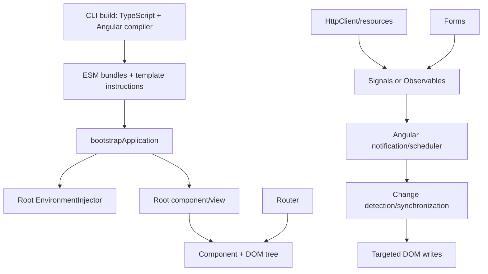
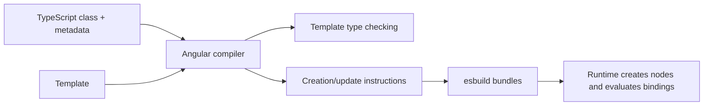

# Angular Overview and Mental Model

## Current version snapshot

Angular **22.1.5** is the latest stable release observed on 2026-09-09. Angular 22.0 released on 2026-06-03 and is actively supported. Angular 21 and 20 are in LTS. See [Angular releases](https://angular.dev/reference/releases) and [framework releases](https://github.com/angular/angular/releases).

Modern Angular means standalone declarations, built-in control flow, signals, zoneless scheduling, OnPush-default components, functional configuration, stable resources/Signal Forms, hybrid rendering, and Vitest. This is materially different from the NgModule + Zone.js + decorator-only mental model found in many older interview guides.

## What Angular is

Angular is a TypeScript application framework and platform. Its compiler turns decorated classes and HTML templates into JavaScript rendering instructions. At runtime it creates a component/view tree, resolves dependencies, connects template bindings/listeners, schedules synchronization after framework-recognized notifications, and performs minimal DOM updates. Router, forms, HTTP, SSR/hydration, testing and CLI/build tooling form an integrated platform.

An SPA is a deployment/navigation pattern, not Angular's definition. Angular can render a client SPA, server-render per request, prerender statically, or mix modes route by route.



## Bootstrap: input, code, output, why

**Input:** a root component and application-wide providers.

```ts
// main.ts
import {bootstrapApplication} from '@angular/platform-browser';
import {provideRouter} from '@angular/router';
import {App} from './app/app';
import {routes} from './app/app.routes';

bootstrapApplication(App, {
  providers: [provideRouter(routes)],
}).catch(console.error);
```

**Output:** Angular creates the root environment injector, instantiates `App`, matches its selector in the host document, renders the initial view, and enables navigation.

**Why:** `bootstrapApplication` is the standalone entry point. Providers configure application services without a root NgModule.

## End-to-end interaction

```mermaid
sequenceDiagram
  actor User
  participant DOM
  participant C as Component listener
  participant S as Signal/service
  participant A as Angular scheduler
  participant V as View synchronization
  User->>DOM: click/type
  DOM->>C: bound event + $event
  C->>S: set/update/emit/request
  S->>A: framework notification
  A->>V: schedule synchronization
  V->>V: traverse required views; evaluate bindings
  V->>DOM: write changed values only
```

Angular 22 is zoneless by default. A random `setTimeout` followed by mutation of an untracked plain field is not, by itself, the intended notification model. Template/host listeners, input updates, signals read by templates, `markForCheck`, `AsyncPipe`, and view attachment notify Angular. [Zoneless guide](https://angular.dev/guide/zoneless).

## The seven cooperating systems

| System | Responsibility | Senior-level boundary |
|---|---|---|
| Compiler | Analyze decorators/templates; type-check and emit instructions | AOT moves work/errors to build time; templates are executable trusted code |
| Components/views | Own UI behavior and renderable view structure | Component instance, host element and view are related but distinct |
| Reactivity | Track state dependencies and async streams | Signals represent current state; Observables represent sequences over time |
| Scheduler/change detection | Decide when and where to synchronize | Notification is not the same as immediate DOM rendering |
| DI | Map runtime tokens to scoped instances/values | Element and environment hierarchies have different lifetimes |
| Router | Recognize URL tree, run guards/resolvers, activate outlets | URL is durable/shareable state; guards are not security boundaries |
| Rendering platform | Browser DOM, server HTML, hydration | Browser globals are not universally available |

## Component tree versus DOM tree

A component contributes a host element and owns a view. Its template can contain DOM nodes, embedded views from control flow, child component hosts, and projected content. The component tree and DOM tree overlap but are not identical; `<ng-container>` and `<ng-template>` can create view structure without normal DOM elements, while projection displays content owned by a different view.

## Compilation and runtime



AOT is the CLI default. JIT exists for specialized/development cases but ships the compiler and defers template compilation to the browser. Ivy is the normal compiler/runtime architecture, not a new opt-in feature. Senior candidates should understand generated creation/update work, binding slots, view traversal and template type checking—not memorize private instruction names.

## Recommended reasoning model

For any feature, ask:

1. What owns the state and its lifetime?
2. Is it current state, an event stream, asynchronous server data, or URL state?
3. What notifies Angular that rendering may be stale?
4. Which view/provider/router boundary contains the behavior?
5. What is eagerly shipped, lazily shipped, server-rendered or hydrated?
6. Where are cancellation, cleanup, errors and security enforced?

## Interview checks

**Q: Is Angular only an SPA framework?**  
No. It supports CSR, SSR, SSG and per-route hybrid rendering.

**Q: Does a signal update the DOM immediately?**  
No. It invalidates dependents and notifies scheduling; Angular synchronizes views according to its lifecycle.

**Q: What starts an Angular 22 app?**  
Normally `bootstrapApplication`, which constructs application configuration/injectors and the root view.

**Q: Why is this different from server-side .NET DI?**  
Angular also has per-element providers whose hierarchy follows the rendered component/directive tree, plus environment injectors for app/routes/dynamic boundaries.

## Official sources

- [What is Angular?](https://angular.dev/overview)
- [Application bootstrap API](https://angular.dev/api/platform-browser/bootstrapApplication)
- [AOT compilation](https://angular.dev/tools/cli/aot-compiler)
- [Runtime performance](https://angular.dev/best-practices/runtime-performance)
- [Server and hybrid rendering](https://angular.dev/guide/ssr)

