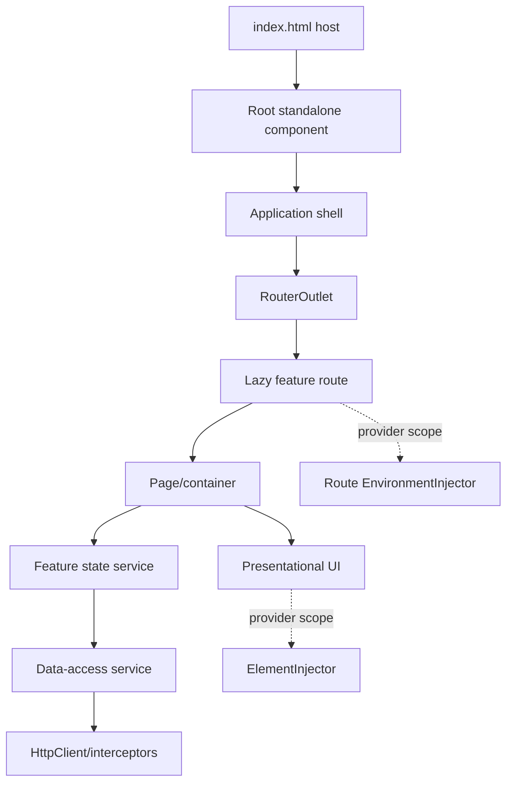
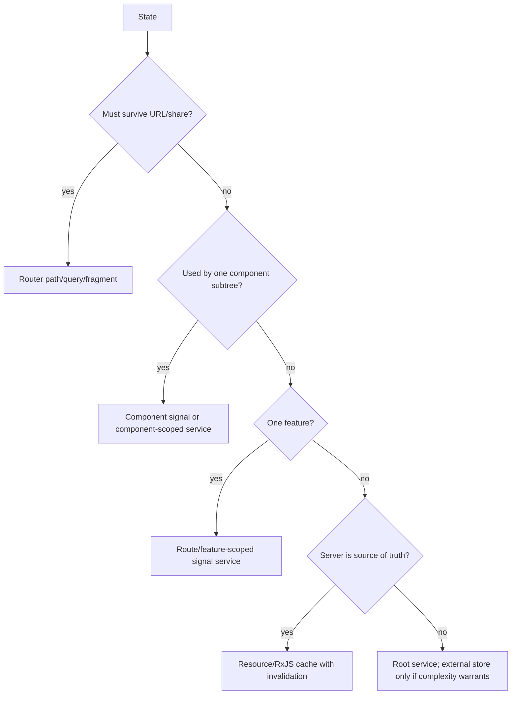

# Angular Architecture

## Runtime architecture



The compiler owns template transformation; the runtime owns creation, DI, scheduling and synchronization; the router owns URL-to-view activation; services own reusable behavior/state only when their lifetime matches their injector.

## Source organization: official versus practice

✅ Angular's style guide says organize by feature area, keep one main concept per file, and avoid top-level directories based only on code type (`components/`, `services/`, etc.). The following elaboration is a practical architecture, not a mandated Angular blueprint:

```text
src/app/
  app.ts
  app.config.ts
  app.routes.ts
  core/                 # truly app-wide policy/infrastructure, kept small
  shared/               # stable broadly reusable UI/utilities, not feature leakage
  features/
    users/
      users.routes.ts
      pages/
      ui/
      data-access/
      state/
      models/
```

Prefer vertical feature ownership. `users/data-access` should be private to users unless a real cross-domain contract exists. A `shared` dumping ground creates invisible coupling.

## Layers and dependency direction

| Layer | Owns | Must not own |
|---|---|---|
| Page/container | orchestration, route state, view model | reusable low-level presentation |
| UI component | inputs, outputs, rendering, local interaction | navigation policy, unrelated API calls |
| Feature state | writable state, derivations, commands | arbitrary app-global concerns |
| Data access | transport DTOs, HTTP composition, mapping | DOM/presentation behavior |
| Domain/model | domain language and pure rules | Angular runtime details unless pragmatically useful |

Dependency direction should point inward to stable contracts. This is frontend-specific Clean/Hexagonal reasoning, not an Angular requirement.

## State placement decision



Do not duplicate canonical URL/server state into a global client store without a synchronization policy.

## Container/presentational is a spectrum

A presentational component receives state and emits intent; a page/container connects router, feature state and data access. Small components may legitimately inject presentation utilities. The goal is testable ownership and reusable contracts, not a ban on DI in UI.

```ts
@Component({
  selector: 'user-row',
  template: `<button (click)="selected.emit(user().id)">{{ user().name }}</button>`,
})
export class UserRow {
  readonly user = input.required<User>();
  readonly selected = output<string>();
}
```

**Input:** a `User`; **Output:** the selected ID event. **Why:** the row knows interaction/rendering, while the parent owns navigation or mutation.

## Route boundaries

Lazy routes are code, navigation and DI boundaries. Route-level providers give one feature subtree an environment-scoped service instance. `loadComponent` lazily imports a component; `loadChildren` lazily imports route arrays or legacy modules. Split by user journeys, not every tiny component.

## Monorepos

A monorepo is a repository strategy, not runtime architecture. Libraries can enforce boundaries and reuse, but too many publishable libraries create build/release overhead. Separate deployability only when independently versioned consumers require it; otherwise workspace libraries can stay buildable/non-publishable.

## Staff-level review questions

- Which state has exactly one owner?
- What is the lazy code boundary and why?
- Which provider creates which lifetime?
- Where do transport DTOs become domain/view models?
- What happens on cancellation, stale responses and partial failure?
- Can a feature change without edits to `core`/`shared`?
- Is server-rendered output deterministic and free of request leakage?
- What measurements justify a performance abstraction?

## Official sources

- [Angular style guide](https://angular.dev/style-guide)
- [Define routes](https://angular.dev/guide/routing/define-routes)
- [Hierarchical DI](https://angular.dev/guide/di/hierarchical-dependency-injection)
- [Lazy loading routes](https://angular.dev/guide/routing/define-routes#lazy-loaded-components)

