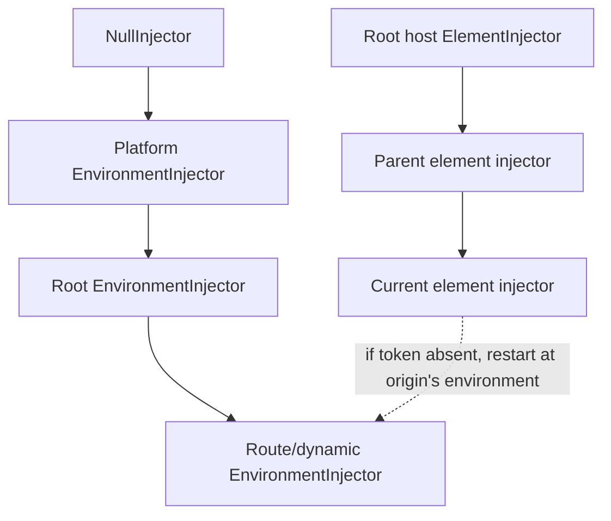

# Dependency Injection

Angular DI maps runtime tokens to values/factories and caches created instances in an injector. It is hierarchical, lazy at resolution, and tied to environment or element lifetimes.

## Current service style

```ts
@Service()
export class UserApi {
  private readonly http = inject(HttpClient);
  get(id: string) { return this.http.get<User>(`/api/users/${id}`); }
}
```

✅ In v22, `@Service()` is the ergonomic current choice for a new root singleton using `inject()`. It automatically root-provides and tree-shakes. Use `@Service({autoProvided: false})` for manual scope.

🟡 Keep `@Injectable({providedIn: 'root'})` when constructor injection, `providedIn: 'platform'`, or advanced injectable metadata is required:

```ts
@Injectable({providedIn: 'root'})
export class LegacyCompatibleApi {
  constructor(private readonly http: HttpClient) {}
}
```

Neither constructor injection nor `@Injectable` is deprecated. The official style guide prefers `inject()` for readability/type inference.

## Two injector hierarchies



Resolution for a component/directive first searches the origin and ancestors in the `ElementInjector` hierarchy, then the relevant `EnvironmentInjector` hierarchy. The closest provider wins. NgModule apps additionally have flattened ModuleInjector behavior.

| Provider location | Typical lifetime/visibility |
|---|---|
| `@Service()` / root `@Injectable` | one lazy-created root instance |
| `ApplicationConfig.providers` | app environment; eager inclusion risk for direct providers |
| route `providers` | route environment and descendants; useful feature scope |
| component/directive `providers` | one per host instance, visible down element subtree |
| component `viewProviders` | component view, not projected content |

When a component owning a provider is destroyed, its scoped instance is destroyed.

## `inject()` versus constructor injection

| `inject()` | constructor parameter |
|---|---|
| preferred current style | supported/common legacy style |
| field initializer, constructor, provider factory, guard/resolver | class construction only |
| strong token/options inference | decorators may be needed for modifiers/tokens |
| composes in helper functions with asserted context | makes constructor dependencies visible together |

`inject()` only works synchronously in an injection context. Lifecycle hooks, event handlers and arbitrary async continuations are outside it. Capture the dependency in a field, pass an injector, or deliberately use `runInInjectionContext`.

## Runtime tokens

Interfaces disappear after TypeScript compilation. Use a class or token:

```ts
export interface AppConfig { apiUrl: string; retries: number; }
export const APP_CONFIG = new InjectionToken<AppConfig>('app.config', {
  factory: () => ({apiUrl: '/api', retries: 2}), // root by default
});

const config = inject(APP_CONFIG);
```

The description is for debugging; token identity is the object reference.

## Provider recipes

```ts
providers: [
  UserStore,                                      // useClass shorthand
  {provide: LOGGER, useClass: ConsoleLogger},
  {provide: API_URL, useValue: '/api'},
  {provide: CLOCK, useFactory: () => new Clock(inject(LOCALE_ID))},
  {provide: OLD_LOGGER, useExisting: LOGGER},     // same instance alias
  {provide: HTTP_INTERCEPTORS, useClass: AuditInterceptor, multi: true},
]
```

- `useClass`: construct the specified class.
- `useValue`: exact value; dangerous for mutable request-specific SSR state at module top level.
- `useFactory`: calculate in injection context.
- `useExisting`: alias, not another instance.
- `multi`: collect all values into an array; omitting it can replace the chain.

## Resolution modifiers

```ts
const local = inject(Cache, {self: true, optional: true});
const parent = inject(FormGroupDirective, {skipSelf: true, optional: true});
const themed = inject(Theme, {host: true});
```

| Option | Effect |
|---|---|
| `optional` | return `null` rather than throw when absent |
| `self` | search only current injector |
| `skipSelf` | begin at parent |
| `host` | stop at host boundary |

Do not add `optional` merely to suppress configuration errors; it changes the contract.

## Hierarchical scenario

```ts
@Component({
  selector: 'checkout-flow',
  providers: [CheckoutDraft],
  template: `<address-step/><payment-step/>`,
})
export class CheckoutFlow {}
```

**Input:** two simultaneous `<checkout-flow>` instances. **Output:** each subtree shares one draft internally but not with the other flow. **Why:** the provider is cached in each checkout host's ElementInjector.

## Tree shaking and scope

An automatically provided service/factory can be removed if no reachable code injects it. Listing a class directly in a reachable providers array tends to make it part of the graph. Scope is a correctness decision first; do not root-provide mutable state merely for convenience.

## Senior failures

- Duplicate providers create multiple caches/instances.
- A component-level provider silently resets state when navigation destroys the component.
- `useClass` under two tokens creates two instances; `useExisting` aliases one.
- `providedIn: 'any'` and `providedIn: SomeNgModule` are deprecated options.
- Calling `inject()` after `await` or in `ngOnInit` throws NG0203.
- Route providers can outlive an individual component depending on route reuse/activation, so reason about the environment boundary.
- SSR top-level `useValue` can leak mutable data across requests; use per-request tokens/factories.

## Official sources

- [DI overview](https://angular.dev/guide/di)
- [Creating services and `@Service`](https://angular.dev/guide/di/creating-and-using-services)
- [Provider definitions](https://angular.dev/guide/di/defining-dependency-providers)
- [Hierarchical injectors](https://angular.dev/guide/di/hierarchical-dependency-injection)
- [Injection context](https://angular.dev/guide/di/dependency-injection-context)

