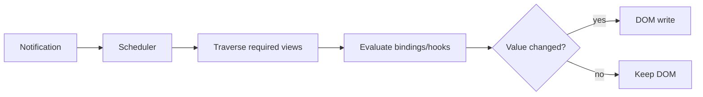

# Change Detection, OnPush and Zoneless Angular

## Current v22 baseline

`ChangeDetectionStrategy.OnPush` is the component default since Angular v22. Zoneless is the application default since v21. Older advice that starts with “Default checks everything after Zone.js patches async APIs” describes a legacy/configured mode, not the default new Angular 22 application.

Change detection/synchronization evaluates relevant view bindings and writes changed results to renderers/DOM. Signals provide fine-grained dependency notifications, but Angular still reasons in views and lifecycle passes.



## What makes an OnPush view eligible

The complete answer is broader than “input reference changed”:

- a bound component input changes (Angular's documented comparison is `==`);
- Angular handles a template/host/output event in that subtree;
- a signal read by the template changes;
- `AsyncPipe` receives and calls `markForCheck`;
- `ChangeDetectorRef.markForCheck()`;
- `ComponentRef.setInput()`;
- a marked-dirty view is attached/activated and other framework notifications occur;
- ancestors/descendants may be traversed according to event and dirty-view rules.

An event in an OnPush descendant causes its ancestors to be checked because the event occurred inside their view subtree. Unaffected OnPush sibling subtrees can be skipped.

## Input mutation problem

```ts
// Bad: same reference, ownership hidden
user.name = 'Grace';

// Good: new value crosses the input boundary
user = {...user, name: 'Grace'};
```

With a signal holding the object, call `.set/.update` with the intended value. Deep mutation followed by no notification can remain stale; deep mutation plus unrelated event may appear to “fix itself,” creating intermittent bugs.

## Signals

```ts
@Component({template: `<button (click)="count.update(v => v + 1)">{{ count() }}</button>`})
export class Counter { readonly count = signal(0); }
```

**Input:** click. **Output:** count text increments. **Why:** the listener is a notification and the signal records the component view as a consumer; update marks the relevant dependency/view dirty.

## `ChangeDetectorRef`

| API | Use | Caution |
|---|---|---|
| `markForCheck()` | notify that an OnPush view/ancestors should be considered in scheduled synchronization | does not synchronously render |
| `detectChanges()` | synchronously check this view and children | can create nested/extra work and timing bugs |
| `detach()` | remove a view from normal traversal | owner must define refresh/reattach policy |
| `reattach()` | return a detached view to normal traversal | does not replace correct notifications |

Reach for signals/`AsyncPipe`/inputs first. Manual APIs are for framework integration and measured advanced cases.

## Zoneless

Zone.js historically patched browser async APIs/events so Angular could assume async activity might have changed state and schedule broad synchronization. It could trigger unnecessarily, increase payload/startup overhead, complicate stack traces, and miss/uncomfortably patch newer APIs.

In v22 no provider is needed for zoneless. Ensure `provideZoneChangeDetection()` is absent and remove `zone.js`/`zone.js/testing` from polyfills and dependencies after compatibility testing.

Angular zoneless notifications include signals read in templates, `markForCheck` (including AsyncPipe), `ComponentRef.setInput`, bound host/template listeners and attaching marked views. Plain-field mutation in an arbitrary async callback should be converted to a signal or followed by a deliberate notification.

`NgZone.onStable`, `onUnstable`, `onMicrotaskEmpty`, and `isStable` do not provide useful scheduling signals in zoneless mode (`isStable` stays true and observables do not emit). Use `afterNextRender`, `afterEveryRender`, direct DOM observers, or `PendingTasks` for the actual requirement. `NgZone.run`/`runOutsideAngular` may remain for library compatibility.

For SSR, register custom async work with `PendingTasks` so serialization waits when Angular cannot infer the task.

## Zone-based legacy mode

`provideZoneChangeDetection()` opts back in. Under Zone.js, completion of patched async work can schedule change detection even when no state changed (“zone pollution”). `runOutsideAngular` can keep noisy third-party timers/listeners out, then re-enter/notify for meaningful updates.

## `ExpressionChangedAfterItHasBeenCheckedError`

Development mode detected that a checked binding changed within the same synchronization/check stability process. Do not silence it with delayed timers or routine `detectChanges`. Find the write: often a late lifecycle hook, child mutating parent, effect propagating derived state, or template side effect. Move initialization earlier, make derivation pure, or model ownership correctly.

## Performance reasoning

OnPush/zoneless reduce unnecessary work but cannot make an expensive template cheap. Profile first. `computed` memoizes derivation; stable `@for track` minimizes DOM; lazy chunks reduce startup; virtual scrolling/pagination limits DOM cardinality.

## Interview corrections

- “OnPush only updates when `@Input` reference changes.” **Incomplete.** Events, signals, AsyncPipe, manual/framework notifications and subtree relationships also matter.
- “Signals eliminate change detection.” **False.** They notify/invalidate and improve targeting; Angular still synchronizes views.
- “Zoneless means async code cannot update the UI.” **False.** It means Angular depends on explicit framework notifications rather than global async patching.
- “Default/Eager is removed.” **False.** It is an opt-in supported strategy; OnPush is default in v22.

## Official sources

- [Advanced component configuration](https://angular.dev/guide/components/advanced-configuration)
- [Skipping component subtrees](https://angular.dev/best-practices/skipping-subtrees)
- [Zoneless](https://angular.dev/guide/zoneless)
- [Runtime performance](https://angular.dev/best-practices/runtime-performance)
- [`ChangeDetectorRef`](https://angular.dev/api/core/ChangeDetectorRef)

