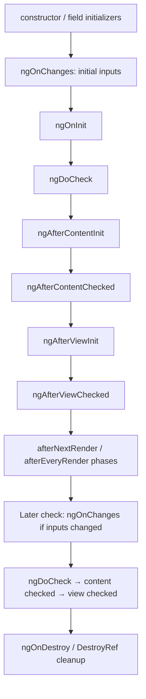
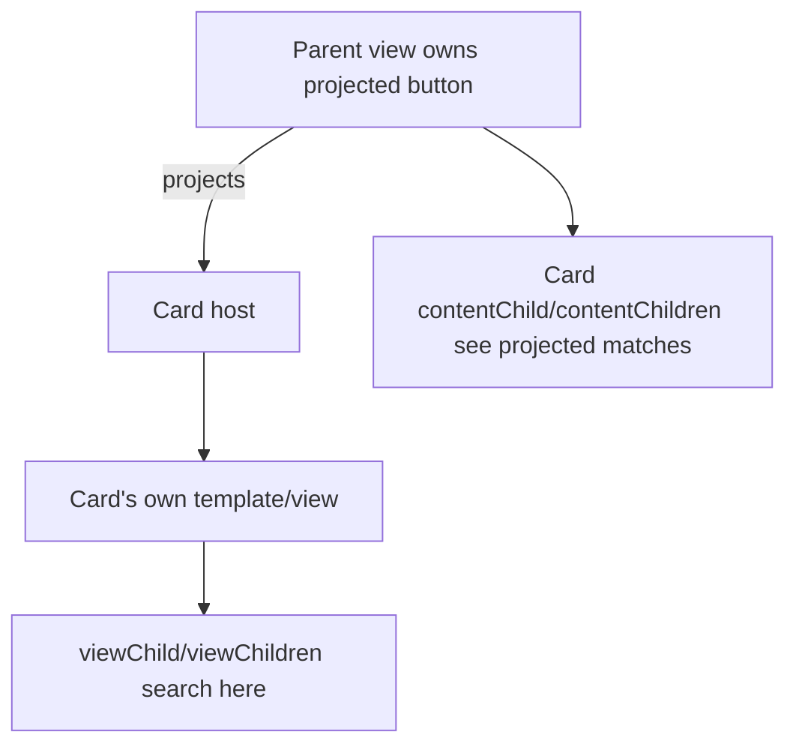

# Component Lifecycle and Queries

Angular walks the component tree top-to-bottom during synchronization. Avoid changing state in the middle of this traversal; each component is intended to be visited once per pass, though additional synchronization passes can occur when notifications arise.

## Creation/check order



On first initialization, the first `ngOnChanges` precedes `ngOnInit`. Content refers to projected children; view refers to the component's own template children.

## Hooks

| Hook | Use | Avoid |
|---|---|---|
| constructor/fields | DI and local setup; register effects/render callbacks | input-dependent logic, DOM/query assumptions |
| `ngOnChanges` | respond to decorator inputs and inspect previous/current/first | copying all inputs into redundant state |
| `ngOnInit` | one-time setup after initial inputs | expecting view/content queries to exist |
| `ngDoCheck` | rare custom change detection | expensive/general state synchronization |
| `ngAfterContentInit` | one-time work with projected content | changing already-checked binding state |
| `ngAfterContentChecked` | rare content follow-up | any routine expensive work |
| `ngAfterViewInit` | one-time view-query/DOM integration | papering over ownership with detectChanges |
| `ngAfterViewChecked` | rare view follow-up | state writes; runs frequently |
| `ngOnDestroy` | cleanup not owned automatically | assuming every async primitive needs manual unsubscribe |

Signal inputs often replace `ngOnChanges` derivation with `computed`; effects are only for side effects.

## Render callbacks

`afterNextRender` runs once after the application finishes rendering; `afterEveryRender` runs after each render. They are application-wide render callbacks registered in an injection context, not component methods. They do not run during SSR or build-time prerender.

```ts
constructor() {
  afterNextRender({
    write: () => this.host().nativeElement.style.padding = '8px',
    read: () => this.height.set(this.host().nativeElement.getBoundingClientRect().height),
  });
}
```

Phase order is `earlyRead → write → mixedReadWrite → read`. Separate writes from reads to avoid layout thrashing. Components are not guaranteed hydrated merely because a callback runs; respect hydration boundaries.

## Cleanup with `DestroyRef`

```ts
const destroyRef = inject(DestroyRef);
const observer = new ResizeObserver(entries => this.size.set(entries[0].contentRect));
observer.observe(this.host().nativeElement);
destroyRef.onDestroy(() => observer.disconnect());
```

Effects, `AsyncPipe`, `toSignal`, outputs and `takeUntilDestroyed` normally integrate cleanup with injection lifetime. Custom DOM/library resources still need teardown.

## View versus content queries



Signal queries are stable/production-ready since v19 and preferred for new code:

```ts
readonly inputEl = viewChild.required<ElementRef<HTMLInputElement>>('search');
readonly actions = contentChildren(ActionDirective);
readonly actionCount = computed(() => this.actions().length);
```

Child queries return `Signal<T | undefined>` unless required; plural queries return read-only arrays. They update as control flow changes the view and are lazily resolved on read. Required queries throw if read before a match exists, so do not access them too early in construction.

Decorator queries (`@ViewChild`, `@ContentChild`, etc.) remain supported common legacy. `static: true` resolves a view child before initialization but does not update for later structural changes; dynamic/default queries update and are ready by the relevant After hook.

## Query restraint

Queries couple parent and child implementation. Prefer inputs/outputs/models and projection contracts. Use queries for DOM integration, composite controls, focus management and deliberate imperative child APIs—not to bypass normal data flow.

## Prediction

If an input changes after creation, `ngOnChanges` runs before that check's `ngDoCheck`; `ngOnInit`, content/view init hooks do not run again, while checked hooks do. Render callbacks run after DOM rendering, not interleaved with the component hook.

## Official sources

- [Lifecycle](https://angular.dev/guide/components/lifecycle)
- [Queries](https://angular.dev/guide/components/queries)
- [Signal-query migration/status](https://angular.dev/reference/migrations/signal-queries)
- [`afterEveryRender`](https://angular.dev/api/core/afterEveryRender)

