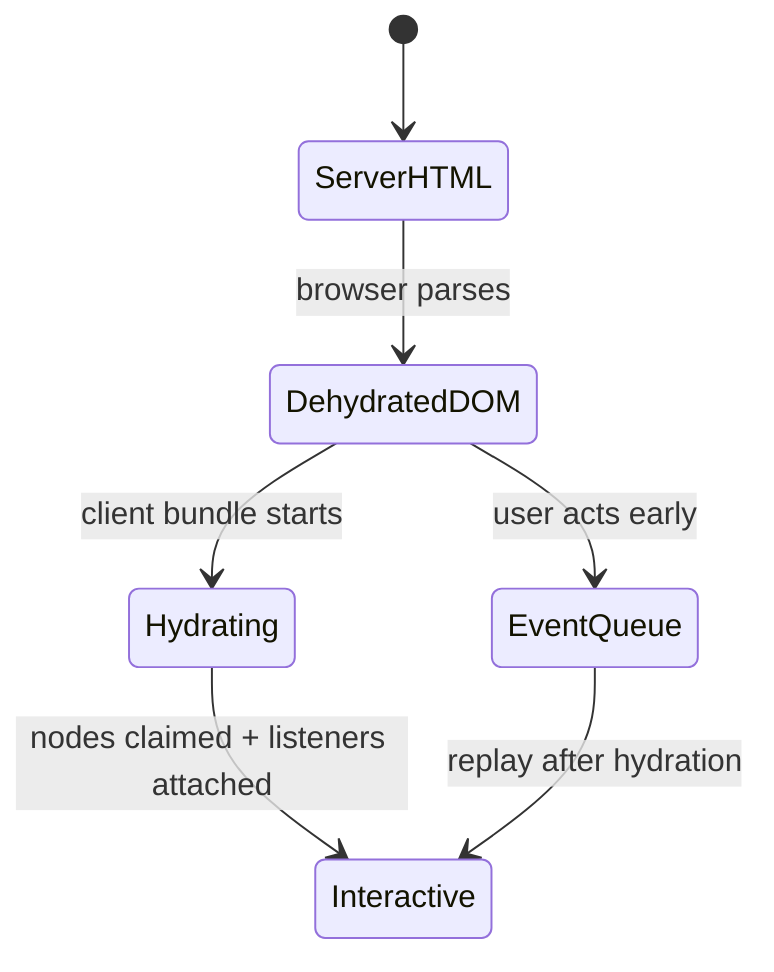

# SSR, SSG, Hydration and Hybrid Rendering

## Setup and route modes

Create with `ng new --ssr` or add `@angular/ssr`. Angular 22's SSR setup prerenders by default and can generate a server; `outputMode: "static"` produces a fully static deployment.

```ts
// app.routes.server.ts
export const serverRoutes: ServerRoute[] = [
  {path: '', renderMode: RenderMode.Prerender},
  {path: 'account', renderMode: RenderMode.Server},
  {path: 'workspace/**', renderMode: RenderMode.Client},
  {path: '**', renderMode: RenderMode.Server},
];
```

```ts
export const serverConfig: ApplicationConfig = {
  providers: [provideServerRendering(withRoutes(serverRoutes))],
};
```

| Mode | Select when | Do not select when |
|---|---|---|
| CSR | authenticated app interactions dominate, browser-only libraries, server cost matters | initial content/SEO/LCP is critical |
| SSR | request-specific public/personalized HTML, SEO, fast first content | server capacity/latency or browser-only code is unaddressed |
| SSG | public content known at build, CDN scale | content is user/request-specific or changes faster than deployment |

Hybrid rendering is often better than choosing one mode for the whole application.

## Prerender parameters and fallback

`getPrerenderParams` returns parameter maps at build time. It may synchronously call `inject()` before any `await`; injection context does not cross the async boundary. Non-generated paths may fall back to server (default), client, or none. Huge route sets increase build/deployment size/time.

## Hydration

Without hydration, the client would discard server DOM and render again, causing flicker/layout work. Hydration reconciles Angular's client view with existing nodes, then attaches interactivity. DOM structure—not just visible text—must match.



Typical mismatch causes: invalid HTML corrected differently by parsers, random/time-dependent initial output, direct DOM mutation, conditional browser/server markup, third-party DOM rewrite, omitted whitespace assumptions, and missing transfer of initial data.

Use `ngSkipHydration` only as a temporary leaf-component escape hatch. It recreates that subtree and gives up hydration benefits; fix incompatible DOM behavior.

## Incremental hydration

In Angular 22, `provideClientHydration()` enables incremental hydration by default and event replay automatically. `@defer` hydrate triggers create boundaries:

```html
@defer (hydrate on interaction; prefetch on idle) {
  <reviews-panel />
} @placeholder {
  <button>Read reviews</button>
}
```

The server can render main deferred content; on the client the region remains dehydrated until the hydrate trigger, while matching user events queue/replay. Hydration triggers include idle, viewport, interaction, hover, immediate, timer, `when`, and `never` where documented. Avoid nesting incompatible boundaries and test event replay/assistive technology.

## Data and stability

`HttpClient` transfer cache normally caches eligible GET/HEAD responses from server to the initial client render. It excludes authorization/cookie/credential and cache-prohibited traffic by default. Configure filters conservatively.

Resource APIs can opt into SSR transfer via a stable `id`; the same warning applies: data serializes into HTML. `PendingTasks.run()` tells SSR/tests to wait for custom promises Angular otherwise cannot see. Never keep SSR waiting on unbounded WebSockets/timers.

## Platform-specific implementations

Prefer separate providers rather than scattered `isPlatformBrowser` branches:

```ts
export abstract class Analytics { abstract track(name: string): void; }
// app.config.ts -> BrowserAnalytics
// app.config.server.ts -> ServerAnalytics
```

Browser-only DOM work belongs in `afterNextRender`/`afterEveryRender`, which do not run on server/prerender. Inject `DOCUMENT` when a platform document abstraction is appropriate; it does not make all DOM APIs semantically server-safe.

## Request isolation

Top-level providers/objects can be created once when server code loads. Use request tokens and factories for per-request data; never mutate shared singleton user state. Treat transfer state, generated HTML, logs and cache keys as possible data-exposure paths.

## Operational trade-offs

- SSR adds server CPU/memory, cold starts, API fan-out, timeouts and observability needs.
- SSG adds build time and invalidation/deployment lag.
- Hydration adds client JS and main-thread work; incremental hydration moves that work but increases state complexity.
- SEO depends on correct metadata/status/canonical URLs and crawler-visible content, not the SSR checkbox alone.
- Measure TTFB, LCP, INP, CLS, server latency/error rate, JS bytes and hydration duration.

## Official sources

- [Server and hybrid rendering](https://angular.dev/guide/ssr)
- [Hydration](https://angular.dev/guide/hydration)
- [Incremental hydration](https://angular.dev/guide/incremental-hydration)
- [Rendering strategy guide](https://angular.dev/guide/routing/rendering-strategies)

