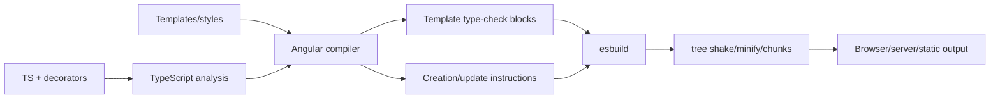

# Angular CLI, Build System and Compiler

## Commands

| Command | Purpose |
|---|---|
| `ng new` | create workspace/application; standalone, zoneless, OnPush, Vitest and modern builder defaults apply in v22 |
| `ng serve` | development build/server with HMR and CLI-managed Vite |
| `ng build` | compile, optimize, bundle, and optionally SSR/prerender |
| `ng test` | run configured unit-test builder; Vitest for new projects |
| `ng generate` | schematics for components, services, guards, migrations, etc. |
| `ng add` | install/configure a compatible package via schematics |
| `ng update` | update packages and run migrations; cross majors one at a time |

## Workspace anatomy

```text
angular.json              CLI projects, targets/builders, configurations, budgets/assets/styles
package.json              scripts and dependency versions
tsconfig.json             shared TypeScript options
tsconfig.app.json          application compilation context
src/main.ts               browser bootstrap
src/app/app.config.ts      application providers
src/app/app.routes.ts      routes
src/app/app.ts             root component
src/environments/          optional file-replacement/config pattern, not secret storage
```

Environment files ship in client bundles. Never put server secrets there.

## Builder model

CLI Architect maps targets in `angular.json` to builders. New apps use `@angular/build:application`, which builds browser ESM bundles and can integrate Node server output/prerendered routes. The builder uses esbuild. `ng serve` passes generated output to an encapsulated Vite development server; it is not a normal user-configurable Vite project.

```json
{
  "build": {
    "builder": "@angular/build:application",
    "configurations": {
      "production": {"optimization": true, "sourceMap": false},
      "development": {"optimization": false, "sourceMap": true}
    },
    "defaultConfiguration": "production"
  }
}
```

The webpack `@angular-devkit/build-angular:browser` builder is deprecated. `browser-esbuild` is a supported compatibility step, but `application` is preferred. The official migration is:

```text
ng update @angular/cli --name use-application-builder
```

Check custom builders, webpack assumptions, CommonJS server code, stylesheet import syntax and SSR output before migration.

## AOT compilation



AOT is the new-project default (since v9). It catches template errors earlier, removes the runtime compiler from production bundles, improves startup and reduces template-injection exposure. JIT compiles templates in the browser and is mainly historical/specialized.

`strictTemplates` makes template types follow inputs, nullability, generics, refs and `$event`. It supersedes deprecated `fullTemplateTypeCheck` configuration.

## Ivy

Ivy is the normal compiler/runtime representation used by modern Angular. It compiles local declaration information into efficient instructions and enables locality/tree shaking. Do not present it as an optional new renderer. Public reasoning matters: creation vs update, view trees, binding evaluation, DI and scheduling. Private array layouts/instruction names can change and are poor interview trivia.

## Optimization

- Dynamic imports from router and `@defer` create candidate chunks.
- Tree shaking removes statically unreachable code; side-effectful/CommonJS packages can constrain it.
- Production configuration controls optimization, hashing, sourcemaps, budgets and SSR/prerender.
- Library builds use Angular Package Format/ng-packagr, not the application builder's exact options.
- Build-time environment replacement is configuration, not access control.

## Update practice

1. Start from a clean branch and green tests/build.
2. Read compatibility/release/update guide.
3. Update one major at a time using `ng update`.
4. Commit framework and CLI migrations separately where practical.
5. Search deprecated APIs and remove opt-outs/legacy builders.
6. Test build, unit, SSR/hydration and critical browser paths.
7. Compare bundle and runtime metrics.

## Official sources

- [CLI reference](https://angular.dev/cli)
- [`ng build`](https://angular.dev/cli/build)
- [Build system migration](https://angular.dev/tools/cli/build-system-migration)
- [CLI builders](https://angular.dev/tools/cli/cli-builder)
- [AOT compiler](https://angular.dev/tools/cli/aot-compiler)
- [Template type checking](https://angular.dev/tools/cli/template-typecheck)

