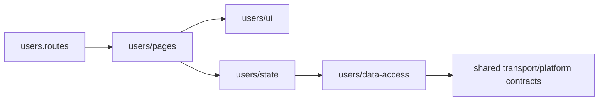
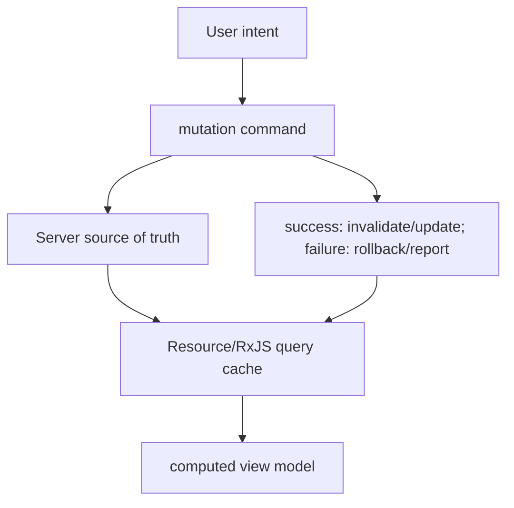

# Production Architecture Patterns

Except where explicitly attributed to the Angular style guide, these are general engineering patterns adapted to Angular—not framework mandates.

## Feature/vertical slice

Keep route, pages, UI, state, data access and tests near the feature that owns them. Cross-feature access goes through deliberate public contracts.



Benefits: ownership, lazy loading, deletion/change locality. Trade-off: some duplication is healthier than premature shared coupling.

## Facade/store service

A feature service exposes read-only signals/Observables plus commands and hides transport/transition details. It can simplify components; it becomes harmful when it merely forwards every method or grows into a global god service.

## Ports/adapters at external boundaries

Use an abstract class/token as a port and providers as adapters when multiple environments/implementations are real:

```ts
export abstract class PaymentGateway { abstract charge(c: Charge): Observable<Receipt>; }
providers: [{provide: PaymentGateway, useClass: HttpPaymentGateway}]
```

Do not create an interface/facade for every one-use class “for testability”; Angular's HTTP/DI testing already supplies boundaries.

## Container/presentational

Pages translate route/store state to UI inputs and outputs. UI components own rendering/local interaction. Use this where reuse/complexity benefits; a tiny page can remain one component.

## Server state versus client state



Every cache needs keys, scope, freshness, cancellation, invalidation and error policy. Optimistic updates need rollback/conflict semantics, not just early UI mutation.

## URL as state store

Filters, sort, page, selected entity and tabs often belong in route/query params when they should survive refresh, deep-link or browser navigation. UI-only transient affordances may stay local. Avoid two unsynchronized sources of truth (URL and global store).

## Error boundary by ownership

- transport maps technical failures and preserves cause;
- feature decides retry/fallback/state;
- component communicates actionable UX;
- global `ErrorHandler` reports unexpected framework-caught/fatal errors;
- server enforces correctness/security.

Do not catch every error in an interceptor and return empty data; that destroys context and converts failure into false success.

## Large application governance

- Feature public APIs and lint-enforced dependency boundaries.
- Route ownership and independently testable slices.
- Small `core`; shared UI requires stable semantics and stewardship.
- Architecture decision records for state, rendering and cache policies.
- CI budgets, tests and migration cadence.
- Platform teams provide paved roads, not mandatory abstraction layers.

## Migration patterns

### NgModule to standalone

Run official schematic phases, keep routes working, convert bootstrap/providers, delete safe modules, and leave compatibility islands temporarily. Standalone declarations can import NgModules and vice versa, enabling incremental migration.

### RxJS to signals

Do not translate operator pipelines into effects. Keep RxJS where time/concurrency matter, expose current state via `toSignal`, move pure state derivations to `computed`, and convert imperative subscriptions only when ownership improves.

### Zone.js to zoneless

Inventory plain-field async mutations, `NgZone.on*`, custom async work and third-party assumptions. Adopt signals/AsyncPipe/markForCheck notifications, test SSR stability and tests, then remove polyfills/dependency.

## Architecture interview answer shape

1. State requirements and quality constraints.
2. Name ownership/lifetime boundaries.
3. Trace one read and one write end-to-end.
4. Explain errors, cancellation, security and observability.
5. Explain lazy/rendering/deployment boundaries.
6. Give trade-offs and evolution path.

## Official sources

- [Angular style guide](https://angular.dev/style-guide)
- [Routing](https://angular.dev/guide/routing)
- [DI hierarchy](https://angular.dev/guide/di/hierarchical-dependency-injection)
- [Standalone migration](https://angular.dev/reference/migrations/standalone)
- [Signals migration resources](https://angular.dev/reference/migrations)

