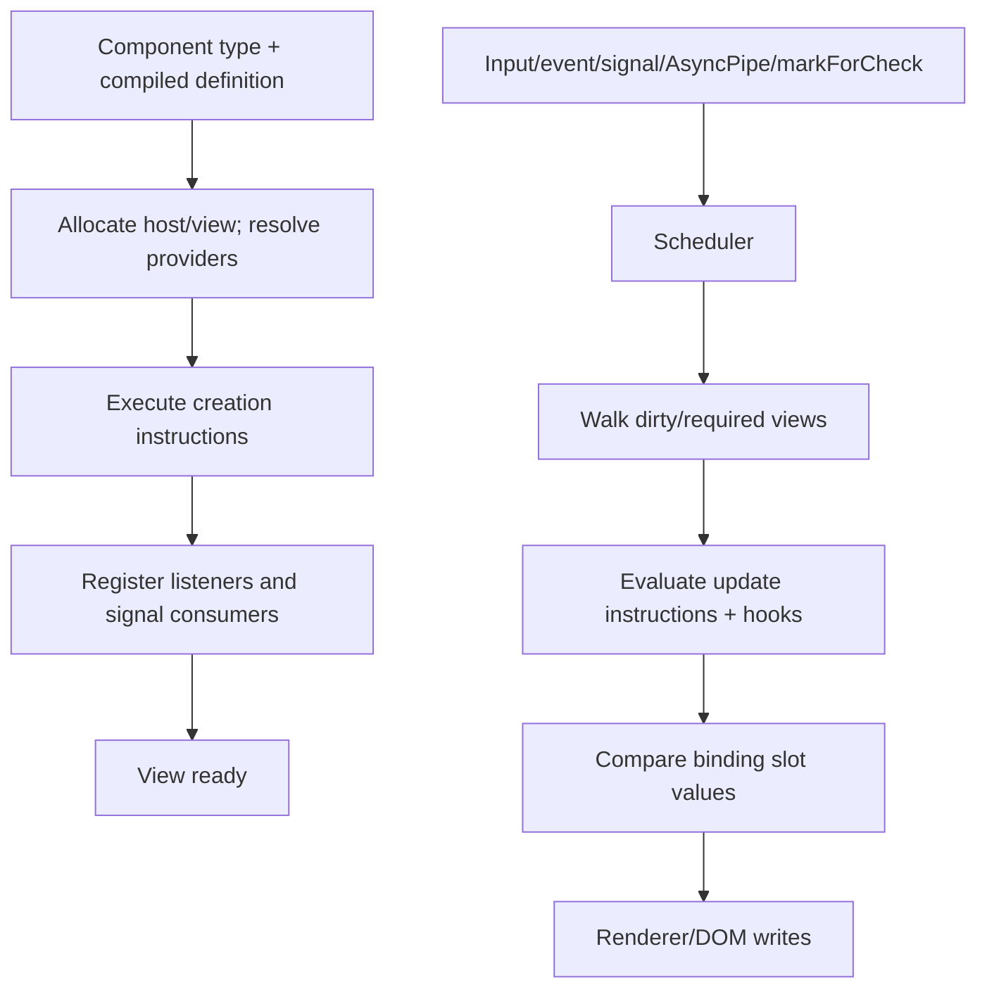

# Advanced Angular: Internals, Modern APIs and Error Handling

## Runtime mental model



Angular stores view/runtime metadata in optimized internal structures; those are private implementation details. Senior value comes from predicting lifetime, traversal, identity and scheduling without coupling application code to private symbols.

## DI resolution internals

An injection token is runtime identity. Providers compile into factory records. First resolution walks the element then environment hierarchy, invokes a factory in context, caches according to that injector and detects circular creation. Multi providers aggregate. Destroying an injector triggers registered service/DestroyRef cleanup.

## Signal graph internals

Signals are producers; templates/computed/effects/resources are consumers. During synchronous execution Angular records edges actually read. A write runs equality, increments/invalidate versioned graph state, and notifies live consumers. Computed evaluation is lazy/cached; effects schedule side effects. Dynamic edges are added/removed each run. This explains branch-sensitive dependencies and why reads after `await` do not track.

## Scheduler and rendering

Notification does not imply immediate synchronous DOM mutation. Angular coalesces/schedules synchronization, checks eligible views and can need more than one pass if application code changes state while rendering. Chrome's Angular profiling track can reveal multiple passes; avoid state propagation during checks.

## Error handling

Handle expected failures where context exists. Angular forwards unexpected errors it catches while invoking framework-owned work to root `ErrorHandler`. It does not wrap every method you call directly. `AsyncPipe` and `PendingTasks.run` can forward unhandled async errors; resources expose error/status instead.

```ts
export class ReportingErrorHandler implements ErrorHandler {
  private readonly reporter = inject(ErrorReporter);
  handleError(error: unknown) {
    this.reporter.capture(error);
    console.error(error);
  }
}

export const appConfig: ApplicationConfig = {
  providers: [{provide: ErrorHandler, useClass: ReportingErrorHandler}],
};
```

The CLI includes `provideBrowserGlobalErrorListeners()` in new apps to forward browser `error` and `unhandledrejection`. `ErrorHandler` is reporting/last resort, not a place to convert all failures to success or navigate indiscriminately.

## Modern API status matrix (Angular 22.1 docs)

| API/pattern | Version evidence | Status | Production recommendation |
|---|---|---|---|
| standalone declarations | available v14; default v19 | ✅ stable/default | new code; NgModules still supported |
| built-in control flow | v17 preview, v18 stable | ✅ recommended | migrate deprecated old structural control flow |
| signals | v16 introduction | ✅ core model | current/derived UI state |
| `input`, `output`, `model` | stable since v19 | ✅ | new component contracts |
| signal queries | production-ready/stable v19 | ✅ | new query declarations |
| `linkedSignal` | stable since v20 | ✅ | writable dependent state |
| `resource`, `httpResource`, `rxResource` | stable since v22 | ✅ | asynchronous reads, not mutations |
| Signal Forms `form` | stable since v22 | ✅ new | new signal apps; evaluate ecosystem/maturity |
| `@defer` | v17 preview, v18 stable | ✅ | measured code splitting below critical content |
| zoneless | experimental v18; default v21 | ✅ default | remove Zone.js after compatibility checks |
| OnPush | default v22 | ✅ default | write notification-compatible components |
| incremental hydration | available before v22; default under client hydration in v22 docs | ✅ | server-rendered defer boundaries |
| event replay | enabled by incremental hydration | ✅ | test early interactions |
| `@Service` | introduced in v22 docs/release generation | ✅ current ergonomic API | root singleton using `inject`; keep Injectable for advanced cases |
| Fetch HttpClient backend | default v22 | ✅ default | use XHR only for required compatibility/upload progress |
| Vitest CLI testing | default for new projects | ✅ default | migrate legacy suites deliberately |
| `debounced` signal | v22 docs | 🧪 experimental | prefer stable RxJS/resource patterns in conservative production |

Where the official API page does not display an exact “introduced” marker, this table avoids inventing one. “Stable since” and roadmap milestones are official status evidence.

## Current high-impact deprecations

- `NgIf`, `NgFor`, `NgSwitch` families: deprecated since v20; use built-in blocks.
- `@angular/animations` legacy package/providers: deprecated since v20.2, intended removal v23; use `animate.enter`/`animate.leave` with CSS/JS.
- `HttpClientModule`: deprecated; use `provideHttpClient` or v21+ defaults/configuration.
- server XHR backend: deprecated, intended removal v23; use Fetch.
- `CanLoad`: deprecated; use `CanMatch`.
- DI token/class guard route configuration: deprecated; use functional guards.
- webpack `browser` builder: deprecated; use `application` build system.
- `InjectionToken`/`Injectable` `providedIn: 'any'` or an NgModule type: deprecated.
- `fullTemplateTypeCheck`: deprecated; use `strictTemplates`.
- low-level runtime `Compiler`: deprecated because Ivy JIT does not require it.
- `CommonEngineOptions` in v22 SSR: deprecated; use `AngularNodeAppEngine`/`AngularAppEngine`.

## Dynamic rendering decision

| Need | API |
|---|---|
| choose component in template | `NgComponentOutlet` |
| insert next to a container | `ViewContainerRef.createComponent` |
| lazy-load template region | `@defer` |
| route-level component | router `loadComponent` |
| application overlay/portal | `createComponent` + attach/destroy with explicit environment |

## Staff interview prompts

- Why can a signal change without a computed rerunning immediately? Invalidation is eager; computed evaluation is lazy.
- Why can a parent OnPush component run after a descendant event? Event handling marks/traverses its containing view ancestry.
- Why can two injections of one class differ? Different closest provider/injector caches.
- Why can hydration fail with identical-looking HTML? Node structure/ownership/whitespace/direct DOM mutations can differ.
- Why should a resource not perform POST? New parameters/destroy abort prior loads, unsafe for mutations.

## Official sources

- [Signals](https://angular.dev/guide/signals)
- [Advanced component configuration](https://angular.dev/guide/components/advanced-configuration)
- [Unhandled errors](https://angular.dev/best-practices/error-handling)
- [Programmatic rendering](https://angular.dev/guide/components/programmatic-rendering)
- [v22 release](https://angular.dev/events/v22)
- [Roadmap](https://angular.dev/roadmap)
- [API status index](https://angular.dev/api/)

