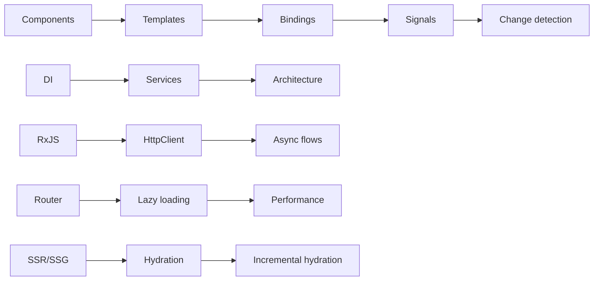

# Angular 22 Senior Interview Knowledge Base

> Audience: experienced Senior .NET developers moving into senior Angular work  
> Research baseline: Angular **22.1.5** stable documentation  
> Angular 22 release date: **2026-06-03**  
> Research date: **2026-09-09**

## Read this first: the 2026 Angular baseline

| Decision | Current Angular 22 position |
|---|---|
| Project style | ✅ Standalone bootstrapping and standalone declarations; organize by feature area |
| Component architecture | ✅ Small, composable components with explicit imports, signal-based inputs/outputs/queries, and lazy route boundaries |
| Change detection | ✅ `OnPush` is the default since v22; use signals/`AsyncPipe`/framework notifications |
| State primitives | ✅ `signal`, `computed`, `linkedSignal`; RxJS for event/async streams; stable resources for asynchronous reads |
| Control flow | ✅ `@if`, `@for`, `@switch`; `NgIf`, `NgFor`, and `NgSwitch` are deprecated since v20 |
| DI style | ✅ `inject()`; `@Service()` for new root singletons, `@Injectable` when constructor DI or advanced metadata is required |
| Forms | ✅ Signal Forms are stable since v22 for new signal-oriented work; Reactive Forms remain a mature choice for complex/existing forms |
| HTTP | ✅ Injectable by default since v21; Fetch backend is default; functional interceptors are recommended |
| Async rendering | ✅ `@defer`, SSR/SSG, hydration, incremental hydration and event replay |
| Runtime scheduling | ✅ Zoneless is the default since v21; Zone.js is a compatibility choice |
| Unit tests | ✅ New CLI projects use Vitest + jsdom; Karma remains supported for existing projects |
| Build | ✅ `@angular/build:application`, esbuild, and the CLI-managed Vite development server |

Important current deprecations include the old structural directives, `HttpClientModule`, `CanLoad`, DI-token/class guard configuration, the webpack `browser` builder, the `@angular/animations` package and its providers, and server XHR support. NgModules, decorator inputs/outputs/queries, constructor injection, `EventEmitter`, Zone.js, and Karma are not automatically deprecated merely because newer approaches exist.

## Source policy

Only current official Angular/Angular CLI, Angular-owned GitHub, TypeScript, and RxJS documentation was used. Labels mean:

- ✅ **RECOMMENDED** — current official guidance or default.
- 🟡 **SUPPORTED / CONTEXT DEPENDENT** — valid, sometimes best for existing constraints.
- ⚠️ **LEGACY** — supported older style; not itself an Angular deprecation claim.
- ❌ **DEPRECATED** — the official API/reference marks it deprecated.
- 🧪 **EXPERIMENTAL / PREVIEW** — outside normal stability guarantees.

Version-sensitive facts link directly to primary documentation. The core references are [releases](https://angular.dev/reference/releases), [version compatibility](https://angular.dev/reference/versions), the [v22 release page](https://angular.dev/events/v22), [roadmap](https://angular.dev/roadmap), and [API status index](https://angular.dev/api/).

## Learning roadmap

| Phase | Difficulty | Read in this order |
|---|---:|---|
| 1 — Fundamentals | 1/5 | Overview → TypeScript → Architecture → Components → Templates → Binding |
| 2 — Framework services | 2/5 | DI → Directives → Pipes → Forms → Router → HTTP |
| 3 — Reactive Angular | 3/5 | Signals → RxJS → State Management → Lifecycle |
| 4 — Runtime | 4/5 | Change Detection → Rendering → Performance → SSR/Hydration → Build/Compiler |
| 5 — Senior reasoning | 5/5 | Architecture Patterns → Advanced → Security → Testing → Modern/Legacy → Mistakes → Interview bank |

## Master index

| File | Purpose |
|---|---|
| [00-Angular-Overview.md](00-Angular-Overview.md) | Version snapshot, mental model, bootstrap, end-to-end flow |
| [01-TypeScript-for-Angular.md](01-TypeScript-for-Angular.md) | Angular-relevant TypeScript |
| [02-Angular-Architecture.md](02-Angular-Architecture.md) | Runtime and application structure |
| [03-Components.md](03-Components.md) | Metadata, composition, inputs, outputs, models |
| [04-Templates.md](04-Templates.md) | Expressions, variables, control flow, projection |
| [05-Data-Binding.md](05-Data-Binding.md) | Text, property, attribute, class, style, event and two-way binding |
| [06-Signals.md](06-Signals.md) | Deep signal model, linked/resource APIs, comparisons |
| [07-Dependency-Injection.md](07-Dependency-Injection.md) | Providers, hierarchies, scopes and injection context |
| [08-Directives.md](08-Directives.md) | Attribute/structural directives and host behavior |
| [09-Pipes.md](09-Pipes.md) | Pure/impure/custom pipes and `AsyncPipe` |
| [10-Forms.md](10-Forms.md) | Signal, Reactive and Template-driven Forms |
| [11-Routing.md](11-Routing.md) | Routes, guards, resolvers, lazy loading and events |
| [12-HTTP.md](12-HTTP.md) | `HttpClient`, interceptors, errors, cancellation and resources |
| [13-RxJS.md](13-RxJS.md) | Angular-focused RxJS and flattening operators |
| [14-State-Management.md](14-State-Management.md) | State placement, stores, server state and interop |
| [15-Change-Detection.md](15-Change-Detection.md) | OnPush-default traversal, notifications and zoneless |
| [16-Lifecycle.md](16-Lifecycle.md) | Hook order, render callbacks and query timing |
| [17-Rendering.md](17-Rendering.md) | CSR, SSR, SSG, hydration and DOM boundaries |
| [18-Performance.md](18-Performance.md) | Profiling, rendering, bundles, images and `@defer` |
| [19-Testing.md](19-Testing.md) | Vitest, TestBed, HTTP/router and async tests |
| [20-Security.md](20-Security.md) | XSS, sanitization, CSP, Trusted Types and XSRF |
| [21-SSR-SSG-Hydration.md](21-SSR-SSG-Hydration.md) | Production server/hybrid rendering deep dive |
| [22-Angular-CLI-Build.md](22-Angular-CLI-Build.md) | CLI, workspace, esbuild/Vite and compilation |
| [23-Architecture-Patterns.md](23-Architecture-Patterns.md) | Feature boundaries, data-access and staff trade-offs |
| [24-Advanced-Angular.md](24-Advanced-Angular.md) | Internals, dynamic rendering, errors and modern API matrix |
| [25-Senior-Interview.md](25-Senior-Interview.md) | 300-question bank and architecture/performance scenarios |
| [26-Common-Mistakes.md](26-Common-Mistakes.md) | Bad/good patterns with interview prompts |
| [27-Migration-and-Legacy-Angular.md](27-Migration-and-Legacy-Angular.md) | Accurate current/legacy/deprecated classifications |
| [Angular-Senior-Cheat-Sheet.md](Angular-Senior-Cheat-Sheet.md) | 30–60 minute final review |
| [Angular-Rapid-Fire.md](Angular-Rapid-Fire.md) | 200 compact Q&A prompts |

## Interview preparation order

1. Read 00, 03–07, 11–15 and explain every diagram aloud.
2. Implement one routed feature with a signal store, `HttpClient`, validation, loading/error states, and tests.
3. Read 18, 20–24; practice trade-offs, not slogans.
4. Attempt code-prediction/debugging scenarios in 25 before reading answers.
5. Finish with the cheat sheet and rapid-fire bank.

## Evidence boundaries

Angular officially recommends feature-oriented organization, standalone declarations, `inject()`, functional HTTP interceptors, built-in control flow, and its current defaults. Terms such as vertical slice, domain-driven frontend, container/presentational components, normalized entity state, and monorepo governance are general engineering practices, not mandates from Angular; the architecture files label them accordingly. NgRx is third-party and is discussed only as an optional external store model.

