# Software Architecture Styles and Architectural Patterns

> A technology-neutral handbook for experienced software developers  
> Primary cloud examples: Microsoft Azure  
> Documentation review date: 2026-09-09

## How to use this handbook

### Guide map

- [Foundations and taxonomy](#part-i--foundations-and-taxonomy)
- [Core application and service styles](#part-ii--from-one-deployment-boundary-to-services)
- [Distributed data, processing, and edge patterns](#part-iii--distributed-data-processing-and-edge-patterns)
- [How components communicate](#part-iv--how-components-communicate)
- [Logical versus deployment architecture](#part-v--logical-architecture-vs-deployment-architecture)
- [Quality, failure, operations, and security](#part-vi--quality-attributes-failure-operations-and-security)
- [Compare, evolve, and choose](#part-vii--compare-evolve-and-choose)
- [Applied reasoning](#part-viii--applied-architecture-reasoning)
- [Software Architecture Cheat Sheet](#software-architecture-cheat-sheet)
- [Architecture Communication Cheat Sheet](#architecture-communication-cheat-sheet)
- [Tech Lead Architecture Review Checklist](#tech-lead-architecture-review-checklist)
- [How To Recognize Architecture From A Codebase](#how-to-recognize-architecture-from-a-codebase)
- [Architecture Catalog](#architecture-catalog)
- [Final 60-minute review](#software-architecture--final-60-minute-review)
- [Final 20-minute review](#software-architecture--final-20-minute-review)
- [Final 5-minute mental map](#software-architecture--final-5-minute-mental-map)

There is no universal authoritative taxonomy, and therefore no meaningful claim that there are exactly *N* software architectures. Official sources classify the same idea at different levels. Microsoft calls N-tier, microservices, event-driven, Web-Queue-Worker, big data, and big compute “architecture styles”; other guidance describes reusable solutions such as CQRS or Transactional Outbox as “patterns.” A container or a region is a deployment boundary, not an application style. This handbook normalizes those views without pretending that all concepts belong in one flat list.

Read the guide in three passes:

1. Learn the vocabulary and the major structural choices.
2. Trace boundaries, arrows, state, deployment units, and failure paths in every diagram.
3. Use the matrices, scenarios, decision tree, and review checklist against a real codebase.

The central reasoning chain is:

> **Requirements → constraints → style → boundaries → communication → data → deployment → failure model → scalability → operations → trade-offs → decision**

Architecture is composable. One real system can use microservices for decomposition, events for integration, CQRS in one service, Clean Architecture inside that service, containers as packaging, and active-active regions as a deployment topology. Those statements answer different questions and do not conflict.

### Evidence policy and terminology limits

This guide uses current official documentation from Microsoft, AWS, Google Cloud, Kubernetes, Docker, OASIS, ISO, IETF/RFC Editor, gRPC, GraphQL, and Eclipse. Search results were used only to locate official pages; claims are based on the reviewed pages themselves. Azure mappings are examples, never definitions.

Some popular terms lack a single current owner-maintained specification:

- **Modular monolith** is normalized here as the documented combination of one deployment unit with deliberate internal modules, encapsulation, and dependency boundaries. Microsoft documents all of those characteristics, although its current guide more often says “monolithic application” with multiple components, projects, libraries, or layers.
- Microsoft documentation groups **Clean**, **Hexagonal/Ports-and-Adapters**, and **Onion** as related dependency-inversion approaches. AWS separately and currently documents Hexagonal Architecture. No reviewed primary source establishes that the three are identical, so this guide does not make that claim.
- **Macroservices** and generic **service-based architecture** had no sufficiently precise, current, owner-maintained definition in the reviewed primary documentation. They are not treated as distinct styles here.
- **JAMstack** had no sufficiently authoritative current primary architecture specification in the reviewed source set. It is not promoted to a handbook style.
- For a universal definition of a “distributed monolith,” “god service,” or “nano-service”: **Not sufficiently established by the reviewed primary documentation.** The documented symptoms—shared schemas, synchronized releases, chatty calls, and poor boundaries—are covered instead.

---

# Part I — Foundations and Taxonomy

## 1. What software architecture is

ISO/IEC/IEEE 42010:2022 defines architecture around a system’s fundamental concepts or properties in its environment, embodied in elements, relationships, and principles of design and evolution. The practical consequence is that architecture is not a folder diagram. It is the set of consequential structural decisions that let stakeholders reason about qualities such as changeability, availability, performance, and security.

**Architecture versus design.** All architecture is design, but not every design choice is architecturally significant. A local algorithm can usually change without reorganizing the system. A service boundary, public contract, transaction boundary, data owner, deployment unit, or regional topology is harder to reverse and affects several qualities or teams; that is architectural.

**Logical versus physical.** A logical view shows responsibilities and dependencies. A physical/deployment view shows processes, containers, nodes, zones, and regions. A box called `Ordering` might be a namespace, an in-process module, a process, or several replicated containers. The diagram must say which.

**Application versus deployment architecture.** Application architecture explains code and runtime responsibilities. Deployment architecture explains where and how executable units run. Clean Architecture does not prescribe Kubernetes; Kubernetes does not tell you whether the application is a monolith or microservices.

### Working taxonomy

| Category | Question answered | Examples in this guide |
|---|---|---|
| Architecture style | What high-level elements, connectors, and constraints shape the system? | Monolith, N-tier, SOA, microservices, event-driven, Web-Queue-Worker, big data |
| Architectural pattern | What reusable system-level solution addresses a recurring force? | Pipes and Filters, Saga, API Gateway, Strangler Fig |
| Application/code organization | Where may code dependencies point? | Layered, Clean, Hexagonal, Onion |
| Integration/communication | How do components exchange work or facts? | Request/response, queue, publish/subscribe, event stream |
| Data pattern | Who owns state and how is it represented or distributed? | Shared database, database per service, CQRS, Event Sourcing, sharding, materialized view |
| Deployment topology | In what physical fault and release boundaries does it run? | Process, container, cluster, serverless, active-active, active-passive |
| Reliability pattern | How are expected faults contained and recovered? | Retry, Circuit Breaker, Competing Consumers, compensation |

One concept may occupy more than one category. Event Sourcing is primarily a data/persistence pattern but strongly shapes the application and integration model. Serverless is a managed execution and deployment model that can host functions from a monolith, microservices, or an event pipeline.

### Vocabulary that changes decisions

| Term | Architecture-specific meaning |
|---|---|
| Component | A replaceable logical or runtime element with a responsibility and interface; it need not be networked or independently deployed. |
| Service | A capability exposed through a prescribed interface/contract. In microservices it is also autonomous and independently deployable. |
| Boundary | The line across which rules change: ownership, dependency, API, process, transaction, trust, deployment, or failure. Different boundaries may not align. |
| Coupling | How much one element must know about or change with another. Shared schemas, temporal availability, protocol details, and release coordination are forms of coupling. |
| Cohesion | How strongly responsibilities inside a boundary belong and change together. High functional cohesion is evidence for one module/service. |
| Dependency | A compile-time, runtime, data, operational, or organizational reliance. A diagram should reveal which kind. |
| State | Durable or transient information whose location, owner, consistency, recovery, and lifecycle must be explicit. |
| Transaction | A consistency boundary. A local database transaction is not the same as an end-to-end distributed business process. |
| Scalability | How throughput changes as resources are added. Microsoft cautions that bottlenecks and coordination limit proportional scale. |
| Availability | Whether a capability is accessible and functional from the user’s perspective. |
| Reliability | The broader ability to perform correctly and recover, including availability, integrity, and recoverability targets. |
| Consistency | What values observers can see, and when. “Eventual” is a deliberate model for a particular flow, not a synonym for “distributed.” |
| Latency | Elapsed time until an operation’s result is available. Network hops, coordination, and cold starts can add latency. |
| Throughput | Completed work per interval, such as requests or transactions per second. It is not the inverse of latency. |
| Fault isolation | Preventing one malfunction from exhausting or failing unrelated capabilities; it requires correct boundaries and upstream behavior. |

### Architecture viewpoints: ask the same system six ways

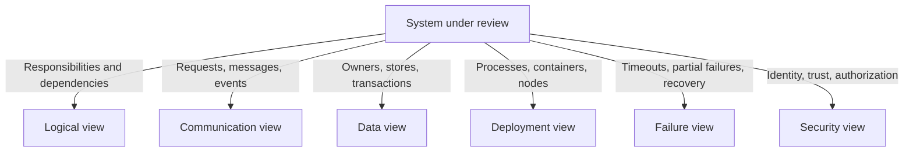

No single view is “the architecture.” Folder names are especially weak evidence unless dependency, runtime, data, and deployment boundaries confirm them.

**Primary official sources:**

- [ISO/IEC/IEEE 42010:2022 overview](https://www.iso.org/standard/74393.html)
- [Azure Architecture Styles](https://learn.microsoft.com/en-us/azure/architecture/guide/architecture-styles/)
- [Azure Well-Architected Framework](https://learn.microsoft.com/en-us/azure/well-architected/what-is-well-architected-framework)
- [CMU SEI Software Architecture](https://www.sei.cmu.edu/software-architecture/)

## 2. Layer versus tier — logical is not physical

A **layer** is a logical grouping of responsibility and a dependency rule. A **tier** is a physical/runtime separation. Microsoft’s N-tier guide explicitly describes logical layers and physical tiers.

### Three layers in one process

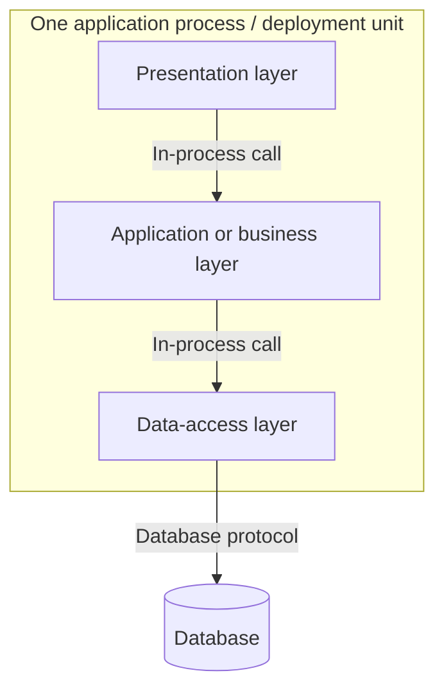

### Three physical tiers

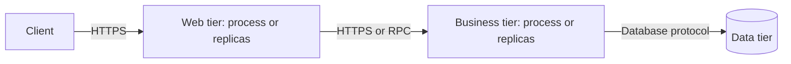

The first has three logical layers but usually two runtime locations: application and database. The second places responsibilities across three networked tiers. A project-per-layer does not create a tier. Conversely, a physical web tier can contain several logical layers.

**Why it matters:** crossing a layer may be an in-memory call; crossing a tier adds serialization, authentication, latency, independent availability, versioning, and partial-failure concerns. Never infer those costs from a layer diagram.

**Primary official sources:**

- [N-tier architecture style](https://learn.microsoft.com/en-us/azure/architecture/guide/architecture-styles/n-tier)
- [.NET common web application architectures](https://learn.microsoft.com/en-us/dotnet/architecture/modern-web-apps-azure/common-web-application-architectures)

---

# Part II — From One Deployment Boundary to Services

## 3. Monolithic architecture

### Classification and purpose

**Style/deployment characteristic.** A monolithic application’s core behavior runs in one process and is typically deployed as one unit. It can still call remote systems, use a database, contain libraries, and be horizontally replicated. “Monolith” says nothing by itself about code quality.

### Mental model, components, and flow

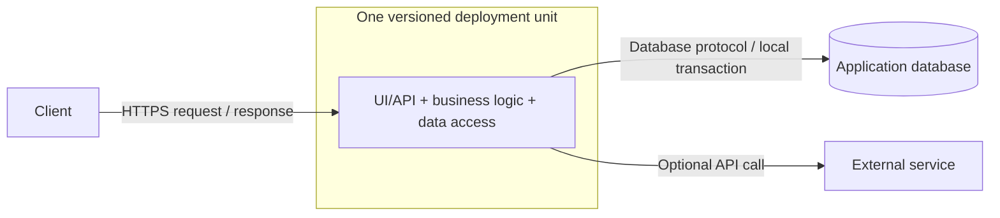

- **Dependency direction:** internal method calls and library references; discipline is optional unless deliberately enforced.
- **Data ownership:** commonly one application owns one relational schema or database. A monolith can use several stores, but its deployment boundary remains one.
- **Transaction model:** local ACID transactions are straightforward when work stays in one transactional store.
- **Deployment:** one executable, web application, VM image, or container image/version. Multiple replicas are still one *kind* of deployment unit.
- **Scaling:** clone the entire application behind a load balancer. This is simple when all capabilities scale together, inefficient when only one hotspot needs capacity.
- **Failure model:** a process crash removes all capabilities in that replica; other replicas may continue. Resource exhaustion or a bad in-process change can affect the whole process. Database/external dependency failures still create partial degradation.
- **Consistency:** simple strong local consistency is feasible inside one store; remote integrations still require distributed-failure handling.
- **Observability:** a request often stays in one process, simplifying local logs and traces, but replicated instances still need aggregation and correlation.
- **Security:** fewer network entry points and service identities, but a compromise or excessive privilege can expose a larger capability set. Keep least privilege at database, module, and external-resource boundaries.

### Trade-offs

**Advantages**

- Simplest build, test, deployment, debugging, and local transaction model.
- Low in-process call latency and no serialization between internal components.
- Efficient for a small team and a domain whose parts share lifecycle and scale.
- Can be replicated or containerized without becoming microservices.

**Disadvantages**

- A small change can require retesting and redeploying the whole unit.
- Hotspots cannot be independently deployed or scaled.
- Weak internal boundaries allow dependency tangles and shared-schema coupling to grow.
- Larger blast radius for resource leaks, startup failure, and incompatible changes.

**Use when:** one team or closely coordinated teams own the system; independent releases and scaling are not required; transactions are important; the domain or operational capacity does not justify distribution; time-to-market and simple operations dominate.

**Do not use unchanged when:** independently changing capabilities repeatedly block one another; only a few parts need radically different scale or availability; ownership boundaries are stable but release coordination dominates; the process/resource blast radius violates requirements.

**Common mistakes:** equating “one repository,” “one database server,” “one container,” and “one process”; putting all code in one project with no dependency rules; selecting microservices merely because the codebase is large.

**Commonly combined with:** layering, Clean/Hexagonal organization, modules, Web-Queue-Worker, containers, cache-aside, and multiple replicas.

**Migration:** improve measurements and module boundaries first. Extract a service only for a demonstrated independent lifecycle, scale, ownership, or isolation need. A queue-worker can remove one hotspot without decomposing the whole domain.

### Azure-oriented example

Deploy one ASP.NET Core application to Azure App Service or as one container application; use multiple stateless replicas behind platform load balancing, Azure SQL for relational state, and Azure Monitor/Application Insights for telemetry. These services implement the topology; they do not define the monolith.

**Primary official sources:**

- [.NET common web application architectures](https://learn.microsoft.com/en-us/dotnet/architecture/modern-web-apps-azure/common-web-application-architectures)
- [.NET containerizing monolithic applications](https://learn.microsoft.com/en-us/dotnet/architecture/microservices/architect-microservice-container-applications/containerize-monolithic-applications)

## 4. Modular monolith

### Classification and documentation boundary

**Application organization plus one deployment boundary.** The reviewed Microsoft documentation establishes that a monolith can be organized into components, libraries, projects, or layers while running and deploying as one application. This handbook uses **modular monolith** for the stronger case: business modules expose deliberate interfaces, hide internals, restrict dependencies, and remain one deployment unit.

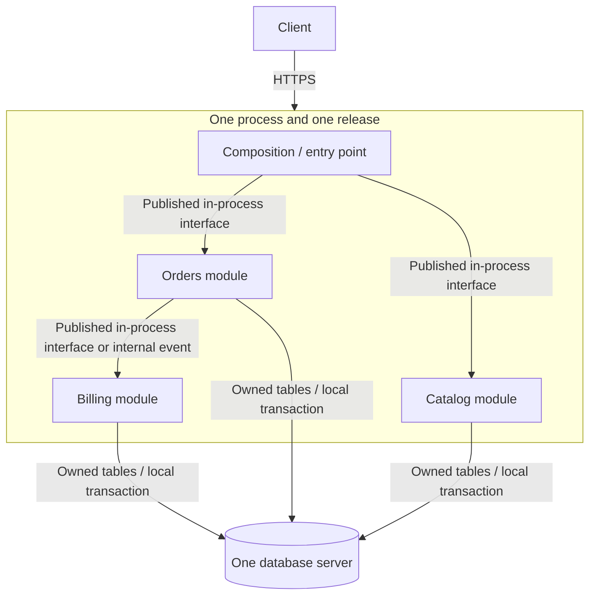

- **Boundary:** compile-time/module contract, not a network boundary.
- **Communication:** in-process calls or in-process events; no network reliability theater is required between modules.
- **Data:** physical storage may be shared while schema/table ownership is logical. Cross-module writes bypassing public contracts destroy the boundary.
- **Transactions:** one local transaction can span modules if the business invariant truly spans them; frequent cross-module transactions may signal a boundary mismatch.
- **Deployment/scaling/failure:** the whole application releases, scales, and fails as one unit, like a monolith.
- **Observability/security:** module tags and boundaries improve attribution, but modules do not automatically provide process isolation or distinct network identities.

**Advantages:** preserves simple operations, low-latency calls, and local transactions while making change ownership, tests, and future extraction clearer.

**Disadvantages:** independent deployment/scaling/fault isolation remain unavailable; architectural rules require enforcement; one database makes ownership violations tempting.

**Use when:** domain complexity deserves explicit boundaries but distributed-system costs are unjustified; teams can coordinate one release; local consistency is valuable; likely boundaries are still evolving.

**Do not use when:** hard process/trust/fault isolation is mandatory, or independently owned parts truly need different release and scaling lifecycles.

**Common mistakes:** modules that directly query each other’s tables; cyclic project references; a “shared” module containing business logic from every domain; treating folders as enforcement.

**Commonly combined with:** Clean or Hexagonal internals per module, domain events in process, one database server with schema ownership, and an external queue for selected background work.

**Evolution:** modularization is valuable in itself. It can make selective service extraction safer, but every modular monolith does **not** need to become microservices.

### Monolith versus modular monolith

| Concern | Unstructured/all-in-one monolith | Modular monolith |
|---|---|---|
| Deployment | One unit | One unit |
| Calls | In process | In process through explicit interfaces |
| Code boundaries | Convention or none | Enforced references/contracts |
| Data | Commonly freely shared | Logical owner per module; physical sharing possible |
| Scaling/failure | Whole unit | Whole unit |
| Main risk | Dependency tangle | Boundaries decay under shortcuts |

**Primary official sources:**

- [.NET common web application architectures](https://learn.microsoft.com/en-us/dotnet/architecture/modern-web-apps-azure/common-web-application-architectures)
- [.NET data sovereignty and bounded contexts](https://learn.microsoft.com/en-us/dotnet/architecture/microservices/architect-microservice-container-applications/data-sovereignty-per-microservice)
- [Azure microservice-boundary guidance](https://learn.microsoft.com/en-us/azure/architecture/microservices/model/microservice-boundaries)

### Knowledge check — one deployment boundary

> Six developers own one business application. It needs strong local transactions and has no independent deployment requirement. Should it automatically use microservices?

<details>
<summary>Answer</summary>

No. Current Microsoft guidance explicitly says microservice benefits can cost more than they return. Start with the simplest boundary that meets the qualities—often a well-structured monolith or modular monolith. Reconsider distribution when independent lifecycle, scale, ownership, or fault isolation becomes a measured requirement.

</details>

---

## 5. Layered and N-tier architecture

### Classification and purpose

**Layered:** application/code-organization style. **N-tier:** style that combines logical layers with physical tiers. Both separate responsibilities; only tiers necessarily cross a network/process boundary.

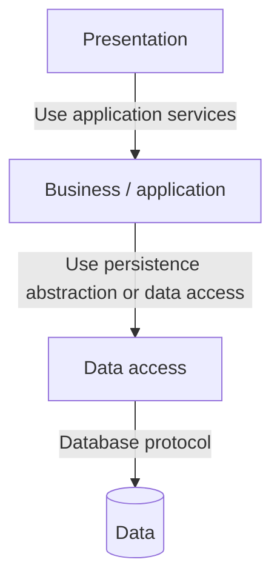

A **closed layer** convention allows a layer to call only the next layer. An **open layer** allows bypassing one or more layers. The reviewed current sources strongly establish downward dependencies but do not standardize the open/closed labels; use them as descriptive vocabulary, not as an official Microsoft classification.

### Runtime and trade-offs

- **Communication:** in-process if layers share a process; HTTPS/RPC/messaging/database protocol when placed in separate tiers.
- **Data:** usually centralized behind data-access/data tiers. That can standardize access but couple vertical business capabilities through shared models.
- **Deployment:** one process, several processes, on-premises/cloud split, or multiple scaled tier replicas.
- **Scaling:** scale each physical tier when stateless and independently hosted; a shared data tier can remain the bottleneck.
- **Failure:** in-process exceptions differ from tier failure. Across tiers, timeouts, partial availability, retries, authentication, and latency must be designed.
- **Testing:** layer interfaces aid isolated tests, but horizontal changes can touch presentation, business, and data layers for one feature.
- **Security:** tiers can create network segments and per-tier identities, but every extra endpoint expands configuration and attack surface.

**Advantages:** familiar separation of concerns, reusable lower-level capability, straightforward migration for already-layered enterprise systems, and explicit downward dependency rules.

**Disadvantages:** horizontal layers can scatter a feature across many projects, encourage an anemic business layer, and make changes ripple. Physical tiers add latency and operations. Scaling one tier does not remove downstream bottlenecks.

**Use when:** responsibilities and security/network tiers are stable; existing systems already fit; operational teams benefit from separated web/business/data hosts; migration should minimize application changes.

**Do not use when:** it exists only to create projects; every request passively traverses layers that add no policy; business capabilities need independent ownership more than technical-layer reuse.

**Commonly combined with:** monoliths, SOA, REST APIs, queues between selected tiers, cache-aside, and Clean Architecture (though their dependency emphases differ).

### Azure-oriented example

Web Application Firewall and load balancer → App Service/Container Apps web tier → separately hosted business tier → Azure SQL data tier; Service Bus can provide an asynchronous path. This is an implementation example, not the definition.

**Primary official sources:**

- [N-tier architecture style](https://learn.microsoft.com/en-us/azure/architecture/guide/architecture-styles/n-tier)
- [.NET common web application architectures](https://learn.microsoft.com/en-us/dotnet/architecture/modern-web-apps-azure/common-web-application-architectures)

## 6. Clean, Hexagonal, and Onion architecture

### What problem they share

These are **application/code-organization architectures**, not deployment topologies. They protect business/application logic from UI, database, frameworks, messaging, and other replaceable details by inverting source-code dependencies toward stable core abstractions. They can organize a monolith, a module, a worker, or each microservice.

### Clean Architecture

Microsoft’s current .NET guide places the Application Core at the center. UI and Infrastructure depend on core interfaces; dependency injection supplies implementations at runtime.

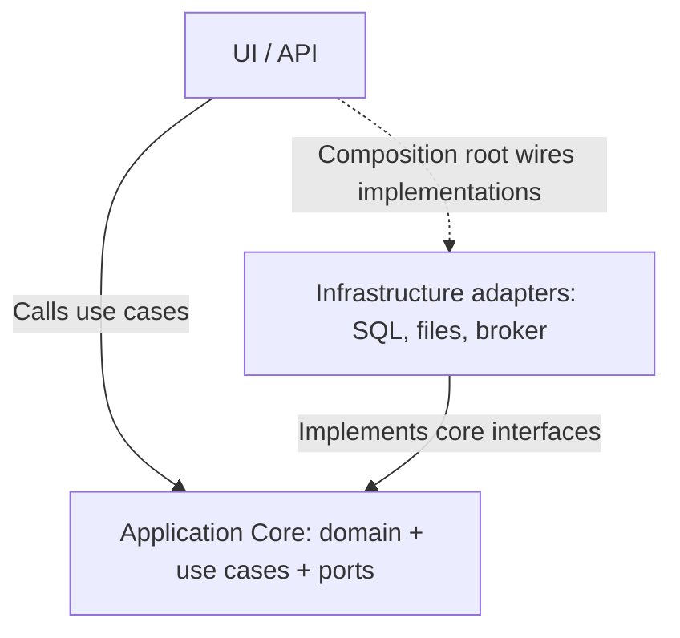

- **Communication/data/deployment:** not prescribed. An adapter can be SQL, HTTP, a broker, or a test double; all projects may deploy in one process.
- **Benefit:** core unit testing and replacement of external details.
- **Cost:** interfaces, mapping, and indirection can be wasteful for trivial CRUD.
- **Mistake:** a project-per-circle cargo cult while dependencies still point from core to infrastructure.

### Hexagonal Architecture / Ports and Adapters

AWS describes technology-neutral **ports** as entry/exit interfaces and **adapters** as technology-specific translators. The emphasis is interaction across the application boundary, not literal hexagonal folders.

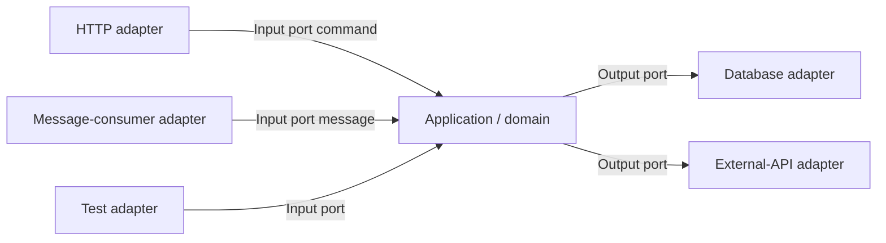

**Use when:** multiple input/output technologies exist, external details change, or isolated business testing matters. **Do not use** when adapter maintenance exceeds realistic change/testing value. Ports belong to the application purpose; adapters translate technical protocols.

### Onion Architecture

Microsoft uses Onion as a related name in the family of dependency-inverted architectures. From the reviewed primary documentation, a fully distinct normative Onion specification is **not sufficiently established**. The safely supported mental model is concentric dependency direction toward the domain:

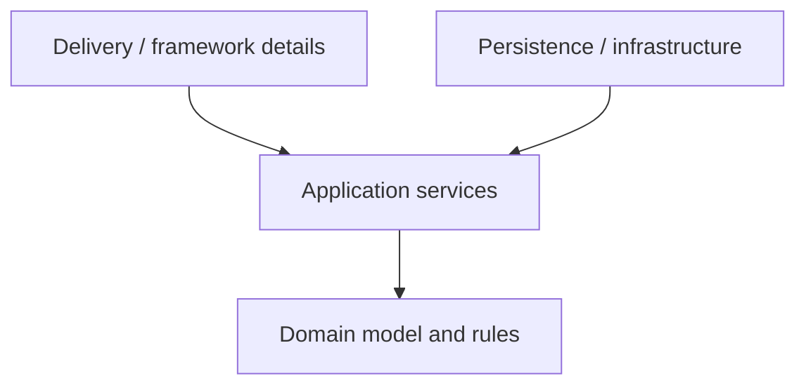

Do not infer extra projects, a deployment topology, or exact ring names from the label alone.

### Conceptual overlap without false identity

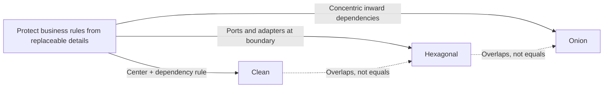

| Concern | Clean | Hexagonal | Onion |
|---|---|---|---|
| Primary teaching device | Core and outer details | Ports and adapters | Concentric layers |
| Strongest emphasis | Dependency inversion and use cases | Technology-neutral boundary interactions | Inward dependency toward domain |
| Runtime/deployment prescribed? | No | No | No |
| Can be inside one microservice? | Yes | Yes | Yes |
| What to inspect | Project references and core interfaces | Input/output ports and adapters | Inward references and domain isolation |

### N-tier versus Clean Architecture

N-tier primarily separates responsibilities into layers and possibly physical tiers. Clean primarily constrains *source-code dependency direction*: outer details depend inward. They can overlap—for example, an API and database can be physical tiers while the API application’s code follows Clean Architecture. They are not direct mutually exclusive alternatives.

**Primary official sources:**

- [.NET common web application architectures](https://learn.microsoft.com/en-us/dotnet/architecture/modern-web-apps-azure/common-web-application-architectures)
- [AWS Hexagonal architecture pattern](https://docs.aws.amazon.com/prescriptive-guidance/latest/cloud-design-patterns/hexagonal-architecture.html)

### Knowledge check — code organization

> A solution has projects named Domain, Application, Infrastructure, and API. Is it proven to use Clean Architecture?

<details>
<summary>Answer</summary>

No. Inspect actual compile-time references and runtime wiring. If Domain depends on Entity Framework or Application directly constructs infrastructure clients, folder/project names do not establish the dependency rule.

</details>
## 7. Service-Oriented Architecture (SOA)

### Classification and historical source note

**Distributed architecture paradigm/style.** OASIS’s 2006 standard remains the normative primary reference reviewed here because SOA is historical and no newer equivalent OASIS standard supersedes its core model. It defines SOA as organizing and using distributed capabilities that may cross ownership domains. A service exposes a capability through a prescribed interface under constraints and policies; it is not limited to web services.

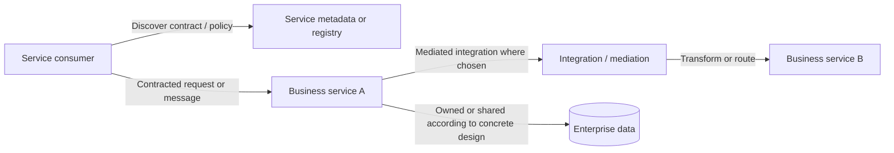

### How it works

- **Boundary:** a reusable business capability made visible by a service description/contract; ownership domains may differ.
- **Communication:** prescribed interfaces and message exchanges. Web services are one implementation, not the definition. Enterprise deployments have often used mediation or an enterprise service bus (ESB), but OASIS does not require a particular product or protocol.
- **Data:** SOA’s abstract reference model does not mandate shared or private databases. Concrete governance and integration choices determine ownership.
- **Deployment:** distributed services, potentially across organizations and heterogeneous platforms; independent deployment is possible but is not stated as the defining constraint it is in current microservice guidance.
- **Scaling/failure:** network and provider failure, contract incompatibility, mediation bottlenecks, and cross-owner policy differences must be handled. Central mediation may simplify governance yet become a capacity and availability dependency.
- **Security/governance:** service descriptions, policies, identity, authorization, audit, and ownership are central when capabilities cross organizational domains.

**Advantages:** interoperability across ownership and technology domains, reusable capabilities, explicit contracts/policies, and enterprise integration.

**Disadvantages:** governance and contract lifecycle overhead; centralized integration can accumulate business logic and coordination; coarse shared services or shared data can limit team autonomy.

**Use when:** enterprise capabilities must be exposed across systems/owners with explicit contracts and policy; legacy and heterogeneous platforms need governed integration.

**Do not use as a slogan when:** the actual problem is merely code modularity; a central bus would become the owner of domain behavior; service reuse creates a shared release bottleneck.

### SOA versus microservices

| Dimension | SOA reference-model emphasis | Current microservices emphasis |
|---|---|---|
| Purpose | Match and compose distributed capabilities, possibly across owners | Decompose one application/domain into autonomous business services |
| Granularity | Relative to need/capability; no counting rule | Small enough for one team, cohesive business capability/bounded context |
| Contract | Prescribed interface, description, policy | Well-designed API/event contract hiding implementation |
| Deployment | Concrete SOA decides | Independently deployable is defining guidance |
| Data ownership | Not mandated by abstract model | Private, service-owned state/schema |
| Governance | Often explicit enterprise/cross-owner governance | Decentralized team ownership with selected platform standards |
| Integration | Any suitable mechanism; mediation common in concrete SOA | Lightweight synchronous APIs plus asynchronous messaging |

Microservices are not merely “small SOA.” They share service contracts and distribution, but microservices add stronger constraints around bounded business capability, autonomous team ownership, independent deployment, and data ownership. A system can combine SOA at enterprise boundaries with finer microservices inside an application domain.

**Primary official sources:**

- [OASIS Reference Model for SOA 1.0](https://docs.oasis-open.org/soa-rm/v1.0/soa-rm.html)
- [OASIS SOA Reference Architecture Foundation](https://docs.oasis-open.org/soa-rm/soa-ra/v1.0/cs01/soa-ra-v1.0-cs01.html)
- [AWS Well-Architected: workload service architecture](https://docs.aws.amazon.com/wellarchitected/latest/framework/rel-03.html)

## 8. Microservices architecture

### Classification and intent

**Distributed architecture style.** An application is a collection of small, autonomous, loosely coupled services. Each service implements a cohesive business capability within a bounded context, hides its implementation behind contracts, owns its state, and can be developed, deployed, versioned, and scaled independently.

The word *small* is secondary to a meaningful boundary. Microsoft warns that overly granular services increase communication, latency, and complexity. If two services always change and deploy together, the boundary is probably wrong.

### Logical view

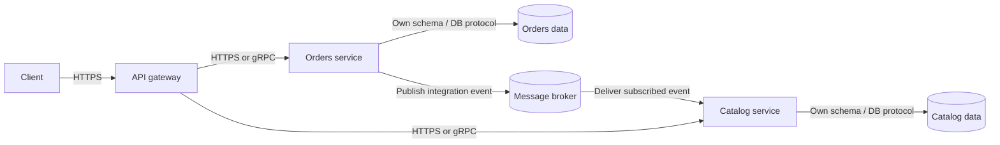

### Deployment view

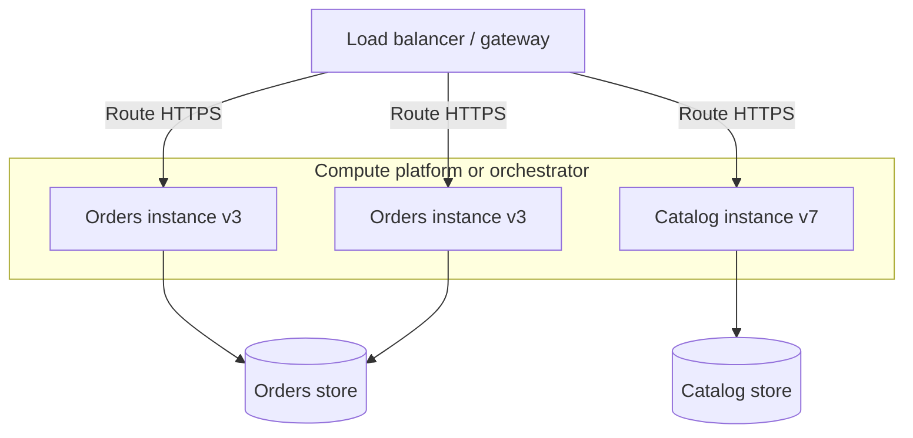

Containers and Kubernetes are common implementations, not requirements. A service may run as a process on VMs, a container, or managed/serverless compute.

### Boundaries, communication, and data

- **Service boundary:** start from domain analysis and bounded contexts. High cohesion and few strong cross-boundary relationships are signals. Boundary discovery is iterative.
- **Contracts:** APIs and event schemas are the shared surface. Consumers must not rely on internal tables or implementation models.
- **Synchronous communication:** HTTP/REST or RPC/gRPC for immediate answers. It creates temporal and latency coupling: the downstream service must respond within the caller’s deadline.
- **Asynchronous communication:** queues/topics/event streams for commands, work, or facts. It removes the immediate wait but introduces broker operations, delayed outcomes, retries, duplicates, ordering, and correlation.
- **Data ownership:** each service owns its state and schema. “Database per service” is an ownership rule, not necessarily one physical server per service. Several logically isolated databases can share managed infrastructure if access remains private.
- **Transactions:** local ACID transaction inside one service/store. Cross-service business operations use explicit workflows, compensation, idempotency, and usually eventual consistency—not accidental cross-database joins.

### Scaling, failure, consistency, and operations

**Scaling:** independently add instances only for the services under demand. This saves capacity when hotspots differ, but the database, broker, gateway, or downstream quotas can still bottleneck. Autoscaling consumers without bounding downstream demand can simply move overload.

**Failure model:** any network call may time out, return late, fail partially, or succeed after the caller gives up. A service can fail while others remain healthy, but fault isolation appears only if upstream callers use deadlines, circuit breakers, bulkheads/degraded responses, and avoid long synchronous chains. Asynchronous delivery can repeat; consumers need idempotency. Contract/version skew and deployment failure are additional modes.

**Consistency:** private state removes shared transactions. One user operation can be temporarily visible in different states across services. Select eventual consistency per workflow; do not claim that the entire system has one consistency model.

**Observability:** aggregate structured logs, metrics, and distributed traces. Propagate correlation/trace context across HTTP and messages. Monitor user flows, service health, queue depth/age, retry and dead-letter counts, dependency latency, and version/rollout state.

**Security:** every service/API/network hop adds a boundary. Authenticate workload identities, authorize each operation, encrypt in transit, keep secrets out of code, minimize public endpoints through gateways/private networking, and apply least privilege to each service’s data. A gateway is not a substitute for service authorization.

**Team topology:** small teams can own build, test, deployment, and operations end to end. Autonomy still needs platform standards for contracts, telemetry, security, and deployment; unconstrained language/framework diversity can be costly.

### Benefits versus complexity budget

| Potential benefit | Complexity that pays for it |
|---|---|
| Independent deployment | Contract compatibility, release automation, environment/version tracking |
| Independent scaling | Per-service capacity models, quotas, load tests, many runtime units |
| Fault isolation | Network failure handling, redundancy, timeouts, circuit breakers, degraded behavior |
| Team autonomy | Ownership, platform engineering, governance without centralized release control |
| Data autonomy | Distributed workflows, duplicated read data, consistency and reconciliation |
| Technology flexibility | Skills, patching, supply-chain, telemetry, and support matrix expansion |

Total complexity rises across development, runtime, network, data, deployment, observability, security, cost, and organization. Each individual service may be simpler while the system is much harder.

### When to use—and not use

**Use when:** the domain is complex and naturally separable; parts truly require independent deployment or scale; multiple capable teams need end-to-end ownership; availability demands useful fault boundaries; CI/CD, observability, security, and incident operations are mature enough.

**Do not use when:** one small team owns a simple domain; strong cross-domain transactions dominate; services would share schemas or release together; operational maturity and automation are absent; full-unit scaling is cheap and sufficient.

### Common mistakes and anti-pattern symptoms

- Splitting by technical layer (`UserControllerService`, `DatabaseService`) instead of business capability.
- Shared database tables, shared domain libraries, or direct cross-service queries.
- Chatty APIs and synchronous chains (`A → B → C → D`) on critical paths.
- Generic database-row events that leak internal models instead of stating business facts.
- One gateway/orchestrator containing domain logic for every service.
- “Nano-services” whose deployment boundaries add more cost than autonomy.
- Assuming Kubernetes, a repository per service, or a container per component creates microservices.

### Commonly combined with and migration

Common combinations: API Gateway, BFF, event-driven integration, Saga, Transactional Outbox, materialized views, CQRS selectively, containers/orchestration, Sidecar/Ambassador, centralized telemetry, and active-active or active-passive deployment.

For migration, assess dependencies, model bounded contexts, add an anti-corruption layer, route selected functionality through a Strangler facade, and extract edge capabilities incrementally. Do not begin with the most coupled transactional core. Keep the old system working throughout.

### Azure-oriented example

Azure API Management → independently deployed services on Azure Container Apps, App Service, AKS, or Functions → private Azure SQL/Cosmos DB data per owner; Service Bus/Event Grid/Event Hubs chosen by communication semantics; Azure Monitor/Application Insights with OpenTelemetry. The service choice follows the architecture, not vice versa.

**Primary official sources:**

- [Azure Microservices architecture style](https://learn.microsoft.com/en-us/azure/architecture/guide/architecture-styles/microservices)
- [.NET Microservices architecture](https://learn.microsoft.com/en-us/dotnet/architecture/microservices/architect-microservice-container-applications/microservices-architecture)
- [.NET identify microservice boundaries](https://learn.microsoft.com/en-us/dotnet/architecture/microservices/architect-microservice-container-applications/identify-microservice-domain-model-boundaries)
- [Azure microservices on AKS reference architecture](https://learn.microsoft.com/en-us/azure/architecture/reference-architectures/containers/aks-microservices/aks-microservices)

### Knowledge check — services

> Orders and Payments deploy separately but read and write the same tables. A release of either normally requires coordinated testing of both. Is this achieving microservice autonomy?

<details>
<summary>Answer</summary>

No. There are separate processes but a shared data and release boundary. The system has paid network and deployment costs without gaining independent evolution. Give each service private state and explicit contracts, merge the units if they are one cohesive capability, or document why a shared model is an accepted compromise.

</details>

## 9. Event-driven architecture (EDA)

### Classification and intent

**Architecture/integration style.** Producers emit events that describe occurrences; event channels/brokers transfer them; consumers react. Producers do not need direct knowledge of subscribers. EDA describes interaction, not service decomposition: a monolith, modular monolith, microservices system, or serverless workflow can be event-driven.

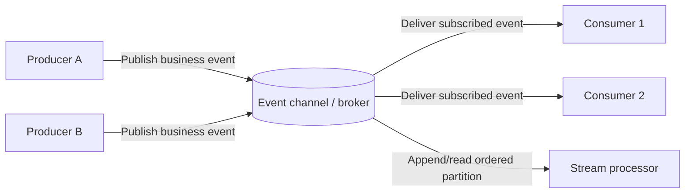

### Event, message, and command are not synonyms

| Concept | Intent | Expected handler | Typical naming | Coupling consequence |
|---|---|---|---|---|
| Message | Transport envelope containing data/metadata; can carry a command, event, or reply | Depends on semantics | `type`, payload, correlation ID | Neutral until semantics are known |
| Command | Request that a capability perform an action | Usually one logical handler; may be rejected | Imperative: `ReserveInventory` | Sender knows intended capability |
| Event | Immutable statement that something happened | Zero, one, or many interested consumers | Past tense: `InventoryReserved` | Publisher need not know consumers |

Azure Event Grid defines an event as information that describes something that happened. Microsoft’s .NET guidance distinguishes a command intended for one handler from an event that can have zero or many handlers. A broker still transports both as *messages*. Delivery guarantees belong to a concrete broker/configuration, not to the word “event.”

### Publish/subscribe versus event stream versus work queue

| Model | Storage/position | Fan-out | Typical need |
|---|---|---|---|
| Publish/subscribe | Infrastructure tracks subscriptions; retention varies | Copy per subscription | Notify current subscribers of discrete facts |
| Event stream | Durable ordered log within partitions; consumers track positions and can replay | Independent readers/groups | High-throughput history, stream processing, replay |
| Work queue | Durable buffer; competing consumers divide messages | One logical worker per work item | Background jobs and load leveling |

Do not draw the same semantics for all three. Ordering is commonly partition-scoped; duplicates are possible under at-least-once delivery; exactly-once claims must be verified for the selected end-to-end implementation.

### Data, transactions, scaling, and failure

- **Data:** consumers often build their own state/read models. The producer remains owner of the fact it publishes. Copies introduce staleness and reconciliation duties.
- **Transaction:** atomically changing a database and publishing is a dual-write problem; use an outbox/CDC implementation where required.
- **Scaling:** partition streams and scale consumer groups or competing consumers. Broker throughput, partition keys, hot partitions, consumer lag, and downstream limits define actual scale.
- **Failure:** publish can fail or be ambiguous; delivery can be delayed/repeated; consumers can crash between side effect and acknowledgement; poison messages can block progress; schema changes can break consumers; events can arrive out of order across partitions.
- **Recovery:** bounded retry with backoff, dead-letter/quarantine, idempotent handlers, checkpoints, replay procedures, schema versioning, and correlation IDs.
- **Consistency:** asynchronously updated views are eventually consistent for that path. Synchronous/local paths elsewhere can remain strongly consistent.
- **Observability:** trace event ID, causation/correlation ID, producer, schema version, publish time, delivery attempts, consumer lag, and dead letters.
- **Security:** authorize publish and subscribe separately, validate payloads, minimize sensitive data, encrypt transport/storage, and treat every consumer as another data recipient.

**Advantages:** loose producer/consumer knowledge, fan-out, asynchronous responsiveness, independent consumer scale, extensibility, buffering, and replay when a durable stream is used.

**Disadvantages:** eventual consistency, hard end-to-end debugging, duplicates/order/schema evolution, broker dependence, and workflows whose control flow becomes difficult to see.

**Use when:** multiple subsystems react to the same facts; high-volume stream processing or near-real-time reactions are central; producers and consumers need independent scale/availability; delayed outcomes are acceptable.

**Do not use when:** a simple request/response meets the need; the transaction requires immediate cross-component consistency; the team cannot operate asynchronous recovery; a direct call expresses intent more clearly.

**Common mistakes:** “fire and forget” without durable failure handling; events that require knowledge of earlier/future events to make sense; publishing internal database entities; no idempotency; treating EDA as globally scalable by default.

**Commonly combined with:** microservices, serverless functions, CQRS projections, Event Sourcing (but not required), Outbox, Saga choreography, Pipes and Filters, and stream analytics.

### Azure-oriented example

Use Event Grid for discrete publish/subscribe notifications, Event Hubs for high-throughput replayable streams, and Service Bus queues/topics for enterprise messages and durable workflows. Concrete retention, ordering, retry, and delivery semantics differ; choose from requirements.

**Primary official sources:**

- [Azure Event-driven architecture style](https://learn.microsoft.com/en-us/azure/architecture/guide/architecture-styles/event-driven)
- [Azure Service Bus queues, topics, and subscriptions](https://learn.microsoft.com/en-us/azure/service-bus-messaging/service-bus-queues-topics-subscriptions)
- [Azure asynchronous messaging choices](https://learn.microsoft.com/en-us/azure/architecture/guide/technology-choices/messaging)
- [Azure Event Grid concepts](https://learn.microsoft.com/en-us/azure/event-grid/concepts)

### Knowledge check — event semantics

> A producer publishes `ProcessOrder` to a topic and expects exactly one known component to execute it. Is the name “event” enough to make the design event-driven?

<details>
<summary>Answer</summary>

No. Its intent is a command even if transported by a topic. Document the intended recipient, duplicate policy, acknowledgement, timeout, and outcome. An event would state a completed fact such as `OrderPlaced`, allowing independently interested consumers.

</details>

## 10. Serverless architecture

### Classification and mental model

**Managed execution/deployment approach**, often event-driven. “Serverless” means the provider manages server provisioning, patching, capacity, and much of availability—not that servers do not exist. Functions are a common unit, but managed workflows, APIs, messaging, and data services also compose serverless systems.

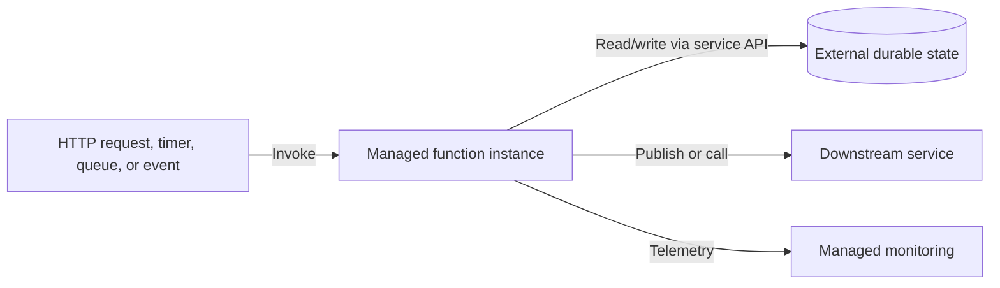

- **State:** execution instances should not be assumed durable; externalize durable state and use workflow/orchestration services for long-running stateful coordination.
- **Scaling:** provider-controlled event-driven scale varies by hosting plan and trigger. Scale-to-zero can cause cold-start latency; limits and concurrency can overwhelm downstream systems.
- **Failure:** event redelivery, timeout, partial side effects, poison input, concurrency races, provider quotas, and cold starts. Design idempotency and retry from the concrete trigger’s documented behavior.
- **Deployment:** package code/configuration per function or function application; infrastructure as code remains important. Serverless does not remove release, IAM, observability, or cost design.
- **Security:** fine-grained execution identities and least privilege; secure triggers and secrets; understand the provider/customer responsibility split.
- **Observability:** correlate an invocation through triggers, functions, managed integrations, and downstream services; platform logs alone do not express business outcomes.

**Advantages:** reduced infrastructure management, rapid event integration, automatic/flexible scaling, and consumption-oriented cost for suitable intermittent workloads.

**Disadvantages:** platform limits and portability constraints, distributed integration complexity, less runtime control, cold-start risk on latency-sensitive paths, and surprising cost for sustained/high-chatter workloads.

**Use when:** event-triggered or intermittent workloads fit provider limits; rapid scaling and low infrastructure ownership matter; small independently changed handlers/workflows are cohesive.

**Do not use when:** long-running/tightly coupled compute, specialized host control, stable high utilization, strict latency incompatible with the plan, or provider constraints dominate.

### Serverless versus containerized service versus microservice

| Dimension | Serverless function/workflow | Containerized service | Microservice |
|---|---|---|---|
| Main question | Who manages execution capacity/runtime? | How is a process packaged and isolated? | How is the domain decomposed and independently owned? |
| Unit | Function/app/workflow | Container image + process | Business capability/service |
| State | Usually external | May attach external/persistent state | Service owns state; hosting varies |
| Scaling | Provider/plan and trigger governed | Platform/operator governed | Independent per service if hosting supports it |
| Can combine? | Can implement a microservice | Can host monolith or microservice | Can run in functions or containers |

### Azure-oriented example

Event Grid or Service Bus trigger → Azure Functions → Azure SQL/Cosmos DB/Storage → Durable Functions for orchestration → Application Insights. Azure Functions’ current hosting documentation shows that scaling and cold-start behavior depend on plan; do not generalize one plan’s guarantee to all serverless platforms.

**Primary official sources:**

- [Azure Functions overview](https://learn.microsoft.com/en-us/azure/azure-functions/functions-overview)
- [Azure Functions event-driven scaling and cold start](https://learn.microsoft.com/en-us/azure/azure-functions/event-driven-scaling)
- [AWS serverless developer guide](https://docs.aws.amazon.com/serverless/latest/devguide/welcome.html)
- [Google Cloud: What is Serverless Architecture?](https://cloud.google.com/discover/what-is-serverless-architecture)

## 11. Web-Queue-Worker and queue-based load leveling

### Classification and flow

**Web-Queue-Worker is an architecture style; Queue-Based Load Leveling is a supporting integration/reliability pattern.** A web/API front end handles interactive work and enqueues long or resource-intensive tasks. Workers process them asynchronously and can scale separately.

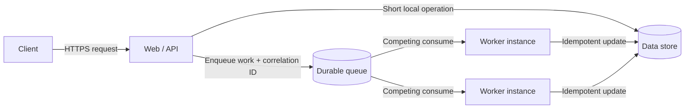

- **Data/transactions:** web and worker may use the same store. If a request both commits data and enqueues work, the dual-write gap needs Outbox/CDC or another documented atomic handoff.
- **Scaling:** web replicas follow request load; workers follow queue depth/age and downstream safe capacity. A queue absorbs bursts but cannot fix a sustained producer rate above safe consumer throughput.
- **Failure:** work may be delayed or redelivered; workers can crash after a side effect; poison jobs require dead-letter/quarantine; users need an operation-status model for long-running work.
- **Consistency:** enqueueing makes completion asynchronous. Return `accepted`/operation identity rather than claiming completed work.
- **Observability:** request-to-job correlation, age of oldest message, queue depth, attempts, processing time, dead letters, and downstream saturation.
- **Security:** authenticate producers/consumers separately; validate untrusted job payloads; grant workers only required resource access.

**Advantages:** simple mental model, burst smoothing, independent web/worker scale, and fewer distributed domain boundaries than microservices.

**Disadvantages:** asynchronous UX and consistency, duplicate/idempotency work, queue operations, and the risk that both web and worker become large coupled units.

**Use when:** the domain is relatively simple but includes background, batch, or long-running work; variable arrival rate must not overload a dependency.

**Do not use when:** every operation needs an immediate result; the queue merely hides a permanently under-capacity dependency; many independent business capabilities need separate ownership.

**Commonly combined with:** monolith/modular monolith, serverless worker, Transactional Outbox, Competing Consumers, retry/dead-lettering, and cache-aside.

### Azure-oriented example

App Service or Container Apps for the web front end → Service Bus or Storage Queue → Functions/Container Apps job/AKS worker → Azure SQL/Cosmos DB; scale workers using safe queue metrics.

**Primary official sources:**

- [Web-Queue-Worker architecture style](https://learn.microsoft.com/en-us/azure/architecture/guide/architecture-styles/web-queue-worker)
- [Queue-Based Load Leveling pattern](https://learn.microsoft.com/en-us/azure/architecture/patterns/queue-based-load-leveling)
- [Competing Consumers pattern](https://learn.microsoft.com/en-us/azure/architecture/patterns/competing-consumers)

### Knowledge check — distributed styles

> A photo-processing site has one API, one database, and CPU-heavy thumbnail generation. Must it split into business microservices to scale?

<details>
<summary>Answer</summary>

No. Web-Queue-Worker can keep one application/domain boundary while independently scaling stateless workers. Add service decomposition only for a separate business lifecycle, ownership, state, isolation, or release need—not merely because asynchronous compute exists.

</details>

# Part III — Distributed Data, Processing, and Edge Patterns

## 12. Data ownership models

State boundaries often reveal the real architecture more accurately than service names.

| Model | Owner and access | Transaction boundary | Strength | Main risk |
|---|---|---|---|---|
| Shared database/schema | Several components read/write common schema | Cross-component local transactions possible | Simple joins and immediate consistency | Schema/release coupling; unclear ownership |
| Database per service/module owner | One owner exposes data through contract; physical server may be shared | Local to owner | Autonomy and independent schema evolution | Distributed workflows and duplicated views |
| Read model/materialized view | Consumer/projection owns query-optimized copy | Updated separately from source | Fast, purpose-specific reads | Staleness, rebuild and reconciliation |
| Event store | Event stream is authoritative history per entity | Atomic append per stream/store capability | Audit/history/reconstruction | Event/schema evolution and projection complexity |
| Cache | No independent source of truth | Outside or alongside source transaction | Lower read latency/load | Staleness, invalidation, security leakage |
| Data lake/analytical store | Analytics platform owns collected historical data | Ingestion/batch/stream checkpoints | Cross-source analysis at volume | Governance, lineage, privacy, freshness |

Do not let multiple services update the same tables and then claim “database per service.” Conversely, database per service does not require a separate physical database server or vendor for every service. It requires exclusive logical ownership and access through contracts.

**Primary official sources:**

- [.NET data sovereignty per microservice](https://learn.microsoft.com/en-us/dotnet/architecture/microservices/architect-microservice-container-applications/data-sovereignty-per-microservice)
- [Azure Microservices architecture style](https://learn.microsoft.com/en-us/azure/architecture/guide/architecture-styles/microservices)
- [Materialized View pattern](https://learn.microsoft.com/en-us/azure/architecture/patterns/materialized-view)
- [Cache-Aside pattern](https://learn.microsoft.com/en-us/azure/architecture/patterns/cache-aside)

## 13. CQRS — Command Query Responsibility Segregation

### Classification and mental model

**Data/application architectural pattern.** CQRS separates operations that mutate state (commands/write model) from operations that return data (queries/read model). At its simplest, it can use separate interfaces over one database. More advanced forms use separate stores and asynchronous projections.

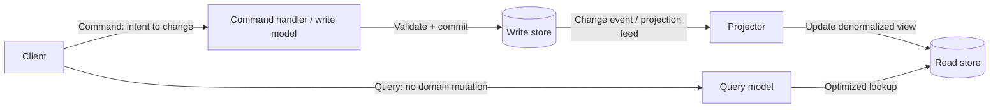

- **Purpose:** model complex write rules separately from query shapes; independently optimize or scale read-heavy and write workloads.
- **Communication:** commands target a handler; queries request data. Projection may be synchronous with one store or asynchronous with separate stores.
- **Data/transactions:** one-store CQRS can retain one local transaction. Separate stores cannot be atomically updated by assumption; the read side can lag.
- **Scaling:** read replicas/models and write handlers can scale separately when physically separated.
- **Failure:** projector delay/failure makes stale reads; duplicate change events require idempotent projection; rebuilding needs checkpoints/versioning.
- **Security:** different authorization for read and write surfaces is easier to express, but duplicated sensitive fields expand data exposure.
- **Observability:** measure command acceptance/outcome separately from projection lag and query freshness.

**Advantages:** focused models, query-optimized schemas/materialized views, independent tuning/scaling, clearer write authorization.

**Disadvantages:** more models and mapping, eventual consistency with separate stores, messaging/projector operation, harder end-to-end tests.

**Use when:** write rules and read shapes differ substantially; read/write load or scaling differs; complex domains benefit from explicit commands; query materialization yields measured value.

**Do not use when:** CRUD and one model are sufficient; users require immediately current separate read views; the team cannot operate projection lag/rebuilds.

**Commonly combined with:** materialized views, Event Sourcing, Outbox, events, and a modular monolith or microservice. **CQRS does not require Event Sourcing.**

**Primary official sources:**

- [CQRS pattern](https://learn.microsoft.com/en-us/azure/architecture/patterns/cqrs)
- [Materialized View pattern](https://learn.microsoft.com/en-us/azure/architecture/patterns/materialized-view)

## 14. Event Sourcing

### Classification and mental model

**Data persistence pattern.** Instead of storing only current state, persist an ordered append-only event stream that records business changes. The event store is the system of record; current state is rehydrated by replay or read from projections/snapshots.

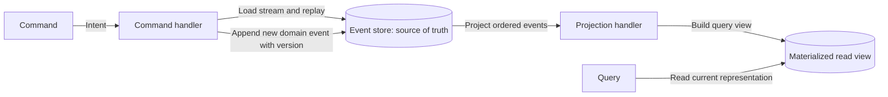

- **Data:** an entity/aggregate has an ordered stream. Snapshots optimize rehydration but do not replace the source stream.
- **Transactions/concurrency:** append with expected stream version/optimistic concurrency; multi-entity invariants remain difficult.
- **Communication:** persisted domain events may feed projections and produce integration events, but an event store is not automatically a message broker.
- **Scaling:** append operations and entity-key partitioning can scale; hot aggregates, projection fan-out, and replay cost remain constraints.
- **Failure:** invalid historical event, incompatible schema, out-of-order/duplicate delivery to projections, partial projection, or lengthy replay. Persisted mistakes are corrected with compensating events/upcasting strategies rather than casual mutation.
- **Consistency:** rehydrated entity state from its committed stream can be current; asynchronous projections are eventually consistent.
- **Observability/testing:** event history aids audit and given/when/then domain tests; operations must monitor stream append conflicts, projection position, poison events, and rebuild duration.
- **Security/privacy:** immutable history conflicts with deletion requirements. Minimize personal data, externalize it by reference, or design approved cryptographic erasure/key management from the beginning.

**Advantages:** complete intent/history, auditability, point-in-time reconstruction, new projections from old events, and append-oriented writes.

**Disadvantages:** fundamental persistence-model change, permanent event versioning, replay/projection complexity, eventual read views, unfamiliar querying, and costly migration in either direction.

**Use when:** historical reconstruction/audit is a core domain requirement; state transitions themselves carry durable business value; new projections from history justify the cost.

**Do not use when:** ordinary CRUD is adequate; state is mostly static; a short-lived MVP lacks event-evolution investment; immediate query consistency is mandatory; the team lacks event-system experience.

**Commonly combined with:** CQRS and materialized views, but neither is required by the definition. Event-driven integration does not imply Event Sourcing.

**Primary official sources:**

- [Event Sourcing pattern](https://learn.microsoft.com/en-us/azure/architecture/patterns/event-sourcing)
- [CQRS pattern](https://learn.microsoft.com/en-us/azure/architecture/patterns/cqrs)

## 15. CQRS versus Event Sourcing

| Question | CQRS alone | Event Sourcing alone | CQRS + Event Sourcing |
|---|---|---|---|
| What is separated? | Command and query models/interfaces | Current state from its historical changes | Command/event write path from projected read paths |
| Source of truth | Current-state write store | Append-only event stream | Event stream |
| Separate read store required? | No | No, but commonly useful | Usually used |
| Eventual reads required? | Only with asynchronous separate view | Only for asynchronous projections | Common for projections |
| Primary reason | Different read/write models, load, security | Audit, history, reconstruction, intent | Both sets of requirements |
| Main cost | Dual models/projection | Event lifecycle/replay/schema | Combined operational and conceptual cost |

### The three shapes

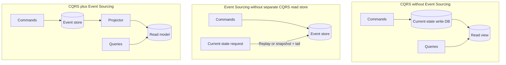

## 16. Distributed transactions, Saga, and compensation

### Why the problem changes

A local ACID transaction can atomically update resources enlisted by one database transaction manager. With database-per-service, a business operation crosses autonomous stores and failure boundaries. A remote success cannot be rolled back by changing local memory. The design must make intermediate states, retries, timeouts, and business compensation explicit.

### Saga choreography

Participants commit local transactions and publish events that trigger the next participant. There is no central process defining the whole flow.

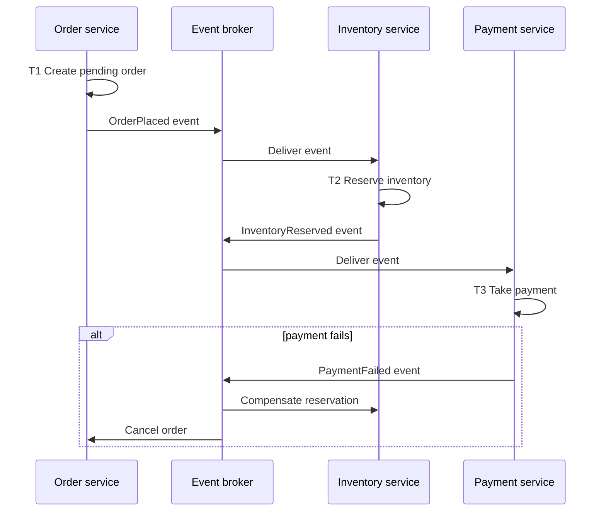

**Strength:** loose participants and no central workflow dependency. **Risk:** as participants grow, flow, cyclic dependencies, timeouts, and end-to-end observability become hard to understand.

### Saga orchestration

A durable orchestrator knows the steps and tells participants what to execute or compensate.

```mermaid
sequenceDiagram
    participant C as Client/API
    participant S as Saga orchestrator
    participant O as Order service
    participant I as Inventory service
    participant P as Payment service
    C->>S: Start order workflow
    S->>O: Create pending order
    O-->>S: Completed
    S->>I: Reserve inventory
    I-->>S: Completed
    S->>P: Take payment
    P-->>S: Failed
    S->>I: Release inventory
    S->>O: Cancel order
    S-->>C: Failed / compensated outcome
```

**Strength:** explicit flow, centralized timeout/retry/monitoring. **Risk:** orchestrator complexity and availability; participants can become coupled to workflow commands. Use a durable, highly available implementation.

### Compensation is not rollback

A compensating action semantically undoes or mitigates completed work—refund payment, release inventory, mark order canceled. It can fail, require idempotency, and may not perfectly restore the outside world. A Saga lacks normal ACID isolation: concurrent operations can observe intermediate states. Semantic locks/reservations and business rules must protect invariants.

**Use Saga when:** a required business process spans autonomous services/stores and eventual completion/compensation is acceptable.

**Do not use when:** one local transaction or a better service boundary can keep the invariant together; irreversible side effects have no acceptable compensation; strong immediate consistency is mandatory.

**Operations:** persist workflow state; give every saga an ID; make participants idempotent; define timeouts, retries, manual intervention, compensation ordering, terminal states, and audit visibility.

**Primary official sources:**

- [AWS Saga choreography pattern](https://docs.aws.amazon.com/prescriptive-guidance/latest/cloud-design-patterns/saga-choreography.html)
- [AWS Saga orchestration pattern](https://docs.aws.amazon.com/prescriptive-guidance/latest/cloud-design-patterns/saga-orchestration.html)
- [Compensating Transaction pattern](https://learn.microsoft.com/en-us/azure/architecture/patterns/compensating-transaction)

## 17. Transactional Outbox

### The dual-write gap

```text
Database commit succeeds + publish fails  → downstream never hears about committed state
Publish succeeds + database rolls back   → downstream acts on state that does not exist
```

The Outbox stores the business change and outgoing message record in the **same local database transaction**. A relay later publishes committed outbox rows. This closes the atomicity gap between application state and the intention to publish; it does not make broker delivery and every consumer side effect one global transaction.

```mermaid
flowchart LR
    Service -->|One local transaction| DB[(Business tables + outbox table)]
    Relay[Outbox relay / CDC] -->|Read committed outbox rows| DB
    Relay -->|Publish; retry on ambiguity| Broker[(Broker)]
    Broker -->|At-least-once may duplicate| Consumer[Idempotent consumer]
    Consumer -->|Deduplicate + local commit| CDB[(Consumer data)]
```

- **Ordering:** retain aggregate/stream sequence where business order matters.
- **Duplicates:** relay retries can republish; consumers must be idempotent or track processed message IDs.
- **Failure:** monitor unpublished age/count, relay health, broker acknowledgement, duplicates, poison messages, and dead letters.
- **Trade-off:** extra table/CDC and cleanup/retention versus reliable handoff without distributed 2PC.
- **Use when:** one local state change must reliably cause an event/message. **Do not use** as a substitute for Saga when several service-owned stores must complete a workflow.

**Primary official sources:**

- [AWS Transactional Outbox pattern](https://docs.aws.amazon.com/prescriptive-guidance/latest/cloud-design-patterns/transactional-outbox.html)
- [CQRS pattern: outbox and idempotent projection guidance](https://learn.microsoft.com/en-us/azure/architecture/patterns/cqrs)

### Knowledge check — distributed data

> A system uses CQRS because it stores events. Is that reasoning sufficient?

<details>
<summary>Answer</summary>

No. Event Sourcing answers how authoritative state is stored; CQRS answers whether command and query responsibilities/models are separated. Either can exist without the other. Combine them only when both requirements justify their combined complexity.

</details>

## 18. Supporting data and reliability patterns

| Pattern | Problem solved | Core mechanism | Main caution | Common combinations |
|---|---|---|---|---|
| Materialized View | Source shape/query cost is unsuitable | Precompute query-specific view | Freshness, rebuild, duplicated sensitive data | CQRS, Event Sourcing, microservices |
| Sharding | One store/partition cannot meet scale | Partition records by shard key across stores | Hot shards, cross-shard query/transaction, rebalance | High-scale OLTP, event streams |
| Cache-Aside | Repeated reads overload/lag source | App checks cache, loads source on miss, writes cache | Invalidation/stale data/cache stampede | Any style with read hotspots |
| Retry | Transient operation can succeed later | Bounded, delayed repeated attempt | Amplification; non-idempotent side effects | Remote APIs, brokers, Outbox relay |
| Circuit Breaker | Repeated calls to failing dependency waste resources | Open after failures; probe after delay | State/tuning; fallback correctness | Sync service calls, Ambassador |
| Competing Consumers | One consumer cannot process queue volume | Several instances divide work | Ordering and duplicate-safe work | Queue-worker, serverless |
| Compensating Transaction | Completed steps in eventual workflow must be undone | Domain-specific reverse/mitigating operations | Compensation can fail and is not exact rollback | Saga, long-running workflow |

**Primary official sources:**

- [Azure Cloud Design Patterns catalog](https://learn.microsoft.com/en-us/azure/architecture/patterns/)
- [Sharding pattern](https://learn.microsoft.com/en-us/azure/architecture/patterns/sharding)
- [Retry pattern](https://learn.microsoft.com/en-us/azure/architecture/patterns/retry)
- [Circuit Breaker pattern](https://learn.microsoft.com/en-us/azure/architecture/patterns/circuit-breaker)

## 19. Pipes and Filters

### Classification and model

**Processing architectural pattern.** Split a transformation into independent, usually stateless filters connected by pipes. Each filter knows input/output schemas, not neighboring implementations.

```mermaid
flowchart LR
    Input -->|Input schema| F1[Validate filter]
    F1 -->|Validated message| F2[Enrich filter]
    F2 -->|Enriched message| F3[Transform filter]
    F3 -->|Output schema| Output
```

- **Communication/deployment:** in-memory streams, files, or durable messages. Distributed filters can deploy/scale independently; in-process filters retain simpler failure behavior.
- **Scaling:** parallelize bottleneck filters if ordering/state permit. End-to-end latency includes every stage and the slowest stage constrains throughput.
- **Failure:** define whether a stage retries, checkpoints, routes invalid input, or replays. Duplicates and partial outputs arise when distributed stages restart.
- **Advantages:** composition, reuse, replaceable stages, separate scaling/hardware.
- **Disadvantages:** schema compatibility, orchestration/diagnostics, intermediate storage, and distributed failure semantics.
- **Use when:** sequential transform stages are independently reusable/scalable. **Do not use** when stages are inseparable, share mutable transaction state, or pipeline overhead exceeds value.
- **Event pipeline distinction:** EDA routes occurrences to consumers; Pipes and Filters transforms input through an ordered chain. They can combine, but are not synonyms.

### Azure-oriented example

Blob/queue input → Azure Functions stages → queues between durable stages → final storage. Use Service Bus/Event Hubs only when their concrete semantics fit ordering, throughput, and replay needs.

**Primary official sources:**

- [Pipes and Filters pattern](https://learn.microsoft.com/en-us/azure/architecture/patterns/pipes-and-filters)

## 20. Microkernel / plug-in architecture

### Classification and model

**Extensibility/application architectural pattern.** A stable core defines extension points/contracts; deployable plug-ins contribute optional capability. Eclipse’s official platform is a primary, concrete example of this structure.

```mermaid
flowchart TB
    Core[Core system / runtime]
    EP[Versioned extension points]
    P1[Plug-in A]
    P2[Plug-in B]
    P3[Plug-in C]
    Core -->|Defines and invokes| EP
    P1 -->|Implements contract| EP
    P2 -->|Implements contract| EP
    P3 -->|Implements contract| EP
```

- **Communication:** callbacks/interfaces, manifests/registration, or isolated IPC depending on implementation.
- **Data:** core can own shared platform state; plug-in state/permissions need explicit contracts and migration rules.
- **Deployment:** plug-ins may be assembled at build, deployment, startup, or dynamically. Isolation ranges from same process to sandboxed process.
- **Failure/security:** an in-process plug-in can crash or compromise the host. Validate provenance, permissions, version compatibility, resource use, timeouts, and unload/update behavior.
- **Advantages:** optional features, third-party ecosystem, stable core, independent extension development.
- **Disadvantages:** contract/version lifecycle, dependency conflicts, discovery/loading, testing combinations, and weak isolation in-process.
- **Use when:** extensibility is a product requirement and a stable core can expose durable contracts. **Do not use** merely to avoid ordinary modular design.
- **Commonly combined with:** modular monolith, Hexagonal ports, sandbox processes, event callbacks, and marketplace/governance mechanisms.

**Primary official sources:**

- [Eclipse Platform architecture](https://help.eclipse.org/latest/topic/org.eclipse.platform.doc.isv/guide/arch.htm)
- [Eclipse Platform extension points](https://help.eclipse.org/latest/topic/org.eclipse.platform.doc.isv/reference/extension-points/index.html)

## 21. Data and analytics architectures

These are **data-processing architectures**, not replacements for application decomposition. An e-commerce application can be a modular monolith or microservices while its analytics subsystem uses batch and streaming paths.

### Big data: batch plus streaming

```mermaid
flowchart LR
    Sources[Operational, files, devices] -->|Land immutable/raw data| Lake[(Data lake)]
    Lake -->|Scheduled dataset| Batch[Distributed batch processing]
    Sources -->|Continuous events| Ingest[(Stream ingestion log)]
    Ingest -->|Ordered partitions| Stream[Stream processing]
    Batch --> Analytics[(Analytical store / reports)]
    Stream --> Analytics
```

**Big data style:** ingestion, storage, processing, and analysis when volume/complexity exceeds traditional database processing. Batch analyzes data at rest; streaming processes data in motion for lower-latency results. Parallelism and partitioning enable scale, while orchestration, specialized skills, governance, lineage, privacy, and cost add complexity.

### Lambda architecture

```mermaid
flowchart LR
    Source --> BatchLayer[Cold path: raw store + batch recomputation]
    Source --> SpeedLayer[Hot path: stream processing]
    BatchLayer --> BatchView[(Accurate historical view)]
    SpeedLayer --> RealtimeView[(Low-latency view)]
    BatchView --> Serve[Serving / analytics]
    RealtimeView --> Serve
```

Lambda uses batch and speed paths to combine comprehensive historical results with low-latency views. Its central cost is duplicated processing logic/frameworks and reconciliation between paths.

### Kappa architecture

```mermaid
flowchart LR
    Source --> Log[(Durable unified event log)]
    Log --> Processor[One stream-processing path]
    Processor --> View[(Serving views)]
    Log -->|Replay for recomputation| Processor
    Log --> Archive[(Long-term storage)]
```

Kappa uses one stream-processing path and a replayable log; recomputation replays historical events. It reduces dual-path logic but requires durable retention, replay capacity, event order/compatibility, and stream-centric skills.

### Big compute / HPC

```mermaid
flowchart LR
    Client -->|Submit finite job| Scheduler[Scheduler / coordinator]
    Scheduler -->|Independent tasks| Pool[Parallel worker pool]
    Scheduler -->|Tightly coupled tasks| HPC[Low-latency HPC cluster]
    Pool --> Results[(Results storage)]
    HPC --> Results
```

Big compute concerns finite computational jobs across hundreds/thousands of cores. Independent tasks suit worker pools; tightly coupled tasks need high-speed interconnects. It is not the same as big data, although a workload may need both.

### Decision summary

| Need | Candidate | Principal cost |
|---|---|---|
| Scheduled historical transformations | Batch pipeline | Freshness delay and orchestration |
| Continuous low-latency transformations | Streaming | Ordering, late events, checkpoints, 24×7 operations |
| Historical correctness plus low-latency approximation | Lambda | Duplicate paths and reconciliation |
| Unified replayable stream processing | Kappa | Retention/replay and stream-first constraints |
| Massive finite numeric computation | Big compute/HPC | Scheduler, fleet, specialized networking/cost |

### Azure-oriented example

ADLS/OneLake for lake storage, Fabric or Data Factory for orchestration, Event Hubs for ingestion, Fabric Real-Time Intelligence/Stream Analytics for stream processing, and Azure Batch or HPC VMs for big compute. This is only one implementation mapping.

**Primary official sources:**

- [Big Data architecture style](https://learn.microsoft.com/en-us/azure/architecture/guide/architecture-styles/big-data)
- [Azure big data architectures: Lambda and Kappa](https://learn.microsoft.com/en-us/azure/architecture/databases/guide/big-data-architectures)
- [Big Compute architecture style](https://learn.microsoft.com/en-us/azure/architecture/guide/architecture-styles/big-compute)
- [AWS modern data streaming architectures whitepaper](https://docs.aws.amazon.com/whitepapers/latest/build-modern-data-streaming-analytics-architectures/welcome.html)

### Knowledge check — processing

> A system receives domain events but only uses them to notify two transactional services. Does it therefore use Kappa Architecture?

<details>
<summary>Answer</summary>

No. That is event-driven integration. Kappa is a data-processing architecture centered on a durable unified log, stream computation, serving views, and replay for recomputation.

</details>

## 22. Edge and integration helpers

### API Gateway

```mermaid
flowchart LR
    Clients -->|HTTPS| Gateway[API gateway]
    Gateway -->|Route / aggregate / adapt| A[Service A]
    Gateway -->|Route / aggregate / adapt| B[Service B]
```

A gateway gives clients one endpoint and can route, aggregate, terminate TLS, authenticate, rate limit, cache, or adapt protocols when the implementation supports them. It hides topology and centralizes edge policy. It can also become a bottleneck, single point of failure, extra hop, or “smart” domain monolith. Keep domain knowledge in services; scale and make the gateway highly available.

### Backend for Frontend (BFF)

```mermaid
flowchart LR
    Mobile -->|HTTPS| MBFF[Mobile BFF]
    Web -->|HTTPS| WBFF[Web BFF]
    MBFF -->|Tailored calls| Services[Backend services]
    WBFF -->|Tailored calls| Services
```

A BFF is client-specific backend behavior owned for one interface; an API gateway is shared edge infrastructure/policy. They can combine: gateway first, then BFFs. BFFs reduce client chattiness and conflicting client needs but add services, latency, duplication, IAM, deployment, and maintenance. Do not add one when one client exists or clients need the same API.

### Sidecar and Ambassador

```mermaid
flowchart LR
    subgraph Host[Shared host / pod lifecycle]
        App[Application]
        Sidecar[Sidecar]
        App -->|Local IPC| Sidecar
    end
    Sidecar -->|Network request with TLS/retry/telemetry| Remote[Remote service]
```

**Sidecar** is the deployment relationship: a helper process/container shares the parent’s lifecycle and proximity while remaining isolated. **Ambassador** is a role often implemented as a sidecar: an out-of-process client proxy that performs connectivity, routing, security, resilience, and telemetry on the application’s behalf. **Adapter** translates an incompatible interface; it need not be a sidecar. A service mesh commonly uses proxies with sidecar/ambassador-like roles, but the patterns are not synonymous with a particular mesh.

Costs include another process, resources, version compatibility, proxy latency, lifecycle ordering, and the risk of unsafe generic retries on non-idempotent operations.

### Micro-frontends and SPA (reference-level coverage)

**SPA** describes a client rendering/navigation model and API interaction, not the backend’s service architecture. **Micro-frontends** decompose a frontend into independently developed and deployed artifacts aligned to bounded UI capabilities; composition can occur client-side, edge-side, or server-side. Clear contracts, routing, shared dependencies, state, performance budgets, consistent experience, and independent pipelines are the hard parts. A BFF can align an API surface to a frontend boundary.

```mermaid
flowchart TB
    Browser[Browser shell / composer]
    Browser -->|Load versioned artifact| CatalogUI[Catalog micro-frontend]
    Browser -->|Load versioned artifact| CheckoutUI[Checkout micro-frontend]
    CatalogUI -->|HTTPS via gateway/BFF| CatalogAPI[Catalog backend]
    CheckoutUI -->|HTTPS via gateway/BFF| CheckoutAPI[Checkout backend]
```

Use micro-frontends when several teams truly need independent UI delivery and business boundaries; avoid them for one small frontend team because runtime composition, duplicate dependencies, cross-UI communication, testing, and UX governance are material costs.

**Primary official sources:**

- [Gateway Routing pattern](https://learn.microsoft.com/en-us/azure/architecture/patterns/gateway-routing)
- [Gateway Aggregation pattern](https://learn.microsoft.com/en-us/azure/architecture/patterns/gateway-aggregation)
- [Backends for Frontends pattern](https://learn.microsoft.com/en-us/azure/architecture/patterns/backends-for-frontends)
- [Sidecar pattern](https://learn.microsoft.com/en-us/azure/architecture/patterns/sidecar)
- [Ambassador pattern](https://learn.microsoft.com/en-us/azure/architecture/patterns/ambassador)
- [AWS micro-frontends guidance](https://docs.aws.amazon.com/prescriptive-guidance/latest/micro-frontends-aws/introduction.html)

---

# Part IV — How Components Communicate

Communication is an independent design axis. A monolith can publish events; microservices can use request/response; most useful distributed systems deliberately mix synchronous and asynchronous paths.

## 23. Synchronous communication

```mermaid
sequenceDiagram
    participant A as Caller
    participant B as Callee
    A->>B: Request (deadline + identity + payload)
    Note over A: Caller waits
    B-->>A: Response or failure/timeout
```

The caller expects a response in the interaction. This gives a simple control flow and immediate success/error semantics but couples the caller to the callee’s availability and latency for the duration. Every dependency added to a synchronous chain consumes latency budget and contributes failure probability.

- **HTTP** is a stateless application-level request/response protocol with resource, method, status, representation, caching, intermediary, and security semantics. REST is an architectural style commonly implemented over HTTP; “JSON over HTTP” is not automatically proof of REST constraints.
- **gRPC** defines typed services and methods, commonly using Protocol Buffers, with unary, client-streaming, server-streaming, and bidirectional-streaming RPCs. It is attractive for strongly contracted, efficient internal communication and streaming, while clients need generated contracts/tooling and compatible intermediaries.
- **GraphQL** defines a typed query language and execution response. It gives clients selection flexibility; that can reduce over/under-fetching but moves query complexity, authorization, cost controls, caching, and resolver fan-out to the server. It is not itself a BFF, service decomposition, or deployment architecture.
- **Direct in-process call** has no network failure or serialization, but creates source/runtime coupling and a shared process blast radius.

**Synchronous failure design:** set deadlines; distinguish transient from permanent errors; retry only bounded/idempotent operations with jitter/backoff; use circuit breaking/degraded behavior where loss of a dependency must not cascade; propagate cancellation and trace context.

## 24. Asynchronous communication

```mermaid
sequenceDiagram
    participant P as Producer
    participant B as Broker / durable channel
    participant C as Consumer
    P->>B: Message (ID + type + version + correlation)
    B-->>P: Broker acceptance
    Note over P: Producer continues; business outcome is pending
    B->>C: Deliver
    C->>C: Idempotent processing + local commit
    C-->>B: Acknowledge
```

Asynchronous communication decouples producer and consumer in time and can buffer load. It does **not** eliminate coupling: payload schema, meaning, ordering key, delivery policy, retention, and outcome are contracts.

### Queue

Point-to-point work distribution. Messages persist until a consumer can process them according to concrete broker settings. Competing consumers increase throughput. Use for commands/jobs where one logical processor should handle each item. Watch oldest-message age, not only depth.

### Topic / publish-subscribe

One publication is made available to several independent subscriptions. Use when multiple current consumers react to the same fact. Each subscription needs its own retry, dead-letter, filter, scaling, and compatibility plan.

### Event stream

Events append to a durable partitioned log. Consumers track offsets/positions and may replay. Use for high-throughput ordered history and continuous processing. Ordering is generally within a partition, so the partition key is a correctness and scale decision.

### Delivery, retry, idempotency, and order

- **At-most-once** can lose work after delivery/consumer failure but avoids broker redelivery.
- **At-least-once** retries delivery and can duplicate processing. Design business idempotency or deduplication; broker delivery and end-to-end side effects are different guarantees.
- **Exactly once** must name its scope. A broker’s deduplication or transactional capability does not automatically make an external payment, email, and database update exactly once.
- **Dead-letter/quarantine** stops poison data from infinite retry; it requires alerting, diagnosis, correction, replay, and retention ownership.
- **Order** matters only relative to a key/workflow. Global order reduces parallelism. Prefer per-entity sequence/version and make consumers reject, wait, or reconcile gaps deliberately.
- **Back pressure** means slowing/limiting producers or consumers to safe downstream capacity. Unlimited consumer autoscale is not back pressure.

## 25. Synchronous versus asynchronous

| Characteristic | Synchronous | Asynchronous |
|---|---|---|
| Caller waits | Yes, for response/deadline | Only for channel acceptance; outcome later |
| Temporal coupling | Caller and callee available together | Producer/consumer can run at different times if channel is durable |
| Failure behavior | Immediate error, timeout, ambiguous late success | Delayed/repeated delivery, poison messages, lag, ambiguous publish |
| Latency to caller | Includes callee chain | Fast acceptance; business completion later |
| Load handling | Peak propagates downstream | Queue/stream buffers bursts within capacity/retention |
| Scaling | Replicate request handlers | Partition/channel plus consumer scale |
| Consistency/UX | Easier immediate outcome | Pending state and eventual view common |
| Typical mechanism | In-process call, HTTP, unary gRPC, GraphQL request | Queue, topic, event bus, event stream |
| Use when | Immediate answer/control flow is required | Work can complete later or fan out; temporal decoupling matters |
| Main risk | Cascading latency/failure | Hidden workflows, duplicates, order, recovery |

Hybrid example: accept an HTTPS order, validate and commit a local `Pending` order synchronously, enqueue through an outbox, complete fulfillment asynchronously, and expose a query/status endpoint or notification.

## 26. REST/HTTP versus gRPC versus messaging versus events

| Requirement | HTTP/REST-style API | gRPC | Queue/message command | Pub/sub event | Event stream |
|---|---|---|---|---|---|
| Immediate client response | Strong candidate | Strong candidate | Requires async status/reply pattern | No direct response | No direct response |
| Public/browser interoperability | Strong | Varies by client/proxy support | Indirect | Webhook/gateway needed | Usually backend/data tooling |
| Typed internal RPC | Contract can use OpenAPI | Strong IDL/generated clients | Message schema required | Event schema required | Event schema required |
| Bidirectional streaming | Other protocols/extensions needed | Built in | Not conversational | Fan-out, not RPC | Continuous reads |
| Background work | Poor if request stays open | Poor if call stays open | Strong | Possible when reacting to fact | Strong for processors |
| One intended handler | Direct endpoint | Direct service method | Strong | Usually wrong semantic shape | Consumer-group dependent |
| Fan-out | Client/orchestrator makes calls | Client/orchestrator makes calls | Topic needed | Strong | Multiple reader groups |
| Replay history | Not inherent | Not inherent | Usually retention until processed | Varies | Core characteristic |
| Failure coupling | Temporal | Temporal | Broker and eventual outcome | Broker and consumers | Broker/log and lag |

Decision questions:

1. Is an immediate business response required, or only acceptance?
2. Is there one known capability to invoke or many unknown future reactors?
3. Must late consumers replay history?
4. What ordering key and delivery semantics are required?
5. Can users tolerate pending/stale state?
6. How will overload, timeout, duplicates, poison data, and schema evolution be observed and recovered?

## 27. Communication comparison matrix

| Communication | Sync/async | Primary coupling | Response expected? | Typical use | Main risk |
|---|---|---|---|---|---|
| In-process call | Sync | Source + process + release | Return/exception | Internal module operation | Boundary erosion/blast radius |
| HTTP resource API | Sync | URI/method/schema + time | Yes | Public or service API | Latency/cascading failure |
| gRPC unary | Sync | IDL/method + time | Yes | Typed internal service call | Version/tooling/network coupling |
| gRPC streaming | Interactive stream | IDL + live connection | Stream/status | Telemetry, live transfer | Connection/backpressure complexity |
| GraphQL query/mutation | Usually sync | Schema/resolver behavior + time | Yes | Client-shaped API | Expensive queries/resolver fan-out |
| Queue | Async | Message schema + broker | Not immediate | Work/command/background task | Duplicate/poison/lag |
| Topic pub/sub | Async | Event/message schema | No | Fan-out notification | Consumer/schema sprawl |
| Event stream | Async | Event schema, key, log | No | Replayable high-throughput processing | Partition/order/replay operations |
| Webhook | Async notification over sync HTTP delivery | Callback contract + endpoint availability | Delivery acknowledgement | External event notification | Retry, authentication, duplicates |

**Primary official sources:**

- [RFC 9110: HTTP Semantics](https://www.rfc-editor.org/rfc/rfc9110.html)
- [gRPC core concepts](https://grpc.io/docs/what-is-grpc/core-concepts/)
- [GraphQL specification](https://spec.graphql.org/September2025/)
- [Azure asynchronous messaging choices](https://learn.microsoft.com/en-us/azure/architecture/guide/technology-choices/messaging)
- [.NET asynchronous message-based communication](https://learn.microsoft.com/en-us/dotnet/architecture/microservices/architect-microservice-container-applications/asynchronous-message-based-communication)

---

# Part V — Logical Architecture vs Deployment Architecture

## 28. Do not collapse the runtime map

```mermaid
flowchart TB
    Logical[Logical component]
    Logical -->|Compiled/runs as| Process[OS process]
    Process -->|Packaged in| Container[Container]
    Container -->|Scheduled as workload on| Node[VM or physical node]
    Node -->|Located in| Zone[Availability zone]
    Zone -->|Contained by| Region[Cloud region]
```

These are not synonyms:

- A logical component can compile into the same process as other components.
- A process can run directly on a host or inside a container.
- A container is an isolated process plus packaged files/configuration; it can run on a VM.
- A Kubernetes Pod can contain an application container and sidecar containers with one lifecycle/network context.
- A node hosts workloads; a cluster coordinates nodes; a zone is a fault-isolation location; a region contains datacenters/zones.
- One logical service can have many replicas across nodes/zones/regions while remaining one contract and deployment type.

### Same logical application, different deployments

| Logical shape | Possible deployment A | Possible deployment B |
|---|---|---|
| Layered application | All application layers in one process + remote DB | Web and business layers as separate tiers + DB tier |
| Monolith | One App Service/VM/container | Many identical replicas behind load balancer |
| Microservice | Process on VM | Replicated containers on orchestrator or serverless functions |
| Event consumer | Long-running worker | Event-triggered managed function |
| Pipes and Filters | In-process pipeline | Independently deployed filters joined by durable queues |

## 29. Containers

**Deployment/package primitive, not application architecture.** A container image packages application files, binaries, libraries, and configuration; a container is an isolated process created from that image. Containers share the host kernel, unlike full VMs.

```mermaid
flowchart LR
    Source[Application + dependencies] -->|Build immutable version| Image[Container image]
    Image -->|Run| C1[Container process 1]
    Image -->|Run| C2[Container process 2]
    C1 --> Host[Host / orchestrator node]
    C2 --> Host
```

Architectural implications include repeatable packaging, explicit ports/configuration, fast replica creation, immutable deployment/rollback, image supply-chain controls, externalized durable state, resource limits, and process-level isolation. Containers align with independently deployed services, but:

> **Microservices do not require containers. Containers do not imply microservices.**

A monolith can be one container. Several tightly coupled containers sharing releases/data can still form one distributed deployment boundary.

## 30. Kubernetes and orchestration

**Deployment control plane/platform, not an application style.** Kubernetes manages declared workload state across a cluster:

- Deployments manage replicated stateless Pods and rolling updates/rollback.
- Services provide stable discovery/load-balanced access to changing Pod endpoints.
- Controllers replace failed Pods and maintain desired replica counts.
- Scheduling places Pods on nodes; autoscaling can change workload/node capacity.
- ConfigMaps/Secrets and identity/network policy support configuration and security boundaries.
- Logs, metrics, and traces still require an observability architecture.

```mermaid
flowchart TB
    API[Kubernetes API: desired state] --> Controller[Deployment controller]
    Controller -->|Maintain replicas / rolling update| P1[Pod: app + optional sidecar]
    Controller --> P2[Pod: app + optional sidecar]
    Service[Kubernetes Service / discovery] -->|Load balance| P1
    Service -->|Load balance| P2
    P1 --> Node1[Node]
    P2 --> Node2[Node]
```

Kubernetes can restart failed containers and replace failed Pods; it cannot correct application logic, restore a corrupt database, make a non-idempotent retry safe, or choose a good service boundary. Its value must exceed cluster, networking, security, upgrade, capacity, and operational complexity. Managed PaaS or serverless hosting may be a better fit for smaller teams.

## 31. Serverless deployment

The provider schedules execution instances and manages capacity according to service/plan semantics. Your architecture still owns function boundaries, state, contracts, identities, retry/idempotency, quotas, deployment, and telemetry. Serverless functions can run container images; container packaging and serverless management are not opposites.

## 32. Multi-zone, multi-region, active-active, active-passive

These are **availability/deployment topologies**, orthogonal to application style.

```mermaid
flowchart LR
    Users -->|Health/latency routing| Global[Global traffic routing]
    Global -->|Active traffic| R1[Region A: zone-redundant stack]
    Global -->|Active or failover traffic| R2[Region B: redundant stack]
    R1 -->|Sync or async data replication| R2
```

| Topology | Normal traffic | Benefit | Principal trade-off |
|---|---|---|---|
| Multi-zone | Replicas across datacenters in one region | Tolerate zone/datacenter failure | Cost, zone-capable services, inter-zone behavior |
| Active-active regions | Several regions process requests | Low RTO, geographic latency, exercised capacity | Bidirectional state/conflict/routing and highest operations |
| Active-passive regions | Primary serves; secondary takes over | Simpler write ownership, potentially lower cost | Failover time, standby drift, unexercised path |
| Backup/restore secondary | Primary only; rebuild/restore after disaster | Lowest standby cost | Highest RTO/RPO and manual risk |

Synchronous cross-region replication can reduce data loss but adds distance latency and availability coupling. Asynchronous replication reduces write latency/coupling but creates an RPO window. Define RTO/RPO and data residency before selecting topology. More regions do not automatically improve a badly coupled application.

### Azure-oriented mappings

| Concept | Possible Azure implementation (example only) |
|---|---|
| Managed web/monolith | App Service |
| Managed containers/microservices | Container Apps |
| Kubernetes orchestration | AKS |
| Event-triggered compute | Functions |
| API gateway | API Management |
| Durable enterprise messages | Service Bus |
| Discrete events | Event Grid |
| High-throughput streams | Event Hubs |
| Relational/document state | Azure SQL / Cosmos DB |
| Cache | Azure Managed Redis |
| Observability | Azure Monitor / Application Insights |
| Global routing | Front Door / Traffic Manager according to layer/protocol needs |

**Primary official sources:**

- [Docker: What is a container?](https://docs.docker.com/get-started/docker-concepts/the-basics/what-is-a-container/)
- [Kubernetes components](https://kubernetes.io/docs/concepts/overview/components/)
- [Kubernetes Deployments](https://kubernetes.io/docs/concepts/workloads/controllers/deployment/)
- [Kubernetes Services](https://kubernetes.io/docs/concepts/services-networking/service/)
- [Kubernetes self-healing](https://kubernetes.io/docs/concepts/architecture/self-healing/)
- [Azure regions and availability-zone architecture strategies](https://learn.microsoft.com/en-us/azure/well-architected/design-guides/regions-availability-zones)

### Knowledge check — deployment

> A repository has twelve Dockerfiles and a Kubernetes manifest. Does that prove it is microservices?

<details>
<summary>Answer</summary>

No. Inspect business boundaries, independent deployment, contracts, data ownership, and release coupling. The files prove containerized/orchestrated deployment. They could package one application’s tightly coupled tiers, workers, and helpers.

</details>

---

# Part VI — Quality Attributes, Failure, Operations, and Security

## 33. Quality attributes are scenarios, not adjectives

“Scalable,” “secure,” and “highly available” are too vague to select architecture. Write measurable scenarios:

- At the 99th percentile, checkout responds within a defined latency at a defined request rate.
- A zone failure does not interrupt the critical read flow beyond its SLO.
- Payment commands are never intentionally applied twice, even after redelivery.
- A compromised catalog identity cannot read payment data.
- One service can roll back without coordinating unrelated services.
- Operators can trace one order from HTTP acceptance through all messages and side effects.

| Attribute | Architectural levers | Frequent trade-off |
|---|---|---|
| Scalability/throughput | Stateless replicas, partitioning, queues, independent scale | More coordination, state distribution, cost |
| Availability/reliability | Redundancy, fault isolation, async decoupling, recovery | Extra components and failure modes |
| Latency | In-process calls, colocating, caching, fewer hops | Coupling, stale data, larger blast radius |
| Consistency | Co-located invariant/data, synchronous replication | Latency and availability coupling |
| Maintainability/testability | Modules, dependency inversion, clear contracts | Abstractions and mapping overhead |
| Deployability/team autonomy | Independent units, compatible contracts, CI/CD | Distributed operations and duplication |
| Security | Segmentation, identities, least privilege, gateways | Policy/configuration surface and latency |
| Observability | Structured telemetry, correlation, traces | Instrumentation/storage cost and sensitive data risk |
| Cost | Simple units, managed services, right-sized scale | Vendor constraints or reduced isolation/headroom |

## 34. Failure model for distributed systems

For every arrow that crosses a process, ask:

1. Can the request/message fail before, during, or after the receiver commits?
2. What does the sender know after timeout—failure, success, or ambiguity?
3. Is retry safe? What is the idempotency key and retention window?
4. Can duplicates, gaps, or reordering occur? Within what key/partition?
5. What happens when the dependency is slow rather than down?
6. What bounded queue, connection pool, thread pool, or memory can exhaust?
7. Is there degraded behavior, compensation, or manual recovery?
8. What evidence proves recovery and detects stuck work?

### Failure-coupling map

```mermaid
flowchart LR
    A[Caller] -->|Deadline + bounded retry| B[Service B]
    B -->|Sync chain risk| C[Service C]
    A -->|Enqueue if work can wait| Q[(Queue)]
    Q -->|Redelivery| W[Idempotent worker]
    W -->|Poison after policy| DLQ[(Dead-letter / quarantine)]
    Telemetry[Metrics + logs + traces] -.-> A
    Telemetry -.-> B
    Telemetry -.-> W
    Telemetry -.-> DLQ
```

Retry is not a universal fix. It can multiply overload. Circuit breakers stop repeated calls to an unhealthy dependency. Queues buffer bursts, not infinite work. Bulkheads/resource isolation limit blast radius. Compensation addresses business state, not infrastructure rollback. Redundancy helps only if replicas do not share the same hidden failure dependency.

## 35. Observability by architecture

| Shape | Minimum evidence |
|---|---|
| Single process | Structured application logs, request/error/latency metrics, dependency spans, health |
| Replicated monolith | Central logs, instance/version identity, load-balancer and DB metrics, correlation |
| Microservices | End-to-end distributed traces, contract/version labels, service metrics/logs, dependency graph |
| Queue-worker | Queue depth and oldest age, enqueue/process outcomes, attempts, dead letters, correlation |
| Event-driven/stream | Producer publish results, event IDs/schema, partition/offset, consumer lag/checkpoints/replay |
| Saga | Saga ID/state/step/timeout/compensation/manual intervention |
| Serverless | Invocation, trigger, concurrency/throttle/cold-start, downstream calls, business completion |

Centralized logs are not sufficient. Metrics show aggregate health, traces show causality/latency across boundaries, and logs explain local detail. Propagate trace/correlation context across both requests and messages; record business identifiers safely. Monitor user flows, not only infrastructure. Telemetry has cost and can expose sensitive data, so classify, minimize, protect, and retain it deliberately.

## 36. Security boundaries

Architecture changes what must be trusted:

- **In-process module:** compile/runtime boundary only; one process identity often has access to all memory. Enforce references and least data access even without a network.
- **Tier/service:** network and workload-identity boundary. Authenticate and authorize every request, encrypt in transit, constrain ingress/egress, and use per-service least privilege.
- **Broker:** authorize producers, topics/queues, subscriptions, and consumers independently; validate messages; protect retained payloads and dead letters.
- **Data owner:** only the owning module/service writes private state. Read replicas/materialized views receive only needed fields.
- **Gateway:** a perimeter and policy enforcement point, but compromised/internal callers still require authorization at the resource owner.
- **Plug-in/sidecar:** third-party code or helper shares host resources/lifecycle; limit permissions and define trust/isolation.
- **Region/account/subscription:** management, compliance, and blast-radius segmentation; does not replace application authorization.

Zero Trust guidance says verify explicitly, use least privilege, and assume breach. The architecture consequence is that being “inside the network” is not sufficient trust. Identity, resource, operation, context, segmentation, and continuous evidence matter.

## 37. Team topology and ownership

Current Microsoft microservices guidance ties a service to a small team that can build and maintain it and warns that shared code/data erodes autonomy. The safe architectural conclusions are:

- Put responsibilities that change together under a cohesive boundary and owner.
- Make the owner responsible for contract, data, deployment, SLO, telemetry, and incident response.
- Use shared platform standards for identity, delivery, telemetry, and security without making every release centrally coordinated.
- Treat shared libraries and databases as release dependencies; measure their coordination cost.
- Do not split a six-person team across dozens of services merely to imitate a larger organization.

This guide does not rely on Conway’s Law as a universal fact. It uses the directly documented relationship between service autonomy, small-team ownership, and end-to-end operation.

**Primary official sources:**

- [Azure reliability targets and metrics](https://learn.microsoft.com/en-us/azure/well-architected/reliability/metrics)
- [Azure design principles](https://learn.microsoft.com/en-us/azure/architecture/guide/design-principles/)
- [Azure monitoring system guidance](https://learn.microsoft.com/en-us/azure/well-architected/design-guides/monitoring)
- [Azure identity and access architecture strategies](https://learn.microsoft.com/en-us/azure/well-architected/security/identity-access)
- [Azure segmentation strategy](https://learn.microsoft.com/en-us/azure/well-architected/security/segmentation)
- [Microsoft Zero Trust overview](https://learn.microsoft.com/en-us/security/zero-trust/zero-trust-overview)

---

# Part VII — Compare, Evolve, and Choose

## 38. Master architecture comparison

Qualitative values are contextual tendencies, not scores.

| Architecture | Complexity | Deployment unit | Communication | Data ownership | Independent scaling | Failure isolation | Consistency complexity | Operational complexity | Best fit |
|---|---|---|---|---|---|---|---|---|---|
| Monolith | Low initially | Whole application | In-process; remote at edges | Usually application-wide | Whole unit | Replica, not feature | Low within one store | Low | One team, simple operations, local invariants |
| Modular monolith | Moderate design discipline | Whole application | Published in-process interfaces/events | Logical module ownership; store may be shared | Whole unit | Module errors share process | Low–moderate | Low–moderate | Complex domain without distributed need |
| Layered | Low–moderate | One unit or several tiers | Downward calls | Often central data layer | Only if physical tiers split | Depends on deployment | Usually low | Depends on tiers | Stable technical responsibilities/legacy fit |
| N-tier | Moderate | Physical tier | Network call or message | Often central data tier | Per tier | Per tier if designed | Moderate | Moderate | Enterprise migration, network/security tiers |
| SOA | High | Business/enterprise services | Contracted calls/messages, optional mediation | Concrete design decides | Per service where supported | Service/mediator boundaries | Moderate–high | High governance/integration | Cross-system/ownership capability integration |
| Microservices | High | Business service | APIs + messaging/events | Private per service | Yes | Yes, if callers isolate | High across services | High | Complex domain, many autonomous teams/lifecycles |
| Event-driven | High | Producers, channel, consumers | Async events/pub-sub/stream | Consumer-owned copies common | Per producer/consumer/partition | Temporal decoupling; broker shared | Usually eventual on async views | High | Fan-out, reactions, streams, decoupled evolution |
| Web-Queue-Worker | Moderate | Web and worker | HTTPS + work queue | Often shared app store | Web and worker separately | Queue buffers; shared store remains | Moderate | Moderate | Simple domain with long/background work |
| Serverless | Moderate–high integration | Function/app/workflow | Trigger, API, message, event | External managed state | Provider/plan dependent | Per function, shared dependencies remain | Depends on composition | Low infra, high integration | Event/intermittent work fitting platform limits |
| Pipes and Filters | Moderate–high | Pipeline or each filter | Pipe/stream/message | Intermediate/output ownership | Per filter when distributed | Per stage with checkpoint/retry | Pipeline-dependent | Moderate–high | Reusable sequential transforms |
| Microkernel | Moderate | Core + plug-ins | Extension contracts/callbacks | Core/plug-in contract | Usually not runtime scale goal | Depends on plug-in isolation | Usually local | Contract/ecosystem overhead | Extensible products/platforms |
| Big data | High | Ingestion, storage, processors, serving | Batch files + streams | Lake/analytical platform | Per stage/partition | Per pipeline stage | Freshness/reconciliation | High | Very large/varied data analytics |
| Big compute | High specialized | Finite job/tasks | Scheduler/work queue or HPC fabric | Input/result stores | Across cores/tasks | Task/node dependent | Usually job/result semantics | High specialized | Simulations/rendering/numeric compute |

## 39. Monolith versus modular monolith versus microservices

| Dimension | Monolith | Modular monolith | Microservices |
|---|---|---|---|
| Code boundary | Optional/conventional | Enforced module contracts/references | Contract plus process/network boundary |
| Runtime boundary | One process/unit | One process/unit | One or more processes per service |
| Deployment | Whole application | Whole application | Independently deployable services |
| Communication | Direct calls | Published in-process call/event | HTTP/RPC/message/event |
| Data | Commonly shared | Logical owner, physical sharing possible | Private service-owned schema/state |
| Transactions | Local ACID straightforward | Local; cross-module possible by decision | Local per service; Saga/compensation across |
| Scaling | Clone whole unit | Clone whole unit | Scale service independently |
| Fault isolation | Replica boundary | Replica boundary; logical containment | Service boundary if callers degrade correctly |
| Testing | Simple runtime, broad regression as size grows | Module tests + whole-unit integration | Contract/component/integration/E2E plus failure tests |
| Debugging | Mostly one process | Mostly one process with module correlation | Distributed traces/logs/correlation required |
| Release frequency | Coordinated whole release | Coordinated whole release | Per-service compatible release |
| Team autonomy | Shared code/release | Module ownership but shared release | End-to-end owner per service |
| Infrastructure | Minimal | Minimal–moderate | Gateway, discovery, messaging, automation, telemetry |
| Observability | Local/central logs and request traces | Add module labels | Metrics/logs/traces across every boundary |
| Cost | Usually lowest baseline | Low baseline + boundary discipline | Higher platform/operations baseline |
| Primary risk | Tangled change and whole-unit hotspots | Boundary erosion while expecting autonomy | Distributed complexity and wrong service cuts |
| Migration pressure | Modularize or extract measured hotspot | Stay, add worker, or selectively extract | Merge overly coupled services as well as split |

The key question is not “modern or legacy?” It is: **which boundaries must be independent, and are their benefits worth the communication, data, and operational costs?**

## 40. Other essential comparisons

### Event-driven versus microservices

| Microservices | Event-driven |
|---|---|
| Decomposes business capability into autonomous services | Organizes communication around asynchronously delivered occurrences |
| Defines service/deployment/data boundaries | Defines producers, channels, consumers, subscriptions/streams |
| Can use synchronous APIs only, async only, or both | Can connect a monolith, modules, services, functions, and analytics |
| Main risk: system-wide distributed complexity and boundary errors | Main risk: invisible flows, order/duplicates/schema/recovery |

```mermaid
flowchart LR
    Gateway -->|HTTPS command/query| Orders[Orders microservice]
    Orders -->|Publish OrderPlaced event| Broker[(Event channel)]
    Broker -->|Subscribed fact| Billing[Billing microservice]
    Broker -->|Subscribed fact| Analytics[Analytics consumer]
```

### Serverless versus microservices

Microservices answers **what business capabilities are independent**. Serverless answers **how execution/infrastructure is managed**. One microservice can be implemented by a function application and managed data services; one serverless solution can also contain tightly coupled functions that form a monolith. Do not infer decomposition from hosting.

### N-tier versus Clean

N-tier emphasizes responsibility layers and optional physical tiers. Clean emphasizes dependencies from details toward core business policies. A Clean application can deploy in N tiers; an N-tier system can violate Clean dependency direction.

### API Gateway versus BFF

Gateway: shared entry, routing, protocol/policy/offload/aggregation. BFF: client-specific backend behavior and lifecycle. A gateway can route to separate BFFs. Neither should own core domain rules.

### Queue versus pub/sub versus stream

Queue divides work among workers; pub/sub fans one publication to independent subscriptions; stream retains partitioned ordered history for independent positioned readers/replay. Products may expose overlapping capabilities, so select documented semantics rather than a product category name.

## 41. Pattern combination matrix

Legend: **COMMON** = official guidance commonly depicts/recommends the combination; **POSSIBLE** = dimensions can compose with an explicit reason; **UNUSUAL** = technically composable but benefits often weak; **N/A** = the intersection has no useful meaning as stated.

| Architecture / pattern | Monolith | Modular monolith | Microservices | Event-driven | Serverless |
|---|---:|---:|---:|---:|---:|
| Layered | COMMON | COMMON | POSSIBLE inside service | POSSIBLE inside consumer | POSSIBLE inside function app |
| Clean / Hexagonal | COMMON | COMMON | COMMON inside service | COMMON inside producer/consumer | POSSIBLE per cohesive function app |
| API Gateway | UNUSUAL unless several backends | POSSIBLE with other backends | COMMON | POSSIBLE at command/query edge | COMMON for HTTP functions |
| BFF | POSSIBLE | POSSIBLE | COMMON for varied clients | POSSIBLE | POSSIBLE |
| Queue-worker | COMMON | COMMON | COMMON | COMMON | COMMON |
| CQRS | POSSIBLE | COMMON selectively | COMMON selectively | COMMON with projections | POSSIBLE |
| Event Sourcing | POSSIBLE selectively | POSSIBLE selectively | POSSIBLE selectively | COMMON integration, not required | POSSIBLE |
| Saga | UNUSUAL inside one local transaction | UNUSUAL unless external boundaries | COMMON when workflow spans stores | COMMON choreography | COMMON with durable orchestration |
| Transactional Outbox | POSSIBLE at external integration | COMMON at module/external boundary | COMMON | COMMON | POSSIBLE if local transactional store/CDC exists |
| Pipes and Filters | POSSIBLE in process | POSSIBLE | POSSIBLE | COMMON distributed pipeline | COMMON event-triggered stages |
| Sidecar/Ambassador | POSSIBLE when containerized | POSSIBLE | COMMON | POSSIBLE | UNUSUAL / platform-dependent |
| Containers | COMMON | COMMON | COMMON | COMMON for consumers/brokers | POSSIBLE as serverless package |
| Kubernetes | POSSIBLE but often excess | POSSIBLE | COMMON when team needs its control | COMMON for hosted consumers | N/A for provider-managed function runtime; hybrid possible |
| Active-active regions | POSSIBLE | POSSIBLE | POSSIBLE | POSSIBLE | POSSIBLE if services support it |

“COMMON” is not a recommendation. Each combination still needs a requirement and a complexity budget.

## 42. Architecture evolution paths

Evolution is incremental risk management, not a maturity ladder.

```mermaid
flowchart LR
    M[Simple monolith]
    MM[Modular monolith]
    WQW[Web-Queue-Worker]
    S[Selective service extraction]
    MS[Microservices where justified]
    NT[Existing N-tier]
    M -->|Enforce boundaries| MM
    M -->|Move slow work behind queue| WQW
    MM -->|Independent lifecycle or scale| S
    S -->|Repeat only with evidence| MS
    NT -->|Managed hosting + incremental refactor| NT2[Modernized N-tier]
    NT -->|Route selected capability| S
```

### Strangler Fig modernization

```mermaid
flowchart LR
    Client -->|All traffic| Facade[Routing facade]
    Facade -->|Unmigrated routes| Legacy[Legacy system]
    Facade -->|Migrated routes| New[New module/service]
    New -->|Translate legacy model if needed| ACL[Anti-corruption layer]
    ACL --> LegacyData[(Legacy data/API)]
```

Move one capability at a time behind a facade, preserving service continuity. An anti-corruption layer translates old models so new code does not inherit legacy semantics. Observe, compare outcomes, shift traffic, and remove old capability only after safe validation. A full rewrite has a long interval with no production feedback and a high cutover risk; the documented Strangler pattern targets incremental replacement.

### Migration matrix

| From | To | Why | Major difficulty | Typical documented strategy |
|---|---|---|---|---|
| All-in-one monolith | Modular monolith | Control dependencies and change impact | Discovering real domain/data ownership | Dependency analysis, module interfaces, tests, schema ownership |
| Monolith | Web-Queue-Worker | Isolate slow/bursty background work | Dual write and async user outcome | Queue, operation status, Outbox, idempotent worker |
| Monolith/modular monolith | Selected microservice | Independent lifecycle/scale/isolation | Data extraction and consistency | Domain analysis, Strangler routing, anti-corruption layer, incremental traffic |
| N-tier on VMs | Managed N-tier | Reduce infrastructure ownership | Session/state/config assumptions | Externalize state, automate deployment, managed compute/data per tier |
| Synchronous integration | Async queue | Remove temporal coupling/load spikes | Pending UX, order, duplicate handling | Introduce durable command, status model, idempotency, bounded consumers |
| Point-to-point notifications | Pub/sub | Add independent consumers without producer change | Schema and delivery governance | Versioned event contract, per-consumer subscription and DLQ |
| CRUD current state | Event Sourcing selectively | Audit/history/reconstruction is essential | Historical bootstrap and permanent event model | Limit to one aggregate/domain; explicit migration and projection plan |
| Single region | Multi-zone/multi-region | Meet measured RTO/RPO/SLO | State replication/failover and cost | Start zone-redundant; test failover; add region topology per requirements |
| Monolithic frontend | Micro-frontends | Independent UI team delivery | Composition/performance/UX consistency | Slice by bounded UI journey; independent pipeline; shell/contracts |

**Primary official sources:**

- [Strangler Fig pattern](https://learn.microsoft.com/en-us/azure/architecture/patterns/strangler-fig)
- [Anti-Corruption Layer pattern](https://learn.microsoft.com/en-us/azure/architecture/patterns/anti-corruption-layer)
- [Azure microservices assessment and readiness](https://learn.microsoft.com/en-us/azure/architecture/guide/technology-choices/microservices-assessment)
- [Azure application modernization guidance](https://learn.microsoft.com/en-us/azure/app-modernization-guidance/expand/rebuild-monolithic-applications-using-microservices)

## 43. Architecture selection framework

### Start with evidence

1. **Business flows:** which user/business outcomes are critical? What is allowed to be pending?
2. **Domain and boundaries:** what changes together? Where are stable bounded contexts and owners?
3. **Transactions/data:** which invariants require one commit? Who may write each record? What staleness is tolerable?
4. **Delivery:** which components genuinely need independent release/rollback? How often has coordination blocked value?
5. **Scale/performance:** measured workload, latency percentile, throughput, burst, data size, hot keys, and different scaling profiles.
6. **Reliability:** SLO, RTO, RPO, dependency behavior, degraded modes, and blast radius.
7. **Security/compliance:** identities, trust/data residency boundaries, least privilege, audit, deletion.
8. **Operations/team:** ownership, on-call, CI/CD, telemetry, incident experience, and platform capacity.
9. **Cost/complexity:** development, runtime, network, data, deployment, observability, security, and organizational budget.
10. **Reversibility:** what is the smallest experiment? What evidence will trigger continuation, rollback, split, or merge?

### Architecture selection matrix

| Requirement | Monolith | Modular monolith | N-tier | Microservices | Event-driven | Serverless | Queue-worker |
|---|---|---|---|---|---|---|---|
| Small team/simple domain | Strong fit | Fit if boundaries add value | Possible, often extra | Usually poor fit | Add only for real reactions | Fit for suitable intermittent work | Strong for background work |
| Complex domain, one coordinated release | Can become hard | Strong candidate | Technical layering only | Possible, not automatic | Optional interaction style | Hosting choice only | Optional hotspot relief |
| Independent deployment | Whole unit only | Whole unit only | Per physical tier, not business capability | Defining strength | Producer/consumer can deploy independently | Function units can deploy independently | Web/worker separately |
| Different scaling needs | Whole unit | Whole unit | Per tier | Per service | Per producer/consumer/partition | Provider/plan dependent | Web versus worker |
| Strong local transaction | Strong | Strong | Strong within data tier | Strong only inside service | Async paths conflict with immediacy | Store/service dependent | Web or worker local only |
| Operational simplicity | Strong | Strong–moderate | Moderate | Weak | Weak | Low infrastructure, integration still complex | Moderate |
| Fault isolation | Replica-level | Replica-level | Tier-level | Service-level if designed | Temporal/component isolation | Function-level plus provider dependencies | Web/worker + queue |
| Many reactions to one fact | Direct code becomes coupled | In-process events possible | Possible | Combine with EDA | Defining strength | Strong trigger fit | Queue gives one logical worker, not fan-out |
| Long-running background work | In-process risk | Add hosted worker carefully | Worker tier possible | Worker service possible | Possible workflow | Durable workflow/limits matter | Defining strength |
| High-frequency continuous stream | Not defining | Not defining | Not defining | Consumer services possible | Strong | Trigger/service limits matter | Queue differs from replayable stream |
| Plugin extensibility | Add extension points | Strong with Microkernel | Not defining | Remote plug-ins possible but costly | Events can extend reactions | Possible triggers | Not defining |
| Mature many-team DevOps | Works but shared release | Module ownership | Tier ownership | Enables autonomy | Enables consumer autonomy | Platform simplifies infrastructure | Separate web/worker ownership possible |

### If You See X, Think Y

| Requirement / signal | Candidate to consider | Why—and warning |
|---|---|---|
| One team, ordinary CRUD, shared lifecycle | Monolith | Lowest accidental complexity; still structure the code |
| Strong domain modules, one release | Modular monolith | Explicit boundaries without network/data distribution |
| Existing layered enterprise app moving cloud | N-tier/managed N-tier | Preserves structure; do not add tiers without a need |
| Stable capability needs independent release and scale | Microservice extraction | Gains match its defining cost; validate data ownership |
| Slow/bursty work behind an API | Web-Queue-Worker | Independently scale interactive and background work |
| Many systems react to one fact | Pub/sub event | Producer need not know consumers; design delivery/schema |
| One job, one logical handler, delayed result | Queue command | Temporal decoupling and load leveling |
| Replayable ordered high-volume history | Event stream | Durable log and independent positioned consumers |
| Different read/write models or loads | CQRS | Separate only where measured benefit exceeds projection cost |
| History must be source of truth | Event Sourcing | Audit/reconstruction; major permanent complexity |
| Business transaction spans private stores | Saga | Local transactions plus explicit compensation |
| Database commit must reliably lead to publish | Transactional Outbox | Removes dual-write gap; still requires idempotent consumer |
| Reusable sequential transformations | Pipes and Filters | Compose/scale stages; define checkpoint/failure semantics |
| Product must load optional third-party capability | Microkernel/plugin | Stable extension contract; isolate untrusted plug-ins |
| Multiple UI teams need independent artifacts | Micro-frontends | Frontend autonomy; pay composition/performance/governance cost |
| Region outage must meet low RTO | Multi-region active-active candidate | Requires state/routing/conflict operations and high cost |

## 44. “How to choose” decision tree

The leaves are candidates for investigation, not automatic answers.

```mermaid
flowchart TB
    Start[Define flows, SLO/RTO/RPO, transactions, team and cost]
    Data{Primarily large-scale data or finite compute?}
    Plugin{Plugin extensibility is a product requirement?}
    Async{Long/background or bursty work central?}
    Events{Many reactions or replayable stream central?}
    Indep{Stable capabilities need independent deploy/scale/isolation?}
    Ops{Team can operate distributed data, delivery and telemetry?}
    Domain{Domain needs strong internal boundaries?}
    Start --> Data
    Data -->|Big data: historical + live| Analytics[Batch/stream; consider Lambda or Kappa]
    Data -->|Finite parallel numeric work| HPC[Big compute / HPC]
    Data -->|No| Plugin
    Plugin -->|Yes| MK[Microkernel; decide in-process vs isolated plug-ins]
    Plugin -->|No| Async
    Async -->|Yes| WQW[Monolith/modular monolith + queue-worker candidate]
    Async -->|No or in addition| Events
    Events -->|Fan-out facts| EDA[Event-driven/pub-sub candidate]
    Events -->|Replayable high-volume log| Stream[Event streaming candidate]
    Events -->|No| Indep
    EDA --> Indep
    Stream --> Indep
    WQW --> Indep
    Indep -->|Yes| Ops
    Ops -->|Yes, and data boundaries work| MS[Selective services / microservices candidate]
    Ops -->|No| MM[Modular monolith or managed N-tier; build capability first]
    Indep -->|No| Domain
    Domain -->|Yes| MM
    Domain -->|No| M[Simple well-structured monolith]
```

For every candidate, run a proof of concept on the risky quality—load, failure, consistency, security, deployability—not merely on happy-path syntax.

**Primary official sources:**

- [Azure application architecture fundamentals](https://learn.microsoft.com/en-us/azure/architecture/guide/)
- [Azure Well-Architected Framework](https://learn.microsoft.com/en-us/azure/well-architected/what-is-well-architected-framework)
- [Azure architecture styles and trade-offs](https://learn.microsoft.com/en-us/azure/architecture/guide/architecture-styles/)

---

# Part VIII — Applied Architecture Reasoning

## 45. Real-world composite architectures

Real systems normally combine a style, internal code organization, communication patterns, data choices, and a deployment topology. The following are reference shapes, not copy-and-paste prescriptions.

### Small business application

```mermaid
flowchart TB
    Browser -->|HTTPS commands and queries| App[Modular monolith]
    subgraph App
        Sales[Sales module]
        Billing[Billing module]
        Support[Support module]
        Sales -->|Published in-process interface| Billing
    end
    App -->|Local ACID transaction| DB[(Relational database)]
```

| Choice | Why it exists | Limit accepted |
|---|---|---|
| Modular monolith | Domain boundaries reduce change coupling without a distributed runtime | One coordinated deployment and whole-unit scaling |
| Clean/layered internals | Business rules remain testable and details remain replaceable | Interfaces and mapping require discipline |
| One relational database | Cross-module invariants can use local transactions | Each module must still own its tables and forbid arbitrary cross-module writes |

This is a strong starting candidate for one team and ordinary load. Add a network boundary only when independent lifecycle, scale, security, or ownership has evidence behind it.

### Scalable web application

```mermaid
flowchart LR
    User -->|HTTPS; fast acceptance| Web[Stateless web/API replicas]
    Web -->|Write operation status| DB[(Application database)]
    Web -->|Enqueue durable work command| Q[(Queue)]
    Q -->|Competing-consumer delivery| Worker[Worker replicas]
    Worker -->|Idempotent update| DB
    Worker -->|Completion notification| Notify[Notification adapter]
```

| Choice | Why it exists | Limit accepted |
|---|---|---|
| Web-Queue-Worker | Separates interactive latency from slow or bursty work | User experience needs pending/status semantics |
| Queue-based load leveling | Buffers bursts and applies back pressure | Queue age must be monitored; capacity still has a limit |
| Competing Consumers | Scales workers horizontally | Duplicate delivery and ordering must be handled |
| Idempotent worker | Makes redelivery safe | Requires an idempotency key or processed-message record |

An Azure realization could use App Service or Container Apps, Service Bus queues, Functions or container workers, and a managed database. The architecture does not depend on those products.

### Large domain platform

```mermaid
flowchart TB
    Client -->|HTTPS| Gateway[API gateway]
    Gateway -->|Route authenticated request| Orders[Orders service]
    Gateway -->|Route authenticated request| Catalog[Catalog service]
    Orders -->|Private schema access| ODB[(Orders data)]
    Catalog -->|Private schema access| CDB[(Catalog data)]
    Orders -->|Publish OrderPlaced| Bus[(Message/event channel)]
    Bus -->|Deliver business fact| Fulfillment[Fulfillment service]
    Fulfillment -->|Private schema access| FDB[(Fulfillment data)]
    Orders -.->|Correlated traces, metrics, logs| Obs[Observability platform]
    Catalog -.->|Correlated telemetry| Obs
    Fulfillment -.->|Correlated telemetry| Obs
```

| Choice | Why it exists | Limit accepted |
|---|---|---|
| Domain-aligned microservices | Mature teams need independent ownership, deployment, scaling, and rollback | Network, consistency, testing, and platform complexity |
| API Gateway | Stable client entry, routing, policy, and reduced exposure | Gateway can become a bottleneck or misplaced domain layer |
| Synchronous APIs | Immediate command/query outcome where required | Temporal coupling; every call has a timeout and failure path |
| Asynchronous event | Fulfillment can react without Orders knowing its lifecycle | Delivery, versioning, ordering, and eventual visibility |
| Private service data | Preserves independent schema evolution | Cross-service joins and atomic transactions disappear |
| Unified observability | Makes cross-boundary behavior operable | Instrumentation, storage, sampling, and ownership cost |

### Event-heavy platform

```mermaid
flowchart LR
    API -->|Submit command| Orders[Orders service]
    Orders -->|One local transaction| ODB[(Orders + outbox)]
    ODB -->|Relay unpublished records| Relay[Outbox relay]
    Relay -->|Publish OrderPlaced v1| Stream[(Event channel / stream)]
    Stream -->|Consume idempotently| Inventory[Inventory]
    Stream -->|Update projection| ReadModel[(Order read model)]
    Stream -->|Start/advance workflow| Saga[Saga coordinator]
    Saga -->|Command payment| Payments[Payments]
    Payments -->|Reply with result event| Stream
    QueryAPI -->|Read optimized view| ReadModel
```

| Choice | Why it exists | Limit accepted |
|---|---|---|
| Event-driven communication | Multiple consumers react and evolve independently | Flows become indirect; schemas and correlation are products |
| Transactional Outbox | Closes the local database/message dual-write gap | Relay can republish, so consumers remain idempotent |
| Saga | Makes multi-owner workflow and compensation explicit | No global rollback; business compensation can fail |
| CQRS projection | Supports a read shape/load different from commands | Projection lag, rebuild, and reconciliation |
| Event Sourcing | **Only if** event history must be the source of truth | Permanent event compatibility and reconstruction burden |

CQRS, Event Sourcing, Saga, and Outbox solve different problems. An event-heavy system does not automatically need all four.

**Primary official sources:**

- [Azure common web application architectures](https://learn.microsoft.com/en-us/dotnet/architecture/modern-web-apps-azure/common-web-application-architectures)
- [Azure Web-Queue-Worker style](https://learn.microsoft.com/en-us/azure/architecture/guide/architecture-styles/web-queue-worker)
- [Azure microservices architecture style](https://learn.microsoft.com/en-us/azure/architecture/microservices/)
- [Azure event-driven architecture style](https://learn.microsoft.com/en-us/azure/architecture/guide/architecture-styles/event-driven)
- [AWS Transactional Outbox pattern](https://docs.aws.amazon.com/prescriptive-guidance/latest/cloud-design-patterns/transactional-outbox.html)
- [AWS Saga orchestration pattern](https://docs.aws.amazon.com/prescriptive-guidance/latest/cloud-design-patterns/saga-orchestration.html)

## 46. Architecture Decision Record mindset

An Architecture Decision Record (ADR) captures an architecturally significant decision and the reasoning that made it appropriate. Microsoft recommends recording the problem/context, options, outcome, trade-offs, confidence, status, and consequences; a later decision supersedes an accepted record instead of rewriting history. Keep the record concise and store it with workload documentation.

```text
Title: Process invoice generation asynchronously
Status: Accepted

Context
Invoice PDFs take 2–40 seconds. The public API has a two-second latency target,
traffic is bursty, duplicate work is tolerable only if the result is identical,
and the team already operates a durable queue.

Decision
Accept the request, persist an operation identifier, enqueue an idempotent
GenerateInvoice command through a transactional outbox, and expose operation status.

Alternatives
1. Generate synchronously in the request.
2. Start an untracked in-process background task.
3. Use a durable queue and worker without an outbox.

Trade-offs and consequences
+ Web and worker capacity can scale independently; queue buffers bursts.
- Clients handle a pending result; queue age, retries, DLQ, and duplicate delivery
  become operating concerns.
- Outbox storage and relay are additional components.

Revisit when
P99 generation is below 500 ms for 30 days, queue age breaches the SLO, or the
operation no longer needs a database write and message publication atomically.
```

The ADR records *why*, not just a diagram or implementation plan. Link measurements, threat models, experiments, and superseding records.

**Primary official source:** [Maintain an architecture decision record — Azure Well-Architected Framework](https://learn.microsoft.com/en-us/azure/well-architected/architect-role/architecture-decision-record)

## 47. Architecture anti-patterns: diagnose behavior, not names

Only anti-patterns or failure modes explicitly described by the reviewed official guidance are included here. Terms such as “god service,” “nano-service,” and “distributed monolith” are not promoted as formal catalog entries because a stable definition was **not sufficiently established by the reviewed primary documentation**.

| Documented anti-pattern / symptom | Symptom | Cause | Consequence | Better direction |
|---|---|---|---|---|
| Chatty I/O / overly chatty APIs | Many small remote/data calls; rising latency and timeouts | Boundary too fine, repeated fetching, long synchronous chains | Network/I/O bound system and cascading latency | Redraw service boundaries; aggregate/batch; cache carefully; consider async where outcome allows |
| Shared schema coupling between services | A schema change needs several teams/releases | Multiple services read/write the same tables | Lost autonomy and risky deployment coordination | One logical owner per schema/table; access through contract or replicated view |
| Overly granular microservices | Services continually exchange information and change together | Split by technical operation instead of business cohesion | More latency and operations with no useful independence | Merge tightly coupled services or redraw domain boundaries |
| Retry storm | Failed dependency receives a surge of repeated calls | Infinite/immediate/layered retries with no backoff or budget | Prevents recovery and amplifies an outage | Bounded retries, jittered backoff, `Retry-After`, retry budget, circuit breaker |
| Busy front end | Request host performs long/resource-heavy work | “Background” thread still consumes web process resources | Reduced responsiveness and fragile work loss | Durable queue plus independently managed worker |
| Monolithic persistence | One store serves data with sharply different access patterns | Convenience or premature consolidation | One storage model/capacity becomes a hotspot | Partition by access/ownership need; select storage deliberately |
| Generic or entity-shaped integration events | Consumers interpret vague events or depend on producer internals | Publishing storage entities instead of business facts | Contract ambiguity and tight coupling | Atomic, self-contained, intent-revealing versioned event contracts |
| Exposed services without an edge boundary | Clients bind to internal services and policies | Direct publication of implementation endpoints | Security, compatibility, and client coupling risk | Gateway or client-specific backend where those responsibilities are needed |

Do not “fix” an anti-pattern by naming a fashionable pattern. Verify the symptom in production telemetry, identify the violated requirement, change the smallest boundary, and measure again.

**Primary official sources:**

- [Azure performance antipattern catalog](https://learn.microsoft.com/en-us/azure/architecture/antipatterns/)
- [Azure microservices architecture — practices and antipatterns](https://learn.microsoft.com/en-us/azure/architecture/microservices/)
- [Azure data considerations for microservices](https://learn.microsoft.com/en-us/azure/architecture/microservices/design/data-considerations)
- [Azure transient fault handling](https://learn.microsoft.com/en-us/azure/architecture/best-practices/transient-faults)

## 48. Architecture myths corrected

| Myth | Correct mental model |
|---|---|
| “Microservices always scale better.” | They permit independent service scaling, but a monolith can scale horizontally. Microservices add network/data/operational costs and require correct boundaries. |
| “Every service should choose a different technology.” | Technology diversity is an option, not a goal. Microsoft explicitly recommends limiting languages/frameworks and standardizing cross-cutting concerns. |
| “Event-driven means eventual consistency everywhere.” | The asynchronous boundary often exposes delayed views, but each producer/consumer can still use a local ACID transaction. Hybrid synchronous and asynchronous flows are normal. |
| “Serverless means no servers exist.” | The provider manages servers and scaling; the application still executes on provider infrastructure and remains subject to hosting-plan behavior and limits. |
| “Clean Architecture means many projects.” | It is a dependency rule and separation of policies from details. Project count alone proves nothing. |
| “Kubernetes is the application architecture.” | Kubernetes is a platform for managing containerized workloads. It can deploy monoliths, services, workers, and data-processing workloads. |
| “Database per service means a physical database server per service.” | The isolation is logical ownership: official Microsoft guidance permits services to share a physical database server while forbidding shared schemas/tables. |
| “A queue guarantees exactly-once business effects.” | Redelivery can occur. Safe outcomes need idempotency/deduplication and an explicit transaction boundary. |
| “Event Sourcing is required for CQRS.” | CQRS separates read and write models; Event Sourcing stores state changes as events. Either can exist without the other. |

**Primary official sources:**

- [Azure microservices architecture](https://learn.microsoft.com/en-us/azure/architecture/microservices/)
- [Azure event-driven architecture](https://learn.microsoft.com/en-us/azure/architecture/guide/architecture-styles/event-driven)
- [Azure Functions scale and hosting](https://learn.microsoft.com/en-us/azure/azure-functions/functions-scale)
- [Kubernetes overview](https://kubernetes.io/docs/concepts/overview/)
- [Azure data considerations for microservices](https://learn.microsoft.com/en-us/azure/architecture/microservices/design/data-considerations)
- [Azure CQRS pattern](https://learn.microsoft.com/en-us/azure/architecture/patterns/cqrs)
- [Azure Event Sourcing pattern](https://learn.microsoft.com/en-us/azure/architecture/patterns/event-sourcing)

## 49. Architecture learning roadmap

This is a **learning sequence**, not a claim that a system or company should “mature” into microservices.

| Level | Learn | Demonstrate before moving on |
|---:|---|---|
| 1 | Monolith and layering | Trace one request through responsibilities and one local transaction |
| 2 | Modularity and dependency direction | Find/enforce a business module boundary; explain inward dependencies |
| 3 | Communication patterns | Choose request/response, queue, pub/sub, or stream from semantics |
| 4 | Service architectures | Explain SOA and microservice boundaries, autonomy, and operational cost |
| 5 | Distributed data | Assign data owners; locate invariants; reason about local versus cross-owner transactions |
| 6 | Event-driven systems | Define events, commands, delivery, order, idempotency, schema evolution, and replay |
| 7 | Reliability and observability | Build timeout/retry/circuit/degraded-mode policy and correlate one flow |
| 8 | Deployment and cloud-native systems | Separate process/container/orchestrator/serverless/zone/region decisions |
| 9 | Selection and trade-offs | Write an ADR based on SLOs, constraints, experiments, cost, and reversibility |
| 10 | Composite architectures | Defend why every style/pattern exists and remove any unjustified component |

> **Knowledge check:** A six-person team has one application, strong transactional invariants, ordinary scale, and no independent-deployment requirement. Should it adopt microservices to reach a “higher maturity level”? 

<details>
<summary>Answer</summary>

No automatic progression exists. A modular monolith is the leading candidate: it retains local transactions and low operational cost while teaching boundary discipline. Extract a service later only if evidence shows an independence requirement worth the distributed cost.

</details>

## 50. Tech Lead scenario questions

### Scenario A — transactional business application

**REQUIREMENTS**  
Build order entry, invoicing, and customer support; preserve immediate order/invoice invariants; deploy weekly.

**CONSTRAINTS**  
Six engineers, one on-call rotation, ordinary regional load, one compliance boundary, managed relational database already approved.

**OPTIONS**  
Simple monolith; modular monolith; microservices; serverless functions per use case.

**DECISION**  
Start with a modular monolith, module-owned schemas/tables, and inward-facing domain/application dependencies.

**WHY**  
It meets one-release and local-transaction needs while creating business boundaries that can later be measured. Microservices have no stated independence requirement to repay their cost.

**TRADE-OFF**  
The application scales and releases as a unit; module boundaries need automated dependency tests and ownership rules.

**ALTERNATIVE**  
A simple layered monolith is adequate if the domain is genuinely small. Extract only a measured hotspot or autonomous capability later.

### Scenario B — bursty media processing

**REQUIREMENTS**  
Accept an upload within one second, scan and transcode it, show progress, tolerate tenfold upload bursts.

**CONSTRAINTS**  
Processing lasts seconds to minutes; work must survive a web-node restart; duplicate execution is possible; results are deterministic.

**OPTIONS**  
Synchronous request chain; in-process background task; Web-Queue-Worker; event stream.

**DECISION**  
Use a stateless upload/API tier, durable work queue, operation-status record, and idempotent competing workers.

**WHY**  
The queue separates acceptance latency from processing capacity and buffers bursts. A work command has one logical handler, so a queue fits better than pub/sub.

**TRADE-OFF**  
The result becomes asynchronous; queue age, poison work, retries, capacity, and cleanup require ownership.

**ALTERNATIVE**  
Provider-managed serverless functions are a deployment candidate if duration, concurrency, startup, networking, and cost limits match the workload.

### Scenario C — one capability blocks many teams

**REQUIREMENTS**  
A pricing capability changes daily, has a seasonal scale profile, and must roll back without redeploying the rest of a large application.

**CONSTRAINTS**  
The current monolith has entangled tables; a full rewrite is unacceptable; platform telemetry and deployment automation are available.

**OPTIONS**  
Scale the whole monolith; refactor an internal module; extract pricing with a big-bang cutover; incrementally strangle pricing.

**DECISION**  
First create a pricing module and data owner, then route selected traffic through a Strangler facade to an independently deployable pricing service.

**WHY**  
The capability has explicit lifecycle and scale independence. Boundary-first refactoring and incremental traffic reduce data and cutover risk.

**TRADE-OFF**  
During migration, two implementations and a translation boundary exist; consistency, routing, comparison telemetry, and rollback must be designed.

**ALTERNATIVE**  
Keep pricing as a module and scale the monolith if measured infrastructure cost is lower than extraction complexity.

### Scenario D — cross-service order workflow

**REQUIREMENTS**  
Place an order, reserve stock, authorize payment, and arrange shipment; surface progress and recover from a failed step.

**CONSTRAINTS**  
Each domain owns a private data store; a global distributed transaction is unavailable; business can define reservation release and payment void actions.

**OPTIONS**  
Long synchronous call chain; shared database transaction; choreography; orchestrated Saga.

**DECISION**  
Use an orchestrated Saga with local transactions, explicit commands/results, timeouts, idempotency, and compensating actions.

**WHY**  
The workflow has multiple steps, branching failure behavior, and a useful central status. An orchestrator makes state and recovery visible.

**TRADE-OFF**  
The coordinator is important infrastructure; compensation is domain logic, not guaranteed rollback; intermediate states are visible.

**ALTERNATIVE**  
Use choreography for a short, stable flow with few participants and no need for one central workflow state. Merge services if invariants truly require one atomic commit.

### Scenario E — operational facts feed many consumers

**REQUIREMENTS**  
Fraud, notifications, search indexing, and analytics react to completed payments; new consumers should not require a Payments release.

**CONSTRAINTS**  
Payment recording and publication must not diverge; consumers tolerate seconds of delay; delivery can repeat.

**OPTIONS**  
Payments calls every consumer; shared tables; publish directly after commit; transactional outbox plus pub/sub.

**DECISION**  
Commit PaymentCompleted and an outbox record together, relay a versioned business event, and give each consumer its own subscription and idempotency policy.

**WHY**  
Outbox removes the local dual-write gap; pub/sub enables fan-out and consumer lifecycle independence.

**TRADE-OFF**  
The system accepts delayed visibility and duplicate delivery; it must monitor relay lag, subscription backlog, schema compatibility, and dead letters.

**ALTERNATIVE**  
Use direct synchronous calls when there is exactly one required participant and the caller must receive its result before completing—but define failure and timeout behavior.

## 51. Architecture identification exercises

Names are deliberately absent from the diagrams. Identify evidence, not visual fashion.

### Exercise 1

```mermaid
flowchart TB
    Client -->|HTTPS| Runtime[One runtime artifact]
    subgraph Runtime
        A[Capability A]
        B[Capability B]
        C[Capability C]
        A -->|Published interface| B
    end
    Runtime -->|One local commit boundary| DB[(One database server; owned schemas)]
```

> What architecture or pattern does this resemble? What evidence would distinguish it from an unstructured application?

<details>
<summary>Answer</summary>

A **modular monolith** candidate: one runtime/deployment boundary with deliberate internal business modules. Verify compile-time dependency rules, public module contracts, table ownership, tests, and ownership—not box names. If any module can deploy independently, the runtime classification changes.

</details>

### Exercise 2

```mermaid
flowchart LR
    API -->|Persist state and pending publication atomically| DB[(Business rows + pending records)]
    DB -->|Poll or capture committed pending records| Relay
    Relay -->|Publish; duplicates possible| Broker[(Broker)]
    Broker -->|Deliver idempotently| Consumer
```

> What problem is this shape intended to solve?

<details>
<summary>Answer</summary>

The **Transactional Outbox** pattern. The local commit contains both the business change and intent to publish, so a crash cannot leave only one of them committed. The relay can publish more than once, so the consumer still needs idempotency.

</details>

### Exercise 3

```mermaid
flowchart LR
    Producer -->|Publish completed fact| Channel[(Channel)]
    Channel -->|Independent subscription| A[Consumer A]
    Channel -->|Independent subscription| B[Consumer B]
    Channel -->|Independent subscription| C[Consumer C]
```

> Is this a work queue, publish/subscribe, or proof of microservices?

<details>
<summary>Answer</summary>

It resembles **publish/subscribe** because one publication fans out to independent subscriptions. It does not prove microservices: producers and consumers might be modules, processes, functions, or services. A work queue instead distributes messages among competing workers of one logical consumer.

</details>

### Exercise 4

```mermaid
flowchart LR
    Client -->|Command| Coordinator
    Coordinator -->|Reserve| A
    A -->|Reserved| Coordinator
    Coordinator -->|Charge| B
    B -->|Declined| Coordinator
    Coordinator -->|Release reservation| A
```

> What architecture/pattern does this resemble, and what does the last arrow mean?

<details>
<summary>Answer</summary>

An **orchestrated Saga**. The last arrow is a compensating business action, not a database rollback. The design still needs durable coordinator state, timeouts, deduplication, and a policy for failed compensation.

</details>

### Exercise 5

```mermaid
flowchart TB
    UI[HTTP adapter] -->|Input port| Core[Application core]
    Worker[Message adapter] -->|Input port| Core
    Core -->|Output port| Store[Persistence adapter]
    Core -->|Output port| Remote[Remote-service adapter]
```

> What architecture/pattern does this resemble? What does it *not* reveal?

<details>
<summary>Answer</summary>

It resembles **Hexagonal / Ports and Adapters** code organization. It shows a core with technology-neutral entry and exit contracts. It does not reveal whether the application is a monolith or microservice, how many physical tiers exist, or whether adapters run in one process.

</details>

### Applied knowledge check

> Repository inspection shows 25 deployable services, but every release updates them together, most calls are synchronous chains, and several services write the same tables. What should a Tech Lead conclude?

<details>
<summary>Answer</summary>

There are many deployment artifacts, but the defining autonomy benefits of microservices are not demonstrated. The evidence shows release, communication, and data coupling. Map change coupling and ownership; merge services that change together or redraw boundaries before adding infrastructure.

</details>

---

# Software Architecture Cheat Sheet

This table compresses major families; the numbered chapters contain the conditions and evidence behind each line.

| Architecture | WHAT | COMMUNICATION | DEPLOYMENT | DATA | BEST FOR | MAIN ADVANTAGE | MAIN RISK |
|---|---|---|---|---|---|---|---|
| Monolith | Application delivered as one unit | Primarily in-process | One application unit, often replicated | Commonly one application-owned store | One team, ordinary complexity/scale | Low distributed and operational overhead | Entangled code and whole-unit release/scale |
| Modular monolith | One unit with enforced business-module boundaries | Published in-process interfaces/events | One coordinated unit | Logical module ownership; physical sharing possible | Complex domain without runtime independence need | Strong boundaries with local transactions | Boundary erosion; no independent deployment |
| Layered | Responsibilities arranged in logical layers | Usually calls toward lower-level services | One unit or mapped to tiers | Commonly behind data-access layer | Familiar separation of technical responsibilities | Understandable responsibility flow | Pass-through layers and hidden coupling |
| N-tier | Responsibilities separated across physical tiers | Network requests/messages between tiers | Independently hosted tiers | Usually centralized data tier | Existing enterprise apps and network/security separation | Tier-specific deployment/scale | Latency, middle-tier bottleneck, coordinated change |
| Clean | Business policy protected by inward dependency direction | Calls through abstractions | Not prescribed | Access through core-owned interfaces | Business rules needing isolation/testability | Details can change without reversing core dependencies | Ceremony without real dependency enforcement |
| Hexagonal | Application core exposed through ports and technology adapters | Adapter translates protocol to/from port | Not prescribed | Persistence is an output adapter | Multiple entry/exit technologies and isolated testing | Replaceable technical boundaries | Port explosion and mapping overhead |
| Onion | Concentric dependencies point toward domain | Not prescribed | Not prescribed | Infrastructure remains outside domain | Domain-centric dependency organization | Domain protected from details | Ambiguous variants and cargo-cult rings |
| SOA | Enterprise/business capabilities exposed as services under contracts/governance | Contracted requests or messages; mediation possible | Service boundaries vary in granularity | Ownership depends on concrete design | Enterprise integration across systems/owners | Reuse/interoperability across heterogeneous systems | Central governance/mediation and broad contracts can couple change |
| Microservices | Small business-capability services independently owned/deployed | Well-designed APIs plus messages/events | Independent service units | Private to owning service | Mature many-team domain needing lifecycle/scale autonomy | Independent delivery, scale, and isolation | Distributed data, network, security, testing, and operations |
| Event-driven | Producers emit occurrences; consumers react asynchronously | Pub/sub or event stream | Producer/consumer units independently hosted | Consumer-owned views/copies common | Fan-out, decoupling, real-time reactions, streams | Temporal and consumer decoupling | Ordering, duplicates, schemas, replay, invisible flow |
| Serverless | Provider-managed event-triggered execution and services | HTTP, timer, queue, event, workflow triggers | Functions/apps/workflows; plan-dependent | External managed state | Intermittent/bursty/event work fitting limits | Less infrastructure management and demand scaling | Startup, limits, cost shape, state/integration complexity |
| Web-Queue-Worker | Interactive front end delegates durable background work | HTTPS then work queue | Web and worker scale/deploy separately | Often shared app store plus operation status | Slow/bursty/background operations | Responsive edge and load leveling | Async UX, duplicates, backlog, poison messages |
| Microkernel / plug-in | Stable core loads optional capabilities via extension contracts | Calls/callbacks across extension boundary | Usually one product; isolation optional | Core owns shared state; contract defines plug-in access | Extensible products and ecosystems | Add capability without changing core | Compatibility, trust, lifecycle, and fault containment |
| Pipes and Filters | Processing split into composable sequential stages | Pipe, stream, file, or message between filters | In-process or independently deployed stages | Intermediate outputs/checkpoints | ETL, media, compilers, reusable transforms | Stage reuse and independent scaling when distributed | End-to-end latency and partial-stage recovery |
| Big data | Batch/stream ingestion, distributed processing, serving | Files, streams, pipeline stages | Distributed data platform | Raw/curated/serving stores | High-volume/velocity/variety analytics | Scale and specialized processing | Governance, freshness, duplicate pipelines, operations |
| Big compute / HPC | Finite compute-intensive job divided across resources | Scheduler, task queue, or HPC interconnect | Cluster/batch pool | Shared inputs and result store | Simulation, rendering, numerical workloads | Parallel completion of very large jobs | Partitioning, scheduler, node failure, specialized cost |

Fast distinction:

- **Style** shapes elements and relationships: monolith, microservices, event-driven, N-tier.
- **Code organization** shapes dependencies: Clean, Hexagonal, Onion, layered.
- **Pattern** solves a narrower force: CQRS, Outbox, Saga, queue load leveling.
- **Deployment** says where/how it runs: process, VM, container, Kubernetes, serverless, zone, region.
- These dimensions compose; none can be inferred safely from a single repository folder or cloud product.

---

# Architecture Communication Cheat Sheet

| Mechanism / semantic | Sender expects | Coupling | Delivery/order reality | Best fit | Primary design questions |
|---|---|---|---|---|---|
| In-process call | Immediate return/exception | Same runtime and release | Language call semantics | Modules/layers inside one process | Is dependency direction allowed? Is interface stable? |
| HTTP request/response | Status/representation before timeout | Temporal + address/contract | A response does not make retry safe; HTTP methods have defined semantics | Public/internal interoperable APIs | Method semantics, timeouts, idempotency, versioning, auth, payload size |
| REST-style HTTP | Resource state/action via HTTP interface | Same as HTTP plus resource contract | Depends on operation and infrastructure | Broad web interoperability and cacheable resource APIs | Resource model, HTTP semantics, concurrency, pagination, compatibility |
| gRPC unary | Strongly described request/response | Temporal + protobuf contract | Call/status/deadline; application controls retry/idempotency | Low-latency typed internal calls | Deadline, streaming need, compatibility, client/platform support |
| gRPC streaming | Sequence on client, server, or both sides | Long-lived temporal/flow coupling | Order within a stream; reconnect/resume is application concern | Efficient continuous typed exchange | Back pressure, deadlines, reconnect, partial progress |
| GraphQL query/mutation | Selected response shape | Temporal + schema | Transport and retry semantics depend on binding/operation | Clients need varied views behind one graph contract | Resolver fan-out, authorization, cost controls, schema evolution |
| Queue command/work item | Later processing by one logical consumer group | Contract + broker; temporally decoupled | Commonly at-least-once; competing consumers divide work; order scope limited | Background work, load leveling, delayed command | Idempotency, visibility/lock, retry, DLQ, backlog SLO, result/status |
| Publish/subscribe | Zero-to-many independent reactions | Event contract + broker; producer does not target each consumer | Each subscription has its own delivery/retry state | Notifications and extensible reactions to a fact | Event ownership/schema, subscription isolation, duplicates, DLQ |
| Domain/integration event | No direct command result; describes something that happened | Semantic contract | May ride in-process, broker, or stream; transport decides delivery | Decoupled business reactions | Is it a completed fact? Self-contained? Versioned? Sensitive? |
| Event stream | Durable ordered record for positioned readers | Event schema + partitioning | Usually order within partition; replay/retention explicit | High-throughput telemetry, change streams, replayable processing | Partition key, retention, offset, replay, late data, hot partitions |
| Async worker | Completion later, perhaps via status/event | Queue/event contract | Redelivery and parallelism expected | Slow, scheduled, CPU/I/O-heavy, bursty work | Idempotency, lease, cancellation, progress, poison item, shutdown |
| Webhook/callback | Remote receiver accepts a pushed notification | Endpoint availability + event contract | Sender needs retry/signature/deduplication policy | Cross-organization event notification | Authentication/signature, replay defense, retry window, ordering |
| Batch/file exchange | Processing after file/window closes | Format + schedule/location | File completeness/checkpoint must be explicit | Large periodic transfer and batch analytics | Schema, atomic publication, checksum, late file, reprocessing |

### Command, event, message, and transport

```mermaid
flowchart LR
    Intent[Command: requested intent] -->|Encoded as| M1[Message]
    Fact[Event: completed fact] -->|Encoded as| M2[Message]
    M1 -->|Carried by| Q[Queue or protocol]
    M2 -->|Carried by| P[Pub-sub or stream]
```

A **message** is the transferable envelope. A **command** asks a target to do something. An **event** states that something happened. HTTP, gRPC, queues, topics, and streams are transport/interface choices; do not let a product name erase the semantic distinction.

### Minimum reliability contract for every remote arrow

For each remote arrow, write down:

1. Sender and receiver owner.
2. Request, command, event, or stream-record semantics.
3. Authentication, authorization, encryption, and sensitive fields.
4. Schema/version compatibility.
5. Timeout or expected maximum age.
6. Retryable versus terminal failures; backoff, jitter, and budget.
7. Duplicate/idempotency policy.
8. Ordering scope and concurrency rule.
9. Back pressure, rate limit, or queue capacity.
10. Correlation/trace identifiers and SLO telemetry.
11. Dead-letter, replay, reconciliation, and operator procedure.

**Primary official sources:**

- [HTTP Semantics — RFC 9110](https://www.rfc-editor.org/rfc/rfc9110)
- [gRPC core concepts](https://grpc.io/docs/what-is-grpc/core-concepts/)
- [GraphQL Specification](https://spec.graphql.org/September2025/)
- [Azure asynchronous messaging options](https://learn.microsoft.com/en-us/azure/architecture/guide/technology-choices/messaging)
- [Azure event-driven architecture style](https://learn.microsoft.com/en-us/azure/architecture/guide/architecture-styles/event-driven)
- [Azure competing consumers pattern](https://learn.microsoft.com/en-us/azure/architecture/patterns/competing-consumers)

---

# Pattern Relationship Map

Arrows are labeled as **classification, composition, deployment, or migration**. They do not mean object-oriented inheritance.

```mermaid
flowchart TB
    Arch[Software architecture decision]

    subgraph Styles[Architecture styles: system shape]
        Mono[Monolith]
        ModMono[Modular monolith]
        NTier[N-tier]
        SOA[SOA]
        Micro[Microservices]
        EDA[Event-driven]
        WQW[Web-Queue-Worker]
        BigData[Big data]
        BigCompute[Big compute]
    end

    subgraph Code[Application and code organization]
        Layered[Layered]
        Clean[Clean]
        Hex[Hexagonal]
        Onion[Onion]
        Kernel[Microkernel]
    end

    subgraph Integration[Communication and integration]
        Sync[Synchronous request/response]
        Async[Asynchronous]
        Queue[Queue]
        PubSub[Publish/subscribe]
        Stream[Event stream]
        Gateway[API Gateway]
        BFF[BFF]
        Sidecar[Sidecar]
        Ambassador[Ambassador]
    end

    subgraph DataPatterns[Data and workflow patterns]
        CQRS[CQRS]
        ES[Event Sourcing]
        Saga[Saga]
        Outbox[Transactional Outbox]
        MV[Materialized View]
        Shard[Sharding]
        Cache[Cache-Aside]
    end

    subgraph Reliability[Reliability and processing patterns]
        Retry[Retry]
        CB[Circuit Breaker]
        Comp[Competing Consumers]
        QLL[Queue Load Leveling]
        PF[Pipes and Filters]
        Compensation[Compensating Transaction]
    end

    subgraph Deployment[Deployment choices]
        Proc[Process / VM]
        Container[Container]
        K8s[Kubernetes / orchestrator]
        FaaS[Serverless execution]
        Zone[Multi-zone]
        Region[Multi-region]
    end

    Arch -->|selects a system shape from| Styles
    Arch -->|selects dependency rules from| Code
    Arch -->|selects interaction semantics from| Integration
    Arch -->|adds problem-specific solutions from| DataPatterns
    Arch -->|adds failure/flow controls from| Reliability
    Arch -->|maps runtime units onto| Deployment

    Mono -->|can be organized internally with| Layered
    ModMono -->|commonly enforces boundaries with| Clean
    Clean -.->|conceptually overlaps with| Hex
    Hex -.->|conceptually overlaps with| Onion
    Micro -->|can organize each service with| Hex
    SOA -->|can communicate through| Sync
    SOA -->|can communicate through| Async
    Micro -->|can compose with| Sync
    Micro -->|can compose with| EDA
    EDA -->|commonly uses| PubSub
    EDA -->|commonly uses| Stream
    WQW -->|uses work dispatch through| Queue
    Queue -->|can use| Comp
    Queue -->|can provide| QLL
    Micro -->|often exposes an edge through| Gateway
    Gateway -->|can route clients to| BFF
    Micro -->|can add infrastructure behavior with| Sidecar
    Micro -->|can offload outbound connectivity with| Ambassador

    CQRS -->|can maintain query side with| MV
    CQRS -.->|can combine with but does not require| ES
    Saga -->|can use failure reversal through| Compensation
    Outbox -->|reliably hands committed intent to| PubSub
    Async -->|requires duplicate-safe consumers such as| Comp
    Sync -->|can protect transient calls with| Retry
    Sync -->|can stop cascading calls with| CB
    BigData -->|can compose transforms as| PF
    BigData -->|can scale storage with| Shard
    Mono -->|can optimize reads with| Cache

    Mono -->|can deploy as| Proc
    Mono -->|can package as| Container
    Micro -->|can package as| Container
    Container -->|can be managed by| K8s
    Micro -->|can implement a service using| FaaS
    EDA -->|can trigger| FaaS
    Proc -->|can replicate across| Zone
    Container -->|can replicate across| Zone
    FaaS -->|can be configured across| Region
    Zone -->|can extend to| Region

    Mono -->|may evolve by enforcing boundaries| ModMono
    ModMono -->|may selectively extract| Micro
    NTier -->|may modernize without changing style onto| Deployment
```

The same system can therefore be a modular monolith, use Clean dependency direction, enqueue background work, apply CQRS to one module, run in containers, and deploy across zones. Those statements answer different questions.

---

# Tech Lead Architecture Review Checklist

Turn every checked answer into evidence: a diagram, test, SLO, owner, runbook, threat-model item, cost estimate, or ADR. “The framework handles it” is not evidence.

## Requirements and boundaries

- [ ] Critical business flows and actors are named; happy, pending, degraded, and failed outcomes are shown.
- [ ] Functional scope, SLOs, latency percentiles, throughput, availability, RTO, RPO, compliance, and budget are measurable.
- [ ] Logical modules/services align with cohesive business responsibilities, not merely CRUD entities or technical layers.
- [ ] Each boundary has a reason: change, owner, deployment, scale, fault, security, data, or external contract.
- [ ] Components that change and release together have been challenged as possible single boundaries.
- [ ] Trust, tenant, regulatory, and region boundaries are distinct from code organization.

## Dependencies and code organization

- [ ] The allowed dependency direction is explicit and mechanically testable.
- [ ] Core business policy does not import infrastructure/framework details unless deliberately accepted in an ADR.
- [ ] Cycles, shared libraries, shared schemas, and cross-module internals are identified.
- [ ] Public module/service contracts are smaller than implementation surfaces.
- [ ] Generated clients, SDKs, and common libraries have version and compatibility ownership.

## Communication

- [ ] Every arrow is labeled as call, query, command, event, stream, replication, or management traffic.
- [ ] Synchronous calls have deadlines/timeouts, cancellation, error mapping, and a degraded behavior.
- [ ] Long synchronous dependency chains have an end-to-end latency and availability calculation or measurement.
- [ ] Asynchronous messages define owner, schema, compatibility, delivery, ordering scope, duplicate behavior, retention, and maximum age.
- [ ] Queue, pub/sub, and stream were selected for their semantics—not because one broker product supports all three.
- [ ] API Gateway/BFF responsibilities stop before core domain ownership.

## Data ownership and transactions

- [ ] Every table, document, stream, cache, and object collection has one authoritative writer/owner.
- [ ] “Database per service” means private logical data; shared physical infrastructure does not permit shared writes.
- [ ] Every invariant has an explicit transaction boundary.
- [ ] Cross-owner workflows define Saga/compensation or another concrete consistency approach.
- [ ] Dual database/message writes use Outbox, change capture, or an equally explicit failure-safe mechanism.
- [ ] CQRS and Event Sourcing are applied only where their separate costs solve stated requirements.
- [ ] Read replicas/projections define freshness, rebuild, reconciliation, and ownership.
- [ ] Cache keys, invalidation, expiry, stampede behavior, and source of truth are specified.

## Failure, retry, and idempotency

- [ ] Each remote dependency has failure modes for timeout, unavailability, throttling, malformed response, and partial result.
- [ ] Retries apply only to transient and safe/idempotent operations.
- [ ] Backoff, jitter, attempt limits, total timeout, and an aggregate retry budget prevent retry storms.
- [ ] Circuit breaking/load shedding/back pressure protects a struggling dependency.
- [ ] Idempotency identity, retention window, concurrency behavior, and atomic effect are defined.
- [ ] Poison messages, dead letters, replay, quarantine, and manual reconciliation have runbooks.
- [ ] Dependency, zone, region, credential, DNS, and control-plane failure have been exercised where relevant.
- [ ] Compensation can itself fail and has an escalation path.

## Scaling and performance

- [ ] Scaling dimension is named: replicas, workers, partitions, shards, caches, database units, or regions.
- [ ] Stateless claims are verified; sessions, local files, locks, and caches are externalized or affinity is intentional.
- [ ] Hot keys/partitions, fan-out, queue buildup, database connections, and downstream quotas are modeled.
- [ ] Backlog age and drain time are capacity-tested, not just enqueue throughput.
- [ ] Load tests include realistic data, concurrency, failure, warm/cold state, and dependency limits.
- [ ] Independent scaling justifies any new independent service boundary.

## Security and privacy

- [ ] Every identity is explicit: user, workload, operator, pipeline, and break-glass.
- [ ] Authentication and authorization occur at all relevant trust boundaries; internal traffic is not trusted merely because it is internal.
- [ ] Least privilege applies to service-to-service calls, queues, topics, stores, and deployment control planes.
- [ ] Secrets and keys use managed storage, rotation, and audited access; none are baked into images or repositories.
- [ ] Data classification, encryption, residency, retention, deletion, backup, and recovery meet requirements.
- [ ] Event payloads, logs, traces, dead letters, caches, and backups are included in privacy analysis.
- [ ] Gateway, egress, plug-in, supply-chain, and administrative surfaces are threat-modeled.

## Observability and operations

- [ ] User-facing SLOs map to component indicators and alerts.
- [ ] Logs, metrics, and traces carry stable correlation/trace and business-operation identifiers.
- [ ] Telemetry distinguishes retries from original attempts and backlog from processing latency.
- [ ] Dashboards show saturation, error rate, latency, queue age, dead letters, consumer lag, and projection/outbox lag where relevant.
- [ ] Alert owners and runbooks exist; alerts lead to action rather than noise.
- [ ] Audit logs are tamper-aware and separate from debugging telemetry where necessary.
- [ ] Telemetry cardinality, sampling, retention, sensitive data, and cost are controlled.

## Deployment, CI/CD, and rollback

- [ ] Logical and deployment diagrams are separate and both match reality.
- [ ] Process, container, node, zone, region, data, and control-plane boundaries are visible.
- [ ] CI validates dependency rules, contracts, migrations, security policy, infrastructure, and recovery-relevant tests.
- [ ] CD defines promotion, approval, health evaluation, progressive rollout, and rollback/roll-forward behavior.
- [ ] Database/event contracts use expand-contract or another compatible rollout strategy.
- [ ] A service can actually deploy and roll back independently if independence is claimed.
- [ ] Infrastructure and configuration are reproducible; drift and emergency change are detected.
- [ ] Backups are restore-tested; failover and failback are rehearsed against RTO/RPO.

## Team ownership, cost, and complexity

- [ ] Every deployable, contract, data set, alert, and runbook has an accountable owner.
- [ ] On-call boundaries match the dependencies teams can diagnose and change.
- [ ] Team skills cover the selected broker, orchestrator, data consistency, security, and telemetry model.
- [ ] Platform “paved roads” reduce repeated service boilerplate without coupling service business releases.
- [ ] Cost includes engineering, CI/CD, control plane, network, telemetry, security, backup, standby, and incident response—not compute alone.
- [ ] Each pattern/component has a written requirement; unjustified boxes are removal candidates.
- [ ] The design fits an explicit complexity budget and documents what complexity was intentionally deferred.
- [ ] ADRs capture alternatives, consequences, confidence, revisit triggers, and supersession.

## Review outcome

Record the decision as one of:

- **Accept:** requirements and major risks have evidence and owners.
- **Accept with actions:** bounded gaps have owner and due date; none invalidates the core decision.
- **Experiment:** a risky quality needs a time-boxed load/failure/security/data proof with success criteria.
- **Rework:** a boundary, transaction, failure, security, or operating assumption is unsupported.

---

# How To Recognize Architecture From A Codebase

Do **not** identify architecture from folder names alone. A repository called `clean-microservices` can contain reversed dependencies, one shared database, and one coordinated release. Architecture is inferred from five evidence graphs:

```mermaid
flowchart LR
    Source[Source/dependency graph] --> Inference[Architecture inference]
    Runtime[Runtime communication graph] --> Inference
    Data[Data ownership/transaction graph] --> Inference
    Deploy[Artifact/deployment graph] --> Inference
    Ops[Release/team/operations graph] --> Inference
```

## 1. Inventory runtime and deployment units

Inspect solution/workspace manifests, build files, executable entry points, functions, services, job definitions, Dockerfiles, Compose files, Kubernetes workloads/Services/Ingress, serverless manifests, infrastructure code, and deployment pipelines.

| Evidence | What it can support | What it cannot prove alone |
|---|---|---|
| One executable/image and one release pipeline | Monolithic deployment boundary | Modular or unstructured internals |
| Several independently promoted images/functions | Several deployment units | Microservice autonomy or correct domain cuts |
| Kubernetes Deployment/Service manifests | Container orchestration topology | Application architecture style |
| Function triggers and bindings | Serverless deployment/integration model | Independent business boundaries |
| Separate pipeline and rollback per component | Delivery independence | Private data ownership |

Ask: Which artifacts can be built, promoted, rolled back, and scaled without another artifact? Compare the answer with actual release history.

## 2. Trace inbound and outbound communication

Inspect controllers, route registrations, endpoint definitions, protobuf/OpenAPI/GraphQL schemas, generated clients, HTTP/RPC clients, service discovery, message publishers, consumers/handlers, topics, subscriptions, queues, stream groups, schedulers, webhooks, gateways, sidecars, and egress proxies.

Build a table before naming the style:

| Caller | Receiver | Semantic | Transport | Timeout/age | Retry/idempotency | Owner |
|---|---|---|---|---|---|---|
| Checkout API | Pricing | Query | gRPC | 200 ms deadline | bounded retry; read is idempotent | Pricing team |
| Orders | Fulfillment | `OrderPlaced` fact | topic | under 60 s | at-least-once; event ID dedupe | Fulfillment team |

Long client chains, shared SDK releases, or synchronous callbacks reveal coupling that deployment manifests can hide.

## 3. Locate data and transaction ownership

Inspect connection strings, ORM/database contexts, migrations, schemas, repository implementations, raw SQL, object-store prefixes, cache clients, stream writers, change-data capture, Outbox tables/relays, and backup policies.

- Search which component **writes**, not merely reads, each table or collection.
- Trace one business invariant to its commit boundary.
- Flag two services migrating/writing the same schema.
- Distinguish shared physical server from shared logical data.
- Find cross-store workflow state, compensation, reconciliation, projection lag, and cache invalidation.
- Verify Event Sourcing by append-only event authority and reconstruction—not an audit log beside mutable current state.
- Verify CQRS by deliberately separate command/write and query/read models—not separate controller methods alone.

## 4. Test dependency direction and module boundaries

Inspect project/package references, imports, module exports, dependency-injection composition, public interfaces, build graph, and architecture tests.

| Claim | Evidence to seek |
|---|---|
| Layered | Allowed direction between presentation, application/business, and data/infrastructure responsibilities |
| Clean | Domain/application policy compiles without outer framework/infrastructure; details implement inward-owned contracts |
| Hexagonal | Entry/exit ports express application purpose; HTTP/message/database adapters translate at the edge |
| Modular monolith | Business modules expose explicit contracts; forbidden cross-module references/writes are tested; one deployment remains |
| Microkernel | Stable core discovers/loads extensions through versioned extension points and lifecycle rules |

A `Domain` directory importing an ORM and a `Services` directory containing all logic are stronger evidence than their names.

## 5. Read configuration and infrastructure as architecture

Inspect configuration sources, feature flags, service endpoints, broker provisioning, gateway routes/policies, identity assignments, network rules, autoscaling, health probes, topology spread, persistent volumes, database replicas, region routing, secrets, and observability exporters.

Configuration often reveals the real system: an undocumented queue, a direct legacy database call, region affinity, shared credential, or gateway aggregation path.

## 6. Read CI/CD and operational evidence

Inspect workflow files, artifact promotion, environment definitions, migration jobs, contract tests, canary/blue-green controls, rollback scripts, dashboards, alerts, SLOs, traces, incident records, and ownership metadata.

- Coordinated pipelines and synchronized version pins may contradict “independent deployment.”
- Distributed trace spans show actual remote hops and chattiness.
- Queue-age and consumer-lag metrics distinguish async decoupling from hidden backlog.
- Incident timelines expose cascading dependencies and unclear ownership.
- Cost allocation shows which boundary really scales.

## 7. Produce an evidence-based architecture reading

Use this output, without forcing one label:

```text
Primary system shape: modular monolith plus two extracted services
Internal organization: layered in legacy module; Hexagonal in Payments
Communication: HTTPS commands/queries; pub/sub integration events
Data: module-owned schemas in one server; private Payments database
Transactions: local ACID; orchestrated Saga across order/payment
Deployment: three artifacts in containers; managed orchestrator; two zones
Failure controls: deadlines, bounded retry, circuit breaker, queue DLQ
Observability: shared logs/metrics/traces with order correlation ID
Confidence: high for deployment/data; medium for module dependency enforcement
Contradictions: Reporting writes Orders tables directly
Next evidence: release history, architecture test, failover runbook
```

The result can legitimately contain several styles and patterns. State confidence and contradictions rather than choosing the most fashionable label.

---

# Architecture Catalog

> Major architecture styles and patterns identified from the reviewed authoritative documentation. This is not “every architecture in the world.” Categories reflect the question each concept answers; official publishers sometimes place the same concept in a different category.

| Architecture / Pattern | Category | Primary Purpose | Communication | Deployment Boundary | Covered |
|---|---|---|---|---|---|
| Monolithic architecture | Architecture style | One cohesive application/runtime unit | Mainly in-process | One application unit | COVERED — §3 |
| Modular monolith | Application structure/style normalization | Strong internal business boundaries without distribution | Published in-process interfaces/events | One application unit | COVERED — §4; term boundary documented |
| Layered architecture | Code organization | Separate technical responsibilities | Usually directed layer calls | Not prescribed | COVERED — §5 |
| N-tier architecture | Architecture style/deployment mapping | Separate responsibilities into physical tiers | Network call/message between tiers | Per tier | COVERED — §5 |
| Clean Architecture | Code organization | Protect business policies with inward dependencies | Through abstractions | Not prescribed | COVERED — §6 |
| Hexagonal Architecture | Code organization | Isolate core through ports and adapters | Adapter-to-port calls | Not prescribed | COVERED — §6 |
| Ports and Adapters | Alias | Original/descriptive name for Hexagonal framing | Adapter-to-port calls | Not prescribed | DUPLICATE / ALIAS — §6 |
| Onion Architecture | Code organization | Concentric inward dependency toward domain | Not prescribed | Not prescribed | COVERED WITH TERMINOLOGY BOUNDARY — §6 |
| Service-Oriented Architecture | Architecture style | Enterprise capability integration through services/contracts | Request/message; mediation possible | Service boundary varies | COVERED — §7; historical OASIS source noted |
| Microservices | Architecture style | Autonomous domain services | API, message, event | Per service | COVERED DEEPLY — §8 |
| Event-driven architecture | Architecture style | Decoupled reactions to occurrences | Pub/sub or event stream | Producer/consumer boundaries | COVERED DEEPLY — §9 |
| Serverless architecture | Execution/deployment style | Provider-managed event-driven compute/services | Triggers, APIs, messages, events | Function/app/workflow, plan-dependent | COVERED — §10, §31 |
| Web-Queue-Worker | Architecture style | Separate interactive and background workloads | HTTPS + work queue | Web and worker | COVERED — §11 |
| CQRS | Data/application pattern | Separate command/write and query/read concerns | Direct or message-based | Not prescribed | COVERED — §13 |
| Event Sourcing | Data pattern | Persist state changes as event history | Append + replay/projection | Not prescribed | COVERED — §14 |
| Saga choreography | Distributed transaction/workflow pattern | Coordinate local transactions through peer events | Events | Per participant | COVERED — §16 |
| Saga orchestration | Distributed transaction/workflow pattern | Coordinate local transactions via workflow owner | Commands/results | Coordinator + participants | COVERED — §16 |
| Transactional Outbox | Data/integration pattern | Atomically record business change and publication intent | Local commit + relay/message | Producer + relay | COVERED — §17 |
| Materialized View | Data pattern | Precompute query-optimized view | Projection refresh/event | View store | COVERED — §18 |
| Sharding | Data pattern | Partition data/load | Routed partition access | Per shard/partition | COVERED — §18 |
| Cache-Aside | Data/performance pattern | Load/cache data on demand | Application-to-cache/store calls | Cache separate from source | COVERED — §18 |
| Retry | Reliability pattern | Recover from transient faults | Repeated bounded call | Caller policy | COVERED — §18, §34 |
| Circuit Breaker | Reliability pattern | Stop calls to a failing dependency temporarily | Gated call | Caller/proxy policy | COVERED — §18, §34 |
| Competing Consumers | Messaging pattern | Process queued work concurrently | Work queue | Worker replicas | COVERED — §18, §24 |
| Queue-Based Load Leveling | Messaging/reliability pattern | Buffer demand and apply back pressure | Work queue | Sender/queue/worker | COVERED — §11, §18 |
| Compensating Transaction | Consistency pattern | Semantically undo a completed distributed step | Commands/workflow | Per owning participant | COVERED — §16, §18 |
| Pipes and Filters | Processing pattern | Compose reusable transform stages | Pipe, stream, file, message | In-process or per filter | COVERED — §19 |
| Microkernel / plug-in | Application structure | Extend a stable core via contracts | Extension calls/callbacks | Usually one product; isolation optional | COVERED — §20 |
| Big data architecture | Data/processing style | Process high volume/velocity/variety data | Batch files + streams | Distributed stages | COVERED — §21 |
| Lambda architecture | Data architecture pattern | Parallel batch and speed paths | Batch + stream | Two processing paths | COVERED — §21 |
| Kappa architecture | Data architecture pattern | Reprocess and serve from one stream-oriented path | Event stream | Stream processors | COVERED — §21 |
| Big compute / HPC | Processing style | Parallelize finite compute-intensive jobs | Scheduler/tasks/interconnect | Compute pool/cluster | COVERED — §21 |
| API Gateway / Gateway Routing | Integration/edge pattern | Single edge and request routing/policy | Client request/response | Gateway boundary | COVERED — §22 |
| Gateway Aggregation | Integration/edge pattern | Reduce client round trips by combining backend results | Request fan-out/fan-in | Gateway/aggregator | COVERED — §22 |
| Backend for Frontend | Integration/application pattern | Client-specific backend contract | Client request + downstream calls | Per client backend | COVERED — §22 |
| Sidecar | Deployment/integration pattern | Add co-located supporting behavior | Local network/shared lifecycle | Same host/pod group | COVERED — §22 |
| Ambassador | Integration/deployment pattern | Proxy outbound communication | Local proxy to remote service | Co-located proxy | COVERED — §22 |
| Anti-Corruption Layer | Integration pattern | Translate incompatible domain semantics | Calls/messages through translator | Boundary component/library | COVERED — §42 |
| Strangler Fig | Modernization pattern | Incrementally replace legacy capability | Routed old/new requests | Coexisting legacy/new units | COVERED — §42 |
| Synchronous request/response | Communication model | Immediate result | HTTP, gRPC, in-process call | Crosses logical or runtime boundary | COVERED — Part IV |
| Queue | Messaging model | Deliver work to one logical consumer group | Asynchronous messages | Broker + workers | COVERED — Part IV |
| Publish/subscribe | Messaging model | Fan one publication to independent consumers | Asynchronous messages/events | Per subscription/consumer | COVERED — Part IV |
| Event stream | Messaging/data model | Retain partitioned ordered history for positioned readers | Append/read stream | Broker partitions + consumers | COVERED — Part IV |
| Containers | Packaging/deployment | Portable isolated process packaging | Network/storage configured externally | Container | COVERED — §29 |
| Kubernetes/orchestration | Deployment platform | Manage containerized workloads declaratively | Service networking/control plane | Pods/nodes/clusters | COVERED — §30 |
| Multi-zone / multi-region | Deployment topology | Meet availability and recovery goals | Replication/routing/failover | Zone/region | COVERED — §32 |
| Active-active / active-passive | Availability topology | Decide serving and failover posture | Routing + state replication | Region/site | COVERED — §32 |
| Micro-frontends | Frontend application pattern | Independent UI team delivery/composition | Browser/runtime/build composition | UI fragment/shell artifacts | PARTIALLY COVERED — reference level §22 |
| Single-page application | Frontend application shape | Browser client with API backend | HTTP/API | Browser artifact + backend | PARTIALLY COVERED — reference level §22 |
| MVC/MVVM and widget-level UI patterns | Presentation/code pattern | Organize user-interface code | Framework-specific | Usually not a system boundary | OUT OF SCOPE — not central to system architecture selection |
| “Macroservices” / generic “service-based architecture” as a separate universal style | Unstable label | Claimed middle service granularity | Varies | Varies | OUT OF SCOPE — distinct current primary taxonomy not sufficiently established |
| Vendor-specific reference architectures | Product implementation | Map a design to one platform | Product-specific | Product-specific | OUT OF SCOPE as separate architectures; Azure examples are mappings |

## Documentation coverage audit

| Audit class | Result | Action taken |
|---|---|---|
| COVERED | Foundational application, service, event, communication, data, processing, reliability, edge, and deployment families | Explained in numbered chapters with section-level official sources |
| PARTIALLY COVERED | Micro-frontends and SPA | Kept at reference level so frontend concerns do not displace required system-architecture depth |
| DUPLICATE / ALIAS | Ports and Adapters / Hexagonal; some vendor names for equivalent gateway and messaging ideas | Normalized names while preserving vendor wording and semantic differences |
| OUT OF SCOPE | UI implementation patterns, vendor product topologies as new “architectures,” unstable fashion labels | Marked explicitly rather than inventing properties |
| MISSING | None among the major families discovered for the requested scope | Rechecked catalog against chapters, comparison, migration, selection, review, and revision sections |

Audit caveat: “none missing” means no missing item in this normalized, reviewed catalog. It does not claim that a closed universal list of software architectures exists.

## Source traceability map

Every major chapter has a **Primary official sources** block. This map makes the main evidence chain easy to audit without repeating every link.

| Topic | Principal primary authorities | Used in |
|---|---|---|
| Architecture terminology, styles, trade-offs | [Azure Architecture Center: architecture guide](https://learn.microsoft.com/en-us/azure/architecture/guide/), [Azure architecture styles](https://learn.microsoft.com/en-us/azure/architecture/guide/architecture-styles/) | Parts I–II, selection |
| Monolith, layering, Clean-related organization | [.NET common web application architectures](https://learn.microsoft.com/en-us/dotnet/architecture/modern-web-apps-azure/common-web-application-architectures), [AWS Hexagonal pattern](https://docs.aws.amazon.com/prescriptive-guidance/latest/cloud-design-patterns/hexagonal-architecture.html) | §§3–6 |
| SOA | [OASIS SOA Reference Model](https://docs.oasis-open.org/soa-rm/v1.0/soa-rm.html), [OASIS SOA Reference Architecture Foundation](https://docs.oasis-open.org/soa-rm/soa-ra/v1.0/soa-ra.html) | §7; used as primary historical/standards context |
| Microservices and service data | [Azure microservices style](https://learn.microsoft.com/en-us/azure/architecture/microservices/), [Azure microservice data considerations](https://learn.microsoft.com/en-us/azure/architecture/microservices/design/data-considerations) | §§8, 12, 34–37 |
| Events and messaging | [Azure event-driven style](https://learn.microsoft.com/en-us/azure/architecture/guide/architecture-styles/event-driven), [Azure messaging technology choices](https://learn.microsoft.com/en-us/azure/architecture/guide/technology-choices/messaging) | §9, Part IV |
| Serverless | [Azure Functions overview](https://learn.microsoft.com/en-us/azure/azure-functions/functions-overview), [AWS serverless guidance](https://docs.aws.amazon.com/wellarchitected/latest/serverless-applications-lens/welcome.html), [Google Cloud serverless overview](https://cloud.google.com/serverless) | §10, §31 |
| Data and distributed workflow patterns | Azure pattern pages for [CQRS](https://learn.microsoft.com/en-us/azure/architecture/patterns/cqrs), [Event Sourcing](https://learn.microsoft.com/en-us/azure/architecture/patterns/event-sourcing), [Materialized View](https://learn.microsoft.com/en-us/azure/architecture/patterns/materialized-view); AWS pages for [Saga](https://docs.aws.amazon.com/prescriptive-guidance/latest/cloud-design-patterns/saga-orchestration.html) and [Outbox](https://docs.aws.amazon.com/prescriptive-guidance/latest/cloud-design-patterns/transactional-outbox.html) | §§13–18 |
| Protocols | [RFC 9110 HTTP Semantics](https://www.rfc-editor.org/rfc/rfc9110), [gRPC core concepts](https://grpc.io/docs/what-is-grpc/core-concepts/), [GraphQL specification](https://spec.graphql.org/September2025/) | Part IV |
| Containers and orchestration | [Docker container overview](https://docs.docker.com/get-started/docker-concepts/the-basics/what-is-a-container/), [Kubernetes overview](https://kubernetes.io/docs/concepts/overview/), [Kubernetes components](https://kubernetes.io/docs/concepts/overview/components/) | §§29–30 |
| Quality, security, reliability, operations | [Azure Well-Architected Framework](https://learn.microsoft.com/en-us/azure/well-architected/what-is-well-architected-framework), [AWS Well-Architected Framework](https://docs.aws.amazon.com/wellarchitected/latest/framework/welcome.html), [Google Cloud Well-Architected Framework](https://cloud.google.com/architecture/framework) | Part VI, review checklist |
| Modernization and decisions | [Azure Strangler Fig](https://learn.microsoft.com/en-us/azure/architecture/patterns/strangler-fig), [Azure ADR guidance](https://learn.microsoft.com/en-us/azure/well-architected/architect-role/architecture-decision-record) | §42, §46 |

No search-results page, community answer, personal blog, tutorial aggregator, or unsourced popularity claim is used as authority.

## Terminology disagreement record

- Microsoft presents an explicit but non-exhaustive catalog of architecture **styles**; other publishers organize similar material as patterns, lenses, or reference architectures. This handbook classifies by the question answered and preserves the publisher’s wording in citations.
- Microsoft discusses Clean, Hexagonal, and Onion as related dependency-centered approaches; AWS provides explicit Hexagonal/ports-and-adapters guidance. Their common boundary goal is documented, but they are not declared identical.
- OASIS’s SOA reference model is older than the current cloud guidance. It is retained only as the primary standards/historical source for SOA semantics, not as evidence that every modern service system uses an enterprise service bus.
- A queue, topic, and stream are semantic models even when one cloud product exposes overlapping features. The comparison uses documented delivery/fan-out/replay behavior rather than vendor category names.
- “Serverless” providers differ in units, scaling, cold-start behavior, duration, concurrency, and networking. The common claim is provider-managed execution; concrete limits must be checked for the selected current service and plan.
- “Modular monolith” is normalized here as one deployable application with deliberate internal modules. The reviewed official material supports the characteristics, but not one universal normative specification.

## Information priority

### MUST KNOW

Monolith; modular boundaries; layering; request/response versus asynchronous communication; microservices; event-driven interaction; data ownership; transaction boundaries; deployment boundaries; failure behavior; architecture selection.

### SHOULD KNOW

Clean/Hexagonal/Onion; SOA; serverless; CQRS; Event Sourcing; Saga; Transactional Outbox; API Gateway; BFF; Web-Queue-Worker; containers.

### ADVANCED

Materialized views, sharding, Lambda/Kappa, high-performance compute, regional state conflict, event replay governance, independently composed frontends, and specialized orchestration.

### REFERENCE

Product mappings, uncommon extensions, detailed protocol limits, and specialized platform topology. Retrieve these only after the requirements and architecture dimensions are clear.

---

# Software Architecture — Final 60-Minute Review

Use this as active recall: read the prompt for each interval, answer aloud, then verify against the compact answer.

## Minutes 0–5 — the architecture lens

Architecture is the consequential structure and decisions that shape qualities and evolution. A style constrains overall system shape; a pattern solves a recurring narrower problem; code organization controls source dependencies; communication defines interactions; data architecture defines authority/history/processing; deployment maps runtime units to infrastructure.

For any unfamiliar system, ask in this order:

```text
Requirements and constraints
→ logical boundaries and owners
→ communication semantics
→ data authority and transactions
→ deployment/scale topology
→ failure and consistency
→ security and observability
→ cost, team fit, trade-offs, decision
```

Layer is logical responsibility; tier is a physical runtime/deployment separation. Container and Kubernetes describe packaging/operations, not whether code is a monolith or microservices. Most systems compose multiple concepts.

## Minutes 5–12 — one-boundary architectures and code organization

### Monolith

- **What:** one application/deployment unit; may have multiple libraries/modules and many replicas.
- **Communication/data:** mainly in-process; local ACID transactions are straightforward.
- **Strength:** low distributed/operational overhead, simple debugging and release.
- **Risk:** code/release coupling, whole-unit scaling, poor internal structure if discipline fades.
- **Use:** one team, ordinary scale, cohesive lifecycle, strong local invariants.
- **Avoid/split:** only when measured capability independence repays remote communication and data costs.

### Modular monolith

- **What:** monolithic deployment plus explicit business modules and allowed dependencies.
- **Data:** one physical database is possible, but logical write ownership remains essential.
- **Strength:** domain boundaries and local transactions without network complexity.
- **Risk:** boundaries are social unless architecture tests, module APIs, and data rules enforce them.
- **Key distinction:** modules cannot deploy/scale independently; microservices can.

### Layered and N-tier

- **Layered:** organize presentation, business/application, and data/infrastructure responsibilities logically.
- **N-tier:** deploy responsibilities across networked tiers.
- **Risk:** calls passing through empty layers, database-shaped business logic, and latency/coupling when layers become remote tiers.

### Clean, Hexagonal, Onion

- **Common goal:** protect core business policy from replaceable technical details.
- **Clean:** dependencies point inward toward domain/use cases.
- **Hexagonal:** input/output ports express application purpose; adapters translate HTTP, messaging, database, UI, or tests.
- **Onion:** concentric inward dependency toward the domain; exact ring names vary.
- **Not deployment styles:** each can live inside a monolith, module, or microservice.
- **Proof:** actual compile-time references and composition, never project names alone.

## Minutes 12–20 — SOA and microservices

### SOA

SOA exposes business capabilities through service contracts, often across enterprise systems and organizational boundaries. Mediation and governance can be important but are not a mandatory universal ESB topology. Compared with microservices, SOA often emphasizes enterprise integration/reuse and may use broader service granularity; microservices emphasize independently owned, deployable, domain-aligned services.

### Microservices

- **Boundary:** cohesive business capability/bounded context, owned end to end by a small team.
- **Deployment:** independently build, test, deploy, roll back, and scale a service.
- **Communication:** APIs plus messages/events; network failure is normal.
- **Data:** private logical store/schema; other services use contracts, not direct table access. Physical servers may be shared.
- **Transactions:** local ACID inside the owner; cross-owner operations use workflow, events, Saga/compensation, and reconciliation.
- **Scale/failure:** per-service scaling and fault isolation are possible, not automatic. Long sync chains and shared dependencies re-couple failures.
- **Operations:** CI/CD, contract compatibility, identity, secrets, logs/metrics/traces, service ownership, incident response, and platform automation are prerequisites.
- **Primary benefit:** independent lifecycle/scale/ownership.
- **Primary cost:** distributed communication, consistency, testing, security, and operations.
- **Do not choose because:** containers exist, “cloud native” is fashionable, or service count sounds mature.

Recognition test: if all artifacts release together, synchronously call each other, share schemas, and change together, count of processes is not proof of useful microservice autonomy.

## Minutes 20–28 — event-driven, serverless, and queue-worker

### Event-driven architecture

A producer publishes a completed fact; independent consumers react. The producer is decoupled from consumer identity and timing, but all parties remain coupled to event meaning and channel behavior.

- **Pub/sub:** one publication fans out to independent subscriptions.
- **Stream:** retained partitioned ordered history, positioned readers, and replay.
- **Work queue:** one logical consumer group; competing workers divide work.
- **Design:** schema owner/version, event identity, delivery, duplicate/idempotency, ordering scope, partition key, retention, retry, DLQ, replay, sensitive data, correlation, consumer lag.
- **Benefits:** fan-out, extensibility, temporal decoupling, independent consumers.
- **Costs:** delayed visibility, indirect flow, duplicates/order, event evolution, recovery and observability.
- **Not microservices:** events can connect modules, monoliths, functions, services, and analytics.

### Serverless

Provider-managed execution and services respond to triggers and scale according to a hosting model. It can implement a microservice, worker, API, or pipeline; it does not define business boundaries. Validate startup behavior, duration, concurrency, state, networking, portability, cost curve, observability, and provider/plan limits.

### Web-Queue-Worker

The web/API tier accepts quickly and enqueues durable work; independent workers consume it. This fits slow/bursty background work and enables separate web/worker scaling. It introduces pending UX, duplicate-safe processing, queue-age SLO, poison handling, and result-status design.

## Minutes 28–38 — communication

### Synchronous

Caller waits for a result. Choose for immediate decisions, simple queries, and operations whose outcome must be known now. Every remote call needs a deadline, cancellation, failure mapping, retry classification, authorization, compatibility, and degraded behavior. Availability and latency worsen along serial dependency chains.

- **HTTP/REST:** broad interoperability; use HTTP method/status/cache/concurrency semantics correctly.
- **gRPC:** strongly described protobuf contracts and unary/streaming calls; strong internal typed/efficient candidate.
- **GraphQL:** client-selected graph response; govern resolver fan-out, authorization, query cost, and schema evolution.

### Asynchronous

Sender hands work/fact to a durable channel and continues without the receiver completing in the same call. Choose for burst buffering, delayed work, fan-out, or temporal decoupling. Accept explicit state transitions such as Accepted/Pending/Completed/Failed.

### Semantic test

- **Command:** “please do X”; intended target/handler and possible rejection.
- **Event:** “X happened”; immutable completed fact and zero-to-many interested consumers.
- **Message:** transport envelope that can carry either.
- **Request/query:** asks for an immediate result.

Never say “use Kafka/Service Bus” before answering queue vs pub/sub vs stream, ownership, delivery, order, and replay.

## Minutes 38–48 — data ownership and distributed consistency

### Data ownership

One authoritative writer owns each fact. Shared reads are not automatically shared ownership; use API, event-fed view, replication, or analytical copy with explicit freshness. A cache/projection is not source of truth.

### CQRS

Separate command/write concerns from query/read concerns; models/stores may be separate but need not be. Use selectively when behavior, security, models, or scale differ materially. Cost: synchronization, delayed reads, two models, operations.

### Event Sourcing

Persist the sequence of state-changing events as the authoritative history; reconstruct state and build projections. Use only when audit/history/temporal reconstruction is central. Cost: immutable schema compatibility, replay, snapshots, privacy/deletion, projection rebuild, debugging. Traditional current-state persistence is enough for most systems.

### Saga

A sequence of local transactions across data owners. Choreography advances through participant events; orchestration uses a coordinator. Failure invokes domain compensation, which is not database rollback and can itself fail.

### Transactional Outbox

Commit the business change and pending publication record in one local transaction; a relay publishes later. It prevents the database/message dual-write gap but relay publication may repeat, so consumers stay idempotent.

### Relationship

```mermaid
flowchart LR
    CQRS[CQRS: separate read/write concerns] -.->|may use| ES[Event Sourcing: event history is state]
    CQRS -->|may build| MV[Materialized read view]
    Saga[Saga: cross-owner workflow] -->|each participant performs| Local[Local transaction]
    Local -->|may atomically record| Outbox[Outbox publication intent]
    Outbox -->|feeds| Events[Events/messages]
```

## Minutes 48–54 — deployment, failure, security, and observability

### Deployment map

```text
code/module → process → container/VM/function → node/host → zone → region
```

Each arrow is an independent decision. Kubernetes schedules and operates containerized workloads; it does not choose service boundaries. Multi-zone protects from a zone fault; multi-region targets regional failure/latency/residency but makes state, routing, recovery, and cost harder. Active-active serves from multiple sites; active-passive keeps a failover site at some readiness level. Test failover **and failback** against RTO/RPO.

### Failure model

For every dependency: identify timeout, unavailable, throttled, slow, partial, duplicated, reordered, stale, corrupted, and unauthorized outcomes. Then specify bounded retry, jitter, timeout, circuit, bulkhead, load shedding/back pressure, idempotency, DLQ, compensation, reconciliation, and operator action as appropriate.

### Security and observability

Trust no boundary merely because it is internal. Give users, workloads, pipelines, and operators explicit identity and least privilege. Protect data in APIs, messages, logs, dead letters, caches, backups, and replicas. Correlate logs, metrics, and traces across a business operation; observe user SLO plus dependency latency/errors, saturation, queue age, consumer/outbox/projection lag, retry volume, and dead letters.

## Minutes 54–60 — architecture selection answer

1. Restate business outcome and measurable qualities.
2. Name constraints: team, skill, budget, compliance, existing system, deadline.
3. Identify cohesive logical boundaries and owners.
4. Assign authoritative data and transaction/invariant boundaries.
5. Decide which boundaries truly need independent deploy, scale, fault, trust, or lifecycle.
6. Choose synchronous/asynchronous semantics per interaction.
7. Map runtime units to deployment topology.
8. Walk failure, consistency, security, observability, and recovery.
9. Compare at least two viable candidates and their complexity budgets.
10. Record decision, consequences, confidence, experiment, and revisit trigger in an ADR.

Default to the smallest architecture that satisfies evidence. Evolution can be monolith → modular monolith → selective extraction, but that is an available path, not a maturity requirement. A good answer can be “remain a monolith,” “merge these services,” or “make only this background interaction asynchronous.”

### Final reasoning drill

> A feature needs independent scale but shares an invariant-heavy schema with the rest of the application. What should happen first?

First prove the load profile and locate the invariant/data ownership boundary. Consider optimizing/caching/queueing or scaling the whole unit. If extraction remains justified, separate module and data ownership before the network cut; otherwise the new service becomes remotely coupled to the old schema.

---

# Software Architecture — Final 20-Minute Review

## Minutes 0–2 — identify the dimension

- **System shape:** monolith, N-tier, SOA, microservices, event-driven, Web-Queue-Worker.
- **Code dependencies:** layered, Clean, Hexagonal, Onion, modular boundaries.
- **Problem pattern:** CQRS, Event Sourcing, Saga, Outbox, Gateway, Retry, Circuit Breaker.
- **Communication:** in-process, HTTP/gRPC request-response, queue, pub/sub, stream.
- **Deployment:** process/VM, container, orchestrator, serverless, zone, region.

Do not compare concepts that answer different questions as if only one can be selected.

## Minutes 2–10 — architecture card table

| Architecture | What | Communication | Deployment | Data | Biggest advantage | Biggest disadvantage | Use | Do not use |
|---|---|---|---|---|---|---|---|---|
| Monolith | One application unit | In-process; remote at edges | Whole unit | Usually application-owned store | Simplicity/local transaction | Whole-unit change/scale; tangling risk | One team/cohesive lifecycle | Only if evidence requires independent boundaries |
| Modular monolith | One unit, enforced domain modules | Published in-process contracts | Whole unit | Logical module owners; sharing possible | Boundaries without distribution | No independent deployment; erosion risk | Complex domain, one release | Teams need true lifecycle/scale independence |
| Layered/N-tier | Responsibility layers; tiers are physical | Directed layer calls; network between tiers | One unit or per tier | Often central data layer/tier | Familiar separation/migration fit | Pass-through layers, latency, coordinated change | Stable technical responsibilities | Merely to add boxes |
| Clean/Hexagonal/Onion | Core policy isolated from details | Through interfaces/ports/adapters | Not prescribed | Infrastructure behind core-owned boundary | Testable, replaceable details | Indirection/ceremony | Valuable domain rules and changing adapters | Trivial code with no payoff |
| SOA | Enterprise capabilities as contracted services | Request/message; mediation possible | Service boundary varies | Concrete design decides | Enterprise integration/interoperability | Governance/mediation/coupling cost | Heterogeneous cross-owner systems | To mean “microservices with an ESB” |
| Microservices | Autonomous domain services | APIs plus messages/events | Per service | Private logical data per service | Independent lifecycle/scale/isolation | Distributed data and operating complexity | Stable domains, mature autonomous teams | Small team/simple app/no independence need |
| Event-driven | Producers publish facts; consumers react | Pub/sub or stream | Per producer/consumer | Consumer views/copies common | Fan-out and temporal decoupling | Indirect flow, duplicates/order/schema/replay | Many reactions or replayable data | Immediate simple call is required |
| Serverless | Provider-managed triggered execution | HTTP/timer/message/event/workflow | Function/app/workflow | External managed state | Low infrastructure management/demand scaling | Limits, startup, integration, cost shape | Intermittent/bursty event work | Workload conflicts with current plan limits |
| Web-Queue-Worker | Web accepts; worker processes later | HTTPS + work queue | Web and worker separately | Often app data plus operation status | Responsive edge and burst buffering | Pending UX, backlog, duplicate/poison work | Slow/bursty background tasks | Outcome must complete in same short request |
| Microkernel | Stable core plus optional plug-ins | Extension points/callbacks | Usually one product; isolation optional | Contract-controlled | Extensible product ecosystem | Compatibility/security/fault containment | Optional third-party capabilities | Fixed application with no extension need |
| Pipes and Filters | Sequential reusable transformations | Pipe/file/message/stream | Together or per stage | Intermediate/checkpoint state | Reuse and stage scaling | Partial recovery/end-to-end latency | ETL/media/compiler-style pipelines | Highly interdependent steps |
| Big data / big compute | Distributed data pipeline / parallel finite job | Batch/stream / scheduler/tasks | Distributed stages/pool | Analytical stores / job inputs/results | Specialized scale | Platform and operational complexity | Measured data or compute scale | Ordinary transactional application |

## Minutes 10–14 — distributed data pattern cards

| Pattern | One-sentence definition | Use trigger | Main cost/confusion |
|---|---|---|---|
| CQRS | Separate command/write and query/read concerns | Read and write models, security, or load differ | Projection/model synchronization; not Event Sourcing |
| Event Sourcing | Authoritative state is the sequence of state-changing events | Audit/temporal reconstruction is fundamental | Permanent event compatibility/replay; unnecessary for most systems |
| Saga | Cross-owner workflow is a sequence of local transactions plus compensation | Business transaction spans private data stores | Intermediate states; compensation is not rollback |
| Transactional Outbox | Commit business change and publication intent together, relay later | Local database change must cause a message reliably | Relay duplicates; idempotent consumers still required |
| Materialized View | Precompute a query-specific representation | Expensive/different query model | Staleness/rebuild/reconciliation |
| Sharding | Partition data across stores by key | One store/partition cannot meet scale | Hot keys, routing, rebalancing, cross-shard work |
| Cache-Aside | Application loads missing data into cache | Repeated expensive reads with tolerable staleness | Invalidation, stampede, source-of-truth confusion |

## Minutes 14–17 — communication and failure

```text
Need result now?             → synchronous request/response candidate
One logical worker group?    → queue candidate
Many independent reactions?  → publish/subscribe candidate
Retained order + replay?      → event-stream candidate
```

Every remote arrow needs identity/auth, contract compatibility, timeout/age, retry classification, idempotency, order scope, back pressure, correlation, and recovery. Retry only transient safe operations; bound attempts and total time, add jitter, honor server signals, and stop with a circuit or retry budget. At-least-once delivery means design the **business effect** to be idempotent.

## Minutes 17–19 — deployment and operations

Logical boundary ≠ process ≠ container ≠ pod/node ≠ zone ≠ region. Kubernetes manages containerized workloads; serverless delegates execution infrastructure; neither proves microservices. Scale the constrained unit. Observe end-user SLO, dependency latency/error, saturation, queue age/lag, retry, DLQ, Outbox/projection lag. Protect every trust boundary with workload identity, least privilege, encryption, and auditable operations.

## Minute 19–20 — selection answer

State: **requirements → constraints → candidate → boundaries → communication → data/transactions → deployment/scale → failure/consistency → security/observability → benefits/cost → alternative → ADR/revisit trigger**.

Prefer the least complex candidate that meets measured needs. Splitting and merging are both valid architecture evolution.

---

# Software Architecture — Final 5-Minute Mental Map

```text
MONOLITH
→ one application/deployment boundary; local calls and transactions are simple

MODULAR MONOLITH
→ one deployment + deliberately enforced internal business boundaries

LAYERED / N-TIER
→ logical responsibility layers / those responsibilities split across physical tiers

CLEAN / HEXAGONAL / ONION
→ dependency and code organization; business core protected from external details

SOA
→ enterprise capabilities exposed through service contracts and governance

MICROSERVICES
→ independent business service, deployment, ownership, and private logical data

EVENT-DRIVEN
→ producers publish completed facts; consumers react asynchronously

SERVERLESS
→ provider-managed execution/deployment model; business boundaries still require design

WEB-QUEUE-WORKER
→ fast web acceptance + durable queued work + independently scaled workers

SYNC
→ caller waits; simple control flow but temporal/failure coupling

QUEUE
→ one logical consumer group; buffer and level work; duplicates are possible

PUB/SUB
→ one publication fans out to independent subscriptions

STREAM
→ retained partitioned history, positioned consumers, order scope, replay

CQRS
→ separate read and write concerns; does not require Event Sourcing

EVENT SOURCING
→ event history is authoritative state; projections serve current/query views

SAGA
→ cross-owner workflow of local transactions + business compensation

OUTBOX
→ atomically store business change + intent to publish; relay later

CONTAINER
→ process packaging/isolation; does not imply a service architecture

KUBERNETES
→ container workload orchestration; does not define application boundaries

QUALITY
→ measurable scenario: stimulus, environment, response, target

DECISION
→ smallest justified architecture, explicit trade-offs, evidence, owner, revisit trigger
```

The final reasoning chain:

```mermaid
flowchart LR
    R[Requirements] -->|bounded by| C[Constraints]
    C -->|shape candidate| S[Architecture style]
    S -->|defines| B[Boundaries]
    B -->|interact through| M[Communication]
    B -->|own| D[Data + transactions]
    B -->|map onto| P[Deployment]
    M -->|creates| F[Failure + consistency model]
    P -->|enables/constrains| Scale[Scalability + recovery]
    F -->|requires| Ops[Security + observability + operations]
    Ops -->|adds| T[Trade-offs + cost]
    T -->|record| ADR[Contextual decision]
```

If you remember only one diagnostic: **find the real boundary, label the arrow, name the data owner and transaction, then ask what happens when the next component fails.**

---

# Final Validation Record

This record audits this handbook against its stated research and learning requirements. A checked item means the corresponding content and evidence were located in this file; it is not a claim that one universal architecture catalog exists.

## Research integrity

- [x] Only allowed authoritative primary/official documentation was used.
- [x] Current documentation was preferred; older OASIS SOA material is explicitly retained only as primary standards/historical context.
- [x] No community posts, personal/company engineering blogs, tutorial sites, search-result pages, or generated summaries are cited as evidence.
- [x] No arbitrary count of architectures was invented.
- [x] Important unsupported labels are marked not sufficiently established or out of scope.
- [x] Section-level source blocks and a consolidated traceability map exist.
- [x] Terminology disagreement and aliases are visible rather than silently collapsed.

## Foundations and core families

- [x] Software architecture fundamentals, viewpoints, taxonomy, and composability are explained.
- [x] Architecture style, architectural pattern, code organization, communication, data, and deployment are distinguished.
- [x] Logical versus physical architecture and layer versus tier are diagrammed.
- [x] Monolith and modular monolith are covered, including boundaries, transactions, scale, failure, and evolution.
- [x] Layered and N-tier architecture are covered without treating them as synonyms.
- [x] Clean, Hexagonal/Ports and Adapters, and Onion are investigated; overlap and documentation limits are explicit.
- [x] SOA is covered with primary OASIS context and compared with microservices.
- [x] Microservices are covered deeply, including complexity budget and reasons not to choose them.
- [x] Event-driven architecture is covered deeply and separated from microservices.
- [x] Serverless and Web-Queue-Worker are covered and correctly separated from business decomposition.
- [x] Microkernel/plug-in, Pipes and Filters, big data, Lambda, Kappa, and big compute are covered at appropriate priority.
- [x] Micro-frontends and SPA are investigated at declared reference-level scope.

## Communication, data, and distributed behavior

- [x] Synchronous and asynchronous communication are covered deeply and compared.
- [x] HTTP/REST, gRPC, GraphQL, in-process calls, queues, pub/sub, events, streams, and asynchronous workers are covered where relevant.
- [x] Event, message, command, and transport are distinguished.
- [x] Communication arrows carry semantics rather than unlabeled lines.
- [x] A major communication comparison matrix and communication cheat sheet exist.
- [x] Data ownership, authoritative writers, transaction boundaries, and consistency are explicit.
- [x] CQRS, Event Sourcing, and their non-equivalence are covered.
- [x] Distributed transactions, Saga choreography/orchestration, and compensation are covered.
- [x] Transactional Outbox and the remaining duplicate-delivery responsibility are covered.
- [x] Materialized View, Sharding, Cache-Aside, Retry, Circuit Breaker, Competing Consumers, and Queue-Based Load Leveling are covered.

## Edge, deployment, quality, and operations

- [x] API Gateway, Gateway Aggregation, BFF, Sidecar, Ambassador, Anti-Corruption Layer, and Strangler Fig are covered.
- [x] Logical and deployment views exist where useful.
- [x] Containers are classified as packaging/deployment; Kubernetes as an orchestration platform.
- [x] Process, container, node, zone, region, active-active, and active-passive boundaries are explained.
- [x] Scaling, failure, consistency, security, and observability implications are included.
- [x] Quality attributes are framed as measurable scenarios.
- [x] Team topology, ownership, CI/CD, rollback, recovery, cost, and operational readiness are addressed.
- [x] Azure appears as a technology mapping after vendor-neutral concepts, not as a new architecture taxonomy.

## Decision support and learning aids

- [x] Major architectures contain mental models/diagrams and benefits, costs, use, and avoid guidance.
- [x] Master architecture comparison exists.
- [x] Monolith versus modular monolith versus microservices exists.
- [x] N-tier versus Clean, SOA versus microservices, event-driven versus microservices, serverless versus microservices, CQRS versus Event Sourcing, and sync versus async exist.
- [x] Combination, migration, and qualitative selection matrices exist.
- [x] Evolution paths and Strangler modernization exist.
- [x] Selection framework, “If You See X, Think Y,” and candidate decision tree exist.
- [x] Four composite architectures explain why each included pattern exists.
- [x] ADR mindset and an example with context, decision, alternatives, trade-offs, consequences, and revisit trigger exist.
- [x] Only officially supported anti-patterns are cataloged; unsupported fashionable labels are excluded as formal entries.
- [x] Architecture myths and a ten-level **learning** roadmap exist.
- [x] Reasoning knowledge checks follow major families.
- [x] Tech Lead scenarios use REQUIREMENTS, CONSTRAINTS, OPTIONS, DECISION, WHY, TRADE-OFF, and ALTERNATIVE.
- [x] Unnamed architecture-identification diagrams and explained answers exist.
- [x] Software Architecture and Architecture Communication cheat sheets exist.
- [x] A labeled composition-oriented pattern relationship map exists.
- [x] Tech Lead Architecture Review Checklist exists.
- [x] Codebase architecture recognition guide exists and rejects folder-name-only classification.
- [x] Visible Architecture Catalog contains covered, partial, alias, and out-of-scope statuses.
- [x] Documentation coverage audit reports no missing major family within the normalized scope.
- [x] Final 60-minute, 20-minute, and 5-minute review sections exist.

## Completion test

After studying this handbook, evaluate an unfamiliar system by producing this chain with evidence:

```text
REQUIREMENTS
→ CONSTRAINTS
→ ARCHITECTURE STYLE
→ BOUNDARIES
→ COMMUNICATION
→ DATA OWNERSHIP AND TRANSACTIONS
→ DEPLOYMENT
→ FAILURE AND CONSISTENCY MODEL
→ SCALABILITY AND RECOVERY
→ SECURITY, OBSERVABILITY, AND OPERATIONS
→ TRADE-OFFS AND ALTERNATIVES
→ CONTEXTUAL DECISION AND REVISIT TRIGGER
```

If any link is missing, the architecture description is incomplete even if its pattern names are correct.

