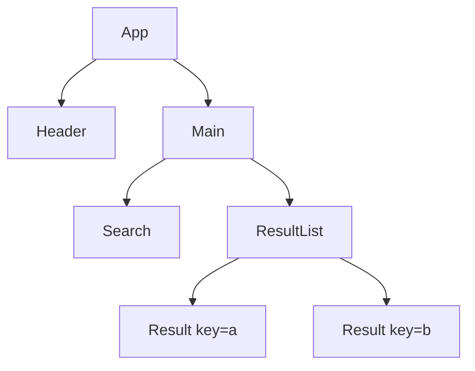
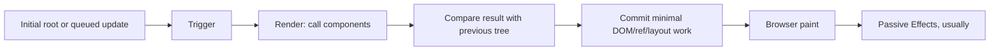
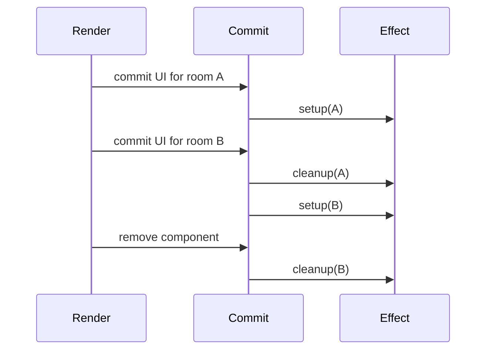
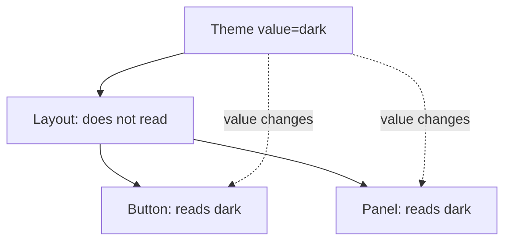
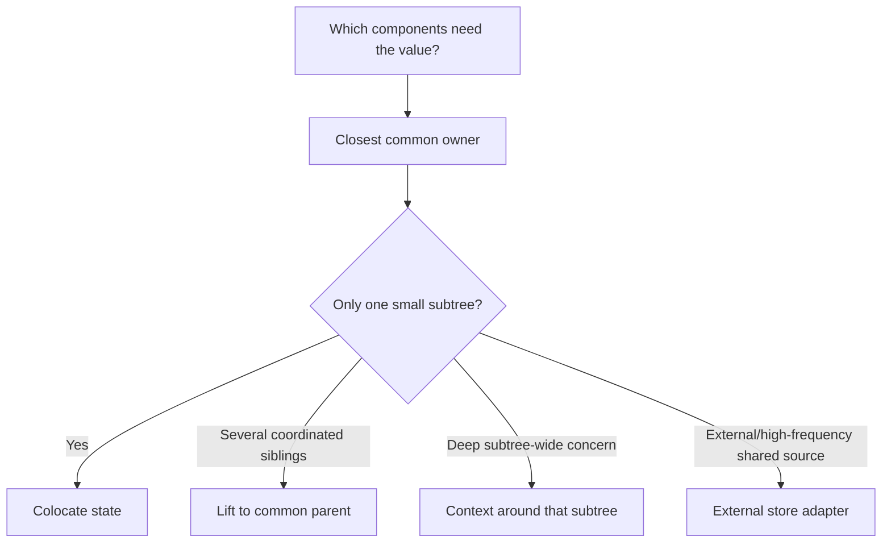
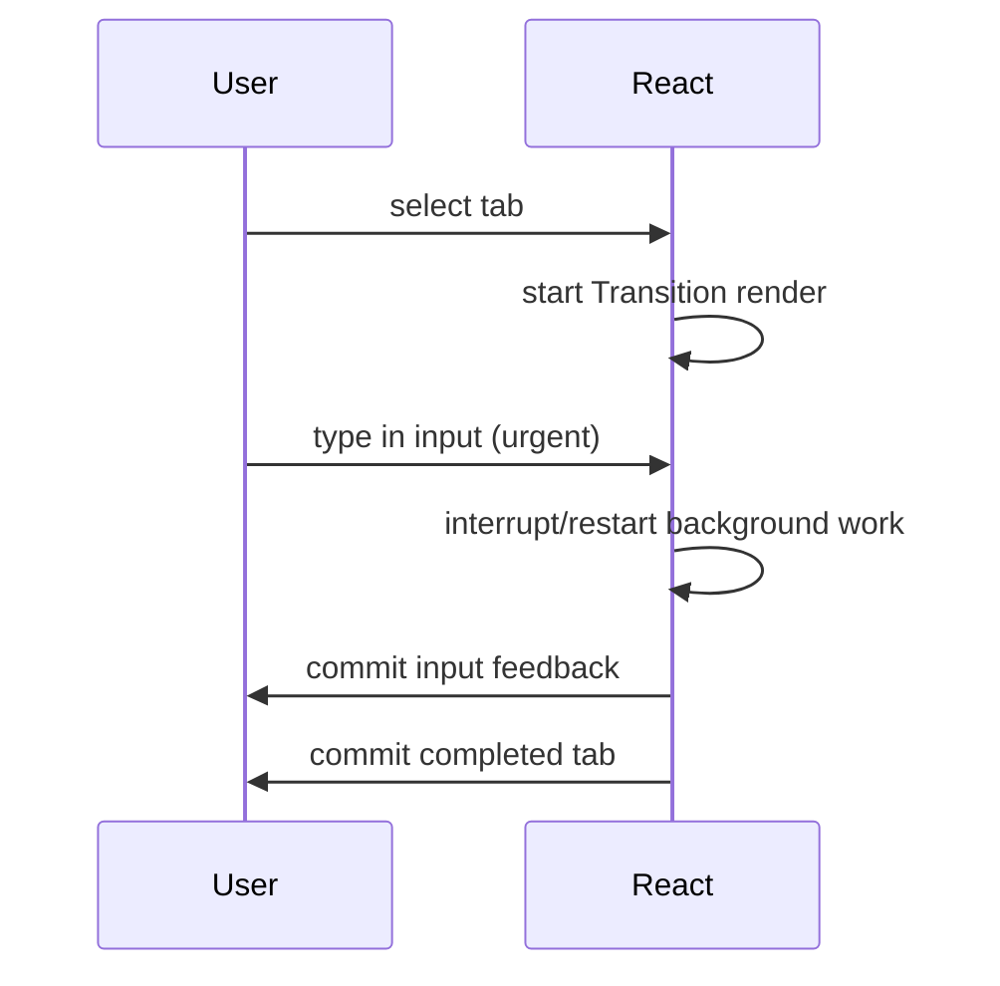
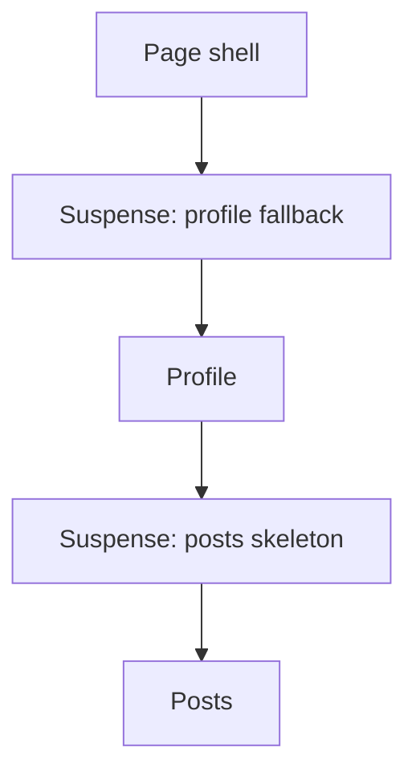
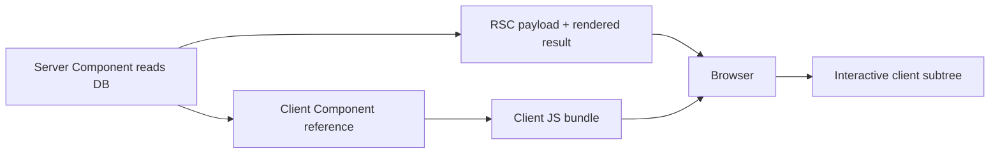
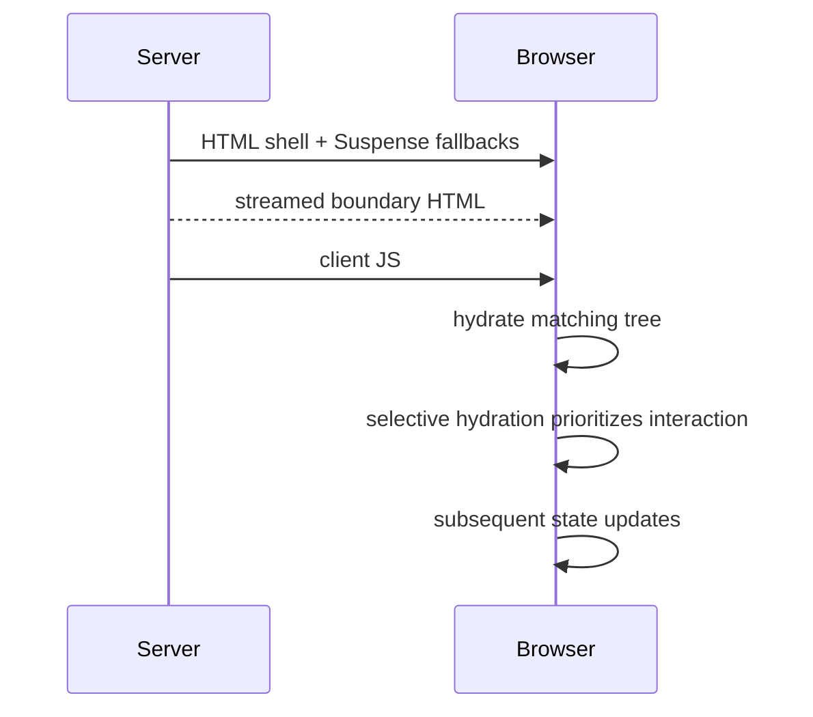
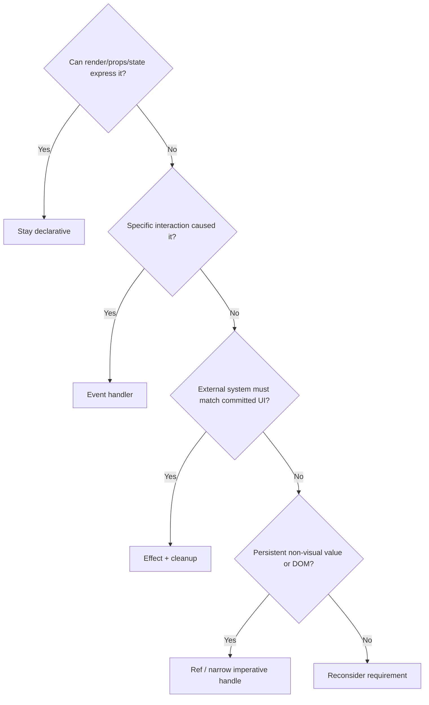

# Senior React Interview Handbook

> A React 19.2 handbook for experienced engineers preparing for Senior, Staff, and architecture-focused interviews. This is not a substitute for release notes during a future upgrade: the baseline and research date below are part of the document's contract.

## React Version & Documentation Baseline

```text
Research date: 2026-09-09 (Asia/Saigon)
React stable version: React 19.2 documentation line; latest stable patch listed by React: 19.2.7 (June 2026)
Official documentation baseline: https://react.dev/ (v19.2)
React Compiler baseline: React Compiler 1.0, stable and production-ready, but an optional build-time addition
```

### Important recent React changes

- **React 19.2:** stable `<Activity>`, `useEffectEvent`, and `cacheSignal`; React Performance Tracks; partial prerendering and resume APIs; Web Streams support in Node; Suspense-boundary reveal batching; `eslint-plugin-react-hooks` v6; and a new default `useId` prefix.
- **React 19:** Actions and async Transitions, `useActionState`, `useOptimistic`, the `use` resource API, function-valued form actions, `useFormStatus`, Server Components and Server Functions as stable consumer features, document metadata/resource rendering, ref cleanup functions, `ref` as a function-component prop, and `<Context value>` provider syntax.
- **React Compiler 1.0:** stable automatic build-time memoization. It is optional. It can target React 17, 18, or 19, and compiler-powered diagnostics are available through `eslint-plugin-react-hooks` even without compiling.
- **Modern ref APIs:** in React 19, function components receive `ref` as a prop. `forwardRef` is no longer necessary and the reference marks it deprecated for a future release; existing code still works.
- **Removed in React 19:** `ReactDOM.render`, `ReactDOM.hydrate`, `findDOMNode`, `unmountComponentAtNode`, `renderToNodeStream`, `renderToStaticNodeStream`, `createFactory`, legacy `contextTypes`/`childContextTypes`/`getChildContext`, string refs, and function-component `propTypes`/`defaultProps` support described by the upgrade guide. Use the replacements documented later.

### Stability legend

- **Stable:** documented for the v19.2 stable channel.
- **Stable consumer API, unstable integration:** React Server Components and Server Functions are stable for application authors, but the bundler/framework implementation APIs may break between React 19.x minors. Framework authors should pin versions or track Canary as the official docs advise.
- **Canary:** available only in the Canary channel; not a stable 19.2 baseline. Examples include `<ViewTransition>`, Fragment refs, and `react-dom`'s `browser` resource.
- **Experimental:** research API with weaker guarantees, such as the documented experimental `defer` prop on Suspense. Do not present it as production-stable.
- **Legacy/deprecated:** may still exist but is not recommended for new code. **Removed** means unavailable in React 19.

**Official sources:**

- https://react.dev/versions
- https://react.dev/blog/2025/10/01/react-19-2
- https://react.dev/blog/2024/12/05/react-19

- https://react.dev/blog/2024/04/25/react-19-upgrade-guide
- https://react.dev/blog/2025/10/07/react-compiler-1

## How to use this handbook

Read Chapters 1–9 for the core mental model, 10–18 for API mastery, 19–29 for system design and runtime behavior, and 30 onward for drills. For every concept, ask:

1. **What?** Name the public abstraction precisely.
2. **How?** Describe observable execution and data flow.
3. **Why?** Connect purity, snapshots, identity, scheduling, or synchronization to engineering consequences.
4. **When / when not?** State the use case and the simpler alternative.
5. **Trade-offs?** Include correctness, readability, performance, and operational cost.

Do not depend on conceptual implementation models as contracts. Wherever this guide says **Conceptual model — do not depend on this as a public API guarantee**, it is a reasoning aid constrained by documented behavior.

---

## 1. React Mental Model

### What React is

React is a library for rendering user interfaces from components. A component is normally a JavaScript function that returns React nodes, usually expressed with JSX. React composes those components into a render tree, calls them to calculate what the UI should be, and commits the necessary host-environment changes.

The useful equation is:

```text
UI = f(props, state, context)
```

It does **not** mean the DOM is rebuilt from scratch after every update. It means rendering should be a pure calculation: for the same props, state, and context, a component must return the same description. React may call that calculation more than once, pause it, discard it, or commit its result. Side effects during render therefore create bugs.

### Declarative UI and components

Imperative code says “find this node, change its text, disable that button.” Declarative React code describes each visual state. Events request state transitions; the next render describes the corresponding UI.

```tsx
function SubmitStatus({ status }: { status: 'editing' | 'sending' | 'sent' }) {
  if (status === 'sent') return <p>Thanks!</p>;
  return <button disabled={status === 'sending'}>Send</button>;
}
```

**Input:** `status = "sending"`

**Output:**

```html
<button disabled>Send</button>
```

**Why:** React calls `SubmitStatus`, evaluates the branch using this render's prop snapshot, then commits only host changes needed to match that result.

### Elements, nodes, and trees

- A **component type** is a function, class, or supported wrapper such as `memo`.
- A **React element** is an immutable description created by JSX or `createElement`, e.g. `<Card title="A" />`. It is not a DOM node and not a component instance.
- A **React node** is anything React can render: an element, string, number, portal, empty value (`null`, `undefined`, booleans), or iterable of nodes.
- The **render tree** records which components rendered which children for a particular result. State is associated with component identity at a position in this tree.
- The **DOM tree** is the browser output. Portals can make React-parentage and DOM-parentage differ.



### Data flow and composition

Props flow down. Event callbacks often communicate intent up. State belongs to the closest common owner that must coordinate it. `children` and component props support composition without inheritance.

```tsx
function Panel({ heading, children }: {
  heading: string;
  children: React.ReactNode;
}) {
  return <section><h2>{heading}</h2>{children}</section>;
}

function Profile() {
  return <Panel heading="Account"><button>Edit</button></Panel>;
}
```

**Input:** heading and a button React node.  
**Output:** a section containing the heading and button.  
**Why:** `Panel` does not need to know the child's implementation; it defines a slot.

### Mental-model boundaries

- React decides **when** to call components. Never call component functions directly; render `<Component />`.
- Rendering is calculation, not proof that the DOM changed.
- A state setter requests an update; it does not mutate the current render's state variable.
- Identity comes from component type, tree position, and keys—not from the textual JSX variable name.
- React is not a framework and is not Next.js. Routing, data loading, and deployment behavior depend on the chosen framework or build setup.

### Interview drill

- **Basic — What is declarative UI?** Describing the UI for the current data instead of issuing step-by-step DOM mutations.
- **Senior — What does `UI = f(state)` omit?** Props and context are also inputs; rendering produces a description, while commit changes the host environment.
- **Staff — Why must render be pure in modern React?** React can retry, interrupt, prioritize, or discard render work. Purity makes those behaviors safe and enables optimization.

**Official sources:**

- https://react.dev/learn/describing-the-ui
- https://react.dev/learn/your-first-component
- https://react.dev/learn/keeping-components-pure
- https://react.dev/learn/understanding-your-ui-as-a-tree
- https://react.dev/reference/rules/react-calls-components-and-hooks

---

## 2. JSX

### Syntax and transformation

JSX is a JavaScript syntax extension that describes tree structure. Build tooling transforms JSX into calls understood by the JSX runtime. With the modern transform, source files need not import `React` solely for JSX. React 19 requires the modern JSX transform for its JSX improvements.

JSX is stricter than HTML:

- Return one root node; use `<>...</>` when no wrapper is needed.
- Close every tag: ``.
- Most properties are camel-cased: `className`, `onClick`, `tabIndex`.
- `aria-*` and `data-*` remain hyphenated.
- JavaScript expressions go inside `{}`; statements such as `if` do not.
- Object literals need double braces because the outer braces enter JavaScript: `style={{ color: 'red' }}`.

```tsx
function Avatar({ user }: { user: { name: string; imageUrl: string } }) {
  return (
    
  );
}
```

**Input:** `{ name: "Ada", imageUrl: "/ada.png" }`  
**Output:** an image with class `avatar`, accessible text `Ada`, and an inline border radius.  
**Why:** JSX properties become element props; React DOM maps them to appropriate DOM properties/attributes.

### Expressions, children, and empty output

Strings, numbers, elements, and arrays of nodes render. `null`, `undefined`, and booleans render nothing. Objects are not valid children unless converted to nodes. React escapes strings, so `{userInput}` is text rather than HTML.

```tsx
function Badge({ count }: { count: number }) {
  return <>{count > 0 ? <b>{count}</b> : null}</>;
}
```

`&&` has a classic trap:

```tsx
// ❌ Incorrect: when count is 0, React renders the number 0.
return <div>{count && <Badge count={count} />}</div>;

// ✅ Correct
return <div>{count > 0 && <Badge count={count} />}</div>;
```

### Attributes and DOM differences

- Use `className`, not usually `class`.
- `style` takes an object with camel-cased names. Numeric values receive `px` except unitless properties. Prefer classes for static styles.
- `htmlFor` corresponds to HTML `for`.
- React event props take functions: `onClick={handleClick}`.
- `dangerouslySetInnerHTML={{__html: html}}` bypasses normal escaping and must receive trusted/sanitized content.
- A Fragment can have a `key` only with explicit `<Fragment key={...}>`; shorthand fragments cannot take props. Fragment refs are Canary, not stable 19.2.

### Common interview traps

```tsx
// ❌ Calls during render; onClick receives its return value.
<button onClick={save()}>Save</button>

// ✅ Passes a function.
<button onClick={save}>Save</button>

// ❌ A fresh object is not a renderable child.
<p>{{ name: 'Ada' }}</p>

// ✅ Render a field or stringify deliberately.
<p>{user.name}</p>
```

Do not describe JSX as “HTML in JavaScript.” It resembles HTML but represents JavaScript values with React semantics.

### Interview drill

- **Basic — Is JSX required?** No. `createElement` or a compatible transform can create elements, but JSX is the recommended authoring form.
- **Senior — Why does `0 && <X />` display `0`?** `&&` returns its left operand when falsy; React renders numbers but ignores booleans.
- **Staff — Is JSX output the DOM?** No. It creates React element descriptions; the renderer later reconciles and commits host changes.

**Official sources:**

- https://react.dev/learn/writing-markup-with-jsx
- https://react.dev/learn/javascript-in-jsx-with-curly-braces
- https://react.dev/learn/conditional-rendering
- https://react.dev/reference/react/createElement
- https://react.dev/reference/react-dom/components/common
- https://react.dev/blog/2024/04/25/react-19-upgrade-guide

---

## 3. Components

### Function components and purity

A function component's name begins with a capital letter and returns React nodes. React, not application code, calls it. Pure rendering means:

- no mutation of pre-existing values;
- no subscriptions, network calls, timers, DOM writes, or logging that correctness depends on;
- the same inputs produce the same output.

Local mutation of values just created during render is safe because nothing outside that render observes them.

```tsx
function Recipe({ ingredients }: { ingredients: string[] }) {
  const items = []; // fresh each render: local mutation is safe
  for (const item of ingredients) items.push(<li key={item}>{item}</li>);
  return <ul>{items}</ul>;
}
```

### Mount, update, unmount—and a better model

- **Mount:** an identity appears in the tree and its state is initialized.
- **Update:** React renders an existing identity with a new snapshot.
- **Unmount:** that identity leaves the tree; React removes its state, DOM, refs, and Effect synchronization.

This component lifecycle is useful, but Effects have their own start/stop synchronization lifecycle. Do not force every Effect into `componentDidMount`/`componentDidUpdate` terminology.

### What causes rendering?

A component is rendered when React needs its output, commonly because:

1. its root is initially rendered or `root.render` is called;
2. its state or reducer dispatch schedules an update;
3. a parent renders it (unless React can skip it through memoization/compiler reuse);
4. a context it reads gets a different provider value;
5. an external-store subscription reports a changed snapshot;
6. suspended work becomes ready and React retries it.

What does **not necessarily** render it:

- assigning a local variable;
- changing `ref.current`;
- mutating an object without calling a setter (also a bug if it is state);
- calling a setter with a value `Object.is`-equal to current state may be skipped;
- a parent render can be skipped for a memoized child with equal props, but `memo` is an optimization, not a semantic guarantee.

### Component identity traps

```tsx
function Parent() {
  // ❌ A new component type is created on each Parent render.
  function Input() {
    const [text, setText] = useState('');
    return <input value={text} onChange={e => setText(e.target.value)} />;
  }
  return <Input />;
}

// ✅ Define component types at module scope.
function Input() { /* ... */ }
function Parent() { return <Input />; }
```

Nested definitions can reset the subtree's state because the component type differs between renders.

### Passing components and children

Pass a component **type** when the receiver should instantiate it (`icon: Icon` then `<Icon />`); pass an **element/node** when the caller has already configured it (`icon: <SaveIcon />` then `{icon}`). Prefer explicit slots and `children` over APIs that inspect and clone unknown children.

### Interview drill

- **Basic — Component vs element?** A component is a type/recipe; an element is a particular immutable description such as `<Button size="sm" />`.
- **Senior — Does a parent render always mean a DOM update in every child?** No. children may render but produce equal host output, and memoization/compiler optimizations may skip work.
- **Staff — Why not call `Component()` yourself?** It bypasses React's control over identity and Hook state and prevents React from optimizing or scheduling the component correctly.

**Official sources:**

- https://react.dev/learn/your-first-component
- https://react.dev/learn/keeping-components-pure
- https://react.dev/learn/preserving-and-resetting-state
- https://react.dev/reference/rules/react-calls-components-and-hooks
- https://react.dev/reference/rules/components-and-hooks-must-be-pure

---

## 4. Props

Props are read-only inputs to a render. The parent owns the values; the child must not mutate them. Props can contain any JavaScript value, including objects, functions, elements, and `children`.

```tsx
function Greeting({ name = 'Guest' }: { name?: string }) {
  return <h1>Hello {name}</h1>;
}
```

**Input:** the `name` prop is omitted.  
**Output:** `<h1>Hello Guest</h1>`.  
**Why:** JavaScript parameter defaulting applies only when the prop is missing or `undefined`, not when it is `null`.

### Props vs state

- Props are supplied by a parent for this render.
- State is private component memory managed by React and updated through a setter/dispatch.
- Both are immutable snapshots during render.
- A value should usually have one owner. Do not copy a prop into state merely to “keep it.”

```tsx
// ❌ Incorrect: later color prop changes are ignored.
function Swatch({ color }) {
  const [localColor] = useState(color);
  return <div style={{ color: localColor }} />;
}

// ✅ Correct: derive directly.
function Swatch({ color }) {
  return <div style={{ color }} />;
}
```

Copy a prop to state only when intentionally taking an initial value and ignoring later changes; name it `initialColor` or `defaultColor` to make that contract explicit. If a new entity should reset local state, use a different `key` or redesign ownership.

### Identity and performance

Each render evaluates object/function literals anew:

```tsx
const options = {};              // new reference each render
const onSave = () => save(id);   // new function each render
```

That is correct by default. It matters only when identity is observed: a dependency array, a memoized child, a Map/Set key, or an external API subscription. Do not stabilize every value reflexively; first minimize props, colocate state, remove unnecessary Effects, and measure.

```tsx
const Profile = memo(function Profile({ person }) { /* ... */ });

// This defeats memo on every parent render:
<Profile person={{ name, age }} />

// Better API when only fields are needed:
<Profile name={name} age={age} />
```

### Callback contracts

Callback props communicate intent, e.g. `onSave(draft)`, rather than exposing a child's internal DOM. Name event-handler props with `on...`; internal handlers often use `handle...`. Calling belongs in the event, not render.

### Interview drill

- **Basic — Can a child change its props?** No; it requests changes through a callback or shared owner.
- **Senior — When does object prop identity matter?** When compared or subscribed by identity, notably `memo`'s default `Object.is` comparisons and Hook dependencies.
- **Staff — Controlled vs uncontrolled component API?** Controlled behavior is driven by props and callbacks; uncontrolled behavior keeps local state, often initialized by a `default...` prop. A reusable component may support either with a clear invariant.

**Official sources:**

- https://react.dev/learn/passing-props-to-a-component
- https://react.dev/learn/sharing-state-between-components
- https://react.dev/learn/choosing-the-state-structure
- https://react.dev/reference/react/memo

---

## 5. State

### `useState`: initialization, snapshots, and updates

```ts
const [state, setState] = useState(initialState);
const [state, setState] = useState(createInitialState); // lazy initializer
```

React calls a lazy initializer during initialization and stores its result. In development Strict Mode, React may call it twice to detect impurity and ignore one result. The setter has stable identity. It queues state for a future render; it returns `undefined` and does not alter the state variable captured by the current render.

```tsx
function Counter() {
  const [count, setCount] = useState(0);
  function increment() {
    setCount(count + 1);
    console.log(count);
  }
  return <button onClick={increment}>{count}</button>;
}
```

**Input:** one click while the button shows `0`.  
**Immediate console output:** `0`.  
**Committed button output:** `1`.

Sequence:

```text
Render #1: count = 0; handler closes over 0
Click: queue replacement with 1; log the Render #1 snapshot (0)
Render #2: React supplies count = 1
Commit: button text changes to 1
```

### Update queues: replacement vs updater

Starting from `0`:

```tsx
setCount(count + 1);
setCount(count + 1);
setCount(count + 1);
```

Each expression uses the same snapshot (`0`) and queues “replace with `1`.” **Output after the event: `1`.**

```tsx
setCount(c => c + 1);
setCount(c => c + 1);
setCount(c => c + 1);
```

Each updater receives the previous queued result: `0 → 1 → 2 → 3`. **Output: `3`.** Updaters must be pure; React may call them twice in development.

Mixed queue, starting at `0`:

```tsx
setCount(count + 5); // replace with 5
setCount(c => c + 1); // 5 -> 6
setCount(42);         // replace with 42
```

**Output: `42`.** A direct value behaves conceptually as a queued replacement that ignores the queue input.

### Batching

React batches updates so handlers see a consistent snapshot and the UI does not render half-finished combinations. With `createRoot`, React 18+ automatically batches updates from React events, promises, timeouts, native event handlers, and other tasks. React does not batch across separate intentional user events such as distinct clicks. `flushSync` is an uncommon escape hatch for integrations requiring the DOM synchronously and can hurt performance or reveal Suspense fallbacks.

```text
Click handler
  ├─ queue A
  ├─ queue B
  └─ return
       ↓
React processes queues → render → commit
```

### Immutable object, array, and nested updates

```tsx
// ❌ Mutates the current snapshot; does not request a render.
person.name = 'Grace';

// ✅ Replaces with a new object.
setPerson(p => ({ ...p, name: 'Grace' }));

// ❌ Mutates the array.
items.push(newItem);
setItems(items);

// ✅ New array.
setItems(xs => [...xs, newItem]);

// ✅ Copy every path from the changed leaf to the root.
setPerson(p => ({
  ...p,
  address: { ...p.address, city: 'Hanoi' }
}));
```

Immutability preserves old render snapshots, makes change detection cheap, supports undo/history, and keeps modern React features safe. Spreads are shallow.

### Derived, redundant, duplicated, and normalized state

```tsx
// ❌ Redundant and risks becoming stale.
const [fullName, setFullName] = useState('');
useEffect(() => setFullName(first + ' ' + last), [first, last]);

// ✅ Calculate during render.
const fullName = first + ' ' + last;
```

State design rules:

1. Group values that always change together.
2. Avoid contradictory states; a status union often beats several booleans.
3. Do not store values derivable from props/state.
4. Avoid duplicate copies of the same entity; store an ID and derive the entity.
5. Flatten deeply nested state when updates are difficult.

```tsx
// Before: selection duplicates an object.
const [items, setItems] = useState(initialItems);
const [selectedItem, setSelectedItem] = useState(items[0]);

// After: normalized source of truth.
const [selectedId, setSelectedId] = useState(items[0].id);
const selectedItem = items.find(item => item.id === selectedId);
```

### Preserving and resetting state

React associates state with a component type at a position in the render tree. Same type, same position, same key preserves state. Removing it, changing its type, or changing its key resets the subtree.

```tsx
<Chat key={recipient.id} recipient={recipient} />
```

**Input:** recipient changes from `a` to `b`.  
**Output:** `Chat` and descendants mount with fresh state.  
**Why:** the key participates in identity within this parent.

Do not use random keys: they force remounts on every render, losing input/focus and defeating reuse. Index keys are safe only for genuinely static lists whose order and membership never change and whose items have no stable identity.

### State colocating and lifting

Keep transient state near its consumers. Lift state to the closest common ancestor only when children must coordinate. Excessively high state ownership expands render scope and coupling; excessively low ownership creates duplicated truths.

### Interview drill

- **Basic — Why does setting state not change the current variable?** Each render receives a snapshot; the setter queues another render.
- **Senior — Direct update vs functional updater?** A direct value is calculated from the current closure; an updater is queued and receives the latest pending state, so it is required when the next value depends on the previous one.
- **Staff — Why is immutability architectural, not stylistic?** It preserves snapshot semantics, makes identity-based optimizations valid, supports future/concurrent work, and avoids aliasing old state.

**Official sources:**

- https://react.dev/reference/react/useState
- https://react.dev/learn/state-as-a-snapshot
- https://react.dev/learn/queueing-a-series-of-state-updates
- https://react.dev/learn/updating-objects-in-state
- https://react.dev/learn/updating-arrays-in-state
- https://react.dev/learn/choosing-the-state-structure
- https://react.dev/learn/preserving-and-resetting-state
- https://react.dev/blog/2022/03/29/react-v18

---

## 6. Rendering: Trigger → Render → Commit → Paint

This distinction is foundational.



### 1. Trigger

Initial rendering starts from a root. Later state, reducer, context, external-store, retry, or root updates schedule work. “Schedule” intentionally avoids promising an exact immediate time.

### 2. Render

React calls the relevant component functions to calculate a new tree. Initial render begins at the root; re-renders calculate what changed from the triggering component downward, subject to optimization. Rendering must be pure because React may restart or discard it.

**React calling a component** is the act of executing its function. **Rendering** is the wider calculation process. A render attempt need not commit.

### 3. Reconciliation

**Conceptual model — do not depend on this as a public API guarantee.** React compares the new description with the previous one, using types, positions, and keys to preserve identity and determine host changes. Official docs explain observable identity behavior; they do not promise a specific diff algorithm as a public API.

### 4. Commit

React applies necessary changes to the DOM. If calculated host output matches what is already there, React may render components and commit no DOM mutation. Refs and layout Effects are tied to commit behavior, not to merely calling a component.

### 5. Browser paint and Effects

The browser decides when to paint. `useLayoutEffect` runs after DOM commit but before browser repaint and can block paint. Passive `useEffect` generally runs after commit and, for non-interaction work, React generally lets the browser paint first. Interaction-related timing can differ; `useEffect` is not a precision paint scheduler.

### Example: render with no DOM change

```tsx
function App() {
  const [tick, setTick] = useState(0);
  console.log('render', tick);
  return <button onClick={() => setTick(t => t + 1)}>Static</button>;
}
```

**Input:** click.  
**Output:** the component logs another render; visible button text remains `Static`.  
**Sequence:** update → render with a different state snapshot → React finds identical host output → no text mutation is needed.

### Render-phase update trap

```tsx
// ❌ Infinite loop: every render unconditionally schedules another render.
function Broken() {
  const [n, setN] = useState(0);
  setN(n + 1);
  return <p>{n}</p>;
}
```

Event-driven updates belong in handlers; external synchronization belongs in Effects; derivations belong in render.

### Interview drill

- **Basic — Render vs commit?** Render calculates; commit applies host changes.
- **Senior — Can React render without changing the DOM?** Yes: the calculated host output may match, or a render attempt may be discarded/interrupted.
- **Staff — Why avoid depending on render counts?** Development checks, retries, Suspense, scheduling, and optimization can change calls without changing semantic UI behavior.

**Official sources:**

- https://react.dev/learn/render-and-commit
- https://react.dev/learn/state-as-a-snapshot
- https://react.dev/learn/keeping-components-pure
- https://react.dev/reference/react/useLayoutEffect
- https://react.dev/reference/react/useEffect

---

## 7. Events

### Handlers and intent

Pass a function; do not call it during render.

```tsx
function Toolbar({ onPlay }: { onPlay: () => void }) {
  return <button onClick={onPlay}>Play</button>;
}
```

Handlers may read the current render snapshot and schedule updates. Unlike Effects, handlers run because a specific interaction happened. If a purchase happens because the user clicked **Buy**, put it in that handler, not in an Effect that watches `isBuying`.

### Propagation, capture, default behavior

Most React events propagate through the React tree. A child handler runs, then ancestors' bubble handlers. Capture handlers such as `onClickCapture` run on the way down. `e.stopPropagation()` stops propagation; `e.preventDefault()` prevents the browser's default action. They are independent.

```tsx
function LinkButton() {
  return (
    <a href="/danger" onClick={e => {
      e.preventDefault();
      console.log('stayed');
    }}>Stay</a>
  );
}
```

**Input:** click.  
**Output:** logs `stayed`; the browser does not navigate.  
**Why:** the handler cancels default navigation; it does not inherently stop propagation.

Portals are a common senior trap: events from a portal propagate according to the **React tree**, even if its DOM is elsewhere. If this causes trouble, stop propagation inside the portal or move the portal in the React tree.

### Synthetic events

React handlers receive a React event object that follows the DOM event standard while normalizing React behavior. It exposes `nativeEvent` when needed, but mappings are not a promised public contract. Modern React no longer requires `e.persist()` for web event pooling behavior; write against the current event API, not old interview folklore.

### Event batching and snapshots

Updates inside one handler are batched. The handler keeps its render's state snapshot:

```tsx
function handleClick() {
  setCount(count + 1);
  alert(count); // old snapshot
}
```

Use an updater to derive queued state, but remember an asynchronous callback still closes over the render that created it. A ref or Effect Event may read latest committed values when that is truly the desired semantic.

### Common traps

```tsx
// ❌ Render-time call
<button onClick={submit()}>Submit</button>

// ✅ Handler
<button onClick={() => submit(id)}>Submit</button>

// ❌ Forgetting default form navigation with onSubmit
<form onSubmit={handleSubmit}>

// ✅ If using classic onSubmit and staying on-page
function handleSubmit(e) {
  e.preventDefault();
  // ...
}
```

Function-valued `<form action>` is a different modern React path: React runs it as an Action/Transition and no `preventDefault` is needed.

### Interview drill

- **Basic — `stopPropagation` vs `preventDefault`?** One stops handler propagation; the other cancels browser behavior.
- **Senior — Event handler vs Effect?** A handler responds to a particular interaction; an Effect synchronizes with an external system because rendered reactive values require it.
- **Staff — How do portals affect bubbling?** Events bubble through React parentage, not physical DOM parentage.

**Official sources:**

- https://react.dev/learn/responding-to-events
- https://react.dev/learn/queueing-a-series-of-state-updates
- https://react.dev/reference/react-dom/createPortal
- https://react.dev/reference/react-dom/components/common
- https://react.dev/reference/react-dom/components/form

---

## 8. Effects: Synchronization, Not Data Flow

### Purpose

An Effect synchronizes a component with an **external system**: network connection, browser API, timer, subscription, non-React widget, analytics tied to visibility, or similar. Effects are escape hatches. If a value can be calculated during render or work is caused by a user event, an Effect is usually the wrong tool.

```ts
useEffect(setup, dependencies?)
```

`setup` may return a cleanup. Dependencies include every reactive value read by setup/cleanup. React compares dependencies using `Object.is`.

### Effect lifecycle

Think “start synchronizing / stop synchronizing,” not just mount/update/unmount.



```tsx
function ChatRoom({ roomId }: { roomId: string }) {
  useEffect(() => {
    const connection = createConnection(roomId);
    connection.connect();
    return () => connection.disconnect();
  }, [roomId]);
  return <h1>Room {roomId}</h1>;
}
```

**Input:** mount with `general`, update to `travel`, then unmount.  
**Output/sequence:** commit `general` → connect `general`; commit `travel` → disconnect `general` → connect `travel`; unmount → disconnect `travel`.  
**Why:** each committed dependency version owns a synchronization process.

### Three dependency forms

```tsx
useEffect(setup);          // after every committed render where Effect runs
useEffect(setup, []);      // no reactive dependencies; mount/start and unmount/stop
useEffect(setup, [value]); // start again when value differs by Object.is
```

Conceptual sequences outside Strict Mode:

```text
No dependency argument
Render #1 → commit → setup #1
Render #2 → commit → cleanup #1 → setup #2
Unmount → cleanup #2

[]
Render #1 → commit → setup
Render #2 → commit → no Effect restart
Unmount → cleanup

[value]
Render #1(value=A) → commit → setup(A)
Render #2(value=A) → commit → no restart
Render #3(value=B) → commit → cleanup(A) → setup(B)
```

At a root `<StrictMode>` development mount, React adds a setup → cleanup → setup stress test. Production does not.

### Reactive values and the linter

Props, state, and variables/functions declared in the component body are reactive. Dependencies are not a hand-curated schedule; they describe what the Effect reads. To change dependencies, change code:

- move constants outside the component;
- use state updaters to avoid reading state only to calculate next state;
- create an object/function inside the Effect if only the Effect needs it;
- split independent synchronization processes;
- use `useEffectEvent` for genuinely non-reactive logic fired by an Effect;
- remove the Effect when deriving data.

```tsx
// ❌ Lies to React; stale roomId and stale closure.
useEffect(() => connect(roomId), []);

// ✅ Declares synchronization input and cleanup.
useEffect(() => {
  const connection = connect(roomId);
  return () => connection.disconnect();
}, [roomId]);
```

### Unstable object and function dependencies

```tsx
// ❌ options is new every render, so the Effect reconnects every render.
const options = { serverUrl, roomId };
useEffect(() => {
  const c = createConnection(options);
  c.connect();
  return () => c.disconnect();
}, [options]);

// ✅ Build it inside; depend on primitive reactive values.
useEffect(() => {
  const options = { serverUrl, roomId };
  const c = createConnection(options);
  c.connect();
  return () => c.disconnect();
}, [serverUrl, roomId]);
```

`useMemo` can stabilize a dependency but is a performance cache, not the first correctness fix. Prefer removing the identity dependency.

### Stale closures

Every render creates functions that see that render's snapshot. Suppressing dependencies can freeze an old function forever:

```tsx
// ❌ interval always sees count = 0 from initial render.
useEffect(() => {
  const id = setInterval(() => setCount(count + 1), 1000);
  return () => clearInterval(id);
}, []);

// ✅ updater avoids reading count.
useEffect(() => {
  const id = setInterval(() => setCount(c => c + 1), 1000);
  return () => clearInterval(id);
}, []);
```

### `useEffectEvent` (stable in 19.2)

An Effect Event holds non-reactive logic that is called only by Effects/other Effect Events in the same component and sees latest committed props/state.

```tsx
const onConnected = useEffectEvent(() => {
  showNotification('Connected', theme);
});

useEffect(() => {
  const c = connect(roomId);
  c.on('connected', onConnected);
  c.start();
  return () => c.stop();
}, [roomId]); // onConnected and theme are intentionally absent
```

Do not use it to silence dependencies. Effect Event functions intentionally do **not** have stable identity, must not be passed to children, called during render/event handlers, or included in dependency lists.

### Fetching, race conditions, and cancellation

Framework data loading is usually more efficient than manual Effect fetching because Effects do not run on the server and parent/child Effects can cause waterfalls. When fetching manually, cleanup must prevent stale responses from winning:

```tsx
useEffect(() => {
  const controller = new AbortController();
  let ignore = false;

  async function load() {
    const response = await fetch(`/api/users/${userId}`, {
      signal: controller.signal
    });
    const data = await response.json();
    if (!ignore) setUser(data);
  }

  load().catch(error => {
    if (error.name !== 'AbortError') throw error;
  });
  return () => {
    ignore = true;
    controller.abort();
  };
}, [userId]);
```

**Race:** request A starts, then B starts; B resolves, then A resolves. Without cleanup/ordering, A overwrites B. `ignore` protects state even if transport cancellation is ineffective; `AbortController` saves work when supported. Production error handling should route failures into state, an Action, or a data framework rather than throwing from an unobserved async continuation.

### You might not need an Effect

```tsx
// ❌ Double render and stale window.
useEffect(() => setVisible(filter(items, query)), [items, query]);

// ✅ Derive in render; useMemo only if measured expensive.
const visible = filter(items, query);

// ❌ POST is caused by page visibility, so remounting repeats it.
useEffect(() => buyProduct(productId), [productId]);

// ✅ It was caused by the click.
function handleBuy() { buyProduct(productId); }
```

### `useLayoutEffect` and `useInsertionEffect`

- `useLayoutEffect`: measure/mutate layout after DOM commit and before repaint. It blocks paint and does nothing on the server; prefer `useEffect` unless pre-paint work is necessary.
- `useInsertionEffect`: library-level hook to insert dynamic styles before layout Effects/DOM observation. Refs are not attached and state updates are not allowed. Application code should almost never use it.

### Interview drill

- **Basic — What is an Effect for?** Synchronizing committed React state with a system outside React.
- **Senior — Why can an empty dependency array create a stale closure?** It promises that setup reads no changing reactive value; any omitted value remains from the initial render's closure.
- **Staff — How do you reduce dependencies safely?** Restructure the Effect/code: remove derivation, use updaters, move construction inside, move constants outside, split synchronization, or isolate genuinely non-reactive logic with an Effect Event.

**Official sources:**

- https://react.dev/reference/react/useEffect
- https://react.dev/reference/react/useEffectEvent
- https://react.dev/learn/synchronizing-with-effects
- https://react.dev/learn/you-might-not-need-an-effect
- https://react.dev/learn/lifecycle-of-reactive-effects
- https://react.dev/learn/separating-events-from-effects
- https://react.dev/learn/removing-effect-dependencies
- https://react.dev/reference/react/useLayoutEffect
- https://react.dev/reference/react/useInsertionEffect

---

## 9. Refs and Imperative Escape Hatches

### State vs ref

`useRef(initialValue)` returns the same mutable object on later renders. Changing `.current` does not request a render because a ref is deliberately outside the reactive data flow.

```tsx
function Stopwatch() {
  const intervalRef = useRef<number | null>(null);
  function start() {
    intervalRef.current = window.setInterval(tick, 1000);
  }
  function stop() {
    if (intervalRef.current !== null) clearInterval(intervalRef.current);
  }
  return <><button onClick={start}>Start</button><button onClick={stop}>Stop</button></>;
}
```

**Input:** Start then Stop.  
**Output:** the interval ID persists between renders; changing it renders nothing.  
**Why:** React preserves the ref object but does not track `.current` for UI updates.

Use refs for timer IDs, previous external handles, DOM nodes, or other values not used to render. Use state for visible data. Reading/writing refs during render is generally invalid except predictable one-time initialization.

### DOM refs and lifecycle

```tsx
function Search() {
  const inputRef = useRef<HTMLInputElement>(null);
  return <>
    <input ref={inputRef} />
    <button onClick={() => inputRef.current?.focus()}>Focus</button>
  </>;
}
```

During render, `current` is not a reliable attached node. React sets it during commit and clears it on removal. Callback refs may return a cleanup function in React 19. Root Strict Mode runs callback ref setup/cleanup an extra time in development to find missing cleanup.

### Exposing refs in React 19

```tsx
function MyInput({ ref, ...props }: React.ComponentProps<'input'>) {
  return <input {...props} ref={ref} />;
}
```

Function components can receive `ref` as a prop in React 19. Existing `forwardRef` works, but is no longer necessary and is marked for future deprecation.

Expose the smallest imperative API rather than the whole node:

```tsx
type Handle = { focus(): void };

function MyInput({ ref }: { ref: React.Ref<Handle> }) {
  const innerRef = useRef<HTMLInputElement>(null);
  useImperativeHandle(ref, () => ({
    focus() { innerRef.current?.focus(); }
  }), []);
  return <input ref={innerRef} />;
}
```

Prefer props for declarative behavior. Imperative handles are useful for focus, scrolling, selection, and integration—not for exposing arbitrary child internals.

### Misuse

```tsx
// ❌ UI reads ref but no render is requested.
const countRef = useRef(0);
countRef.current++;
return <p>{countRef.current}</p>;

// ✅ Visible count is state.
const [count, setCount] = useState(0);
```

Avoid manually changing DOM that React owns; React may later overwrite it. Safe examples include focus/scroll, measurement, or operating on DOM portions React does not manage.

### Interview drill

- **Basic — Why does ref mutation not render?** Refs are mutable containers React does not subscribe to.
- **Senior — When is a DOM ref populated?** During commit after the DOM node exists, and cleared/cleaned when removed.
- **Staff — Ref prop vs `forwardRef` in 19.2?** New function components accept `ref` as a prop; `forwardRef` remains for compatibility but is no longer necessary and slated for deprecation.

**Official sources:**

- https://react.dev/reference/react/useRef
- https://react.dev/learn/referencing-values-with-refs
- https://react.dev/learn/manipulating-the-dom-with-refs
- https://react.dev/reference/react/useImperativeHandle
- https://react.dev/reference/react/forwardRef
- https://react.dev/blog/2024/12/05/react-19

---

## 10. Complete Stable Hook and Resource Catalog

This catalog covers every stable built-in React Hook listed or individually documented in the React 19.2 reference, plus the special `use` resource API and React DOM's stable `useFormStatus` Hook. `use` has Hook-like naming and restrictions but is classified by the reference as a resource API and uniquely may be called in loops and conditions.

### At-a-glance list

| Category | Stable APIs |
|---|---|
| State | `useState`, `useReducer`, `useActionState`, `useOptimistic` |
| Context/resource | `useContext`, `use` |
| Refs | `useRef`, `useImperativeHandle` |
| Effects | `useEffect`, `useLayoutEffect`, `useInsertionEffect`, `useEffectEvent` |
| Performance/scheduling | `useMemo`, `useCallback`, `useTransition`, `useDeferredValue` |
| Library/accessibility/devtools | `useId`, `useSyncExternalStore`, `useDebugValue` |
| React DOM form Hook | `useFormStatus` from `react-dom` |

### 10.1 `useState`

**Definition/purpose:** declare local state for a component identity.  
**Signature:** `const [state, setState] = useState(initialState | initializer)`  
**Parameters:** initial value or pure zero-argument initializer. It is ignored after initialization.  
**Return:** current render's state snapshot and a stable setter. The setter accepts a next value or pure updater and returns `undefined`.

```tsx
function Toggle() {
  const [on, setOn] = useState(false);
  return <button onClick={() => setOn(v => !v)}>{on ? 'On' : 'Off'}</button>;
}
```

**Input:** one click from initial state. **Output:** `Off` → `On`.  
**Execution:** Render #1 (`false`) → click queues updater → Render #2 applies `!false` → commit text.  
**Use:** independent local UI state. **Avoid:** redundant derived values or complex event-driven state machines better represented by a reducer.  
**Performance:** lazy initialization avoids repeating expensive initial construction; React can skip a state update when the next state is `Object.is`-equal. State placement controls render scope.

```tsx
// ❌ setTodos([...todos, todo]) in a callback that may use an old snapshot
// ✅ setTodos(current => [...current, todo])
```

**Interview question:** Why can a setter be stable while state is a snapshot? **Answer:** the setter identifies the Hook queue; each render receives the value React calculated from that queue.

Official source: https://react.dev/reference/react/useState

### 10.2 `useReducer`

**Definition/purpose:** declare state whose transitions are centralized in a pure reducer.  
**Signature:** `const [state, dispatch] = useReducer(reducer, initialArg, init?)`  
**Parameters:** pure `(state, action) => nextState`, initial argument, optional pure lazy initializer.  
**Return:** state snapshot and stable `dispatch(action)`; dispatch returns `undefined`.

```tsx
type Action = { type: 'increment' } | { type: 'reset' };
function reducer(n: number, action: Action) {
  if (action.type === 'increment') return n + 1;
  if (action.type === 'reset') return 0;
  throw Error('Unknown action');
}
function Counter() {
  const [n, dispatch] = useReducer(reducer, 0);
  return <button onClick={() => dispatch({ type: 'increment' })}>{n}</button>;
}
```

**Input:** click at `0`. **Output:** `1`.  
**Execution:** dispatch queues action → next render calls reducer with `0` and action → commit. In Strict Mode, reducer/initializer may run twice in development; one result is ignored.  
**Use:** many related transitions, complex state, or testable event vocabulary. **Avoid:** ceremony for one trivial independent value.  
**Incorrect:** mutate and return the same object. **Correct:** return a new state for a change.  
**Performance:** not inherently faster than `useState`; it can improve structure. Split context state/dispatch so dispatch-only consumers need not read state.

**Interview question:** Reducer vs Redux? **Answer:** `useReducer` is a local React state primitive; it does not by itself provide a global store, middleware, selectors, or devtools history.

Official source: https://react.dev/reference/react/useReducer

### 10.3 `useActionState`

**Definition/purpose:** state for the result and pending status of an Action.  
**Signature:** `const [state, dispatchAction, isPending] = useActionState(reducerAction, initialState, permalink?)`  
**Parameters:** an Action receiving `(previousState, actionPayload)`, initial state, and optional progressive-enhancement permalink.  
**Return:** latest Action result, dispatcher, and pending boolean.

```tsx
function Counter() {
  const [count, increment, pending] = useActionState(
    async previous => previous + 1,
    0
  );
  return <button disabled={pending} onClick={() => startTransition(increment)}>
    {pending ? 'Saving…' : count}
  </button>;
}
```

**Input:** click at `0`. **Output:** pending label while the Action runs, then `1`.  
**Execution:** Action begins in a Transition → `isPending` becomes true → queued Action receives previous result → completion commits result in order → pending becomes false. For `<form action={increment}>`, React supplies `FormData` as payload after the previous state argument.  
**Use:** serial Action results, forms, pending/error response state. **Avoid:** ordinary synchronous state with no Action semantics.  
**Incorrect:** invoke an async dispatcher outside an Action/Transition and expect pending tracking. **Correct:** pass it to an Action prop or wrap the call with `startTransition`.  
**Performance:** reduces hand-built pending/error state and handles Action ordering; it is not a general cache.

**Interview question:** Why does the form action receive a surprising first parameter? **Answer:** `useActionState` wraps it so the first parameter is previous state; `FormData` becomes the next parameter.

Official source: https://react.dev/reference/react/useActionState

### 10.4 `useOptimistic`

**Definition/purpose:** show temporary optimistic state while an Action is pending.  
**Signature:** `const [optimisticState, setOptimistic] = useOptimistic(value, reducer?)`  
**Parameters:** authoritative value and optional pure `(currentState, action) => optimisticState`.  
**Return:** optimistic/current value and an optimistic dispatcher.

```tsx
function Like({ liked, save }: { liked: boolean; save(): Promise<void> }) {
  const [optimisticLiked, setOptimisticLiked] = useOptimistic(liked);
  return <button onClick={() => startTransition(async () => {
    setOptimisticLiked(true);
    await save();
  })}>{optimisticLiked ? 'Liked' : 'Like'}</button>;
}
```

**Input:** click while `liked=false`. **Output:** immediately `Liked`; after success it reflects the authoritative `liked`; on failure the optimistic layer reverts and the error can reach a boundary.  
**Execution:** Action queues optimistic layer → urgent feedback render → Action settles → layer is reconciled with base value.  
**Use:** reversible feedback for mutations. **Avoid:** pretending irreversible/high-risk work succeeded without clear recovery.  
**Incorrect:** call setter as durable state outside an Action. **Correct:** use within an Action and update the authoritative source on success.  
**Performance:** optimizes perceived latency; it may create extra renders and needs accessible pending/error feedback.

**Interview question:** Is optimistic state the source of truth? **Answer:** No; it is a temporary projection over the passed authoritative value.

Official source: https://react.dev/reference/react/useOptimistic

### 10.5 `useContext`

**Definition/purpose:** read and subscribe to the closest provider value for a context.  
**Signature:** `const value = useContext(SomeContext)`  
**Parameter:** the exact context object returned by `createContext`.  
**Return:** nearest value above; otherwise the static default.

```tsx
const Theme = createContext('light');
function Label() {
  const theme = useContext(Theme);
  return <span className={theme}>Ready</span>;
}
function App() { return <Theme value="dark"><Label /></Theme>; }
```

**Input:** provider value `dark`. **Output:** `<span class="dark">Ready</span>`.  
**Execution:** Label subscribes while rendering; a provider value change by `Object.is` re-renders readers even through a memoized ancestor.  
**Use:** cross-cutting data for a subtree. **Avoid:** every frequently changing value or data needed only one/two levels down.  
**Incorrect:** render provider in the same component *below* the call and expect it to affect that call. **Correct:** provider must be above the reader.  
**Performance:** all readers of a changed context render; split contexts and stabilize provider objects only where identity matters.

**Interview question:** Can `memo` block context updates? **Answer:** No. A memoized component that reads changed context still re-renders.

Official source: https://react.dev/reference/react/useContext

### 10.6 `useRef`

**Definition/purpose:** persist a mutable non-render value or receive a host node.  
**Signature:** `const ref = useRef(initialValue)`  
**Parameter:** initial `.current`, used only initially.  
**Return:** stable `{ current }` object.

```tsx
function FocusButton() {
  const ref = useRef<HTMLInputElement>(null);
  return <><input ref={ref}/><button onClick={() => ref.current?.focus()}>Focus</button></>;
}
```

**Input:** click. **Output:** input receives focus; no render is requested.  
**Execution:** commit assigns DOM node → handler reads it. Removal clears it.  
**Use:** DOM, timers, external mutable handles. **Avoid:** visible state or ref reads/writes during render.  
**Performance:** mutations are cheap and non-reactive; that is also why UI can become stale if it depends on them.

**Interview question:** Ref vs module variable? **Answer:** a ref is isolated per mounted component identity and follows its lifetime; a module variable is shared by all instances and requests.

Official source: https://react.dev/reference/react/useRef

### 10.7 `useImperativeHandle`

**Definition/purpose:** customize the value assigned to a parent ref.  
**Signature:** `useImperativeHandle(ref, createHandle, dependencies?)`  
**Parameters:** received ref, pure handle factory, reactive dependencies.  
**Return:** `undefined`.

```tsx
function SearchInput({ ref }: { ref: React.Ref<{ focus(): void }> }) {
  const input = useRef<HTMLInputElement>(null);
  useImperativeHandle(ref, () => ({ focus: () => input.current?.focus() }), []);
  return <input ref={input} />;
}
```

**Input:** parent calls `handle.current.focus()`. **Output:** inner input focuses.  
**Execution:** during commit React assigns/replaces the exposed handle when dependencies change.  
**Use:** narrow imperative methods. **Avoid:** exposing mutable internals that props could model declaratively.  
**Incorrect:** expose the entire implementation by default. **Correct:** expose only stable capabilities.  
**Performance:** changed dependencies replace the handle; keep the API small, but never omit reactive dependencies.

**Interview question:** Why use a handle rather than forwarding a DOM node? **Answer:** it encapsulates implementation and limits callers to supported operations.

Official source: https://react.dev/reference/react/useImperativeHandle

### 10.8 `useEffect`

**Definition/purpose:** synchronize committed UI state with an external system.  
**Signature:** `useEffect(setup, dependencies?)`  
**Parameters:** setup returning optional cleanup; optional constant-length inline dependency list.  
**Return:** `undefined`.

```tsx
useEffect(() => {
  const id = setInterval(tick, delay);
  return () => clearInterval(id);
}, [delay]);
```

**Input:** `delay` changes `1000 → 500`. **Output:** old timer is cleared; new timer starts.  
**Execution:** commit with `500` → cleanup using old closure → setup using new closure.  
**Use:** subscriptions, network connections, non-React widgets. **Avoid:** derivation and interaction-specific actions.  
**Incorrect:** suppress dependencies. **Correct:** declare them and restructure code when synchronization restarts too often.  
**Performance:** Effects are client-only and can cause extra render chains/waterfalls; cleanup symmetry is essential.

**Interview question:** Does `useEffect(..., [])` mean “run exactly once”? **Answer:** it means no reactive dependencies. Remounting runs it again; root Strict Mode performs a development setup-cleanup-setup check.

Official source: https://react.dev/reference/react/useEffect

### 10.9 `useLayoutEffect`

**Definition/purpose:** synchronize layout after DOM commit but before repaint.  
**Signature:** `useLayoutEffect(setup, dependencies?)`  
**Parameters/return:** same contract as `useEffect`; Hook returns `undefined`.

```tsx
function Tooltip() {
  const ref = useRef<HTMLDivElement>(null);
  const [height, setHeight] = useState(0);
  useLayoutEffect(() => setHeight(ref.current!.getBoundingClientRect().height), []);
  return <div ref={ref} style={{ marginTop: -height }}>Tip</div>;
}
```

**Input:** measured DOM height `24`. **Output:** React performs an immediate second render using `24` before paint, avoiding visible repositioning.  
**Execution:** render `0` → commit DOM → layout setup measures and sets → render `24` → commit → paint.  
**Use:** measurement or visual DOM synchronization that must precede paint. **Avoid:** ordinary subscriptions/data fetching.  
**Performance:** blocks repaint and may force layout; overuse makes apps slow. It does not run during server rendering.

**Interview question:** Effect vs layout Effect? **Answer:** choose layout only when the user must not see the pre-synchronized frame; otherwise prefer passive Effect.

Official source: https://react.dev/reference/react/useLayoutEffect

### 10.10 `useInsertionEffect`

**Definition/purpose:** let CSS-in-JS libraries insert styles before layout Effects.  
**Signature:** `useInsertionEffect(setup, dependencies?)`  
**Parameters/return:** setup, dependencies; returns `undefined`.

```tsx
useInsertionEffect(() => {
  const rule = insertRule(serializedStyle);
  return () => removeRule(rule);
}, [serializedStyle]);
```

**Input:** new serialized rule. **Output:** stylesheet rule exists before layout-reading Effects.  
**Execution:** commit insertion phase invokes setup; cleanup/re-setup follows dependency changes. Refs are not attached and state cannot be updated here.  
**Use:** CSS-in-JS library infrastructure. **Avoid:** application Effects, DOM reads, or state updates.  
**Performance:** solves injection timing, not faster general effects; CSS extraction/static styles are often preferable.

**Interview question:** Why not insert styles in `useLayoutEffect`? **Answer:** inserting there can force browsers to recalculate style before other layout Effects read layout; the dedicated earlier hook avoids that library problem.

Official source: https://react.dev/reference/react/useInsertionEffect

### 10.11 `useEffectEvent`

**Definition/purpose:** extract non-reactive event-like logic that is fired from an Effect and reads latest committed values.  
**Signature:** `const onEvent = useEffectEvent(callback)`  
**Parameter:** callback of any signature.  
**Return:** an Effect Event with matching signature and intentionally unstable identity.

```tsx
const onConnected = useEffectEvent(() => notify(theme));
useEffect(() => {
  const c = connect(roomId, onConnected);
  return () => c.close();
}, [roomId]);
```

**Input:** theme changes while room remains the same, then connection fires. **Output:** no reconnect; notification uses latest theme.  
**Execution:** each render refreshes callback semantics; only `roomId` controls synchronization.  
**Use:** non-reactive logic conceptually emitted by an Effect. **Avoid:** dependency evasion, UI event handlers, passing to other components/Hooks.  
**Performance:** can avoid needless resubscription; identity itself is unstable and must be omitted from dependencies.

**Interview question:** Is it a stable callback? **Answer:** No. The docs intentionally make its identity unstable; its value is latest committed reads inside Effects.

Official source: https://react.dev/reference/react/useEffectEvent

### 10.12 `useMemo`

**Definition/purpose:** cache a calculation result between renders as a performance optimization.  
**Signature:** `const value = useMemo(calculateValue, dependencies)`  
**Parameters:** pure zero-argument calculation and inline constant-length dependencies.  
**Return:** initial result, then cached result while every dependency is `Object.is`-equal.

```tsx
const visible = useMemo(() => filterTodos(todos, tab), [todos, tab]);
```

**Input:** theme changes; `todos` and `tab` references do not. **Output:** cached list is reused.  
**Execution:** initial calculation → dependency comparison on update → reuse or recalculate. Strict Mode may call calculations twice in development.  
**Use:** measured expensive calculation, or identity required by another optimization/Effect. **Avoid:** correctness, side effects, or cheap values.  
**Incorrect:** depend on `{}` created in render. **Correct:** depend on primitives or memoize/move construction appropriately.  
**Performance:** dependency comparisons, retained memory, and complexity have cost; React may discard caches for documented reasons. React Compiler often handles memoization automatically.

**Interview question:** Is `useMemo` a semantic guarantee? **Answer:** No; code must work without it. Use state/ref for semantic persistence.

Official source: https://react.dev/reference/react/useMemo

### 10.13 `useCallback`

**Definition/purpose:** cache a function definition between renders when its identity matters.  
**Signature:** `const cachedFn = useCallback(fn, dependencies)`  
**Parameters:** function (returned, not called by React) and dependencies.  
**Return:** the original function on first render, then the cached function while dependencies are equal.

```tsx
const handleSubmit = useCallback((details: Details) => {
  post(`/products/${productId}`, details);
}, [productId]);
```

**Input:** unrelated theme change. **Output:** same function identity. `productId` change produces a new function.  
**Execution:** dependency comparison only; behavior still closes over the render whose function is cached.  
**Use:** prop to a measured `memo` child, dependency of another Hook, library API requiring stable identity. **Avoid:** every handler.  
**Incorrect:** omit `productId` for stability. **Correct:** include it; stability never justifies stale behavior.  
**Performance:** allocation avoidance is rarely the point; downstream skipped work is. Compiler usually memoizes functions automatically.

**Interview question:** `useCallback(fn, deps)` vs `useMemo(() => fn, deps)`? **Answer:** equivalent caching shape; `useCallback` avoids the extra wrapper and expresses intent.

Official source: https://react.dev/reference/react/useCallback

### 10.14 `useTransition`

**Definition/purpose:** mark state updates as non-blocking background work and expose pending status.  
**Signature:** `const [isPending, startTransition] = useTransition()`  
**Parameters:** none. Returned `startTransition(action)` immediately calls an Action.  
**Return:** pending boolean and stable transition starter.

```tsx
const [pending, startTransition] = useTransition();
function selectTab(tab: string) {
  startTransition(() => setSelectedTab(tab));
}
```

**Input:** select expensive tab then type elsewhere. **Output:** typing remains urgent; background tab render can be interrupted/restarted; `pending` indicates work.  
**Execution:** Action runs immediately and queues Transition update → React renders in background → urgent update interrupts → React retries → commits transition.  
**Use:** non-urgent navigations or expensive view updates. **Avoid:** controlled text input state.  
**Incorrect:** put `setTimeout` inside and expect its later setter to be marked. **Correct:** call `startTransition` around the actual setter. After `await`, currently wrap setters in another `startTransition`.  
**Performance:** prioritizes responsiveness; does not make computation cheaper. Multiple current transitions may be batched together, a documented limitation.

**Interview question:** Does `startTransition` delay calling its function? **Answer:** No; it calls immediately and marks synchronous state updates in its scope as Transitions.

Official source: https://react.dev/reference/react/useTransition

### 10.15 `useDeferredValue`

**Definition/purpose:** obtain a lagging version of a value so a non-critical subtree can update in the background.  
**Signature:** `const deferred = useDeferredValue(value, initialValue?)`  
**Parameters:** value and optional first-render placeholder.  
**Return:** initial value/placeholder; on updates, old value first and new value in a background render.

```tsx
const [query, setQuery] = useState('');
const deferredQuery = useDeferredValue(query);
return <><input value={query} onChange={e => setQuery(e.target.value)} />
  <SlowResults query={deferredQuery} /></>;
```

**Input:** rapidly type `react`. **Output:** input updates immediately; results may lag and catch up.  
**Execution:** urgent render uses old deferred value → interruptible background render tries new value → commit when ready. If it suspends, old content stays instead of fallback.  
**Use:** caller has a value but not its setter or wants one subtree to lag. **Avoid:** debounce/network suppression; it does not prevent requests and has no fixed delay.  
**Incorrect:** pass a newly created object. **Correct:** pass primitive/stable data.  
**Performance:** saves responsiveness, not total work; pair an expensive child with `memo`/Compiler so unchanged deferred props can skip.

**Interview question:** Transition vs deferred value? **Answer:** Transition marks an update when you control the setter; deferred value marks a downstream value when you do not or when only one subtree should lag.

Official source: https://react.dev/reference/react/useDeferredValue

### 10.16 `useId`

**Definition/purpose:** generate a stable unique ID suitable for accessibility relationships and SSR/hydration.  
**Signature:** `const id = useId()`  
**Parameters:** none. **Return:** unique opaque string.

```tsx
function PasswordField() {
  const hintId = useId();
  return <><input aria-describedby={hintId}/><p id={hintId}>At least 12 characters</p></>;
}
```

**Input:** component instance. **Output:** input and hint share a unique ID.  
**Execution:** React derives a stable ID compatible with server/client tree identity; the 19.2 default prefix changed to `_r_`, but code must treat it as opaque.  
**Use:** accessibility linkages. **Avoid:** list keys or IDs already present in data.  
**Performance:** negligible; do not parse or snapshot-test its exact text.

**Interview question:** Why not use `useId` for keys? **Answer:** keys must come from item data and remain stable across list operations; Hooks also cannot be called inside arbitrary map loops.

Official source: https://react.dev/reference/react/useId

### 10.17 `useSyncExternalStore`

**Definition/purpose:** safely subscribe to an external store under concurrent rendering and hydration.  
**Signature:** `const snapshot = useSyncExternalStore(subscribe, getSnapshot, getServerSnapshot?)`  
**Parameters:** stable subscription function, cached snapshot getter, optional server snapshot getter.  
**Return:** current snapshot.

```tsx
function OnlineStatus() {
  const online = useSyncExternalStore(
    callback => { addEventListener('online', callback); addEventListener('offline', callback);
      return () => { removeEventListener('online', callback); removeEventListener('offline', callback); }; },
    () => navigator.onLine,
    () => true
  );
  return <span>{online ? 'Online' : 'Offline'}</span>;
}
```

**Input:** browser goes offline. **Output:** `Offline`.  
**Execution:** store notifies → React reads snapshot → renders if it differs by `Object.is`. During a non-blocking Transition, a mutable external store change may cause a second pre-commit snapshot check and fall back to blocking to keep consistency.  
**Use:** store/library adapters and browser APIs. **Avoid:** ordinary React state; prefer `useState`/`useReducer`.  
**Incorrect:** `getSnapshot` returns a new object every call. **Correct:** return immutable/cached snapshot.  
**Performance:** subscription identity and snapshot caching are critical; define `subscribe` outside when possible.

**Interview question:** Why isn't `useEffect` plus `setState` enough for a store library? **Answer:** the dedicated API coordinates snapshot reads with concurrent render and hydration to avoid tearing/inconsistency.

Official source: https://react.dev/reference/react/useSyncExternalStore

### 10.18 `useDebugValue`

**Definition/purpose:** label a custom Hook in React DevTools.  
**Signature:** `useDebugValue(value, format?)`  
**Parameters:** debug value and optional formatter. **Return:** `undefined`.

```tsx
function useOnlineStatus() {
  const online = useSyncExternalStore(/* ... */);
  useDebugValue(online ? 'Online' : 'Offline');
  return online;
}
```

**Input:** snapshot `false`. **Output:** DevTools displays `Offline`; rendered UI is unaffected.  
**Execution:** formatter is used for inspection and can defer expensive formatting.  
**Use:** shared custom Hooks whose internal status helps debugging. **Avoid:** every trivial Hook.  
**Performance:** optional formatter avoids eager expensive label creation; it has no production UI semantics.

**Interview question:** Does it log? **Answer:** No; it customizes the Hook label in React DevTools.

Official source: https://react.dev/reference/react/useDebugValue

### 10.19 `use` resource API

**Definition/purpose:** read a resource such as a Promise or context during render.  
**Signature:** `const value = use(resource)`  
**Parameter:** stable/cached Promise or context (and Canary `browser()` resource outside this stable baseline).  
**Return:** resolved promise value or context value; a pending Promise suspends and a rejected Promise goes to the nearest Error Boundary.

```tsx
function Message({ messagePromise }: { messagePromise: Promise<string> }) {
  const message = use(messagePromise);
  return <p>{message}</p>;
}
```

**Input:** cached pending Promise resolving to `Hello`. **Output:** nearest Suspense fallback, then `<p>Hello</p>`.  
**Execution:** render reads pending Promise and suspends → boundary commits fallback → Promise resolves → React retries → commits content.  
**Use:** Suspense-enabled/cached resources or conditional context reads. **Avoid:** creating a fresh Promise during each Client Component render or wrapping `use` in `try/catch`.  
**Special rule:** unlike Hooks, `use` may be called in conditions and loops, but only inside a component or Hook. Always call `use(promise)` rather than reading custom `promise.status`/`.value` to bypass it.  
**Performance:** enables render-as-you-read and streaming; cache promise identity to prevent endless fallback/retries.

**Interview question:** `use(Context)` vs `useContext(Context)`? **Answer:** both read context, but `use` can be conditional; `useContext` follows top-level Hook ordering.

Official source: https://react.dev/reference/react/use

### 10.20 React DOM `useFormStatus`

**Definition/purpose:** read the last submission status of a parent form.  
**Signature:** `const { pending, data, method, action } = useFormStatus()`  
**Parameters:** none.  
**Return:** pending boolean; active `FormData` or `null`; `get`/`post` method; function action or `null`.

```tsx
function Submit() {
  const { pending } = useFormStatus();
  return <button disabled={pending}>{pending ? 'Saving…' : 'Save'}</button>;
}
function Form({ save }) { return <form action={save}><Submit /></form>; }
```

**Input:** submit parent form. **Output:** button becomes disabled/`Saving…` while pending.  
**Execution:** form Action starts → form status changes → nested subscriber renders → Action settles → status resets.  
**Use:** reusable nested form controls. **Avoid:** calling it in the component that creates the form and expecting that same form's status; it tracks a parent.  
**Performance:** scopes updates through the form status mechanism; do not duplicate pending state without need.

**Interview question:** Why is `pending` always false? **Answer:** the caller is not inside a parent form, or is in the same component but outside/above the rendered form.

Official source: https://react.dev/reference/react-dom/hooks/useFormStatus

### Hook catalog sources

- https://react.dev/reference/react/hooks
- https://react.dev/reference/react
- https://react.dev/reference/react-dom/hooks

---

## 11. Rules of Hooks and Custom Hooks

### Rules and the call-order model

Call Hooks only:

1. at the top level of a function component or custom Hook;
2. from React functions, not ordinary JavaScript functions, classes, event handlers, loops, conditions, or `try` blocks.

The special `use(resource)` API is the documented exception: it may be conditional or in a loop, but still must be called by a component/Hook and cannot be placed in `try/catch` for Promise handling.

**Conceptual model — do not depend on this as a public API guarantee.** A useful picture is that React associates ordered Hook call slots with a component identity:

```text
Render #1 of Profile
slot 0 → useState(name)
slot 1 → useReducer(form)
slot 2 → useEffect(subscription)

Render #2 must encounter the same slots in the same order.
```

If slot 0 is skipped conditionally, later calls shift and React cannot match their state. This explains the rule without claiming a particular internal linked-list/array implementation.

```tsx
// ❌ Hook order differs when loggedIn changes.
if (loggedIn) {
  const [user, setUser] = useState(null);
}

// ✅ Keep Hook top-level; put the condition in behavior/rendering.
const [user, setUser] = useState(null);
if (!loggedIn) return <Login />;
```

Do not dynamically mutate Hooks, pass Hooks around as values, or call them through higher-order factories. Keep Hook usage visible and static so React and the compiler can reason about it. Use `eslint-plugin-react-hooks` recommended rules.

### Custom Hooks

A custom Hook is a function whose name begins with `use` and that composes Hooks. It shares **logic**, not state. Two calls normally create independent state subscriptions unless both subscribe to the same external source.

```tsx
function useOnlineStatus() {
  return useSyncExternalStore(subscribe, getSnapshot, getServerSnapshot);
}

function SaveButton() {
  const online = useOnlineStatus();
  return <button disabled={!online}>Save</button>;
}
```

**Input:** external online store changes. **Output:** each caller updates based on the shared external snapshot.  
**Why:** calls share the subscription abstraction; Hook state itself remains per caller.

### Custom Hook API design

Good APIs expose a small domain contract and accept explicit reactive inputs:

```tsx
// ✅ Clear resource lifecycle and options.
function useChatRoom({ serverUrl, roomId, onMessage }) { /* ... */ }

// ❌ Vague bag plus hidden global coupling.
function useStuff(config) { /* reads globals, returns 12 unrelated values */ }
```

Guidelines:

- Name it `use...` only when it calls Hooks or imposes Hook semantics.
- Accept values/callbacks rather than entire component props by default.
- Return the smallest stable shape users need; tuples suit conventional small pairs, objects suit named/extensible fields.
- Keep Effects inside when the abstraction truly synchronizes an external system; do not hide ordinary event logic in an Effect.
- Wrap callback parameters in an Effect Event **inside** the custom Hook when they are non-reactive notifications from that Hook's Effect, instead of requiring consumers to memoize them.
- Document identity guarantees only when callers need them.

### Interview drill

- **Basic — Do custom Hooks share state?** No; they share stateful logic. Each call has its own Hook state unless subscribing to the same external store.
- **Senior — Why top-level calls?** Stable order lets React associate state/effects with the correct call slots for a component identity.
- **Staff — What makes a good custom Hook boundary?** A cohesive domain capability with explicit inputs, lifecycle ownership, minimal output, correct reactivity, and no hidden data-flow orchestration.

**Official sources:**

- https://react.dev/reference/rules/rules-of-hooks
- https://react.dev/learn/reusing-logic-with-custom-hooks
- https://react.dev/reference/eslint-plugin-react-hooks
- https://react.dev/reference/react/use

---

## 12. Context

### Create, provide, read

```tsx
const ThemeContext = createContext<'light' | 'dark'>('light');

function App() {
  const [theme, setTheme] = useState<'light' | 'dark'>('dark');
  return <ThemeContext value={theme}><Page /></ThemeContext>;
}

function Button() {
  const theme = useContext(ThemeContext);
  return <button className={theme}>Save</button>;
}
```

React 19 recommends `<ThemeContext value={...}>`. `<ThemeContext.Provider>` is the pre-19 legacy spelling that still works. The default is a static last-resort value used only without a provider; it does not update.



Provider changes propagate to all descendants that read that context, comparing previous/next `value` with `Object.is`. `memo` does not block a context subscription.

### Performance and architecture

```tsx
// ❌ New object every provider render; all consumers update.
<AuthContext value={{ user, login, logout }}>{children}</AuthContext>

// ✅ First question: can the API split by update frequency/responsibility?
<AuthUserContext value={user}>
  <AuthActionsContext value={actions}>{children}</AuthActionsContext>
</AuthUserContext>
```

If manual identity matters without Compiler, memoize `actions`/provider value with complete dependencies. But splitting state and dispatch contexts often creates a clearer contract. Keep providers near the subtree that needs them.

**Context vs props:** props are explicit and ideal for nearby data/composition; context avoids repetitive threading for subtree-wide concerns.  
**Context vs external store:** context distributes a value; it has no selectors, normalized entity cache, middleware, persistence, or update system. For high-frequency large shared state, an external store with `useSyncExternalStore` may offer more granular subscriptions—but that is a design decision, not an automatic upgrade.

### State + dispatch context

```tsx
const TasksContext = createContext<Task[] | null>(null);
const TasksDispatchContext = createContext<React.Dispatch<Action> | null>(null);

function TasksProvider({ children }) {
  const [tasks, dispatch] = useReducer(tasksReducer, initialTasks);
  return <TasksContext value={tasks}>
    <TasksDispatchContext value={dispatch}>{children}</TasksDispatchContext>
  </TasksContext>;
}
```

Dispatch identity is stable, so dispatch-only components need not read changing task state.

### Interview drill

- **Basic — What does `createContext(default)` do?** Creates a context identifier and a static fallback, not mutable global state.
- **Senior — Why does a context consumer render despite `memo`?** Context subscription is an input separate from props.
- **Staff — How do you contain context cost?** Narrow provider scope, split contexts by responsibility/update rate, keep values stable where useful, colocate state, and consider selector-capable external stores after measuring.

**Official sources:**

- https://react.dev/reference/react/createContext
- https://react.dev/reference/react/useContext
- https://react.dev/learn/passing-data-deeply-with-context
- https://react.dev/learn/scaling-up-with-reducer-and-context

---

## 13. Reducers

A reducer makes transitions explicit: current state + action → next state. It must be pure and should throw for unknown actions during development rather than silently returning incorrect state.

```tsx
type Task = { id: number; text: string; done: boolean };
type Action =
  | { type: 'added'; task: Task }
  | { type: 'toggled'; id: number };

function tasksReducer(tasks: Task[], action: Action): Task[] {
  switch (action.type) {
    case 'added': return [...tasks, action.task];
    case 'toggled': return tasks.map(task =>
      task.id === action.id ? { ...task, done: !task.done } : task
    );
    default: throw Error('Unknown action');
  }
}

function Tasks() {
  const [tasks, dispatch] = useReducer(tasksReducer, []);
  return <button onClick={() => dispatch({
    type: 'added', task: { id: crypto.randomUUID(), text: 'Review', done: false }
  })}>Add</button>;
}
```

**Input:** Add click. **Output:** state gains one task.  
**Why:** the event creates the action; React queues it; the next render obtains the reducer's immutable result.

Do not generate IDs, send requests, mutate, or log correctness-sensitive work in reducers. Create event data before dispatch. Reducers are easier to unit-test because they are ordinary pure functions.

**Choose `useState` when:** transitions are simple and independent.  
**Choose `useReducer` when:** many handlers modify related fields, transitions need a domain vocabulary, invalid states need central prevention, or context distributes dispatch. Neither is inherently more performant.

### Interview drill

- **Basic — What is an action?** A value describing what happened, conventionally with a `type` and payload.
- **Senior — Why pure reducers?** React may call them more than once in development and scheduling assumes replayable state calculation.
- **Staff — Reducer + context architecture risk?** A single giant state context re-renders all readers and centralizes unrelated domains; split domains/read-write contexts and keep state near consumers.

**Official sources:**

- https://react.dev/learn/extracting-state-logic-into-a-reducer
- https://react.dev/reference/react/useReducer
- https://react.dev/learn/scaling-up-with-reducer-and-context

---

## 14. State Architecture and Ownership

### Model states, not commands

List the visual states, identify triggers, represent the minimum source of truth, and remove impossible combinations.

```tsx
// ❌ Contradictory combinations are possible.
const [isLoading, setLoading] = useState(false);
const [isSuccess, setSuccess] = useState(false);
const [error, setError] = useState<Error | null>(null);

// ✅ One explicit status plus data/error.
type Status = 'idle' | 'loading' | 'success' | 'error';
const [status, setStatus] = useState<Status>('idle');
```

### Ownership decision



Before/after duplication:

```tsx
// ❌ Two sources can disagree.
const [products, setProducts] = useState(initial);
const [selectedProduct, setSelectedProduct] = useState(initial[0]);

// ✅ One collection plus identity.
const [selectedId, setSelectedId] = useState(initial[0].id);
const selectedProduct = products.find(p => p.id === selectedId);
```

Before/after nested updates:

```tsx
// Hard to update: tree nested in each entity.
const plan = { id: 0, children: [{ id: 1, children: [/*...*/] }] };

// Flatter: entities point to child IDs.
const planById = {
  0: { id: 0, childIds: [1] },
  1: { id: 1, childIds: [] }
};
```

### Reset policies

- **Preserve:** same type at same keyed position.
- **Reset intentionally:** change a key, e.g. `<Editor key={documentId}>`.
- **Preserve across hidden UI:** lift state, store externally, or use stable `<Activity mode="hidden">` when its lifecycle/memory trade-off fits.
- Do not synchronize props into state with an Effect to imitate reset; it displays a stale render first and complicates ownership.

### Interview drill

- **Basic — What is a source of truth?** The single owned value from which dependent views are derived.
- **Senior — When should state be lifted?** When multiple components must coordinate the same value, to their closest common ancestor.
- **Staff — Why can global state hurt?** It expands subscription/render scope, weakens ownership, couples domains, and often stores redundant server/derived/transient data together.

**Official sources:**

- https://react.dev/learn/reacting-to-input-with-state
- https://react.dev/learn/choosing-the-state-structure
- https://react.dev/learn/sharing-state-between-components
- https://react.dev/learn/preserving-and-resetting-state
- https://react.dev/reference/react/Activity

---

## 15. Memoization and Referential Equality

Memoization reuses a previous calculation, function, element, or component result while declared inputs compare equal. It is a performance technique, not a correctness mechanism.

### Equality foundation

React uses `Object.is` for state bailouts, Hook dependencies, context values, and each default `memo` prop comparison.

```ts
Object.is(3, 3)       // true
Object.is({}, {})     // false
Object.is(NaN, NaN)   // true
Object.is(0, -0)      // false
```

Reference identity explains the classic invalidation:

```tsx
function Chat({ roomId }) {
  const options = {}; // new object on every render
  const result = useMemo(() => expensive(options), [options]);
  // result recalculates every render
}
```

An object literal allocates a new reference, so `[options]` differs. Fix the design, not only the cache:

```tsx
const result = useMemo(
  () => expensive({ roomId }),
  [roomId]
);
```

### `memo`

```tsx
const Row = memo(function Row({ item, onSelect }) {
  return <button onClick={() => onSelect(item.id)}>{item.name}</button>;
});
```

Without React Compiler, a parent render normally renders children. `memo` lets React usually skip `Row` when every prop is `Object.is`-equal. It does not block Row's own state updates or context updates. React may still render it; semantics cannot rely on the skip.

A custom comparator must compare **every prop**, including functions. Incorrectly declaring changed callbacks equal traps their old closures. Deep equality can cost more than rendering and may freeze when data grows.

### `useMemo`

It caches the return of a pure calculation. React compares the fixed inline dependency array. When any differs, calculation runs again. Retained values cost memory; comparisons and Hook bookkeeping cost CPU; the cache can be discarded in documented cases. Use it when profiling finds an expensive calculation or stable identity enables meaningful downstream work to skip.

### `useCallback`

It caches a function definition; it does not cache the result of calling the function. It helps only when identity is consumed—for example by a memoized child or another Hook dependency.

```tsx
// ❌ Premature: child is not memoized and no identity consumer exists.
const click = useCallback(() => setOpen(true), []);
return <PlainButton onClick={click} />;

// ✅ Potentially useful after measurement.
const select = useCallback((id) => setSelectedId(id), []);
return <LargeMemoizedList onSelect={select} />;
```

### `React.memo` vs `useMemo`

- `memo(Component)` caches/skips component rendering based on props.
- `useMemo(calculate, deps)` caches a value inside a component.
- `useMemo(() => <Child />, deps)` can cache an element node, but wrapping the child with `memo` or using Compiler is usually clearer.
- `useCallback(fn, deps)` is the function-specific form.

### When memoization works

All must be true:

1. the skipped work is measurably significant or causes an identity-sensitive downstream effect;
2. dependencies/props are usually equal;
3. the calculation/component is pure;
4. comparison/cache overhead is smaller than skipped work;
5. one always-new prop does not invalidate the entire boundary.

It does nothing useful when the child is cheap, props always change, the component immediately reads changing context, state inside it updates, or the code depends on re-rendering for correctness (which is a bug).

### React Compiler changes the default

With Compiler enabled, React automatically applies equivalents of `memo`, `useMemo`, and `useCallback` based on data-flow analysis. For new code, rely on Compiler's memoization and use manual Hooks where precise identity control is necessary. For existing compiled code, do not mass-delete manual memoization: the official guide advises leaving it or testing carefully because removal can change compiler output and Effect behavior.

### Interview drill

- **Basic — What does `useCallback` cache?** A function identity, not its result.
- **Senior — Why can one object prop defeat `memo`?** Default comparison is per-prop `Object.is`; a fresh object is never equal to the previous reference.
- **Staff — How do you decide to memoize?** Fix architecture/effects/state locality, profile a user interaction, identify costly repeated work with stable inputs, then compare before/after including memory and complexity.

**Official sources:**

- https://react.dev/reference/react/memo
- https://react.dev/reference/react/useMemo
- https://react.dev/reference/react/useCallback
- https://react.dev/learn/react-compiler/introduction

---

## 16. React Compiler 1.0

### Status and purpose

React Compiler 1.0 is a **stable, production-ready, optional build-time tool**. It analyzes components and Hooks, understands data flow and mutability under the Rules of React, and automatically memoizes values and JSX so unaffected work can be reused. It is not a new runtime renderer and does not make impure code correct.

**Conceptual model — do not depend on generated code as a public API guarantee.** Source is lowered into the compiler's own intermediate representation; analysis identifies which values depend on which inputs and emits granular caches, including patterns difficult to express with manual unconditional Hook calls.

### Relationship to manual memoization

- Equivalent component/JSX reuse reduces need for `memo`.
- Value/function reuse reduces need for `useMemo`/`useCallback`.
- Manual memoization remains an escape hatch for precise identity, especially when identity itself controls an Effect.
- Never use memoization for correctness. Compiler versions may legitimately change cache granularity.

### Installation and compatibility

Typical Babel configuration for React 19:

```js
// babel.config.js
module.exports = {
  plugins: ['babel-plugin-react-compiler']
};
```

Use the integration for the actual build tool. React 17/18 require `react-compiler-runtime` and `target: '17'` or `'18'`; React 19 is the default target. Compiler 1.0 supports React and React Native. The core is largely decoupled from Babel, but the initial stable integration is primarily a Babel plugin; official docs list supported build integrations.

### Configuration

The default `compilationMode: 'infer'` detects PascalCase components and `use...` Hooks. Other documented modes:

- `annotation`: compile only functions containing `"use memo"`; useful for incremental rollout.
- `syntax`: Flow component/Hook syntax.
- `all`: all top-level functions; not recommended because it may compile utilities.

`target` controls React runtime compatibility. `panicThreshold: 'none'` skips unsupported functions rather than failing a production build. `gating` selects optimized/original code through a runtime feature flag for staged rollout. Advanced options should not be cargo-culted; defaults fit most React 19 apps.

### Directives

```tsx
function StableList({ items }) {
  "use memo"; // opt in, chiefly annotation mode
  return items.map(item => <Row key={item.id} item={item} />);
}

function IncompatibleWidget() {
  "use no memo"; // temporary, documented opt-out
  return <LegacyWidget />;
}
```

Directives go first in a function/module. Prefer project configuration and correct naming; use directives sparingly, explain opt-outs, track their removal, and do not scatter `"use memo"` in default infer mode.

### Lint integration and diagnostics

`eslint-plugin-react-hooks` exposes core Hook rules and compiler-powered Rules of React diagnostics, even when Compiler is not installed. When Compiler detects an unsupported violation, it normally skips that component/Hook and compiles the rest. The `recommended`/documented current presets should be used according to the installed plugin version.

### Adoption playbook

1. Upgrade `eslint-plugin-react-hooks`; fix high-value correctness violations.
2. Ensure end-to-end tests cover behavior, not render counts.
3. Enable a small directory/Babel override, `annotation` mode, or runtime gating.
4. Verify the Memo ✨ badge in React DevTools and inspect build output.
5. Measure real interaction performance and memory.
6. Expand gradually; pin an exact compiler version if test coverage is weak.

### Debugging

Compiler build failure is unusual and may be a compiler bug; produce a minimal reproduction. Runtime difference often reveals a subtle Rules of React violation or reliance on memoization for correctness. Temporarily place `"use no memo"` to isolate, remove manual memoization as a diagnostic experiment, repair the rule violation, retest, then remove the directive.

### Limitations and trade-offs

- Code must follow the Rules of React; dynamic or impure patterns may be skipped.
- Bundle/build complexity and generated caching add costs; measure.
- Auto-memoization primarily improves update rendering, not I/O, network waterfalls, or expensive work outside analyzed components.
- Library authors may ship compiled output; when supporting pre-19 React, put `react-compiler-runtime` in dependencies and configure the target.
- Compiler is stable; future compiler versions may change exact memoization. This is safe only if code does not depend on cache identity for correctness.

### Interview drill

- **Basic — What problem does Compiler solve?** Manual component/value/function memoization at build time.
- **Senior — Can you delete all `useMemo` immediately?** No. New code can usually rely on Compiler; existing manual memoization should stay or be removed with careful tests because identity may affect Effects/compiler output.
- **Staff — Safest large-codebase rollout?** Lint and test first, adopt by directory/annotation/gating, measure, isolate violations with opt-out, expand, and control compiler upgrades.

**Official sources:**

- https://react.dev/learn/react-compiler
- https://react.dev/learn/react-compiler/introduction
- https://react.dev/learn/react-compiler/installation
- https://react.dev/learn/react-compiler/incremental-adoption
- https://react.dev/learn/react-compiler/debugging
- https://react.dev/reference/react-compiler/configuration
- https://react.dev/reference/react-compiler/directives
- https://react.dev/reference/react-compiler/compiling-libraries
- https://react.dev/reference/eslint-plugin-react-hooks
- https://react.dev/blog/2025/10/07/react-compiler-1

---

## 17. Strict Mode

`<StrictMode>` enables development-only checks for a subtree:

- extra render of functions expected to be pure;
- extra Effect setup/cleanup cycle;
- extra callback-ref setup/cleanup cycle;
- deprecated API checks.

```tsx
createRoot(document.getElementById('root')!).render(
  <StrictMode><App /></StrictMode>
);
```

### Root development sequence

For an initial mount with a passive Effect, reason conceptually:

```text
Render call #1 (result discarded/check)
Render call #2
Commit
Effect setup #1
Effect cleanup #1
Effect setup #2 (live synchronization)
```

Exact console interleaving can vary, so test semantic setup/cleanup symmetry, not a magic log trace. Component bodies, lazy initializers, updater functions, reducers, and memo calculations can be called twice where the docs list them.

```tsx
// ❌ Mutates prop: second render visibly duplicates.
function StoryTray({ stories }) {
  stories.push({ id: 'create', label: 'Create Story' });
  return stories.map(s => <div key={s.id}>{s.label}</div>);
}

// ✅ Copy first.
function StoryTray({ stories }) {
  const items = [...stories, { id: 'create', label: 'Create Story' }];
  return items.map(s => <div key={s.id}>{s.label}</div>);
}
```

Partial-tree nuance: when Strict Mode is not at the root, React does not perform the initial extra Effect cycle in a way impossible in production (child Effects without corresponding parent behavior). Other applicable checks remain.

### What Strict Mode does not do

- It adds no production double render/effect/ref cycle.
- It does not itself make a component concurrent or multithreaded.
- It does not guarantee every bug is found.
- Removing it hides diagnostics rather than repairing missing cleanup or impurity.

### Interview drill

- **Basic — Production impact?** Development checks only; no Strict Mode double execution in production.
- **Senior — Why rerun Effects?** setup-cleanup-setup exposes subscriptions/resources that setup but do not symmetrically release.
- **Staff — Why is “run once” a fragile Effect design?** Remounts, Activity visibility, Suspense, navigation, and future lifecycle behavior require synchronization to tolerate restart.

**Official sources:**

- https://react.dev/reference/react/StrictMode
- https://react.dev/reference/react/useEffect
- https://react.dev/learn/keeping-components-pure

---

## 18. Reconciliation, Keys, and Component Identity

**Documented behavior:** state is tied to a component's position in the render tree. React preserves it while the same component type remains at the same keyed position. A different type/key or removal destroys that state.

**Conceptual model — do not depend on this as a public API guarantee.** “Reconciliation” is a useful name for React matching the previous and next descriptions by parent position, type, and key to decide which identities and host nodes can be reused.

### Same position

```tsx
return isFancy
  ? <Counter isFancy={true} />
  : <Counter isFancy={false} />;
```

Both branches place the same `Counter` type at the same position, so its state is preserved.

```tsx
return isPaused ? <p>Paused</p> : <Counter />;
```

Switching type at that position removes Counter and its state.

### Keys

Keys identify siblings within a parent; they are not globally unique and are not passed as a regular `key` prop.

```tsx
items.map(item => <Row key={item.id} item={item} />)
```

A stable data ID lets state follow the logical item across insertion, deletion, and reordering. Index keys bind state to position. When items move, edited state/focus may attach to the wrong logical item. Random keys cause every item to unmount/remount each render.

```tsx
// ❌ Reordering breaks logical identity.
items.map((item, index) => <EditableRow key={index} item={item} />)

// ✅ Identity follows data.
items.map(item => <EditableRow key={item.id} item={item} />)
```

Use a changing key intentionally to reset:

```tsx
<Chat key={recipient.id} recipient={recipient} />
```

### Element identity and cached JSX

JSX creates an immutable element object. Normally a new JSX object is made each render. If React sees the exact same cached element object (Compiler or `useMemo`), it can safely reuse it because it cannot have changed. Prefer `memo`/Compiler rather than manually caching JSX in most application code.

### Interview drill

- **Basic — What makes a good key?** Stable and unique among siblings, derived from the data's identity.
- **Senior — Why does defining a component inside another reset state?** Each outer render creates a different component function/type at the position.
- **Staff — What can you safely claim about reconciliation?** Observable type/position/key identity rules; not undocumented Fiber/diff implementation guarantees.

**Official sources:**

- https://react.dev/learn/preserving-and-resetting-state
- https://react.dev/learn/rendering-lists
- https://react.dev/learn/render-and-commit
- https://react.dev/reference/react/useMemo

---

## 19. Performance Engineering

Use this priority:

```text
Architecture
→ State placement and component composition
→ Remove unnecessary Effects/update chains
→ Measure a real interaction
→ Memoize the proven bottleneck (or enable Compiler)
```

This ordering follows official recommendations: keep rendering pure, prefer local state, accept JSX children in visual wrappers, avoid Effects that update state, remove unnecessary Effect dependencies, and profile before memoizing.

### Diagnose first

- React DevTools **Components** panel inspects props/state/context.
- **Profiler** records commits and which components rendered.
- `<Profiler id onRender>` provides `actualDuration`, `baseDuration`, `startTime`, `commitTime`, and phase programmatically. Profiling adds overhead.
- React 19.2 **Performance Tracks** integrate scheduler, component, Effect, and server work with browser Performance tools in development/profiling builds.

```tsx
<Profiler id="Results" onRender={(id, phase, actual, base) => {
  report({ id, phase, actual, base });
}}>
  <Results />
</Profiler>
```

`actualDuration` estimates current optimized work; `baseDuration` estimates full subtree cost. Compare trends, not isolated development milliseconds.

### Architecture levers

- Colocate transient state so keystrokes do not render the app root.
- Split components around independently changing state and expensive subtrees.
- Let wrappers accept `children`; their own state updates need not recreate child JSX created by the parent.
- Avoid giant context values; split by update rate and readership.
- Derive during render instead of Effect → setState chains.
- Parallelize/hoist data requests using framework loaders or Suspense-aware caches to avoid parent-then-child Effect waterfalls.
- Lazy-load route/feature code with `lazy` and meaningful Suspense boundaries.
- Use Transitions/deferred values for responsiveness when work cannot be skipped.

### Render count is not the goal

A render that produces no DOM work may be cheap. Adding memoization everywhere can increase comparisons, retained memory, and cognitive load. Optimize user-observable latency and throughput. Fix a component that breaks when rendered twice; do not memoize to conceal impurity.

### Context optimization

Provider value identity controls readers. Split value/action contexts, keep providers low, pass minimal values, and use an external store with cached snapshots/selectors when a truly high-frequency shared store demands granularity. Measure before migrating.

### Interview drill

- **Basic — First performance tool?** Measure the slow interaction with React DevTools/Profiler and browser tools.
- **Senior — How can children composition reduce renders?** A stateful wrapper receives a child element created by its parent; updating wrapper state does not require recreating that already supplied child node.
- **Staff — Why can removing an Effect outperform memoization?** It eliminates an entire stale frame, commit, and follow-up render rather than merely caching part of each cycle.

**Official sources:**

- https://react.dev/reference/react/memo
- https://react.dev/reference/react/Profiler
- https://react.dev/learn/react-developer-tools
- https://react.dev/reference/dev-tools/react-performance-tracks
- https://react.dev/learn/you-might-not-need-an-effect
- https://react.dev/reference/react/useTransition
- https://react.dev/reference/react/lazy

---

## 20. Concurrent Rendering, Transitions, and Deferred Work

Concurrent React is a rendering capability that lets React prepare multiple versions of UI with different priorities. It does **not** mean component JavaScript runs simultaneously on multiple CPU threads. JavaScript execution remains governed by the host; React's documented concurrency is interruptible, prioritized render work.

### Urgent vs non-urgent

- Urgent: direct feedback such as typing, pressing, selecting.
- Transition: a view update that can happen in the background and be interrupted.



React waits to mutate the DOM until a render completes, which protects the visible UI from partial render work. Pure renders are necessary because an interrupted attempt can be discarded and restarted.

### `startTransition` and `useTransition`

The function passed to `startTransition` runs immediately. Synchronous setters inside are marked non-blocking. With current React 19.2 semantics, setters after an `await` must be wrapped in another `startTransition` because async context is lost. A Transition cannot control a text input.

Actions may be async. `useTransition` exposes pending state. Built-in higher-level abstractions (`useActionState`, form Actions, Server Functions) handle common ordering cases; custom async Transitions must handle out-of-order results.

### `useDeferredValue`

It returns the old value in the urgent render and schedules a background render with the new one. There is no fixed delay and no request debounce. Background rendering is interruptible; its Effects do not run until it commits. In a Transition it returns the new value because work is already deferred.

### Consistency caveats

- External mutable stores should integrate through `useSyncExternalStore`.
- A Transition update may be restarted after urgent work.
- Multiple ongoing Transitions may currently be batched together.
- Side effects never belong in render because discarded render attempts must leave no external trace.
- Non-urgent does not mean “eventually no matter what”; later work can supersede it.

### Interview drill

- **Basic — What is a Transition?** A non-blocking state update React may render in the background.
- **Senior — Why can't a Transition control input text?** Controlled input feedback must update synchronously to the user's typing.
- **Staff — Concurrency vs parallelism?** React can interleave, interrupt, and prioritize render work; it does not imply components execute on several CPU threads.

**Official sources:**

- https://react.dev/blog/2022/03/29/react-v18
- https://react.dev/reference/react/useTransition
- https://react.dev/reference/react/startTransition
- https://react.dev/reference/react/useDeferredValue
- https://react.dev/reference/react/useSyncExternalStore

---

## 21. Suspense

`<Suspense fallback>` displays a fallback while children are not ready. Stable activators in the 19.2 reference include `lazy` code, a cached Promise read with `use`, Suspense-enabled framework data, stylesheet resources with `precedence`, and streaming server content. Fetching in an Effect or event handler does **not** activate Suspense.

```tsx
const Reports = lazy(() => import('./Reports.js'));

function App() {
  return <Suspense fallback={<p>Loading reports…</p>}>
    <Reports />
  </Suspense>;
}
```

**Input:** Reports module is not cached.  
**Output:** fallback commits; when import resolves, React retries and commits Reports.  
**Why:** `lazy`'s loading Promise suspends the attempted child render and the nearest boundary supplies a replacement UI.

### Boundary semantics



- One boundary reveals its children together when ready.
- Nested boundaries create staged reveal sequences.
- If a component suspends before first mount, React does not preserve state from that incomplete attempt; it retries from scratch.
- If already visible content suspends again, the nearest fallback normally appears. An update marked by `startTransition` or `useDeferredValue` can keep stale/revealed content visible.
- If React hides already visible content, it cleans up layout Effects and recreates them when content is shown, so layout measurement does not run against hidden DOM.
- React 19 pre-warms a suspended sibling tree after committing a fallback; exact scheduling is not an app contract.
- React 19.2 batches close server Suspense reveals for a small heuristic window; do not depend on a precise timeout.

### Promise reading timeline

```tsx
function Albums({ albumsPromise }) {
  const albums = use(albumsPromise);
  return <ul>{albums.map(a => <li key={a.id}>{a.title}</li>)}</ul>;
}
```

```text
Render #1 → use(pending Promise) → suspend
Commit #1 → nearest fallback
Promise resolves
Render #2 → use returns albums
Commit #2 → list replaces fallback
Passive Effects for content run after its commit
```

Pass a cached Promise. `use(fetch(url))` during every render creates a new Promise and can repeatedly suspend.

### Error vs loading

A pending Promise goes to Suspense. A rejected Promise goes to the nearest Error Boundary. Do not `try/catch` around `use`; React uses its throw-like integration internally. Handle expected rejection by changing the Promise or render tree, or use an Error Boundary.

### Transitions

A Transition avoids replacing already revealed content with a large fallback. It does not wait for every nested new boundary: newly introduced inner boundaries may show their own skeletons. Routers that integrate with Suspense should mark navigation as a Transition and assign keys when route parameters should reset a boundary.

### Stability boundary

- Stable: Suspense for `lazy`, `use`/cached Promise, stylesheet resources, framework integration, streaming SSR/selective hydration.
- Canary: `<ViewTransition>` interactions and font/image waiting described on the current page.
- Experimental: optional `defer` prop for CPU-bound work. Exclude from stable production assumptions.

### Interview drill

- **Basic — What renders while a child suspends?** The nearest Suspense boundary's `fallback`.
- **Senior — Does Effect fetching activate Suspense?** No. Suspense sees supported render-time resources, not requests started after commit.
- **Staff — How do boundary placement and transitions shape UX?** Boundaries define reveal/error-independent units; transitions preserve already revealed shells while allowing new nested boundaries to stream/reveal.

**Official sources:**

- https://react.dev/reference/react/Suspense
- https://react.dev/reference/react/lazy
- https://react.dev/reference/react/use
- https://react.dev/reference/react/useTransition
- https://react.dev/reference/react/useDeferredValue
- https://react.dev/blog/2024/12/05/react-19
- https://react.dev/blog/2025/10/01/react-19-2

---

## 22. Code Splitting and Lazy Loading

`lazy(load)` defers loading a component until first rendered. `load` is called at most once by React, and both its Promise and resolved module are cached. The Promise must resolve to an object whose `.default` is a valid component.

```tsx
import { lazy, Suspense } from 'react';

const MarkdownPreview = lazy(() => import('./MarkdownPreview.js'));

export default function Editor({ showPreview }) {
  return showPreview ? (
    <Suspense fallback={<PreviewSkeleton />}>
      <MarkdownPreview />
    </Suspense>
  ) : null;
}
```

**Input:** `showPreview` becomes true.  
**Output:** skeleton during bundle fetch; then preview.  
**Execution:** dynamic import returns a Promise → lazy suspends → fallback commit → module resolves → retry/commit.

Declare lazy components at module scope. Declaring inside a component creates a new type and resets state.

```tsx
// ❌ New lazy component type on each render.
function Editor() {
  const Preview = lazy(() => import('./Preview.js'));
  return <Preview />;
}

// ✅ Module scope.
const Preview = lazy(() => import('./Preview.js'));
```

### Route/feature splitting

React provides `lazy`; a framework/router decides route mapping, prefetching, caching, and server rendering. Split at meaningful UX boundaries—routes, expensive editors, rarely opened panels—not every leaf. Too many chunks add network overhead and fallback flicker. Preload from intent (hover/navigation) through the framework or resource APIs when justified.

### Errors

Suspense handles loading, not failed imports. A rejected lazy import is thrown to the nearest Error Boundary. Place Error Boundary and Suspense to match desired failure/loading scope.

### Interview drill

- **Basic — `lazy` vs `Suspense`?** `lazy` creates a deferred component; Suspense defines UI while it is pending.
- **Senior — Why module scope?** Component type remains stable, preserving state and React's cached load.
- **Staff — What is a bad splitting strategy?** Maximizing chunk count without considering request overhead, reveal UX, caching, navigation preloading, or server behavior.

**Official sources:**

- https://react.dev/reference/react/lazy
- https://react.dev/reference/react/Suspense
- https://react.dev/learn/code-splitting

---

## 23. Error Handling

### Error Boundaries

An Error Boundary catches errors thrown while rendering descendant components and displays fallback UI. In current stable React, a custom boundary still uses a class with `static getDerivedStateFromError` and optionally `componentDidCatch`; there is no direct built-in function-component equivalent.

```tsx
class ErrorBoundary extends React.Component<
  React.PropsWithChildren,
  { failed: boolean }
> {
  state = { failed: false };

  static getDerivedStateFromError() {
    return { failed: true }; // pure fallback state
  }

  componentDidCatch(error: unknown, info: React.ErrorInfo) {
    reportError(error, info.componentStack); // side effect/logging
  }

  render() {
    return this.state.failed ? <h2>Something went wrong.</h2> : this.props.children;
  }
}
```

**Input:** descendant throws during render. **Output:** next boundary render shows fallback; `componentDidCatch` reports after catch.  
**Why:** `getDerivedStateFromError` is render-state calculation; logging is a commit-side class lifecycle.

Boundaries catch descendant render/lifecycle errors, not an error thrown by the boundary itself. They do not generally replace `try/catch` in event handlers or arbitrary later async callbacks. Errors thrown by render-integrated Actions/Transitions and rejected resources follow their documented boundary behavior. Server renderer failures also require server callbacks/fallback shells.

### Root error reporting (React 19)

`createRoot`/`hydrateRoot` options:

- `onCaughtError(error, errorInfo)`: a boundary caught it.
- `onUncaughtError(error, errorInfo)`: no boundary caught it.
- `onRecoverableError(error, errorInfo)`: React recovered, including some hydration problems.

Do not replace helpful development overlays accidentally; production reporting can install handlers. `captureOwnerStack()` is a development-only API that returns the owner stack when available and can enrich custom warnings/error reports.

### Boundary granularity and reset

Place boundaries around units that can fail independently: route content, editor, third-party widget. A boundary that has entered fallback retains its error state; reset it through application state or a changed `key` when retrying a new resource/entity.

### Suspense vs Error Boundary

| Situation | Boundary |
|---|---|
| Pending supported resource/lazy module | Suspense fallback |
| Rejected Promise read with `use` | Error Boundary |
| Descendant throws during render | Error Boundary |
| Classic event handler throws | Handle with event `try/catch`/global reporting; boundary does not normally catch it |
| Server shell render fails | server renderer `onShellError`/request fallback |

### Interview drill

- **Basic — What does an Error Boundary catch?** Rendering failures in its descendant tree, with documented lifecycle/Action integrations.
- **Senior — Why is the boundary still a class?** Stable React has no direct function Hook equivalent for `getDerivedStateFromError`/`componentDidCatch`.
- **Staff — How do root handlers and boundaries differ?** Boundaries own user fallback/recovery scopes; root handlers centralize reporting for caught, uncaught, and recoverable errors.

**Official sources:**

- https://react.dev/reference/react/Component#catching-rendering-errors-with-an-error-boundary
- https://react.dev/reference/react-dom/client/createRoot
- https://react.dev/reference/react-dom/client/hydrateRoot
- https://react.dev/reference/react/captureOwnerStack
- https://react.dev/reference/react/Suspense

---

## 24. Forms and Actions

### Controlled inputs

An input is controlled when `value` (text/select/textarea) or `checked` (checkbox/radio) comes from React state. It needs a synchronous `onChange` that updates that value.

```tsx
function Search() {
  const [query, setQuery] = useState('');
  return <input value={query} onChange={e => setQuery(e.target.value)} />;
}
```

**Input:** type `R`. **Output:** event queues `query='R'`; next commit sets the DOM value to `R`.  
**Trade-off:** instant validation/coordination is easy, but every edit is a React update. Keep state local and do not put the controlled setter in a Transition.

### Uncontrolled inputs

`defaultValue`/`defaultChecked` provides an initial value; the DOM then owns current input state. Read it with `FormData` or a ref. Use uncontrolled fields for simple forms and progressive enhancement.

Never switch an input between uncontrolled (`value={undefined}`) and controlled (`value="..."`). Controlled text values should remain strings, often `value={value ?? ''}`. A controlled input without a synchronous `onChange` is read-only (unless explicitly `readOnly`).

### Classic submit

```tsx
function Search() {
  function submit(e: React.FormEvent<HTMLFormElement>) {
    e.preventDefault();
    const data = new FormData(e.currentTarget);
    search(String(data.get('query')));
  }
  return <form onSubmit={submit}><input name="query"/><button>Search</button></form>;
}
```

Works across React versions and exposes the event. Validate client and server inputs.

### Function-valued form Actions (React 19)

```tsx
function Search() {
  async function searchAction(formData: FormData) {
    const query = String(formData.get('query'));
    await saveSearch(query);
  }
  return <form action={searchAction}>
    <input name="query" />
    <Submit />
  </form>;
}

function Submit() {
  const { pending } = useFormStatus();
  return <button disabled={pending}>{pending ? 'Searching…' : 'Search'}</button>;
}
```

React calls a function `action` with `FormData` in a Transition, tracks pending, routes thrown errors to boundaries, and resets uncontrolled fields after success. Function `action`/`formAction` uses POST semantics regardless of the `method` prop. A button/input `formAction` can select among actions.

### `useActionState` validation

```tsx
type Result = { error?: string };

function Signup() {
  const [result, submit, pending] = useActionState<Result, FormData>(
    async (_previous, data) => {
      const email = String(data.get('email'));
      if (!email.includes('@')) return { error: 'Invalid email' };
      await createAccount(email);
      return {};
    },
    {}
  );
  return <form action={submit}>
    <input name="email" aria-describedby="error" />
    <button disabled={pending}>Create</button>
    <p id="error">{result.error}</p>
  </form>;
}
```

Remember: the wrapped Action gets `previousState` first, then `FormData`. The optional permalink supports progressive enhancement when the action is a Server Function and JavaScript has not loaded.

### Optimistic UI

Use `useOptimistic(base, reducer?)` inside an Action. Immediately show the expected mutation, retain pending/error affordances, and let failure revert to the base value. Design optimistic behavior for duplicate submissions and recovery, not only the happy path.

### Progressive enhancement and security

A Server Function used by a form in a Server Component can submit before client JS loads. Server Functions must treat all arguments as untrusted network input: authenticate, authorize, validate, and avoid exposing secrets in serialized return values/errors. React is not a substitute for CSRF/deployment security controls supplied by the framework.

### Interview drill

- **Basic — Controlled vs uncontrolled?** React state owns `value/checked` vs the DOM owns current value after an initial default.
- **Senior — `onSubmit` vs function `action`?** `onSubmit` gives the event and manual prevention; function action receives FormData, runs as an Action, integrates pending/errors, and resets uncontrolled fields on success.
- **Staff — Optimistic UI design requirements?** Authoritative reconciliation, ordering/idempotency, rollback, accessibility, duplicate-submit policy, and server-side validation/authorization.

**Official sources:**

- https://react.dev/reference/react-dom/components/input
- https://react.dev/reference/react-dom/components/select
- https://react.dev/reference/react-dom/components/textarea
- https://react.dev/reference/react-dom/components/form
- https://react.dev/reference/react/useActionState
- https://react.dev/reference/react/useOptimistic
- https://react.dev/reference/react-dom/hooks/useFormStatus
- https://react.dev/reference/rsc/server-functions

---

## 25. Client Components, Server Components, and Server Functions

React Server Components (RSC) are not synonymous with SSR and are not synonymous with Next.js. RSC is a React architecture implemented by compatible frameworks/bundlers. SSR renders initial HTML; RSC renders a component payload ahead of the client, potentially at build time or per request. The two can be combined.

### Server Components

Server Components render in a separate environment before bundling for the client. They can be async, read server data/files, and avoid shipping their own component code to the client. They cannot use client-only state/effect APIs or browser event handlers.

```tsx
// Server Component (framework-integrated)
export default async function Note({ id }) {
  const note = await db.notes.get(id);
  return <article>{note.text}<LikeButton noteId={id} /></article>;
}
```

### Client Components and `'use client'`

```tsx
'use client';

export default function LikeButton({ noteId }) {
  const [liked, setLiked] = useState(false);
  return <button onClick={() => setLiked(v => !v)}>{liked ? 'Liked' : 'Like'}</button>;
}
```

`'use client'` marks a module boundary/dependency subtree for client execution in an RSC-compatible bundler. It is not needed in purely client-rendered apps. Server-rendered output of a Client Component may still be used for initial HTML; “Client Component” means its module is available to run on the client, not “never rendered on a server.”



### Serialization boundary

Props passed from server to client must be serializable by React's RSC protocol. Supported React-documented values include common primitives, plain objects/arrays and specific built-ins/resources; regular functions and arbitrary class instances are not serializable. Server Function references are a special supported callable reference. Keep boundary props small and data-oriented; never assume closures or secrets remain server-only if included in serialized props.

### Server Functions and `'use server'`

`'use server'` marks async functions callable from Client Components through a framework-generated reference. It may appear at the top of a server function module or inside a Server Component's async function.

```tsx
// actions.ts
'use server';

export async function renameNote(formData: FormData) {
  const id = String(formData.get('id'));
  const name = String(formData.get('name'));
  await requirePermission(id, 'write');
  await db.notes.rename(id, name);
}
```

Calling from the client causes a network request to execute on the server. A Server Function used in an Action prop is a Server Action; not every Server Function is necessarily used as an Action. The pre-September-2024 name “Server Actions” was broader; current docs distinguish them.

### Async and `use`

Server Components may `await`. Client Components cannot be async render functions in this model; pass a Promise from a Server Component and unwrap it with `use` inside a Suspense boundary. The Promise must be cached/stable.

### Stability

RSC and Server Functions are stable consumer features in React 19. The underlying framework/bundler implementation APIs do not follow semver across 19.x minors. This is why application teams should use a supported framework integration rather than inventing an RSC bundler from stable surface assumptions.

### Interview drill

- **Basic — Server vs Client Component?** Server Components execute ahead of the client and cannot be interactive; Client Component modules can use state/events/browser APIs.
- **Senior — RSC vs SSR?** RSC controls component execution/module/data boundaries and payload; SSR produces HTML. They solve different problems and compose.
- **Staff — Main boundary risks?** Serialization size/type limits, waterfalls, accidental client-bundle expansion, security/auth on Server Functions, and framework integration versioning.

**Official sources:**

- https://react.dev/reference/rsc/server-components
- https://react.dev/reference/rsc/use-client
- https://react.dev/reference/rsc/server-functions
- https://react.dev/reference/rsc/use-server
- https://react.dev/reference/react/use
- https://react.dev/blog/2024/12/05/react-19

---

## 26. React DOM

`react-dom` is the web renderer. Most components use JSX host elements; root, server, portal, sync-flush, and resource-hint APIs are infrastructure/escape hatches.

### Client roots

```tsx
const root = createRoot(domNode, options?);
root.render(<App />);
root.unmount();

const hydrated = hydrateRoot(domNode, <App />, options?);
```

Use `createRoot` for client-only markup and `hydrateRoot` for React-produced server HTML. Options include `identifierPrefix` and caught/uncaught/recoverable error callbacks. Calling `root.render` before hydration completes clears server HTML and switches to client rendering.

### Portals

```tsx
return createPortal(<Modal />, document.body, optionalKey);
```

A portal changes physical DOM placement but remains a child in the React tree: it reads surrounding context and events bubble through React ancestry. Use for overlays that must escape clipping/stacking containers. Accessibility focus management remains your responsibility.

### `flushSync`

```tsx
flushSync(() => setOpen(true));
measureDOM();
```

Forces React to flush pending work and update the DOM synchronously by the end of the callback. It can flush unrelated pending work, run Effects, hurt performance, and force Suspense fallbacks. Use only for browser/third-party integration that requires an immediate DOM result (for example `beforeprint`).

### Resource hints

| API | Purpose |
|---|---|
| `prefetchDNS(href)` | Resolve a domain early. |
| `preconnect(href, options?)` | Establish a server connection early. |
| `preload(href, options)` | Fetch a known font/style/image/script or other resource early. |
| `preloadModule(href, options?)` | Fetch an ESM module early. |
| `preinit(href, options)` | Fetch and execute a script or fetch/insert a stylesheet. |
| `preinitModule(href, options?)` | Fetch and evaluate an ESM module. |

Frameworks often manage hints. Deduplication and precedence are handled by React's resource system; match actual later resource properties. Over-preloading competes for bandwidth.

### DOM components with special React behavior

- Common HTML/SVG props, events, refs, `className`, `style`, `dangerouslySetInnerHTML`.
- `<input>`, `<select>`, `<textarea>` have controlled/uncontrolled rules.
- `<form>` accepts URL or function actions.
- `<link>`, `<meta>`, `<script>`, `<style>`, `<title>` may be hoisted/deduplicated/ordered as documented. For example, document metadata can be rendered from a component and React places it in `<head>`; stylesheet resources with `precedence` can coordinate with Suspense.

### Removed roots

React 19 removed legacy `ReactDOM.render`, `hydrate`, `findDOMNode`, and `unmountComponentAtNode`. Use `createRoot`, `hydrateRoot`, direct refs, and `root.unmount`.

### Interview drill

- **Basic — `createRoot` vs `hydrateRoot`?** Create client DOM vs attach behavior to matching server-rendered DOM.
- **Senior — Portal event path?** React tree, not physical DOM tree.
- **Staff — Why is `flushSync` risky?** It defeats scheduling/batching, can flush more than requested and reveal fallbacks, and blocks responsiveness.

**Official sources:**

- https://react.dev/reference/react-dom
- https://react.dev/reference/react-dom/client
- https://react.dev/reference/react-dom/createPortal
- https://react.dev/reference/react-dom/flushSync
- https://react.dev/reference/react-dom/components

---

## 27. SSR, Streaming, Hydration, Static Rendering, and Resume

### Client rendering vs SSR vs hydration

- **Client rendering:** browser starts with a container; `createRoot` creates DOM from React output.
- **Server rendering:** `react-dom/server` produces HTML for a request, often streaming.
- **Hydration:** `hydrateRoot` attaches React logic to matching existing HTML, preserving the initial snapshot illusion and enabling interaction.
- **Static generation:** `react-dom/static` waits for data and produces static HTML; it can be partially prerendered and resumed.



### Hydration invariant

The first client render must produce the same output as the server. React warns in development; it does not promise to patch every mismatched attribute because full validation is expensive. Mismatch can slow hydration or attach events incorrectly.

Common causes:

- `Date.now()`, `Math.random()`, locale/time-zone formatting;
- `typeof window` branches or browser APIs during initial render;
- different data snapshots;
- invalid HTML nesting;
- extra whitespace around root markup;
- browser extensions modifying DOM.

```tsx
// ❌ Server and client likely differ.
function Clock() { return <time>{Date.now()}</time>; }

// ✅ Pass the same serialized initial timestamp, then update after hydration if needed.
function Clock({ initialTime }) { return <time>{initialTime}</time>; }
```

`suppressHydrationWarning` is a one-level escape hatch for unavoidable text/attribute differences. It does not fix them and React does not attempt to patch that mismatched text. A two-pass `isClient` Effect is possible but costs an immediate extra render and can feel jarring.

### Streaming server APIs

| Environment | Preferred streaming API | Resume API |
|---|---|---|
| Node Streams | `renderToPipeableStream(node, options?)` | `resumeToPipeableStream(node, postponed, options?)` |
| Web Streams/edge | `renderToReadableStream(node, options?)` | `resume(node, postponed, options?)` |

In Node, Web Streams are available in 19.2 but official guidance prefers Node Streams for performance/compression. `renderToString` and `renderToStaticMarkup` are non-streaming legacy server APIs with limited Suspense support; use them only where streams are unavailable or interactivity is not needed (`renderToStaticMarkup` cannot be hydrated).

The **shell** is content outside Suspense boundaries. `onShellReady` starts streaming; `onAllReady` waits for all content (crawlers/static use); `onShellError` sends a fallback when no shell can be produced; `onError` reports recoverable and fatal server errors. Once bytes stream, HTTP status cannot be changed.

### Suspense streaming

Server sends shell/fallback first, then boundary HTML and inline coordination scripts as data becomes ready. A failure outside the shell can leave a fallback for client retry; a client Error Boundary handles failure if retry also fails. This is distinct from Effect data fetching, which starts only after hydration.

### Static APIs and partial prerendering (19.2)

| Web Streams | Node Streams | Purpose |
|---|---|---|
| `prerender` | `prerenderToNodeStream` | Wait for data and produce static prelude; can abort and return postponed state. |
| `resumeAndPrerender` | `resumeAndPrerenderToNodeStream` | Continue postponed work to more/final static HTML. |

```tsx
const controller = new AbortController();
const { prelude, postponed } = await prerender(<App />, {
  signal: controller.signal
});
// Store opaque JSON-serializable postponed state, serve prelude.
// Later: resume(<App />, postponed) for request-time streaming.
```

Partial prerendering serves static work from cache/CDN and resumes postponed dynamic work later. The postponed value is opaque: store/pass it only to matching React APIs/version; do not inspect it. Node-specific variants are preferred on Node.

### Interview drill

- **Basic — What is hydration?** Attaching React logic to matching server-produced HTML.
- **Senior — Why are mismatches dangerous?** React optimizes for matching markup and may not patch all attributes; wrong events/slow regeneration can result.
- **Staff — Streaming vs prerender/resume?** Streaming reveals request-time content as ready; static prerender waits/aborts ahead of time and resume fills postponed dynamic work later.

**Official sources:**

- https://react.dev/reference/react-dom/client/hydrateRoot
- https://react.dev/reference/react-dom/server
- https://react.dev/reference/react-dom/server/renderToPipeableStream
- https://react.dev/reference/react-dom/server/renderToReadableStream
- https://react.dev/reference/react-dom/static
- https://react.dev/reference/react-dom/static/prerender
- https://react.dev/blog/2025/10/01/react-19-2

---

## 28. Escape Hatches

React calls refs, Effects, imperative handles, portals, and sync flushing “escape hatches” because they step outside normal declarative data flow. They are sometimes necessary but should not carry most application logic.



### Escape-hatch hierarchy

1. Derive values during render.
2. Run interaction-specific work in event handlers/Actions.
3. Use refs for non-visual persistence/DOM access.
4. Use Effects for external synchronization with symmetric cleanup.
5. Use layout Effects only for pre-paint measurement/mutation.
6. Use `flushSync` only for integrations requiring synchronous DOM.

### Effect lifecycle and dependency removal

Treat each Effect as one independent synchronization process. Do not silence the linter. Remove a dependency only by proving it is no longer reactive/read: move constants out, create objects inside, use updaters, split Effects, or use an Effect Event for a genuinely non-reactive event fired by the Effect.

### Custom Hooks as containment

Custom Hooks do not make an Effect less of an escape hatch; they give the lifecycle a named, reusable boundary. `useChatRoom`, `useOnlineStatus`, and `useIntersectionObserver` can encapsulate subscribe/snapshot/cleanup contracts while components remain declarative.

### Interview drill

- **Basic — Why is a ref an escape hatch?** It mutates persistent data outside React's reactive render inputs.
- **Senior — When is an Effect justified?** A committed render must start/update/stop synchronization with a non-React system.
- **Staff — How do you audit Effect-heavy code?** Classify each as derivation, interaction, or external sync; delete/move the first two, split independent sync, prove dependencies, and test remount/cleanup/races.

**Official sources:**

- https://react.dev/learn/escape-hatches
- https://react.dev/learn/you-might-not-need-an-effect
- https://react.dev/learn/lifecycle-of-reactive-effects
- https://react.dev/learn/removing-effect-dependencies
- https://react.dev/learn/reusing-logic-with-custom-hooks

---

## 29. Activity, Component Design, and Public Boundaries

### `<Activity>` (stable 19.2)

`<Activity mode="visible" | "hidden">` hides/restores a subtree while preserving its internal state.

```tsx
<Activity mode={activeTab === 'video' ? 'visible' : 'hidden'}>
  <VideoTab />
</Activity>
```

When hidden, React uses `display: none`, cleans up Effects, and processes hidden updates at lower priority. DOM and React state are retained. When visible, React reveals it and recreates Effects. Conceptually treat hidden children as unmounted with saved state; DOM side effects such as playing `<video>` may persist because the node remains, so Effect cleanup may need to pause them.

**Use:** likely-to-return tabs, background pre-rendering, state/DOM preservation, hydration prioritization.  
**Avoid:** unbounded hidden trees (memory/DOM cost), content that should truly release all DOM state/resources, or as a substitute for correct data ownership. Conditional unmount remains appropriate when reset is desired.

### Senior component design

- One component should own a coherent rendering responsibility, not necessarily be tiny.
- Keep render pure and express variants through props/composition.
- Put state at the lowest common owner; pass events upward as intent.
- Prefer `children`/named slots over child inspection and cloning.
- Design controlled/uncontrolled APIs explicitly; do not switch modes.
- Expose minimal data props instead of broad objects when it reduces coupling.
- Introduce context at a stable domain boundary, not to avoid every prop.
- Use custom Hooks for cohesive stateful behavior; use ordinary functions for pure calculation.
- Expose refs only for imperative capabilities that cannot be props.
- Keep Error/Suspense/Activity boundaries aligned with independent UX/recovery units.

### Controlled component contract

```tsx
function Accordion({ openId, onOpenChange, items }) {
  return items.map(item => (
    <button key={item.id} onClick={() => onOpenChange(item.id)}
      aria-expanded={openId === item.id}>{item.title}</button>
  ));
}
```

The parent owns coordination; Accordion emits intent. An uncontrolled counterpart might accept `defaultOpenId` and own local state. If supporting both, define priority and warnings clearly.

### Passing components vs elements

```tsx
// Type: receiver controls instantiation/props.
function Button({ Icon }) { return <button><Icon /></button>; }

// Node: caller configured it.
function Button({ icon }) { return <button>{icon}</button>; }
```

Choose based on ownership. Avoid directly calling `Icon()`.

### Interview drill

- **Basic — What does hidden Activity preserve?** Child React state and DOM; it cleans up Effects.
- **Senior — How is Activity different from `{show && <Panel/>}`?** Conditional false unmounts and destroys state/DOM; hidden Activity retains them and deprioritizes work.
- **Staff — What defines a component boundary?** Cohesive ownership, data-flow/reuse contract, update frequency, recovery/loading boundary, and ability to change implementation without leaking internals.

**Official sources:**

- https://react.dev/reference/react/Activity
- https://react.dev/learn/thinking-in-react
- https://react.dev/learn/sharing-state-between-components
- https://react.dev/learn/passing-props-to-a-component
- https://react.dev/learn/passing-data-deeply-with-context

---

## 30. Legacy React and Modern Replacements

Function components and Hooks are recommended for new code, but class components remain supported and are relevant for maintenance and Error Boundaries.

### Class lifecycle mapping

| Legacy class API | Purpose | Closest modern approach | Important difference |
|---|---|---|---|
| `constructor` | initialize state/bind methods | `useState`/`useReducer`, lazy initializer | Function body is render; do not put setup side effects there. |
| `render` | calculate UI | function component body | Both must be pure. |
| `componentDidMount` | post-mount synchronization | often `useEffect` or `useLayoutEffect` | An Effect models a synchronization process, not a generic mount callback. |
| `componentDidUpdate` | synchronize after updates | Effect with complete dependencies | Dependency semantics declaratively select resynchronization. |
| `componentWillUnmount` | cleanup | Effect cleanup | Cleanup also runs before changed-dependency setup and Strict checks, not only final unmount. |
| `shouldComponentUpdate` | skip renders | `memo`/Compiler | Performance hint; compare all relevant props/state. |
| `PureComponent` | shallow prop/state comparison | `memo`/Compiler | `memo` compares props; Hook state updates still render. |
| `createRef` | instance ref | `useRef` | `createRef` returns a new object each call; class normally stores it on the instance. |
| `getSnapshotBeforeUpdate` | capture DOM before commit mutation | no exact Hook equivalent; layout cleanup/setup patterns may fit | Preserve an Error Boundary/class where exact lifecycle is required. |
| `componentDidCatch` + `getDerivedStateFromError` | error fallback/reporting | still a class Error Boundary | No direct stable function-component API yet. |

```text
componentDidMount / componentDidUpdate / componentWillUnmount
≈ synchronization lifecycle commonly represented by an Effect
BUT not exactly: an Effect starts/stops whenever its reactive synchronization inputs change,
may be stress-tested in development, and may disconnect/reconnect around Activity/Suspense behavior.
```

### Legacy APIs still exported but not recommended

- `Children`: inspect/transform immediate JSX children; fragile because child structure is opaque. Prefer explicit arrays/props/slots.
- `cloneElement`: clone an element with overridden props; can make data flow hard to trace. Prefer render props, context, or explicit props.
- `Component`, `PureComponent`: classes remain supported.
- `createElement`: underlying alternative to JSX; JSX is preferred.
- `createRef`: useful in classes; `useRef` in functions.
- `forwardRef`: React 19 accepts `ref` as a prop, so this is no longer necessary and is slated for future deprecation.
- `isValidElement`: checks specifically for a React element, not every renderable React node.

### Removed/deprecated migration table

| Old | React 19 status | Replacement |
|---|---|---|
| `ReactDOM.render` | removed | `createRoot(...).render(...)` |
| `ReactDOM.hydrate` | removed | `hydrateRoot(...)` |
| `unmountComponentAtNode` | removed | `root.unmount()` |
| `findDOMNode` | removed | explicit DOM ref |
| `renderToNodeStream`, `renderToStaticNodeStream` | removed | current `react-dom/server` streaming APIs |
| `createFactory` | removed | JSX |
| string refs / `this.refs` | removed | callback refs or `createRef`/`useRef` |
| legacy `contextTypes`, `childContextTypes`, `getChildContext` | removed | `createContext`, provider, `useContext`/`contextType` |
| function `defaultProps` | removed behavior | JavaScript default parameters |
| function `propTypes` | removed behavior | TypeScript or another type system |
| `react-test-renderer` | deprecated | modern environment-based testing tools; use `act` as needed |

### Interview drill

- **Basic — Are class components removed?** No; supported, but functions are recommended for new code.
- **Senior — Is `useEffect(..., [])` equal to `componentDidMount`?** No. It declares no reactive dependencies and participates in Effect cleanup/restart development and visibility semantics.
- **Staff — How do you migrate lifecycle-heavy classes?** Identify independent external synchronization processes, event-driven actions, and render derivations; map only true synchronization to separate Effects with cleanup.

**Official sources:**

- https://react.dev/reference/react/Component
- https://react.dev/reference/react/PureComponent
- https://react.dev/reference/react/legacy
- https://react.dev/reference/react/forwardRef
- https://react.dev/reference/react-dom
- https://react.dev/blog/2024/04/25/react-19-upgrade-guide

---

## 31. Internal Mental Models and Terminology

Only documented behavior is contractual. The following definitions distinguish public observations from explanatory models.

### Core terminology

**Term: Render**  
**Simple definition:** React calculates what UI a component should describe.  
**Senior-level definition:** React calls relevant pure components with a snapshot of props/state/context to construct a candidate render tree; the attempt may be retried or discarded.  
**Why it matters:** Render is not a DOM mutation and cannot safely contain effects.

**Term: Re-render**  
**Simple definition:** React calls a mounted component again for a new candidate UI.  
**Senior-level definition:** An update, parent render, context/store change, or retry causes React to recalculate an existing identity, subject to optimization.  
**Why it matters:** A re-render may commit no DOM change.

**Term: Commit**  
**Simple definition:** React applies a completed render to the host.  
**Senior-level definition:** React performs necessary DOM changes and commit-associated ref/layout work for a finished tree.  
**Why it matters:** DOM reads, refs, and Effects must be reasoned about relative to commit.

**Term: Reconciliation**  
**Simple definition:** Matching old and new UI descriptions.  
**Senior-level definition:** **Conceptual model — do not depend on this as a public API guarantee.** React uses observable type, position, and key identity to preserve state and decide host work.  
**Why it matters:** Explains state preservation and key bugs without inventing internals.

**Term: Reactive value**  
**Simple definition:** A value from render that may change when the component renders.  
**Senior-level definition:** Props, state, and variables/functions declared in a component body and read by an Effect; the dependency list must describe them.  
**Why it matters:** Omitting one creates stale synchronization.

**Term: Closure**  
**Simple definition:** A function remembers variables from where it was created.  
**Senior-level definition:** Each render creates handlers/effect setup functions bound to that render's snapshot.  
**Why it matters:** Explains stale callbacks, delayed alerts, and dependency correctness.

**Term: State snapshot**  
**Simple definition:** State values fixed for one render.  
**Senior-level definition:** React stores state outside the component and supplies a version to each render; setters queue future versions without mutating the current one.  
**Why it matters:** Multiple direct updates and asynchronous handlers otherwise surprise developers.

**Term: Update queue**  
**Simple definition:** Pending state replacements/updaters.  
**Senior-level definition:** **Conceptual model — do not depend on undocumented storage.** React processes queued replacements and pure updater functions to compute the next snapshot.  
**Why it matters:** Explains `+1` vs updater composition.

**Term: Batching**  
**Simple definition:** Combining multiple state updates into fewer renders.  
**Senior-level definition:** React waits until the current task/interaction work is ready, processes related queues, and commits a consistent result; modern roots automatically batch across common async sources.  
**Why it matters:** Prevents half-finished UI and invalid “state changed immediately” assumptions.

**Term: Component identity**  
**Simple definition:** Which logical mounted component React considers this to be.  
**Senior-level definition:** Observable identity derives from type at a keyed position within a parent.  
**Why it matters:** Controls preservation of state, refs, and Effects.

**Term: Referential equality**  
**Simple definition:** Whether two references are the same value/object.  
**Senior-level definition:** React commonly uses `Object.is`; new object/function literals differ despite equal contents.  
**Why it matters:** Governs dependencies, context, memo, and state bailouts.

**Term: Memoization**  
**Simple definition:** Reuse work while inputs are equal.  
**Senior-level definition:** An optional cache boundary for a component, value, function, or JSX whose dependencies are compared; Compiler can emit it automatically.  
**Why it matters:** It trades comparisons/memory/complexity for skipped work and cannot define correctness.

**Term: Effect**  
**Simple definition:** Synchronization with something outside React after commit.  
**Senior-level definition:** A start/stop process keyed by reactive dependencies with cleanup before restart/removal; passive timing is distinct from layout timing.  
**Why it matters:** Prevents using Effects as default data flow.

**Term: Hydration**  
**Simple definition:** Attach React to existing server HTML.  
**Senior-level definition:** React matches an identical initial client tree with server DOM, attaches behavior, and may prioritize boundaries selectively.  
**Why it matters:** Non-deterministic initial output causes mismatches and possible wrong behavior.

**Term: Suspense**  
**Simple definition:** A loading boundary for supported pending resources.  
**Senior-level definition:** A render boundary that substitutes fallback while lazy/resource/server content is unavailable and coordinates retries, streaming, hydration, and transitions.  
**Why it matters:** Boundary placement defines reveal UX and server/client work.

**Term: Transition**  
**Simple definition:** A non-urgent update.  
**Senior-level definition:** State work marked as background/interruptible so urgent feedback may commit first and revealed content can remain visible across suspension.  
**Why it matters:** Improves responsiveness without reducing total computation.

**Term: Action**  
**Simple definition:** A function called in a Transition, often async.  
**Senior-level definition:** React coordinates pending state, async work, errors, optimistic updates, and form integration around transition actions.  
**Why it matters:** Replaces hand-built mutation lifecycle state for common cases.

**Term: Server Component**  
**Simple definition:** A component executed ahead of the client in a separate environment.  
**Senior-level definition:** A framework-integrated RSC unit that can be async/read server resources and compose serialized Client Component references without shipping its own module for browser execution.  
**Why it matters:** Changes bundle/data boundaries; it is distinct from SSR.

**Term: Activity**  
**Simple definition:** A boundary that hides/restores UI while saving state.  
**Senior-level definition:** In hidden mode it retains DOM/state, cleans Effects, and deprioritizes updates; visible mode restores Effects and normal priority.  
**Why it matters:** Enables fast return navigation/pre-rendering with memory and lifecycle trade-offs.

### Scheduling mental model

```text
Conceptual model — do not depend on this as a public API guarantee.

Update receives a priority
→ React begins/reuses render work
→ more urgent work may interrupt non-urgent work
→ only a complete consistent candidate commits
→ browser paints
→ passive synchronization runs according to documented timing
```

Do not claim Fiber node fields, exact lane numbers, time-slice durations, or diff complexity in an interview unless discussing source-code research explicitly; they are not public API guarantees in react.dev.

### Interview drill

- **Basic — Why distinguish render and commit?** Calculation may happen without DOM mutation.
- **Senior — What is guaranteed about keys?** They identify siblings/positions for state preservation; no need to claim a particular diff implementation.
- **Staff — How should internal knowledge influence design?** Use public invariants—purity, snapshots, stable identity, cleanup, interruptibility—never undocumented structures for correctness.

**Official sources:**

- https://react.dev/learn/render-and-commit
- https://react.dev/learn/state-as-a-snapshot
- https://react.dev/learn/queueing-a-series-of-state-updates
- https://react.dev/learn/preserving-and-resetting-state
- https://react.dev/reference/rules/components-and-hooks-must-be-pure
- https://react.dev/reference/react/useTransition

---

## 32. Common Senior React Bugs

Each case follows: Problem → why → broken → correct → interview takeaway.

### 32.1 Infinite Effect loop

**Problem:** Effect repeatedly renders. **Why:** it sets state and that update changes an Effect dependency, often a new object/function.

```tsx
// ❌ Broken
const options = { roomId };
useEffect(() => setConnection(connect(options)), [options]);

// ✅ Correct: synchronize directly, construct inside, clean up.
useEffect(() => {
  const c = connect({ roomId });
  return () => c.disconnect();
}, [roomId]);
```

**Interview takeaway:** ask whether an external system exists; if not, remove the Effect.

### 32.2 Stale closure

**Problem:** timer always uses initial count. **Why:** empty dependencies retain initial closure.

```tsx
// ❌
useEffect(() => { const id = setInterval(() => setCount(count + 1), 1000); return () => clearInterval(id); }, []);
// ✅
useEffect(() => { const id = setInterval(() => setCount(c => c + 1), 1000); return () => clearInterval(id); }, []);
```

**Interview takeaway:** updaters remove a read used only to calculate next state; never lie to the linter.

### 32.3 Fetch race

**Problem:** old request overwrites new entity. **Why:** responses finish out of order.

```tsx
// ❌
useEffect(() => { fetchUser(id).then(setUser); }, [id]);
// ✅
useEffect(() => {
  let ignore = false;
  fetchUser(id).then(value => { if (!ignore) setUser(value); });
  return () => { ignore = true; };
}, [id]);
```

**Interview takeaway:** cancellation saves work; an ignore/version guard enforces result ordering. Prefer framework data loading where applicable.

### 32.4 State mutation

**Problem:** UI does not update or past snapshots change. **Why:** same object is mutated and React is not notified.

```tsx
// ❌ user.name = name; setUser(user);
// ✅ setUser(user => ({ ...user, name }));
```

**Interview takeaway:** replace state along every changed path.

### 32.5 Incorrect keys

**Problem:** edits/focus move to another row. **Why:** index identifies position, not entity, after reorder.

```tsx
// ❌ rows.map((row, i) => <Row key={i} row={row}/>)
// ✅ rows.map(row => <Row key={row.id} row={row}/>)
```

**Interview takeaway:** stable sibling key is part of logical identity.

### 32.6 Random keys

**Problem:** every render remounts children and loses state. **Why:** `Math.random()` is always a new identity.

```tsx
// ❌ <Editor key={Math.random()} />
// ✅ <Editor key={document.id} />
```

**Interview takeaway:** change keys only to intentionally reset.

### 32.7 Redundant derived state

**Problem:** visible list is one commit behind. **Why:** Effect calculates something already available in render.

```tsx
// ❌ useEffect(() => setVisible(filter(items, q)), [items, q]);
// ✅ const visible = filter(items, q);
```

**Interview takeaway:** derive synchronously; memoize only if measured expensive.

### 32.8 Copying props into state

**Problem:** child ignores later prop changes. **Why:** `useState(prop)` uses prop only during initialization.

```tsx
// ❌ const [color] = useState(props.color);
// ✅ const color = props.color;
```

**Interview takeaway:** name deliberate initial-only props `initial...`/`default...`; use a key for entity reset.

### 32.9 Excessive context rerenders

**Problem:** unrelated consumers render on every provider render. **Why:** provider passes a new large object.

```tsx
// ❌ <AppContext value={{ user, theme, dispatch }}>
// ✅ split UserContext, ThemeContext, DispatchContext; scope providers.
```

**Interview takeaway:** context has value-level subscription, not automatic field selectors.

### 32.10 Unstable dependencies

**Problem:** subscription reconnects every render. **Why:** function/object literal differs by identity.

```tsx
// ❌ const config = { url }; useEffect(() => sync(config), [config]);
// ✅ useEffect(() => sync({ url }), [url]);
```

**Interview takeaway:** remove identity dependency before reaching for `useMemo`.

### 32.11 Hook rule violation

**Problem:** wrong Hook state/error. **Why:** conditional call shifts order.

```tsx
// ❌ if (enabled) useEffect(start, []);
// ✅ useEffect(() => { if (!enabled) return; return start(); }, [enabled]);
```

**Interview takeaway:** conditions belong inside Hook behavior or in separate components.

### 32.12 Premature memoization

**Problem:** more code with no speedup. **Why:** child is cheap/props always differ and cache comparison costs remain.

```tsx
// ❌ useMemo(() => a + b, [a, b])
// ✅ const total = a + b;
```

**Interview takeaway:** architecture → state → Effects → measure → memoize/Compiler.

### 32.13 Bad custom comparator

**Problem:** button callback sees old state. **Why:** `arePropsEqual` ignored function prop identity.

```tsx
// ❌ memo(Row, (a, b) => a.item.id === b.item.id)
// ✅ compare every prop or redesign stable/minimal props; usually use default.
```

**Interview takeaway:** functions close over parent snapshots; “equal UI” includes behavior.

### 32.14 Missing cleanup

**Problem:** duplicate subscription after Strict Mode/remount. **Why:** setup has no inverse.

```tsx
// ❌ useEffect(() => socket.on('message', onMessage), []);
// ✅ useEffect(() => { socket.on('message', onMessage); return () => socket.off('message', onMessage); }, [socket, onMessage]);
```

**Interview takeaway:** every Effect is a restartable process.

### 32.15 Unexpected state reset

**Problem:** input clears whenever parent renders. **Why:** nested component definition or changing key/type.

```tsx
// ❌ function Parent(){ function Form(){...}; return <Form/>; }
// ✅ define Form at module scope.
```

**Interview takeaway:** inspect type + position + key.

### 32.16 Unexpected state preservation

**Problem:** draft for Alice remains when switching to Bob. **Why:** same Chat type/position.

```tsx
// ❌ <Chat recipient={recipient}/>
// ✅ <Chat key={recipient.id} recipient={recipient}/>
```

**Interview takeaway:** key can encode entity identity and reset a subtree.

### 32.17 Controlled/uncontrolled warning

**Problem:** input changes ownership. **Why:** `value` starts undefined then becomes a string.

```tsx
// ❌ <input value={user.name} onChange={...}/> // user/name may be undefined
// ✅ <input value={user?.name ?? ''} onChange={...}/>
```

**Interview takeaway:** choose ownership for the input's entire lifetime.

### 32.18 Hydration mismatch

**Problem:** client regenerates/warns. **Why:** nondeterministic render.

```tsx
// ❌ <span>{new Date().toLocaleString()}</span>
// ✅ render a server-provided serialized value initially; update after hydration if needed.
```

**Interview takeaway:** initial server/client trees must match; suppression is a narrow escape hatch.

### 32.19 Render side effect

**Problem:** duplicate POST/log/subscription under retry/Strict Mode. **Why:** component body mutates external state.

```tsx
// ❌ if (paid) chargeCard();
// ✅ function handlePay(){ chargeCard(); } // explicit interaction/Action
```

**Interview takeaway:** render calculates; events act; Effects synchronize.

### 32.20 Strict Mode surprise

**Problem:** “Effect runs twice.” **Why:** root development setup-cleanup-setup stress test.

```tsx
// ❌ Remove StrictMode or guard with a ref, hiding missing cleanup.
// ✅ make setup and cleanup symmetrical and remount-safe.
```

**Interview takeaway:** production is not doubled; the development symptom exposes lifecycle assumptions.

### 32.21 Ref-driven UI

**Problem:** count changes internally but screen stays stale. **Why:** ref mutations do not render.

```tsx
// ❌ countRef.current++; return <b>{countRef.current}</b>;
// ✅ const [count, setCount] = useState(0);
```

**Interview takeaway:** if it affects output, it is state/props/context/store snapshot.

### 32.22 Transition race

**Problem:** older async save overwrites newer. **Why:** custom Actions resolve out of order.

```tsx
// ❌ startTransition(async () => setValue(await save(next)));
// ✅ use useActionState/form Actions when they fit, or implement request IDs/ordering.
```

**Interview takeaway:** Transition prioritizes; it does not magically order arbitrary async protocols.

### 32.23 Fresh Promise in render

**Problem:** Suspense fallback never settles. **Why:** every retry sees a different Promise.

```tsx
// ❌ const data = use(fetch('/api/data'));
// ✅ const data = use(cachedFetch('/api/data'));
```

**Interview takeaway:** Suspense resources require stable cached identity.

### 32.24 Hidden Activity side effect

**Problem:** hidden video keeps playing. **Why:** Activity retains DOM although it cleans Effects.

```tsx
// ✅ useLayoutEffect(() => { const video = ref.current; return () => video?.pause(); }, []);
```

**Interview takeaway:** hidden is conceptually unmounted-with-saved-state, but retained DOM can have intrinsic behavior.

### Chapter interview drill

- **Basic — First debugging question for stale UI?** Identify its source of truth and whether an update was requested.
- **Senior — First debugging question for repeated Effects?** What external process is synchronized, and which dependency identity changes?
- **Staff — How do these bugs cluster?** Violations of purity, snapshots, identity, ownership, or synchronization lifecycle; teach those invariants rather than isolated recipes.

**Official sources:**

- https://react.dev/learn/you-might-not-need-an-effect
- https://react.dev/learn/removing-effect-dependencies
- https://react.dev/learn/updating-objects-in-state
- https://react.dev/learn/preserving-and-resetting-state
- https://react.dev/reference/react/StrictMode
- https://react.dev/reference/react/Suspense
- https://react.dev/reference/react/Activity
- https://react.dev/reference/react-dom/client/hydrateRoot
